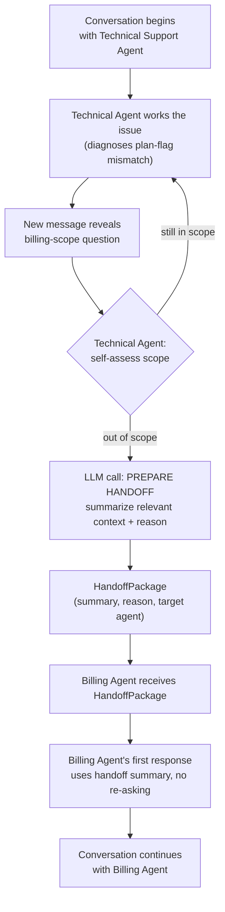

# Pattern 17: Agent Handoff

## 1. What is Agent Handoff?

**Agent Handoff** transfers an in-progress conversation or task from one agent to a different
agent mid-flight, carrying the relevant context forward so the new agent can pick up cleanly
without the user having to repeat themselves. This is different from Router (Pattern 8), which
makes a *single, upfront* dispatch decision before any conversation happens — Handoff can occur
*mid-conversation*, potentially multiple times, as the nature of the request changes or as one
agent recognizes it has reached the edge of its own competence.

The defining engineering challenge is **context transfer**: deciding what part of the
conversation and working state the new agent actually needs (not necessarily everything — see
below), and packaging it so the receiving agent can act as if it had been part of the
conversation from a relevant point, without the user experiencing a jarring restart.

## 2. What problem does it solves

A single agent — even a well-designed Router (Pattern 8) that dispatches accurately at the
start — can still find itself mid-conversation handling something outside its actual
competence, for a few common reasons:

- **The conversation evolves.** A technical support conversation can turn into a billing
  question halfway through ("oh wait, is this covered under my plan or will I be charged for
  the fix?") — the *initial* routing decision was correct at the time, but no longer covers
  what's being discussed.
- **Escalation is needed.** An agent recognizes a request exceeds its authority or scope (e.g.
  a large refund, a legal question) and needs to bring in a different specialist — or a human
  — without dropping the context already gathered.
- **Naive re-routing loses context.** Just sending the user back through the original router
  (Pattern 8) with only their latest message, and none of the conversation history, forces
  them to repeat everything already established — a well-known, frustrating pattern in real
  support systems ("I already explained this twice").

Agent Handoff solves this by making the *transfer itself* a first-class, structured step: the
handing-off agent produces an explicit summary of relevant context (not necessarily the full
transcript — see notes below on curation) and a reason for the handoff, which the receiving
agent uses to resume naturally.

## 3. Realistic production example: Support Conversation Escalation

**Extending the router example from Pattern 8**, but now mid-conversation rather than at
intake. A customer starts in the Technical Support agent, but the conversation reveals a
billing question the Technical agent isn't equipped to resolve accurately:

> Customer: "The Pro export feature keeps failing with an error."
> [Technical agent diagnoses: feature flag shows account is on Basic plan, not Pro]
> Customer: "Wait, I'm being charged for Pro though — why does it say Basic?"

The Technical agent has done real, useful diagnostic work (found the plan-flag mismatch) that
the Billing agent shouldn't have to redo. Instead of dropping the user back to square one, the
Technical agent **hands off** to a Billing agent, passing along a curated summary: what was
diagnosed, what's still unresolved, and why billing expertise is now needed — so the Billing
agent's first message can pick up exactly where things left off.

## 4. Architecture / Flow Diagram



## 5. Request-to-response flow, step by step

1. **Conversation starts** with an agent chosen normally (e.g. via Pattern 8's Router at
   intake).
2. **The agent works the issue** within its own scope, accumulating real findings (here, the
   Technical agent's diagnosis of the plan-flag mismatch) — this working context is exactly
   what shouldn't be thrown away at handoff.
3. **Scope self-assessment**: after each turn, the agent checks (via a lightweight structured
   call) whether the latest message is still within its domain. This is a deliberate design
   choice — rather than requiring a separate "supervisor" watching every turn (adding another
   agent and more latency), each agent is responsible for recognizing when it's out of its
   depth, similar in spirit to how a competent human support rep knows to escalate.
4. **Handoff preparation**: if out of scope, a dedicated call produces a `HandoffPackage` — a
   *curated* summary of what's relevant to the new agent (not the full raw transcript, which
   risks carrying over irrelevant noise and bloating the receiving agent's context), a clear
   reason for the handoff, and the target agent to hand off to.
5. **Receiving agent activation**: the target agent (Billing, here) is instantiated with the
   `HandoffPackage` injected as prior context — from the receiving agent's perspective, it's as
   if it had been silently listening and is now picking up the thread, not starting cold.
6. **Seamless continuation**: the receiving agent's first response directly references the
   handed-off context ("I can see from our technical investigation that your account shows
   Basic internally...") rather than asking the customer to re-explain — this is the actual
   user-facing payoff of doing the handoff carefully.
7. **Handoffs can chain**: nothing prevents the Billing agent from later handing off again
   (e.g. to a Legal agent) using the same mechanism — each handoff produces its own curated
   package rather than accumulating an ever-growing raw transcript across multiple transfers.

## 6. Why this pattern fits (and when it doesn't)

**Fits well when:**
- Conversations can genuinely shift domain mid-flight in ways that weren't predictable at
  intake.
- Real diagnostic/contextual work happens before the shift, which would be wasteful to discard
  or force the user to repeat.
- Multiple specialized agents exist and a conversation might legitimately need more than one
  of them, in sequence, over its lifetime.

**Doesn't fit when:**
- The domain is knowable upfront and stable for the whole conversation — Router (Pattern 8) at
  intake is sufficient and simpler.
- Specialists need to collaborate *simultaneously* on the same turn, not hand off exclusive
  control — that's Supervisor (Pattern 9) or Multi-Agent System (Pattern 12).
- Passing the *entire* raw conversation forward is acceptable/preferred (e.g. very short
  conversations where curation overhead isn't worth it) — a simpler "just forward the whole
  transcript" approach may suffice for low-complexity cases.

## 7. Production-quality implementation

```python
"""
Pattern 17: Agent Handoff
-------------------------------
A Technical Support agent that recognizes when a conversation has become a
billing issue, prepares a curated handoff package, and transfers control to
a Billing agent that continues seamlessly.

Run prerequisites:
    ollama pull llama3.1:8b
    pip install -U langchain langchain-core langchain-ollama pydantic

Run:
    python agent_handoff.py
"""

from __future__ import annotations

import logging
import time
from dataclasses import dataclass, field
from typing import Optional

from langchain_core.messages import HumanMessage, SystemMessage
from langchain_core.output_parsers import PydanticOutputParser
from langchain_core.exceptions import OutputParserException
from langchain_ollama import ChatOllama
from pydantic import BaseModel, Field, ValidationError

logging.basicConfig(
    level=logging.INFO,
    format="%(asctime)s | %(levelname)s | %(name)s | %(message)s",
)
logger = logging.getLogger("agent_handoff")


def invoke_structured(llm, system_content: str, user_content: str, parser, max_retries: int = 2):
    messages = [SystemMessage(content=system_content), HumanMessage(content=user_content)]
    last_error: Optional[Exception] = None
    for attempt in range(1, max_retries + 2):
        try:
            response = llm.invoke(messages)
            return parser.parse(response.content)
        except (OutputParserException, ValidationError) as e:
            last_error = e
            logger.warning(f"structured_call_failed attempt={attempt} error={e}")
            messages.append(HumanMessage(
                content="That wasn't valid JSON matching the schema. Respond again with "
                "ONLY the raw JSON object."
            ))
    raise RuntimeError(f"Structured call failed after retries: {last_error}")


# --------------------------------------------------------------------------
# Conversation state carried across turns and, potentially, across a handoff
# --------------------------------------------------------------------------
@dataclass
class ConversationTurn:
    speaker: str  # "customer" or agent name
    text: str


@dataclass
class Conversation:
    turns: list[ConversationTurn] = field(default_factory=list)

    def add(self, speaker: str, text: str) -> None:
        self.turns.append(ConversationTurn(speaker=speaker, text=text))

    def transcript(self) -> str:
        return "\n".join(f"{t.speaker}: {t.text}" for t in self.turns)


# --------------------------------------------------------------------------
# Structured schemas
# --------------------------------------------------------------------------
class ScopeCheck(BaseModel):
    still_in_scope: bool
    reason: str


class HandoffPackage(BaseModel):
    target_agent: str
    context_summary: str = Field(
        description="Curated summary of what's relevant for the receiving agent — findings, "
        "diagnosis, and open questions — NOT the full raw transcript"
    )
    handoff_reason: str


class AgentReply(BaseModel):
    reply_text: str


# --------------------------------------------------------------------------
# Base class capturing the shared handoff mechanics; specific agents extend it
# --------------------------------------------------------------------------
class HandoffCapableAgent:
    AGENT_NAME: str = "base"
    SCOPE_DESCRIPTION: str = ""  # what this agent IS responsible for
    RESPOND_SYSTEM_PROMPT: str = ""

    def __init__(self, llm: ChatOllama, max_retries: int = 2) -> None:
        self.llm = llm
        self.max_retries = max_retries
        self.scope_parser = PydanticOutputParser(pydantic_object=ScopeCheck)
        self.handoff_parser = PydanticOutputParser(pydantic_object=HandoffPackage)
        self.reply_parser = PydanticOutputParser(pydantic_object=AgentReply)

    def check_scope(self, conversation: Conversation, latest_message: str) -> ScopeCheck:
        system_content = (
            f"You are the {self.AGENT_NAME} agent. Your scope: {self.SCOPE_DESCRIPTION}\n\n"
            "Given the conversation so far and the latest customer message, decide if this "
            "is still within your scope, or if it needs a different specialist.\n\n"
            f"Respond with ONLY JSON matching this schema:\n{self.scope_parser.get_format_instructions()}"
        )
        user_content = f"CONVERSATION SO FAR:\n{conversation.transcript()}\n\nLATEST MESSAGE:\n{latest_message}"
        return invoke_structured(self.llm, system_content, user_content, self.scope_parser, self.max_retries)

    def prepare_handoff(self, conversation: Conversation, target_agent: str) -> HandoffPackage:
        system_content = (
            f"You are the {self.AGENT_NAME} agent handing off this conversation to the "
            f"{target_agent} agent. Write a CURATED summary — only what's relevant for "
            f"{target_agent} to continue effectively (findings, diagnosis, open questions). "
            "Do not just repeat the full transcript.\n\n"
            f"Respond with ONLY JSON matching this schema:\n{self.handoff_parser.get_format_instructions()}"
        )
        user_content = f"FULL CONVERSATION:\n{conversation.transcript()}\n\nTARGET AGENT: {target_agent}"
        package = invoke_structured(self.llm, system_content, user_content, self.handoff_parser, self.max_retries)
        logger.info(f"handoff_prepared from={self.AGENT_NAME} to={target_agent} "
                    f"reason={package.handoff_reason!r}")
        return package

    def respond(self, conversation: Conversation, latest_message: str,
                handoff_context: Optional[HandoffPackage] = None) -> str:
        context_note = ""
        if handoff_context:
            context_note = (
                f"\n\nYou are picking up this conversation from the {handoff_context.target_agent} "
                f"handoff. CONTEXT FROM PREVIOUS AGENT:\n{handoff_context.context_summary}\n"
                f"REASON FOR HANDOFF: {handoff_context.handoff_reason}\n"
                "Do NOT ask the customer to repeat information already covered above."
            )
        system_content = self.RESPOND_SYSTEM_PROMPT.format(
            format_instructions=self.reply_parser.get_format_instructions()
        ) + context_note
        user_content = f"CONVERSATION SO FAR:\n{conversation.transcript()}\n\nLATEST MESSAGE:\n{latest_message}"
        result = invoke_structured(self.llm, system_content, user_content, self.reply_parser, self.max_retries)
        return result.reply_text


class TechnicalSupportAgent(HandoffCapableAgent):
    AGENT_NAME = "Technical Support"
    SCOPE_DESCRIPTION = "Diagnosing product bugs, feature errors, and technical issues."
    RESPOND_SYSTEM_PROMPT = """You are a technical support agent. Diagnose the customer's
technical issue using any available context. Be specific and concrete.

Respond with ONLY a JSON object matching this schema (no markdown fences, no extra text):
{format_instructions}
"""


class BillingAgent(HandoffCapableAgent):
    AGENT_NAME = "Billing"
    SCOPE_DESCRIPTION = "Charges, plan/subscription status, invoices, pricing discrepancies."
    RESPOND_SYSTEM_PROMPT = """You are a billing agent. Help resolve the customer's billing
question using any available context, including any technical findings handed off to you.

Respond with ONLY a JSON object matching this schema (no markdown fences, no extra text):
{format_instructions}
"""


# --------------------------------------------------------------------------
# Orchestrator: runs a conversation, checking scope and handing off as needed
# --------------------------------------------------------------------------
class HandoffOrchestrator:
    def __init__(self, model_name: str = "llama3.1:8b", temperature: float = 0.2, max_retries: int = 2) -> None:
        llm = ChatOllama(model=model_name, temperature=temperature)
        self.agents: dict[str, HandoffCapableAgent] = {
            "Technical Support": TechnicalSupportAgent(llm, max_retries),
            "Billing": BillingAgent(llm, max_retries),
        }
        self.current_agent_name = "Technical Support"
        self.conversation = Conversation()
        self.pending_handoff_context: Optional[HandoffPackage] = None

    def handle_message(self, customer_message: str) -> str:
        self.conversation.add("customer", customer_message)
        current_agent = self.agents[self.current_agent_name]

        # Skip the scope check for the very first message (nothing to escalate from yet)
        if len(self.conversation.turns) > 1:
            scope = current_agent.check_scope(self.conversation, customer_message)
            if not scope.still_in_scope:
                target_name = "Billing" if self.current_agent_name == "Technical Support" else "Technical Support"
                logger.info(f"scope_exceeded agent={self.current_agent_name} reason={scope.reason!r}")

                handoff_package = current_agent.prepare_handoff(self.conversation, target_name)
                self.current_agent_name = target_name
                self.pending_handoff_context = handoff_package
                current_agent = self.agents[self.current_agent_name]

        reply = current_agent.respond(
            self.conversation, customer_message, handoff_context=self.pending_handoff_context
        )
        self.pending_handoff_context = None  # only inject once, right after the handoff
        self.conversation.add(current_agent.AGENT_NAME, reply)
        return reply


if __name__ == "__main__":
    orchestrator = HandoffOrchestrator(model_name="llama3.1:8b")

    exchange = [
        "The Pro export feature keeps failing with an error every time I try to use it.",
        "Wait, I'm being charged for the Pro plan though — why does the system say I'm on Basic?",
    ]

    for msg in exchange:
        print("\n" + "=" * 70)
        print(f"CUSTOMER: {msg}")
        print(f"[current agent: {orchestrator.current_agent_name}]")

        start = time.monotonic()
        reply = orchestrator.handle_message(msg)
        elapsed = time.monotonic() - start

        print(f"[{elapsed:.1f}s] {orchestrator.current_agent_name.upper()}: {reply}")
```

### Notes on the code

- **`check_scope` is called on every turn (after the first)** — each agent is responsible for
  recognizing when it's out of its depth, rather than relying on a separate supervising agent
  watching every message, keeping the system lean (no extra agent/LLM call needed just to
  monitor scope).
- **`prepare_handoff` explicitly produces a *curated* summary**, not the raw transcript —
  the prompt directly instructs "do not just repeat the full transcript," which matters because
  forwarding everything verbatim both wastes tokens and can bury the actually-relevant findings
  (the plan-flag mismatch) in conversational noise the receiving agent doesn't need.
- **`handoff_context` is injected only on the very next `respond()` call**
  (`self.pending_handoff_context = None` right after use) — this models a real handoff as a
  one-time context injection at the moment of transfer, not something that keeps re-injecting
  every subsequent turn once the new agent is already established in the conversation.
- **`HandoffCapableAgent` is a shared base class**, and `TechnicalSupportAgent`/`BillingAgent`
  only differ in their `AGENT_NAME`, `SCOPE_DESCRIPTION`, and `RESPOND_SYSTEM_PROMPT` — showing
  how cheaply a new handoff-capable specialist can be added to the roster (a new subclass, no
  changes to the orchestration logic).
- **Handoffs can chain in either direction** (`target_name` flips between the two agents based
  on whoever's currently active) — nothing in the orchestrator assumes handoffs only flow one
  way, so a conversation could in principle bounce between more than two specialists over its
  lifetime, each transition going through the same curated-summary mechanism.

### Versions used

- Python `3.11+`
- `langchain-core` `0.3.x`
- `langchain-ollama` `0.2.x`
- `pydantic` `2.x`
- Model: `llama3.1:8b` via local Ollama

---

**Next: [Pattern 18 — Agent Memory](18-agent-memory.md)**, covering how an agent retains and
retrieves information *across* separate conversations or sessions with the same user — not
just within a single conversation's turns, which every pattern so far has assumed resets each
time.
