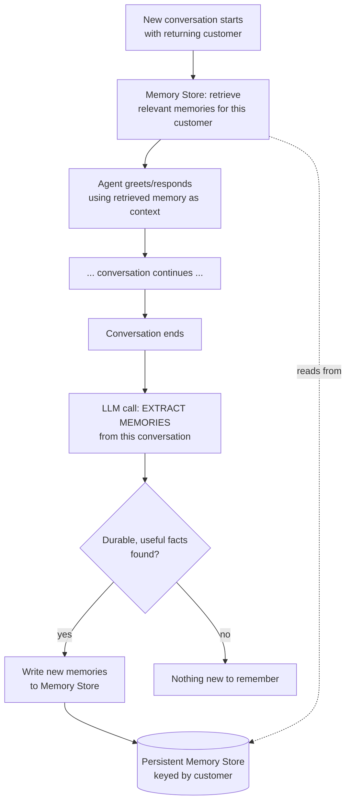

# Pattern 18: Agent Memory

## 1. What is Agent Memory?

**Agent Memory** lets an agent retain and retrieve relevant information *across* separate
conversations or sessions with the same user, not just within a single conversation's turns.
Every pattern so far has implicitly assumed a conversation starts fresh — Pattern 17's
`Conversation` object, for instance, exists only for the lifetime of that one orchestrator
instance. Agent Memory adds a persistent layer beneath that: facts, preferences, and history
that survive the conversation ending and get pulled back in the *next* time the same user
interacts with the agent, potentially days or weeks later.

A useful distinction: **short-term memory** is the current conversation's turn history (already
covered implicitly throughout this series); **long-term memory** is what this pattern adds —
durable, cross-session recall, usually requiring a deliberate decision about *what's worth
remembering* rather than storing everything.

## 2. What problem does it solves

Without persistent memory, every conversation with an agent starts from zero, which creates
real friction and missed opportunities in production:

- **Repetition burden on the user.** A returning customer has to re-explain their account
  situation, past issues, or preferences every single time, even if they mentioned it clearly
  last week.
- **Lost context that would improve service.** If a customer previously reported a recurring
  problem with a specific product, an agent that doesn't remember that can't proactively
  connect a new complaint to the known pattern.
- **No personalization over time.** An agent that can't recall a user's stated preferences
  (communication style, product interests) can't adapt to them across sessions the way a human
  who's worked with the same customer repeatedly naturally would.

Agent Memory solves this with a durable store the agent writes meaningful facts to during a
conversation and reads from at the start of future ones — critically, **selectively**: not
logging the entire transcript verbatim (which becomes noisy and eventually unusable at scale)
but extracting and storing specific, durable facts worth remembering.

## 3. Realistic production example: Returning-Customer Support Assistant

**A new example built specifically to need cross-session recall.** A support agent that talks
to the same customers repeatedly over time should:

1. At the end of a conversation, **extract memory-worthy facts** — not the whole transcript,
   but durable, useful nuggets: "prefers email over phone contact," "has had two prior issues
   with the sync feature," "is on the Enterprise plan."
2. At the start of the *next* conversation with that same customer, **retrieve relevant
   memories** and use them to personalize the greeting and response — e.g. proactively
   acknowledging a known recurring issue rather than treating it as new.
3. Avoid memory bloat: not everything said is worth remembering forever — a one-off comment
   about the weather isn't a durable fact; a stated product preference or a recurring technical
   issue is.

## 4. Architecture / Flow Diagram



## 5. Request-to-response flow, step by step

1. **Conversation begins**: before the agent's first response, it queries the memory store for
   any existing memories tied to this specific customer.
2. **Memory-informed response**: retrieved memories are injected into the system context, so
   the agent's very first message can already reflect prior knowledge ("I see you've had sync
   issues before — is this the same problem or something new?") rather than starting blind.
3. **Conversation proceeds normally** — this is standard single-session interaction, no
   different from earlier patterns.
4. **End-of-conversation extraction**: when the conversation concludes, a dedicated LLM call
   reviews the *whole* conversation and extracts specific, durable facts worth remembering —
   explicitly instructed to be selective (preferences, recurring issues, account facts) and to
   skip one-off, non-durable details.
5. **Memory write**: extracted facts are stored, keyed by customer identity, ready for
   retrieval in any future conversation.
6. **Memory accumulates, not replaces**: new facts are added to what's already known rather
   than wholesale overwriting it — though in a fuller production system, a periodic
   consolidation/summarization pass would prevent unbounded memory growth over many sessions
   (a natural extension not built out fully here, to keep focus on the core mechanism).
7. **Next conversation**: step 1 repeats, now with a growing, useful memory set for that
   customer.

## 6. Why this pattern fits (and when it doesn't)

**Fits well when:**
- The same users interact with the agent repeatedly over time, and context from past sessions
  genuinely improves future ones.
- There's a reliable way to identify "the same user" across sessions (account ID, email,
  authenticated session) — memory keyed to the wrong identity is worse than no memory.
- The domain has durable, extractable facts (preferences, recurring issues, account
  characteristics) rather than everything being one-off and session-specific.

**Doesn't fit when:**
- Interactions are genuinely anonymous or one-off — there's no consistent identity to key
  memory to, and building the mechanism would be wasted effort.
- Privacy/compliance constraints make persisting user-specific data across sessions
  inappropriate without explicit consent and retention controls — memory systems need real
  data governance, not just a technical implementation.
- The task is stateless by design (see **Stateless Agent**, Pattern 26) — some agents are
  deliberately built to not carry any state between calls, and adding memory would violate
  that design intent.

## 7. Production-quality implementation

```python
"""
Pattern 18: Agent Memory
------------------------------
A returning-customer support assistant that retrieves relevant memories at
the start of a conversation and extracts new durable facts at the end,
persisting them for future sessions.

Run prerequisites:
    ollama pull llama3.1:8b
    pip install -U langchain langchain-core langchain-ollama pydantic

Run:
    python agent_memory.py
"""

from __future__ import annotations

import json
import logging
import time
from dataclasses import dataclass, field
from datetime import datetime
from pathlib import Path
from typing import Optional

from langchain_core.messages import HumanMessage, SystemMessage
from langchain_core.output_parsers import PydanticOutputParser
from langchain_core.exceptions import OutputParserException
from langchain_ollama import ChatOllama
from pydantic import BaseModel, Field, ValidationError

logging.basicConfig(
    level=logging.INFO,
    format="%(asctime)s | %(levelname)s | %(name)s | %(message)s",
)
logger = logging.getLogger("agent_memory")


def invoke_structured(llm, system_content: str, user_content: str, parser, max_retries: int = 2):
    messages = [SystemMessage(content=system_content), HumanMessage(content=user_content)]
    last_error: Optional[Exception] = None
    for attempt in range(1, max_retries + 2):
        try:
            response = llm.invoke(messages)
            return parser.parse(response.content)
        except (OutputParserException, ValidationError) as e:
            last_error = e
            logger.warning(f"structured_call_failed attempt={attempt} error={e}")
            messages.append(HumanMessage(
                content="That wasn't valid JSON matching the schema. Respond again with "
                "ONLY the raw JSON object."
            ))
    raise RuntimeError(f"Structured call failed after retries: {last_error}")


# --------------------------------------------------------------------------
# Persistent Memory Store — file-backed JSON here (same pattern as Pattern
# 16's CheckpointStore); a real system would use a proper database, likely
# with a vector index for semantic retrieval at larger memory volumes.
# --------------------------------------------------------------------------
@dataclass
class Memory:
    fact: str
    category: str  # "preference", "recurring_issue", "account_fact"
    created_at: str = field(default_factory=lambda: datetime.utcnow().isoformat())


class MemoryStore:
    def __init__(self, path: str = "customer_memories.json") -> None:
        self.path = Path(path)
        if not self.path.exists():
            self.path.write_text("{}")

    def _load_all(self) -> dict:
        return json.loads(self.path.read_text())

    def _save_all(self, data: dict) -> None:
        self.path.write_text(json.dumps(data, indent=2))

    def get_memories(self, customer_id: str) -> list[Memory]:
        data = self._load_all()
        records = data.get(customer_id, [])
        return [Memory(**r) for r in records]

    def add_memories(self, customer_id: str, new_memories: list[Memory]) -> None:
        data = self._load_all()
        existing = data.get(customer_id, [])
        existing.extend(m.__dict__ for m in new_memories)
        data[customer_id] = existing
        self._save_all(data)
        logger.info(f"memories_stored customer_id={customer_id} count={len(new_memories)}")


# --------------------------------------------------------------------------
# Structured schemas
# --------------------------------------------------------------------------
class ExtractedMemory(BaseModel):
    fact: str = Field(description="A specific, durable, useful fact worth remembering")
    category: str = Field(description="'preference', 'recurring_issue', or 'account_fact'")


class MemoryExtractionResult(BaseModel):
    memories: list[ExtractedMemory] = Field(
        description="Only durable, genuinely useful facts. Empty list if nothing worth "
        "remembering came up in this conversation."
    )


class AgentReply(BaseModel):
    reply_text: str


# --------------------------------------------------------------------------
# The Memory-Enabled Support Agent
# --------------------------------------------------------------------------
class ReturningCustomerAgent:
    """Retrieves relevant memories at conversation start, uses them to
    personalize responses, and extracts new durable facts at conversation
    end for future sessions."""

    RESPOND_SYSTEM_PROMPT = """You are a customer support agent. Use any known facts about
this returning customer to personalize your response naturally — e.g. proactively
acknowledging a known recurring issue rather than treating it as brand new. Don't awkwardly
recite the facts back verbatim; weave them in naturally.

KNOWN FACTS ABOUT THIS CUSTOMER:
{memories}

Respond with ONLY a JSON object matching this schema (no markdown fences, no extra text):
{format_instructions}
"""

    EXTRACTION_PROMPT = """Review this completed conversation and extract only DURABLE,
genuinely useful facts worth remembering for future conversations with this same customer:
stated preferences, recurring issues, or notable account facts.

Do NOT extract one-off details that won't matter next time (e.g. small talk, a single
non-recurring complaint already fully resolved). Be selective — most conversations produce
zero or very few memories worth keeping.

CONVERSATION:
{transcript}

Respond with ONLY a JSON object matching this schema (no markdown fences, no extra text):
{format_instructions}
"""

    def __init__(self, model_name: str = "llama3.1:8b", temperature: float = 0.3,
                 max_retries: int = 2, memory_store: Optional[MemoryStore] = None) -> None:
        self.llm = ChatOllama(model=model_name, temperature=temperature)
        self.max_retries = max_retries
        self.store = memory_store or MemoryStore()

        self.reply_parser = PydanticOutputParser(pydantic_object=AgentReply)
        self.extraction_parser = PydanticOutputParser(pydantic_object=MemoryExtractionResult)

    def _format_memories(self, memories: list[Memory]) -> str:
        if not memories:
            return "No prior history with this customer."
        return "\n".join(f"- [{m.category}] {m.fact}" for m in memories)

    def respond(self, customer_id: str, transcript_so_far: str, latest_message: str) -> str:
        memories = self.store.get_memories(customer_id)
        system_content = self.RESPOND_SYSTEM_PROMPT.format(
            memories=self._format_memories(memories),
            format_instructions=self.reply_parser.get_format_instructions(),
        )
        user_content = f"CONVERSATION SO FAR:\n{transcript_so_far}\n\nLATEST MESSAGE:\n{latest_message}"
        result = invoke_structured(self.llm, system_content, user_content, self.reply_parser, self.max_retries)
        return result.reply_text

    def end_conversation_and_extract_memories(self, customer_id: str, full_transcript: str) -> list[Memory]:
        system_content = self.EXTRACTION_PROMPT.format(
            transcript=full_transcript,
            format_instructions=self.extraction_parser.get_format_instructions(),
        )
        result = invoke_structured(
            self.llm, system_content, "Extract memories.", self.extraction_parser, self.max_retries
        )
        new_memories = [Memory(fact=m.fact, category=m.category) for m in result.memories]
        if new_memories:
            self.store.add_memories(customer_id, new_memories)
        logger.info(f"extraction_complete customer_id={customer_id} new_memory_count={len(new_memories)}")
        return new_memories


if __name__ == "__main__":
    store = MemoryStore(path="demo_customer_memories.json")
    agent = ReturningCustomerAgent(model_name="llama3.1:8b", memory_store=store)

    customer_id = "cust_8842"

    # --- SESSION 1: first-time interaction, no memory yet ---
    print("=" * 70)
    print("--- SESSION 1 (no prior memory) ---")
    transcript_1 = ""
    msg1 = "Hi, the file sync feature keeps failing on my end, this is the second time this month."
    print(f"CUSTOMER: {msg1}")
    reply1 = agent.respond(customer_id, transcript_1, msg1)
    print(f"AGENT: {reply1}")
    transcript_1 += f"customer: {msg1}\nagent: {reply1}\n"

    msg2 = "Also, please only email me — I never check my phone for calls."
    print(f"\nCUSTOMER: {msg2}")
    reply2 = agent.respond(customer_id, transcript_1, msg2)
    print(f"AGENT: {reply2}")
    transcript_1 += f"customer: {msg2}\nagent: {reply2}\n"

    print("\n--- Ending session 1: extracting memories ---")
    new_memories = agent.end_conversation_and_extract_memories(customer_id, transcript_1)
    for m in new_memories:
        print(f"  [{m.category}] {m.fact}")

    # --- SESSION 2: later conversation, memory should now inform the reply ---
    print("\n" + "=" * 70)
    print("--- SESSION 2 (with prior memory) ---")
    msg3 = "Hey, having sync trouble again."
    print(f"CUSTOMER: {msg3}")

    start = time.monotonic()
    reply3 = agent.respond(customer_id, "", msg3)
    elapsed = time.monotonic() - start
    print(f"[{elapsed:.1f}s] AGENT: {reply3}")
```

### Notes on the code

- **Memory extraction happens once, at conversation end, over the full transcript** — not
  incrementally after every turn — which is both cheaper (one extraction call instead of one
  per turn) and produces better-curated memories, since the extraction call can see the whole
  arc of the conversation rather than guessing what will turn out to matter mid-conversation.
- **The extraction prompt is explicitly biased toward selectivity** ("most conversations
  produce zero or very few memories worth keeping") — this is a deliberate design choice to
  prevent memory bloat; a memory store that grows by several facts per session regardless of
  actual durability quickly becomes noisy and less useful to retrieve from.
- **`MemoryStore` is file-backed JSON here for a runnable, self-contained demo**, exactly
  mirroring Pattern 16's `CheckpointStore` design — the interface (`get_memories`,
  `add_memories`) is what matters; a production system would likely swap in a real database,
  and at large memory volumes per customer, a vector store for semantic retrieval (rather than
  "return everything for this customer ID") to keep the injected context focused and bounded.
- **Memories are injected as a compact bullet list**, not the raw conversation they came from
  — the agent sees curated facts ("prefers email over phone"), not "customer said on March 3rd
  that they never check their phone" — keeping the injected context small and directly usable.
- **This pattern composes naturally with Pattern 17's handoff mechanism**: a `HandoffPackage`
  is curated context for a single in-flight conversation transfer; `Memory` entries are curated
  context that persists *across* conversations entirely — same underlying discipline
  ("summarize what's relevant, don't forward everything raw") applied at two different
  timescales.

### Versions used

- Python `3.11+`
- `langchain-core` `0.3.x`
- `langchain-ollama` `0.2.x`
- `pydantic` `2.x`
- Model: `llama3.1:8b` via local Ollama

---

**Next: [Pattern 19 — Agent Planning](19-agent-planning.md)**, revisiting planning with a
sharper focus than Pattern 4: dynamic, goal-decomposition-driven planning where the agent
breaks an ambiguous, high-level goal into concrete sub-goals itself, rather than following a
fixed catalog of known tool-backed steps.
