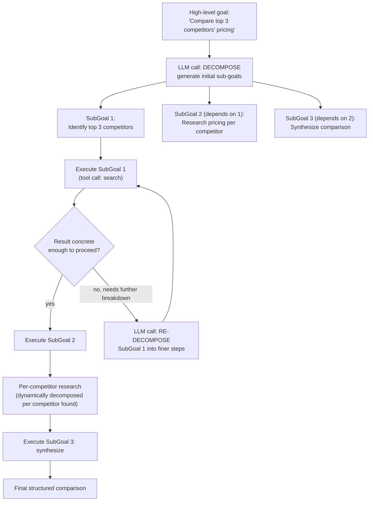

# Pattern 19: Agent Planning

## 1. What is Agent Planning?

**Agent Planning** (distinct from Pattern 4's Planning Agent) focuses on **dynamic goal
decomposition**: given an ambiguous, high-level goal with no predetermined set of steps, the
agent itself figures out what sub-goals need to happen, in what order, and only then executes
them — re-decomposing as needed when a sub-goal turns out to be more complex than expected.

Pattern 4's Planning Agent worked from a **fixed, known catalog** of tool-backed steps (check
eligibility → calculate refund → issue refund) — the *possible* steps were enumerable in
advance, and the LLM's job was just picking and ordering from them. Agent Planning instead
tackles goals where the steps themselves aren't known ahead of time and must be *invented* by
reasoning about the goal — closer to how a competent person facing a genuinely open-ended
project decides what needs to happen, rather than filling out a known checklist.

## 2. What problem does it solves

Pattern 4's Planning Agent (and even ReAct, Pattern 3) work well when the space of *possible*
actions is small and known — you're choosing from a fixed toolbox. But some real goals are
open-ended enough that no fixed toolbox covers them:

- "Prepare a competitive analysis of our top 3 competitors' pricing strategies" has no fixed
  list of steps — what needs researching depends entirely on who the competitors turn out to
  be and what's actually publicly known about each.
- "Draft an onboarding plan for a new engineering hire" decomposes differently depending on
  their role, seniority, and team — there's no single fixed checklist that fits every case.

Feeding a goal like this into a fixed-step planner (Pattern 4) either forces an awkward fit
into steps that don't really apply, or requires constantly hand-updating the fixed step catalog
as new kinds of goals appear. Agent Planning solves this by having the agent **generate its own
sub-goals from the goal itself**, recursively decomposing until sub-goals are concrete enough
to execute directly — and revising the decomposition if execution reveals it was wrong,
similar in spirit to Pattern 4's replan step, but starting from "invent the plan" rather than
"select from known steps."

## 3. Realistic production example: Competitive Pricing Research Agent

**A new example chosen specifically because the steps genuinely can't be known in advance.**
Given a high-level research goal —

> "Research how our top 3 competitors in the project-management-software space price their
> products, and summarize the pricing strategy differences."

— the agent must first figure out *who* the top 3 competitors even are (this alone isn't
fixed), then decompose "research pricing for competitor X" into whatever sub-goals make sense
for that specific competitor (some have public pricing pages; others require inferring from
marketing materials), then synthesize a comparison. None of this fits a fixed step catalog —
the plan has to be generated from the goal itself, using a real web-search-style tool to ground
findings (mirroring Pattern 2's tool-grounding discipline, applied here to research instead of
order lookups).

## 4. Architecture / Flow Diagram



## 5. Request-to-response flow, step by step

1. **Goal arrives**: an open-ended, high-level objective with no predetermined step list.
2. **Initial decomposition call**: an LLM call breaks the goal into an ordered list of
   sub-goals — not tool calls yet, just *what needs to happen*, with dependencies between them
   noted (sub-goal 2 needs sub-goal 1's output).
3. **Execute sub-goals in dependency order**: each sub-goal is attempted — using a tool
   (simulated web search, here) where grounding is needed, matching the "don't let the model
   invent facts" discipline from every tool-using pattern in this series.
4. **Concreteness check**: after each sub-goal executes, the agent checks whether the result is
   concrete enough to feed the next sub-goal, or whether this sub-goal itself needs further
   breakdown (e.g. "research pricing for competitor X" might itself decompose into "find their
   pricing page" + "check for enterprise/custom pricing mentions" once X is known) — this
   *recursive* re-decomposition is the key structural difference from Pattern 4's flat,
   single-pass plan.
5. **Dynamic sub-goal generation**: critically, sub-goal 2 ("research pricing per competitor")
   isn't fully known until sub-goal 1 resolves *which* competitors exist — so the plan for
   sub-goal 2 is generated dynamically once that's known, not written out fully at the start.
6. **Synthesis**: once all necessary research sub-goals are complete, a final call synthesizes
   the gathered, grounded findings into the requested comparison.
7. **Bounded recursion**: same safety discipline as every multi-step pattern in this series —
   a max-depth/max-sub-goals limit prevents runaway decomposition on a goal that's too vague to
   ever "bottom out" into concrete, executable steps.

## 6. Why this pattern fits (and when it doesn't)

**Fits well when:**
- The goal is genuinely open-ended and the right steps can't be enumerated in advance.
- Sub-goals depend on the *results* of earlier sub-goals in ways that change what further
  decomposition is needed (not just "do these fixed steps in this fixed order").
- The task is research/investigation-flavored rather than action-flavored (fewer real-world
  side effects to worry about than Pattern 4's refund/replacement actions, which reduces the
  need for a strict pre-approval gate — though one could still be added for higher-stakes
  open-ended goals).

**Doesn't fit when:**
- The steps really are knowable and fixed in advance — Pattern 4's simpler, non-recursive
  Planning Agent is a better fit and avoids the overhead/risk of open-ended decomposition.
- The goal is narrow enough that a single ReAct loop (Pattern 3) can handle it without needing
  an explicit upfront decomposition step.
- Latency/cost budgets can't absorb the potentially large number of LLM calls open-ended
  recursive decomposition can produce on a genuinely broad goal.

## 7. Production-quality implementation

```python
"""
Pattern 19: Agent Planning
--------------------------------
A competitive pricing research agent that dynamically decomposes an
open-ended goal into sub-goals, executing and re-decomposing as needed,
rather than following a fixed step catalog.

Run prerequisites:
    ollama pull llama3.1:8b
    pip install -U langchain langchain-core langchain-ollama pydantic

Run:
    python agent_planning.py
"""

from __future__ import annotations

import json
import logging
import time
from enum import Enum
from typing import Optional

from langchain_core.messages import HumanMessage, SystemMessage
from langchain_core.output_parsers import PydanticOutputParser
from langchain_core.exceptions import OutputParserException
from langchain_ollama import ChatOllama
from pydantic import BaseModel, Field, ValidationError

logging.basicConfig(
    level=logging.INFO,
    format="%(asctime)s | %(levelname)s | %(name)s | %(message)s",
)
logger = logging.getLogger("agent_planning")


def invoke_structured(llm, system_content: str, user_content: str, parser, max_retries: int = 2):
    messages = [SystemMessage(content=system_content), HumanMessage(content=user_content)]
    last_error: Optional[Exception] = None
    for attempt in range(1, max_retries + 2):
        try:
            response = llm.invoke(messages)
            return parser.parse(response.content)
        except (OutputParserException, ValidationError) as e:
            last_error = e
            logger.warning(f"structured_call_failed attempt={attempt} error={e}")
            messages.append(HumanMessage(
                content="That wasn't valid JSON matching the schema. Respond again with "
                "ONLY the raw JSON object."
            ))
    raise RuntimeError(f"Structured call failed after retries: {last_error}")


# --------------------------------------------------------------------------
# Simulated web search tool — stands in for a real search API, grounding
# the research in "facts" rather than letting the model invent pricing data
# --------------------------------------------------------------------------
_FAKE_SEARCH_INDEX = {
    "top project management software competitors": [
        "Asana, Monday.com, and ClickUp are frequently cited as leading competitors "
        "in the project management software space."
    ],
    "asana pricing": [
        "Asana offers a free tier, a Starter tier at $10.99/user/month, and an "
        "Advanced tier at $24.99/user/month (billed annually), plus custom Enterprise pricing."
    ],
    "monday.com pricing": [
        "Monday.com's Basic tier starts at $9/user/month, Standard at $12/user/month, "
        "Pro at $19/user/month, and Enterprise is custom-priced, all billed annually."
    ],
    "clickup pricing": [
        "ClickUp has a free Forever tier, an Unlimited tier at $7/user/month, a "
        "Business tier at $12/user/month, and custom Enterprise pricing."
    ],
}


def fake_web_search(query: str) -> str:
    key = query.lower().strip()
    for indexed_query, results in _FAKE_SEARCH_INDEX.items():
        if indexed_query in key or key in indexed_query:
            return " ".join(results)
    return f"No results found for query: {query}"


# --------------------------------------------------------------------------
# Structured schemas for the planning/execution loop
# --------------------------------------------------------------------------
class SubGoalStatus(str, Enum):
    PENDING = "pending"
    COMPLETE = "complete"
    NEEDS_FURTHER_BREAKDOWN = "needs_further_breakdown"


class SubGoal(BaseModel):
    description: str
    depends_on_previous: bool = Field(
        description="True if this sub-goal needs the previous sub-goal's result to proceed"
    )
    status: SubGoalStatus = SubGoalStatus.PENDING
    result: Optional[str] = None


class DecompositionResult(BaseModel):
    sub_goals: list[SubGoal]


class SearchDecision(BaseModel):
    needs_search: bool
    search_query: Optional[str] = None


class SubGoalOutcome(BaseModel):
    result_summary: str
    concrete_enough: bool = Field(
        description="False if this sub-goal is too broad/vague and needs further breakdown "
        "into finer sub-goals before it can be considered done"
    )


class FinalSynthesis(BaseModel):
    comparison_summary: str


# --------------------------------------------------------------------------
# The Agent Planning orchestrator
# --------------------------------------------------------------------------
class CompetitivePricingResearchAgent:
    """Dynamically decomposes an open-ended research goal into sub-goals,
    executing (with tool grounding) and re-decomposing as needed."""

    DECOMPOSE_PROMPT = """Break this research goal into an ordered list of concrete sub-goals.
Mark depends_on_previous=true if a sub-goal genuinely needs the prior sub-goal's result before
it can be attempted (e.g. you can't research per-competitor pricing until you know who the
competitors are).

GOAL: {goal}

Respond with ONLY a JSON object matching this schema (no markdown fences, no extra text):
{format_instructions}
"""

    SEARCH_DECISION_PROMPT = """For this sub-goal, decide if a web search is needed to find
real information, and if so, what query to use.

SUB-GOAL: {sub_goal}
CONTEXT SO FAR: {context}

Respond with ONLY a JSON object matching this schema (no markdown fences, no extra text):
{format_instructions}
"""

    OUTCOME_PROMPT = """Given this sub-goal and the search result (if any), summarize the
outcome. Set concrete_enough=false if the result is too vague/broad to use directly and this
sub-goal genuinely needs to be broken down further into finer sub-goals.

SUB-GOAL: {sub_goal}
SEARCH RESULT: {search_result}

Respond with ONLY a JSON object matching this schema (no markdown fences, no extra text):
{format_instructions}
"""

    FURTHER_BREAKDOWN_PROMPT = """This sub-goal was too broad to execute directly. Break it
into 2-4 finer, more concrete sub-goals.

ORIGINAL SUB-GOAL: {sub_goal}
CONTEXT SO FAR: {context}

Respond with ONLY a JSON object matching this schema (no markdown fences, no extra text):
{format_instructions}
"""

    SYNTHESIS_PROMPT = """Synthesize all the research findings below into a clear comparison
of pricing strategies across the competitors.

FINDINGS:
{findings}

Respond with ONLY a JSON object matching this schema (no markdown fences, no extra text):
{format_instructions}
"""

    def __init__(self, model_name: str = "llama3.1:8b", temperature: float = 0.2,
                 max_retries: int = 2, max_sub_goals: int = 15) -> None:
        self.llm = ChatOllama(model=model_name, temperature=temperature)
        self.max_retries = max_retries
        self.max_sub_goals = max_sub_goals

        self.decompose_parser = PydanticOutputParser(pydantic_object=DecompositionResult)
        self.search_decision_parser = PydanticOutputParser(pydantic_object=SearchDecision)
        self.outcome_parser = PydanticOutputParser(pydantic_object=SubGoalOutcome)
        self.synthesis_parser = PydanticOutputParser(pydantic_object=FinalSynthesis)

    def _decompose(self, goal: str) -> list[SubGoal]:
        system_content = self.DECOMPOSE_PROMPT.format(
            goal=goal, format_instructions=self.decompose_parser.get_format_instructions()
        )
        result = invoke_structured(self.llm, system_content, "Decompose the goal.",
                                    self.decompose_parser, self.max_retries)
        logger.info(f"decomposed_into={len(result.sub_goals)}_sub_goals")
        return result.sub_goals

    def _execute_sub_goal(self, sub_goal: SubGoal, context: str) -> SubGoalOutcome:
        # 1. Decide if search is needed
        system_content = self.SEARCH_DECISION_PROMPT.format(
            sub_goal=sub_goal.description, context=context,
            format_instructions=self.search_decision_parser.get_format_instructions(),
        )
        decision = invoke_structured(self.llm, system_content, "Decide.",
                                      self.search_decision_parser, self.max_retries)

        search_result = "N/A"
        if decision.needs_search and decision.search_query:
            search_result = fake_web_search(decision.search_query)
            logger.info(f"search_executed query={decision.search_query!r} result={search_result[:80]!r}")

        # 2. Summarize outcome and assess concreteness
        system_content = self.OUTCOME_PROMPT.format(
            sub_goal=sub_goal.description, search_result=search_result,
            format_instructions=self.outcome_parser.get_format_instructions(),
        )
        return invoke_structured(self.llm, system_content, "Summarize the outcome.",
                                  self.outcome_parser, self.max_retries)

    def _further_breakdown(self, sub_goal: SubGoal, context: str) -> list[SubGoal]:
        system_content = self.FURTHER_BREAKDOWN_PROMPT.format(
            sub_goal=sub_goal.description, context=context,
            format_instructions=self.decompose_parser.get_format_instructions(),
        )
        result = invoke_structured(self.llm, system_content, "Break it down further.",
                                    self.decompose_parser, self.max_retries)
        logger.info(f"further_broken_down original={sub_goal.description!r} into={len(result.sub_goals)}")
        return result.sub_goals

    def research(self, goal: str) -> FinalSynthesis:
        sub_goals = self._decompose(goal)
        completed_results: list[str] = []
        total_executed = 0

        i = 0
        while i < len(sub_goals):
            if total_executed >= self.max_sub_goals:
                logger.warning(f"max_sub_goals_reached limit={self.max_sub_goals}, stopping early")
                break

            sub_goal = sub_goals[i]
            context = "\n".join(completed_results)
            outcome = self._execute_sub_goal(sub_goal, context)
            total_executed += 1

            if outcome.concrete_enough:
                sub_goal.status = SubGoalStatus.COMPLETE
                sub_goal.result = outcome.result_summary
                completed_results.append(f"[{sub_goal.description}] {outcome.result_summary}")
                logger.info(f"sub_goal_complete description={sub_goal.description!r}")
                i += 1
            else:
                # Recursive re-decomposition: replace this sub-goal with finer ones,
                # inserted right where it was, and retry from there.
                sub_goal.status = SubGoalStatus.NEEDS_FURTHER_BREAKDOWN
                finer_sub_goals = self._further_breakdown(sub_goal, context)
                sub_goals[i:i + 1] = finer_sub_goals
                # don't increment i — retry at the same position with the new, finer sub-goal

        findings_text = "\n".join(completed_results)
        system_content = self.SYNTHESIS_PROMPT.format(
            findings=findings_text, format_instructions=self.synthesis_parser.get_format_instructions()
        )
        return invoke_structured(self.llm, system_content, "Synthesize.",
                                  self.synthesis_parser, self.max_retries)


if __name__ == "__main__":
    agent = CompetitivePricingResearchAgent(model_name="llama3.1:8b", max_sub_goals=15)

    goal = (
        "Research how our top 3 competitors in the project-management-software space price "
        "their products, and summarize the pricing strategy differences."
    )

    print("=" * 70)
    print(f"GOAL: {goal}")

    start = time.monotonic()
    result = agent.research(goal)
    elapsed = time.monotonic() - start

    print(f"\n--- FINAL SYNTHESIS ({elapsed:.1f}s) ---")
    print(result.comparison_summary)
```

### Notes on the code

- **`_decompose` produces sub-goals as *descriptions*, not fixed tool calls** — contrast with
  Pattern 4's `PlanStep`, which had a `tool_name: Literal[...]` field constrained to a known,
  fixed set of tools. Here, what each sub-goal actually requires (search or not, what query) is
  decided *at execution time* per sub-goal via `_execute_sub_goal`'s own search-decision call,
  because it can't be known upfront.
- **The `while i < len(sub_goals)` loop with `sub_goals[i:i+1] = finer_sub_goals`** is the
  concrete mechanism for recursive re-decomposition: when a sub-goal turns out too broad, it's
  replaced in-place by its own finer breakdown, and the loop retries at the same index — this
  is what allows the *total* plan to grow dynamically as execution reveals more structure,
  unlike Pattern 4's plan, which is fixed once generated.
- **`max_sub_goals` is the safety circuit-breaker** for this pattern's specific risk: a goal
  vague enough to never "bottom out" into concrete, executable sub-goals could otherwise
  decompose indefinitely — this cap ensures the agent stops and returns partial findings rather
  than looping forever.
- **`fake_web_search` grounds the research in fixed "facts"**, same discipline as every
  tool-using pattern in this series — the agent never invents competitor pricing numbers itself;
  it only ever reports what the (simulated) search tool actually returned.
- **The final synthesis only sees `completed_results`** (grounded, concrete findings), never
  the raw sub-goal descriptions or intermediate broad/vague attempts — keeping the synthesis
  call focused on actual gathered facts, not the messier planning process that produced them.

### Versions used

- Python `3.11+`
- `langchain-core` `0.3.x`
- `langchain-ollama` `0.2.x`
- `pydantic` `2.x`
- Model: `llama3.1:8b` via local Ollama

---

**Next: [Pattern 20 — Agentic RAG](20-agentic-rag.md)**, where retrieval itself becomes an
active, agent-driven decision — deciding *whether* to retrieve, *what* to retrieve, and
*whether retrieved information is sufficient* — rather than a fixed retrieve-then-generate
step.
