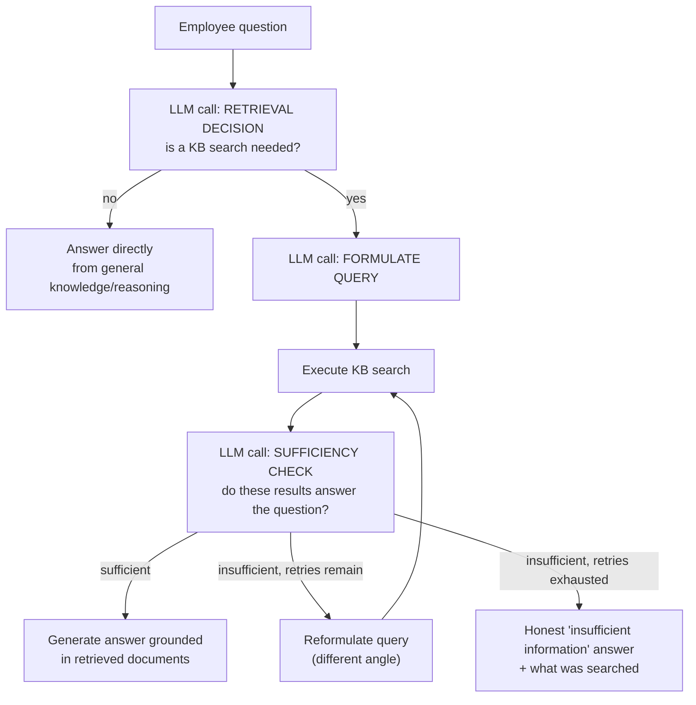

# Pattern 20: Agentic RAG

## 1. What is Agentic RAG?

**Agentic RAG** (Retrieval-Augmented Generation) makes retrieval itself an active, agent-driven
decision rather than a fixed pipeline step. Classic RAG is: user asks a question → always
retrieve top-k documents → always generate an answer from them, every time, no matter what.
Agentic RAG instead lets the model decide **whether retrieval is even needed**, **what to
search for** (which may take several attempts, refining the query), and **whether what came
back is actually sufficient** to answer confidently — retrieving again with a different query
if not, or answering directly from general knowledge if retrieval isn't needed at all.

This turns retrieval from a fixed preprocessing step into something closer to a tool the agent
uses judgment about, on par with the tool-calling discipline from Pattern 2 — in fact, agentic
RAG is really Pattern 2/3's tool-use pattern (ReAct) applied specifically to a search/retrieval
tool, with an explicit "is this enough?" evaluation step layered on top.

## 2. What problem does it solves

Fixed-pipeline RAG (always retrieve, always use exactly what came back) has real, well-known
failure modes in production:

- **Retrieving when it's not needed** wastes latency and can actively hurt quality — injecting
  irrelevant retrieved chunks into context can distract the model from a question it could have
  answered correctly on its own (e.g. "what's 15% of 200?" doesn't need a knowledge-base
  lookup).
- **A single, fixed query often isn't the best query.** The user's literal question isn't
  always the best search query — "why does my invoice look wrong" might need a search for
  "billing cycle proration" to actually surface the relevant documentation.
- **Blindly trusting retrieved results even when they're insufficient or irrelevant.** Fixed
  RAG generates an answer from whatever came back, even if the top-k results don't actually
  address the question — producing a confidently wrong or unhelpfully vague answer instead of
  recognizing the gap and searching again or saying "I don't have enough information."

Agentic RAG solves this by treating each of these as an explicit decision point: retrieve or
not, what query to use (with the option to reformulate), and whether the results are sufficient
before committing to an answer.

## 3. Realistic production example: Internal Knowledge Base Assistant

**A new example well-suited to this pattern's decision points.** An internal assistant answers
employee questions using a company knowledge base (policies, how-tos, past incident reports).
Given a mix of question types:

- "What's 20% of our Q3 revenue target if it was $2M?" — pure arithmetic, **no retrieval
  needed**.
- "What's our policy on expensing home office equipment?" — needs retrieval, and the first
  search might return generic results, requiring a **refined query** ("home office equipment
  reimbursement policy").
- "How do I fix the thing that broke last Tuesday?" — vague enough that even a good search may
  come back **insufficient**, requiring the agent to say so rather than guess.

## 4. Architecture / Flow Diagram



## 5. Request-to-response flow, step by step

1. **Question arrives.**
2. **Retrieval decision**: a first LLM call decides whether this question actually needs
   knowledge-base retrieval at all, or can be answered directly (general reasoning,
   arithmetic, or something already established earlier in the conversation) — this single
   decision point is what separates Agentic RAG from a fixed pipeline that always retrieves.
3. **Query formulation**: if retrieval is needed, a call turns the question into a good search
   query — not necessarily the user's literal words, since the best search phrasing and the
   most natural way to ask a question often differ.
4. **Retrieval executes** against the knowledge base (a simulated document store here, standing
   in for a real vector/keyword search backend).
5. **Sufficiency check**: a dedicated call evaluates whether the retrieved documents actually
   contain what's needed to answer the question — not just "were any documents returned," but
   "do they substantively address this specific question."
6. **Retry with reformulation**: if insufficient and retries remain, the agent formulates a
   *different* query (informed by knowing the first one didn't work) and searches again —
   mirroring ReAct's adaptive step-by-step reasoning (Pattern 3), applied specifically to
   search query refinement.
7. **Grounded generation or honest gap**: once sufficient results are found, the final answer
   is generated strictly from those documents (same "don't invent facts" discipline as every
   tool-grounded pattern in this series). If retries are exhausted without sufficient results,
   the agent says so explicitly rather than guessing — mirroring Pattern 5's
   `needs_human_review` honesty and Pattern 12's honest escalation on non-convergence.

## 6. Why this pattern fits (and when it doesn't)

**Fits well when:**
- Only some questions actually need retrieval — a meaningful fraction can be answered directly,
  and unconditional retrieval would waste latency/cost on those.
- The best search query often isn't the user's literal phrasing, and a single fixed query
  regularly misses relevant documents.
- Getting a wrong or vague answer from insufficient retrieved context is worse than admitting
  the knowledge base doesn't have the answer.

**Doesn't fit when:**
- Every question genuinely needs the same retrieval step, with no benefit to skipping it or
  varying the query — classic fixed-pipeline RAG is simpler and has less overhead.
- Latency is extremely tight and the extra decision/sufficiency-check calls aren't worth their
  cost for a use case where "good enough" fixed retrieval already performs acceptably.
- The knowledge base is small/simple enough that query reformulation rarely helps in practice —
  the added complexity wouldn't pay for itself.

## 7. Production-quality implementation

```python
"""
Pattern 20: Agentic RAG
-----------------------------
An internal knowledge-base assistant that decides whether to retrieve,
formulates and refines search queries, and checks sufficiency before
generating a grounded answer — or honestly reporting a gap.

Run prerequisites:
    ollama pull llama3.1:8b
    pip install -U langchain langchain-core langchain-ollama pydantic

Run:
    python agentic_rag.py
"""

from __future__ import annotations

import logging
import time
from typing import Optional

from langchain_core.messages import HumanMessage, SystemMessage
from langchain_core.output_parsers import PydanticOutputParser
from langchain_core.exceptions import OutputParserException
from langchain_ollama import ChatOllama
from pydantic import BaseModel, Field, ValidationError

logging.basicConfig(
    level=logging.INFO,
    format="%(asctime)s | %(levelname)s | %(name)s | %(message)s",
)
logger = logging.getLogger("agentic_rag")


def invoke_structured(llm, system_content: str, user_content: str, parser, max_retries: int = 2):
    messages = [SystemMessage(content=system_content), HumanMessage(content=user_content)]
    last_error: Optional[Exception] = None
    for attempt in range(1, max_retries + 2):
        try:
            response = llm.invoke(messages)
            return parser.parse(response.content)
        except (OutputParserException, ValidationError) as e:
            last_error = e
            logger.warning(f"structured_call_failed attempt={attempt} error={e}")
            messages.append(HumanMessage(
                content="That wasn't valid JSON matching the schema. Respond again with "
                "ONLY the raw JSON object."
            ))
    raise RuntimeError(f"Structured call failed after retries: {last_error}")


# --------------------------------------------------------------------------
# Simulated knowledge base — a simple keyword-overlap "search" standing in
# for a real vector store; the mechanism (retrieve -> evaluate -> maybe
# retry) is the focus here, not the retrieval implementation itself.
# --------------------------------------------------------------------------
_KNOWLEDGE_BASE = [
    {"id": "kb1", "title": "Home Office Equipment Reimbursement Policy",
     "content": "Employees may expense up to $500/year for home office equipment "
                "(monitors, chairs, keyboards) with manager approval and a submitted receipt. "
                "Reimbursement requests must be filed within 60 days of purchase."},
    {"id": "kb2", "title": "Expense Report Submission Guide",
     "content": "All expense reports must be submitted through the Expenses portal within "
                "30 days of the expense. Receipts are required for any expense over $25."},
    {"id": "kb3", "title": "Remote Work Policy",
     "content": "Employees may work remotely up to 3 days per week with manager approval. "
                "Full-time remote arrangements require VP-level sign-off."},
    {"id": "kb4", "title": "Incident Report: Payment Gateway Outage",
     "content": "On March 14, a third-party payment gateway experienced a 45-minute outage "
                "affecting checkout. Root cause: gateway-side certificate expiration. "
                "Resolution: certificate renewed, monitoring alert added for expiry warnings."},
]


def search_knowledge_base(query: str, top_k: int = 2) -> list[dict]:
    """Very simple keyword-overlap scoring — stands in for a real vector/
    keyword search backend."""
    query_words = set(query.lower().split())
    scored = []
    for doc in _KNOWLEDGE_BASE:
        doc_words = set((doc["title"] + " " + doc["content"]).lower().split())
        overlap = len(query_words & doc_words)
        if overlap > 0:
            scored.append((overlap, doc))
    scored.sort(key=lambda x: x[0], reverse=True)
    return [doc for _, doc in scored[:top_k]]


# --------------------------------------------------------------------------
# Structured schemas for each decision point
# --------------------------------------------------------------------------
class RetrievalDecision(BaseModel):
    needs_retrieval: bool
    reasoning: str


class QueryFormulation(BaseModel):
    search_query: str


class SufficiencyCheck(BaseModel):
    sufficient: bool
    reasoning: str


class DirectAnswer(BaseModel):
    answer: str


class GroundedAnswer(BaseModel):
    answer: str
    sources_used: list[str] = Field(description="Titles of the documents actually used")


# --------------------------------------------------------------------------
# The Agentic RAG assistant
# --------------------------------------------------------------------------
class KnowledgeBaseAssistant:
    """Decides whether/what to retrieve, checks sufficiency, and either
    generates a grounded answer or honestly reports an information gap."""

    RETRIEVAL_DECISION_PROMPT = """Decide if answering this question requires searching our
internal knowledge base, or if it can be answered directly (general reasoning, arithmetic,
common knowledge).

QUESTION: {question}

Respond with ONLY a JSON object matching this schema (no markdown fences, no extra text):
{format_instructions}
"""

    QUERY_FORMULATION_PROMPT = """Formulate a good search query for our knowledge base to
answer this question. {retry_context}

QUESTION: {question}

Respond with ONLY a JSON object matching this schema (no markdown fences, no extra text):
{format_instructions}
"""

    SUFFICIENCY_PROMPT = """Do these retrieved documents contain enough information to
substantively answer the question? Don't just check if documents were returned — check if
they actually address what's being asked.

QUESTION: {question}
RETRIEVED DOCUMENTS:
{documents}

Respond with ONLY a JSON object matching this schema (no markdown fences, no extra text):
{format_instructions}
"""

    DIRECT_ANSWER_PROMPT = """Answer this question directly using your own knowledge/reasoning.

Respond with ONLY a JSON object matching this schema (no markdown fences, no extra text):
{format_instructions}
"""

    GROUNDED_ANSWER_PROMPT = """Answer this question using ONLY the retrieved documents below.
Do not add information not present in them. Cite which document titles you used.

QUESTION: {question}
RETRIEVED DOCUMENTS:
{documents}

Respond with ONLY a JSON object matching this schema (no markdown fences, no extra text):
{format_instructions}
"""

    def __init__(self, model_name: str = "llama3.1:8b", temperature: float = 0.1,
                 max_retries: int = 2, max_search_attempts: int = 2) -> None:
        self.llm = ChatOllama(model=model_name, temperature=temperature)
        self.max_retries = max_retries
        self.max_search_attempts = max_search_attempts

        self.retrieval_decision_parser = PydanticOutputParser(pydantic_object=RetrievalDecision)
        self.query_parser = PydanticOutputParser(pydantic_object=QueryFormulation)
        self.sufficiency_parser = PydanticOutputParser(pydantic_object=SufficiencyCheck)
        self.direct_answer_parser = PydanticOutputParser(pydantic_object=DirectAnswer)
        self.grounded_answer_parser = PydanticOutputParser(pydantic_object=GroundedAnswer)

    def answer(self, question: str) -> str:
        # 1. Decide if retrieval is needed at all
        system_content = self.RETRIEVAL_DECISION_PROMPT.format(
            question=question, format_instructions=self.retrieval_decision_parser.get_format_instructions()
        )
        decision = invoke_structured(self.llm, system_content, "Decide.",
                                      self.retrieval_decision_parser, self.max_retries)
        logger.info(f"retrieval_decision needs_retrieval={decision.needs_retrieval} "
                    f"reasoning={decision.reasoning!r}")

        if not decision.needs_retrieval:
            system_content = self.DIRECT_ANSWER_PROMPT.format(
                format_instructions=self.direct_answer_parser.get_format_instructions()
            )
            result = invoke_structured(self.llm, system_content, question,
                                        self.direct_answer_parser, self.max_retries)
            return result.answer

        # 2. Retrieve, checking sufficiency, reformulating if needed
        retry_context = ""
        for attempt in range(1, self.max_search_attempts + 1):
            system_content = self.QUERY_FORMULATION_PROMPT.format(
                question=question, retry_context=retry_context,
                format_instructions=self.query_parser.get_format_instructions(),
            )
            query = invoke_structured(self.llm, system_content, "Formulate the query.",
                                       self.query_parser, self.max_retries)

            documents = search_knowledge_base(query.search_query)
            docs_text = "\n\n".join(f"[{d['title']}]\n{d['content']}" for d in documents) or "No documents found."
            logger.info(f"attempt={attempt} query={query.search_query!r} docs_found={len(documents)}")

            system_content = self.SUFFICIENCY_PROMPT.format(
                question=question, documents=docs_text,
                format_instructions=self.sufficiency_parser.get_format_instructions(),
            )
            sufficiency = invoke_structured(self.llm, system_content, "Check sufficiency.",
                                             self.sufficiency_parser, self.max_retries)
            logger.info(f"attempt={attempt} sufficient={sufficiency.sufficient} "
                        f"reasoning={sufficiency.reasoning!r}")

            if sufficiency.sufficient:
                system_content = self.GROUNDED_ANSWER_PROMPT.format(
                    question=question, documents=docs_text,
                    format_instructions=self.grounded_answer_parser.get_format_instructions(),
                )
                result = invoke_structured(self.llm, system_content, "Answer.",
                                            self.grounded_answer_parser, self.max_retries)
                return f"{result.answer}\n\n(Sources: {', '.join(result.sources_used)})"

            retry_context = (
                f"A previous search with query '{query.search_query}' did not return "
                f"sufficient information ({sufficiency.reasoning}). Try a different angle."
            )

        return (
            "I searched our knowledge base but couldn't find sufficient information to "
            "answer this confidently. You may want to check with the relevant team directly "
            "or file a request to have this documented."
        )


if __name__ == "__main__":
    assistant = KnowledgeBaseAssistant(model_name="llama3.1:8b")

    questions = [
        "What is 15% of $2,000,000?",  # no retrieval needed
        "What's our policy on expensing home office equipment?",  # retrieval, likely sufficient first try
        "How do I configure the payment gateway's retry backoff settings?",  # likely insufficient
    ]

    for q in questions:
        print("\n" + "=" * 70)
        print(f"QUESTION: {q}")
        start = time.monotonic()
        answer = assistant.answer(q)
        elapsed = time.monotonic() - start
        print(f"[{elapsed:.1f}s] ANSWER: {answer}")
```

### Notes on the code

- **`RetrievalDecision` is the first and most important gate** — a question like "What is 15%
  of $2,000,000?" never touches the knowledge base at all, saving both latency and avoiding the
  risk of irrelevant retrieved context distracting the model from a question it can answer
  correctly on its own.
- **Query formulation is a separate call from the original question**, explicitly allowed to
  differ from the user's literal phrasing — and on retry, `retry_context` tells the
  reformulation call specifically what didn't work last time, so the second attempt is a
  genuine refinement, not a repeat of the same query.
- **`SufficiencyCheck` evaluates substance, not just presence** — the prompt explicitly warns
  against "just check if documents were returned," addressing the classic RAG failure mode of
  generating an answer from technically-retrieved-but-actually-irrelevant documents.
- **The final "insufficient information" fallback is honest, not a guess** — matching the same
  discipline seen in Pattern 5 (`needs_human_review`) and Pattern 12 (escalation on
  non-convergence): when the system genuinely doesn't have enough grounded information, it says
  so rather than generating a plausible-sounding but ungrounded answer.
- **`GroundedAnswer` requires `sources_used`** — forcing the model to name which documents it
  actually drew from makes the grounding auditable, and returning this alongside the answer
  gives the user a way to verify or dig deeper into the cited source directly.

### Versions used

- Python `3.11+`
- `langchain-core` `0.3.x`
- `langchain-ollama` `0.2.x`
- `pydantic` `2.x`
- Model: `llama3.1:8b` via local Ollama

---

**Next: [Pattern 21 — Agentic Workflow](21-agentic-workflow.md)**, zooming out to look at how
these patterns combine into a complete, production-deployed workflow — with explicit
orchestration, monitoring, and error-handling glue tying multiple patterns together into one
running system.
