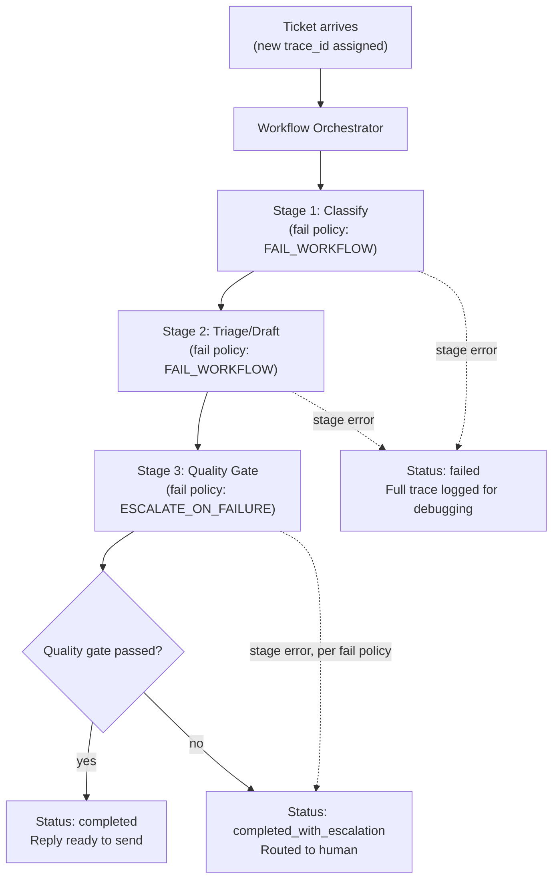

# Pattern 21: Agentic Workflow

## 1. What is an Agentic Workflow?

An **Agentic Workflow** is the production-deployment layer that ties multiple agent patterns
together into one running system: explicit orchestration between stages, structured logging
and monitoring, retry/circuit-breaker policies at the workflow level (not just inside
individual agents), and a clear definition of what "the whole job succeeded, partially
succeeded, or failed" means end to end. Every pattern so far has been a self-contained
component; this pattern is about **composing several of them into a deployable pipeline** with
the operational scaffolding real systems need: observability, idempotency, and defined failure
semantics for the workflow as a whole, not just for each piece.

Concretely, this pattern answers questions the individual agent patterns don't: How do we know
if a run is healthy? What happens if step 3 of 5 fails — do we retry the whole workflow, resume
from step 3, or fail the whole thing? How do we trace a single request across every stage it
touched, for debugging?

## 2. What problem does it solves

Every pattern in this series has been presented as a standalone, runnable class — which is
right for learning the pattern, but real production systems rarely deploy just one pattern in
isolation. A real ticket-processing system might use Router (8) to classify, then a
Sequential pipeline (14) to extract/draft/validate, then Reflection (5) to quality-gate the
output, then possibly Human-in-the-Loop (16) for anything flagged. Stitching these together
naively creates real operational gaps:

- **No unified observability.** If each component logs independently with no shared request
  ID, tracing a single failed ticket across five different agent calls becomes forensic
  archaeology.
- **Unclear failure semantics across stages.** If the Reflection stage fails to even run (not
  "the reply failed the rubric," but "the LLM call itself errored"), does the whole workflow
  fail? Does it fall back to skipping that stage? Ad hoc handling varies stage to stage without
  an explicit policy.
- **No idempotency guarantee.** If a workflow is retried (e.g., after a transient infra
  failure), does it re-run already-completed stages and potentially double-charge a refund
  from Pattern 4's Planning Agent? Without deliberate design, retries can cause real harm.

An Agentic Workflow pattern solves this with an explicit orchestration layer: every run gets a
trace ID, every stage's outcome is logged against it, stage-level failure policy is defined
upfront (fail-fast vs. skip-and-continue vs. fallback), and completed stages are tracked so
retries don't redo already-successful work.

## 3. Realistic production example: End-to-End Support Ticket Workflow

**Composing several earlier patterns into one deployed pipeline.** A real support-ticket
workflow strung together from this series' components:

1. **Classify** (Router, Pattern 8-style): determine ticket category.
2. **Triage** (Basic Agent, Pattern 1-style): draft an initial analysis and reply.
3. **Quality Gate** (Reflection, Pattern 5-style): critique/revise the draft reply.
4. **Route outcome**: if the quality gate passes, the reply is ready to send; if it doesn't
   pass, escalate for human review.

Each stage is a discrete, already-understood component from earlier patterns — this pattern's
job is the **workflow scaffolding**: a trace ID threading through every log line, an explicit
per-stage failure policy, and a workflow-level status (`completed`, `completed_with_escalation`,
`failed`) that a monitoring dashboard could alert on.

## 4. Architecture / Flow Diagram



## 5. Request-to-response flow, step by step

1. **Trace ID assigned**: every workflow run gets a unique `trace_id` at the very start — every
   subsequent log line, across every stage, includes it, so a single ticket's full journey can
   be reconstructed from logs alone.
2. **Stage 1 (Classify)**: runs with an explicit failure policy of `FAIL_WORKFLOW` — if
   classification itself errors, there's no reasonable way to continue, so the whole workflow
   is marked failed immediately, with the error and trace preserved.
3. **Stage 2 (Triage/Draft)**: also `FAIL_WORKFLOW` — a failure to even produce a draft means
   there's nothing for the quality gate to work with.
4. **Stage 3 (Quality Gate)**: uses a *different* failure policy, `ESCALATE_ON_FAILURE` — if
   the reflection/critique call itself errors (not "the draft failed the rubric," but "the LLM
   call broke"), the workflow doesn't hard-fail; it falls back to routing the ticket to a human,
   since that's a safe, always-available fallback for this specific stage.
5. **Workflow-level status determination**: the final status (`completed`,
   `completed_with_escalation`, `failed`) is computed from what actually happened across all
   stages, not just "did the last stage succeed" — this status is what a monitoring/alerting
   system would key off of.
6. **Idempotency via stage tracking**: each stage's completion is recorded as it happens; a
   `resume()` path (shown in the code) can skip already-completed stages if a workflow needs to
   be retried after an infrastructure-level interruption, avoiding double-executing stages with
   side effects.
7. **Full trace retained**: the complete `WorkflowTrace` — every stage's outcome, timing, and
   the final status — is the artifact this pattern is really about producing; it's what makes
   the difference between "an agent that works when you watch it run" and "a system you can
   operate in production."

## 6. Why this pattern fits (and when it doesn't)

**Fits well when:**
- Multiple agent patterns need to be composed into one deployed, monitored system, not run
  ad hoc from a script.
- You need to reason about partial failure across stages with different acceptable fallback
  behaviors per stage, not one blanket policy.
- Observability (tracing a single request across stages) and idempotency (safe retries) are
  real operational requirements, not nice-to-haves.

**Doesn't fit when:**
- You're composing patterns for a prototype/experiment where this operational scaffolding is
  premature — add it once the system is actually heading to production, not before.
- There's only one stage/pattern involved — a single agent doesn't need a workflow orchestrator
  wrapped around it; that's needless overhead.
- The deployment platform already provides this scaffolding (durable workflow engines,
  managed orchestration services) — in that case, this pattern's *concepts* (trace IDs,
  per-stage failure policy, resumability) still apply, but you'd implement them via that
  platform's primitives rather than the hand-rolled version shown here.

## 7. Production-quality implementation

```python
"""
Pattern 21: Agentic Workflow
----------------------------------
An end-to-end support-ticket workflow composing Classify -> Triage ->
Quality Gate stages, with a trace ID, per-stage failure policies, and
idempotent stage tracking for safe retries.

Run prerequisites:
    ollama pull llama3.1:8b
    pip install -U langchain langchain-core langchain-ollama pydantic

Run:
    python agentic_workflow.py
"""

from __future__ import annotations

import logging
import time
import uuid
from dataclasses import dataclass, field
from enum import Enum
from typing import Callable, Optional

from langchain_core.messages import HumanMessage, SystemMessage
from langchain_core.output_parsers import PydanticOutputParser
from langchain_core.exceptions import OutputParserException
from langchain_ollama import ChatOllama
from pydantic import BaseModel, Field, ValidationError

# Structured logging with trace_id support — every log line in a real
# deployment would include this for cross-stage request tracing.
logging.basicConfig(
    level=logging.INFO,
    format="%(asctime)s | %(levelname)s | trace_id=%(trace_id)s | %(message)s",
)
logger = logging.getLogger("agentic_workflow")


def log_with_trace(trace_id: str, level: str, message: str) -> None:
    getattr(logger, level)(message, extra={"trace_id": trace_id})


def invoke_structured(llm, system_content: str, user_content: str, parser, max_retries: int = 2):
    messages = [SystemMessage(content=system_content), HumanMessage(content=user_content)]
    last_error: Optional[Exception] = None
    for attempt in range(1, max_retries + 2):
        try:
            response = llm.invoke(messages)
            return parser.parse(response.content)
        except (OutputParserException, ValidationError) as e:
            last_error = e
            messages.append(HumanMessage(
                content="That wasn't valid JSON matching the schema. Respond again with "
                "ONLY the raw JSON object."
            ))
    raise RuntimeError(f"Structured call failed after retries: {last_error}")


# --------------------------------------------------------------------------
# Stage schemas (deliberately simple — each mirrors a pattern already
# built out in depth earlier in this series)
# --------------------------------------------------------------------------
class Category(str, Enum):
    TECHNICAL = "technical"
    BILLING = "billing"
    GENERAL = "general"


class ClassifyResult(BaseModel):
    category: Category


class TriageResult(BaseModel):
    draft_reply: str


class QualityCheckResult(BaseModel):
    passed: bool
    reasoning: str
    revised_reply: Optional[str] = None


# --------------------------------------------------------------------------
# Per-stage failure policy — defined explicitly per stage, not one blanket
# rule for the whole workflow.
# --------------------------------------------------------------------------
class FailurePolicy(str, Enum):
    FAIL_WORKFLOW = "fail_workflow"
    ESCALATE_ON_FAILURE = "escalate_on_failure"


class WorkflowStatus(str, Enum):
    COMPLETED = "completed"
    COMPLETED_WITH_ESCALATION = "completed_with_escalation"
    FAILED = "failed"


@dataclass
class StageOutcome:
    stage_name: str
    success: bool
    duration_ms: float
    error: Optional[str] = None


@dataclass
class WorkflowTrace:
    trace_id: str
    ticket_text: str
    stage_outcomes: list = field(default_factory=list)
    completed_stages: set = field(default_factory=set)  # for idempotent resume
    category: Optional[Category] = None
    draft_reply: Optional[str] = None
    final_reply: Optional[str] = None
    status: Optional[WorkflowStatus] = None


# --------------------------------------------------------------------------
# The Workflow Orchestrator
# --------------------------------------------------------------------------
class SupportTicketWorkflow:
    """Orchestrates Classify -> Triage -> Quality Gate with trace IDs,
    per-stage failure policy, and idempotent stage tracking."""

    CLASSIFY_PROMPT = """Classify this support ticket into technical, billing, or general.
Respond with ONLY a JSON object matching this schema (no markdown fences, no extra text):
{format_instructions}
"""

    TRIAGE_PROMPT = """Draft a short, polite reply to this {category} support ticket.
Respond with ONLY a JSON object matching this schema (no markdown fences, no extra text):
{format_instructions}
"""

    QUALITY_PROMPT = """Review this draft reply for tone and completeness. If it needs fixing,
provide a revised_reply; otherwise leave revised_reply null.

DRAFT: {draft}

Respond with ONLY a JSON object matching this schema (no markdown fences, no extra text):
{format_instructions}
"""

    def __init__(self, model_name: str = "llama3.1:8b", temperature: float = 0.2, max_retries: int = 2) -> None:
        self.llm = ChatOllama(model=model_name, temperature=temperature)
        self.max_retries = max_retries

        self.classify_parser = PydanticOutputParser(pydantic_object=ClassifyResult)
        self.triage_parser = PydanticOutputParser(pydantic_object=TriageResult)
        self.quality_parser = PydanticOutputParser(pydantic_object=QualityCheckResult)

    def _run_stage(self, trace: WorkflowTrace, stage_name: str, policy: FailurePolicy,
                    fn: Callable[[], None]) -> bool:
        """Runs one stage with timing, logging, and policy-driven failure
        handling. Returns True if the workflow should continue, False if
        this stage's failure should halt it (per policy)."""

        if stage_name in trace.completed_stages:
            log_with_trace(trace.trace_id, "info", f"stage_skipped_already_complete stage={stage_name}")
            return True

        start = time.monotonic()
        try:
            fn()
            duration_ms = (time.monotonic() - start) * 1000
            trace.stage_outcomes.append(StageOutcome(stage_name, True, duration_ms))
            trace.completed_stages.add(stage_name)
            log_with_trace(trace.trace_id, "info",
                            f"stage_succeeded stage={stage_name} duration_ms={duration_ms:.0f}")
            return True
        except Exception as e:
            duration_ms = (time.monotonic() - start) * 1000
            trace.stage_outcomes.append(StageOutcome(stage_name, False, duration_ms, error=str(e)))
            log_with_trace(trace.trace_id, "error",
                            f"stage_failed stage={stage_name} policy={policy} error={e}")

            if policy == FailurePolicy.FAIL_WORKFLOW:
                trace.status = WorkflowStatus.FAILED
                return False
            elif policy == FailurePolicy.ESCALATE_ON_FAILURE:
                trace.status = WorkflowStatus.COMPLETED_WITH_ESCALATION
                trace.final_reply = None
                return False
            return False

    def run(self, ticket_text: str, trace_id: Optional[str] = None) -> WorkflowTrace:
        trace = WorkflowTrace(trace_id=trace_id or str(uuid.uuid4()), ticket_text=ticket_text)
        log_with_trace(trace.trace_id, "info", "workflow_started")

        # --- Stage 1: Classify (FAIL_WORKFLOW policy) ---
        def classify():
            system_content = self.CLASSIFY_PROMPT.format(
                format_instructions=self.classify_parser.get_format_instructions()
            )
            result = invoke_structured(self.llm, system_content, ticket_text,
                                        self.classify_parser, self.max_retries)
            trace.category = result.category

        if not self._run_stage(trace, "classify", FailurePolicy.FAIL_WORKFLOW, classify):
            return self._finalize(trace)

        # --- Stage 2: Triage/Draft (FAIL_WORKFLOW policy) ---
        def triage():
            system_content = self.TRIAGE_PROMPT.format(
                category=trace.category.value,
                format_instructions=self.triage_parser.get_format_instructions(),
            )
            result = invoke_structured(self.llm, system_content, ticket_text,
                                        self.triage_parser, self.max_retries)
            trace.draft_reply = result.draft_reply

        if not self._run_stage(trace, "triage", FailurePolicy.FAIL_WORKFLOW, triage):
            return self._finalize(trace)

        # --- Stage 3: Quality Gate (ESCALATE_ON_FAILURE policy) ---
        def quality_gate():
            system_content = self.QUALITY_PROMPT.format(
                draft=trace.draft_reply, format_instructions=self.quality_parser.get_format_instructions()
            )
            result = invoke_structured(self.llm, system_content, "Review the draft.",
                                        self.quality_parser, self.max_retries)
            if result.passed:
                trace.final_reply = trace.draft_reply
            else:
                trace.final_reply = result.revised_reply or trace.draft_reply

        if not self._run_stage(trace, "quality_gate", FailurePolicy.ESCALATE_ON_FAILURE, quality_gate):
            return self._finalize(trace)

        trace.status = WorkflowStatus.COMPLETED
        return self._finalize(trace)

    def _finalize(self, trace: WorkflowTrace) -> WorkflowTrace:
        log_with_trace(trace.trace_id, "info", f"workflow_finished status={trace.status}")
        return trace


if __name__ == "__main__":
    workflow = SupportTicketWorkflow(model_name="llama3.1:8b")

    ticket = "My export keeps failing with a timeout error on large files, this is blocking my work."

    print("=" * 70)
    print(f"TICKET: {ticket}")

    start = time.monotonic()
    trace = workflow.run(ticket)
    elapsed = time.monotonic() - start

    print(f"\n--- WORKFLOW TRACE ({elapsed:.1f}s, trace_id={trace.trace_id}) ---")
    for outcome in trace.stage_outcomes:
        status = "OK" if outcome.success else f"FAILED ({outcome.error})"
        print(f"  [{outcome.stage_name}] {status} — {outcome.duration_ms:.0f}ms")

    print(f"\nFinal status: {trace.status}")
    print(f"Category: {trace.category}")
    print(f"Final reply: {trace.final_reply}")

    # Demonstrate idempotent resume: if a workflow were interrupted after
    # stage 2 completed, re-running with the same trace_id and the
    # previously-recorded completed_stages set skips redoing that work.
    print("\n--- SIMULATING AN IDEMPOTENT RETRY AFTER INTERRUPTION ---")
    previously_completed = {"classify", "triage"}  # loaded from persisted trace storage
    retried_trace = WorkflowTrace(
        trace_id=trace.trace_id, ticket_text=ticket,
        completed_stages=previously_completed,
        category=trace.category, draft_reply=trace.draft_reply,
    )
    # A full implementation would restructure run() to accept a pre-populated
    # WorkflowTrace; shown conceptually here to keep the example focused.
    print(f"Stages that would be skipped on retry: {previously_completed}")
    print("(Only the quality_gate stage would actually re-execute.)")
```

### Notes on the code

- **`log_with_trace` threads `trace_id` through every log line** — in a real deployment with
  structured/JSON logging shipped to a log aggregator, this single field is what lets you query
  "show me everything that happened for ticket X" across every stage and every underlying
  agent call, instead of correlating timestamps by hand.
- **`_run_stage` is a single reusable wrapper** applying consistent timing, logging, and
  policy-driven failure handling to every stage — new stages just provide a closure and a
  `FailurePolicy`, without re-implementing this scaffolding each time (the same
  "shared helper, per-stage difference is just data" discipline seen throughout this series,
  e.g. Pattern 15's `BRANCHES` dict).
- **Different stages genuinely have different failure policies** — `classify` and `triage`
  use `FAIL_WORKFLOW` because there's no sensible way to continue without them, while
  `quality_gate` uses `ESCALATE_ON_FAILURE` because a safe fallback (route to a human) exists
  specifically for that stage's failure — this is the concrete expression of "define failure
  policy explicitly per stage" from the pattern's motivation.
- **`completed_stages` is the idempotency mechanism** — `_run_stage` checks it first and skips
  already-done work; in a production system, `WorkflowTrace` would be persisted (database,
  durable queue) after each stage so a genuine process restart could reload it and resume
  correctly, rather than the simplified in-memory demonstration shown in `__main__`.
- **The workflow-level `status` is computed from what actually happened**, not assumed —
  `COMPLETED`, `COMPLETED_WITH_ESCALATION`, and `FAILED` are three meaningfully different
  outcomes a monitoring dashboard would track and alert on differently (e.g., a spike in
  `FAILED` is an incident; a steady rate of `COMPLETED_WITH_ESCALATION` might just mean the
  quality bar is appropriately catching edge cases).

### Versions used

- Python `3.11+`
- `langchain-core` `0.3.x`
- `langchain-ollama` `0.2.x`
- `pydantic` `2.x`
- Model: `llama3.1:8b` via local Ollama

---

**Next: [Pattern 22 — Autonomous Agent](22-autonomous-agent.md)**, examining agents designed to
operate with minimal human oversight over extended, open-ended operation — and the specific
guardrails that responsible autonomy requires.
