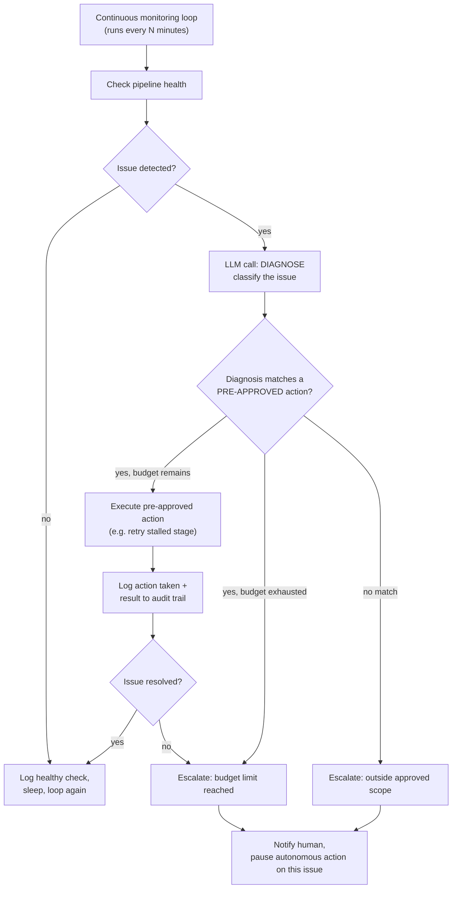

# Pattern 22: Autonomous Agent

## 1. What is an Autonomous Agent?

An **Autonomous Agent** operates over an extended period with minimal human oversight,
pursuing a broad, standing objective rather than responding to one discrete request — deciding
for itself, turn after turn, what to do next, when to stop, and when something is wrong enough
to require human intervention. This is the pattern where the guardrails discussed throughout
this series (bounded rounds, deterministic checks over money, structured failure states, human
approval gates) all become **load-bearing simultaneously**, because there's no human watching
each individual step the way there might be in a single-request interaction.

The distinguishing property isn't "uses an LLM in a loop" (ReAct, Pattern 3, already does
that) — it's **standing objective + extended, largely unsupervised operation**: an autonomous
agent might run for hours or continuously, deciding its own next actions across that whole
span, not just within one bounded request/response cycle.

## 2. What problem does it solves

Most patterns in this series assume a human or system triggers a discrete task and is present
(or promptly reachable) to review the outcome. Some real operational needs don't fit that
model — routine monitoring, maintenance, or optimization tasks that should run continuously
without a human initiating or reviewing every cycle:

- **Continuous system health monitoring** with the authority to take small, well-defined
  corrective actions (restart a stalled process, clear a queue backlog) without waiting for a
  human to approve each one — waiting for approval on every routine, low-risk action would
  defeat the purpose of automating it at all.
- **Ongoing data quality maintenance**: periodically scanning for known-fixable data issues and
  correcting them, running indefinitely rather than as a one-off request.

But *unsupervised* extended operation is exactly where inadequate guardrails cause the most
damage — a single bad decision compounds if nothing catches it before the next cycle runs. An
Autonomous Agent pattern solves this not by removing safety mechanisms (the opposite of what
autonomy needs) but by making them **structural and self-enforcing**: hard action-scope limits
it cannot exceed regardless of its own reasoning, a running action budget, mandatory
human-escalation triggers for anything outside its pre-approved scope, and a persistent audit
log of every autonomous decision.

## 3. Realistic production example: Automated Data Pipeline Health Monitor

**A new example chosen for genuinely appropriate, bounded autonomy.** A data pipeline runs
nightly; this agent monitors its health continuously and is authorized to take a small, fixed
set of **safe, reversible, pre-approved actions** — nothing resembling Pattern 4's refund
authority, deliberately, because unsupervised autonomy should only ever be granted over
low-risk, well-understood actions:

- **Detect**: a pipeline stage is stalled (no progress in 20+ minutes).
- **Pre-approved autonomous action**: retry the stalled stage once (a known-safe, idempotent
  operation).
- **Detect**: retry didn't help, or a completely new kind of failure appears.
- **Escalate**: this is *outside* the agent's pre-approved action scope — it must stop and
  notify a human rather than attempt something not on its approved list, no matter how
  plausible its own reasoning about a fix might sound.

This is exactly the "propose vs. auto-deploy" line drawn in Pattern 7 and the approval gates in
Patterns 4 and 16, made structural: the scope of autonomous action is fixed in code, not
decided fresh by the model's judgment each time.

## 4. Architecture / Flow Diagram



## 5. Request-to-response flow, step by step

1. **Continuous loop**: unlike every prior pattern (triggered by an incoming request), this
   agent's loop runs on its own schedule, checking pipeline health at regular intervals with no
   external trigger needed.
2. **Health check**: a deterministic check (not an LLM call — same "prefer deterministic checks
   where possible" discipline as Pattern 6/14) inspects the pipeline's actual state.
3. **No issue**: logs a routine healthy check and continues the loop — most cycles should look
   like this; autonomy doesn't mean "always doing something."
4. **Issue detected → diagnose**: an LLM call classifies what kind of issue this is, from the
   pipeline's actual status data (grounded, not guessed).
5. **Scope check against the pre-approved action list**: this is the structural safety
   mechanism — the agent checks the diagnosis against a **fixed, hardcoded** set of actions
   it's allowed to take autonomously. Critically, this check is plain code, not another LLM
   judgment call about "should I do this" — the boundary of autonomy is enforced outside the
   model's own reasoning, which is exactly the point: an LLM confidently arguing it should be
   allowed to do something outside its granted scope must never be the thing that decides it
   can.
6. **Action budget enforcement**: even pre-approved actions have a budget (e.g., "retry at most
   once per stage per day") — an agent retrying the same failing stage forever without ever
   escalating would itself be a failure mode, not a success.
7. **Escalation is the safe default**: anything not matching a pre-approved action, or any
   budget exhaustion, routes to human notification rather than the agent improvising — mirroring
   the "propose, don't auto-deploy" discipline from Pattern 7, made mandatory rather than
   optional here because no human is in the loop to catch a bad improvisation in the moment.
8. **Full audit trail**: every autonomous decision — detected issue, diagnosis, action taken (or
   escalation), and outcome — is logged persistently, since after-the-fact review is often the
   *only* review an autonomous agent's individual actions get.

## 6. Why this pattern fits (and when it doesn't)

**Fits well when:**
- The task genuinely benefits from continuous, unattended operation (monitoring, routine
  maintenance) rather than being triggered per-request.
- The set of safe autonomous actions can be enumerated and hardcoded in advance — autonomy is
  granted over a specific, bounded action space, not "whatever the model decides is a good
  idea."
- Escalation to a human is genuinely available and monitored — autonomy without a working
  escalation path is just unsupervised risk.

**Doesn't fit when:**
- Actions have significant, hard-to-reverse consequences (financial, legal, irreversible data
  changes) — those need per-instance human approval (Pattern 16), not standing autonomous
  authority, no matter how good the agent's track record has been.
- The task is naturally request-triggered, not continuous — most patterns in this series (1-21)
  fit that shape and don't need this pattern's always-on operational model.
- There isn't yet enough operational trust/track record in the underlying agent's diagnostic
  accuracy to grant even a small autonomous action scope — start with Human-in-the-Loop
  (Pattern 16) for every action, and only carve out autonomy for specific actions once they've
  proven reliable under human supervision first.

## 7. Production-quality implementation

```python
"""
Pattern 22: Autonomous Agent
----------------------------------
A data pipeline health monitor that runs continuously, diagnosing issues
and taking ONLY pre-approved, budgeted actions autonomously — escalating
everything else to a human, with a full persistent audit trail.

Run prerequisites:
    ollama pull llama3.1:8b
    pip install -U langchain langchain-core langchain-ollama pydantic

Run:
    python autonomous_agent.py
"""

from __future__ import annotations

import json
import logging
import time
from dataclasses import dataclass, field
from datetime import datetime
from enum import Enum
from pathlib import Path
from typing import Optional

from langchain_core.messages import HumanMessage, SystemMessage
from langchain_core.output_parsers import PydanticOutputParser
from langchain_core.exceptions import OutputParserException
from langchain_ollama import ChatOllama
from pydantic import BaseModel, Field, ValidationError

logging.basicConfig(
    level=logging.INFO,
    format="%(asctime)s | %(levelname)s | %(name)s | %(message)s",
)
logger = logging.getLogger("autonomous_agent")


def invoke_structured(llm, system_content: str, user_content: str, parser, max_retries: int = 2):
    messages = [SystemMessage(content=system_content), HumanMessage(content=user_content)]
    last_error: Optional[Exception] = None
    for attempt in range(1, max_retries + 2):
        try:
            response = llm.invoke(messages)
            return parser.parse(response.content)
        except (OutputParserException, ValidationError) as e:
            last_error = e
            messages.append(HumanMessage(
                content="That wasn't valid JSON matching the schema. Respond again with "
                "ONLY the raw JSON object."
            ))
    raise RuntimeError(f"Structured call failed after retries: {last_error}")


# --------------------------------------------------------------------------
# Simulated pipeline state — deterministic health check, no LLM needed here
# --------------------------------------------------------------------------
@dataclass
class PipelineState:
    stage_name: str
    minutes_since_progress: int
    error_message: Optional[str] = None


def check_pipeline_health() -> Optional[PipelineState]:
    """Deterministic check. Returns None if healthy, else the stalled/failing
    stage's state. In production this would query real pipeline metadata."""
    # Simulated: stage 'ingest_customer_data' has been stalled for 25 minutes
    return PipelineState(
        stage_name="ingest_customer_data", minutes_since_progress=25,
        error_message="No progress recorded; worker process may be hung.",
    )


def retry_pipeline_stage(stage_name: str) -> bool:
    """Simulated idempotent, safe retry action. Returns success/failure."""
    logger.info(f"[SIMULATED ACTION] Retrying stage={stage_name}")
    return True  # simulate a successful retry for this demonstration


# --------------------------------------------------------------------------
# Persistent audit log — every autonomous decision is recorded, since this
# is often the ONLY review an individual action gets.
# --------------------------------------------------------------------------
class AuditLog:
    def __init__(self, path: str = "autonomous_agent_audit.jsonl") -> None:
        self.path = Path(path)

    def record(self, entry: dict) -> None:
        entry["timestamp"] = datetime.utcnow().isoformat()
        with self.path.open("a") as f:
            f.write(json.dumps(entry) + "\n")


# --------------------------------------------------------------------------
# Diagnosis schema
# --------------------------------------------------------------------------
class IssueType(str, Enum):
    STALLED_STAGE = "stalled_stage"
    UNKNOWN = "unknown"


class Diagnosis(BaseModel):
    issue_type: IssueType
    explanation: str


# --------------------------------------------------------------------------
# The Autonomous Agent
# --------------------------------------------------------------------------
class PipelineHealthMonitor:
    """Continuously monitors pipeline health, diagnosing issues via LLM but
    restricting itself to a hardcoded, budgeted set of pre-approved actions.
    Anything outside that scope is escalated, never improvised."""

    DIAGNOSE_PROMPT = """A data pipeline stage appears unhealthy. Classify the issue type
based on the state below.

STAGE STATE:
{state}

Respond with ONLY a JSON object matching this schema (no markdown fences, no extra text):
{format_instructions}
"""

    # The ONLY actions this agent may take autonomously, and their budgets.
    # This is plain code, not an LLM decision — the boundary of autonomy is
    # structural, not a judgment call made fresh each time.
    MAX_RETRIES_PER_STAGE_PER_DAY = 1

    def __init__(self, model_name: str = "llama3.1:8b", temperature: float = 0.1,
                 max_retries_llm: int = 2, audit_log: Optional[AuditLog] = None) -> None:
        self.llm = ChatOllama(model=model_name, temperature=temperature)
        self.max_retries_llm = max_retries_llm
        self.parser = PydanticOutputParser(pydantic_object=Diagnosis)
        self.audit = audit_log or AuditLog()

        # In-memory action budget tracker; a real system would persist this
        # (database) so it survives process restarts and resets correctly
        # on a real daily schedule.
        self._retry_counts: dict[str, int] = {}

    def _diagnose(self, state: PipelineState) -> Diagnosis:
        state_text = json.dumps(state.__dict__)
        system_content = self.DIAGNOSE_PROMPT.format(
            state=state_text, format_instructions=self.parser.get_format_instructions()
        )
        return invoke_structured(self.llm, system_content, "Diagnose this issue.",
                                  self.parser, self.max_retries_llm)

    def run_one_check_cycle(self) -> str:
        """Runs a single monitoring cycle. In production this would be
        called on a schedule (cron, durable timer) rather than in a tight
        loop, and each cycle's outcome persisted for observability."""

        state = check_pipeline_health()
        if state is None:
            self.audit.record({"event": "healthy_check", "action": "none"})
            logger.info("cycle_result=healthy")
            return "healthy"

        diagnosis = self._diagnose(state)
        logger.info(f"issue_diagnosed stage={state.stage_name} type={diagnosis.issue_type} "
                    f"explanation={diagnosis.explanation!r}")

        # --- Structural scope check: plain code, not an LLM judgment call ---
        if diagnosis.issue_type == IssueType.STALLED_STAGE:
            retries_used = self._retry_counts.get(state.stage_name, 0)

            if retries_used >= self.MAX_RETRIES_PER_STAGE_PER_DAY:
                self.audit.record({
                    "event": "escalation", "reason": "retry_budget_exhausted",
                    "stage": state.stage_name, "retries_used": retries_used,
                })
                logger.warning(f"escalating stage={state.stage_name} reason=budget_exhausted")
                self._notify_human(state, diagnosis, reason="Retry budget exhausted for today")
                return "escalated_budget_exhausted"

            success = retry_pipeline_stage(state.stage_name)
            self._retry_counts[state.stage_name] = retries_used + 1

            self.audit.record({
                "event": "autonomous_action", "action": "retry_stage",
                "stage": state.stage_name, "success": success,
                "retries_used_after": retries_used + 1,
            })

            if success:
                logger.info(f"autonomous_action_taken stage={state.stage_name} action=retry result=success")
                return "action_taken_retry_succeeded"
            else:
                logger.warning(f"autonomous_action_failed stage={state.stage_name} action=retry")
                self._notify_human(state, diagnosis, reason="Autonomous retry failed")
                return "escalated_retry_failed"

        else:
            # Diagnosis doesn't match any pre-approved action — escalate,
            # never improvise an unapproved fix, no matter how the model's
            # own explanation sounds.
            self.audit.record({
                "event": "escalation", "reason": "outside_approved_scope",
                "stage": state.stage_name, "issue_type": diagnosis.issue_type,
            })
            logger.warning(f"escalating stage={state.stage_name} reason=outside_approved_scope")
            self._notify_human(state, diagnosis, reason="Issue type outside pre-approved action scope")
            return "escalated_outside_scope"

    def _notify_human(self, state: PipelineState, diagnosis: Diagnosis, reason: str) -> None:
        # Simulated — in production this would page/email/Slack a human,
        # and importantly would ALSO suppress repeat autonomous action on
        # this specific issue until a human acknowledges it.
        logger.info(f"[SIMULATED NOTIFICATION] reason={reason!r} stage={state.stage_name} "
                    f"diagnosis={diagnosis.explanation!r}")


if __name__ == "__main__":
    monitor = PipelineHealthMonitor(model_name="llama3.1:8b")

    print("=" * 70)
    print("--- CYCLE 1: stalled stage detected, within retry budget ---")
    start = time.monotonic()
    result1 = monitor.run_one_check_cycle()
    elapsed = time.monotonic() - start
    print(f"[{elapsed:.1f}s] Result: {result1}")

    print("\n--- CYCLE 2: same stage still stalled, budget now exhausted ---")
    result2 = monitor.run_one_check_cycle()
    print(f"Result: {result2}")

    print(f"\nFull audit trail written to: {monitor.audit.path}")
```

### Notes on the code

- **`check_pipeline_health` is deterministic, not an LLM call** — same discipline as Pattern
  14's Stage 3 and Pattern 6's arithmetic check: whether something is objectively true (is the
  stage stalled) shouldn't be left to a model's judgment when it can be checked directly.
- **`MAX_RETRIES_PER_STAGE_PER_DAY` and the pre-approved action list are hardcoded constants**,
  not something the LLM decides at runtime — this is the single most important line of defense
  in this pattern: the *boundary* of what the agent is allowed to do autonomously is enforced by
  plain code that the model's own reasoning cannot argue its way around, no matter how
  convincing `diagnosis.explanation` sounds.
- **Anything outside `IssueType.STALLED_STAGE` escalates unconditionally** — there's no
  "the model seems confident, let it try something" fallback; the `else` branch always
  escalates, which is the deliberate, structural expression of "propose, don't improvise"
  applied to unsupervised operation.
- **`AuditLog` persists every cycle's outcome**, healthy or not — because with no human watching
  each cycle live, the audit trail is frequently the *only* mechanism by which a human later
  reviews whether the agent's autonomous decisions were sound, making it as operationally
  important as the decision logic itself.
- **`_notify_human` is explicitly a stand-in for a real paging/notification system** — the
  comment about suppressing repeat autonomous action on an unacknowledged issue flags a real
  production concern: an escalated issue shouldn't just get silently re-attempted next cycle
  without a human having actually seen the escalation.

### Versions used

- Python `3.11+`
- `langchain-core` `0.3.x`
- `langchain-ollama` `0.2.x`
- `pydantic` `2.x`
- Model: `llama3.1:8b` via local Ollama

---

**Next: [Pattern 23 — Event-Driven Agent](23-event-driven-agent.md)**, where instead of a
scheduled polling loop like this monitor, the agent is triggered reactively by external events
as they occur — a different activation model with its own design considerations.
