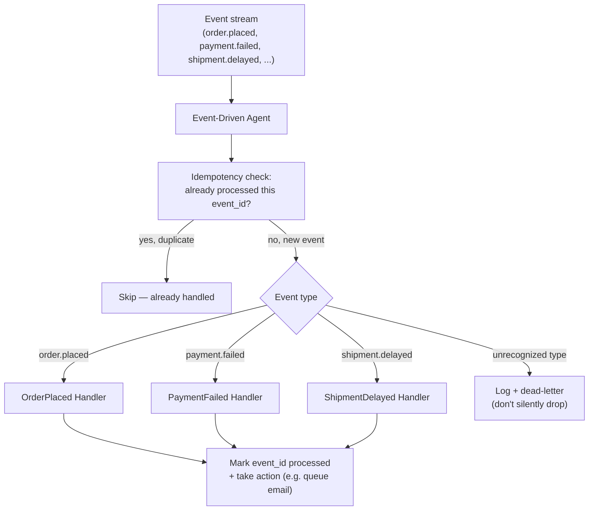

# Pattern 23: Event-Driven Agent

## 1. What is an Event-Driven Agent?

An **Event-Driven Agent** is triggered reactively by external events as they occur — a new
message on a queue, a webhook firing, a file landing in storage — rather than running on a
fixed polling schedule (Pattern 22's monitor) or waiting for a direct synchronous request
(Patterns 1-21's typical shape). The agent subscribes to a stream of events, reacts to each one
as it arrives, and its logic is structured around **event type → handler**, with the
possibility of multiple distinct event types needing different handling — closer in spirit to
Router (Pattern 8), but triggered by system events instead of user messages.

The key architectural difference from Pattern 22's autonomous polling loop: an event-driven
agent does *no work* between events — it's idle until something happens, then reacts, rather
than periodically checking "has anything happened yet?"

## 2. What problem does it solves

Polling-based designs (check every N minutes) have real, well-known costs when applied to
inherently event-driven situations:

- **Latency**: if something important happens right after a poll cycle checks, it won't be
  noticed until the *next* cycle — a real problem when events need timely reaction (e.g. "a
  payment failed" shouldn't wait up to N minutes to be handled).
- **Wasted work**: polling "has anything changed?" repeatedly when nothing has changed most of
  the time burns compute and API calls for no benefit — especially costly if each poll involves
  an LLM call to check state, rather than Pattern 22's cheap deterministic check.
- **Awkward fit for genuinely event-native systems.** Many real infrastructure event sources
  (message queues, webhooks, pub/sub systems) are *already* push-based — polling them anyway
  ignores the natural shape of the problem.

An Event-Driven Agent solves this by inverting the control flow: instead of the agent asking
"anything new?", the event source pushes to the agent the moment something happens, and the
agent's only job is handling exactly what arrived — with the same discipline seen throughout
this series (structured output, per-event-type failure isolation, idempotent handling in case
of duplicate delivery, which most real event systems can produce).

## 3. Realistic production example: Order Event Processor

**A new example modeling a genuinely event-native system.** An e-commerce backend emits events
as things happen — `order.placed`, `payment.failed`, `shipment.delayed` — and this agent
subscribes to that stream, reacting to each event type with appropriate, type-specific logic:

- `order.placed` → draft a confirmation email personalized to the order contents.
- `payment.failed` → draft an urgent, empathetic retry-payment notification.
- `shipment.delayed` → draft a proactive delay notification with an updated ETA, *before* the
  customer has to ask (a materially better outcome than a customer finding out only when they
  check and it's late — the entire point of being event-driven rather than request-driven for
  this use case).

Each event type gets its own focused handler (mirroring Pattern 8's Router registry pattern),
and — critically — the agent must handle the reality that message queues/event systems
routinely deliver the same event more than once, so handlers must be **idempotent**.

## 4. Architecture / Flow Diagram



## 5. Request-to-response flow, step by step

1. **Event arrives**: pushed to the agent by the event source (simulated here as a function
   call standing in for a real queue consumer/webhook receiver) — the agent does no polling; it
   only runs when there's actually something to do.
2. **Idempotency check first, before any handling logic**: every event carries a unique
   `event_id`; the agent checks a persisted "already processed" set *before* doing any real
   work — this must happen first because most real event delivery systems provide
   "at-least-once" delivery, meaning the same event can and will arrive more than once.
3. **Type-based dispatch**: a handler registry (same pattern as Pattern 8's `HANDLER_REGISTRY`)
   maps event type to the appropriate handler — new event types are added by registering a new
   handler, with zero changes to the dispatch logic itself.
4. **Handler executes**: each handler is narrowly scoped to one event type (mirroring Pattern
   10's Worker Agent discipline) — draft the appropriate content, using an LLM call grounded in
   the event's actual payload data, never inventing order/payment details not present in the
   event.
5. **Unrecognized event types are not silently dropped**: an event type with no registered
   handler is logged and sent to a "dead letter" path for manual inspection — treating an
   unknown event as "nothing to do" risks silently missing genuinely important new event types
   introduced by an upstream system change.
6. **Mark processed only after successful handling**: the event is only recorded as processed
   once its handler completes successfully — if handling fails partway through, the event
   should be retried (by the event system's normal redelivery mechanism) rather than marked
   done and lost.
7. **No polling loop, no `sleep()`**: the agent's code has no timing logic at all — it's purely
   reactive; whatever drives the event loop (a queue consumer, a webhook server) is
   infrastructure outside the agent's own responsibility.

## 6. Why this pattern fits (and when it doesn't)

**Fits well when:**
- The triggering system is naturally event/push-based (message queues, webhooks, pub/sub) —
  fighting that with a polling loop adds latency and waste for no benefit.
- Different event types need genuinely different handling, benefiting from a router-style
  dispatch registry.
- Timely reaction to individual events matters more than periodic aggregate checking.

**Doesn't fit when:**
- There's no real push-based event source — building elaborate event-driven infrastructure
  around something that's naturally a periodic check is over-engineering; Pattern 22's simpler
  polling loop fits that better.
- The system needs to reason about *aggregate* state across many events together (e.g. "have
  there been more than 5 payment failures in the last hour?") rather than handling each event
  independently — that needs an additional stateful aggregation layer on top of this pattern,
  not just per-event handling.
- Events don't actually need independent, fast handling and could just as well be batched and
  processed together — batching may be more efficient if true real-time reaction isn't needed.

## 7. Production-quality implementation

```python
"""
Pattern 23: Event-Driven Agent
------------------------------------
An order-event processor reacting to order.placed, payment.failed, and
shipment.delayed events with type-specific, idempotent handlers.

Run prerequisites:
    ollama pull llama3.1:8b
    pip install -U langchain langchain-core langchain-ollama pydantic

Run:
    python event_driven_agent.py
"""

from __future__ import annotations

import json
import logging
import time
from dataclasses import dataclass
from pathlib import Path
from typing import Callable, Optional

from langchain_core.messages import HumanMessage, SystemMessage
from langchain_core.output_parsers import PydanticOutputParser
from langchain_core.exceptions import OutputParserException
from langchain_ollama import ChatOllama
from pydantic import BaseModel, ValidationError

logging.basicConfig(
    level=logging.INFO,
    format="%(asctime)s | %(levelname)s | %(name)s | %(message)s",
)
logger = logging.getLogger("event_driven_agent")


def invoke_structured(llm, system_content: str, user_content: str, parser, max_retries: int = 2):
    messages = [SystemMessage(content=system_content), HumanMessage(content=user_content)]
    last_error: Optional[Exception] = None
    for attempt in range(1, max_retries + 2):
        try:
            response = llm.invoke(messages)
            return parser.parse(response.content)
        except (OutputParserException, ValidationError) as e:
            last_error = e
            messages.append(HumanMessage(
                content="That wasn't valid JSON matching the schema. Respond again with "
                "ONLY the raw JSON object."
            ))
    raise RuntimeError(f"Structured call failed after retries: {last_error}")


# --------------------------------------------------------------------------
# Event model
# --------------------------------------------------------------------------
@dataclass
class Event:
    event_id: str
    event_type: str
    payload: dict


# --------------------------------------------------------------------------
# Idempotency tracker — persisted so duplicate delivery is caught even
# across process restarts, same discipline as Pattern 16/18's stores.
# --------------------------------------------------------------------------
class ProcessedEventStore:
    def __init__(self, path: str = "processed_events.json") -> None:
        self.path = Path(path)
        if not self.path.exists():
            self.path.write_text("[]")

    def is_processed(self, event_id: str) -> bool:
        processed = json.loads(self.path.read_text())
        return event_id in processed

    def mark_processed(self, event_id: str) -> None:
        processed = json.loads(self.path.read_text())
        if event_id not in processed:
            processed.append(event_id)
            self.path.write_text(json.dumps(processed))


# --------------------------------------------------------------------------
# Structured output for each handler
# --------------------------------------------------------------------------
class DraftedNotification(BaseModel):
    subject: str
    body: str


# --------------------------------------------------------------------------
# Type-specific handlers — narrow scope, grounded strictly in event payload
# --------------------------------------------------------------------------
def handle_order_placed(llm, payload: dict, max_retries: int) -> DraftedNotification:
    parser = PydanticOutputParser(pydantic_object=DraftedNotification)
    system = (
        "Draft an order confirmation email using ONLY these order details, no invented "
        f"specifics:\n{json.dumps(payload)}\n\n"
        f"Respond with ONLY JSON matching this schema:\n{parser.get_format_instructions()}"
    )
    return invoke_structured(llm, system, "Draft the confirmation.", parser, max_retries)


def handle_payment_failed(llm, payload: dict, max_retries: int) -> DraftedNotification:
    parser = PydanticOutputParser(pydantic_object=DraftedNotification)
    system = (
        "Draft an empathetic, urgent (but not alarming) payment-retry notification using "
        f"ONLY these details, no invented specifics:\n{json.dumps(payload)}\n\n"
        f"Respond with ONLY JSON matching this schema:\n{parser.get_format_instructions()}"
    )
    return invoke_structured(llm, system, "Draft the notification.", parser, max_retries)


def handle_shipment_delayed(llm, payload: dict, max_retries: int) -> DraftedNotification:
    parser = PydanticOutputParser(pydantic_object=DraftedNotification)
    system = (
        "Draft a proactive shipment-delay notification with the updated ETA, using ONLY "
        f"these details, no invented specifics:\n{json.dumps(payload)}\n\n"
        f"Respond with ONLY JSON matching this schema:\n{parser.get_format_instructions()}"
    )
    return invoke_structured(llm, system, "Draft the notification.", parser, max_retries)


HANDLER_REGISTRY: dict[str, Callable] = {
    "order.placed": handle_order_placed,
    "payment.failed": handle_payment_failed,
    "shipment.delayed": handle_shipment_delayed,
}


# --------------------------------------------------------------------------
# The Event-Driven Agent
# --------------------------------------------------------------------------
class OrderEventProcessor:
    """Reacts to individual events as they arrive, dispatching by event
    type with idempotent, at-most-once effective processing."""

    def __init__(self, model_name: str = "llama3.1:8b", temperature: float = 0.3,
                 max_retries: int = 2, processed_store: Optional[ProcessedEventStore] = None) -> None:
        self.llm = ChatOllama(model=model_name, temperature=temperature)
        self.max_retries = max_retries
        self.processed_store = processed_store or ProcessedEventStore()

    def handle_event(self, event: Event) -> Optional[DraftedNotification]:
        # --- Idempotency check FIRST, before any real work ---
        if self.processed_store.is_processed(event.event_id):
            logger.info(f"event_skipped_duplicate event_id={event.event_id}")
            return None

        handler = HANDLER_REGISTRY.get(event.event_type)
        if handler is None:
            # Unrecognized event type: log + dead-letter, never silently drop.
            logger.error(f"unrecognized_event_type event_id={event.event_id} "
                         f"event_type={event.event_type} -> DEAD_LETTER")
            self._dead_letter(event)
            return None

        try:
            notification = handler(self.llm, event.payload, self.max_retries)
            logger.info(f"event_handled event_id={event.event_id} event_type={event.event_type}")

            # Only mark processed AFTER successful handling — a failure here
            # leaves the event unmarked so normal redelivery can retry it.
            self.processed_store.mark_processed(event.event_id)
            return notification

        except Exception as e:
            logger.error(f"event_handling_failed event_id={event.event_id} "
                         f"event_type={event.event_type} error={e}")
            # Deliberately NOT marking processed — allow redelivery/retry.
            raise

    def _dead_letter(self, event: Event) -> None:
        # In production this would route to a real dead-letter queue for
        # manual inspection, not just a log line.
        logger.warning(f"[DEAD_LETTER] event_id={event.event_id} payload={event.payload}")


if __name__ == "__main__":
    processor = OrderEventProcessor(model_name="llama3.1:8b")

    events = [
        Event(event_id="evt_001", event_type="order.placed",
              payload={"order_id": "48213", "item": "wireless mouse", "total": "$29.99"}),
        Event(event_id="evt_002", event_type="payment.failed",
              payload={"order_id": "50110", "amount": "$149.00", "reason": "card_declined"}),
        Event(event_id="evt_003", event_type="shipment.delayed",
              payload={"order_id": "50111", "new_eta": "2026-08-22", "reason": "carrier delay"}),
        Event(event_id="evt_001", event_type="order.placed",  # duplicate delivery of evt_001
              payload={"order_id": "48213", "item": "wireless mouse", "total": "$29.99"}),
        Event(event_id="evt_004", event_type="inventory.restocked",  # unrecognized type
              payload={"item": "usb-c hub", "quantity": 50}),
    ]

    for event in events:
        print("\n" + "=" * 70)
        print(f"EVENT: id={event.event_id} type={event.event_type}")
        start = time.monotonic()
        result = processor.handle_event(event)
        elapsed = time.monotonic() - start

        if result:
            print(f"[{elapsed:.1f}s] SUBJECT: {result.subject}")
            print(f"BODY: {result.body}")
        else:
            print(f"[{elapsed:.1f}s] No notification produced (duplicate, dead-lettered, or skipped).")
```

### Notes on the code

- **The idempotency check runs before dispatch, before any LLM call** — checking
  `is_processed()` first means a duplicate delivery costs almost nothing (a fast local lookup),
  rather than wastefully re-running an LLM call only to discover afterward the work was
  redundant.
- **`mark_processed` is called only after the handler succeeds**, and the handling exception is
  re-raised rather than swallowed — this ensures a failed handling attempt leaves the event
  unmarked, so the event system's normal at-least-once redelivery can safely retry it, matching
  real message-queue semantics rather than accidentally implementing "at-most-once, even on
  failure" (which would silently drop failed events).
- **`HANDLER_REGISTRY` mirrors Pattern 8's `HANDLER_REGISTRY` exactly** — same pluggable
  dispatch-by-type design, applied here to system events instead of user messages, showing how
  the same underlying mechanism (a dict mapping a type string to a handler function) serves both
  Router and Event-Driven patterns.
- **Unrecognized event types are dead-lettered, not ignored** — `evt_004`'s
  `inventory.restocked` type has no registered handler, and rather than falling through
  silently, it's explicitly logged and routed for inspection, so a new upstream event type
  never quietly goes unhandled forever.
- **No `sleep()`, no polling loop anywhere in this file** — `handle_event` is a pure reaction
  to one event; the `for event in events` loop in `__main__` simulates a stream purely for the
  runnable demo, but in a real deployment this method would be the callback registered with a
  real queue consumer or webhook handler, invoked by that infrastructure whenever an event
  actually arrives.

### Versions used

- Python `3.11+`
- `langchain-core` `0.3.x`
- `langchain-ollama` `0.2.x`
- `pydantic` `2.x`
- Model: `llama3.1:8b` via local Ollama

---

**Next: [Pattern 24 — Long-Running Agent](24-long-running-agent.md)**, covering agents whose
individual tasks span far longer than a single request/response cycle — hours or days — and
the checkpointing/resumability techniques needed to manage that safely.
