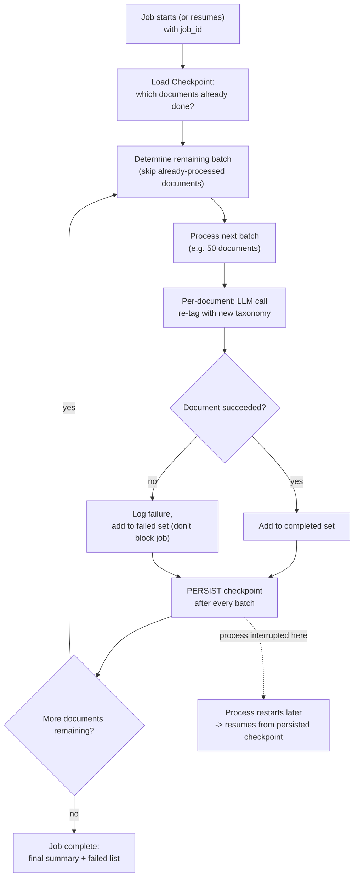

# Pattern 24: Long-Running Agent

## 1. What is a Long-Running Agent?

A **Long-Running Agent** handles a single logical task whose execution genuinely spans far
longer than one request/response cycle — minutes, hours, or days — requiring the task's
progress to be **checkpointed** along the way so it can survive process restarts, deployments,
or infrastructure hiccups without losing work or restarting from scratch. This is related to
but distinct from Human-in-the-Loop (Pattern 16), which pauses *waiting for a human*; a
Long-Running Agent may run entirely unattended the whole time — the length comes from the work
itself (many sequential steps, each possibly slow, or genuinely time-gated stages), not from
waiting on a person.

The core engineering requirement is the same "durable state" idea introduced in Pattern 16's
`CheckpointStore`, but applied to an agent's *own* multi-step progress rather than to a
human-approval gate — checkpointing becomes routine, ongoing infrastructure for the task
itself, not a one-time pause point.

## 2. What problem does it solves

Most patterns in this series assume the whole task completes within one process's lifetime —
a single function call, a single conversation turn, a single workflow run. Some real tasks
don't fit that assumption at all:

- A **large-scale document migration/reprocessing job** — re-analyzing and re-tagging tens of
  thousands of documents — might take many hours; if the process restarts (deployment, crash,
  scheduled maintenance) partway through, restarting from document #1 wastes enormous, real
  work.
- A **multi-day research compilation task** that needs to check in on slowly-updating external
  sources over several days can't be modeled as a single blocking function call at all —
  there's no way to "just wait" for days inside one request.
- **Naive in-memory progress tracking** (a Python list accumulating results in a running
  process) evaporates entirely on any restart, with no way to know what had already been done.

A Long-Running Agent solves this by treating checkpointing as an ongoing operational necessity
throughout the task, not an afterthought: after each meaningful unit of work, progress is
persisted, so a resumed run can pick up exactly where it left off — reusing the same durable
storage discipline established in Pattern 16 (`CheckpointStore`) and Pattern 21 (idempotent
stage tracking), now applied continuously across potentially thousands of internal steps rather
than a single approval gate or a handful of workflow stages.

## 3. Realistic production example: Bulk Document Re-Tagging Job

**A new example genuinely requiring durability across a long span.** A company changes its
document tagging taxonomy and needs to re-analyze and re-tag 10,000 existing support documents
with the new categories. This job:

1. Processes documents **one batch at a time**, persisting progress after every batch (not
   just at the very end).
2. Can be **safely interrupted and resumed** — if the process is killed after 6,000 of 10,000
   documents, restarting picks up at document 6,001, not document 1.
3. Reports **progress** that can be queried at any time, since a human overseeing a multi-hour
   job needs visibility into how far along it is without waiting for full completion.
4. Handles **per-document failures without derailing the whole job** — one document that fails
   to process shouldn't block the other 9,999; it's logged and the job continues, with a final
   summary of any documents that need manual attention.

## 4. Architecture / Flow Diagram



## 5. Request-to-response flow, step by step

1. **Job starts (or resumes)**: a `job_id` identifies this specific long-running task; on
   start, the agent loads any existing checkpoint for that `job_id` — if none exists, this is a
   fresh start; if one exists, this is a resume.
2. **Determine remaining work**: the checkpoint records which documents are already
   `completed` or `failed` — the agent computes the remaining set by excluding those from the
   full document list, so already-done work is never redone.
3. **Process in batches, not one giant loop**: work happens in fixed-size batches
   (e.g. 50 documents at a time) specifically so checkpointing can happen at a reasonable,
   bounded interval — checkpointing after every single document would be excessive I/O;
   checkpointing only at the very end defeats the purpose entirely.
4. **Per-document processing with failure isolation**: each document's re-tagging is an
   independent LLM call; a single document failing is logged and added to a `failed` set
   without stopping the batch or the job — mirroring the per-branch failure isolation from
   Pattern 9/15, applied here across a much larger number of independent units.
5. **Checkpoint persisted after every batch**: the completed/failed sets are written to durable
   storage after each batch completes — this is the frequency trade-off that makes the pattern
   practical: bounded data loss on interruption (at most one batch's worth of work), without
   excessive per-item persistence overhead.
6. **Interruption and resume**: if the process is killed at any point, the next invocation with
   the same `job_id` reloads the checkpoint and continues from exactly where the last persisted
   batch left off — no manual intervention needed to figure out what was already done.
7. **Progress queryable at any time**: because progress lives in persistent storage, not just
   in the running process's memory, a separate monitoring call can report "6,000 of 10,000
   processed, 12 failed" while the job is still running, without needing to interrupt it.
8. **Completion**: once no documents remain unprocessed, the job reports a final summary — the
   `failed` set is surfaced explicitly for manual follow-up, not silently absorbed into a
   "success" status.

## 6. Why this pattern fits (and when it doesn't)

**Fits well when:**
- The total task duration genuinely exceeds what a single process/request lifetime can be
  expected to reliably span.
- Work naturally decomposes into many independent units that can be processed incrementally
  and safely interrupted between units.
- Losing partial progress on interruption would be costly (time, compute, cost) enough to
  justify the checkpointing overhead.

**Doesn't fit when:**
- The task genuinely completes quickly — checkpointing infrastructure for a task that finishes
  in seconds is pure overhead with no benefit.
- Work units aren't independently resumable (each step depends intricately on in-memory state
  from the previous step that can't be cheaply reconstructed) — checkpointing needs genuinely
  resumable units of work to be effective; if that's not naturally true of the task, it needs
  to be restructured first, or this pattern won't actually deliver safe resumability.
- The task is naturally a bounded workflow with a handful of stages, not thousands of similar
  units — Pattern 21's Agentic Workflow (stage-level idempotency) is the better fit for that
  shape; Long-Running Agent is specifically for large-N, per-item checkpointing.

## 7. Production-quality implementation

```python
"""
Pattern 24: Long-Running Agent
------------------------------------
A bulk document re-tagging job that checkpoints progress after every
batch, safely resumable after interruption, with per-document failure
isolation and queryable progress.

Run prerequisites:
    ollama pull llama3.1:8b
    pip install -U langchain langchain-core langchain-ollama pydantic

Run:
    python long_running_agent.py
"""

from __future__ import annotations

import json
import logging
import time
from dataclasses import dataclass, field
from pathlib import Path
from typing import Optional

from langchain_core.messages import HumanMessage, SystemMessage
from langchain_core.output_parsers import PydanticOutputParser
from langchain_core.exceptions import OutputParserException
from langchain_ollama import ChatOllama
from pydantic import BaseModel, ValidationError

logging.basicConfig(
    level=logging.INFO,
    format="%(asctime)s | %(levelname)s | %(name)s | %(message)s",
)
logger = logging.getLogger("long_running_agent")


def invoke_structured(llm, system_content: str, user_content: str, parser, max_retries: int = 2):
    messages = [SystemMessage(content=system_content), HumanMessage(content=user_content)]
    last_error: Optional[Exception] = None
    for attempt in range(1, max_retries + 2):
        try:
            response = llm.invoke(messages)
            return parser.parse(response.content)
        except (OutputParserException, ValidationError) as e:
            last_error = e
            messages.append(HumanMessage(
                content="That wasn't valid JSON matching the schema. Respond again with "
                "ONLY the raw JSON object."
            ))
    raise RuntimeError(f"Structured call failed after retries: {last_error}")


# --------------------------------------------------------------------------
# Job checkpoint store — persists completed/failed document sets after
# every batch, so the job can resume exactly where it left off.
# --------------------------------------------------------------------------
class JobCheckpointStore:
    def __init__(self, directory: str = "long_running_jobs") -> None:
        self.dir = Path(directory)
        self.dir.mkdir(exist_ok=True)

    def _path(self, job_id: str) -> Path:
        return self.dir / f"{job_id}.json"

    def load(self, job_id: str) -> dict:
        path = self._path(job_id)
        if not path.exists():
            return {"completed": {}, "failed": {}}
        return json.loads(path.read_text())

    def save(self, job_id: str, checkpoint: dict) -> None:
        self._path(job_id).write_text(json.dumps(checkpoint, indent=2))
        logger.info(f"checkpoint_saved job_id={job_id} "
                    f"completed={len(checkpoint['completed'])} failed={len(checkpoint['failed'])}")


# --------------------------------------------------------------------------
# Structured re-tagging output
# --------------------------------------------------------------------------
class RetagResult(BaseModel):
    new_tags: list[str]


@dataclass
class JobProgress:
    total: int
    completed: int
    failed: int

    @property
    def remaining(self) -> int:
        return self.total - self.completed - self.failed

    @property
    def percent_complete(self) -> float:
        return round(100 * (self.completed + self.failed) / self.total, 1) if self.total else 100.0


# --------------------------------------------------------------------------
# The Long-Running Agent
# --------------------------------------------------------------------------
class BulkRetaggingJob:
    """Re-tags a large document set under the new taxonomy, checkpointing
    progress after every batch so the job survives interruption."""

    NEW_TAXONOMY = ["billing", "technical", "account", "product_feedback", "other"]

    RETAG_PROMPT = """Re-tag this support document under our NEW taxonomy. Choose 1-2 tags
from this exact list only: {taxonomy}

DOCUMENT: {document_text}

Respond with ONLY a JSON object matching this schema (no markdown fences, no extra text):
{format_instructions}
"""

    def __init__(self, model_name: str = "llama3.1:8b", temperature: float = 0.1,
                 max_retries: int = 2, batch_size: int = 5,
                 checkpoint_store: Optional[JobCheckpointStore] = None) -> None:
        self.llm = ChatOllama(model=model_name, temperature=temperature)
        self.max_retries = max_retries
        self.batch_size = batch_size
        self.checkpoint_store = checkpoint_store or JobCheckpointStore()
        self.parser = PydanticOutputParser(pydantic_object=RetagResult)

    def _retag_document(self, document_text: str) -> RetagResult:
        system_content = self.RETAG_PROMPT.format(
            taxonomy=", ".join(self.NEW_TAXONOMY), document_text=document_text,
            format_instructions=self.parser.get_format_instructions(),
        )
        return invoke_structured(self.llm, system_content, "Re-tag this document.",
                                  self.parser, self.max_retries)

    def get_progress(self, job_id: str, total_documents: int) -> JobProgress:
        checkpoint = self.checkpoint_store.load(job_id)
        return JobProgress(
            total=total_documents,
            completed=len(checkpoint["completed"]),
            failed=len(checkpoint["failed"]),
        )

    def run(self, job_id: str, documents: dict[str, str]) -> JobProgress:
        """documents: dict of {document_id: document_text}. Safely resumable
        by calling run() again with the same job_id and full document set —
        already-processed documents are skipped automatically."""

        checkpoint = self.checkpoint_store.load(job_id)
        remaining_ids = [
            doc_id for doc_id in documents
            if doc_id not in checkpoint["completed"] and doc_id not in checkpoint["failed"]
        ]
        logger.info(f"job_started_or_resumed job_id={job_id} "
                    f"total={len(documents)} remaining={len(remaining_ids)}")

        # Process in fixed-size batches, checkpointing after each one.
        for batch_start in range(0, len(remaining_ids), self.batch_size):
            batch_ids = remaining_ids[batch_start:batch_start + self.batch_size]

            for doc_id in batch_ids:
                try:
                    result = self._retag_document(documents[doc_id])
                    checkpoint["completed"][doc_id] = result.new_tags
                    logger.info(f"document_retagged doc_id={doc_id} tags={result.new_tags}")
                except Exception as e:
                    checkpoint["failed"][doc_id] = str(e)
                    logger.error(f"document_retag_failed doc_id={doc_id} error={e}")

            # Checkpoint after every batch — bounded data loss on interruption.
            self.checkpoint_store.save(job_id, checkpoint)

        return self.get_progress(job_id, total_documents=len(documents))


if __name__ == "__main__":
    store = JobCheckpointStore(directory="demo_long_running_jobs")
    job = BulkRetaggingJob(model_name="llama3.1:8b", batch_size=3, checkpoint_store=store)

    job_id = "retag_2026_08_run1"
    documents = {
        f"doc_{i}": text for i, text in enumerate([
            "Customer says they were charged twice for the same subscription renewal.",
            "App crashes when uploading files larger than 50MB.",
            "User wants to know if we offer annual billing discounts.",
            "Customer requesting their account be permanently deleted per GDPR.",
            "Feature suggestion: allow dark mode in the mobile app.",
            "Login fails intermittently with a 'session expired' error.",
            "Customer confused about why their invoice total changed mid-cycle.",
        ])
    }

    print("=" * 70)
    print(f"--- FIRST RUN (processing job_id={job_id}) ---")
    start = time.monotonic()
    progress = job.run(job_id, documents)
    elapsed = time.monotonic() - start

    print(f"[{elapsed:.1f}s] Progress: {progress.completed}/{progress.total} completed, "
          f"{progress.failed} failed, {progress.percent_complete}% done")

    print("\n--- SIMULATING A RESUME (same job_id, would skip already-completed docs) ---")
    progress2 = job.run(job_id, documents)  # all docs already done -> effectively a no-op pass
    print(f"Progress after resume attempt: {progress2.completed}/{progress2.total} completed "
          f"({progress2.percent_complete}% done) — nothing left to reprocess.")

    print("\n--- QUERYING PROGRESS WITHOUT RUNNING (e.g. from a monitoring dashboard) ---")
    queried_progress = job.get_progress(job_id, total_documents=len(documents))
    print(f"Queried progress: {queried_progress.percent_complete}% complete, "
          f"{queried_progress.remaining} remaining")
```

### Notes on the code

- **Checkpointing happens after every *batch*, not every document and not only at the end** —
  this is the deliberate frequency trade-off discussed in the flow: per-document checkpointing
  would add excessive I/O overhead for marginal benefit, while end-only checkpointing (or none
  at all) means an interruption anywhere in a multi-hour job loses everything back to the start.
- **`run()` is naturally idempotent-safe for resumption** — recomputing `remaining_ids` by
  excluding already-`completed`/`failed` document IDs means calling `run()` again with the same
  `job_id` and the same full document set is exactly how a resume after interruption works, with
  no special "resume mode" flag needed; a fresh start and a resume use the identical code path.
- **Per-document failures are isolated and tracked, never silently dropped or allowed to halt
  the batch** — one document raising an exception during `_retag_document` is caught, logged
  into `checkpoint["failed"]`, and the loop continues to the next document, mirroring the
  per-branch failure isolation established in Pattern 9 and Pattern 15, now applied across
  potentially thousands of independent units rather than a handful of parallel specialists.
- **`get_progress()` is a separate, read-only method** that only loads the checkpoint —
  demonstrating that progress can be queried by an entirely separate process (a monitoring
  dashboard, a status API endpoint) without needing to interact with, interrupt, or block the
  actual running job at all.
- **The final `failed` set is surfaced explicitly**, not folded into a generic "done" status —
  a long-running bulk job completing with some genuine per-item failures should never look
  identical to one that fully succeeded; the failed document IDs and their errors remain
  available for manual follow-up.

### Versions used

- Python `3.11+`
- `langchain-core` `0.3.x`
- `langchain-ollama` `0.2.x`
- `pydantic` `2.x`
- Model: `llama3.1:8b` via local Ollama

---

**Next: [Pattern 25 — Stateful Agent](25-stateful-agent.md)**, formalizing how an agent
manages in-progress state *within* a single active session more generally — the complementary
concept to this pattern's cross-restart durability, focused on session-scoped state management
design.
