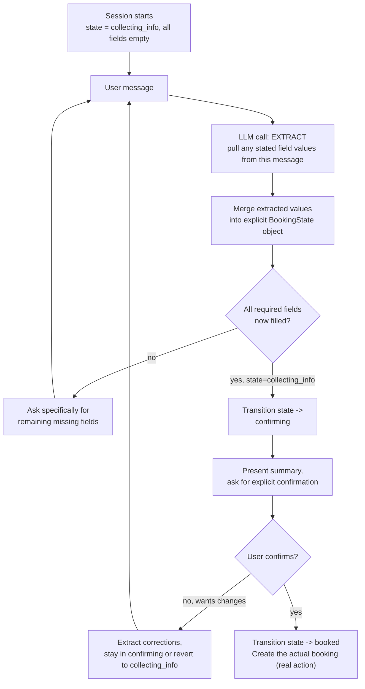

# Pattern 25: Stateful Agent

## 1. What is a Stateful Agent?

A **Stateful Agent** explicitly manages in-progress state across multiple turns of a single
active session — tracking what's been established, what's still needed, and what stage of a
multi-step interaction it's in — as a first-class, well-defined data structure rather than
implicitly inferring "where we are" from re-reading the raw conversation history every turn.
This is the complementary concept to Pattern 24's Long-Running Agent: that pattern was about
state surviving *across restarts* over long spans; this pattern is about state management
*within* an active session, done deliberately rather than left implicit.

The distinguishing design choice is: **state is an explicit object with defined fields and
valid transitions** (e.g. a `session_state` field that can only move `collecting_info` →
`confirming` → `complete`), not something the agent re-derives by re-reading the whole
transcript and guessing "what have we covered so far?" on every turn.

## 2. What problem does it solves

Every pattern involving multi-turn interaction so far (Pattern 17's `Conversation`, Pattern
18's memory) has used relatively loose state — a growing transcript or a simple fact list. For
genuinely **structured, multi-step interactions** where the agent needs to track specific
required information across several turns, relying on the model to re-infer progress from raw
conversation history every turn creates real problems:

- **Inconsistent understanding of progress.** Asking the model "what do we still need from the
  user?" fresh each turn, based on re-reading the transcript, can produce different answers on
  different turns for the same actual state — the model might ask for information already
  given, or skip something it should still be collecting.
- **No enforceable structure.** A booking flow that needs name → date → time → confirmation, in
  that order, has no guarantee of following that order if "what's next" is re-derived from
  loose transcript reading each turn rather than tracked explicitly.
- **Hard to build reliable UI/backend integration around loose state.** A frontend showing
  "step 3 of 4" or a backend deciding when to actually create a booking record needs a
  concrete, queryable state value — not a raw transcript it would have to re-parse itself.

A Stateful Agent solves this with an explicit state object with defined fields and valid
transitions, updated deliberately after each turn based on what was actually extracted from
that turn — the conversation history still exists for context, but the *authoritative* record
of progress is the structured state object, not a re-reading of that history.

## 3. Realistic production example: Appointment Booking Assistant

**A new example built specifically around required, ordered information collection.** A
scheduling assistant needs to collect four pieces of information before it can book an
appointment — service type, preferred date, preferred time, and contact email — and should:

1. Track exactly which fields are still missing at any point, explicitly.
2. Ask only for what's still missing (never re-ask for something already provided, even if the
   user provides fields out of the "natural" order or several at once).
3. Move through defined stages: `collecting_info` → `confirming` → `booked` — with the
   `confirming` stage requiring the user's explicit yes before actually creating the booking
   (echoing Pattern 4/16's "don't take a real action without confirmation" discipline, applied
   here to a fully in-session state machine rather than a cross-session pause).
4. Handle the user changing their mind mid-flow (e.g. correcting a previously given date)
   without breaking the state tracking.

## 4. Architecture / Flow Diagram



## 5. Request-to-response flow, step by step

1. **Session starts**: an explicit `BookingState` object is created with all required fields
   empty and `stage = collecting_info` — this object, not the transcript, is the authoritative
   record of progress from this point forward.
2. **Each user message is processed by an extraction call**, not a "what should I say next"
   call directly — the extraction call's only job is pulling out any field values the user just
   stated (which may be one field, several at once, or a correction to a previously given
   value), completely independent of deciding the next response.
3. **Extracted values are merged into the state object deterministically** (plain code, not an
   LLM decision) — this merge step is what makes the state authoritative and consistent: a
   field, once correctly extracted, is set in the object and doesn't need to be "remembered"
   by re-reading the transcript on subsequent turns.
4. **Missing-field check is a direct object query** (`if not state.service_type: ...`), not
   another LLM call asking "what's still needed" — since the state object already has the
   answer as plain data, checking it deterministically is both cheaper and more reliable than
   re-deriving it from text.
5. **Stage transitions are explicit and validated** — moving from `collecting_info` to
   `confirming` only happens once all required fields are genuinely filled (checked in code);
   moving from `confirming` to `booked` only happens on explicit user confirmation, never
   inferred loosely from an ambiguous response.
6. **The `confirming` stage can revert**: if the user wants to change something during
   confirmation, the correction is extracted and merged the same way, and the stage can move
   back to `collecting_info` if the change leaves a required field newly unclear — state
   transitions aren't strictly one-directional; they follow real conversational needs while
   still remaining explicit and validated.
7. **The real action (creating the booking) only fires on reaching `booked`**, and only once —
   guarded by the explicit stage check, preventing an accidental double-booking from a
   re-processed or duplicate message, similar in spirit to Pattern 23's idempotency discipline
   applied here to a single session's terminal action.

## 6. Why this pattern fits (and when it doesn't)

**Fits well when:**
- The interaction has genuinely required information that must be collected, in a way that
  benefits from explicit tracking rather than loose inference.
- There are real stages/transitions worth enforcing (e.g. never book without confirmation).
- Other systems (a UI, a backend) need to query "what stage is this session at" as a concrete
  value, not by re-parsing a transcript themselves.

**Doesn't fit when:**
- The interaction is genuinely open-ended with no required fields or stages to track — forcing
  a rigid state machine onto free-form conversation adds unnecessary constraint.
- A single-turn interaction (Basic Agent, Pattern 1) already suffices — there's no multi-turn
  progress to track at all.
- The "state" that matters is really durable, cross-session information — that's Agent Memory
  (Pattern 18), not in-session stage tracking; the two often combine (a stateful booking flow
  might also draw on remembered preferences), but they solve different problems.

## 7. Production-quality implementation

```python
"""
Pattern 25: Stateful Agent
--------------------------------
An appointment booking assistant with explicit, validated state tracking:
collecting_info -> confirming -> booked, never inferring progress loosely
from the raw transcript.

Run prerequisites:
    ollama pull llama3.1:8b
    pip install -U langchain langchain-core langchain-ollama pydantic

Run:
    python stateful_agent.py
"""

from __future__ import annotations

import logging
import time
from enum import Enum
from typing import Optional

from langchain_core.messages import HumanMessage, SystemMessage
from langchain_core.output_parsers import PydanticOutputParser
from langchain_core.exceptions import OutputParserException
from langchain_ollama import ChatOllama
from pydantic import BaseModel, Field, ValidationError

logging.basicConfig(
    level=logging.INFO,
    format="%(asctime)s | %(levelname)s | %(name)s | %(message)s",
)
logger = logging.getLogger("stateful_agent")


def invoke_structured(llm, system_content: str, user_content: str, parser, max_retries: int = 2):
    messages = [SystemMessage(content=system_content), HumanMessage(content=user_content)]
    last_error: Optional[Exception] = None
    for attempt in range(1, max_retries + 2):
        try:
            response = llm.invoke(messages)
            return parser.parse(response.content)
        except (OutputParserException, ValidationError) as e:
            last_error = e
            messages.append(HumanMessage(
                content="That wasn't valid JSON matching the schema. Respond again with "
                "ONLY the raw JSON object."
            ))
    raise RuntimeError(f"Structured call failed after retries: {last_error}")


# --------------------------------------------------------------------------
# Explicit state model — the authoritative record of session progress
# --------------------------------------------------------------------------
class Stage(str, Enum):
    COLLECTING_INFO = "collecting_info"
    CONFIRMING = "confirming"
    BOOKED = "booked"


class BookingState(BaseModel):
    stage: Stage = Stage.COLLECTING_INFO
    service_type: Optional[str] = None
    preferred_date: Optional[str] = None
    preferred_time: Optional[str] = None
    contact_email: Optional[str] = None
    user_confirmed: bool = False

    def missing_fields(self) -> list[str]:
        fields = {
            "service_type": self.service_type,
            "preferred_date": self.preferred_date,
            "preferred_time": self.preferred_time,
            "contact_email": self.contact_email,
        }
        return [name for name, value in fields.items() if not value]

    def all_fields_filled(self) -> bool:
        return len(self.missing_fields()) == 0


# --------------------------------------------------------------------------
# Extraction schema — pulls stated values out of a message; deliberately
# separate from deciding what to say next.
# --------------------------------------------------------------------------
class ExtractedFields(BaseModel):
    service_type: Optional[str] = None
    preferred_date: Optional[str] = None
    preferred_time: Optional[str] = None
    contact_email: Optional[str] = None
    wants_to_confirm: bool = Field(
        default=False, description="True if the user is explicitly confirming the booking"
    )
    wants_to_change_something: bool = Field(
        default=False, description="True if the user is correcting a previously given value"
    )


class AgentReply(BaseModel):
    reply_text: str


# --------------------------------------------------------------------------
# The Stateful Agent
# --------------------------------------------------------------------------
class AppointmentBookingAgent:
    """Manages an explicit BookingState across a session, only asking for
    missing fields, only booking on explicit confirmation."""

    EXTRACTION_PROMPT = """Extract any booking-relevant field values the user just stated in
this message. Only fill fields they actually stated — leave others null. Set
wants_to_confirm=true only if they're explicitly agreeing to proceed with the booking.

CURRENT KNOWN STATE: {current_state}

Respond with ONLY a JSON object matching this schema (no markdown fences, no extra text):
{format_instructions}
"""

    REPLY_PROMPT = """You are a friendly appointment booking assistant. Based on the current
state, either ask specifically for the missing fields, present a summary for confirmation, or
confirm the booking is complete — whichever is appropriate for the current stage.

CURRENT STATE: {state}

Respond with ONLY a JSON object matching this schema (no markdown fences, no extra text):
{format_instructions}
"""

    def __init__(self, model_name: str = "llama3.1:8b", temperature: float = 0.3, max_retries: int = 2) -> None:
        self.llm = ChatOllama(model=model_name, temperature=temperature)
        self.max_retries = max_retries
        self.extraction_parser = PydanticOutputParser(pydantic_object=ExtractedFields)
        self.reply_parser = PydanticOutputParser(pydantic_object=AgentReply)
        self.state = BookingState()

    def _extract(self, user_message: str) -> ExtractedFields:
        system_content = self.EXTRACTION_PROMPT.format(
            current_state=self.state.model_dump_json(),
            format_instructions=self.extraction_parser.get_format_instructions(),
        )
        return invoke_structured(self.llm, system_content, user_message,
                                  self.extraction_parser, self.max_retries)

    def _merge_extracted_fields(self, extracted: ExtractedFields) -> None:
        """Deterministic merge into the state object — plain code, not an
        LLM decision, so the state stays consistent and auditable."""
        if extracted.service_type:
            self.state.service_type = extracted.service_type
        if extracted.preferred_date:
            self.state.preferred_date = extracted.preferred_date
        if extracted.preferred_time:
            self.state.preferred_time = extracted.preferred_time
        if extracted.contact_email:
            self.state.contact_email = extracted.contact_email

    def _generate_reply(self) -> str:
        system_content = self.REPLY_PROMPT.format(
            state=self.state.model_dump_json(),
            format_instructions=self.reply_parser.get_format_instructions(),
        )
        result = invoke_structured(self.llm, system_content, "Generate the appropriate reply.",
                                    self.reply_parser, self.max_retries)
        return result.reply_text

    def _create_booking(self) -> None:
        # Simulated real action — in production this would call a real
        # scheduling system. Guarded so it can only ever fire once per
        # session, from the explicit BOOKED transition below.
        logger.info(f"[SIMULATED BOOKING CREATED] {self.state.model_dump_json()}")

    def handle_message(self, user_message: str) -> str:
        extracted = self._extract(user_message)
        logger.info(f"stage={self.state.stage} extracted={extracted.model_dump()}")

        if self.state.stage == Stage.COLLECTING_INFO:
            self._merge_extracted_fields(extracted)

            if self.state.all_fields_filled():
                self.state.stage = Stage.CONFIRMING
                logger.info("stage_transition collecting_info -> confirming")
            # else: stay in collecting_info, reply will ask for what's missing

        elif self.state.stage == Stage.CONFIRMING:
            if extracted.wants_to_change_something:
                self._merge_extracted_fields(extracted)
                if not self.state.all_fields_filled():
                    self.state.stage = Stage.COLLECTING_INFO
                    logger.info("stage_transition confirming -> collecting_info (correction left a gap)")
                # else: stays in confirming with the updated field(s)
            elif extracted.wants_to_confirm:
                self.state.user_confirmed = True
                self.state.stage = Stage.BOOKED
                self._create_booking()  # real action — only fires here, once
                logger.info("stage_transition confirming -> booked")

        # Stage.BOOKED: session is complete; further messages just get a
        # polite closing reply without re-triggering the booking action.

        return self._generate_reply()


if __name__ == "__main__":
    agent = AppointmentBookingAgent(model_name="llama3.1:8b")

    exchange = [
        "Hi, I'd like to book a dental cleaning.",
        "How about next Tuesday at 2pm? My email is jane@example.com",
        "Yes, that all looks right, please confirm it.",
    ]

    for msg in exchange:
        print("\n" + "=" * 70)
        print(f"USER: {msg}")
        print(f"[state before: stage={agent.state.stage}, "
              f"missing={agent.state.missing_fields()}]")

        start = time.monotonic()
        reply = agent.handle_message(msg)
        elapsed = time.monotonic() - start

        print(f"[{elapsed:.1f}s] AGENT: {reply}")
        print(f"[state after: stage={agent.state.stage}]")
```

### Notes on the code

- **`BookingState` is a plain Pydantic model with explicit fields and a `Stage` enum** — this
  is the authoritative record; `missing_fields()` and `all_fields_filled()` are deterministic
  methods on real data, not questions re-asked of an LLM each turn, matching the "prefer
  deterministic checks where the answer is just data" discipline seen since Pattern 6.
- **`_merge_extracted_fields` is plain code**, not an LLM call — the extraction call's job is
  narrowly "what did the user just say," and the merge into authoritative state is a
  deterministic, auditable step, keeping the two concerns (extraction vs. state update)
  cleanly separated.
- **Stage transitions are explicit `if` conditions in `handle_message`**, not inferred loosely
  — `collecting_info -> confirming` only fires when `all_fields_filled()` is genuinely true;
  `confirming -> booked` only fires when `extracted.wants_to_confirm` is genuinely set, mirroring
  the "never take a real action without explicit confirmation" discipline from Pattern 4/16.
- **`_create_booking()` can only ever be reached from the single `confirming -> booked`
  transition line** — structurally guarding against the booking firing more than once per
  session (e.g. from a re-processed message), similar in spirit to Pattern 23's idempotent
  event handling, applied here to a single session's one-time terminal action.
- **The `confirming` stage can revert to `collecting_info`** if a correction leaves a required
  field newly empty — showing that "explicit state machine" doesn't mean rigidly
  one-directional; transitions follow genuine conversational needs, they're just always
  validated and deliberate rather than inferred loosely from raw text each turn.

### Versions used

- Python `3.11+`
- `langchain-core` `0.3.x`
- `langchain-ollama` `0.2.x`
- `pydantic` `2.x`
- Model: `llama3.1:8b` via local Ollama

---

**Next (final): [Pattern 26 — Stateless Agent](26-stateless-agent.md)**, the deliberate
opposite design choice — an agent that carries zero memory of anything between calls,
examined for when that constraint is actually the right engineering decision rather than a
limitation.
