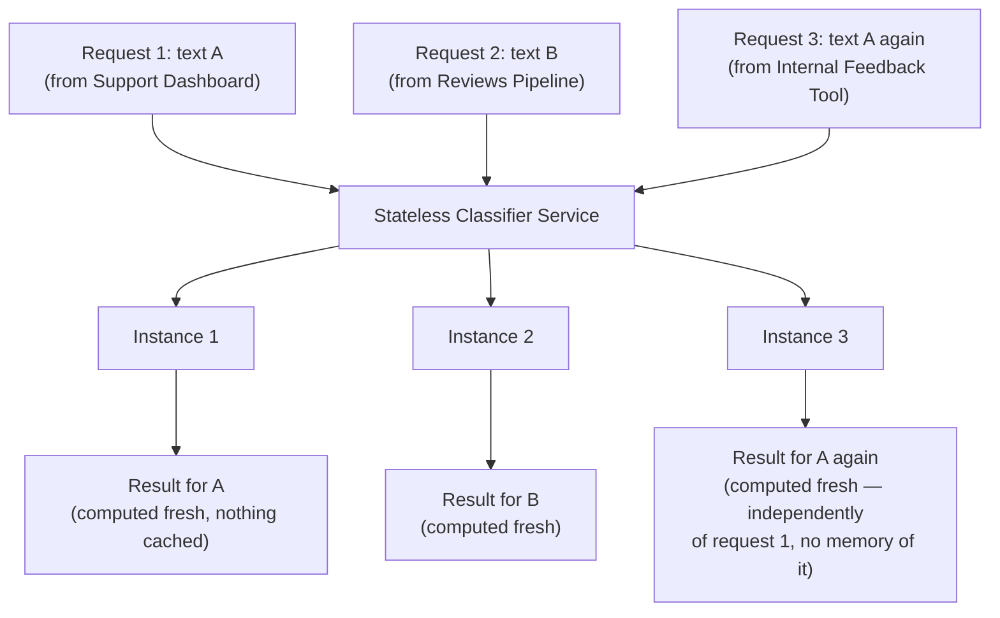

# Pattern 26: Stateless Agent

## 1. What is a Stateless Agent?

A **Stateless Agent** carries zero memory of anything between calls — every invocation is
fully self-contained, given exactly the input it needs and returning a result derived purely
from that input, with nothing cached, remembered, or accumulated internally. This is the
deliberate opposite of nearly every pattern in the second half of this series (Agent Memory,
Stateful Agent, Long-Running Agent) — and it's worth treating as its own explicit pattern
because **statelessness is a design choice with real, valuable properties**, not merely the
absence of the more sophisticated state-management patterns.

We've actually already built stateless agents throughout this series without naming the
property explicitly: Pattern 10's `InventoryCheckWorker.run()` and every LLM-calling function
in Pattern 15's `ParallelReviewAnalyzer` are stateless — each call is independent, and nothing
persists between them. This pattern makes that property explicit and examines *why* it's often
the right choice, not just an accident of how those examples were written.

## 2. What problem does it solves

Adding state (memory, session tracking, checkpointing) always adds real engineering cost —
storage, consistency concerns, cache invalidation, the risk of stale or leaked state between
unrelated requests. That cost is worth paying when a task genuinely needs cross-call context
(Patterns 18, 24, 25 all justified it). But reaching for state by default, even when a task
doesn't need it, causes real problems:

- **Horizontal scaling becomes harder.** A stateful agent tied to in-memory session data can
  only be served correctly by the specific process/instance holding that state, complicating
  load balancing across multiple servers — a stateless agent can be served by any instance,
  interchangeably, since nothing is pinned to a particular process's memory.
- **Concurrency bugs.** Shared mutable state accessed by concurrent requests (as in Pattern
  15's parallel branches, if they weren't careful to stay stateless) is a classic source of
  race conditions; a stateless design sidesteps this entirely by construction.
- **Unnecessary complexity for tasks that don't need it.** Building a memory or checkpoint
  system for a task that's genuinely a pure, independent transformation (like Pattern 1's
  ticket classification) adds engineering overhead with zero corresponding benefit.

The Stateless Agent pattern solves this not by adding a mechanism, but by **deliberately
withholding one** — recognizing when a task's nature makes statelessness the right default,
and designing the interface (pure function in, structured result out) to enforce that
property rather than leaving it accidental.

## 3. Realistic production example: Text Classification Microservice

**A new example chosen to be a clean, textbook case for statelessness.** A shared internal
microservice classifies arbitrary text snippets (support tickets, reviews, internal notes) by
sentiment and topic, called by many different unrelated systems across the company — a support
dashboard, a reviews pipeline, an internal feedback tool. This service:

1. Has **no concept of "session" or "user"** — it's a pure classification function, called
   with a text string, returning a classification, with nothing about the caller or prior
   calls retained.
2. Can be **horizontally scaled trivially** — any instance can serve any request; there's no
   session affinity requirement, no shared cache that needs synchronizing across instances.
3. Is **naturally safe under concurrency** — many callers hitting the service simultaneously
   never interact with each other's requests in any way, because there's no shared mutable
   state for them to contend over.
4. **Deliberately has no memory even when the same caller sends similar text repeatedly** — two
   calls with identical input always produce a fresh, independently-computed result; nothing
   is cached or remembered from a "previous similar request," which keeps the service's
   behavior simple to reason about and test.

## 4. Architecture / Flow Diagram



## 5. Request-to-response flow, step by step

1. **A request arrives at any available instance** — because there's no session state pinning
   a caller to a specific process, a load balancer can route to whichever instance is free,
   with no coordination needed between instances.
2. **The function receives exactly what it needs as input parameters** — no implicit context
   pulled from a session object, a cache, or prior calls; everything the classification depends
   on is explicit in the function signature.
3. **Processing happens purely from that input** — the LLM call is constructed entirely from
   the given text, with no injected "remembered" context from any other request, past or
   present.
4. **Structured result is returned directly** — no side effect of writing to a shared cache, no
   session update, nothing retained after the function returns.
5. **The next request, even for the exact same text, computed independently** — this is
   deliberate: Request 3 (same text as Request 1) doesn't benefit from or interact with Request
   1's result in any way; each call is islands, by design, since introducing caching (a form of
   implicit shared state) would reintroduce exactly the coordination/consistency concerns
   statelessness exists to avoid, unless caching is added as a *separate, explicit* layer with
   its own deliberate invalidation strategy.
6. **Any instance failing doesn't lose anything callers depend on** — because nothing important
   lived only in that instance's memory, an instance crashing and being replaced is
   operationally uneventful from the caller's perspective, beyond that one in-flight request
   needing a retry.

## 6. Why this pattern fits (and when it doesn't)

**Fits well when:**
- The task is a pure, independent transformation with no genuine need for prior-call context.
- Horizontal scalability and simple, predictable concurrency behavior matter — a common
  requirement for shared internal services called by many unrelated systems.
- Simplicity and testability are valuable — a stateless function is trivially easy to unit
  test (same input always exercises the same code path) compared to a stateful agent where
  test setup must also construct the right prior state.

**Doesn't fit when:**
- The task genuinely needs cross-call context — a returning customer's history (Agent Memory,
  Pattern 18), an in-progress multi-turn booking flow (Stateful Agent, Pattern 25), or a
  multi-hour job that must survive interruption (Long-Running Agent, Pattern 24). Forcing
  statelessness onto a task that structurally needs memory just pushes the state-management
  problem onto the caller, who now has to awkwardly resend everything every time.
- Performance genuinely benefits from caching, and that caching is deliberately designed as an
  explicit layer (with a real invalidation policy) — this doesn't contradict statelessness so
  much as clarify that a cache is a distinct, separately-reasoned-about component, not the
  agent quietly accumulating memory of its own.

## 7. Production-quality implementation

```python
"""
Pattern 26: Stateless Agent
---------------------------------
A shared text-classification microservice: every call is fully
self-contained, nothing cached or remembered between calls, trivially
safe under concurrency and horizontal scaling.

Run prerequisites:
    ollama pull llama3.1:8b
    pip install -U langchain langchain-core langchain-ollama pydantic

Run:
    python stateless_agent.py
"""

from __future__ import annotations

import logging
import time
from concurrent.futures import ThreadPoolExecutor, as_completed
from enum import Enum
from typing import Optional

from langchain_core.messages import HumanMessage, SystemMessage
from langchain_core.output_parsers import PydanticOutputParser
from langchain_core.exceptions import OutputParserException
from langchain_ollama import ChatOllama
from pydantic import BaseModel, ValidationError

logging.basicConfig(
    level=logging.INFO,
    format="%(asctime)s | %(levelname)s | %(name)s | %(message)s",
)
logger = logging.getLogger("stateless_agent")


def invoke_structured(llm, system_content: str, user_content: str, parser, max_retries: int = 2):
    messages = [SystemMessage(content=system_content), HumanMessage(content=user_content)]
    last_error: Optional[Exception] = None
    for attempt in range(1, max_retries + 2):
        try:
            response = llm.invoke(messages)
            return parser.parse(response.content)
        except (OutputParserException, ValidationError) as e:
            last_error = e
            messages.append(HumanMessage(
                content="That wasn't valid JSON matching the schema. Respond again with "
                "ONLY the raw JSON object."
            ))
    raise RuntimeError(f"Structured call failed after retries: {last_error}")


# --------------------------------------------------------------------------
# Structured output — this is the entire contract; nothing else passes
# between caller and service.
# --------------------------------------------------------------------------
class Sentiment(str, Enum):
    POSITIVE = "positive"
    NEGATIVE = "negative"
    NEUTRAL = "neutral"


class ClassificationResult(BaseModel):
    sentiment: Sentiment
    topic: str


# --------------------------------------------------------------------------
# The Stateless Agent
# --------------------------------------------------------------------------
class TextClassifierService:
    """A deliberately stateless classification service. `classify()` takes
    exactly the text to classify and returns a result computed purely from
    it — no session, no cache, no memory of any previous call, ever.

    Every attribute set in __init__ is IMMUTABLE configuration (model name,
    temperature, retry count) — never per-request or accumulated data. This
    is what makes a single instance safely shareable across concurrent
    requests and interchangeable with any other instance."""

    SYSTEM_PROMPT = """Classify this text's sentiment (positive, negative, or neutral) and
its general topic (a short phrase, e.g. "billing", "product quality", "shipping").

Respond with ONLY a JSON object matching this schema (no markdown fences, no extra text):
{format_instructions}
"""

    def __init__(self, model_name: str = "llama3.1:8b", temperature: float = 0.0, max_retries: int = 2) -> None:
        # Configuration only — fixed at construction, read-only thereafter,
        # never mutated by any call to classify().
        self.llm = ChatOllama(model=model_name, temperature=temperature)
        self.max_retries = max_retries
        self.parser = PydanticOutputParser(pydantic_object=ClassificationResult)
        self._system_content = self.SYSTEM_PROMPT.format(
            format_instructions=self.parser.get_format_instructions()
        )

    def classify(self, text: str) -> ClassificationResult:
        """Pure function: given text, returns a classification. Nothing
        about this call is retained after it returns — call it 1 time or
        1000 times, in any order, from any thread, and each call behaves
        identically given the same input."""
        if not text.strip():
            raise ValueError("text must be non-empty")

        return invoke_structured(
            self.llm, self._system_content, text, self.parser, self.max_retries
        )


if __name__ == "__main__":
    # A single shared instance, safely reused across many unrelated,
    # concurrent callers — this is the key operational benefit statelessness
    # provides: no coordination needed between callers or instances.
    service = TextClassifierService(model_name="llama3.1:8b")

    requests_from_different_callers = [
        ("Support Dashboard", "This is the third time my package has been delayed, I'm furious."),
        ("Reviews Pipeline", "Absolutely love this product, works exactly as described!"),
        ("Internal Feedback Tool", "The new dashboard layout takes some getting used to."),
        ("Support Dashboard", "This is the third time my package has been delayed, I'm furious."),  # same text again
    ]

    print("=" * 70)
    print("--- Simulating concurrent requests from unrelated callers ---")
    print("(demonstrating: no shared state, no interaction between calls, "
          "safe to run concurrently)\n")

    start = time.monotonic()
    with ThreadPoolExecutor(max_workers=4) as executor:
        futures = {
            executor.submit(service.classify, text): (caller, text)
            for caller, text in requests_from_different_callers
        }
        for future in as_completed(futures):
            caller, text = futures[future]
            result = future.result()
            print(f"[{caller}] text={text[:50]!r}...")
            print(f"    -> sentiment={result.sentiment} topic={result.topic}\n")
    elapsed = time.monotonic() - start

    print(f"All {len(requests_from_different_callers)} requests completed independently "
          f"in {elapsed:.1f}s wall-clock (concurrent, no coordination needed).")
    print("\nNote: requests 1 and 4 used identical text but were computed completely "
          "independently — no cache, no memory of the first call influenced the second.")
```

### Notes on the code

- **Every attribute set in `__init__` is immutable configuration**, never per-request data —
  `self.llm`, `self.max_retries`, `self.parser`, `self._system_content` are all fixed once at
  construction and read-only thereafter. This is the concrete rule that keeps a
  `TextClassifierService` instance safe to share: nothing about calling `classify()` ever
  writes to `self`, so many threads (as shown in the concurrent demo) can call the same
  instance simultaneously with zero risk of interference.
- **`classify()` takes everything it needs as a parameter and returns everything the caller
  needs as its return value** — no reading from or writing to any instance attribute beyond
  the fixed configuration, no reading from a global, no writing to a file. This is what "pure
  function" means in the code, not just in the docstring.
- **The `ThreadPoolExecutor` demo deliberately sends the same text twice** (requests 1 and 4)
  to make the "no memory between calls" property observable: both calls are independently
  computed, with the same latency and treatment either way — there's no cache making the
  second call faster, which is a stated design choice, not an oversight, since a cache would
  reintroduce implicit shared state that must be reasoned about separately from the agent's
  core logic.
- **Contrast directly with Pattern 25's `AppointmentBookingAgent`**: that agent's entire design
  centers on `self.state` accumulating and being mutated across calls to `handle_message` —
  the opposite of this pattern's core rule. Placing them side by side makes the underlying
  design axis explicit: does this task need `self` to change between calls, or not? Most of
  Patterns 1-17, 19-24, and 26 answer "no"; Patterns 18, 24 (via persisted checkpoints), and 25
  answer "yes."
- **If caching genuinely would help performance here** (e.g., truly identical text arriving
  very frequently), the right move is a separate, explicit caching layer wrapping this service
  — with its own deliberate invalidation policy — rather than letting `TextClassifierService`
  itself quietly start remembering results, which would blur the exact boundary this pattern
  exists to keep sharp.

### Versions used

- Python `3.11+`
- `langchain-core` `0.3.x`
- `langchain-ollama` `0.2.x`
- `pydantic` `2.x`
- Model: `llama3.1:8b` via local Ollama

---

## Series complete

That's all 26 agent patterns, each building on the ones before it — from a single validated
LLM call (Basic Agent) through tool use, reasoning loops, planning, self-verification,
multi-agent coordination, and the operational concerns (memory, statefulness, long-running
durability, event-driven and autonomous operation) that separate a working demo from a
production system. The `README.md` index ties them all together with setup instructions and
links to every pattern file.
