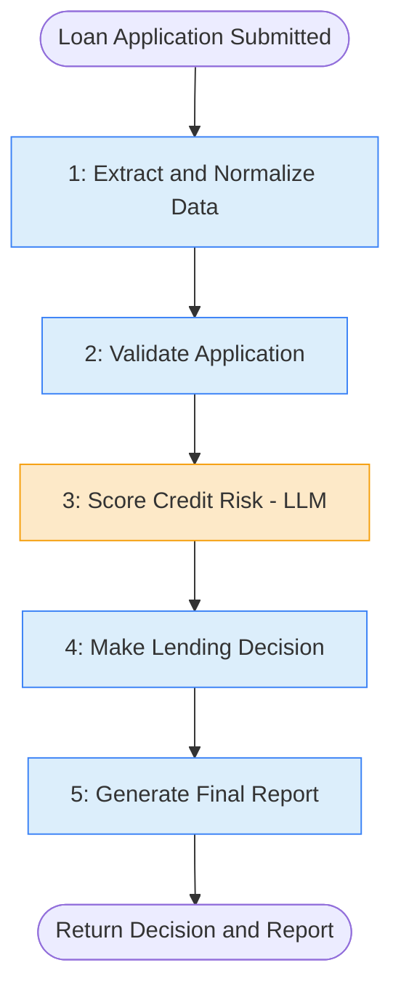

# 1. Sequential Workflow

## 1.1 What is it?

A **Sequential Workflow** runs a fixed list of steps **one after another, in a
straight line**. Step 2 only starts after Step 1 finishes, and it uses Step 1's
output as its input. There's no branching, no loops, no parallel work — just
`A → B → C → D`.

Think of it like an assembly line in a factory: the car body goes through
painting, then drying, then wheels, then final inspection. Every unit goes
through every station, in the same order, every time.

## 1.2 What problem does it solve?

Most real business processes are naturally a **pipeline of transformations**.
Raw input isn't usable right away — it needs to be cleaned, checked, enriched,
and turned into a final decision or document. Without a defined pattern,
developers end up writing one giant function that does everything, which is
hard to test, hard to debug, and hard to extend when a new step is needed.

The Sequential Workflow pattern solves this by:

- Breaking a big task into **small, single-purpose steps** (easy to test in
  isolation).
- Giving each step a **clear input and output contract** (shared state).
- Making the **order of operations explicit** and easy to see at a glance.
- Making it trivial to **insert, remove, or reorder** a step later.

## 1.3 Realistic production example: Loan Application Processing

A fintech company (`FastFund Lending`) receives online loan applications and
needs to turn each one into an approve/reject decision with a generated report
— without a human touching every single case.

The steps must always happen **in this exact order**, because each step
depends on the previous one's output:

1. **Extract & Normalize** — turn the raw applicant JSON into clean,
   typed fields (income, requested amount, employment status, etc.).
2. **Validate** — check the application has everything required and the
   numbers are sane (e.g., no negative income). Bad applications should be
   flagged clearly instead of silently crashing the pipeline.
3. **Score Credit Risk** — use an LLM (acting as a risk analyst) combined with
   simple business rules to produce a risk score and a rationale.
4. **Make Decision** — apply lending policy to the risk score to decide
   approve / reject / manual-review, with a max approved amount.
5. **Generate Report** — produce a clean, human-readable summary that a loan
   officer or the applicant can read.

This is a textbook Sequential Workflow: each step **strictly needs** the
previous one's result, and they always run in the same order for every
application.

## 1.4 Architecture / Flow Diagram



Each box is one **node** in a LangGraph `StateGraph`. The arrows are **edges**
that always point to exactly one next node — that's what makes it "sequential"
rather than conditional or parallel.

## 1.5 Request-to-response flow, step by step

1. A client (e.g., a web backend) sends a raw application dict to our
   `run_loan_pipeline()` function.
2. LangGraph creates an initial `LoanState` object from that input and enters
   the graph at the `extract_and_normalize` node.
3. **`extract_and_normalize`** reads raw fields, coerces types (e.g., string
   `"75000"` → float `75000.0`), fills in defaults, and writes the cleaned
   data back into the shared state. Execution moves to the next node.
4. **`validate_application`** checks the normalized data against business
   rules (required fields present, amounts positive, valid state code, etc).
   If validation fails, it doesn't crash — it sets `state.is_valid = False`
   and a list of `validation_errors`. The graph still proceeds (later nodes
   check `is_valid` and skip their real work if it's `False`), keeping the
   flow linear and predictable.
5. **`score_credit_risk`** calls the LLM with a strict, structured prompt
   asking for a JSON risk assessment (score 0–100 + reasoning). We parse and
   validate that JSON with Pydantic so a malformed model response can't crash
   the pipeline — it falls back to a safe "needs manual review" score.
6. **`make_decision`** applies simple, deterministic lending policy (e.g.,
   `risk_score >= 70 → approve`, `40–69 → manual review`, `< 40 → reject`) on
   top of the LLM's score. Keeping the *final* decision rule-based (not just
   "whatever the LLM says") is a common production pattern — the LLM assists,
   deterministic code decides.
7. **`generate_report`** turns everything gathered so far into a clean
   markdown report string.
8. The graph reaches `END`. LangGraph returns the final `LoanState`, which our
   wrapper function turns into a simple dict response for the caller.

At every step, **all data lives in one shared `state` object** that gets
passed from node to node and progressively filled in — that's the core
mechanic of a LangGraph sequential pipeline.

## 1.6 Why this pattern fits this problem

- The five steps have a **hard dependency order** — you can't score credit
  risk before you've validated and normalized the data, and you can't decide
  before you've scored risk. There's nothing to parallelize and no branching
  logic needed between steps (the "invalid application" case is handled
  *inside* each step, not by rerouting the graph).
- It keeps **audit-friendly structure**: for a regulated domain like lending,
  being able to point to "this is exactly the sequence of checks every
  application goes through" matters for compliance.
- Each node is **independently testable** — you can unit test
  `validate_application` with a bad payload without touching the LLM at all.
- It's the **simplest possible LangGraph graph**, which makes it the right
  starting point before layering on conditionals, loops, or parallel branches
  in later patterns.

## 1.7 Production-quality implementation

```python
"""
Sequential Workflow — Loan Application Processing Pipeline
Pattern: A -> B -> C -> D -> E (strict linear order)

Run:
    pip install "langgraph==1.2.10" "langchain==1.3.14" "langchain-anthropic==1.5.3" "pydantic==2.9.2"
    export ANTHROPIC_API_KEY=sk-ant-...
    python loan_pipeline.py
"""

from __future__ import annotations

import json
import logging
from typing import Optional

from langchain_anthropic import ChatAnthropic
from langgraph.graph import StateGraph, START, END
from pydantic import BaseModel, Field, field_validator

# --------------------------------------------------------------------------
# 1. Logging setup — production systems need visibility into each step
# --------------------------------------------------------------------------
logging.basicConfig(
    level=logging.INFO,
    format="%(asctime)s | %(levelname)s | %(name)s | %(message)s",
)
logger = logging.getLogger("loan_pipeline")


# --------------------------------------------------------------------------
# 2. Shared state — this object flows through every node in the graph.
#    Using Pydantic gives us validation + clear typed fields instead of
#    a loosely typed dict.
# --------------------------------------------------------------------------
class LoanState(BaseModel):
    # ---- raw input ----
    raw_application: dict = Field(default_factory=dict)

    # ---- filled in by extract_and_normalize ----
    applicant_name: Optional[str] = None
    annual_income: Optional[float] = None
    requested_amount: Optional[float] = None
    employment_status: Optional[str] = None
    credit_history_years: Optional[float] = None

    # ---- filled in by validate_application ----
    is_valid: bool = True
    validation_errors: list[str] = Field(default_factory=list)

    # ---- filled in by score_credit_risk ----
    risk_score: Optional[int] = None  # 0-100, higher = safer
    risk_rationale: Optional[str] = None

    # ---- filled in by make_decision ----
    decision: Optional[str] = None  # "approved" | "rejected" | "manual_review"
    approved_amount: Optional[float] = None

    # ---- filled in by generate_report ----
    final_report: Optional[str] = None


# --------------------------------------------------------------------------
# 3. Node 1 — Extract & Normalize
#    Turns messy raw input into clean, typed fields.
# --------------------------------------------------------------------------
def extract_and_normalize(state: LoanState) -> dict:
    logger.info("STEP 1/5 — extract_and_normalize")
    raw = state.raw_application

    def to_float(value, default=0.0) -> float:
        try:
            return float(value)
        except (TypeError, ValueError):
            return default

    return {
        "applicant_name": str(raw.get("name", "")).strip() or "Unknown Applicant",
        "annual_income": to_float(raw.get("annual_income")),
        "requested_amount": to_float(raw.get("requested_amount")),
        "employment_status": str(raw.get("employment_status", "unknown")).lower(),
        "credit_history_years": to_float(raw.get("credit_history_years")),
    }


# --------------------------------------------------------------------------
# 4. Node 2 — Validate
#    Business-rule checks. Failures are recorded, not thrown, so the
#    pipeline stays linear and later nodes can react to `is_valid`.
# --------------------------------------------------------------------------
def validate_application(state: LoanState) -> dict:
    logger.info("STEP 2/5 — validate_application")
    errors: list[str] = []

    if state.annual_income is None or state.annual_income <= 0:
        errors.append("annual_income must be a positive number")
    if state.requested_amount is None or state.requested_amount <= 0:
        errors.append("requested_amount must be a positive number")
    if state.requested_amount and state.annual_income:
        if state.requested_amount > state.annual_income * 5:
            errors.append("requested_amount exceeds 5x annual income cap")
    if state.employment_status not in {"employed", "self_employed", "unemployed"}:
        errors.append(f"unrecognized employment_status: {state.employment_status}")

    if errors:
        logger.warning("Validation failed: %s", errors)

    return {"is_valid": len(errors) == 0, "validation_errors": errors}


# --------------------------------------------------------------------------
# 5. Node 3 — Score Credit Risk (LLM-assisted)
#    Asks the model for a structured JSON risk assessment. We defensively
#    parse the response so a malformed LLM reply can never crash the graph.
# --------------------------------------------------------------------------
_risk_llm = ChatAnthropic(model="claude-sonnet-4-6", temperature=0)

_RISK_PROMPT = """You are a credit risk analyst. Given this loan applicant data, \
return ONLY a JSON object (no other text) with this exact shape:
{{"risk_score": <integer 0-100, higher means lower risk>, "rationale": "<one sentence>"}}

Applicant data:
- Annual income: {income}
- Requested amount: {amount}
- Employment status: {employment}
- Credit history (years): {history}
"""


def score_credit_risk(state: LoanState) -> dict:
    logger.info("STEP 3/5 — score_credit_risk")

    # Skip the (costly) LLM call entirely for applications that already
    # failed validation — nothing downstream needs a real score for them.
    if not state.is_valid:
        return {"risk_score": 0, "risk_rationale": "Skipped — application failed validation."}

    prompt = _RISK_PROMPT.format(
        income=state.annual_income,
        amount=state.requested_amount,
        employment=state.employment_status,
        history=state.credit_history_years,
    )

    try:
        response = _risk_llm.invoke(prompt)
        parsed = json.loads(response.content)
        score = int(parsed["risk_score"])
        score = max(0, min(100, score))  # clamp to valid range
        return {"risk_score": score, "risk_rationale": parsed.get("rationale", "")}
    except Exception as exc:  # noqa: BLE001 — deliberately broad: never let this crash the pipeline
        logger.error("LLM risk scoring failed, falling back to manual review: %s", exc)
        return {
            "risk_score": 50,  # neutral score -> routes to manual review below
            "risk_rationale": "Automated scoring unavailable; flagged for manual review.",
        }


# --------------------------------------------------------------------------
# 6. Node 4 — Make Decision
#    Deterministic business policy on top of the LLM's risk score.
#    Keeping the final call rule-based (not "whatever the LLM said") is a
#    common, important production practice for regulated decisions.
# --------------------------------------------------------------------------
def make_decision(state: LoanState) -> dict:
    logger.info("STEP 4/5 — make_decision")

    if not state.is_valid:
        return {"decision": "rejected", "approved_amount": 0.0}

    score = state.risk_score or 0
    if score >= 70:
        return {"decision": "approved", "approved_amount": state.requested_amount}
    elif score >= 40:
        return {"decision": "manual_review", "approved_amount": 0.0}
    else:
        return {"decision": "rejected", "approved_amount": 0.0}


# --------------------------------------------------------------------------
# 7. Node 5 — Generate Report
#    Final human-readable summary.
# --------------------------------------------------------------------------
def generate_report(state: LoanState) -> dict:
    logger.info("STEP 5/5 — generate_report")

    if not state.is_valid:
        report = (
            f"# Loan Application Report — {state.applicant_name}\n\n"
            f"**Decision:** REJECTED (failed validation)\n\n"
            f"**Issues found:**\n" + "\n".join(f"- {e}" for e in state.validation_errors)
        )
    else:
        report = (
            f"# Loan Application Report — {state.applicant_name}\n\n"
            f"**Requested amount:** ${state.requested_amount:,.2f}\n"
            f"**Annual income:** ${state.annual_income:,.2f}\n"
            f"**Risk score:** {state.risk_score}/100\n"
            f"**Risk rationale:** {state.risk_rationale}\n\n"
            f"**Decision:** {state.decision.upper().replace('_', ' ')}\n"
        )
        if state.decision == "approved":
            report += f"**Approved amount:** ${state.approved_amount:,.2f}\n"

    return {"final_report": report}


# --------------------------------------------------------------------------
# 8. Build the graph — this is where the "sequential" shape is defined.
#    Notice every edge points to exactly one next node: START -> A -> B ->
#    C -> D -> E -> END. No conditionals, no branches.
# --------------------------------------------------------------------------
def build_graph():
    graph = StateGraph(LoanState)

    graph.add_node("extract_and_normalize", extract_and_normalize)
    graph.add_node("validate_application", validate_application)
    graph.add_node("score_credit_risk", score_credit_risk)
    graph.add_node("make_decision", make_decision)
    graph.add_node("generate_report", generate_report)

    graph.add_edge(START, "extract_and_normalize")
    graph.add_edge("extract_and_normalize", "validate_application")
    graph.add_edge("validate_application", "score_credit_risk")
    graph.add_edge("score_credit_risk", "make_decision")
    graph.add_edge("make_decision", "generate_report")
    graph.add_edge("generate_report", END)

    return graph.compile()


# --------------------------------------------------------------------------
# 9. Public entry point
# --------------------------------------------------------------------------
def run_loan_pipeline(raw_application: dict) -> dict:
    app = build_graph()
    initial_state = LoanState(raw_application=raw_application)
    final_state = app.invoke(initial_state)
    # LangGraph returns a dict matching the state schema fields
    return final_state


# --------------------------------------------------------------------------
# 10. Demo
# --------------------------------------------------------------------------
if __name__ == "__main__":
    sample_application = {
        "name": "Jordan Reyes",
        "annual_income": "82000",
        "requested_amount": "25000",
        "employment_status": "Employed",
        "credit_history_years": "6",
    }

    result = run_loan_pipeline(sample_application)
    print(result["final_report"])
```

**Notes on production-readiness choices made above:**

- **Pydantic state** — every field has a type, so bugs where a node forgets
  to set a value (or sets the wrong type) surface immediately instead of
  silently propagating.
- **Every node returns a partial dict**, not the full state — this is the
  standard LangGraph node signature and makes each node's side effects
  obvious and minimal.
- **The LLM call is wrapped in `try/except`** with a safe fallback — a flaky
  model response (bad JSON, timeout, rate limit) degrades gracefully to
  "manual review" instead of crashing the whole pipeline. (A dedicated
  **Retry Pattern**, covered later in this series, would add automatic
  retries on top of this.)
- **Validation failures don't stop the graph** — they flow through as data
  (`is_valid`, `validation_errors`), keeping the graph itself simple and
  linear while still handling the "bad input" case correctly.
- **Logging at every step** — essential for debugging a pipeline in
  production, since you can trace exactly which step an application is at
  or failed at.

---

⬅ [Back to index](README.md) | Next: [2. Parallel Workflow](02-parallel-workflow.md) ➡
