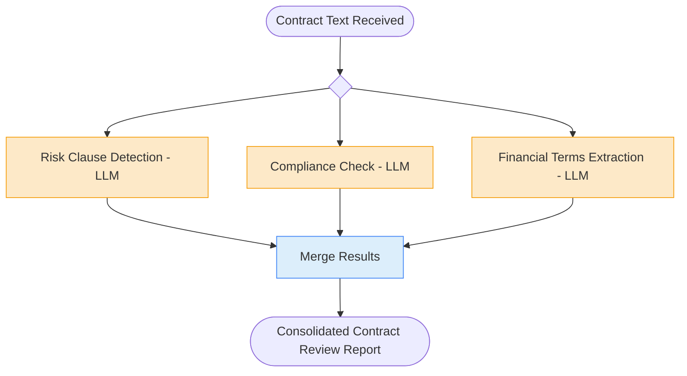

# 2. Parallel Workflow

## 2.1 What is it?

A **Parallel Workflow** runs multiple independent steps **at the same time**
instead of one after another, then waits for all of them to finish before
moving on. This is often called a **fan-out / join** shape: one starting
point "fans out" into several branches that run concurrently, and a final
node "joins" their results back together.

The key difference from Sequential: the branches **don't need each other's
output** to do their work. Step B doesn't wait for Step A — they both start
from the same input and run side by side.

## 2.2 What problem does it solve?

Many real pipelines have several **independent analyses** that all need to
happen on the same input before you can produce a final result. If you run
them one after another, your total time is the *sum* of every step. If
nothing actually depends on anything else, that's wasted time — especially
when each step is a slow network or LLM call.

The Parallel Workflow pattern solves this by:

- **Cutting total latency** — total time becomes roughly the time of the
  *slowest* branch, not the sum of all branches.
- Keeping each branch **simple and single-purpose**, same as Sequential —
  parallelism doesn't have to make code more complicated.
- Making it obvious in the graph **which steps are genuinely independent**,
  which is useful documentation on its own.
- Giving you one clear place (the join node) to **combine results** and
  decide what to do if one branch fails while others succeed.

## 2.3 Realistic production example: Contract Review Assistant

A legal-tech company (`ClauseIQ`) helps in-house legal teams review incoming
vendor contracts quickly. When a contract PDF's text comes in, three
completely independent analyses need to run on it:

1. **Risk Clause Detection** — find clauses that are unusually risky
   (liability caps, auto-renewal traps, one-sided termination rights).
2. **Compliance Check** — check the contract against a standard compliance
   checklist (data protection / GDPR mentions, confidentiality terms).
3. **Financial Terms Extraction** — pull out payment amounts, currency,
   payment schedule, and penalty terms.

None of these three analyses need each other's output — they all just need
the contract text. Today, if run one after another, each LLM call might take
5–8 seconds, so reviewing one contract sequentially takes ~20 seconds. Run in
parallel, it takes about as long as the *slowest single* analysis — usually
5–8 seconds — a ~3x speedup with zero extra infrastructure.

A fourth step then **merges** the three results into one structured contract
review report for the legal team.

## 2.4 Architecture / Flow Diagram



All three boxes on the middle row start from the **same** node (`START`) and
all flow into the **same** join node (`merge_results`) — that fan-out /
fan-in shape is what makes this a Parallel Workflow.

## 2.5 Request-to-response flow, step by step

1. A client sends the extracted contract text to `run_contract_review()`.
2. LangGraph builds the initial `ContractState` and looks at the graph: three
   nodes (`detect_risk_clauses`, `check_compliance`,
   `extract_financial_terms`) all have an edge directly from `START`, and
   none of them depend on each other's output. LangGraph recognizes they're
   all "ready" at the same time and schedules them **in the same super-step**
   — run concurrently, not one after another.
3. Because we call the graph with `ainvoke` (the async entry point), LangGraph
   runs these three nodes as concurrent `asyncio` tasks. Each one makes its
   own independent call to the local Ollama model.
4. **Critical detail:** all three nodes write to the *same* shared state
   object at the *same* time. If two nodes tried to overwrite the same field,
   whichever finished last would silently win and you'd lose data. We avoid
   this by giving each branch **its own dedicated state field**
   (`risk_findings`, `compliance_findings`, `financial_findings`) — so there's
   no overlap, and no special merge logic is even needed for the basic
   fields.
5. Once **all three** branches finish, LangGraph automatically moves to the
   next super-step: the `merge_results` node, since that's the only node
   whose *every* incoming edge has now completed.
6. **`merge_results`** reads all three findings from state and assembles one
   consolidated markdown report.
7. The graph reaches `END` and returns the final state to the caller.

## 2.6 Why this pattern fits this problem

- The three analyses are **genuinely independent** — none of them reads
  another's output, so there's no reason to force them into a sequence.
- Legal review tools are often used **interactively** (a lawyer waiting on
  screen), so cutting a 20-second wait down to ~7 seconds is a real,
  user-facing improvement — not just a nice-to-have.
- Running against a **local Ollama model** means these calls don't share an
  external rate limit the way a hosted API might, and concurrent local
  requests are cheap to make — a great fit for fanning out several calls at
  once.
- Using **separate state fields per branch** avoids race conditions without
  needing custom reducer logic — the simplest possible safe way to do
  parallel writes, appropriate for this join shape.

## 2.7 Production-quality implementation

```python
"""
Parallel Workflow — Contract Review Assistant
Pattern: START fans out to 3 independent branches -> join -> END

Run:
    pip install "langgraph==1.2.10" "langchain==1.3.14" "langchain-ollama==1.1.0" "pydantic==2.9.2"
    ollama pull llama3.1:8b     # make sure Ollama is running locally
    python contract_review.py
"""

from __future__ import annotations

import asyncio
import logging
from typing import Optional

from langchain_ollama import ChatOllama
from langgraph.graph import StateGraph, START, END
from pydantic import BaseModel, Field

# --------------------------------------------------------------------------
# 1. Logging
# --------------------------------------------------------------------------
logging.basicConfig(
    level=logging.INFO,
    format="%(asctime)s | %(levelname)s | %(name)s | %(message)s",
)
logger = logging.getLogger("contract_review")


# --------------------------------------------------------------------------
# 2. Shared state
#    Each parallel branch writes to its OWN dedicated field, so there's no
#    risk of two concurrent nodes overwriting the same key.
# --------------------------------------------------------------------------
class ContractState(BaseModel):
    contract_text: str = ""

    risk_findings: Optional[str] = None
    compliance_findings: Optional[str] = None
    financial_findings: Optional[str] = None

    final_report: Optional[str] = None


# --------------------------------------------------------------------------
# 3. Shared local model client.
#    temperature=0 for consistent, repeatable extraction-style output.
# --------------------------------------------------------------------------
_llm = ChatOllama(model="llama3.1:8b", temperature=0)


async def _call_llm(system_prompt: str, contract_text: str) -> str:
    """Small shared helper so each branch node stays short and consistent."""
    messages = [
        ("system", system_prompt),
        ("human", contract_text),
    ]
    response = await _llm.ainvoke(messages)
    return response.content.strip()


# --------------------------------------------------------------------------
# 4. Branch 1 — Risk Clause Detection (independent, async)
# --------------------------------------------------------------------------
async def detect_risk_clauses(state: ContractState) -> dict:
    logger.info("BRANCH — detect_risk_clauses (started)")
    try:
        result = await _call_llm(
            system_prompt=(
                "You are a contracts lawyer. List any risky clauses in this "
                "contract (liability caps, auto-renewal, one-sided termination "
                "rights). Be concise, use bullet points. If none, say 'None found.'"
            ),
            contract_text=state.contract_text,
        )
    except Exception as exc:  # noqa: BLE001
        logger.error("detect_risk_clauses failed: %s", exc)
        result = "Risk analysis unavailable — needs manual review."
    logger.info("BRANCH — detect_risk_clauses (finished)")
    return {"risk_findings": result}


# --------------------------------------------------------------------------
# 5. Branch 2 — Compliance Check (independent, async)
# --------------------------------------------------------------------------
async def check_compliance(state: ContractState) -> dict:
    logger.info("BRANCH — check_compliance (started)")
    try:
        result = await _call_llm(
            system_prompt=(
                "You are a compliance officer. Check this contract for data "
                "protection / GDPR mentions and confidentiality terms. Be "
                "concise, use bullet points. If a required item is missing, "
                "say so explicitly."
            ),
            contract_text=state.contract_text,
        )
    except Exception as exc:  # noqa: BLE001
        logger.error("check_compliance failed: %s", exc)
        result = "Compliance analysis unavailable — needs manual review."
    logger.info("BRANCH — check_compliance (finished)")
    return {"compliance_findings": result}


# --------------------------------------------------------------------------
# 6. Branch 3 — Financial Terms Extraction (independent, async)
# --------------------------------------------------------------------------
async def extract_financial_terms(state: ContractState) -> dict:
    logger.info("BRANCH — extract_financial_terms (started)")
    try:
        result = await _call_llm(
            system_prompt=(
                "Extract all financial terms from this contract: amounts, "
                "currency, payment schedule, and penalty terms. Be concise, "
                "use bullet points."
            ),
            contract_text=state.contract_text,
        )
    except Exception as exc:  # noqa: BLE001
        logger.error("extract_financial_terms failed: %s", exc)
        result = "Financial extraction unavailable — needs manual review."
    logger.info("BRANCH — extract_financial_terms (finished)")
    return {"financial_findings": result}


# --------------------------------------------------------------------------
# 7. Join node — runs only after ALL three branches complete
# --------------------------------------------------------------------------
def merge_results(state: ContractState) -> dict:
    logger.info("JOIN — merge_results")
    report = (
        "# Contract Review Report\n\n"
        "## Risk Clauses\n"
        f"{state.risk_findings}\n\n"
        "## Compliance\n"
        f"{state.compliance_findings}\n\n"
        "## Financial Terms\n"
        f"{state.financial_findings}\n"
    )
    return {"final_report": report}


# --------------------------------------------------------------------------
# 8. Build the graph — fan-out from START, fan-in to merge_results.
#    Three edges leave START; all three branches feed into merge_results.
# --------------------------------------------------------------------------
def build_graph():
    graph = StateGraph(ContractState)

    graph.add_node("detect_risk_clauses", detect_risk_clauses)
    graph.add_node("check_compliance", check_compliance)
    graph.add_node("extract_financial_terms", extract_financial_terms)
    graph.add_node("merge_results", merge_results)

    # Fan-out: all three start directly from START
    graph.add_edge(START, "detect_risk_clauses")
    graph.add_edge(START, "check_compliance")
    graph.add_edge(START, "extract_financial_terms")

    # Fan-in: merge_results only runs once ALL three have finished
    graph.add_edge("detect_risk_clauses", "merge_results")
    graph.add_edge("check_compliance", "merge_results")
    graph.add_edge("extract_financial_terms", "merge_results")

    graph.add_edge("merge_results", END)

    return graph.compile()


# --------------------------------------------------------------------------
# 9. Public entry point — async, so the branches truly run concurrently.
# --------------------------------------------------------------------------
async def run_contract_review(contract_text: str) -> dict:
    app = build_graph()
    initial_state = ContractState(contract_text=contract_text)
    final_state = await app.ainvoke(initial_state)
    return final_state


# --------------------------------------------------------------------------
# 10. Demo
# --------------------------------------------------------------------------
if __name__ == "__main__":
    sample_contract = """
    This Master Services Agreement automatically renews annually unless
    either party gives 90 days' notice. Vendor's liability is capped at
    $500 regardless of damages. Client agrees to pay $12,000/month, due on
    the 1st, with a 5% late penalty after 10 days. Confidential information
    must be protected per applicable data protection law.
    """

    result = asyncio.run(run_contract_review(sample_contract))
    print(result["final_report"])
```

**Notes on production-readiness choices made above:**

- **Async nodes + `ainvoke`** — this is what actually makes the three LLM
  calls run concurrently rather than one after another. Using the sync
  `.invoke()` entry point here would silently make the branches run in
  sequence again, defeating the whole point of the pattern.
- **One dedicated state field per branch** (`risk_findings`,
  `compliance_findings`, `financial_findings`) — the simplest way to make
  concurrent writes safe. (When branches genuinely need to write to a
  *shared* field, like appending to one list, LangGraph state supports
  `Annotated[list, operator.add]`-style reducers — that's a detail worth
  knowing but isn't needed for this example.)
- **Each branch has its own `try/except`** — one branch failing (e.g., a
  local model timeout) doesn't crash the other two or the whole pipeline; it
  degrades to a "needs manual review" message instead.
- **Local model via Ollama** — no external API keys, no shared rate limit
  across the three concurrent calls, which is exactly the kind of situation
  where firing off several requests at once is cheap and safe to do.

---

⬅ [1. Sequential Workflow](01-sequential-workflow.md) | [Back to index](README.md) | Next: [3. Conditional Workflow](03-conditional-workflow.md) ➡
