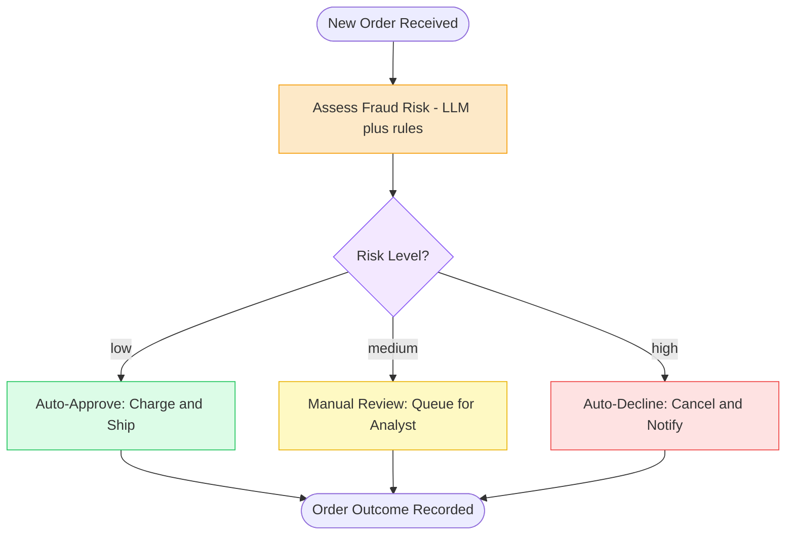

# 3. Conditional Workflow

## 3.1 What is it?

A **Conditional Workflow** evaluates a condition on the current state and then
sends execution down **one specific path out of several possible paths** —
like an `if / elif / else` in code, but as part of the graph itself. Only the
chosen path's nodes run; the others are skipped entirely.

This is different from the Parallel Workflow we just covered: in Parallel,
*every* branch always runs, at the same time. In Conditional, exactly **one**
branch runs, chosen by a decision made at runtime.

## 3.2 What problem does it solve?

Many real processes don't treat every case the same way. A cheap, obviously
safe case should be handled quickly and automatically. A risky or unusual
case needs a different, more careful path — sometimes even a human. Trying to
force every case through the exact same steps either wastes effort on easy
cases or under-handles risky ones.

The Conditional Workflow pattern solves this by:

- Letting the system **do less work for the easy cases** (skip unnecessary
  steps entirely instead of running them and ignoring the result).
- Making it possible for different cases to get **genuinely different
  treatment** — not just different final labels, but different logic.
- Keeping the **decision point explicit and visible** in the graph, instead
  of buried inside a big function full of `if` statements.
- Making each path **independently extendable** later — you can add steps to
  the "high risk" path without touching the "low risk" path at all.

## 3.3 Realistic production example: Order Fraud Check

An e-commerce platform (`AcmeShop`) needs to decide, for every new order,
what to do about fraud risk before the order ships:

1. **Assess Risk** — an LLM (plus simple signals like order amount vs.
   account age) produces a risk level: `low`, `medium`, or `high`.
2. **Branch on risk level:**
   - **`low`** → **Auto-Approve path**: charge the card and queue the order
     for shipping immediately. No human involved.
   - **`medium`** → **Manual Review path**: hold the order and create a
     review-queue entry with the reasons flagged, for a human analyst to
     check.
   - **`high`** → **Auto-Decline path**: cancel the order, release any
     authorization hold, and send the customer a decline notice.

Each of these three paths does **genuinely different work** — different
external calls, different customer-facing messages — not just a different
label on the same steps. That's what makes this a Conditional Workflow rather
than, say, a Parallel one.

## 3.4 Architecture / Flow Diagram



The diamond is the decision point. Only **one** of the three colored boxes
below it actually runs for any given order — that single-path-chosen shape is
the signature of a Conditional Workflow.

## 3.5 Request-to-response flow, step by step

1. A client sends new order data (amount, customer info, account age, etc.)
   to `run_order_fraud_check()`.
2. LangGraph builds the initial `OrderState` and enters at `assess_risk`.
3. **`assess_risk`** calls the local Ollama model with the order details and
   asks for a risk classification, defensively parsed into exactly one of
   `"low"`, `"medium"`, `"high"` (anything unparseable safely defaults to
   `"medium"` — when in doubt, prefer a human looking at it over an
   automatic approval).
4. LangGraph reaches a **conditional edge** attached to `assess_risk`. Instead
   of a fixed next node, this edge calls a small **routing function**
   (`route_by_risk`) that reads `state.risk_level` and returns the *name* of
   the next node to run: `"auto_approve"`, `"manual_review"`, or
   `"auto_decline"`.
5. LangGraph runs **only** that one node. The other two branch functions are
   never called for this order — no wasted API calls, no wasted work.
6. Whichever path ran (`auto_approve`, `manual_review`, or `auto_decline`)
   writes the outcome into `state.outcome_summary`.
7. All three paths converge back to a single `END`, so the caller always gets
   the same shape of result back regardless of which path was taken.

## 3.6 Why this pattern fits this problem

- Fraud risk **genuinely calls for different actions**, not just a different
  status label — charging a card, queuing for a human, and canceling an
  order are three different operations with different side effects.
- It avoids **unnecessary work and cost**: a clearly low-risk order never
  touches the manual-review queue infrastructure, and a clearly high-risk
  order never triggers a real charge.
- The **decision point is a single, testable function** (`route_by_risk`) —
  you can unit test the routing logic ("does `high` route to
  `auto_decline`?") completely separately from the LLM call or the actual
  charge/cancel logic.
- Using a **local Ollama model** for the classification step keeps this
  interactive-speed decision cheap to run on every single order, which
  matters at e-commerce volume.

## 3.7 Production-quality implementation

```python
"""
Conditional Workflow — Order Fraud Check
Pattern: one decision point routes execution down exactly ONE of several paths

Run:
    pip install "langgraph==1.2.10" "langchain==1.3.14" "langchain-ollama==1.1.0" "pydantic==2.9.2"
    ollama pull llama3.1:8b     # make sure Ollama is running locally
    python order_fraud_check.py
"""

from __future__ import annotations

import logging
from typing import Literal, Optional

from langchain_ollama import ChatOllama
from langgraph.graph import StateGraph, START, END
from pydantic import BaseModel, Field

# --------------------------------------------------------------------------
# 1. Logging
# --------------------------------------------------------------------------
logging.basicConfig(
    level=logging.INFO,
    format="%(asctime)s | %(levelname)s | %(name)s | %(message)s",
)
logger = logging.getLogger("order_fraud_check")


# --------------------------------------------------------------------------
# 2. Shared state
# --------------------------------------------------------------------------
class OrderState(BaseModel):
    order_id: str = ""
    order_amount: float = 0.0
    customer_account_age_days: int = 0
    shipping_country: str = ""
    billing_country: str = ""

    risk_level: Optional[Literal["low", "medium", "high"]] = None
    risk_rationale: Optional[str] = None

    outcome_summary: Optional[str] = None


# --------------------------------------------------------------------------
# 3. Local model client
# --------------------------------------------------------------------------
_llm = ChatOllama(model="llama3.1:8b", temperature=0)

_RISK_PROMPT = """You are a fraud analyst. Classify this order's fraud risk.
Respond with ONLY one word on the first line: low, medium, or high.
On the second line, give a one-sentence reason.

Order details:
- Amount: ${amount:,.2f}
- Customer account age: {age} days
- Shipping country: {shipping_country}
- Billing country: {billing_country}
"""


# --------------------------------------------------------------------------
# 4. Node — Assess Risk (the decision-producing step)
# --------------------------------------------------------------------------
def assess_risk(state: OrderState) -> dict:
    logger.info("STEP — assess_risk for order %s", state.order_id)

    prompt = _RISK_PROMPT.format(
        amount=state.order_amount,
        age=state.customer_account_age_days,
        shipping_country=state.shipping_country,
        billing_country=state.billing_country,
    )

    try:
        response = _llm.invoke(prompt)
        lines = [line.strip() for line in response.content.strip().splitlines() if line.strip()]
        first_word = lines[0].lower() if lines else ""
        rationale = lines[1] if len(lines) > 1 else "No rationale provided."

        if "high" in first_word:
            level = "high"
        elif "low" in first_word:
            level = "low"
        else:
            # Anything unclear (including "medium" or a malformed reply)
            # safely defaults to medium -> routes to a human, never to
            # an automatic approval or an automatic decline.
            level = "medium"

        return {"risk_level": level, "risk_rationale": rationale}

    except Exception as exc:  # noqa: BLE001 — never let a flaky model call crash the pipeline
        logger.error("Risk assessment failed, defaulting to manual review: %s", exc)
        return {
            "risk_level": "medium",
            "risk_rationale": "Automated assessment unavailable; routed to manual review.",
        }


# --------------------------------------------------------------------------
# 5. Routing function — reads state, returns the NAME of the next node.
#    This is the heart of the Conditional Workflow pattern.
# --------------------------------------------------------------------------
def route_by_risk(state: OrderState) -> str:
    if state.risk_level == "low":
        return "auto_approve"
    elif state.risk_level == "high":
        return "auto_decline"
    else:
        return "manual_review"


# --------------------------------------------------------------------------
# 6. Branch A — Auto-Approve path (only runs for low risk)
# --------------------------------------------------------------------------
def auto_approve(state: OrderState) -> dict:
    logger.info("BRANCH — auto_approve for order %s", state.order_id)
    # In production: call the payment gateway to charge the card,
    # then call the fulfillment service to queue shipping.
    # charge_result = payment_gateway.charge(state.order_id, state.order_amount)
    # fulfillment.queue_for_shipping(state.order_id)
    summary = (
        f"Order {state.order_id} AUTO-APPROVED (risk: low). "
        f"Card charged, order queued for shipping."
    )
    return {"outcome_summary": summary}


# --------------------------------------------------------------------------
# 7. Branch B — Manual Review path (only runs for medium risk)
# --------------------------------------------------------------------------
def manual_review(state: OrderState) -> dict:
    logger.info("BRANCH — manual_review for order %s", state.order_id)
    # In production: write a row to the review-queue table/service with
    # the risk rationale attached so an analyst can act on it.
    # review_queue.enqueue(order_id=state.order_id, reason=state.risk_rationale)
    summary = (
        f"Order {state.order_id} HELD FOR MANUAL REVIEW (risk: medium). "
        f"Reason: {state.risk_rationale}"
    )
    return {"outcome_summary": summary}


# --------------------------------------------------------------------------
# 8. Branch C — Auto-Decline path (only runs for high risk)
# --------------------------------------------------------------------------
def auto_decline(state: OrderState) -> dict:
    logger.info("BRANCH — auto_decline for order %s", state.order_id)
    # In production: release any payment authorization hold and
    # send the customer a decline notification email.
    # payment_gateway.release_hold(state.order_id)
    # notifications.send_decline_email(state.order_id)
    summary = (
        f"Order {state.order_id} AUTO-DECLINED (risk: high). "
        f"Reason: {state.risk_rationale}"
    )
    return {"outcome_summary": summary}


# --------------------------------------------------------------------------
# 9. Build the graph — one conditional edge fans out to exactly one branch.
# --------------------------------------------------------------------------
def build_graph():
    graph = StateGraph(OrderState)

    graph.add_node("assess_risk", assess_risk)
    graph.add_node("auto_approve", auto_approve)
    graph.add_node("manual_review", manual_review)
    graph.add_node("auto_decline", auto_decline)

    graph.add_edge(START, "assess_risk")

    # The conditional edge: after assess_risk, call route_by_risk(state).
    # Whatever node name it returns is the ONLY node that runs next.
    graph.add_conditional_edges(
        "assess_risk",
        route_by_risk,
        {
            "auto_approve": "auto_approve",
            "manual_review": "manual_review",
            "auto_decline": "auto_decline",
        },
    )

    # All three paths converge to the same END.
    graph.add_edge("auto_approve", END)
    graph.add_edge("manual_review", END)
    graph.add_edge("auto_decline", END)

    return graph.compile()


# --------------------------------------------------------------------------
# 10. Public entry point
# --------------------------------------------------------------------------
def run_order_fraud_check(order: dict) -> dict:
    app = build_graph()
    initial_state = OrderState(**order)
    final_state = app.invoke(initial_state)
    return final_state


# --------------------------------------------------------------------------
# 11. Demo
# --------------------------------------------------------------------------
if __name__ == "__main__":
    sample_orders = [
        {
            "order_id": "ORD-1001",
            "order_amount": 45.00,
            "customer_account_age_days": 730,
            "shipping_country": "US",
            "billing_country": "US",
        },
        {
            "order_id": "ORD-1002",
            "order_amount": 2800.00,
            "customer_account_age_days": 1,
            "shipping_country": "US",
            "billing_country": "RO",
        },
    ]

    for order in sample_orders:
        result = run_order_fraud_check(order)
        print(result["outcome_summary"])
```

**Notes on production-readiness choices made above:**

- **`add_conditional_edges` + a routing function** — this is the LangGraph
  mechanism that makes a step genuinely conditional instead of just a node
  that happens to check a flag internally. The graph structure itself shows
  the three possible destinations.
- **Unclear model output defaults to `"medium"`**, never to `"low"` — a
  malformed or unexpected LLM response should never accidentally auto-approve
  a risky order. When a classifier is uncertain, routing to a human is the
  safe default, not routing to the fastest path.
- **Each branch node is a placeholder for a real side-effecting call**
  (charge card, write to a queue, send an email) — the comments show exactly
  where production integration code would go, keeping the example runnable
  without needing real payment/notification services.
- **All three branches return the same field** (`outcome_summary`) — even
  though the branches do different work, keeping their *output shape*
  consistent makes the graph's result predictable for the caller regardless
  of which path ran.

---

⬅ [2. Parallel Workflow](02-parallel-workflow.md) | [Back to index](README.md) | Next: [4. Branching](04-branching.md) ➡
