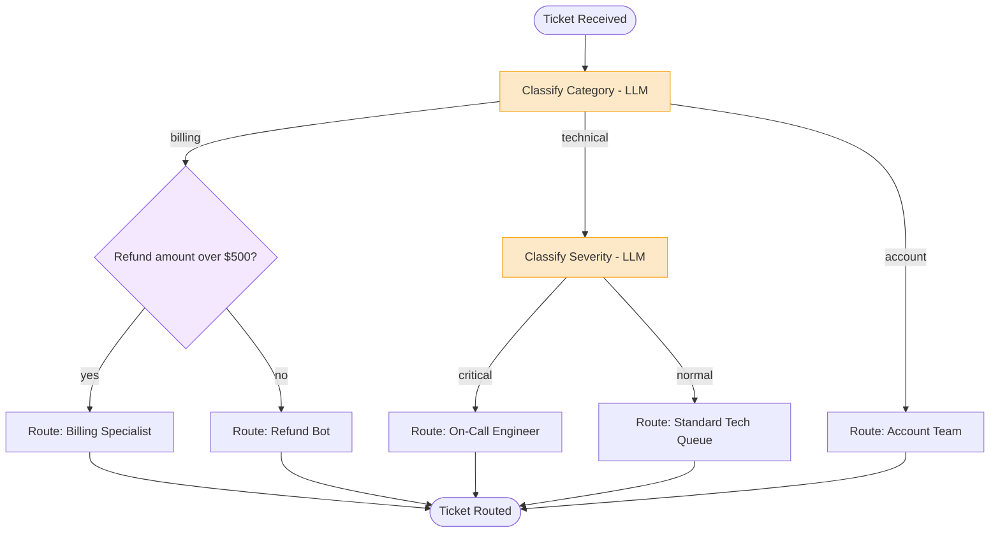

# 4. Branching

## 4.1 What is it?

**Branching** is a **decision tree** — multiple decision points chained
together, where the outcome of one decision determines *which further
decision* gets made next. It's the natural extension of Pattern 3
(Conditional Workflow), which had exactly **one** decision point with several
possible destinations. Branching has **more than one** decision point, nested
inside each other, forming a tree instead of a single flat switch.

Think of it like a phone menu: "Press 1 for Sales, 2 for Support." If you
press 2, you get a *second* menu: "Press 1 for Billing issues, 2 for
Technical issues." Each level narrows things down further, and different
branches can have a different number of sub-levels.

## 4.2 What problem does it solve?

A single decision is often not enough to route something correctly. Real
categorization usually happens in **layers**: first a broad category, then
something more specific within that category, and the "something more
specific" question is often completely different depending on which broad
category you're in (billing questions get asked about refund amounts;
technical questions get asked about severity — those aren't the same
question).

The Branching pattern solves this by:

- Letting each branch **ask its own follow-up question**, instead of forcing
  one giant decision point to somehow account for every combination up
  front.
- Keeping each individual decision **simple and narrow** (a 2–3 way choice),
  rather than one sprawling classifier trying to output 10+ combined
  categories directly.
- Making it easy to **change one branch's sub-routing** without touching
  sibling branches at all — the technical team can change how severity is
  decided without affecting how billing is decided.
- Mixing **LLM-based decisions and plain rule-based decisions** naturally at
  different levels of the same tree, using whichever is more appropriate for
  that particular question.

## 4.3 Realistic production example: Support Ticket Intelligent Routing

A SaaS company (`GridWorks`) receives support tickets that need to reach the
right queue. A single flat classifier isn't enough here, because "what do we
ask next" is different for each category:

**Level 1 — Category** (LLM classification): `billing`, `technical`, or
`account`.

- If **`billing`** → **Level 2 — Refund amount** (plain rule, no LLM
  needed): if the disputed amount is over $500, route to a human
  **Billing Specialist**; otherwise route to the automated **Refund Bot**
  (fast, self-service resolution for small amounts).
- If **`technical`** → **Level 2 — Severity** (LLM classification): if the
  ticket describes a critical outage (`"down"`, `"can't log in"`,
  `"data loss"`), route to the **On-Call Engineer** queue immediately;
  otherwise route to the **Standard Technical Queue**.
- If **`account`** → no further branching needed; route straight to the
  **Account Team**.

Notice the tree isn't symmetric: `billing` and `technical` each split again,
`account` doesn't. That's normal and expected for Branching — different
branches can have different depths.

## 4.4 Architecture / Flow Diagram



Two separate decision points exist here (`L1` and, on two of the three
branches, a second-level decision) — that's the tree shape that distinguishes
Branching from Pattern 3's single flat switch.

## 4.5 Request-to-response flow, step by step

1. A client sends the raw ticket text to `run_ticket_routing()`.
2. LangGraph builds the initial `TicketState` and enters at
   `classify_category` — **Level 1** of the tree.
3. **`classify_category`** calls the local Ollama model, parsing the reply
   into exactly one of `"billing"`, `"technical"`, `"account"` (defaulting to
   `"account"` — the safest, simplest queue — if the response is unclear).
4. A **conditional edge** on `classify_category` reads `state.category` and
   routes to one of three next nodes: `check_refund_amount`,
   `classify_severity`, or `route_to_account_team`.
5. **If `billing`:** `check_refund_amount` runs — this is a **plain Python
   rule**, not an LLM call, because "is this number over 500" doesn't need a
   model. It sets `state.needs_specialist`. A **second conditional edge**
   then routes to `route_to_billing_specialist` or `route_to_refund_bot`
   based on that boolean.
6. **If `technical`:** `classify_severity` runs — this *is* an LLM call,
   because "does this description sound like a critical outage" is a
   judgment call suited to a model. A second conditional edge routes to
   `route_to_oncall` or `route_to_standard_queue` based on the result.
7. **If `account`:** `route_to_account_team` runs directly — no second
   decision needed for this branch.
8. Whichever leaf node ran writes `state.routing_decision` and
   `state.routing_reason`. All leaves converge to `END`, so the caller always
   gets the same result shape back.

## 4.6 Why this pattern fits this problem

- The **follow-up question genuinely differs by category** — asking a
  billing ticket about "severity" or a technical ticket about "refund
  amount" wouldn't make sense. Branching lets each path define its own
  relevant next question.
- It lets us **use the cheapest adequate tool at each decision** — a fast,
  free `if amount > 500` check for billing, and a real LLM call only where
  judgment is actually needed (severity, category). A flat single-classifier
  design would be tempted to just ask the LLM everything, which is slower and
  costs more for questions that don't need it.
- The tree structure means **adding a new sub-branch later is localized** —
  e.g., splitting `account` into `account: upgrade` vs `account: cancellation`
  only touches that one branch, not the whole graph.
- It mirrors how **humans already triage support tickets** (broad category
  first, specifics second), which makes the system's behavior easy for a
  support team to understand and trust.

## 4.7 Production-quality implementation

```python
"""
Branching — Support Ticket Intelligent Routing
Pattern: nested decision points forming a tree (not just one flat switch)

Run:
    pip install "langgraph==1.2.10" "langchain==1.3.14" "langchain-ollama==1.1.0" "pydantic==2.9.2"
    ollama pull llama3.1:8b     # make sure Ollama is running locally
    python ticket_routing.py
"""

from __future__ import annotations

import logging
import re
from typing import Literal, Optional

from langchain_ollama import ChatOllama
from langgraph.graph import StateGraph, START, END
from pydantic import BaseModel

# --------------------------------------------------------------------------
# 1. Logging
# --------------------------------------------------------------------------
logging.basicConfig(
    level=logging.INFO,
    format="%(asctime)s | %(levelname)s | %(name)s | %(message)s",
)
logger = logging.getLogger("ticket_routing")


# --------------------------------------------------------------------------
# 2. Shared state
# --------------------------------------------------------------------------
class TicketState(BaseModel):
    ticket_text: str = ""
    disputed_amount: float = 0.0  # only relevant for billing tickets

    category: Optional[Literal["billing", "technical", "account"]] = None
    needs_specialist: Optional[bool] = None  # billing branch, level 2
    severity: Optional[Literal["critical", "normal"]] = None  # technical branch, level 2

    routing_decision: Optional[str] = None
    routing_reason: Optional[str] = None


# --------------------------------------------------------------------------
# 3. Local model client
# --------------------------------------------------------------------------
_llm = ChatOllama(model="llama3.1:8b", temperature=0)


# --------------------------------------------------------------------------
# 4. Level 1 — Classify Category (LLM)
# --------------------------------------------------------------------------
_CATEGORY_PROMPT = """Classify this support ticket into exactly one category:
billing, technical, or account. Respond with ONLY that one word.

Ticket: {ticket_text}
"""


def classify_category(state: TicketState) -> dict:
    logger.info("LEVEL 1 — classify_category")
    try:
        response = _llm.invoke(_CATEGORY_PROMPT.format(ticket_text=state.ticket_text))
        word = response.content.strip().lower()
        if "billing" in word:
            category = "billing"
        elif "technical" in word:
            category = "technical"
        else:
            category = "account"
        return {"category": category}
    except Exception as exc:  # noqa: BLE001
        logger.error("classify_category failed, defaulting to account: %s", exc)
        return {"category": "account"}


def route_by_category(state: TicketState) -> str:
    return {
        "billing": "check_refund_amount",
        "technical": "classify_severity",
        "account": "route_to_account_team",
    }[state.category]


# --------------------------------------------------------------------------
# 5a. Billing branch, Level 2 — plain rule, no LLM needed
# --------------------------------------------------------------------------
def check_refund_amount(state: TicketState) -> dict:
    logger.info("LEVEL 2 (billing) — check_refund_amount: $%.2f", state.disputed_amount)
    return {"needs_specialist": state.disputed_amount > 500}


def route_by_refund_amount(state: TicketState) -> str:
    return "route_to_billing_specialist" if state.needs_specialist else "route_to_refund_bot"


def route_to_billing_specialist(state: TicketState) -> dict:
    return {
        "routing_decision": "Billing Specialist",
        "routing_reason": f"Disputed amount ${state.disputed_amount:,.2f} exceeds $500 threshold.",
    }


def route_to_refund_bot(state: TicketState) -> dict:
    return {
        "routing_decision": "Refund Bot (automated)",
        "routing_reason": f"Disputed amount ${state.disputed_amount:,.2f} is within self-service limit.",
    }


# --------------------------------------------------------------------------
# 5b. Technical branch, Level 2 — LLM judgment call
# --------------------------------------------------------------------------
_SEVERITY_PROMPT = """Does this technical support ticket describe a CRITICAL
outage (site down, can't log in at all, data loss)? Respond with ONLY one
word: critical or normal.

Ticket: {ticket_text}
"""


def classify_severity(state: TicketState) -> dict:
    logger.info("LEVEL 2 (technical) — classify_severity")
    try:
        response = _llm.invoke(_SEVERITY_PROMPT.format(ticket_text=state.ticket_text))
        word = response.content.strip().lower()
        severity = "critical" if "critical" in word else "normal"
        return {"severity": severity}
    except Exception as exc:  # noqa: BLE001
        logger.error("classify_severity failed, defaulting to critical (safer): %s", exc)
        # When unsure, treat as critical -> gets a human's eyes sooner rather than later.
        return {"severity": "critical"}


def route_by_severity(state: TicketState) -> str:
    return "route_to_oncall" if state.severity == "critical" else "route_to_standard_queue"


def route_to_oncall(state: TicketState) -> dict:
    return {
        "routing_decision": "On-Call Engineer",
        "routing_reason": "Ticket describes a critical outage.",
    }


def route_to_standard_queue(state: TicketState) -> dict:
    return {
        "routing_decision": "Standard Technical Queue",
        "routing_reason": "Ticket is technical but not a critical outage.",
    }


# --------------------------------------------------------------------------
# 5c. Account branch — no Level 2, routes directly
# --------------------------------------------------------------------------
def route_to_account_team(state: TicketState) -> dict:
    return {
        "routing_decision": "Account Team",
        "routing_reason": "Ticket classified as an account-related request.",
    }


# --------------------------------------------------------------------------
# 6. Build the graph — a tree of conditional edges, not just one.
# --------------------------------------------------------------------------
def build_graph():
    graph = StateGraph(TicketState)

    graph.add_node("classify_category", classify_category)
    graph.add_node("check_refund_amount", check_refund_amount)
    graph.add_node("classify_severity", classify_severity)
    graph.add_node("route_to_billing_specialist", route_to_billing_specialist)
    graph.add_node("route_to_refund_bot", route_to_refund_bot)
    graph.add_node("route_to_oncall", route_to_oncall)
    graph.add_node("route_to_standard_queue", route_to_standard_queue)
    graph.add_node("route_to_account_team", route_to_account_team)

    graph.add_edge(START, "classify_category")

    # Level 1 decision: 3-way split
    graph.add_conditional_edges(
        "classify_category",
        route_by_category,
        {
            "check_refund_amount": "check_refund_amount",
            "classify_severity": "classify_severity",
            "route_to_account_team": "route_to_account_team",
        },
    )

    # Level 2 decision on the billing branch
    graph.add_conditional_edges(
        "check_refund_amount",
        route_by_refund_amount,
        {
            "route_to_billing_specialist": "route_to_billing_specialist",
            "route_to_refund_bot": "route_to_refund_bot",
        },
    )

    # Level 2 decision on the technical branch
    graph.add_conditional_edges(
        "classify_severity",
        route_by_severity,
        {
            "route_to_oncall": "route_to_oncall",
            "route_to_standard_queue": "route_to_standard_queue",
        },
    )

    # All leaf nodes converge to END
    for leaf in (
        "route_to_billing_specialist",
        "route_to_refund_bot",
        "route_to_oncall",
        "route_to_standard_queue",
        "route_to_account_team",
    ):
        graph.add_edge(leaf, END)

    return graph.compile()


# --------------------------------------------------------------------------
# 7. Public entry point
# --------------------------------------------------------------------------
def run_ticket_routing(ticket_text: str, disputed_amount: float = 0.0) -> dict:
    app = build_graph()
    initial_state = TicketState(ticket_text=ticket_text, disputed_amount=disputed_amount)
    final_state = app.invoke(initial_state)
    return final_state


# --------------------------------------------------------------------------
# 8. Demo
# --------------------------------------------------------------------------
if __name__ == "__main__":
    examples = [
        ("I was charged twice for my subscription, please refund $45.", 45.0, {}),
        ("I need a $1,200 refund, this charge is completely wrong.", 1200.0, {}),
        ("The entire site is down and I can't log in at all!", 0.0, {}),
        ("The export button is a bit slow sometimes, minor annoyance.", 0.0, {}),
        ("I want to upgrade my plan to the enterprise tier.", 0.0, {}),
    ]

    for ticket_text, amount, _ in examples:
        result = run_ticket_routing(ticket_text, amount)
        print(f"-> {result['routing_decision']}: {result['routing_reason']}")
```

**Notes on production-readiness choices made above:**

- **Two separate `add_conditional_edges` calls, not one** — this is what
  actually creates the tree shape. Each decision point is its own small,
  independently testable routing function (`route_by_category`,
  `route_by_refund_amount`, `route_by_severity`).
- **Mixing an LLM decision with a plain rule** in the same tree
  (`check_refund_amount` is pure Python, `classify_severity` calls the
  model) — a good branching design uses a model only where judgment is
  actually required, and cheap deterministic code everywhere else.
- **Different, sensible default directions on failure** — category defaults
  to the least disruptive option (`account`); severity defaults to the
  *safer* option (`critical`, so a possibly-serious issue doesn't
  accidentally sit in a slower queue). The right default depends on which
  mistake is cheaper for that specific branch.
- **Every leaf node returns the same two fields**
  (`routing_decision`, `routing_reason`) — even though the tree has different
  depths on different branches, the caller always gets a consistent, simple
  result shape back.

---

⬅ [3. Conditional Workflow](03-conditional-workflow.md) | [Back to index](README.md) | Next: [5. Routing](05-routing.md) ➡
