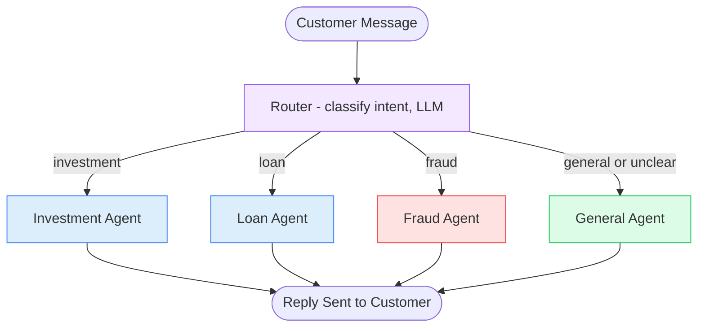

# 5. Routing

## 5.1 What is it?

**Routing** uses one lightweight decision step to pick **which specialized
handler** should process a request, out of a set of handlers that all do the
*same kind* of job (e.g., "answer the customer") but are each **tuned for a
different domain** — different system prompt, different knowledge, sometimes
a different model or temperature.

This looks similar to Pattern 3 (Conditional Workflow) and Pattern 4
(Branching), but the intent is different:

- **Conditional Workflow** picked between different *actions* (approve /
  review / decline).
- **Branching** picked between different *actions*, nested in layers (tree).
- **Routing** picks between different **specialists**, all producing the same
  *kind* of output (a helpful reply) — the value is in matching the request
  to the specialist best equipped to handle it, not in choosing between
  different business operations.

Think of it like a call center's front desk: whoever answers the phone
doesn't try to solve every problem themselves — they listen for a moment and
transfer you to the *right department*, who then handles the whole
conversation.

## 5.2 What problem does it solve?

A single, generic system prompt trying to handle every possible customer
question ends up being *mediocre at everything*: too vague for a specialized
question, cluttered with irrelevant instructions for a simple question. But
building a completely separate app per domain is overkill and hard to
maintain.

The Routing pattern solves this by:

- Letting each specialist have a **tightly-scoped system prompt** (and
  optionally its own tools, knowledge base, or model) instead of one giant
  prompt trying to cover every domain at once.
- Keeping the **routing decision itself cheap and fast** — a short
  classification call, not a full response generation — before doing the
  more expensive specialized work.
- Making it easy to **add a new specialist** later without touching the
  others — a new domain is a new node plus one more entry in the router's
  option list.
- Providing a **safe fallback specialist** (general) for anything that
  doesn't clearly match a known domain, so the system never has "nowhere to
  send" a request.

## 5.3 Realistic production example: Bank Customer Query Router

A digital bank (`NovaBank`) handles customer chat messages that could be
about almost anything. Rather than one generic assistant, four specialized
agents exist, each with its own system prompt and tone:

1. **Investment Agent** — knowledgeable, careful tone; discusses portfolios,
   market questions, investment products. Always includes a brief
   "not financial advice" reminder.
2. **Loan Agent** — explains loan products, rates, and application steps in
   plain language.
3. **Fraud Agent** — calm, urgent, reassuring tone; walks the customer
   through immediate steps if they report a suspicious transaction or a lost
   card.
4. **General Agent** — friendly, broad fallback for anything that isn't
   clearly one of the above (hours, branch locations, general "how do I..."
   questions).

A **router** node reads the incoming message and picks exactly one of these
four to actually generate the reply.

## 5.4 Architecture / Flow Diagram



Unlike Branching's tree, Routing is typically **one flat dispatch** to a
wider set of options (here 4, but easily 8–10+ in a bigger system) — the
router doesn't ask any further follow-up questions itself; it hands the whole
job to the specialist it picked.

## 5.5 Request-to-response flow, step by step

1. A client sends the raw customer message to `run_query_router()`.
2. LangGraph builds the initial `QueryState` and enters at `route_query`.
3. **`route_query`** makes a short, cheap LLM call whose *only* job is
   classification — asking "which of these four categories does this message
   belong to?" — parsed defensively into exactly one of
   `"investment"`, `"loan"`, `"fraud"`, `"general"` (anything unclear falls
   back to `"general"`, the safe catch-all).
4. A **conditional edge** on `route_query` sends execution to exactly one of
   the four specialist nodes based on that category.
5. The chosen specialist (say, `fraud_agent`) makes its **own** LLM call —
   using a completely different, domain-specific system prompt from the
   other three specialists — and produces the actual customer-facing reply.
6. The reply is written into `state.final_reply`. All four specialists
   converge to `END`, so the caller always gets back the same result shape
   no matter which specialist handled it.

## 5.6 Why this pattern fits this problem

- Each domain genuinely needs **different tone, caution level, and content**
  — a fraud report needs urgency and clear immediate steps; an investment
  question needs measured language and a compliance reminder. One shared
  prompt would have to awkwardly compromise between these.
- The **router call is small and fast** (classify only, not answer), so the
  cost of "figuring out who should handle this" stays low even though the
  specialist that eventually responds might use a longer, more detailed
  prompt.
- It scales cleanly: NovaBank can add a **Credit Card Agent** later by adding
  one node and one more router category, without changing how Investment,
  Loan, Fraud, or General work.
- Having a **General Agent as the default fallback** means an unusual or
  ambiguous message still gets a reasonable reply instead of the system
  having no idea what to do with it.

## 5.7 Production-quality implementation

```python
"""
Routing — Bank Customer Query Router
Pattern: one classification step dispatches to one of several specialized agents

Run:
    pip install "langgraph==1.2.10" "langchain==1.3.14" "langchain-ollama==1.1.0" "pydantic==2.9.2"
    ollama pull llama3.1:8b     # make sure Ollama is running locally
    python query_router.py
"""

from __future__ import annotations

import logging
from typing import Literal, Optional

from langchain_ollama import ChatOllama
from langgraph.graph import StateGraph, START, END
from pydantic import BaseModel

# --------------------------------------------------------------------------
# 1. Logging
# --------------------------------------------------------------------------
logging.basicConfig(
    level=logging.INFO,
    format="%(asctime)s | %(levelname)s | %(name)s | %(message)s",
)
logger = logging.getLogger("query_router")


# --------------------------------------------------------------------------
# 2. Shared state
# --------------------------------------------------------------------------
class QueryState(BaseModel):
    customer_message: str = ""
    category: Optional[Literal["investment", "loan", "fraud", "general"]] = None
    final_reply: Optional[str] = None
    handled_by: Optional[str] = None


# --------------------------------------------------------------------------
# 3. Local model clients.
#    The router uses temperature=0 (we want a stable, repeatable category).
#    Specialists use a slightly higher temperature for more natural replies.
# --------------------------------------------------------------------------
_router_llm = ChatOllama(model="llama3.1:8b", temperature=0)
_agent_llm = ChatOllama(model="llama3.1:8b", temperature=0.4)


# --------------------------------------------------------------------------
# 4. Router node — cheap classification only, no reply generation here.
# --------------------------------------------------------------------------
_ROUTER_PROMPT = """Classify this customer message into exactly one category:
investment, loan, fraud, or general. Respond with ONLY that one word.

- investment: questions about portfolios, markets, investment products
- loan: questions about loans, rates, applications
- fraud: reports of suspicious transactions, lost/stolen cards, unauthorized activity
- general: anything else (hours, branches, general how-do-I questions)

Message: {message}
"""


def route_query(state: QueryState) -> dict:
    logger.info("ROUTER — classifying customer message")
    try:
        response = _router_llm.invoke(_ROUTER_PROMPT.format(message=state.customer_message))
        word = response.content.strip().lower()
        for option in ("investment", "loan", "fraud", "general"):
            if option in word:
                return {"category": option}
        return {"category": "general"}  # unclear response -> safe fallback
    except Exception as exc:  # noqa: BLE001
        logger.error("route_query failed, defaulting to general: %s", exc)
        return {"category": "general"}


def dispatch(state: QueryState) -> str:
    return {
        "investment": "investment_agent",
        "loan": "loan_agent",
        "fraud": "fraud_agent",
        "general": "general_agent",
    }[state.category]


# --------------------------------------------------------------------------
# 5. Small shared helper so each specialist node stays short.
# --------------------------------------------------------------------------
def _run_agent(system_prompt: str, message: str) -> str:
    messages = [("system", system_prompt), ("human", message)]
    response = _agent_llm.invoke(messages)
    return response.content.strip()


# --------------------------------------------------------------------------
# 6. Specialist — Investment Agent
# --------------------------------------------------------------------------
def investment_agent(state: QueryState) -> dict:
    logger.info("SPECIALIST — investment_agent")
    reply = _run_agent(
        system_prompt=(
            "You are NovaBank's investment specialist. Be measured and careful. "
            "Always include a brief reminder that this is not financial advice. "
            "Keep replies concise."
        ),
        message=state.customer_message,
    )
    return {"final_reply": reply, "handled_by": "Investment Agent"}


# --------------------------------------------------------------------------
# 7. Specialist — Loan Agent
# --------------------------------------------------------------------------
def loan_agent(state: QueryState) -> dict:
    logger.info("SPECIALIST — loan_agent")
    reply = _run_agent(
        system_prompt=(
            "You are NovaBank's loan specialist. Explain loan products, rates, "
            "and application steps in plain, friendly language. Keep replies concise."
        ),
        message=state.customer_message,
    )
    return {"final_reply": reply, "handled_by": "Loan Agent"}


# --------------------------------------------------------------------------
# 8. Specialist — Fraud Agent
# --------------------------------------------------------------------------
def fraud_agent(state: QueryState) -> dict:
    logger.info("SPECIALIST — fraud_agent")
    reply = _run_agent(
        system_prompt=(
            "You are NovaBank's fraud response specialist. Be calm and reassuring "
            "but clear about urgency. Give the customer immediate next steps "
            "(e.g., freeze the card in the app, we'll follow up within 24 hours). "
            "Keep replies concise."
        ),
        message=state.customer_message,
    )
    return {"final_reply": reply, "handled_by": "Fraud Agent"}


# --------------------------------------------------------------------------
# 9. Specialist — General Agent (fallback)
# --------------------------------------------------------------------------
def general_agent(state: QueryState) -> dict:
    logger.info("SPECIALIST — general_agent")
    reply = _run_agent(
        system_prompt=(
            "You are NovaBank's friendly general support assistant. Answer "
            "broad questions (hours, branches, how-do-I) helpfully and concisely."
        ),
        message=state.customer_message,
    )
    return {"final_reply": reply, "handled_by": "General Agent"}


# --------------------------------------------------------------------------
# 10. Build the graph — one router, flat dispatch to N specialists.
# --------------------------------------------------------------------------
def build_graph():
    graph = StateGraph(QueryState)

    graph.add_node("route_query", route_query)
    graph.add_node("investment_agent", investment_agent)
    graph.add_node("loan_agent", loan_agent)
    graph.add_node("fraud_agent", fraud_agent)
    graph.add_node("general_agent", general_agent)

    graph.add_edge(START, "route_query")

    graph.add_conditional_edges(
        "route_query",
        dispatch,
        {
            "investment_agent": "investment_agent",
            "loan_agent": "loan_agent",
            "fraud_agent": "fraud_agent",
            "general_agent": "general_agent",
        },
    )

    for agent in ("investment_agent", "loan_agent", "fraud_agent", "general_agent"):
        graph.add_edge(agent, END)

    return graph.compile()


# --------------------------------------------------------------------------
# 11. Public entry point
# --------------------------------------------------------------------------
def run_query_router(customer_message: str) -> dict:
    app = build_graph()
    initial_state = QueryState(customer_message=customer_message)
    final_state = app.invoke(initial_state)
    return final_state


# --------------------------------------------------------------------------
# 12. Demo
# --------------------------------------------------------------------------
if __name__ == "__main__":
    sample_messages = [
        "I just noticed a $400 charge I don't recognize on my card.",
        "What's the current rate on a 30-year mortgage?",
        "Should I move more of my portfolio into index funds?",
        "What time does the downtown branch close on Saturdays?",
    ]

    for message in sample_messages:
        result = run_query_router(message)
        print(f"[{result['handled_by']}] {result['final_reply']}\n")
```

**Notes on production-readiness choices made above:**

- **Two separate LLM clients** — the router uses `temperature=0` because we
  want a stable, repeatable category every time the same message comes in;
  specialists use a slightly higher temperature since natural-sounding
  customer replies benefit from a little variation. Routing and answering are
  different jobs, so it's fine (and often better) for them to use different
  settings — or even different models entirely.
- **The router never generates the reply itself** — keeping classification
  and response generation as separate steps means the expensive, detailed
  work (the actual reply) only happens once, in the specialist that's
  actually equipped to do it well.
- **`"general"` is both a real category and the fallback for unclear
  classification** — this guarantees every message reaches *some* specialist
  and gets a reasonable reply, even if the router's classification isn't
  confident.
- **Every specialist returns the same two fields**
  (`final_reply`, `handled_by`) — consistent output shape regardless of which
  specialist handled the request, which keeps the caller-facing contract
  simple even as more specialists get added later.

---

⬅ [4. Branching](04-branching.md) | [Back to index](README.md) | Next: [6. Map-Reduce](06-map-reduce.md) ➡
