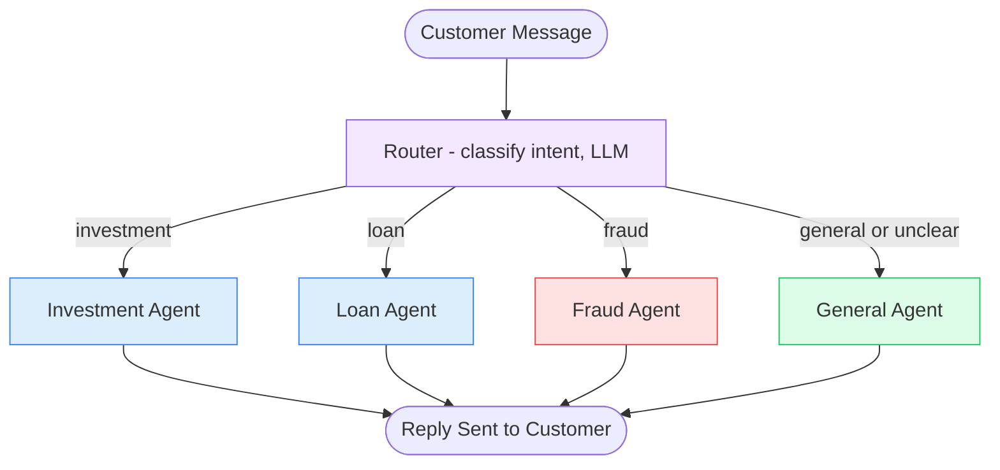

# 5. Routing

## 5.1 What is it?

**Routing** uses one lightweight decision step to pick **which specialized
handler** should process a request, out of a set of handlers that all do the
*same kind* of job (e.g., "answer the customer") but are each **tuned for a
different domain** — different system prompt, different knowledge, sometimes
a different model or temperature.

This looks similar to Pattern 3 (Conditional Workflow) and Pattern 4
(Branching), but the intent is different:

- **Conditional Workflow** picked between different *actions* (approve /
  review / decline).
- **Branching** picked between different *actions*, nested in layers (tree).
- **Routing** picks between different **specialists**, all producing the same
  *kind* of output (a helpful reply) — the value is in matching the request
  to the specialist best equipped to handle it, not in choosing between
  different business operations.

Think of it like a call center's front desk: whoever answers the phone
doesn't try to solve every problem themselves — they listen for a moment and
transfer you to the *right department*, who then handles the whole
conversation.

## 5.2 What problem does it solve?

A single, generic system prompt trying to handle every possible customer
question ends up being *mediocre at everything*: too vague for a specialized
question, cluttered with irrelevant instructions for a simple question. But
building a completely separate app per domain is overkill and hard to
maintain.

The Routing pattern solves this by:

- Letting each specialist have a **tightly-scoped system prompt** (and
  optionally its own tools, knowledge base, or model) instead of one giant
  prompt trying to cover every domain at once.
- Keeping the **routing decision itself cheap and fast** — a short
  classification call, not a full response generation — before doing the
  more expensive specialized work.
- Making it easy to **add a new specialist** later without touching the
  others — a new domain is a new node plus one more entry in the router's
  option list.
- Providing a **safe fallback specialist** (general) for anything that
  doesn't clearly match a known domain, so the system never has "nowhere to
  send" a request.

## 5.3 Realistic production example: Bank Customer Query Router

A digital bank (`NovaBank`) handles customer chat messages that could be
about almost anything. Rather than one generic assistant, four specialized
agents exist, each with its own system prompt and tone:

1. **Investment Agent** — knowledgeable, careful tone; discusses portfolios,
   market questions, investment products. Always includes a brief
   "not financial advice" reminder.
2. **Loan Agent** — explains loan products, rates, and application steps in
   plain language.
3. **Fraud Agent** — calm, urgent, reassuring tone; walks the customer
   through immediate steps if they report a suspicious transaction or a lost
   card.
4. **General Agent** — friendly, broad fallback for anything that isn't
   clearly one of the above (hours, branch locations, general "how do I..."
   questions).

A **router** node reads the incoming message and picks exactly one of these
four to actually generate the reply.

## 5.4 Architecture / Flow Diagram


```mermaid
flowchart TD
    Start([Customer Message]) --> Router[Router - classify intent, LLM]

    Router -->|investment| A[Investment Agent]
    Router -->|loan| B[Loan Agent]
    Router -->|fraud| C[Fraud Agent]
    Router -->|general or unclear| D[General Agent]

    A --> End([Reply Sent to Customer])
    B --> End
    C --> End
    D --> End

    style Router fill:#F3E8FF,stroke:#8B5CF6
    style A fill:#DCEEFB,stroke:#3B82F6
    style B fill:#DCEEFB,stroke:#3B82F6
    style C fill:#FEE2E2,stroke:#EF4444
    style D fill:#DCFCE7,stroke:#22C55E
```

Unlike Branching's tree, Routing is typically **one flat dispatch** to a
wider set of options (here 4, but easily 8–10+ in a bigger system) — the
router doesn't ask any further follow-up questions itself; it hands the whole
job to the specialist it picked.

## 5.5 Request-to-response flow, step by step

1. A client sends the raw customer message to `run_query_router()`.
2. LangGraph builds the initial `QueryState` and enters at `route_query`.
3. **`route_query`** makes a short, cheap LLM call whose *only* job is
   classification — asking "which of these four categories does this message
   belong to?" — parsed defensively into exactly one of
   `"investment"`, `"loan"`, `"fraud"`, `"general"` (anything unclear falls
   back to `"general"`, the safe catch-all).
4. A **conditional edge** on `route_query` sends execution to exactly one of
   the four specialist nodes based on that category.
5. The chosen specialist (say, `fraud_agent`) makes its **own** LLM call —
   using a completely different, domain-specific system prompt from the
   other three specialists — and produces the actual customer-facing reply.
6. The reply is written into `state.final_reply`. All four specialists
   converge to `END`, so the caller always gets back the same result shape
   no matter which specialist handled it.

## 5.6 Why this pattern fits this problem

- Each domain genuinely needs **different tone, caution level, and content**
  — a fraud report needs urgency and clear immediate steps; an investment
  question needs measured language and a compliance reminder. One shared
  prompt would have to awkwardly compromise between these.
- The **router call is small and fast** (classify only, not answer), so the
  cost of "figuring out who should handle this" stays low even though the
  specialist that eventually responds might use a longer, more detailed
  prompt.
- It scales cleanly: NovaBank can add a **Credit Card Agent** later by adding
  one node and one more router category, without changing how Investment,
  Loan, Fraud, or General work.
- Having a **General Agent as the default fallback** means an unusual or
  ambiguous message still gets a reasonable reply instead of the system
  having no idea what to do with it.

## 5.7 Production-quality implementation

```python
"""
Routing — Bank Customer Query Router
Pattern: one classification step dispatches to one of several specialized agents

Run:
    pip install "langgraph==1.2.10" "langchain==1.3.14" "langchain-ollama==1.1.0" "pydantic==2.9.2"
    ollama pull llama3.1:8b     # make sure Ollama is running locally
    python query_router.py
"""

from __future__ import annotations

import logging
from typing import Literal, Optional

from langchain_ollama import ChatOllama
from langgraph.graph import StateGraph, START, END
from pydantic import BaseModel

# --------------------------------------------------------------------------
# 1. Logging
# --------------------------------------------------------------------------
logging.basicConfig(
    level=logging.INFO,
    format="%(asctime)s | %(levelname)s | %(name)s | %(message)s",
)
logger = logging.getLogger("query_router")


# --------------------------------------------------------------------------
# 2. Shared state
# --------------------------------------------------------------------------
class QueryState(BaseModel):
    customer_message: str = ""
    category: Optional[Literal["investment", "loan", "fraud", "general"]] = None
    final_reply: Optional[str] = None
    handled_by: Optional[str] = None


# --------------------------------------------------------------------------
# 3. Local model clients.
#    The router uses temperature=0 (we want a stable, repeatable category).
#    Specialists use a slightly higher temperature for more natural replies.
# --------------------------------------------------------------------------
_router_llm = ChatOllama(model="llama3.1:8b", temperature=0)
_agent_llm = ChatOllama(model="llama3.1:8b", temperature=0.4)


# --------------------------------------------------------------------------
# 4. Router node — cheap classification only, no reply generation here.
# --------------------------------------------------------------------------
_ROUTER_PROMPT = """Classify this customer message into exactly one category:
investment, loan, fraud, or general. Respond with ONLY that one word.

- investment: questions about portfolios, markets, investment products
- loan: questions about loans, rates, applications
- fraud: reports of suspicious transactions, lost/stolen cards, unauthorized activity
- general: anything else (hours, branches, general how-do-I questions)

Message: {message}
"""


def route_query(state: QueryState) -> dict:
    logger.info("ROUTER — classifying customer message")
    try:
        response = _router_llm.invoke(_ROUTER_PROMPT.format(message=state.customer_message))
        word = response.content.strip().lower()
        for option in ("investment", "loan", "fraud", "general"):
            if option in word:
                return {"category": option}
        return {"category": "general"}  # unclear response -> safe fallback
    except Exception as exc:  # noqa: BLE001
        logger.error("route_query failed, defaulting to general: %s", exc)
        return {"category": "general"}


def dispatch(state: QueryState) -> str:
    return {
        "investment": "investment_agent",
        "loan": "loan_agent",
        "fraud": "fraud_agent",
        "general": "general_agent",
    }[state.category]


# --------------------------------------------------------------------------
# 5. Small shared helper so each specialist node stays short.
# --------------------------------------------------------------------------
def _run_agent(system_prompt: str, message: str) -> str:
    messages = [("system", system_prompt), ("human", message)]
    response = _agent_llm.invoke(messages)
    return response.content.strip()


# --------------------------------------------------------------------------
# 6. Specialist — Investment Agent
# --------------------------------------------------------------------------
def investment_agent(state: QueryState) -> dict:
    logger.info("SPECIALIST — investment_agent")
    reply = _run_agent(
        system_prompt=(
            "You are NovaBank's investment specialist. Be measured and careful. "
            "Always include a brief reminder that this is not financial advice. "
            "Keep replies concise."
        ),
        message=state.customer_message,
    )
    return {"final_reply": reply, "handled_by": "Investment Agent"}


# --------------------------------------------------------------------------
# 7. Specialist — Loan Agent
# --------------------------------------------------------------------------
def loan_agent(state: QueryState) -> dict:
    logger.info("SPECIALIST — loan_agent")
    reply = _run_agent(
        system_prompt=(
            "You are NovaBank's loan specialist. Explain loan products, rates, "
            "and application steps in plain, friendly language. Keep replies concise."
        ),
        message=state.customer_message,
    )
    return {"final_reply": reply, "handled_by": "Loan Agent"}


# --------------------------------------------------------------------------
# 8. Specialist — Fraud Agent
# --------------------------------------------------------------------------
def fraud_agent(state: QueryState) -> dict:
    logger.info("SPECIALIST — fraud_agent")
    reply = _run_agent(
        system_prompt=(
            "You are NovaBank's fraud response specialist. Be calm and reassuring "
            "but clear about urgency. Give the customer immediate next steps "
            "(e.g., freeze the card in the app, we'll follow up within 24 hours). "
            "Keep replies concise."
        ),
        message=state.customer_message,
    )
    return {"final_reply": reply, "handled_by": "Fraud Agent"}


# --------------------------------------------------------------------------
# 9. Specialist — General Agent (fallback)
# --------------------------------------------------------------------------
def general_agent(state: QueryState) -> dict:
    logger.info("SPECIALIST — general_agent")
    reply = _run_agent(
        system_prompt=(
            "You are NovaBank's friendly general support assistant. Answer "
            "broad questions (hours, branches, how-do-I) helpfully and concisely."
        ),
        message=state.customer_message,
    )
    return {"final_reply": reply, "handled_by": "General Agent"}


# --------------------------------------------------------------------------
# 10. Build the graph — one router, flat dispatch to N specialists.
# --------------------------------------------------------------------------
def build_graph():
    graph = StateGraph(QueryState)

    graph.add_node("route_query", route_query)
    graph.add_node("investment_agent", investment_agent)
    graph.add_node("loan_agent", loan_agent)
    graph.add_node("fraud_agent", fraud_agent)
    graph.add_node("general_agent", general_agent)

    graph.add_edge(START, "route_query")

    graph.add_conditional_edges(
        "route_query",
        dispatch,
        {
            "investment_agent": "investment_agent",
            "loan_agent": "loan_agent",
            "fraud_agent": "fraud_agent",
            "general_agent": "general_agent",
        },
    )

    for agent in ("investment_agent", "loan_agent", "fraud_agent", "general_agent"):
        graph.add_edge(agent, END)

    return graph.compile()


# --------------------------------------------------------------------------
# 11. Public entry point
# --------------------------------------------------------------------------
def run_query_router(customer_message: str) -> dict:
    app = build_graph()
    initial_state = QueryState(customer_message=customer_message)
    final_state = app.invoke(initial_state)
    return final_state


# --------------------------------------------------------------------------
# 12. Demo
# --------------------------------------------------------------------------
if __name__ == "__main__":
    sample_messages = [
        "I just noticed a $400 charge I don't recognize on my card.",
        "What's the current rate on a 30-year mortgage?",
        "Should I move more of my portfolio into index funds?",
        "What time does the downtown branch close on Saturdays?",
    ]

    for message in sample_messages:
        result = run_query_router(message)
        print(f"[{result['handled_by']}] {result['final_reply']}\n")
```

**Notes on production-readiness choices made above:**

- **Two separate LLM clients** — the router uses `temperature=0` because we
  want a stable, repeatable category every time the same message comes in;
  specialists use a slightly higher temperature since natural-sounding
  customer replies benefit from a little variation. Routing and answering are
  different jobs, so it's fine (and often better) for them to use different
  settings — or even different models entirely.
- **The router never generates the reply itself** — keeping classification
  and response generation as separate steps means the expensive, detailed
  work (the actual reply) only happens once, in the specialist that's
  actually equipped to do it well.
- **`"general"` is both a real category and the fallback for unclear
  classification** — this guarantees every message reaches *some* specialist
  and gets a reasonable reply, even if the router's classification isn't
  confident.
- **Every specialist returns the same two fields**
  (`final_reply`, `handled_by`) — consistent output shape regardless of which
  specialist handled the request, which keeps the caller-facing contract
  simple even as more specialists get added later.

---

⬅ [4. Branching](04-branching.md) | [Back to index](README.md) | Next: [6. Map-Reduce](06-map-reduce.md) ➡

# Bank Customer Query Router — Routing Pattern (Java + Spring AI)

A Java port of the LangGraph routing workflow — one cheap classification step dispatches to
exactly one of several specialist agents, each with its own system prompt and reply style. Built
on:

- **Java 25** (current LTS)
- **Spring Boot 4.1.0**
- **Spring AI 2.0.0** (GA) with the **Ollama** starter, mirroring `llama3.1:8b`

## Mapping the shape

This is structurally close to the earlier Conditional Workflow port (one decision, N branches),
but with two differences worth calling out: the router and the specialists intentionally use
**different model temperatures** (0 for stable classification, 0.4 for more natural specialist
replies), and every branch here calls the LLM again rather than applying a plain rule — dispatch
exists purely to pick *which system prompt* answers the customer.

| LangGraph concept | Spring / Java equivalent |
|---|---|
| `_router_llm = ChatOllama(temperature=0)` | `ChatClient` bean qualified `@Qualifier("routerChatClient")` |
| `_agent_llm = ChatOllama(temperature=0.4)` | `ChatClient` bean qualified `@Qualifier("agentChatClient")` |
| `route_query` node | `QueryClassificationStep` |
| `dispatch(state) -> str` + conditional-edges dict | `sealed QueryAgent` + exhaustive `switch (category)` |
| `_run_agent(system_prompt, message)` shared helper | Each `QueryAgent` implementation calls the shared `agentChatClient` with its own system prompt |
| 4 specialist nodes → `END` | All 4 `QueryAgent` implementations return the same `QueryState` shape |

Two named `ChatClient` beans — rather than one — is the direct equivalent of the Python module
keeping two separate `ChatOllama` instances at different temperatures; Spring AI doesn't have a
single client that's called with a temperature override per-invocation the way LangChain's
`.invoke()` implicitly reuses whatever the constructed client was configured with, so both
personalities get their own bean.

---

## Project structure

```
query-router/
├── pom.xml
└── src/main/java/com/example/queryrouter/
    ├── QueryRouterApplication.java
    ├── config/
    │   └── ChatClientConfig.java
    ├── model/
    │   ├── Category.java
    │   ├── QueryState.java
    │   └── QueryReply.java
    ├── pipeline/
    │   ├── QueryClassificationStep.java
    │   ├── QueryAgent.java
    │   ├── InvestmentAgent.java
    │   ├── LoanAgent.java
    │   ├── FraudAgent.java
    │   ├── GeneralAgent.java
    │   └── QueryRouterService.java
    ├── web/
    │   └── QueryRouterController.java
    └── QueryRouterRunner.java   (CLI demo, mirrors the Python __main__ block)
└── src/main/resources/
    └── application.yml
```

---

## `pom.xml`

```xml
<?xml version="1.0" encoding="UTF-8"?>
<project xmlns="http://maven.apache.org/POM/4.0.0"
         xmlns:xsi="http://www.w3.org/2001/XMLSchema-instance"
         xsi:schemaLocation="http://maven.apache.org/POM/4.0.0 https://maven.apache.org/xsd/maven-4.0.0.xsd">
    <modelVersion>4.0.0</modelVersion>

    <groupId>com.example</groupId>
    <artifactId>query-router</artifactId>
    <version>1.0.0</version>
    <packaging>jar</packaging>

    <properties>
        <java.version>25</java.version>
        <spring-ai.version>2.0.0</spring-ai.version>
    </properties>

    <parent>
        <groupId>org.springframework.boot</groupId>
        <artifactId>spring-boot-starter-parent</artifactId>
        <version>4.1.0</version>
        <relativePath/>
    </parent>

    <dependencyManagement>
        <dependencies>
            <dependency>
                <groupId>org.springframework.ai</groupId>
                <artifactId>spring-ai-bom</artifactId>
                <version>${spring-ai.version}</version>
                <type>pom</type>
                <scope>import</scope>
            </dependency>
        </dependencies>
    </dependencyManagement>

    <dependencies>
        <dependency>
            <groupId>org.springframework.boot</groupId>
            <artifactId>spring-boot-starter-web</artifactId>
        </dependency>
        <!-- Ollama model starter — local llama3.1:8b, same as langchain-ollama -->
        <dependency>
            <groupId>org.springframework.ai</groupId>
            <artifactId>spring-ai-starter-model-ollama</artifactId>
        </dependency>
        <dependency>
            <groupId>org.springframework.boot</groupId>
            <artifactId>spring-boot-starter-test</artifactId>
            <scope>test</scope>
        </dependency>
    </dependencies>

    <build>
        <plugins>
            <plugin>
                <groupId>org.springframework.boot</groupId>
                <artifactId>spring-boot-maven-plugin</artifactId>
            </plugin>
        </plugins>
    </build>
</project>
```

## `src/main/resources/application.yml`

Only the model name and base URL are set globally — temperature is set per-`ChatClient` bean in
`ChatClientConfig`, since the router and the specialists need different values.

```yaml
spring:
  application:
    name: query-router
  ai:
    ollama:
      base-url: http://localhost:11434
      chat:
        options:
          model: llama3.1:8b

logging:
  level:
    com.example.queryrouter: INFO
```

---

## Two `ChatClient` beans, two temperatures

### `config/ChatClientConfig.java`

```java
package com.example.queryrouter.config;

import org.springframework.ai.chat.client.ChatClient;
import org.springframework.ai.chat.model.ChatModel;
import org.springframework.ai.ollama.api.OllamaOptions;
import org.springframework.context.annotation.Bean;
import org.springframework.context.annotation.Configuration;

@Configuration
public class ChatClientConfig {

    /**
     * Stable, repeatable classification — mirrors {@code _router_llm = ChatOllama(temperature=0)}.
     */
    @Bean
    public ChatClient routerChatClient(ChatModel chatModel) {
        return ChatClient.builder(chatModel)
                .defaultOptions(OllamaOptions.builder().temperature(0.0).build())
                .build();
    }

    /**
     * More natural specialist replies — mirrors {@code _agent_llm = ChatOllama(temperature=0.4)}.
     */
    @Bean
    public ChatClient agentChatClient(ChatModel chatModel) {
        return ChatClient.builder(chatModel)
                .defaultOptions(OllamaOptions.builder().temperature(0.4).build())
                .build();
    }
}
```

---

## Domain model

### `model/Category.java`

```java
package com.example.queryrouter.model;

public enum Category {
    INVESTMENT,
    LOAN,
    FRAUD,
    GENERAL
}
```

### `model/QueryReply.java`

```java
package com.example.queryrouter.model;

public record QueryReply(String finalReply, String handledBy) {}
```

### `model/QueryState.java`

```java
package com.example.queryrouter.model;

public record QueryState(String customerMessage, Category category, QueryReply reply) {

    public static QueryState initial(String customerMessage) {
        return new QueryState(customerMessage, null, null);
    }

    public QueryState withCategory(Category category) {
        return new QueryState(customerMessage, category, reply);
    }

    public QueryState withReply(String finalReply, String handledBy) {
        return new QueryState(customerMessage, category, new QueryReply(finalReply, handledBy));
    }
}
```

---

## Router

### `pipeline/QueryClassificationStep.java`

Cheap classification only — no reply generation here, same division of labor as the Python
`route_query` node.

```java
package com.example.queryrouter.pipeline;

import com.example.queryrouter.model.Category;
import com.example.queryrouter.model.QueryState;
import org.slf4j.Logger;
import org.slf4j.LoggerFactory;
import org.springframework.ai.chat.client.ChatClient;
import org.springframework.beans.factory.annotation.Qualifier;
import org.springframework.stereotype.Component;

import java.util.Locale;

@Component
public class QueryClassificationStep {

    private static final Logger log = LoggerFactory.getLogger(QueryClassificationStep.class);

    private static final String ROUTER_PROMPT = """
            Classify this customer message into exactly one category:
            investment, loan, fraud, or general. Respond with ONLY that one word.

            - investment: questions about portfolios, markets, investment products
            - loan: questions about loans, rates, applications
            - fraud: reports of suspicious transactions, lost/stolen cards, unauthorized activity
            - general: anything else (hours, branches, general how-do-I questions)

            Message: {message}
            """;

    private final ChatClient routerChatClient;

    public QueryClassificationStep(@Qualifier("routerChatClient") ChatClient routerChatClient) {
        this.routerChatClient = routerChatClient;
    }

    public QueryState apply(QueryState state) {
        log.info("ROUTER - classifying customer message");
        try {
            String word = routerChatClient.prompt()
                    .user(u -> u.text(ROUTER_PROMPT).param("message", state.customerMessage()))
                    .call()
                    .content()
                    .strip()
                    .toLowerCase(Locale.ROOT);

            for (Category option : Category.values()) {
                if (word.contains(option.name().toLowerCase(Locale.ROOT))) {
                    return state.withCategory(option);
                }
            }
            return state.withCategory(Category.GENERAL); // unclear response -> safe fallback
        } catch (Exception e) {
            log.error("route_query failed, defaulting to general: {}", e.getMessage());
            return state.withCategory(Category.GENERAL);
        }
    }
}
```

---

## Specialists

### `pipeline/QueryAgent.java`

```java
package com.example.queryrouter.pipeline;

import com.example.queryrouter.model.QueryState;

public sealed interface QueryAgent
        permits InvestmentAgent, LoanAgent, FraudAgent, GeneralAgent {
    QueryState apply(QueryState state);
}
```

Each specialist below follows the same shape as the Python `_run_agent(system_prompt, message)`
helper — a `@Component` holding just its own system prompt, calling the shared `agentChatClient`.

### `pipeline/InvestmentAgent.java`

```java
package com.example.queryrouter.pipeline;

import com.example.queryrouter.model.QueryState;
import org.slf4j.Logger;
import org.slf4j.LoggerFactory;
import org.springframework.ai.chat.client.ChatClient;
import org.springframework.beans.factory.annotation.Qualifier;
import org.springframework.stereotype.Component;

@Component
public final class InvestmentAgent implements QueryAgent {

    private static final Logger log = LoggerFactory.getLogger(InvestmentAgent.class);

    private static final String SYSTEM_PROMPT = """
            You are NovaBank's investment specialist. Be measured and careful. \
            Always include a brief reminder that this is not financial advice. \
            Keep replies concise.
            """;

    private final ChatClient agentChatClient;

    public InvestmentAgent(@Qualifier("agentChatClient") ChatClient agentChatClient) {
        this.agentChatClient = agentChatClient;
    }

    @Override
    public QueryState apply(QueryState state) {
        log.info("SPECIALIST - investment_agent");
        String reply = agentChatClient.prompt()
                .system(SYSTEM_PROMPT)
                .user(state.customerMessage())
                .call()
                .content()
                .strip();
        return state.withReply(reply, "Investment Agent");
    }
}
```

### `pipeline/LoanAgent.java`

```java
package com.example.queryrouter.pipeline;

import com.example.queryrouter.model.QueryState;
import org.slf4j.Logger;
import org.slf4j.LoggerFactory;
import org.springframework.ai.chat.client.ChatClient;
import org.springframework.beans.factory.annotation.Qualifier;
import org.springframework.stereotype.Component;

@Component
public final class LoanAgent implements QueryAgent {

    private static final Logger log = LoggerFactory.getLogger(LoanAgent.class);

    private static final String SYSTEM_PROMPT = """
            You are NovaBank's loan specialist. Explain loan products, rates, \
            and application steps in plain, friendly language. Keep replies concise.
            """;

    private final ChatClient agentChatClient;

    public LoanAgent(@Qualifier("agentChatClient") ChatClient agentChatClient) {
        this.agentChatClient = agentChatClient;
    }

    @Override
    public QueryState apply(QueryState state) {
        log.info("SPECIALIST - loan_agent");
        String reply = agentChatClient.prompt()
                .system(SYSTEM_PROMPT)
                .user(state.customerMessage())
                .call()
                .content()
                .strip();
        return state.withReply(reply, "Loan Agent");
    }
}
```

### `pipeline/FraudAgent.java`

```java
package com.example.queryrouter.pipeline;

import com.example.queryrouter.model.QueryState;
import org.slf4j.Logger;
import org.slf4j.LoggerFactory;
import org.springframework.ai.chat.client.ChatClient;
import org.springframework.beans.factory.annotation.Qualifier;
import org.springframework.stereotype.Component;

@Component
public final class FraudAgent implements QueryAgent {

    private static final Logger log = LoggerFactory.getLogger(FraudAgent.class);

    private static final String SYSTEM_PROMPT = """
            You are NovaBank's fraud response specialist. Be calm and reassuring \
            but clear about urgency. Give the customer immediate next steps \
            (e.g., freeze the card in the app, we'll follow up within 24 hours). \
            Keep replies concise.
            """;

    private final ChatClient agentChatClient;

    public FraudAgent(@Qualifier("agentChatClient") ChatClient agentChatClient) {
        this.agentChatClient = agentChatClient;
    }

    @Override
    public QueryState apply(QueryState state) {
        log.info("SPECIALIST - fraud_agent");
        String reply = agentChatClient.prompt()
                .system(SYSTEM_PROMPT)
                .user(state.customerMessage())
                .call()
                .content()
                .strip();
        return state.withReply(reply, "Fraud Agent");
    }
}
```

### `pipeline/GeneralAgent.java`

```java
package com.example.queryrouter.pipeline;

import com.example.queryrouter.model.QueryState;
import org.slf4j.Logger;
import org.slf4j.LoggerFactory;
import org.springframework.ai.chat.client.ChatClient;
import org.springframework.beans.factory.annotation.Qualifier;
import org.springframework.stereotype.Component;

@Component
public final class GeneralAgent implements QueryAgent {

    private static final Logger log = LoggerFactory.getLogger(GeneralAgent.class);

    private static final String SYSTEM_PROMPT = """
            You are NovaBank's friendly general support assistant. Answer \
            broad questions (hours, branches, how-do-I) helpfully and concisely.
            """;

    private final ChatClient agentChatClient;

    public GeneralAgent(@Qualifier("agentChatClient") ChatClient agentChatClient) {
        this.agentChatClient = agentChatClient;
    }

    @Override
    public QueryState apply(QueryState state) {
        log.info("SPECIALIST - general_agent");
        String reply = agentChatClient.prompt()
                .system(SYSTEM_PROMPT)
                .user(state.customerMessage())
                .call()
                .content()
                .strip();
        return state.withReply(reply, "General Agent");
    }
}
```

---

## Dispatch

### `pipeline/QueryRouterService.java`

The direct analogue of `dispatch(state) -> str` plus `add_conditional_edges`.

```java
package com.example.queryrouter.pipeline;

import com.example.queryrouter.model.QueryState;
import org.springframework.stereotype.Service;

@Service
public class QueryRouterService {

    private final QueryClassificationStep queryClassificationStep;
    private final InvestmentAgent investmentAgent;
    private final LoanAgent loanAgent;
    private final FraudAgent fraudAgent;
    private final GeneralAgent generalAgent;

    public QueryRouterService(QueryClassificationStep queryClassificationStep,
                               InvestmentAgent investmentAgent,
                               LoanAgent loanAgent,
                               FraudAgent fraudAgent,
                               GeneralAgent generalAgent) {
        this.queryClassificationStep = queryClassificationStep;
        this.investmentAgent = investmentAgent;
        this.loanAgent = loanAgent;
        this.fraudAgent = fraudAgent;
        this.generalAgent = generalAgent;
    }

    public QueryState route(String customerMessage) {
        QueryState classified = queryClassificationStep.apply(QueryState.initial(customerMessage));

        QueryAgent agent = switch (classified.category()) {
            case INVESTMENT -> investmentAgent;
            case LOAN -> loanAgent;
            case FRAUD -> fraudAgent;
            case GENERAL -> generalAgent;
        };

        return agent.apply(classified);
    }
}
```

---

## Entry points

### `web/QueryRouterController.java`

```java
package com.example.queryrouter.web;

import com.example.queryrouter.model.QueryState;
import com.example.queryrouter.pipeline.QueryRouterService;
import org.springframework.web.bind.annotation.PostMapping;
import org.springframework.web.bind.annotation.RequestBody;
import org.springframework.web.bind.annotation.RestController;

@RestController
public class QueryRouterController {

    private final QueryRouterService queryRouterService;

    public QueryRouterController(QueryRouterService queryRouterService) {
        this.queryRouterService = queryRouterService;
    }

    @PostMapping("/api/queries/route")
    public QueryState route(@RequestBody String customerMessage) {
        return queryRouterService.route(customerMessage);
    }
}
```

### `QueryRouterRunner.java` (CLI demo, mirrors the Python `if __name__ == "__main__"` block)

```java
package com.example.queryrouter;

import com.example.queryrouter.pipeline.QueryRouterService;
import org.springframework.boot.CommandLineRunner;
import org.springframework.context.annotation.Profile;
import org.springframework.stereotype.Component;

import java.util.List;

@Component
@Profile("demo")
public class QueryRouterRunner implements CommandLineRunner {

    private final QueryRouterService queryRouterService;

    public QueryRouterRunner(QueryRouterService queryRouterService) {
        this.queryRouterService = queryRouterService;
    }

    @Override
    public void run(String... args) {
        List<String> sampleMessages = List.of(
                "I just noticed a $400 charge I don't recognize on my card.",
                "What's the current rate on a 30-year mortgage?",
                "Should I move more of my portfolio into index funds?",
                "What time does the downtown branch close on Saturdays?"
        );

        for (String message : sampleMessages) {
            var result = queryRouterService.route(message);
            System.out.printf("[%s] %s%n%n", result.reply().handledBy(), result.reply().finalReply());
        }
    }
}
```

### `QueryRouterApplication.java`

```java
package com.example.queryrouter;

import org.springframework.boot.SpringApplication;
import org.springframework.boot.autoconfigure.SpringBootApplication;

@SpringBootApplication
public class QueryRouterApplication {
    public static void main(String[] args) {
        SpringApplication.run(QueryRouterApplication.class, args);
    }
}
```

---

## Running it

```bash
ollama pull llama3.1:8b
ollama serve   # if not already running

# CLI demo (prints all 4 example replies, like the Python script)
mvn spring-boot:run -Dspring-boot.run.profiles=demo

# Or as a service
mvn spring-boot:run
curl -X POST localhost:8080/api/queries/route \
  -H "Content-Type: text/plain" \
  -d "I just noticed a \$400 charge I don't recognize on my card."
```

## Notes on the port

- **Two `ChatClient` personalities, not one**: this is the one thing this workflow needs that the
  earlier conditional/branching ports didn't — a stable, deterministic classifier and warmer,
  more natural specialist replies genuinely need different sampling temperatures. Rather than
  passing a temperature per-call, each gets its own named `ChatClient` bean
  (`routerChatClient` / `agentChatClient`) configured once in `ChatClientConfig`, injected by
  `@Qualifier` wherever it's needed — the Spring-idiomatic equivalent of instantiating two
  separate `ChatOllama` clients at module scope.
- **Router does classification only**: `QueryClassificationStep` never generates a customer-facing
  reply, matching the Python `route_query` node's narrow responsibility — cheap, fast, and easy to
  swap for a smaller/cheaper model later without touching any specialist.
- **Unclear classification → `GENERAL`**: kept as the safe fallback exactly as in the Python
  version, both on an ambiguous model reply and on an outright exception.
- **Versions**: same Ollama-backed setup (`spring-ai-starter-model-ollama`, `llama3.1:8b`) as the
  other ports in this series; only the per-bean `temperature` differs from the shared
  `application.yml` default.
