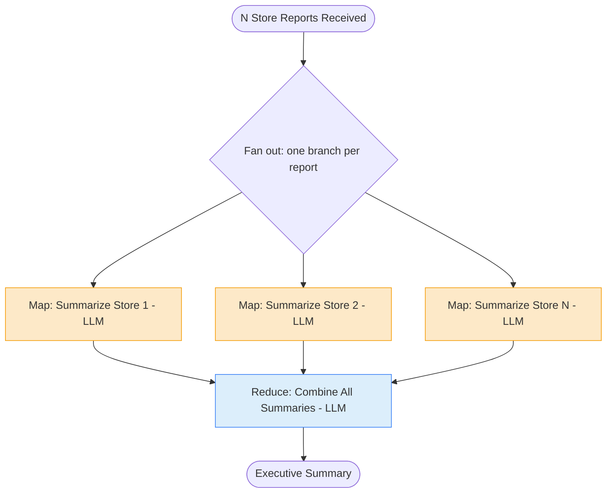

# 6. Map-Reduce

## 6.1 What is it?

**Map-Reduce** applies the **same operation** to every item in a list — the
**"map"** step — and then combines all of those individual results into one
final output — the **"reduce"** step. The key difference from every pattern
so far: the **number of parallel branches isn't fixed in the graph's design**
— it depends on how many items are in the list *at run time*. Ten stores
means ten parallel map calls; two hundred stores means two hundred.

This is different from Pattern 2 (Parallel Workflow), where we had a fixed,
small number of *different* analyses running side by side on *one* input.
Map-Reduce runs the *same* analysis, side by side, across a *variable-length
list* of inputs, and then folds the results down into one.

## 6.2 What problem does it solve?

A lot of real work comes in batches: a folder of documents, a list of
customer reviews, a set of daily reports from many locations. Processing
them one at a time in a loop works, but it's slow, and it doesn't scale — a
company with 5 stores and a company with 500 stores would need the *same
code*, just running for very different amounts of time.

The Map-Reduce pattern solves this by:

- Letting every item be processed **independently and concurrently**,
  cutting total time from "sum of every item" down to roughly "time for the
  slowest single item."
- Keeping the **per-item logic dead simple** — one function that only ever
  has to think about *one* report at a time.
- Providing one clear place — the **reduce step** — to think about how
  individual results should be combined, ranked, or summarized together.
- **Scaling naturally** with input size, since the graph doesn't need to know
  in advance how many items there will be.

## 6.3 Realistic production example: Multi-Store Sales Report Aggregation

A retail chain (`UrbanMart`) collects a daily sales report text from every
store — anywhere from a handful of stores to several hundred, and the exact
number changes as stores open and close. Every morning, leadership wants one
short executive summary of what happened across the whole chain.

1. **Map step** — for **each** store's report (independently, in parallel):
   an LLM call extracts a short summary noting sales performance and any
   notable anomalies (stockouts, unusual returns, staffing issues).
2. **Reduce step** — once **every** store's summary is ready, a second LLM
   call combines all of them into **one** executive summary: overall trend,
   and a short list of stores that need attention.

This is exactly Map-Reduce: the map step doesn't care how many stores there
are, and the reduce step only runs once everything from the map step has
finished.

## 6.4 Architecture / Flow Diagram



The number of `M` boxes here isn't fixed by the graph — it's determined at
run time by how many reports come in. That dynamic fan-out is the defining
feature of Map-Reduce.

## 6.5 Request-to-response flow, step by step

1. A client sends a list of `{store_id, report_text}` dicts to
   `run_sales_aggregation()`.
2. LangGraph builds the initial `OverallState`, holding that full list in
   `store_reports`.
3. From `START`, instead of a normal conditional edge returning one node
   name, we use LangGraph's **`Send`** API in `map_reports()`: it returns a
   **list of `Send` objects**, one per report — each one says "run the
   `summarize_store` node with *this one report* as its input." This is what
   creates a dynamic number of parallel branches.
4. LangGraph runs `summarize_store` once **per report**, concurrently. Each
   call only ever sees its *own* single report — it has no idea how many
   other stores exist.
5. Each `summarize_store` call returns one summary string. Because
   `store_summaries` is declared with a **reducer**
   (`Annotated[list[str], operator.add]`), LangGraph safely **appends** each
   parallel result into the same shared list instead of one overwriting
   another — this is the piece that makes concurrent writes to one field safe
   without extra merge logic.
6. Once **every** `summarize_store` branch has finished, LangGraph proceeds
   to `aggregate_summaries` — the reduce step — since that's the only
   downstream node whose inputs are now all ready.
7. **`aggregate_summaries`** reads the full list of per-store summaries and
   makes one final LLM call to combine them into a single executive summary.
8. The graph reaches `END` and returns the final report to the caller.

## 6.6 Why this pattern fits this problem

- The **number of stores changes over time** — a graph with a fixed number of
  parallel branches (like Pattern 2) simply can't represent "however many
  reports came in today." Map-Reduce's dynamic fan-out is built for exactly
  this.
- Each store's summary is **completely independent** of every other store's
  — nothing about summarizing Store 12 depends on Store 47 — so there's no
  reason to process them one at a time.
- Keeping **map and reduce as separate concerns** means the per-store prompt
  can stay simple and focused ("summarize this one report"), while all the
  "how do these all relate to each other" thinking lives in one place, the
  reduce step.
- This shape **scales gracefully** — the same graph handles 5 stores or 500
  stores; only the run time changes, not the code.

## 6.7 Production-quality implementation

```python
"""
Map-Reduce — Multi-Store Sales Report Aggregation
Pattern: dynamic fan-out (one branch per list item) -> reduce into one result

Run:
    pip install "langgraph==1.2.10" "langchain==1.3.14" "langchain-ollama==1.1.0" "pydantic==2.9.2"
    ollama pull llama3.1:8b     # make sure Ollama is running locally
    python sales_aggregation.py
"""

from __future__ import annotations

import logging
import operator
from typing import Annotated, TypedDict

from langchain_ollama import ChatOllama
from langgraph.graph import StateGraph, START, END
from langgraph.types import Send
from pydantic import BaseModel

# --------------------------------------------------------------------------
# 1. Logging
# --------------------------------------------------------------------------
logging.basicConfig(
    level=logging.INFO,
    format="%(asctime)s | %(levelname)s | %(name)s | %(message)s",
)
logger = logging.getLogger("sales_aggregation")


# --------------------------------------------------------------------------
# 2. Overall (graph-level) state.
#    `store_summaries` uses a REDUCER (operator.add) because many parallel
#    map branches write to it at once -- the reducer tells LangGraph to
#    concatenate/append results instead of one overwriting another.
# --------------------------------------------------------------------------
class OverallState(BaseModel):
    store_reports: list[dict] = []
    store_summaries: Annotated[list[str], operator.add] = []
    final_report: str | None = None


# --------------------------------------------------------------------------
# 3. Per-branch (map-step) state.
#    Each parallel `summarize_store` call only ever sees ONE report -- it
#    has no visibility into the full list or how many branches exist.
# --------------------------------------------------------------------------
class StoreReportState(TypedDict):
    report: dict


# --------------------------------------------------------------------------
# 4. Local model client
# --------------------------------------------------------------------------
_llm = ChatOllama(model="llama3.1:8b", temperature=0)

_MAP_PROMPT = """Summarize this single store's daily sales report in 1-2
sentences. Flag anything unusual (stockouts, unusual returns, staffing
issues) explicitly if present.

Store ID: {store_id}
Report: {report_text}
"""

_REDUCE_PROMPT = """You are preparing an executive summary for a retail
chain's leadership team. Below are short summaries from every store today.
Combine them into ONE executive summary: 
1) overall sales trend across the chain, 
2) a short bullet list of specific stores that need attention and why.

Per-store summaries:
{summaries}
"""


# --------------------------------------------------------------------------
# 5. Map step — runs once per report, fully independent of the others.
# --------------------------------------------------------------------------
def summarize_store(state: StoreReportState) -> dict:
    report = state["report"]
    store_id = report.get("store_id", "unknown")
    logger.info("MAP — summarizing store %s", store_id)

    try:
        response = _llm.invoke(
            _MAP_PROMPT.format(store_id=store_id, report_text=report.get("report_text", ""))
        )
        summary = f"Store {store_id}: {response.content.strip()}"
    except Exception as exc:  # noqa: BLE001
        logger.error("summarize_store failed for %s: %s", store_id, exc)
        summary = f"Store {store_id}: summary unavailable — needs manual review."

    # Returned as a one-item list; the `operator.add` reducer on
    # `store_summaries` appends it to the shared list from every branch.
    return {"store_summaries": [summary]}


# --------------------------------------------------------------------------
# 6. Fan-out function — the heart of Map-Reduce.
#    Returns a LIST of Send objects: one per report, each targeting the
#    `summarize_store` node with just that one report as its input.
#    The number of Send objects is decided at RUN TIME from len(reports).
# --------------------------------------------------------------------------
def map_reports(state: OverallState) -> list[Send]:
    logger.info("FAN-OUT — dispatching %d store reports", len(state.store_reports))
    return [
        Send("summarize_store", {"report": report})
        for report in state.store_reports
    ]


# --------------------------------------------------------------------------
# 7. Reduce step — runs once, only after every map branch has finished.
# --------------------------------------------------------------------------
def aggregate_summaries(state: OverallState) -> dict:
    logger.info("REDUCE — combining %d store summaries", len(state.store_summaries))

    try:
        response = _llm.invoke(
            _REDUCE_PROMPT.format(summaries="\n".join(state.store_summaries))
        )
        final_report = response.content.strip()
    except Exception as exc:  # noqa: BLE001
        logger.error("aggregate_summaries failed: %s", exc)
        final_report = (
            "Executive summary unavailable. Raw per-store summaries:\n"
            + "\n".join(state.store_summaries)
        )

    return {"final_report": final_report}


# --------------------------------------------------------------------------
# 8. Build the graph.
#    START uses a conditional edge whose function returns Send objects
#    instead of a plain node name -- that's what enables dynamic fan-out.
# --------------------------------------------------------------------------
def build_graph():
    graph = StateGraph(OverallState)

    graph.add_node("summarize_store", summarize_store)
    graph.add_node("aggregate_summaries", aggregate_summaries)

    # Dynamic fan-out: map_reports() decides how many parallel branches
    # to create, one per report, at run time.
    graph.add_conditional_edges(START, map_reports, ["summarize_store"])

    # Fan-in: aggregate_summaries only runs once ALL summarize_store
    # branches (however many there were) have completed.
    graph.add_edge("summarize_store", "aggregate_summaries")
    graph.add_edge("aggregate_summaries", END)

    return graph.compile()


# --------------------------------------------------------------------------
# 9. Public entry point
# --------------------------------------------------------------------------
def run_sales_aggregation(store_reports: list[dict]) -> dict:
    app = build_graph()
    initial_state = OverallState(store_reports=store_reports)
    final_state = app.invoke(initial_state)
    return final_state


# --------------------------------------------------------------------------
# 10. Demo
# --------------------------------------------------------------------------
if __name__ == "__main__":
    sample_reports = [
        {"store_id": "NYC-01", "report_text": "Sales up 8% vs last week. No issues."},
        {"store_id": "LA-04", "report_text": "Ran out of the new sneaker drop by 11am."},
        {"store_id": "CHI-02", "report_text": "Two staff called in sick, long checkout lines."},
        {"store_id": "MIA-03", "report_text": "Normal day, slightly below forecast."},
    ]

    result = run_sales_aggregation(sample_reports)
    print(result["final_report"])
```

**Notes on production-readiness choices made above:**

- **`Send` objects for dynamic fan-out** — this is the specific LangGraph
  mechanism for "run this node N times in parallel, where N is only known at
  run time." A fixed set of `add_edge` calls (like Pattern 2 used) can't
  express a variable-length fan-out.
- **A reducer (`Annotated[list[str], operator.add]`) on the shared list
  field** — without this, concurrent writes from many parallel
  `summarize_store` branches to the same field would silently overwrite each
  other; with it, LangGraph safely combines them.
- **The map-step state (`StoreReportState`) is deliberately narrow** — it
  only contains one report, not the whole list. This keeps each branch
  simple and prevents a branch from accidentally depending on data from
  other branches.
- **Both the map and reduce LLM calls are wrapped in `try/except`** — one
  store's summary failing degrades to a placeholder note rather than
  crashing the whole aggregation, and the reduce step has its own fallback
  if the final combination call fails.

---

⬅ [5. Routing](05-routing.md) | [Back to index](README.md) | Next: [7. Fan-Out / Fan-In](07-fan-out-fan-in.md) ➡
