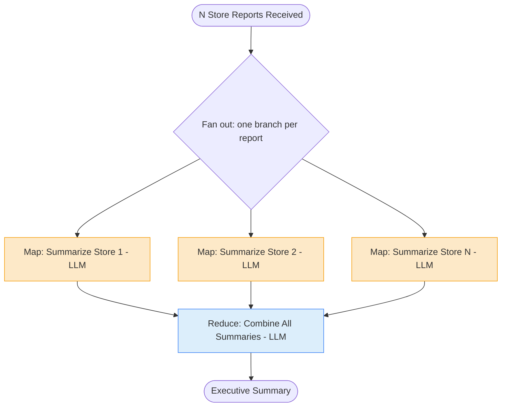

# 6. Map-Reduce

## 6.1 What is it?

**Map-Reduce** applies the **same operation** to every item in a list — the
**"map"** step — and then combines all of those individual results into one
final output — the **"reduce"** step. The key difference from every pattern
so far: the **number of parallel branches isn't fixed in the graph's design**
— it depends on how many items are in the list *at run time*. Ten stores
means ten parallel map calls; two hundred stores means two hundred.

This is different from Pattern 2 (Parallel Workflow), where we had a fixed,
small number of *different* analyses running side by side on *one* input.
Map-Reduce runs the *same* analysis, side by side, across a *variable-length
list* of inputs, and then folds the results down into one.

## 6.2 What problem does it solve?

A lot of real work comes in batches: a folder of documents, a list of
customer reviews, a set of daily reports from many locations. Processing
them one at a time in a loop works, but it's slow, and it doesn't scale — a
company with 5 stores and a company with 500 stores would need the *same
code*, just running for very different amounts of time.

The Map-Reduce pattern solves this by:

- Letting every item be processed **independently and concurrently**,
  cutting total time from "sum of every item" down to roughly "time for the
  slowest single item."
- Keeping the **per-item logic dead simple** — one function that only ever
  has to think about *one* report at a time.
- Providing one clear place — the **reduce step** — to think about how
  individual results should be combined, ranked, or summarized together.
- **Scaling naturally** with input size, since the graph doesn't need to know
  in advance how many items there will be.

## 6.3 Realistic production example: Multi-Store Sales Report Aggregation

A retail chain (`UrbanMart`) collects a daily sales report text from every
store — anywhere from a handful of stores to several hundred, and the exact
number changes as stores open and close. Every morning, leadership wants one
short executive summary of what happened across the whole chain.

1. **Map step** — for **each** store's report (independently, in parallel):
   an LLM call extracts a short summary noting sales performance and any
   notable anomalies (stockouts, unusual returns, staffing issues).
2. **Reduce step** — once **every** store's summary is ready, a second LLM
   call combines all of them into **one** executive summary: overall trend,
   and a short list of stores that need attention.

This is exactly Map-Reduce: the map step doesn't care how many stores there
are, and the reduce step only runs once everything from the map step has
finished.

## 6.4 Architecture / Flow Diagram


```mermaid
flowchart TD
    Start([N Store Reports Received]) --> Fan{Fan out: one branch per report}
    Fan --> M1[Map: Summarize Store 1 - LLM]
    Fan --> M2[Map: Summarize Store 2 - LLM]
    Fan --> M3[Map: Summarize Store N - LLM]
    M1 --> Reduce[Reduce: Combine All Summaries - LLM]
    M2 --> Reduce
    M3 --> Reduce
    Reduce --> End([Executive Summary])

    style M1 fill:#FDE9C8,stroke:#F59E0B
    style M2 fill:#FDE9C8,stroke:#F59E0B
    style M3 fill:#FDE9C8,stroke:#F59E0B
    style Reduce fill:#DCEEFB,stroke:#3B82F6
```

The number of `M` boxes here isn't fixed by the graph — it's determined at
run time by how many reports come in. That dynamic fan-out is the defining
feature of Map-Reduce.

## 6.5 Request-to-response flow, step by step

1. A client sends a list of `{store_id, report_text}` dicts to
   `run_sales_aggregation()`.
2. LangGraph builds the initial `OverallState`, holding that full list in
   `store_reports`.
3. From `START`, instead of a normal conditional edge returning one node
   name, we use LangGraph's **`Send`** API in `map_reports()`: it returns a
   **list of `Send` objects**, one per report — each one says "run the
   `summarize_store` node with *this one report* as its input." This is what
   creates a dynamic number of parallel branches.
4. LangGraph runs `summarize_store` once **per report**, concurrently. Each
   call only ever sees its *own* single report — it has no idea how many
   other stores exist.
5. Each `summarize_store` call returns one summary string. Because
   `store_summaries` is declared with a **reducer**
   (`Annotated[list[str], operator.add]`), LangGraph safely **appends** each
   parallel result into the same shared list instead of one overwriting
   another — this is the piece that makes concurrent writes to one field safe
   without extra merge logic.
6. Once **every** `summarize_store` branch has finished, LangGraph proceeds
   to `aggregate_summaries` — the reduce step — since that's the only
   downstream node whose inputs are now all ready.
7. **`aggregate_summaries`** reads the full list of per-store summaries and
   makes one final LLM call to combine them into a single executive summary.
8. The graph reaches `END` and returns the final report to the caller.

## 6.6 Why this pattern fits this problem

- The **number of stores changes over time** — a graph with a fixed number of
  parallel branches (like Pattern 2) simply can't represent "however many
  reports came in today." Map-Reduce's dynamic fan-out is built for exactly
  this.
- Each store's summary is **completely independent** of every other store's
  — nothing about summarizing Store 12 depends on Store 47 — so there's no
  reason to process them one at a time.
- Keeping **map and reduce as separate concerns** means the per-store prompt
  can stay simple and focused ("summarize this one report"), while all the
  "how do these all relate to each other" thinking lives in one place, the
  reduce step.
- This shape **scales gracefully** — the same graph handles 5 stores or 500
  stores; only the run time changes, not the code.

## 6.7 Production-quality implementation

```python
"""
Map-Reduce — Multi-Store Sales Report Aggregation
Pattern: dynamic fan-out (one branch per list item) -> reduce into one result

Run:
    pip install "langgraph==1.2.10" "langchain==1.3.14" "langchain-ollama==1.1.0" "pydantic==2.9.2"
    ollama pull llama3.1:8b     # make sure Ollama is running locally
    python sales_aggregation.py
"""

from __future__ import annotations

import logging
import operator
from typing import Annotated, TypedDict

from langchain_ollama import ChatOllama
from langgraph.graph import StateGraph, START, END
from langgraph.types import Send
from pydantic import BaseModel

# --------------------------------------------------------------------------
# 1. Logging
# --------------------------------------------------------------------------
logging.basicConfig(
    level=logging.INFO,
    format="%(asctime)s | %(levelname)s | %(name)s | %(message)s",
)
logger = logging.getLogger("sales_aggregation")


# --------------------------------------------------------------------------
# 2. Overall (graph-level) state.
#    `store_summaries` uses a REDUCER (operator.add) because many parallel
#    map branches write to it at once -- the reducer tells LangGraph to
#    concatenate/append results instead of one overwriting another.
# --------------------------------------------------------------------------
class OverallState(BaseModel):
    store_reports: list[dict] = []
    store_summaries: Annotated[list[str], operator.add] = []
    final_report: str | None = None


# --------------------------------------------------------------------------
# 3. Per-branch (map-step) state.
#    Each parallel `summarize_store` call only ever sees ONE report -- it
#    has no visibility into the full list or how many branches exist.
# --------------------------------------------------------------------------
class StoreReportState(TypedDict):
    report: dict


# --------------------------------------------------------------------------
# 4. Local model client
# --------------------------------------------------------------------------
_llm = ChatOllama(model="llama3.1:8b", temperature=0)

_MAP_PROMPT = """Summarize this single store's daily sales report in 1-2
sentences. Flag anything unusual (stockouts, unusual returns, staffing
issues) explicitly if present.

Store ID: {store_id}
Report: {report_text}
"""

_REDUCE_PROMPT = """You are preparing an executive summary for a retail
chain's leadership team. Below are short summaries from every store today.
Combine them into ONE executive summary: 
1) overall sales trend across the chain, 
2) a short bullet list of specific stores that need attention and why.

Per-store summaries:
{summaries}
"""


# --------------------------------------------------------------------------
# 5. Map step — runs once per report, fully independent of the others.
# --------------------------------------------------------------------------
def summarize_store(state: StoreReportState) -> dict:
    report = state["report"]
    store_id = report.get("store_id", "unknown")
    logger.info("MAP — summarizing store %s", store_id)

    try:
        response = _llm.invoke(
            _MAP_PROMPT.format(store_id=store_id, report_text=report.get("report_text", ""))
        )
        summary = f"Store {store_id}: {response.content.strip()}"
    except Exception as exc:  # noqa: BLE001
        logger.error("summarize_store failed for %s: %s", store_id, exc)
        summary = f"Store {store_id}: summary unavailable — needs manual review."

    # Returned as a one-item list; the `operator.add` reducer on
    # `store_summaries` appends it to the shared list from every branch.
    return {"store_summaries": [summary]}


# --------------------------------------------------------------------------
# 6. Fan-out function — the heart of Map-Reduce.
#    Returns a LIST of Send objects: one per report, each targeting the
#    `summarize_store` node with just that one report as its input.
#    The number of Send objects is decided at RUN TIME from len(reports).
# --------------------------------------------------------------------------
def map_reports(state: OverallState) -> list[Send]:
    logger.info("FAN-OUT — dispatching %d store reports", len(state.store_reports))
    return [
        Send("summarize_store", {"report": report})
        for report in state.store_reports
    ]


# --------------------------------------------------------------------------
# 7. Reduce step — runs once, only after every map branch has finished.
# --------------------------------------------------------------------------
def aggregate_summaries(state: OverallState) -> dict:
    logger.info("REDUCE — combining %d store summaries", len(state.store_summaries))

    try:
        response = _llm.invoke(
            _REDUCE_PROMPT.format(summaries="\n".join(state.store_summaries))
        )
        final_report = response.content.strip()
    except Exception as exc:  # noqa: BLE001
        logger.error("aggregate_summaries failed: %s", exc)
        final_report = (
            "Executive summary unavailable. Raw per-store summaries:\n"
            + "\n".join(state.store_summaries)
        )

    return {"final_report": final_report}


# --------------------------------------------------------------------------
# 8. Build the graph.
#    START uses a conditional edge whose function returns Send objects
#    instead of a plain node name -- that's what enables dynamic fan-out.
# --------------------------------------------------------------------------
def build_graph():
    graph = StateGraph(OverallState)

    graph.add_node("summarize_store", summarize_store)
    graph.add_node("aggregate_summaries", aggregate_summaries)

    # Dynamic fan-out: map_reports() decides how many parallel branches
    # to create, one per report, at run time.
    graph.add_conditional_edges(START, map_reports, ["summarize_store"])

    # Fan-in: aggregate_summaries only runs once ALL summarize_store
    # branches (however many there were) have completed.
    graph.add_edge("summarize_store", "aggregate_summaries")
    graph.add_edge("aggregate_summaries", END)

    return graph.compile()


# --------------------------------------------------------------------------
# 9. Public entry point
# --------------------------------------------------------------------------
def run_sales_aggregation(store_reports: list[dict]) -> dict:
    app = build_graph()
    initial_state = OverallState(store_reports=store_reports)
    final_state = app.invoke(initial_state)
    return final_state


# --------------------------------------------------------------------------
# 10. Demo
# --------------------------------------------------------------------------
if __name__ == "__main__":
    sample_reports = [
        {"store_id": "NYC-01", "report_text": "Sales up 8% vs last week. No issues."},
        {"store_id": "LA-04", "report_text": "Ran out of the new sneaker drop by 11am."},
        {"store_id": "CHI-02", "report_text": "Two staff called in sick, long checkout lines."},
        {"store_id": "MIA-03", "report_text": "Normal day, slightly below forecast."},
    ]

    result = run_sales_aggregation(sample_reports)
    print(result["final_report"])
```

**Notes on production-readiness choices made above:**

- **`Send` objects for dynamic fan-out** — this is the specific LangGraph
  mechanism for "run this node N times in parallel, where N is only known at
  run time." A fixed set of `add_edge` calls (like Pattern 2 used) can't
  express a variable-length fan-out.
- **A reducer (`Annotated[list[str], operator.add]`) on the shared list
  field** — without this, concurrent writes from many parallel
  `summarize_store` branches to the same field would silently overwrite each
  other; with it, LangGraph safely combines them.
- **The map-step state (`StoreReportState`) is deliberately narrow** — it
  only contains one report, not the whole list. This keeps each branch
  simple and prevents a branch from accidentally depending on data from
  other branches.
- **Both the map and reduce LLM calls are wrapped in `try/except`** — one
  store's summary failing degrades to a placeholder note rather than
  crashing the whole aggregation, and the reduce step has its own fallback
  if the final combination call fails.

---

⬅ [5. Routing](05-routing.md) | [Back to index](README.md) | Next: [7. Fan-Out / Fan-In](07-fan-out-fan-in.md) ➡

# Multi-Store Sales Report Aggregation — Map-Reduce (Java + Spring AI)

A Java port of the LangGraph map-reduce workflow — a **dynamic** fan-out (the number of parallel
branches is decided at runtime from `len(store_reports)`, via `Send` objects) followed by a single
reduce step. Built on:

- **Java 25** (current LTS) — virtual threads for the dynamic-width map step
- **Spring Boot 4.1.0**
- **Spring AI 2.0.0** (GA) with the **Ollama** starter, mirroring `llama3.1:8b`

## Mapping the shape

The earlier Parallel Workflow port had a **fixed** number of branches (exactly 3, known at
compile time, each doing something different). Map-reduce is different in a way that matters:
the branch *count* is unknown until the request arrives, and every branch runs the *same* logic
over a *different* item. LangGraph expresses that with `Send` objects returned from a routing
function; Java expresses the same "one task per list item, unknown count, same logic" idea with
a `Stream`/`List` mapped to concurrent tasks.

| LangGraph concept | Spring / Java equivalent |
|---|---|
| `OverallState.store_reports: list[dict]` | `List<StoreReport>` passed into the service |
| `Annotated[list[str], operator.add]` reducer | Plain `List<String>` built from collected future results — no reducer annotation needed because nothing writes concurrently to one shared field |
| `map_reports(state) -> list[Send]` | `reports.stream().map(report -> CompletableFuture.supplyAsync(...))` on a virtual-thread executor |
| `summarize_store` (map step, one per report) | `StoreSummarizationStep.summarize(StoreReport)` |
| `aggregate_summaries` (reduce step, once) | `SummaryAggregationStep.aggregate(List<String>)` |
| Fan-in after however many branches ran | `CompletableFuture.allOf(...).join()` over however many futures were created |

Because each map branch only ever sees its own single `StoreReport` — never the full list or a
shared mutable collection — there's nothing analogous to `operator.add` to reach for in Java: the
futures are simply collected into a list after they all complete, in the order they were
submitted.

---

## Project structure

```
sales-aggregation/
├── pom.xml
└── src/main/java/com/example/salesaggregation/
    ├── SalesAggregationApplication.java
    ├── model/
    │   └── StoreReport.java
    ├── pipeline/
    │   ├── StoreSummarizationStep.java
    │   ├── SummaryAggregationStep.java
    │   └── SalesAggregationService.java
    ├── web/
    │   └── SalesAggregationController.java
    └── SalesAggregationRunner.java   (CLI demo, mirrors the Python __main__ block)
└── src/main/resources/
    └── application.yml
```

---

## `pom.xml`

```xml
<?xml version="1.0" encoding="UTF-8"?>
<project xmlns="http://maven.apache.org/POM/4.0.0"
         xmlns:xsi="http://www.w3.org/2001/XMLSchema-instance"
         xsi:schemaLocation="http://maven.apache.org/POM/4.0.0 https://maven.apache.org/xsd/maven-4.0.0.xsd">
    <modelVersion>4.0.0</modelVersion>

    <groupId>com.example</groupId>
    <artifactId>sales-aggregation</artifactId>
    <version>1.0.0</version>
    <packaging>jar</packaging>

    <properties>
        <java.version>25</java.version>
        <spring-ai.version>2.0.0</spring-ai.version>
    </properties>

    <parent>
        <groupId>org.springframework.boot</groupId>
        <artifactId>spring-boot-starter-parent</artifactId>
        <version>4.1.0</version>
        <relativePath/>
    </parent>

    <dependencyManagement>
        <dependencies>
            <dependency>
                <groupId>org.springframework.ai</groupId>
                <artifactId>spring-ai-bom</artifactId>
                <version>${spring-ai.version}</version>
                <type>pom</type>
                <scope>import</scope>
            </dependency>
        </dependencies>
    </dependencyManagement>

    <dependencies>
        <dependency>
            <groupId>org.springframework.boot</groupId>
            <artifactId>spring-boot-starter-web</artifactId>
        </dependency>
        <!-- Ollama model starter — local llama3.1:8b, same as langchain-ollama -->
        <dependency>
            <groupId>org.springframework.ai</groupId>
            <artifactId>spring-ai-starter-model-ollama</artifactId>
        </dependency>
        <dependency>
            <groupId>org.springframework.boot</groupId>
            <artifactId>spring-boot-starter-test</artifactId>
            <scope>test</scope>
        </dependency>
    </dependencies>

    <build>
        <plugins>
            <plugin>
                <groupId>org.springframework.boot</groupId>
                <artifactId>spring-boot-maven-plugin</artifactId>
            </plugin>
        </plugins>
    </build>
</project>
```

## `src/main/resources/application.yml`

```yaml
spring:
  application:
    name: sales-aggregation
  ai:
    ollama:
      base-url: http://localhost:11434
      chat:
        options:
          model: llama3.1:8b
          temperature: 0.0

logging:
  level:
    com.example.salesaggregation: INFO
```

---

## Domain model

### `model/StoreReport.java`

```java
package com.example.salesaggregation.model;

public record StoreReport(String storeId, String reportText) {}
```

There's no `OverallState`/`StoreReportState` split to model here in Java the way the Python
version needs it: that split exists so LangGraph can pass each `Send` a narrowed, single-report
view of state. In Java, `StoreSummarizationStep.summarize` simply takes a `StoreReport` parameter
directly — there's no shared state object a map branch could accidentally see too much of.

---

## Map step

### `pipeline/StoreSummarizationStep.java`

Runs once per report, fully independent of the others — the direct analogue of `summarize_store`.

```java
package com.example.salesaggregation.pipeline;

import com.example.salesaggregation.model.StoreReport;
import org.slf4j.Logger;
import org.slf4j.LoggerFactory;
import org.springframework.ai.chat.client.ChatClient;
import org.springframework.stereotype.Component;

@Component
public class StoreSummarizationStep {

    private static final Logger log = LoggerFactory.getLogger(StoreSummarizationStep.class);

    private static final String MAP_PROMPT = """
            Summarize this single store's daily sales report in 1-2 sentences. \
            Flag anything unusual (stockouts, unusual returns, staffing issues) \
            explicitly if present.

            Store ID: {storeId}
            Report: {reportText}
            """;

    private final ChatClient chatClient;

    public StoreSummarizationStep(ChatClient.Builder chatClientBuilder) {
        this.chatClient = chatClientBuilder.build();
    }

    public String summarize(StoreReport report) {
        log.info("MAP - summarizing store {}", report.storeId());
        try {
            String content = chatClient.prompt()
                    .user(u -> u.text(MAP_PROMPT)
                            .param("storeId", report.storeId())
                            .param("reportText", report.reportText()))
                    .call()
                    .content()
                    .strip();
            return "Store %s: %s".formatted(report.storeId(), content);
        } catch (Exception e) {
            log.error("summarize_store failed for {}: {}", report.storeId(), e.getMessage());
            return "Store %s: summary unavailable - needs manual review.".formatted(report.storeId());
        }
    }
}
```

---

## Reduce step

### `pipeline/SummaryAggregationStep.java`

Runs once, only after every map branch has finished — the direct analogue of
`aggregate_summaries`.

```java
package com.example.salesaggregation.pipeline;

import org.slf4j.Logger;
import org.slf4j.LoggerFactory;
import org.springframework.ai.chat.client.ChatClient;
import org.springframework.stereotype.Component;

import java.util.List;

@Component
public class SummaryAggregationStep {

    private static final Logger log = LoggerFactory.getLogger(SummaryAggregationStep.class);

    private static final String REDUCE_PROMPT = """
            You are preparing an executive summary for a retail chain's leadership team. \
            Below are short summaries from every store today. Combine them into ONE \
            executive summary:
            1) overall sales trend across the chain,
            2) a short bullet list of specific stores that need attention and why.

            Per-store summaries:
            {summaries}
            """;

    private final ChatClient chatClient;

    public SummaryAggregationStep(ChatClient.Builder chatClientBuilder) {
        this.chatClient = chatClientBuilder.build();
    }

    public String aggregate(List<String> storeSummaries) {
        log.info("REDUCE - combining {} store summaries", storeSummaries.size());
        try {
            return chatClient.prompt()
                    .user(u -> u.text(REDUCE_PROMPT).param("summaries", String.join("\n", storeSummaries)))
                    .call()
                    .content()
                    .strip();
        } catch (Exception e) {
            log.error("aggregate_summaries failed: {}", e.getMessage());
            return "Executive summary unavailable. Raw per-store summaries:\n"
                    + String.join("\n", storeSummaries);
        }
    }
}
```

---

## Dynamic fan-out / fan-in

### `pipeline/SalesAggregationService.java`

The direct analogue of `map_reports` (dynamic fan-out via `Send`) plus the two fixed edges into
and out of `aggregate_summaries`.

```java
package com.example.salesaggregation.pipeline;

import com.example.salesaggregation.model.StoreReport;
import org.slf4j.Logger;
import org.slf4j.LoggerFactory;
import org.springframework.stereotype.Service;

import java.util.List;
import java.util.concurrent.CompletableFuture;
import java.util.concurrent.ExecutorService;
import java.util.concurrent.Executors;

@Service
public class SalesAggregationService {

    private static final Logger log = LoggerFactory.getLogger(SalesAggregationService.class);

    private final StoreSummarizationStep storeSummarizationStep;
    private final SummaryAggregationStep summaryAggregationStep;
    private final ExecutorService virtualThreadExecutor = Executors.newVirtualThreadPerTaskExecutor();

    public SalesAggregationService(StoreSummarizationStep storeSummarizationStep,
                                    SummaryAggregationStep summaryAggregationStep) {
        this.storeSummarizationStep = storeSummarizationStep;
        this.summaryAggregationStep = summaryAggregationStep;
    }

    public String aggregate(List<StoreReport> storeReports) {
        // Dynamic fan-out: one virtual-thread task per report, exactly like map_reports()
        // creating one Send per report at run time — the branch count isn't known until
        // storeReports.size() is evaluated here.
        log.info("FAN-OUT - dispatching {} store reports", storeReports.size());
        List<CompletableFuture<String>> futures = storeReports.stream()
                .map(report -> CompletableFuture.supplyAsync(
                        () -> storeSummarizationStep.summarize(report), virtualThreadExecutor))
                .toList();

        // Fan-in: block until every branch — however many there were — has completed,
        // then collect results in submission order. No reducer annotation needed since
        // each future produces its own independent String; nothing is written concurrently.
        CompletableFuture.allOf(futures.toArray(CompletableFuture[]::new)).join();
        List<String> storeSummaries = futures.stream().map(CompletableFuture::join).toList();

        return summaryAggregationStep.aggregate(storeSummaries);
    }
}
```

---

## Entry points

### `web/SalesAggregationController.java`

```java
package com.example.salesaggregation.web;

import com.example.salesaggregation.model.StoreReport;
import com.example.salesaggregation.pipeline.SalesAggregationService;
import org.springframework.web.bind.annotation.PostMapping;
import org.springframework.web.bind.annotation.RequestBody;
import org.springframework.web.bind.annotation.RestController;

import java.util.List;

@RestController
public class SalesAggregationController {

    private final SalesAggregationService salesAggregationService;

    public SalesAggregationController(SalesAggregationService salesAggregationService) {
        this.salesAggregationService = salesAggregationService;
    }

    @PostMapping("/api/sales-reports/aggregate")
    public String aggregate(@RequestBody List<StoreReport> storeReports) {
        return salesAggregationService.aggregate(storeReports);
    }
}
```

### `SalesAggregationRunner.java` (CLI demo, mirrors the Python `if __name__ == "__main__"` block)

```java
package com.example.salesaggregation;

import com.example.salesaggregation.model.StoreReport;
import com.example.salesaggregation.pipeline.SalesAggregationService;
import org.springframework.boot.CommandLineRunner;
import org.springframework.context.annotation.Profile;
import org.springframework.stereotype.Component;

import java.util.List;

@Component
@Profile("demo")
public class SalesAggregationRunner implements CommandLineRunner {

    private final SalesAggregationService salesAggregationService;

    public SalesAggregationRunner(SalesAggregationService salesAggregationService) {
        this.salesAggregationService = salesAggregationService;
    }

    @Override
    public void run(String... args) {
        List<StoreReport> sampleReports = List.of(
                new StoreReport("NYC-01", "Sales up 8% vs last week. No issues."),
                new StoreReport("LA-04", "Ran out of the new sneaker drop by 11am."),
                new StoreReport("CHI-02", "Two staff called in sick, long checkout lines."),
                new StoreReport("MIA-03", "Normal day, slightly below forecast.")
        );

        System.out.println(salesAggregationService.aggregate(sampleReports));
    }
}
```

### `SalesAggregationApplication.java`

```java
package com.example.salesaggregation;

import org.springframework.boot.SpringApplication;
import org.springframework.boot.autoconfigure.SpringBootApplication;

@SpringBootApplication
public class SalesAggregationApplication {
    public static void main(String[] args) {
        SpringApplication.run(SalesAggregationApplication.class, args);
    }
}
```

---

## Running it

```bash
ollama pull llama3.1:8b
ollama serve   # if not already running

# CLI demo (prints the executive summary, like the Python script)
mvn spring-boot:run -Dspring-boot.run.profiles=demo

# Or as a service — send any number of reports, the fan-out width adapts
mvn spring-boot:run
curl -X POST localhost:8080/api/sales-reports/aggregate \
  -H "Content-Type: application/json" \
  -d '[{"storeId":"NYC-01","reportText":"Sales up 8%% vs last week."},{"storeId":"LA-04","reportText":"Ran out of stock by 11am."}]'
```

## Notes on the port

- **Dynamic width, no reducer needed**: `operator.add` on `store_summaries` exists in the Python
  version because LangGraph merges concurrent partial-state writes from an unknown number of
  branches into one shared list field. In Java, each branch is just a `CompletableFuture<String>`
  local to the method call — there's no shared mutable state for concurrent branches to write
  into, so nothing needs a merge strategy; `futures.stream().map(CompletableFuture::join).toList()`
  collects them once, after `allOf` confirms they're all done.
- **True dynamic fan-out preserved**: the number of virtual-thread tasks created is
  `storeReports.size()`, evaluated at call time — exactly like `map_reports` deciding the number
  of `Send` objects from `len(state.store_reports)` at run time, not at graph-build time.
- **Per-branch resilience preserved**: `StoreSummarizationStep.summarize` keeps its own
  try/catch → "needs manual review" fallback per store, and `SummaryAggregationStep.aggregate`
  keeps its own fallback to raw per-store summaries if the reduce call itself fails — both
  exactly matching the Python version's two independent failure modes.
- **Versions**: same Ollama-backed `spring-ai-starter-model-ollama` / `llama3.1:8b` setup as the
  other parallel/branching ports in this series.
