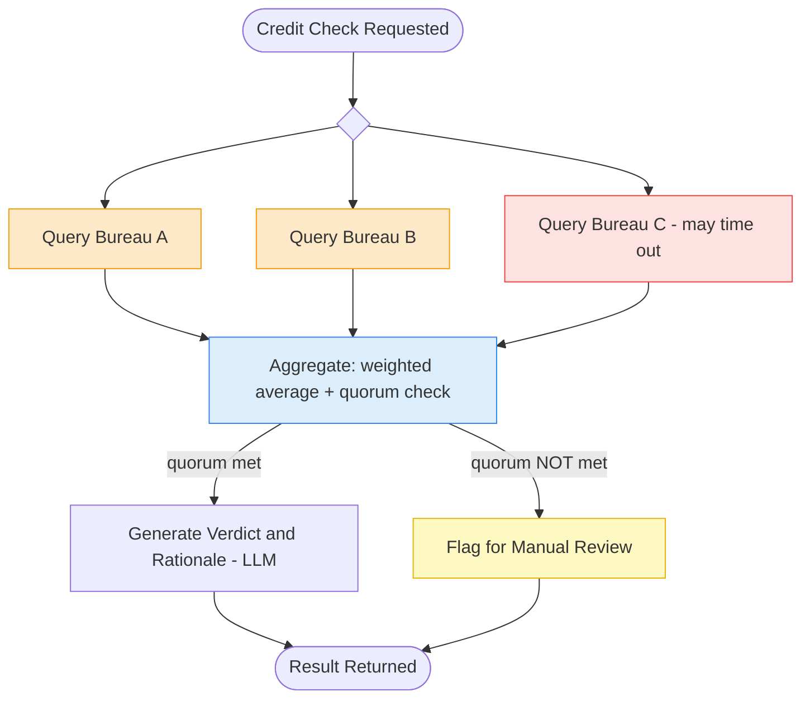

# 7. Fan-Out / Fan-In

## 7.1 What is it?

**Fan-Out / Fan-In** sends the same request out to **multiple independent
external services** at once (fan-out), then combines whatever comes back
into **one decision** (fan-in) — using real aggregation logic (weighted
scoring, voting, reconciliation), not just formatting results side by side.
Critically, the fan-in step is built to **tolerate some branches failing or
timing out**, since real external services aren't always available.

This is a close cousin of Pattern 2 (Parallel Workflow), but with two
important differences:

- The branches here typically call **external systems** (third-party APIs,
  partner services) rather than doing different *kinds* of analysis on the
  same text.
- The fan-in step does **real combination logic** — like a weighted average
  or a majority vote — and has to **handle partial failure** gracefully,
  rather than just assembling a report assuming every branch succeeded.

## 7.2 What problem does it solve?

Many important decisions shouldn't rely on a single external data source —
that source might be wrong, biased, or simply down when you need it. Querying
several independent providers and combining their answers gives a more
reliable result. But naively requiring *all* of them to respond makes the
whole system fragile: one slow or failing provider shouldn't be able to break
everything.

The Fan-Out / Fan-In pattern solves this by:

- Getting answers from **multiple independent sources at once**, which is
  both faster (they run concurrently) and more reliable (no single point of
  failure) than querying one at a time.
- Defining **explicit combination logic** — how do you turn three different
  scores into one decision? That logic lives in one clear place.
- Making the system **degrade gracefully** — if one provider times out, the
  system can often still produce a valid result from the ones that responded,
  rather than failing the whole request.
- Keeping a **clear minimum-quorum rule** — e.g., "need at least 2 of 3
  sources" — so the system knows exactly when it has *too little* data to
  trust a result.

## 7.3 Realistic production example: Multi-Bureau Credit Verification

A lending platform (`CrediCore`) checks an applicant's credit by querying
**three independent credit bureaus** at once, since no single bureau is
always available or always accurate:

- **Bureau A** — most reliable historically, given the highest weight.
- **Bureau B** — reliable, medium weight.
- **Bureau C** — occasionally slow or unavailable, lowest weight, and in this
  example **simulated to fail** to demonstrate graceful degradation.

**Fan-out:** all three bureaus are queried concurrently.

**Fan-in:** the system combines whichever scores came back using a
**weighted average**. If **at least 2 of the 3** bureaus responded, it
produces a confident verdict. If **fewer than 2** responded, there isn't
enough data to trust a result, so it's flagged for manual review instead of
guessing.

## 7.4 Architecture / Flow Diagram



Notice the aggregation step here isn't just "combine everything" — it makes
its own decision (quorum met or not) about whether it even has enough to
proceed, which is what distinguishes real Fan-In logic from a simple merge.

## 7.5 Request-to-response flow, step by step

1. A client sends an applicant ID to `run_credit_check()`.
2. LangGraph builds the initial `CreditState` and fans out from `START` to
   three concurrent nodes: `query_bureau_a`, `query_bureau_b`,
   `query_bureau_c`.
3. Each bureau node **simulates an external API call** (`asyncio.sleep`
   standing in for network latency) and either returns a score or raises a
   simulated timeout — wrapped in `try/except` so a single failing bureau
   never crashes the graph. A failed bureau writes `None` for its score
   instead of stopping anything.
4. Once all three branches finish (successfully or not), LangGraph proceeds
   to `aggregate_scores` — the fan-in step.
5. **`aggregate_scores`** counts how many bureaus actually responded
   (non-`None`). If **fewer than 2 responded**, it sets
   `state.quorum_met = False` and stops here — there isn't enough data for a
   safe automated decision.
6. If **quorum is met**, it computes a **weighted average** using each
   bureau's reliability weight, applied only across the bureaus that
   actually responded (weights are re-normalized so partial responses don't
   unfairly skew the result).
7. A conditional edge on `aggregate_scores` routes to either
   `generate_verdict` (quorum met — makes an LLM call to phrase a short,
   plain-language rationale for the final score) or `flag_manual_review`
   (quorum not met — explains why automated scoring wasn't possible).
8. Both paths converge to `END` with a consistent result shape.

## 7.6 Why this pattern fits this problem

- **No single credit bureau should be a single point of failure** for a
  lending decision — querying three independent sources concurrently is both
  faster and safer than relying on one, or querying them one at a time.
- **Weighted combination reflects reality** — not all data sources are
  equally trustworthy; a flat average would treat a historically flaky
  bureau the same as a highly reliable one.
- **Explicit quorum logic prevents false confidence** — silently producing a
  score from just 1 out of 3 bureaus (if the other two happened to fail)
  could look identical to a confident 3-out-of-3 result unless the system
  tracks and checks this on purpose.
- **Graceful degradation matters for a live financial product** — a single
  bureau timing out (a very normal occurrence) shouldn't ever cause the whole
  credit check to fail outright.

## 7.7 Production-quality implementation

```python
"""
Fan-Out / Fan-In — Multi-Bureau Credit Verification
Pattern: query multiple independent services concurrently, combine with
weighted logic that tolerates partial failure

Run:
    pip install "langgraph==1.2.10" "langchain==1.3.14" "langchain-ollama==1.1.0" "pydantic==2.9.2"
    ollama pull llama3.1:8b     # make sure Ollama is running locally
    python credit_verification.py
"""

from __future__ import annotations

import asyncio
import logging
import random
from typing import Optional

from langchain_ollama import ChatOllama
from langgraph.graph import StateGraph, START, END
from pydantic import BaseModel

# --------------------------------------------------------------------------
# 1. Logging
# --------------------------------------------------------------------------
logging.basicConfig(
    level=logging.INFO,
    format="%(asctime)s | %(levelname)s | %(name)s | %(message)s",
)
logger = logging.getLogger("credit_verification")


# --------------------------------------------------------------------------
# 2. Shared state
# --------------------------------------------------------------------------
class CreditState(BaseModel):
    applicant_id: str = ""

    score_bureau_a: Optional[int] = None
    score_bureau_b: Optional[int] = None
    score_bureau_c: Optional[int] = None

    quorum_met: Optional[bool] = None
    combined_score: Optional[float] = None

    verdict: Optional[str] = None
    rationale: Optional[str] = None


# Reliability weights -- CrediCore's own historical accuracy data per bureau.
_BUREAU_WEIGHTS = {"a": 0.5, "b": 0.35, "c": 0.15}
_MIN_QUORUM = 2  # need at least 2 of 3 bureaus to trust an automated result

_llm = ChatOllama(model="llama3.1:8b", temperature=0.2)


# --------------------------------------------------------------------------
# 3. Fan-out — three independent, concurrent "external API calls".
#    Each is wrapped in try/except so one failing bureau can never crash
#    the graph; a failure just leaves that bureau's score as None.
# --------------------------------------------------------------------------
async def query_bureau_a(state: CreditState) -> dict:
    logger.info("FAN-OUT — querying Bureau A for %s", state.applicant_id)
    try:
        await asyncio.sleep(0.3)  # simulated network latency
        score = 680 + (hash(state.applicant_id + "a") % 100)  # deterministic demo score
        return {"score_bureau_a": score}
    except Exception as exc:  # noqa: BLE001
        logger.error("Bureau A failed: %s", exc)
        return {"score_bureau_a": None}


async def query_bureau_b(state: CreditState) -> dict:
    logger.info("FAN-OUT — querying Bureau B for %s", state.applicant_id)
    try:
        await asyncio.sleep(0.4)
        score = 660 + (hash(state.applicant_id + "b") % 120)
        return {"score_bureau_b": score}
    except Exception as exc:  # noqa: BLE001
        logger.error("Bureau B failed: %s", exc)
        return {"score_bureau_b": None}


async def query_bureau_c(state: CreditState) -> dict:
    logger.info("FAN-OUT — querying Bureau C for %s", state.applicant_id)
    try:
        await asyncio.sleep(0.5)
        # Simulated: Bureau C is the least reliable and times out here,
        # to demonstrate the fan-in step handling a missing response.
        raise TimeoutError("Bureau C did not respond in time")
    except Exception as exc:  # noqa: BLE001
        logger.warning("Bureau C unavailable, proceeding without it: %s", exc)
        return {"score_bureau_c": None}


# --------------------------------------------------------------------------
# 4. Fan-in — real aggregation logic, not just formatting.
#    Checks quorum FIRST, then computes a re-normalized weighted average
#    across only the bureaus that actually responded.
# --------------------------------------------------------------------------
def aggregate_scores(state: CreditState) -> dict:
    responses = {
        "a": state.score_bureau_a,
        "b": state.score_bureau_b,
        "c": state.score_bureau_c,
    }
    responded = {k: v for k, v in responses.items() if v is not None}
    logger.info("FAN-IN — %d/3 bureaus responded: %s", len(responded), list(responded.keys()))

    if len(responded) < _MIN_QUORUM:
        return {"quorum_met": False}

    # Re-normalize weights across only the bureaus that responded, so a
    # missing bureau doesn't silently shrink the effective score.
    total_weight = sum(_BUREAU_WEIGHTS[k] for k in responded)
    combined = sum(responded[k] * _BUREAU_WEIGHTS[k] for k in responded) / total_weight

    return {"quorum_met": True, "combined_score": round(combined, 1)}


def route_by_quorum(state: CreditState) -> str:
    return "generate_verdict" if state.quorum_met else "flag_manual_review"


# --------------------------------------------------------------------------
# 5. Path A — quorum met: generate a plain-language verdict (LLM).
# --------------------------------------------------------------------------
_VERDICT_PROMPT = """A lending applicant has a combined weighted credit score
of {score}. In one short sentence, describe what this score generally
indicates for a lending decision (e.g., strong, moderate, weak).
"""


def generate_verdict(state: CreditState) -> dict:
    logger.info("VERDICT — combined score %.1f", state.combined_score)
    try:
        response = _llm.invoke(_VERDICT_PROMPT.format(score=state.combined_score))
        rationale = response.content.strip()
    except Exception as exc:  # noqa: BLE001
        logger.error("generate_verdict LLM call failed: %s", exc)
        rationale = f"Combined score: {state.combined_score}."

    return {"verdict": "scored", "rationale": rationale}


# --------------------------------------------------------------------------
# 6. Path B — quorum not met: explain why, route to a human.
# --------------------------------------------------------------------------
def flag_manual_review(state: CreditState) -> dict:
    responded_count = sum(
        s is not None for s in (state.score_bureau_a, state.score_bureau_b, state.score_bureau_c)
    )
    logger.warning("MANUAL REVIEW — only %d/3 bureaus responded", responded_count)
    return {
        "verdict": "manual_review",
        "rationale": (
            f"Only {responded_count} of 3 credit bureaus responded "
            f"(minimum {_MIN_QUORUM} required). Insufficient data for an "
            f"automated decision — routed to manual review."
        ),
    }


# --------------------------------------------------------------------------
# 7. Build the graph — fixed fan-out to 3 external services, fan-in with
#    quorum-aware aggregation, then a conditional path based on that result.
# --------------------------------------------------------------------------
def build_graph():
    graph = StateGraph(CreditState)

    graph.add_node("query_bureau_a", query_bureau_a)
    graph.add_node("query_bureau_b", query_bureau_b)
    graph.add_node("query_bureau_c", query_bureau_c)
    graph.add_node("aggregate_scores", aggregate_scores)
    graph.add_node("generate_verdict", generate_verdict)
    graph.add_node("flag_manual_review", flag_manual_review)

    # Fan-out
    graph.add_edge(START, "query_bureau_a")
    graph.add_edge(START, "query_bureau_b")
    graph.add_edge(START, "query_bureau_c")

    # Fan-in
    graph.add_edge("query_bureau_a", "aggregate_scores")
    graph.add_edge("query_bureau_b", "aggregate_scores")
    graph.add_edge("query_bureau_c", "aggregate_scores")

    # Conditional path based on the fan-in step's own quorum decision
    graph.add_conditional_edges(
        "aggregate_scores",
        route_by_quorum,
        {
            "generate_verdict": "generate_verdict",
            "flag_manual_review": "flag_manual_review",
        },
    )

    graph.add_edge("generate_verdict", END)
    graph.add_edge("flag_manual_review", END)

    return graph.compile()


# --------------------------------------------------------------------------
# 8. Public entry point — async, so the three bureau calls run concurrently.
# --------------------------------------------------------------------------
async def run_credit_check(applicant_id: str) -> dict:
    app = build_graph()
    initial_state = CreditState(applicant_id=applicant_id)
    final_state = await app.ainvoke(initial_state)
    return final_state


# --------------------------------------------------------------------------
# 9. Demo
# --------------------------------------------------------------------------
if __name__ == "__main__":
    result = asyncio.run(run_credit_check("APPLICANT-4471"))
    print(f"Verdict: {result['verdict']}")
    print(f"Rationale: {result['rationale']}")
    if result.get("combined_score") is not None:
        print(f"Combined score: {result['combined_score']}")
```

**Notes on production-readiness choices made above:**

- **Each bureau call wraps its own `try/except`** — a timeout from Bureau C
  never propagates up and crashes the graph; it just leaves that one field
  as `None`, which the fan-in step is specifically designed to handle.
- **Quorum is checked *before* any averaging happens** — this ordering
  matters: it's the difference between "we have enough data, let's combine
  it" and "let's combine whatever we have and hope it's enough," which is a
  much weaker guarantee for a financial decision.
- **Re-normalized weights** — dividing by `total_weight` (the sum of weights
  for bureaus that actually responded) means a missing bureau doesn't quietly
  drag the combined score down just because its weight is now "missing" from
  the total; the remaining bureaus' relative importance is preserved.
- **The LLM is only used for the final human-readable rationale**, not for
  the actual scoring decision — the numeric combination is deterministic,
  auditable code, which matters a lot for a regulated financial outcome.

---

⬅ [6. Map-Reduce](06-map-reduce.md) | [Back to index](README.md) | Next: [8. Iterative Workflow](08-iterative-workflow.md) ➡
