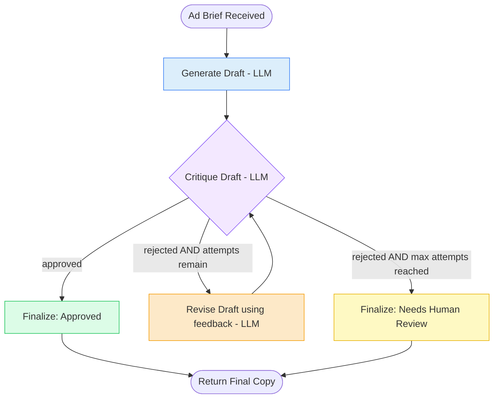

# 8. Iterative Workflow

## 8.1 What is it?

An **Iterative Workflow** repeats a **generate → check → improve** cycle
until the result is good enough, or a maximum number of attempts is reached.
Unlike earlier patterns where each node runs once, here a small group of
nodes can run **several times in a row**, each time producing something a
little better than before, using feedback from the check step.

This is the "draft, review, revise, review again" cycle a human writer goes
through — except here an LLM plays both the writer and the reviewer.

> **Note on naming:** Iterative Workflow (this pattern) is specifically about
> **refining one piece of output through repeated quality passes**. Pattern 9
> (Loop Workflow) is the more general "repeat a step until some condition is
> true" — e.g., processing a queue until it's empty. Iterative Workflow is a
> specialized, quality-driven version of that general idea.

## 8.2 What problem does it solve?

A single LLM call, even with a good prompt, doesn't always produce output
that meets every requirement on the first try — a marketing claim might be
too strong, a summary might run over the length limit, a piece of copy might
miss the brand's tone. Regenerating from scratch and hoping for the best
wastes effort; a human manually checking and re-prompting every time doesn't
scale.

The Iterative Workflow pattern solves this by:

- **Automating the review cycle** — a critique step checks the output
  against explicit criteria and gives specific, actionable feedback.
- **Feeding that feedback back in**, so each revision is a *targeted* fix,
  not a blind retry.
- **Capping the number of attempts** — an essential safety net, since without
  a limit, a stubborn piece of content that never quite passes could loop
  forever.
- Producing a system that behaves like a **careful human editor**, catching
  and fixing its own mistakes before anything reaches a person.

## 8.3 Realistic production example: Compliant Ad Copy Generator

A marketing tech company (`AdForge`) generates ad copy for clients, and every
piece of copy must pass **compliance rules** before it can go out: no
unqualified superlative claims ("the best," "guaranteed"), and a strict
character limit for the ad platform.

1. **Generate** — draft ad copy for a product based on a short brief.
2. **Critique** — an LLM compliance checker reviews the draft against the
   rules and returns either `approved` or `rejected` **with specific
   feedback** on what's wrong.
3. **Revise** — if rejected (and attempts remain), the draft is rewritten
   using that specific feedback, and sent back to Critique.
4. This **generate → critique → revise** cycle repeats until the draft is
   approved, or a maximum of **3 attempts** is reached — at which point the
   best available draft ships with a flag noting it didn't fully pass, so a
   human can take a final look.

## 8.4 Architecture / Flow Diagram



The arrow from `Rev` back up to `Crit` is what makes this iterative — the
graph has a genuine cycle, not just a straight line or a tree.

## 8.5 Request-to-response flow, step by step

1. A client sends a product brief to `run_ad_copy_generator()`.
2. LangGraph builds the initial `AdCopyState` (with `attempt_count = 0`) and
   enters at `generate_draft`.
3. **`generate_draft`** makes an LLM call to write the first version of the
   ad copy from the brief.
4. **`critique_draft`** makes a *separate* LLM call whose only job is to
   check the current draft against the compliance rules, returning
   `approved: true/false` and, if rejected, specific `feedback` text.
   `attempt_count` is incremented here.
5. A **conditional edge** on `critique_draft` checks three things in order:
   - If `approved` → go to `finalize_approved`.
   - Else, if `attempt_count < max_attempts` → go to `revise_draft`.
   - Else (rejected, and out of attempts) → go to `finalize_needs_review`.
6. **`revise_draft`** makes an LLM call that's given both the *current draft*
   and the *specific feedback* from the critique step, and produces an
   improved version — then execution flows **back to `critique_draft`**,
   closing the loop.
7. This cycle repeats — generate happens once, but critique/revise can
   repeat — until either an approval or the attempt cap ends the loop.
8. Whichever finalize node runs writes the final copy and a status into
   state, and the graph reaches `END`.

## 8.6 Why this pattern fits this problem

- Compliance issues are often **fixable with a small, targeted edit** — an
  iterative refine loop lets the system make that small fix instead of
  throwing away a mostly-good draft and starting over.
- **Specific feedback makes each revision better-targeted** than a blind
  retry — "remove the word 'guaranteed'" produces a more reliable fix than
  just asking the model to "try again."
- The **hard cap on attempts is non-negotiable** for a production system —
  it guarantees the workflow always terminates and returns *something*,
  even for a brief that's unusually hard to make compliant.
- Falling back to **"needs human review"** rather than silently shipping a
  non-compliant draft after the cap is reached keeps the system honest about
  its own limits.

## 8.7 Production-quality implementation

```python
"""
Iterative Workflow — Compliant Ad Copy Generator
Pattern: generate -> critique -> revise -> critique -> ... until approved
or a maximum attempt count is reached

Run:
    pip install "langgraph==1.2.10" "langchain==1.3.14" "langchain-ollama==1.1.0" "pydantic==2.9.2"
    ollama pull llama3.1:8b     # make sure Ollama is running locally
    python ad_copy_generator.py
"""

from __future__ import annotations

import json
import logging
from typing import Optional

from langchain_ollama import ChatOllama
from langgraph.graph import StateGraph, START, END
from pydantic import BaseModel

# --------------------------------------------------------------------------
# 1. Logging
# --------------------------------------------------------------------------
logging.basicConfig(
    level=logging.INFO,
    format="%(asctime)s | %(levelname)s | %(name)s | %(message)s",
)
logger = logging.getLogger("ad_copy_generator")


# --------------------------------------------------------------------------
# 2. Shared state
# --------------------------------------------------------------------------
class AdCopyState(BaseModel):
    brief: str = ""
    max_attempts: int = 3
    attempt_count: int = 0

    current_draft: Optional[str] = None
    approved: Optional[bool] = None
    feedback: Optional[str] = None

    final_copy: Optional[str] = None
    final_status: Optional[str] = None  # "approved" | "needs_human_review"


_llm = ChatOllama(model="llama3.1:8b", temperature=0.3)

_COMPLIANCE_RULES = (
    "1. No unqualified superlative claims (e.g. 'the best', 'guaranteed', "
    "'#1') unless immediately followed by a supporting fact.\n"
    "2. Must be 150 characters or fewer."
)


# --------------------------------------------------------------------------
# 3. Node — Generate Draft (runs once, at the start of the loop)
# --------------------------------------------------------------------------
_GENERATE_PROMPT = """Write a short ad for this product. Follow these rules:
{rules}

Product brief: {brief}

Respond with ONLY the ad copy text, nothing else.
"""


def generate_draft(state: AdCopyState) -> dict:
    logger.info("GENERATE — writing first draft")
    response = _llm.invoke(_GENERATE_PROMPT.format(rules=_COMPLIANCE_RULES, brief=state.brief))
    return {"current_draft": response.content.strip()}


# --------------------------------------------------------------------------
# 4. Node — Critique Draft (can run multiple times, once per loop pass)
# --------------------------------------------------------------------------
_CRITIQUE_PROMPT = """You are a strict compliance reviewer. Check this ad
copy against these rules:
{rules}

Ad copy: "{draft}"

Respond with ONLY a JSON object, no other text:
{{"approved": true or false, "feedback": "<specific issue and how to fix it, or empty string if approved>"}}
"""


def critique_draft(state: AdCopyState) -> dict:
    attempt = state.attempt_count + 1
    logger.info("CRITIQUE — pass %d/%d", attempt, state.max_attempts)

    try:
        response = _llm.invoke(
            _CRITIQUE_PROMPT.format(rules=_COMPLIANCE_RULES, draft=state.current_draft)
        )
        parsed = json.loads(response.content.strip())
        approved = bool(parsed.get("approved", False))
        feedback = parsed.get("feedback", "")
    except Exception as exc:  # noqa: BLE001
        logger.error("critique_draft failed to parse response, treating as rejected: %s", exc)
        approved = False
        feedback = "Automated review could not parse a clear result; please re-check manually."

    return {"approved": approved, "feedback": feedback, "attempt_count": attempt}


# --------------------------------------------------------------------------
# 5. Routing function — the loop's exit condition lives here.
#    Checks approval FIRST, then the attempt cap, in that order.
# --------------------------------------------------------------------------
def route_after_critique(state: AdCopyState) -> str:
    if state.approved:
        return "finalize_approved"
    elif state.attempt_count < state.max_attempts:
        return "revise_draft"
    else:
        return "finalize_needs_review"


# --------------------------------------------------------------------------
# 6. Node — Revise Draft (feeds back into critique_draft, closing the loop)
# --------------------------------------------------------------------------
_REVISE_PROMPT = """Revise this ad copy to fix the specific issue below.
Keep everything else that already works. Follow these rules:
{rules}

Current ad copy: "{draft}"
Issue to fix: {feedback}

Respond with ONLY the revised ad copy text, nothing else.
"""


def revise_draft(state: AdCopyState) -> dict:
    logger.info("REVISE — attempt %d, applying feedback: %s", state.attempt_count, state.feedback)
    response = _llm.invoke(
        _REVISE_PROMPT.format(rules=_COMPLIANCE_RULES, draft=state.current_draft, feedback=state.feedback)
    )
    return {"current_draft": response.content.strip()}


# --------------------------------------------------------------------------
# 7. Finalize — approved path
# --------------------------------------------------------------------------
def finalize_approved(state: AdCopyState) -> dict:
    logger.info("FINALIZE — approved after %d attempt(s)", state.attempt_count)
    return {"final_copy": state.current_draft, "final_status": "approved"}


# --------------------------------------------------------------------------
# 8. Finalize — attempt cap reached without approval
# --------------------------------------------------------------------------
def finalize_needs_review(state: AdCopyState) -> dict:
    logger.warning("FINALIZE — max attempts reached, flagging for human review")
    return {"final_copy": state.current_draft, "final_status": "needs_human_review"}


# --------------------------------------------------------------------------
# 9. Build the graph — the edge from revise_draft back to critique_draft
#    is what creates the loop.
# --------------------------------------------------------------------------
def build_graph():
    graph = StateGraph(AdCopyState)

    graph.add_node("generate_draft", generate_draft)
    graph.add_node("critique_draft", critique_draft)
    graph.add_node("revise_draft", revise_draft)
    graph.add_node("finalize_approved", finalize_approved)
    graph.add_node("finalize_needs_review", finalize_needs_review)

    graph.add_edge(START, "generate_draft")
    graph.add_edge("generate_draft", "critique_draft")

    graph.add_conditional_edges(
        "critique_draft",
        route_after_critique,
        {
            "finalize_approved": "finalize_approved",
            "revise_draft": "revise_draft",
            "finalize_needs_review": "finalize_needs_review",
        },
    )

    # This edge is what makes it a LOOP: revise_draft feeds back into
    # critique_draft instead of moving forward.
    graph.add_edge("revise_draft", "critique_draft")

    graph.add_edge("finalize_approved", END)
    graph.add_edge("finalize_needs_review", END)

    return graph.compile()


# --------------------------------------------------------------------------
# 10. Public entry point
# --------------------------------------------------------------------------
def run_ad_copy_generator(brief: str, max_attempts: int = 3) -> dict:
    app = build_graph()
    initial_state = AdCopyState(brief=brief, max_attempts=max_attempts)
    final_state = app.invoke(initial_state)
    return final_state


# --------------------------------------------------------------------------
# 11. Demo
# --------------------------------------------------------------------------
if __name__ == "__main__":
    result = run_ad_copy_generator(
        "A wireless noise-cancelling headphone with 40-hour battery life, launching at $199."
    )
    print(f"Status: {result['final_status']} (after {result['attempt_count']} attempt(s))")
    print(f"Final copy: {result['final_copy']}")
```

**Notes on production-readiness choices made above:**

- **`max_attempts` is a hard, non-negotiable cap** baked into the routing
  function — without it, a draft that a strict critic never fully approves
  would loop indefinitely. Any iterative/loop pattern in production needs an
  exit condition that's guaranteed to trigger eventually.
- **The critique step returns structured, specific feedback**, not just
  pass/fail — this is what makes each `revise_draft` call a targeted fix
  instead of a random retry, and it's parsed defensively (malformed JSON
  safely defaults to "rejected," never to a false approval).
- **Two distinct finalize paths** (`finalize_approved` vs.
  `finalize_needs_review`) — even when the loop "fails" (never gets
  approved), the system still returns a usable result along with an honest
  status flag, rather than raising an error or returning nothing.
- **`attempt_count` lives in shared state and is checked before revising** —
  this is the general shape for any bounded loop in LangGraph: track
  progress in state, check the bound in the routing function, not inside the
  loop body itself.

---

⬅ [7. Fan-Out / Fan-In](07-fan-out-fan-in.md) | [Back to index](README.md) | Next: [9. Loop Workflow](09-loop-workflow.md) ➡
