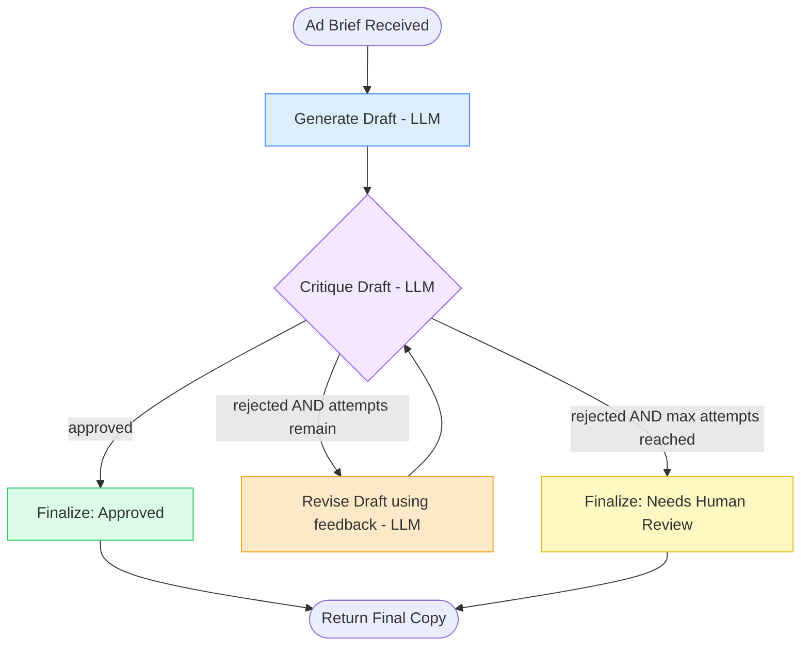

# 8. Iterative Workflow

## 8.1 What is it?

An **Iterative Workflow** repeats a **generate → check → improve** cycle
until the result is good enough, or a maximum number of attempts is reached.
Unlike earlier patterns where each node runs once, here a small group of
nodes can run **several times in a row**, each time producing something a
little better than before, using feedback from the check step.

This is the "draft, review, revise, review again" cycle a human writer goes
through — except here an LLM plays both the writer and the reviewer.

> **Note on naming:** Iterative Workflow (this pattern) is specifically about
> **refining one piece of output through repeated quality passes**. Pattern 9
> (Loop Workflow) is the more general "repeat a step until some condition is
> true" — e.g., processing a queue until it's empty. Iterative Workflow is a
> specialized, quality-driven version of that general idea.

## 8.2 What problem does it solve?

A single LLM call, even with a good prompt, doesn't always produce output
that meets every requirement on the first try — a marketing claim might be
too strong, a summary might run over the length limit, a piece of copy might
miss the brand's tone. Regenerating from scratch and hoping for the best
wastes effort; a human manually checking and re-prompting every time doesn't
scale.

The Iterative Workflow pattern solves this by:

- **Automating the review cycle** — a critique step checks the output
  against explicit criteria and gives specific, actionable feedback.
- **Feeding that feedback back in**, so each revision is a *targeted* fix,
  not a blind retry.
- **Capping the number of attempts** — an essential safety net, since without
  a limit, a stubborn piece of content that never quite passes could loop
  forever.
- Producing a system that behaves like a **careful human editor**, catching
  and fixing its own mistakes before anything reaches a person.

## 8.3 Realistic production example: Compliant Ad Copy Generator

A marketing tech company (`AdForge`) generates ad copy for clients, and every
piece of copy must pass **compliance rules** before it can go out: no
unqualified superlative claims ("the best," "guaranteed"), and a strict
character limit for the ad platform.

1. **Generate** — draft ad copy for a product based on a short brief.
2. **Critique** — an LLM compliance checker reviews the draft against the
   rules and returns either `approved` or `rejected` **with specific
   feedback** on what's wrong.
3. **Revise** — if rejected (and attempts remain), the draft is rewritten
   using that specific feedback, and sent back to Critique.
4. This **generate → critique → revise** cycle repeats until the draft is
   approved, or a maximum of **3 attempts** is reached — at which point the
   best available draft ships with a flag noting it didn't fully pass, so a
   human can take a final look.

## 8.4 Architecture / Flow Diagram


```mermaid
flowchart TD
    Start([Ad Brief Received]) --> Gen[Generate Draft - LLM]
    Gen --> Crit{Critique Draft - LLM}
    Crit -->|approved| Final[Finalize: Approved]
    Crit -->|rejected AND attempts remain| Rev[Revise Draft using feedback - LLM]
    Crit -->|rejected AND max attempts reached| Final2[Finalize: Needs Human Review]
    Rev --> Crit
    Final --> End([Return Final Copy])
    Final2 --> End

    style Gen fill:#DCEEFB,stroke:#3B82F6
    style Crit fill:#F3E8FF,stroke:#8B5CF6
    style Rev fill:#FDE9C8,stroke:#F59E0B
    style Final fill:#DCFCE7,stroke:#22C55E
    style Final2 fill:#FEF9C3,stroke:#EAB308
```

The arrow from `Rev` back up to `Crit` is what makes this iterative — the
graph has a genuine cycle, not just a straight line or a tree.

## 8.5 Request-to-response flow, step by step

1. A client sends a product brief to `run_ad_copy_generator()`.
2. LangGraph builds the initial `AdCopyState` (with `attempt_count = 0`) and
   enters at `generate_draft`.
3. **`generate_draft`** makes an LLM call to write the first version of the
   ad copy from the brief.
4. **`critique_draft`** makes a *separate* LLM call whose only job is to
   check the current draft against the compliance rules, returning
   `approved: true/false` and, if rejected, specific `feedback` text.
   `attempt_count` is incremented here.
5. A **conditional edge** on `critique_draft` checks three things in order:
   - If `approved` → go to `finalize_approved`.
   - Else, if `attempt_count < max_attempts` → go to `revise_draft`.
   - Else (rejected, and out of attempts) → go to `finalize_needs_review`.
6. **`revise_draft`** makes an LLM call that's given both the *current draft*
   and the *specific feedback* from the critique step, and produces an
   improved version — then execution flows **back to `critique_draft`**,
   closing the loop.
7. This cycle repeats — generate happens once, but critique/revise can
   repeat — until either an approval or the attempt cap ends the loop.
8. Whichever finalize node runs writes the final copy and a status into
   state, and the graph reaches `END`.

## 8.6 Why this pattern fits this problem

- Compliance issues are often **fixable with a small, targeted edit** — an
  iterative refine loop lets the system make that small fix instead of
  throwing away a mostly-good draft and starting over.
- **Specific feedback makes each revision better-targeted** than a blind
  retry — "remove the word 'guaranteed'" produces a more reliable fix than
  just asking the model to "try again."
- The **hard cap on attempts is non-negotiable** for a production system —
  it guarantees the workflow always terminates and returns *something*,
  even for a brief that's unusually hard to make compliant.
- Falling back to **"needs human review"** rather than silently shipping a
  non-compliant draft after the cap is reached keeps the system honest about
  its own limits.

## 8.7 Production-quality implementation

```python
"""
Iterative Workflow — Compliant Ad Copy Generator
Pattern: generate -> critique -> revise -> critique -> ... until approved
or a maximum attempt count is reached

Run:
    pip install "langgraph==1.2.10" "langchain==1.3.14" "langchain-ollama==1.1.0" "pydantic==2.9.2"
    ollama pull llama3.1:8b     # make sure Ollama is running locally
    python ad_copy_generator.py
"""

from __future__ import annotations

import json
import logging
from typing import Optional

from langchain_ollama import ChatOllama
from langgraph.graph import StateGraph, START, END
from pydantic import BaseModel

# --------------------------------------------------------------------------
# 1. Logging
# --------------------------------------------------------------------------
logging.basicConfig(
    level=logging.INFO,
    format="%(asctime)s | %(levelname)s | %(name)s | %(message)s",
)
logger = logging.getLogger("ad_copy_generator")


# --------------------------------------------------------------------------
# 2. Shared state
# --------------------------------------------------------------------------
class AdCopyState(BaseModel):
    brief: str = ""
    max_attempts: int = 3
    attempt_count: int = 0

    current_draft: Optional[str] = None
    approved: Optional[bool] = None
    feedback: Optional[str] = None

    final_copy: Optional[str] = None
    final_status: Optional[str] = None  # "approved" | "needs_human_review"


_llm = ChatOllama(model="llama3.1:8b", temperature=0.3)

_COMPLIANCE_RULES = (
    "1. No unqualified superlative claims (e.g. 'the best', 'guaranteed', "
    "'#1') unless immediately followed by a supporting fact.\n"
    "2. Must be 150 characters or fewer."
)


# --------------------------------------------------------------------------
# 3. Node — Generate Draft (runs once, at the start of the loop)
# --------------------------------------------------------------------------
_GENERATE_PROMPT = """Write a short ad for this product. Follow these rules:
{rules}

Product brief: {brief}

Respond with ONLY the ad copy text, nothing else.
"""


def generate_draft(state: AdCopyState) -> dict:
    logger.info("GENERATE — writing first draft")
    response = _llm.invoke(_GENERATE_PROMPT.format(rules=_COMPLIANCE_RULES, brief=state.brief))
    return {"current_draft": response.content.strip()}


# --------------------------------------------------------------------------
# 4. Node — Critique Draft (can run multiple times, once per loop pass)
# --------------------------------------------------------------------------
_CRITIQUE_PROMPT = """You are a strict compliance reviewer. Check this ad
copy against these rules:
{rules}

Ad copy: "{draft}"

Respond with ONLY a JSON object, no other text:
{{"approved": true or false, "feedback": "<specific issue and how to fix it, or empty string if approved>"}}
"""


def critique_draft(state: AdCopyState) -> dict:
    attempt = state.attempt_count + 1
    logger.info("CRITIQUE — pass %d/%d", attempt, state.max_attempts)

    try:
        response = _llm.invoke(
            _CRITIQUE_PROMPT.format(rules=_COMPLIANCE_RULES, draft=state.current_draft)
        )
        parsed = json.loads(response.content.strip())
        approved = bool(parsed.get("approved", False))
        feedback = parsed.get("feedback", "")
    except Exception as exc:  # noqa: BLE001
        logger.error("critique_draft failed to parse response, treating as rejected: %s", exc)
        approved = False
        feedback = "Automated review could not parse a clear result; please re-check manually."

    return {"approved": approved, "feedback": feedback, "attempt_count": attempt}


# --------------------------------------------------------------------------
# 5. Routing function — the loop's exit condition lives here.
#    Checks approval FIRST, then the attempt cap, in that order.
# --------------------------------------------------------------------------
def route_after_critique(state: AdCopyState) -> str:
    if state.approved:
        return "finalize_approved"
    elif state.attempt_count < state.max_attempts:
        return "revise_draft"
    else:
        return "finalize_needs_review"


# --------------------------------------------------------------------------
# 6. Node — Revise Draft (feeds back into critique_draft, closing the loop)
# --------------------------------------------------------------------------
_REVISE_PROMPT = """Revise this ad copy to fix the specific issue below.
Keep everything else that already works. Follow these rules:
{rules}

Current ad copy: "{draft}"
Issue to fix: {feedback}

Respond with ONLY the revised ad copy text, nothing else.
"""


def revise_draft(state: AdCopyState) -> dict:
    logger.info("REVISE — attempt %d, applying feedback: %s", state.attempt_count, state.feedback)
    response = _llm.invoke(
        _REVISE_PROMPT.format(rules=_COMPLIANCE_RULES, draft=state.current_draft, feedback=state.feedback)
    )
    return {"current_draft": response.content.strip()}


# --------------------------------------------------------------------------
# 7. Finalize — approved path
# --------------------------------------------------------------------------
def finalize_approved(state: AdCopyState) -> dict:
    logger.info("FINALIZE — approved after %d attempt(s)", state.attempt_count)
    return {"final_copy": state.current_draft, "final_status": "approved"}


# --------------------------------------------------------------------------
# 8. Finalize — attempt cap reached without approval
# --------------------------------------------------------------------------
def finalize_needs_review(state: AdCopyState) -> dict:
    logger.warning("FINALIZE — max attempts reached, flagging for human review")
    return {"final_copy": state.current_draft, "final_status": "needs_human_review"}


# --------------------------------------------------------------------------
# 9. Build the graph — the edge from revise_draft back to critique_draft
#    is what creates the loop.
# --------------------------------------------------------------------------
def build_graph():
    graph = StateGraph(AdCopyState)

    graph.add_node("generate_draft", generate_draft)
    graph.add_node("critique_draft", critique_draft)
    graph.add_node("revise_draft", revise_draft)
    graph.add_node("finalize_approved", finalize_approved)
    graph.add_node("finalize_needs_review", finalize_needs_review)

    graph.add_edge(START, "generate_draft")
    graph.add_edge("generate_draft", "critique_draft")

    graph.add_conditional_edges(
        "critique_draft",
        route_after_critique,
        {
            "finalize_approved": "finalize_approved",
            "revise_draft": "revise_draft",
            "finalize_needs_review": "finalize_needs_review",
        },
    )

    # This edge is what makes it a LOOP: revise_draft feeds back into
    # critique_draft instead of moving forward.
    graph.add_edge("revise_draft", "critique_draft")

    graph.add_edge("finalize_approved", END)
    graph.add_edge("finalize_needs_review", END)

    return graph.compile()


# --------------------------------------------------------------------------
# 10. Public entry point
# --------------------------------------------------------------------------
def run_ad_copy_generator(brief: str, max_attempts: int = 3) -> dict:
    app = build_graph()
    initial_state = AdCopyState(brief=brief, max_attempts=max_attempts)
    final_state = app.invoke(initial_state)
    return final_state


# --------------------------------------------------------------------------
# 11. Demo
# --------------------------------------------------------------------------
if __name__ == "__main__":
    result = run_ad_copy_generator(
        "A wireless noise-cancelling headphone with 40-hour battery life, launching at $199."
    )
    print(f"Status: {result['final_status']} (after {result['attempt_count']} attempt(s))")
    print(f"Final copy: {result['final_copy']}")
```

**Notes on production-readiness choices made above:**

- **`max_attempts` is a hard, non-negotiable cap** baked into the routing
  function — without it, a draft that a strict critic never fully approves
  would loop indefinitely. Any iterative/loop pattern in production needs an
  exit condition that's guaranteed to trigger eventually.
- **The critique step returns structured, specific feedback**, not just
  pass/fail — this is what makes each `revise_draft` call a targeted fix
  instead of a random retry, and it's parsed defensively (malformed JSON
  safely defaults to "rejected," never to a false approval).
- **Two distinct finalize paths** (`finalize_approved` vs.
  `finalize_needs_review`) — even when the loop "fails" (never gets
  approved), the system still returns a usable result along with an honest
  status flag, rather than raising an error or returning nothing.
- **`attempt_count` lives in shared state and is checked before revising** —
  this is the general shape for any bounded loop in LangGraph: track
  progress in state, check the bound in the routing function, not inside the
  loop body itself.

---

⬅ [7. Fan-Out / Fan-In](07-fan-out-fan-in.md) | [Back to index](README.md) | Next: [9. Loop Workflow](09-loop-workflow.md) ➡

# Compliant Ad Copy Generator — Iterative Workflow (Java + Spring AI)

A Java port of the LangGraph iterative workflow — `generate -> critique -> revise -> critique ->
...` until approved or a max attempt count is hit. Built on:

- **Java 25** (current LTS)
- **Spring Boot 4.1.0**
- **Spring AI 2.0.0** (GA) with the **Ollama** starter, mirroring `llama3.1:8b`

## Mapping the shape

This is the one workflow in the series where the LangGraph *graph* shape genuinely encodes
something a straight-line Java translation has to be deliberate about: `revise_draft` has an edge
back to `critique_draft`, which is what makes it a loop rather than a chain. In Java, a
loop-with-an-exit-condition is exactly what a `while` loop is for — there's no need for a graph
object to express "go back to step 2" the way there's no need for one to express "run these three
things in parallel." The important thing to carry over faithfully is the **exit condition
order** (check approval first, then the attempt cap) and the **critique's structured output**.

| LangGraph concept | Spring / Java equivalent |
|---|---|
| `generate_draft` (runs once, before the loop) | `AdCopyGenerationService.generate(...)` called once before the loop |
| `critique_draft` (runs once per loop pass) | `DraftCritiqueStep.critique(...)` called at the top of each loop iteration |
| `json.loads(response.content)` + manual parsing | `.call().entity(CritiqueResult.class)` structured output |
| `route_after_critique` (approved? then cap? else loop) | `while` loop condition, checked in the same order |
| `revise_draft` edge back to `critique_draft` | The `while` loop's back-edge, i.e. just looping |
| `finalize_approved` / `finalize_needs_review` | Two `AdCopyResult` construction sites after the loop exits |

---

## Project structure

```
ad-copy-generator/
├── pom.xml
└── src/main/java/com/example/adcopygenerator/
    ├── AdCopyGeneratorApplication.java
    ├── model/
    │   ├── AdCopyResult.java
    │   └── CritiqueResult.java
    ├── pipeline/
    │   ├── ComplianceRules.java
    │   ├── DraftGenerationStep.java
    │   ├── DraftCritiqueStep.java
    │   ├── DraftRevisionStep.java
    │   └── AdCopyGenerationService.java
    ├── web/
    │   └── AdCopyGeneratorController.java
    └── AdCopyGeneratorRunner.java   (CLI demo, mirrors the Python __main__ block)
└── src/main/resources/
    └── application.yml
```

---

## `pom.xml`

```xml
<?xml version="1.0" encoding="UTF-8"?>
<project xmlns="http://maven.apache.org/POM/4.0.0"
         xmlns:xsi="http://www.w3.org/2001/XMLSchema-instance"
         xsi:schemaLocation="http://maven.apache.org/POM/4.0.0 https://maven.apache.org/xsd/maven-4.0.0.xsd">
    <modelVersion>4.0.0</modelVersion>

    <groupId>com.example</groupId>
    <artifactId>ad-copy-generator</artifactId>
    <version>1.0.0</version>
    <packaging>jar</packaging>

    <properties>
        <java.version>25</java.version>
        <spring-ai.version>2.0.0</spring-ai.version>
    </properties>

    <parent>
        <groupId>org.springframework.boot</groupId>
        <artifactId>spring-boot-starter-parent</artifactId>
        <version>4.1.0</version>
        <relativePath/>
    </parent>

    <dependencyManagement>
        <dependencies>
            <dependency>
                <groupId>org.springframework.ai</groupId>
                <artifactId>spring-ai-bom</artifactId>
                <version>${spring-ai.version}</version>
                <type>pom</type>
                <scope>import</scope>
            </dependency>
        </dependencies>
    </dependencyManagement>

    <dependencies>
        <dependency>
            <groupId>org.springframework.boot</groupId>
            <artifactId>spring-boot-starter-web</artifactId>
        </dependency>
        <!-- Ollama model starter — local llama3.1:8b, same as langchain-ollama -->
        <dependency>
            <groupId>org.springframework.ai</groupId>
            <artifactId>spring-ai-starter-model-ollama</artifactId>
        </dependency>
        <dependency>
            <groupId>org.springframework.boot</groupId>
            <artifactId>spring-boot-starter-test</artifactId>
            <scope>test</scope>
        </dependency>
    </dependencies>

    <build>
        <plugins>
            <plugin>
                <groupId>org.springframework.boot</groupId>
                <artifactId>spring-boot-maven-plugin</artifactId>
            </plugin>
        </plugins>
    </build>
</project>
```

## `src/main/resources/application.yml`

```yaml
spring:
  application:
    name: ad-copy-generator
  ai:
    ollama:
      base-url: http://localhost:11434
      chat:
        options:
          model: llama3.1:8b
          temperature: 0.3

logging:
  level:
    com.example.adcopygenerator: INFO
```

---

## Domain model

### `model/CritiqueResult.java`

Structured output target for the critique call — replaces the manual `json.loads` + `try/except`
block entirely.

```java
package com.example.adcopygenerator.model;

import com.fasterxml.jackson.annotation.JsonClassDescription;
import com.fasterxml.jackson.annotation.JsonPropertyDescription;

@JsonClassDescription("Compliance review verdict for a piece of ad copy")
public record CritiqueResult(
        @JsonPropertyDescription("true if the ad copy passes all compliance rules")
        boolean approved,
        @JsonPropertyDescription("Specific issue and how to fix it, or empty string if approved")
        String feedback
) {}
```

### `model/AdCopyResult.java`

```java
package com.example.adcopygenerator.model;

public record AdCopyResult(String finalCopy, String finalStatus, int attemptCount) {}
```

There's no `AdCopyState` record carrying every intermediate field the way the sequential and
branching ports needed one — the loop's local variables (`draft`, `attemptCount`) live directly
in `AdCopyGenerationService.generate`, since nothing outside that one method ever needs to
observe them mid-loop. This is the natural Java shape for "a loop with local state," where the
Python version needs an explicit state object because LangGraph re-invokes each node as a
separate function call.

---

## Steps

### `pipeline/ComplianceRules.java`

```java
package com.example.adcopygenerator.pipeline;

public final class ComplianceRules {

    public static final String TEXT = """
            1. No unqualified superlative claims (e.g. 'the best', 'guaranteed', \
            '#1') unless immediately followed by a supporting fact.
            2. Must be 150 characters or fewer.""";

    private ComplianceRules() {
    }
}
```

### `pipeline/DraftGenerationStep.java`

Runs once, before the loop — the direct analogue of `generate_draft`.

```java
package com.example.adcopygenerator.pipeline;

import org.slf4j.Logger;
import org.slf4j.LoggerFactory;
import org.springframework.ai.chat.client.ChatClient;
import org.springframework.stereotype.Component;

@Component
public class DraftGenerationStep {

    private static final Logger log = LoggerFactory.getLogger(DraftGenerationStep.class);

    private static final String GENERATE_PROMPT = """
            Write a short ad for this product. Follow these rules:
            {rules}

            Product brief: {brief}

            Respond with ONLY the ad copy text, nothing else.
            """;

    private final ChatClient chatClient;

    public DraftGenerationStep(ChatClient.Builder chatClientBuilder) {
        this.chatClient = chatClientBuilder.build();
    }

    public String generate(String brief) {
        log.info("GENERATE - writing first draft");
        return chatClient.prompt()
                .user(u -> u.text(GENERATE_PROMPT).param("rules", ComplianceRules.TEXT).param("brief", brief))
                .call()
                .content()
                .strip();
    }
}
```

### `pipeline/DraftCritiqueStep.java`

Runs once per loop pass — the direct analogue of `critique_draft`, but with structured output
instead of manual JSON parsing.

```java
package com.example.adcopygenerator.pipeline;

import com.example.adcopygenerator.model.CritiqueResult;
import org.slf4j.Logger;
import org.slf4j.LoggerFactory;
import org.springframework.ai.chat.client.ChatClient;
import org.springframework.stereotype.Component;

@Component
public class DraftCritiqueStep {

    private static final Logger log = LoggerFactory.getLogger(DraftCritiqueStep.class);

    private static final String CRITIQUE_PROMPT = """
            You are a strict compliance reviewer. Check this ad copy against these rules:
            {rules}

            Ad copy: "{draft}"
            """;

    private final ChatClient chatClient;

    public DraftCritiqueStep(ChatClient.Builder chatClientBuilder) {
        this.chatClient = chatClientBuilder.build();
    }

    public CritiqueResult critique(String draft, int attempt, int maxAttempts) {
        log.info("CRITIQUE - pass {}/{}", attempt, maxAttempts);
        try {
            return chatClient.prompt()
                    .user(u -> u.text(CRITIQUE_PROMPT).param("rules", ComplianceRules.TEXT).param("draft", draft))
                    .call()
                    .entity(CritiqueResult.class);
        } catch (Exception e) {
            log.error("critique_draft failed to parse response, treating as rejected: {}", e.getMessage());
            return new CritiqueResult(false,
                    "Automated review could not parse a clear result; please re-check manually.");
        }
    }
}
```

### `pipeline/DraftRevisionStep.java`

Feeds back into another critique pass — the direct analogue of `revise_draft`.

```java
package com.example.adcopygenerator.pipeline;

import org.slf4j.Logger;
import org.slf4j.LoggerFactory;
import org.springframework.ai.chat.client.ChatClient;
import org.springframework.stereotype.Component;

@Component
public class DraftRevisionStep {

    private static final Logger log = LoggerFactory.getLogger(DraftRevisionStep.class);

    private static final String REVISE_PROMPT = """
            Revise this ad copy to fix the specific issue below. Keep everything \
            else that already works. Follow these rules:
            {rules}

            Current ad copy: "{draft}"
            Issue to fix: {feedback}

            Respond with ONLY the revised ad copy text, nothing else.
            """;

    private final ChatClient chatClient;

    public DraftRevisionStep(ChatClient.Builder chatClientBuilder) {
        this.chatClient = chatClientBuilder.build();
    }

    public String revise(String draft, String feedback, int attemptCount) {
        log.info("REVISE - attempt {}, applying feedback: {}", attemptCount, feedback);
        return chatClient.prompt()
                .user(u -> u.text(REVISE_PROMPT)
                        .param("rules", ComplianceRules.TEXT)
                        .param("draft", draft)
                        .param("feedback", feedback))
                .call()
                .content()
                .strip();
    }
}
```

---

## The loop

### `pipeline/AdCopyGenerationService.java`

The `while` loop is the direct analogue of the `revise_draft -> critique_draft` back-edge; the
loop condition preserves the Python router's exact check order — approval first, then the
attempt cap.

```java
package com.example.adcopygenerator.pipeline;

import com.example.adcopygenerator.model.AdCopyResult;
import com.example.adcopygenerator.model.CritiqueResult;
import org.slf4j.Logger;
import org.slf4j.LoggerFactory;
import org.springframework.stereotype.Service;

@Service
public class AdCopyGenerationService {

    private static final Logger log = LoggerFactory.getLogger(AdCopyGenerationService.class);

    private final DraftGenerationStep draftGenerationStep;
    private final DraftCritiqueStep draftCritiqueStep;
    private final DraftRevisionStep draftRevisionStep;

    public AdCopyGenerationService(DraftGenerationStep draftGenerationStep,
                                   DraftCritiqueStep draftCritiqueStep,
                                   DraftRevisionStep draftRevisionStep) {
        this.draftGenerationStep = draftGenerationStep;
        this.draftCritiqueStep = draftCritiqueStep;
        this.draftRevisionStep = draftRevisionStep;
    }

    public AdCopyResult generate(String brief, int maxAttempts) {
        String draft = draftGenerationStep.generate(brief);

        int attemptCount = 0;
        CritiqueResult critique;

        while (true) {
            attemptCount++;
            critique = draftCritiqueStep.critique(draft, attemptCount, maxAttempts);

            // route_after_critique, in the same order: approved first, then the attempt cap.
            if (critique.approved()) {
                log.info("FINALIZE - approved after {} attempt(s)", attemptCount);
                return new AdCopyResult(draft, "approved", attemptCount);
            }

            if (attemptCount >= maxAttempts) {
                log.warn("FINALIZE - max attempts reached, flagging for human review");
                return new AdCopyResult(draft, "needs_human_review", attemptCount);
            }

            draft = draftRevisionStep.revise(draft, critique.feedback(), attemptCount);
        }
    }
}
```

---

## Entry points

### `web/AdCopyGeneratorController.java`

```java
package com.example.adcopygenerator.web;

import com.example.adcopygenerator.model.AdCopyResult;
import com.example.adcopygenerator.pipeline.AdCopyGenerationService;
import org.springframework.web.bind.annotation.PostMapping;
import org.springframework.web.bind.annotation.RequestBody;
import org.springframework.web.bind.annotation.RestController;

@RestController
public class AdCopyGeneratorController {

    private final AdCopyGenerationService adCopyGenerationService;

    public AdCopyGeneratorController(AdCopyGenerationService adCopyGenerationService) {
        this.adCopyGenerationService = adCopyGenerationService;
    }

    public record GenerateRequest(String brief, Integer maxAttempts) {}

    @PostMapping("/api/ad-copy")
    public AdCopyResult generate(@RequestBody GenerateRequest request) {
        int maxAttempts = request.maxAttempts() != null ? request.maxAttempts() : 3;
        return adCopyGenerationService.generate(request.brief(), maxAttempts);
    }
}
```

### `AdCopyGeneratorRunner.java` (CLI demo, mirrors the Python `if __name__ == "__main__"` block)

```java
package com.example.adcopygenerator;

import com.example.adcopygenerator.pipeline.AdCopyGenerationService;
import org.springframework.boot.CommandLineRunner;
import org.springframework.context.annotation.Profile;
import org.springframework.stereotype.Component;

@Component
@Profile("demo")
public class AdCopyGeneratorRunner implements CommandLineRunner {

    private final AdCopyGenerationService adCopyGenerationService;

    public AdCopyGeneratorRunner(AdCopyGenerationService adCopyGenerationService) {
        this.adCopyGenerationService = adCopyGenerationService;
    }

    @Override
    public void run(String... args) {
        var result = adCopyGenerationService.generate(
                "A wireless noise-cancelling headphone with 40-hour battery life, launching at $199.",
                3);

        System.out.printf("Status: %s (after %d attempt(s))%n", result.finalStatus(), result.attemptCount());
        System.out.println("Final copy: " + result.finalCopy());
    }
}
```

### `AdCopyGeneratorApplication.java`

```java
package com.example.adcopygenerator;

import org.springframework.boot.SpringApplication;
import org.springframework.boot.autoconfigure.SpringBootApplication;

@SpringBootApplication
public class AdCopyGeneratorApplication {
    public static void main(String[] args) {
        SpringApplication.run(AdCopyGeneratorApplication.class, args);
    }
}
```

---

## Running it

```bash
ollama pull llama3.1:8b
ollama serve   # if not already running

# CLI demo (prints status + final copy, like the Python script)
mvn spring-boot:run -Dspring-boot.run.profiles=demo

# Or as a service
mvn spring-boot:run
curl -X POST localhost:8080/api/ad-copy \
  -H "Content-Type: application/json" \
  -d '{"brief":"A wireless noise-cancelling headphone with 40-hour battery life, launching at $199.","maxAttempts":3}'
```

## Notes on the port

- **Graph loop → `while` loop**: the `revise_draft -> critique_draft` back-edge is what makes the
  Python graph a loop instead of a chain; in Java, that's just... a loop. No graph object is
  needed to express "go back and try again," the same way none was needed for "run these three
  things in parallel" in the earlier fan-out ports.
- **Exit-condition order preserved exactly**: `route_after_critique` checks `approved` before the
  attempt cap, and the `while` loop here does the same — checking the cap first would change
  behavior on the last allowed attempt (an approval on attempt `maxAttempts` would incorrectly
  fall through to `needs_human_review` instead of `approved`).
- **Structured critique output**: `.call().entity(CritiqueResult.class)` replaces the manual
  `json.loads(response.content)` + `try/except`, with the same fallback behavior on failure —
  treat an unparsable critique as rejected, with an explanatory feedback string, so the loop still
  makes progress (or correctly exhausts its attempts) rather than crashing.
- **No `AdCopyState` god-object**: because the loop lives in one method rather than being replayed
  node-by-node by a graph engine, `draft` and `attemptCount` are just local variables — there's
  nothing to gain from wrapping them in a record the way `LoanState` or `TicketState` needed to be
  in the earlier ports, where each "node" was a separate call that only communicated through
  shared state.
- **Versions**: same Ollama-backed `spring-ai-starter-model-ollama` / `llama3.1:8b` setup as the
  other ports in this series.
