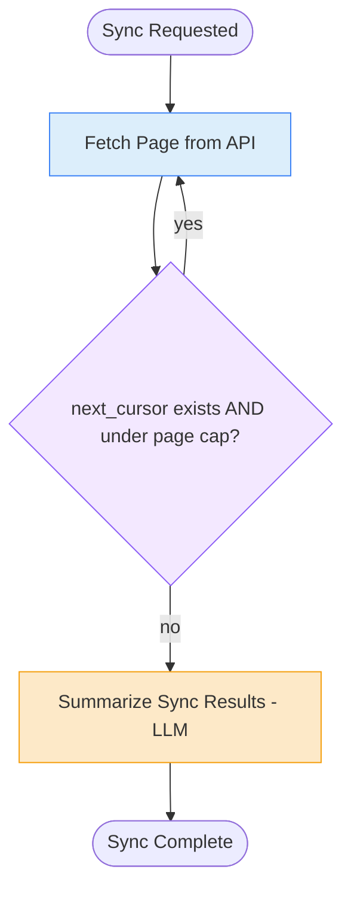

# 9. Loop Workflow

## 9.1 What is it?

A **Loop Workflow** repeats a step **until some condition becomes true** —
the general-purpose version of "keep going while there's more to do." Unlike
Pattern 8 (Iterative Workflow), there's no quality judgment involved here;
the loop simply continues because there's *more data to process*, and stops
when there genuinely isn't any more.

> **Note on naming, continued from Pattern 8:** Iterative Workflow repeats a
> **generate → critique → revise** cycle to improve *one* piece of content.
> Loop Workflow repeats a step to work through **a stream or sequence of
> external data** (like pages of an API) whose length isn't known in advance
> — closer to a `while` loop in ordinary programming than to an editing
> cycle.

## 9.2 What problem does it solve?

Some data sources don't hand you everything at once. A third-party API might
return results one "page" at a time, only telling you if there's a next page
*after* you've fetched the current one. You can't know in advance how many
pages there will be — Map-Reduce (Pattern 6) doesn't apply here because that
pattern needs the full list of items *up front* to fan out across; a Loop
Workflow instead discovers the next piece of work only as a result of doing
the current one.

The Loop Workflow pattern solves this by:

- Letting the graph **repeat a single node** for as many rounds as the data
  actually requires, instead of needing to know the count ahead of time.
- Keeping the **exit condition explicit and checked every round** — usually
  "is there a next page/cursor?" — so the loop naturally winds down instead
  of needing to be told when to stop.
- Adding a **safety cap** as a backstop in case an external system
  misbehaves (e.g., an API that never returns a null "next page" and would
  otherwise loop forever).
- Keeping the **per-round logic simple** — each pass just processes one
  page/item and decides whether to continue.

## 9.3 Realistic production example: Paginated Transaction Sync

A fintech reporting tool (`LedgerSync`) needs to pull **all** of a merchant's
transactions from a payment processor's API for the current billing period.
The API is paginated: each call returns up to 100 transactions **plus** a
`next_cursor` value — `None` once there's nothing left to fetch.

1. **Fetch Page** — call the API with the current cursor, get back a batch of
   transactions and the next cursor (or `None`).
2. **Accumulate** — add this batch to the running total collected so far.
3. **Check condition** — if `next_cursor` is not `None` **and** we're under a
   safety cap of pages, loop back to Fetch Page with the new cursor.
   Otherwise, stop looping.
4. **Summarize** — once the loop ends, produce a short summary of what was
   synced (total transaction count, total amount, page count).

## 9.4 Architecture / Flow Diagram



The self-loop on `Fetch` is the whole pattern in one picture: the same node
runs again and again until the condition attached to it finally says "stop."

## 9.5 Request-to-response flow, step by step

1. A client sends a `merchant_id` to `run_transaction_sync()`.
2. LangGraph builds the initial `SyncState` (with `cursor = None`,
   `page_count = 0`, `all_transactions = []`) and enters at `fetch_page`.
3. **`fetch_page`** calls the (simulated) paginated API using the current
   cursor. It appends the returned transactions onto
   `all_transactions`, updates `cursor` to whatever the API returned next
   (or `None`), and increments `page_count`.
4. A **conditional edge** on `fetch_page` calls `should_continue(state)`,
   which returns `"fetch_page"` again if `cursor is not None` **and**
   `page_count < max_pages`, or `"summarize_sync"` otherwise.
5. As long as the condition says "continue," LangGraph runs `fetch_page`
   again — same node, next cursor, one more page collected. This can happen
   any number of times depending on how much data the merchant actually has.
6. Once the API reports no more pages (`cursor is None`) — or, as a safety
   backstop, the page cap is hit — the loop exits and `summarize_sync` runs
   exactly once.
7. **`summarize_sync`** computes totals from the fully collected
   `all_transactions` list and asks the LLM to phrase a short, readable
   summary sentence.
8. The graph reaches `END` and returns the full result.

## 9.6 Why this pattern fits this problem

- The **total number of pages is only knowable by fetching them** — there's
  no way to "fan out" up front like Map-Reduce does, because page 2's cursor
  only exists after page 1 has actually been fetched.
- A **self-loop on one node** is the simplest possible way to express "keep
  doing this until told to stop" — no separate node is needed per page.
- The **page cap is a critical safety net**: real third-party APIs sometimes
  have bugs (an infinite pagination loop is a real, if rare, failure mode),
  and a production sync job should never be able to run forever because of
  someone else's bug.
- Accumulating into a **single running list in state** means the summarize
  step, at the end, has the complete picture without needing any extra
  merging logic — it's just one list that grew a little each round.

## 9.7 Production-quality implementation

```python
"""
Loop Workflow — Paginated Transaction Sync
Pattern: repeat one node (self-loop) until an external condition says stop,
with a safety cap as a backstop

Run:
    pip install "langgraph==1.2.10" "langchain==1.3.14" "langchain-ollama==1.1.0" "pydantic==2.9.2"
    ollama pull llama3.1:8b     # make sure Ollama is running locally
    python transaction_sync.py
"""

from __future__ import annotations

import logging
from typing import Optional

from langchain_ollama import ChatOllama
from langgraph.graph import StateGraph, START, END
from pydantic import BaseModel

# --------------------------------------------------------------------------
# 1. Logging
# --------------------------------------------------------------------------
logging.basicConfig(
    level=logging.INFO,
    format="%(asctime)s | %(levelname)s | %(name)s | %(message)s",
)
logger = logging.getLogger("transaction_sync")


# --------------------------------------------------------------------------
# 2. Shared state
# --------------------------------------------------------------------------
class SyncState(BaseModel):
    merchant_id: str = ""
    max_pages: int = 20  # safety cap -- never loop more than this many times

    cursor: Optional[str] = None
    page_count: int = 0
    all_transactions: list[dict] = []

    summary: Optional[str] = None


_llm = ChatOllama(model="llama3.1:8b", temperature=0)


# --------------------------------------------------------------------------
# 3. Simulated paginated API.
#    In production this would be a real HTTP call to the payment processor.
#    Returns up to 3 fake transactions per page and a next_cursor, going
#    None after page 4 to represent "no more data."
# --------------------------------------------------------------------------
def _call_paginated_api(merchant_id: str, cursor: Optional[str]) -> tuple[list[dict], Optional[str]]:
    page_number = int(cursor) if cursor else 1
    if page_number > 4:
        return [], None  # no more pages

    transactions = [
        {"id": f"{merchant_id}-txn-{page_number}-{i}", "amount": 10.0 * page_number + i}
        for i in range(3)
    ]
    next_cursor = str(page_number + 1) if page_number < 4 else None
    return transactions, next_cursor


# --------------------------------------------------------------------------
# 4. Node — Fetch Page (this is the node that loops).
#    Each call handles exactly ONE page, then updates the cursor and count
#    that the routing function will check.
# --------------------------------------------------------------------------
def fetch_page(state: SyncState) -> dict:
    logger.info("LOOP — fetching page %d (cursor=%s)", state.page_count + 1, state.cursor)

    try:
        transactions, next_cursor = _call_paginated_api(state.merchant_id, state.cursor)
    except Exception as exc:  # noqa: BLE001
        logger.error("Page fetch failed, stopping loop here: %s", exc)
        # On a real API error, stop looping rather than retrying forever;
        # a dedicated Retry Pattern (covered later) would add bounded
        # retries around just this call.
        return {"cursor": None, "page_count": state.page_count + 1}

    return {
        "all_transactions": state.all_transactions + transactions,
        "cursor": next_cursor,
        "page_count": state.page_count + 1,
    }


# --------------------------------------------------------------------------
# 5. Routing function — the loop's exit condition.
#    Continues only while there's a next cursor AND we're under the cap.
# --------------------------------------------------------------------------
def should_continue(state: SyncState) -> str:
    if state.cursor is not None and state.page_count < state.max_pages:
        return "fetch_page"
    if state.page_count >= state.max_pages and state.cursor is not None:
        logger.warning(
            "Safety cap of %d pages reached with more data remaining -- stopping early",
            state.max_pages,
        )
    return "summarize_sync"


# --------------------------------------------------------------------------
# 6. Node — Summarize (runs exactly once, after the loop ends)
# --------------------------------------------------------------------------
_SUMMARY_PROMPT = """Write one short sentence summarizing this data sync for
an operations dashboard.

Merchant: {merchant_id}
Pages fetched: {page_count}
Total transactions: {txn_count}
Total amount: ${total_amount:,.2f}
"""


def summarize_sync(state: SyncState) -> dict:
    logger.info(
        "LOOP COMPLETE — %d pages, %d transactions", state.page_count, len(state.all_transactions)
    )
    total_amount = sum(t["amount"] for t in state.all_transactions)

    try:
        response = _llm.invoke(
            _SUMMARY_PROMPT.format(
                merchant_id=state.merchant_id,
                page_count=state.page_count,
                txn_count=len(state.all_transactions),
                total_amount=total_amount,
            )
        )
        summary = response.content.strip()
    except Exception as exc:  # noqa: BLE001
        logger.error("summarize_sync LLM call failed: %s", exc)
        summary = (
            f"Synced {len(state.all_transactions)} transactions "
            f"(${total_amount:,.2f}) across {state.page_count} pages."
        )

    return {"summary": summary}


# --------------------------------------------------------------------------
# 7. Build the graph — a self-loop on fetch_page, exited by should_continue.
# --------------------------------------------------------------------------
def build_graph():
    graph = StateGraph(SyncState)

    graph.add_node("fetch_page", fetch_page)
    graph.add_node("summarize_sync", summarize_sync)

    graph.add_edge(START, "fetch_page")

    # This is the loop: fetch_page's own conditional edge can route back
    # to itself.
    graph.add_conditional_edges(
        "fetch_page",
        should_continue,
        {
            "fetch_page": "fetch_page",
            "summarize_sync": "summarize_sync",
        },
    )

    graph.add_edge("summarize_sync", END)

    return graph.compile()


# --------------------------------------------------------------------------
# 8. Public entry point
# --------------------------------------------------------------------------
def run_transaction_sync(merchant_id: str, max_pages: int = 20) -> dict:
    app = build_graph()
    initial_state = SyncState(merchant_id=merchant_id, max_pages=max_pages)
    final_state = app.invoke(initial_state)
    return final_state


# --------------------------------------------------------------------------
# 9. Demo
# --------------------------------------------------------------------------
if __name__ == "__main__":
    result = run_transaction_sync("MERCHANT-882")
    print(f"Pages fetched: {result['page_count']}")
    print(f"Transactions collected: {len(result['all_transactions'])}")
    print(f"Summary: {result['summary']}")
```

**Notes on production-readiness choices made above:**

- **The exit condition checks two things, in order** — the *real* signal
  (`cursor is not None`) and the *safety backstop* (`page_count < max_pages`)
  — and logs a warning specifically when the cap cuts off a sync that still
  had more data, so this doesn't fail silently in production.
- **A single node loops on itself** via `add_conditional_edges` pointing back
  to its own name — the simplest possible shape for "repeat until done,"
  with no need for a separate "loop controller" node.
- **The API call is wrapped in `try/except`**, and a failure **stops the
  loop** (sets `cursor = None`) rather than retrying indefinitely or
  crashing — with a note pointing at the dedicated Retry Pattern (coming up
  next in this series) for how to handle transient failures more
  gracefully than "give up after one failed page."
- **State accumulates the full list across every round**
  (`state.all_transactions + transactions`), so by the time `summarize_sync`
  runs, it already has the complete picture with no extra merge step needed.

---

⬅ [8. Iterative Workflow](08-iterative-workflow.md) | [Back to index](README.md) | Next: [10. Retry Pattern](10-retry-pattern.md) ➡
