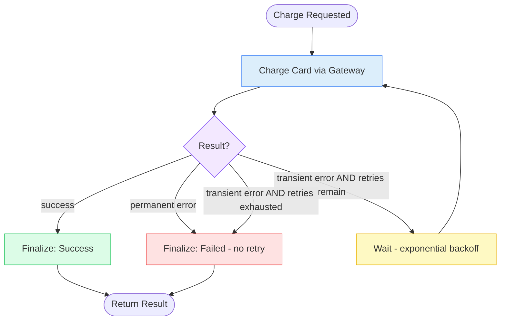

# 10. Retry Pattern

## 10.1 What is it?

The **Retry Pattern** automatically re-attempts an operation that failed —
but only when the failure looks **temporary** (a network blip, a
momentarily overloaded server), and with a **growing delay between
attempts** (exponential backoff), up to a hard maximum number of tries.

This is different from Pattern 9 (Loop Workflow): a loop repeats because
there's more *new* work to do (the next page). A retry repeats the **exact
same** operation because it failed and might succeed if tried again — the
input doesn't change between attempts, only time passes.

## 10.2 What problem does it solve?

Calls to external systems — payment gateways, third-party APIs, databases —
fail sometimes for reasons that have nothing to do with whether the request
itself was valid: a brief network hiccup, a server that's momentarily
overloaded, a request that timed out by half a second. Treating every one of
these as a permanent failure wastes perfectly good requests. But retrying
*everything* blindly is dangerous too — retrying a "card declined" charge
five times doesn't help anyone and can even cause duplicate-charge problems.

The Retry Pattern solves this by:

- **Distinguishing retryable from non-retryable failures** — only failures
  that are genuinely likely to succeed on a second try get retried.
- Using **exponential backoff** (wait longer between each successive retry)
  so a struggling downstream service gets breathing room instead of being
  hammered with immediate repeat requests.
- Enforcing a **hard maximum retry count**, so a genuinely broken dependency
  fails cleanly instead of retrying forever.
- Keeping the **calling code simple** — the caller just asks to "charge the
  card"; the retry logic around transient failures is handled once, in one
  place, instead of being re-implemented at every call site.

## 10.3 Realistic production example: Resilient Payment Charge

An online checkout system (`SwiftCart`) charges a customer's card through a
payment gateway that occasionally has brief outages. Two very different
kinds of failure can come back from that gateway:

- **Transient errors** (e.g., gateway timeout, 503 service unavailable) —
  the request may well succeed if tried again in a moment. **Should retry.**
- **Permanent errors** (e.g., card declined, invalid card number) — trying
  again with the exact same card details will just fail the exact same way
  every time. **Should never retry** — the customer needs a different card,
  not a repeated attempt.

The charge flow retries only the first kind, using exponential backoff
(waiting longer after each failed attempt), up to 3 total attempts.

## 10.4 Architecture / Flow Diagram



The loop only exists on the **transient error, retries remain** path — a
permanent error exits immediately, no matter how many retries are left.
That's the key structural difference from a plain Loop Workflow.

## 10.5 Request-to-response flow, step by step

1. A client sends charge details to `run_charge_with_retry()`.
2. LangGraph builds the initial `ChargeState` (`retry_count = 0`) and enters
   at `charge_card`.
3. **`charge_card`** calls the (simulated) payment gateway inside a
   `try/except` block that catches **two distinct exception types**:
   `TransientGatewayError` and `CardDeclinedError` (a permanent error). On
   success, it records the result and stops. On failure, it records *which
   kind* of error occurred.
4. A **conditional edge** (`route_after_charge`) checks, in order:
   - Success → `finalize_success`.
   - Permanent error → `finalize_failed` **immediately**, regardless of
     `retry_count`.
   - Transient error, and `retry_count < max_retries` → `wait_before_retry`.
   - Transient error, retries exhausted → `finalize_failed`.
5. **`wait_before_retry`** computes an exponential backoff delay
   (`base_delay * 2^retry_count`, e.g., 1s, 2s, 4s), sleeps for that long,
   increments `retry_count`, and flows back to `charge_card` — this is the
   loop.
6. This repeats until success, a permanent error, or the retry cap is hit.
7. Whichever finalize node runs writes the final outcome and a
   customer-facing message; the graph reaches `END`.

## 10.6 Why this pattern fits this problem

- **Not all failures deserve a retry** — retrying a declined card wastes
  time and can confuse the customer with a delayed duplicate-looking
  attempt; the pattern's explicit split between transient and permanent
  errors is the whole point.
- **Exponential backoff is considerate of the downstream service** — an
  overloaded payment gateway recovering from a brief spike benefits from
  requests spacing out, rather than every failed checkout retrying instantly
  and adding to the load.
- **A hard retry cap keeps checkout responsive** — a customer shouldn't be
  stuck waiting through unlimited retries; after 3 attempts, failing clearly
  and quickly is better than an indefinite hang.
- **Centralizing this logic in one place** means every part of SwiftCart
  that charges a card gets consistent, correct retry behavior automatically,
  instead of every call site needing to reimplement it (and likely getting
  it slightly wrong somewhere).

## 10.7 Production-quality implementation

```python
"""
Retry Pattern — Resilient Payment Charge
Pattern: retry ONLY transient failures, with exponential backoff, up to a
hard maximum -- permanent failures exit immediately without retrying

Run:
    pip install "langgraph==1.2.10" "langchain==1.3.14" "langchain-ollama==1.1.0" "pydantic==2.9.2"
    ollama pull llama3.1:8b     # make sure Ollama is running locally
    python payment_retry.py
"""

from __future__ import annotations

import asyncio
import logging
from typing import Optional

from langchain_ollama import ChatOllama
from langgraph.graph import StateGraph, START, END
from pydantic import BaseModel

# --------------------------------------------------------------------------
# 1. Logging
# --------------------------------------------------------------------------
logging.basicConfig(
    level=logging.INFO,
    format="%(asctime)s | %(levelname)s | %(name)s | %(message)s",
)
logger = logging.getLogger("payment_retry")


# --------------------------------------------------------------------------
# 2. Custom exceptions -- the split between these two types IS the pattern.
# --------------------------------------------------------------------------
class TransientGatewayError(Exception):
    """Likely to succeed if retried (timeout, 503, brief outage)."""


class CardDeclinedError(Exception):
    """Will never succeed by retrying the same request (bad card, declined)."""


# --------------------------------------------------------------------------
# 3. Shared state
# --------------------------------------------------------------------------
class ChargeState(BaseModel):
    order_id: str = ""
    card_last4: str = ""
    amount: float = 0.0

    max_retries: int = 3
    retry_count: int = 0
    base_delay_seconds: float = 1.0

    outcome: Optional[str] = None  # "success" | "transient_error" | "permanent_error"
    error_message: Optional[str] = None
    charge_id: Optional[str] = None

    final_status: Optional[str] = None  # "success" | "failed"
    customer_message: Optional[str] = None


_llm = ChatOllama(model="llama3.1:8b", temperature=0.2)


# --------------------------------------------------------------------------
# 4. Simulated payment gateway.
#    In production this would be a real HTTP call to Stripe/Adyen/etc.
#    For this demo: fails with a transient error on the first 2 attempts,
#    then succeeds on the 3rd -- to demonstrate a retry that pays off.
# --------------------------------------------------------------------------
def _call_payment_gateway(order_id: str, amount: float, attempt_number: int) -> str:
    if attempt_number < 3:
        raise TransientGatewayError(f"Gateway timeout on attempt {attempt_number}")
    return f"CHG-{order_id}-{attempt_number}"


# --------------------------------------------------------------------------
# 5. Node — Charge Card (this is the node that gets retried)
# --------------------------------------------------------------------------
def charge_card(state: ChargeState) -> dict:
    attempt_number = state.retry_count + 1
    logger.info("CHARGE — attempt %d/%d for order %s", attempt_number, state.max_retries, state.order_id)

    try:
        charge_id = _call_payment_gateway(state.order_id, state.amount, attempt_number)
        return {"outcome": "success", "charge_id": charge_id, "error_message": None}

    except CardDeclinedError as exc:
        logger.warning("PERMANENT error, will not retry: %s", exc)
        return {"outcome": "permanent_error", "error_message": str(exc)}

    except TransientGatewayError as exc:
        logger.warning("TRANSIENT error on attempt %d: %s", attempt_number, exc)
        return {"outcome": "transient_error", "error_message": str(exc)}


# --------------------------------------------------------------------------
# 6. Routing function — checks outcome type FIRST, retry budget SECOND.
#    A permanent error always exits immediately, no matter how many
#    retries are left.
# --------------------------------------------------------------------------
def route_after_charge(state: ChargeState) -> str:
    if state.outcome == "success":
        return "finalize_success"
    if state.outcome == "permanent_error":
        return "finalize_failed"
    # transient_error from here on
    if state.retry_count < state.max_retries:
        return "wait_before_retry"
    return "finalize_failed"


# --------------------------------------------------------------------------
# 7. Node — Wait Before Retry (exponential backoff, then loop back)
# --------------------------------------------------------------------------
async def wait_before_retry(state: ChargeState) -> dict:
    delay = state.base_delay_seconds * (2 ** state.retry_count)
    logger.info("BACKOFF — waiting %.1fs before retry %d", delay, state.retry_count + 1)
    await asyncio.sleep(delay)
    return {"retry_count": state.retry_count + 1}


# --------------------------------------------------------------------------
# 8. Finalize — success path
# --------------------------------------------------------------------------
def finalize_success(state: ChargeState) -> dict:
    logger.info("FINALIZE — success on attempt %d, charge_id=%s", state.retry_count + 1, state.charge_id)
    return {
        "final_status": "success",
        "customer_message": f"Your payment of ${state.amount:,.2f} was successful.",
    }


# --------------------------------------------------------------------------
# 9. Finalize — failure path (permanent error, or retries exhausted)
# --------------------------------------------------------------------------
def finalize_failed(state: ChargeState) -> dict:
    if state.outcome == "permanent_error":
        logger.warning("FINALIZE — permanent failure, card declined")
        message = "Your card was declined. Please try a different payment method."
    else:
        logger.warning("FINALIZE — gave up after %d attempts", state.retry_count + 1)
        message = "We couldn't process your payment right now. Please try again shortly."

    return {"final_status": "failed", "customer_message": message}


# --------------------------------------------------------------------------
# 10. Build the graph — the loop only exists on the transient-error path.
# --------------------------------------------------------------------------
def build_graph():
    graph = StateGraph(ChargeState)

    graph.add_node("charge_card", charge_card)
    graph.add_node("wait_before_retry", wait_before_retry)
    graph.add_node("finalize_success", finalize_success)
    graph.add_node("finalize_failed", finalize_failed)

    graph.add_edge(START, "charge_card")

    graph.add_conditional_edges(
        "charge_card",
        route_after_charge,
        {
            "finalize_success": "finalize_success",
            "finalize_failed": "finalize_failed",
            "wait_before_retry": "wait_before_retry",
        },
    )

    # The loop: after backing off, try charging again.
    graph.add_edge("wait_before_retry", "charge_card")

    graph.add_edge("finalize_success", END)
    graph.add_edge("finalize_failed", END)

    return graph.compile()


# --------------------------------------------------------------------------
# 11. Public entry point — async because wait_before_retry awaits asyncio.sleep
# --------------------------------------------------------------------------
async def run_charge_with_retry(order_id: str, card_last4: str, amount: float) -> dict:
    app = build_graph()
    initial_state = ChargeState(order_id=order_id, card_last4=card_last4, amount=amount)
    final_state = await app.ainvoke(initial_state)
    return final_state


# --------------------------------------------------------------------------
# 12. Demo
# --------------------------------------------------------------------------
if __name__ == "__main__":
    result = asyncio.run(run_charge_with_retry("ORD-7789", "4242", 89.99))
    print(f"Status: {result['final_status']} (after {result['retry_count'] + 1} attempt(s))")
    print(f"Message: {result['customer_message']}")
```

**Notes on production-readiness choices made above:**

- **Two distinct exception types drive two completely different paths** —
  this is the single most important design decision in a retry system. A
  generic `except Exception` that retries everything would happily retry a
  declined card three times for no benefit.
- **Exponential backoff** (`base_delay * 2^retry_count`) spaces out retries
  (1s, 2s, 4s here) instead of retrying instantly — considerate of a
  struggling downstream service. A real production system would typically
  add small random jitter to this delay too, to avoid many clients retrying
  in lockstep after a shared outage.
- **The retry cap is checked in the routing function, not inside
  `charge_card`** — same principle as the Loop Workflow pattern: keep the
  "should we continue" decision in one clearly testable place, separate from
  the operation itself.
- **`wait_before_retry` is `async`** (using `asyncio.sleep`) rather than a
  blocking `time.sleep` — important so a backoff delay in one request
  doesn't block a whole worker process from handling other work
  concurrently.

---

⬅ [9. Loop Workflow](09-loop-workflow.md) | [Back to index](README.md) | Next: [11. Fallback Pattern](11-fallback-pattern.md) ➡
