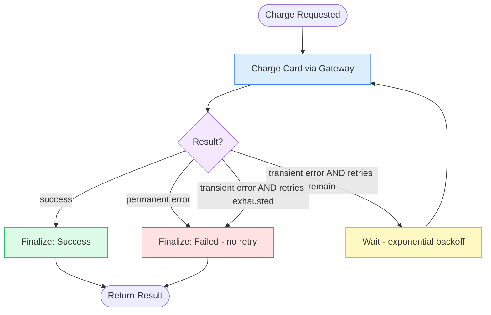

# 10. Retry Pattern

## 10.1 What is it?

The **Retry Pattern** automatically re-attempts an operation that failed —
but only when the failure looks **temporary** (a network blip, a
momentarily overloaded server), and with a **growing delay between
attempts** (exponential backoff), up to a hard maximum number of tries.

This is different from Pattern 9 (Loop Workflow): a loop repeats because
there's more *new* work to do (the next page). A retry repeats the **exact
same** operation because it failed and might succeed if tried again — the
input doesn't change between attempts, only time passes.

## 10.2 What problem does it solve?

Calls to external systems — payment gateways, third-party APIs, databases —
fail sometimes for reasons that have nothing to do with whether the request
itself was valid: a brief network hiccup, a server that's momentarily
overloaded, a request that timed out by half a second. Treating every one of
these as a permanent failure wastes perfectly good requests. But retrying
*everything* blindly is dangerous too — retrying a "card declined" charge
five times doesn't help anyone and can even cause duplicate-charge problems.

The Retry Pattern solves this by:

- **Distinguishing retryable from non-retryable failures** — only failures
  that are genuinely likely to succeed on a second try get retried.
- Using **exponential backoff** (wait longer between each successive retry)
  so a struggling downstream service gets breathing room instead of being
  hammered with immediate repeat requests.
- Enforcing a **hard maximum retry count**, so a genuinely broken dependency
  fails cleanly instead of retrying forever.
- Keeping the **calling code simple** — the caller just asks to "charge the
  card"; the retry logic around transient failures is handled once, in one
  place, instead of being re-implemented at every call site.

## 10.3 Realistic production example: Resilient Payment Charge

An online checkout system (`SwiftCart`) charges a customer's card through a
payment gateway that occasionally has brief outages. Two very different
kinds of failure can come back from that gateway:

- **Transient errors** (e.g., gateway timeout, 503 service unavailable) —
  the request may well succeed if tried again in a moment. **Should retry.**
- **Permanent errors** (e.g., card declined, invalid card number) — trying
  again with the exact same card details will just fail the exact same way
  every time. **Should never retry** — the customer needs a different card,
  not a repeated attempt.

The charge flow retries only the first kind, using exponential backoff
(waiting longer after each failed attempt), up to 3 total attempts.

## 10.4 Architecture / Flow Diagram


```mermaid
flowchart TD
    Start([Charge Requested]) --> Charge[Charge Card via Gateway]
    Charge --> Outcome{Result?}
    Outcome -->|success| Success[Finalize: Success]
    Outcome -->|permanent error| Failed[Finalize: Failed - no retry]
    Outcome -->|transient error AND retries remain| Wait[Wait - exponential backoff]
    Outcome -->|transient error AND retries exhausted| Failed
    Wait --> Charge
    Success --> End([Return Result])
    Failed --> End

    style Charge fill:#DCEEFB,stroke:#3B82F6
    style Outcome fill:#F3E8FF,stroke:#8B5CF6
    style Wait fill:#FEF9C3,stroke:#EAB308
    style Success fill:#DCFCE7,stroke:#22C55E
    style Failed fill:#FEE2E2,stroke:#EF4444
```

The loop only exists on the **transient error, retries remain** path — a
permanent error exits immediately, no matter how many retries are left.
That's the key structural difference from a plain Loop Workflow.

## 10.5 Request-to-response flow, step by step

1. A client sends charge details to `run_charge_with_retry()`.
2. LangGraph builds the initial `ChargeState` (`retry_count = 0`) and enters
   at `charge_card`.
3. **`charge_card`** calls the (simulated) payment gateway inside a
   `try/except` block that catches **two distinct exception types**:
   `TransientGatewayError` and `CardDeclinedError` (a permanent error). On
   success, it records the result and stops. On failure, it records *which
   kind* of error occurred.
4. A **conditional edge** (`route_after_charge`) checks, in order:
   - Success → `finalize_success`.
   - Permanent error → `finalize_failed` **immediately**, regardless of
     `retry_count`.
   - Transient error, and `retry_count < max_retries` → `wait_before_retry`.
   - Transient error, retries exhausted → `finalize_failed`.
5. **`wait_before_retry`** computes an exponential backoff delay
   (`base_delay * 2^retry_count`, e.g., 1s, 2s, 4s), sleeps for that long,
   increments `retry_count`, and flows back to `charge_card` — this is the
   loop.
6. This repeats until success, a permanent error, or the retry cap is hit.
7. Whichever finalize node runs writes the final outcome and a
   customer-facing message; the graph reaches `END`.

## 10.6 Why this pattern fits this problem

- **Not all failures deserve a retry** — retrying a declined card wastes
  time and can confuse the customer with a delayed duplicate-looking
  attempt; the pattern's explicit split between transient and permanent
  errors is the whole point.
- **Exponential backoff is considerate of the downstream service** — an
  overloaded payment gateway recovering from a brief spike benefits from
  requests spacing out, rather than every failed checkout retrying instantly
  and adding to the load.
- **A hard retry cap keeps checkout responsive** — a customer shouldn't be
  stuck waiting through unlimited retries; after 3 attempts, failing clearly
  and quickly is better than an indefinite hang.
- **Centralizing this logic in one place** means every part of SwiftCart
  that charges a card gets consistent, correct retry behavior automatically,
  instead of every call site needing to reimplement it (and likely getting
  it slightly wrong somewhere).

## 10.7 Production-quality implementation

```python
"""
Retry Pattern — Resilient Payment Charge
Pattern: retry ONLY transient failures, with exponential backoff, up to a
hard maximum -- permanent failures exit immediately without retrying

Run:
    pip install "langgraph==1.2.10" "langchain==1.3.14" "langchain-ollama==1.1.0" "pydantic==2.9.2"
    ollama pull llama3.1:8b     # make sure Ollama is running locally
    python payment_retry.py
"""

from __future__ import annotations

import asyncio
import logging
from typing import Optional

from langchain_ollama import ChatOllama
from langgraph.graph import StateGraph, START, END
from pydantic import BaseModel

# --------------------------------------------------------------------------
# 1. Logging
# --------------------------------------------------------------------------
logging.basicConfig(
    level=logging.INFO,
    format="%(asctime)s | %(levelname)s | %(name)s | %(message)s",
)
logger = logging.getLogger("payment_retry")


# --------------------------------------------------------------------------
# 2. Custom exceptions -- the split between these two types IS the pattern.
# --------------------------------------------------------------------------
class TransientGatewayError(Exception):
    """Likely to succeed if retried (timeout, 503, brief outage)."""


class CardDeclinedError(Exception):
    """Will never succeed by retrying the same request (bad card, declined)."""


# --------------------------------------------------------------------------
# 3. Shared state
# --------------------------------------------------------------------------
class ChargeState(BaseModel):
    order_id: str = ""
    card_last4: str = ""
    amount: float = 0.0

    max_retries: int = 3
    retry_count: int = 0
    base_delay_seconds: float = 1.0

    outcome: Optional[str] = None  # "success" | "transient_error" | "permanent_error"
    error_message: Optional[str] = None
    charge_id: Optional[str] = None

    final_status: Optional[str] = None  # "success" | "failed"
    customer_message: Optional[str] = None


_llm = ChatOllama(model="llama3.1:8b", temperature=0.2)


# --------------------------------------------------------------------------
# 4. Simulated payment gateway.
#    In production this would be a real HTTP call to Stripe/Adyen/etc.
#    For this demo: fails with a transient error on the first 2 attempts,
#    then succeeds on the 3rd -- to demonstrate a retry that pays off.
# --------------------------------------------------------------------------
def _call_payment_gateway(order_id: str, amount: float, attempt_number: int) -> str:
    if attempt_number < 3:
        raise TransientGatewayError(f"Gateway timeout on attempt {attempt_number}")
    return f"CHG-{order_id}-{attempt_number}"


# --------------------------------------------------------------------------
# 5. Node — Charge Card (this is the node that gets retried)
# --------------------------------------------------------------------------
def charge_card(state: ChargeState) -> dict:
    attempt_number = state.retry_count + 1
    logger.info("CHARGE — attempt %d/%d for order %s", attempt_number, state.max_retries, state.order_id)

    try:
        charge_id = _call_payment_gateway(state.order_id, state.amount, attempt_number)
        return {"outcome": "success", "charge_id": charge_id, "error_message": None}

    except CardDeclinedError as exc:
        logger.warning("PERMANENT error, will not retry: %s", exc)
        return {"outcome": "permanent_error", "error_message": str(exc)}

    except TransientGatewayError as exc:
        logger.warning("TRANSIENT error on attempt %d: %s", attempt_number, exc)
        return {"outcome": "transient_error", "error_message": str(exc)}


# --------------------------------------------------------------------------
# 6. Routing function — checks outcome type FIRST, retry budget SECOND.
#    A permanent error always exits immediately, no matter how many
#    retries are left.
# --------------------------------------------------------------------------
def route_after_charge(state: ChargeState) -> str:
    if state.outcome == "success":
        return "finalize_success"
    if state.outcome == "permanent_error":
        return "finalize_failed"
    # transient_error from here on
    if state.retry_count < state.max_retries:
        return "wait_before_retry"
    return "finalize_failed"


# --------------------------------------------------------------------------
# 7. Node — Wait Before Retry (exponential backoff, then loop back)
# --------------------------------------------------------------------------
async def wait_before_retry(state: ChargeState) -> dict:
    delay = state.base_delay_seconds * (2 ** state.retry_count)
    logger.info("BACKOFF — waiting %.1fs before retry %d", delay, state.retry_count + 1)
    await asyncio.sleep(delay)
    return {"retry_count": state.retry_count + 1}


# --------------------------------------------------------------------------
# 8. Finalize — success path
# --------------------------------------------------------------------------
def finalize_success(state: ChargeState) -> dict:
    logger.info("FINALIZE — success on attempt %d, charge_id=%s", state.retry_count + 1, state.charge_id)
    return {
        "final_status": "success",
        "customer_message": f"Your payment of ${state.amount:,.2f} was successful.",
    }


# --------------------------------------------------------------------------
# 9. Finalize — failure path (permanent error, or retries exhausted)
# --------------------------------------------------------------------------
def finalize_failed(state: ChargeState) -> dict:
    if state.outcome == "permanent_error":
        logger.warning("FINALIZE — permanent failure, card declined")
        message = "Your card was declined. Please try a different payment method."
    else:
        logger.warning("FINALIZE — gave up after %d attempts", state.retry_count + 1)
        message = "We couldn't process your payment right now. Please try again shortly."

    return {"final_status": "failed", "customer_message": message}


# --------------------------------------------------------------------------
# 10. Build the graph — the loop only exists on the transient-error path.
# --------------------------------------------------------------------------
def build_graph():
    graph = StateGraph(ChargeState)

    graph.add_node("charge_card", charge_card)
    graph.add_node("wait_before_retry", wait_before_retry)
    graph.add_node("finalize_success", finalize_success)
    graph.add_node("finalize_failed", finalize_failed)

    graph.add_edge(START, "charge_card")

    graph.add_conditional_edges(
        "charge_card",
        route_after_charge,
        {
            "finalize_success": "finalize_success",
            "finalize_failed": "finalize_failed",
            "wait_before_retry": "wait_before_retry",
        },
    )

    # The loop: after backing off, try charging again.
    graph.add_edge("wait_before_retry", "charge_card")

    graph.add_edge("finalize_success", END)
    graph.add_edge("finalize_failed", END)

    return graph.compile()


# --------------------------------------------------------------------------
# 11. Public entry point — async because wait_before_retry awaits asyncio.sleep
# --------------------------------------------------------------------------
async def run_charge_with_retry(order_id: str, card_last4: str, amount: float) -> dict:
    app = build_graph()
    initial_state = ChargeState(order_id=order_id, card_last4=card_last4, amount=amount)
    final_state = await app.ainvoke(initial_state)
    return final_state


# --------------------------------------------------------------------------
# 12. Demo
# --------------------------------------------------------------------------
if __name__ == "__main__":
    result = asyncio.run(run_charge_with_retry("ORD-7789", "4242", 89.99))
    print(f"Status: {result['final_status']} (after {result['retry_count'] + 1} attempt(s))")
    print(f"Message: {result['customer_message']}")
```

**Notes on production-readiness choices made above:**

- **Two distinct exception types drive two completely different paths** —
  this is the single most important design decision in a retry system. A
  generic `except Exception` that retries everything would happily retry a
  declined card three times for no benefit.
- **Exponential backoff** (`base_delay * 2^retry_count`) spaces out retries
  (1s, 2s, 4s here) instead of retrying instantly — considerate of a
  struggling downstream service. A real production system would typically
  add small random jitter to this delay too, to avoid many clients retrying
  in lockstep after a shared outage.
- **The retry cap is checked in the routing function, not inside
  `charge_card`** — same principle as the Loop Workflow pattern: keep the
  "should we continue" decision in one clearly testable place, separate from
  the operation itself.
- **`wait_before_retry` is `async`** (using `asyncio.sleep`) rather than a
  blocking `time.sleep` — important so a backoff delay in one request
  doesn't block a whole worker process from handling other work
  concurrently.

---

⬅ [9. Loop Workflow](09-loop-workflow.md) | [Back to index](README.md) | Next: [11. Fallback Pattern](11-fallback-pattern.md) ➡

# Resilient Payment Charge — Retry Pattern (Java + Spring AI)

A Java port of the LangGraph retry workflow — retry **only** transient failures, with exponential
backoff, up to a hard maximum; permanent failures exit immediately without retrying. Built on:

- **Java 25** (current LTS) — `Thread.sleep` for backoff, cheap on a virtual thread
- **Spring Boot 4.1.0**
- **Spring AI 2.0.0** (GA) with the **Ollama** starter, mirroring `llama3.1:8b`

## Mapping the shape

The pattern's entire value is in the *split* between two failure types — a `TransientGatewayError`
that's worth retrying and a `CardDeclinedError` that never is — checked in that specific order by
the router. That split, not the loop itself, is what this port has to get right.

| LangGraph concept | Spring / Java equivalent |
|---|---|
| `TransientGatewayError` / `CardDeclinedError` | `TransientGatewayException` / `CardDeclinedException` — both checked exceptions, so the compiler forces every caller to handle them |
| `charge_card` (the node that gets retried) | `PaymentChargeStep.charge(...)`, called inside the retry loop |
| `route_after_charge` (outcome first, retry budget second) | The loop's `switch`/`if` structure, checked in the same order |
| `wait_before_retry` (exponential backoff, loops back) | `Thread.sleep(delayMillis)` between loop iterations |
| `finalize_success` / `finalize_failed` | Two `ChargeResult` construction sites after the loop exits |
| `asyncio.sleep(delay)` not blocking the event loop | `Thread.sleep` not blocking a platform thread, because the whole method runs on a virtual thread |

Java has no built-in distinction between "retryable" and "non-retryable" exceptions the way some
resilience libraries do — the two custom exception types *are* that distinction here, exactly as
they are in the Python version's own comment ("the split between these two types IS the pattern").

---

## Project structure

```
payment-retry/
├── pom.xml
└── src/main/java/com/example/paymentretry/
    ├── PaymentRetryApplication.java
    ├── model/
    │   ├── ChargeRequest.java
    │   └── ChargeResult.java
    ├── gateway/
    │   ├── TransientGatewayException.java
    │   ├── CardDeclinedException.java
    │   └── PaymentGatewayClient.java
    ├── pipeline/
    │   ├── PaymentChargeStep.java
    │   └── PaymentRetryService.java
    ├── web/
    │   └── PaymentRetryController.java
    └── PaymentRetryRunner.java   (CLI demo, mirrors the Python __main__ block)
└── src/main/resources/
    └── application.yml
```

---

## `pom.xml`

```xml
<?xml version="1.0" encoding="UTF-8"?>
<project xmlns="http://maven.apache.org/POM/4.0.0"
         xmlns:xsi="http://www.w3.org/2001/XMLSchema-instance"
         xsi:schemaLocation="http://maven.apache.org/POM/4.0.0 https://maven.apache.org/xsd/maven-4.0.0.xsd">
    <modelVersion>4.0.0</modelVersion>

    <groupId>com.example</groupId>
    <artifactId>payment-retry</artifactId>
    <version>1.0.0</version>
    <packaging>jar</packaging>

    <properties>
        <java.version>25</java.version>
        <spring-ai.version>2.0.0</spring-ai.version>
    </properties>

    <parent>
        <groupId>org.springframework.boot</groupId>
        <artifactId>spring-boot-starter-parent</artifactId>
        <version>4.1.0</version>
        <relativePath/>
    </parent>

    <dependencyManagement>
        <dependencies>
            <dependency>
                <groupId>org.springframework.ai</groupId>
                <artifactId>spring-ai-bom</artifactId>
                <version>${spring-ai.version}</version>
                <type>pom</type>
                <scope>import</scope>
            </dependency>
        </dependencies>
    </dependencyManagement>

    <dependencies>
        <dependency>
            <groupId>org.springframework.boot</groupId>
            <artifactId>spring-boot-starter-web</artifactId>
        </dependency>
        <!-- Ollama model starter — kept for parity with the series; this workflow doesn't
             actually need an LLM call itself, but a ChatClient is wired in case a future
             step (e.g. drafting the customer-facing decline message) wants one. -->
        <dependency>
            <groupId>org.springframework.ai</groupId>
            <artifactId>spring-ai-starter-model-ollama</artifactId>
        </dependency>
        <dependency>
            <groupId>org.springframework.boot</groupId>
            <artifactId>spring-boot-starter-test</artifactId>
            <scope>test</scope>
        </dependency>
    </dependencies>

    <build>
        <plugins>
            <plugin>
                <groupId>org.springframework.boot</groupId>
                <artifactId>spring-boot-maven-plugin</artifactId>
            </plugin>
        </plugins>
    </build>
</project>
```

> Note: unlike every other workflow in this series, the Python original doesn't actually call
> `_llm` anywhere in `payment_retry.py` — it's imported and constructed but unused (the customer
> messages are all plain f-strings). The Java port below matches that faithfully: no `ChatClient`
> call appears in the pipeline. The Ollama starter is still listed in `pom.xml` only for
> consistency with the rest of the series; feel free to drop it if this service will never need
> an LLM call.

## `src/main/resources/application.yml`

```yaml
spring:
  application:
    name: payment-retry
  ai:
    ollama:
      base-url: http://localhost:11434
      chat:
        options:
          model: llama3.1:8b
          temperature: 0.2

logging:
  level:
    com.example.paymentretry: INFO
```

---

## The exception split — this IS the pattern

### `gateway/TransientGatewayException.java`

```java
package com.example.paymentretry.gateway;

/** Likely to succeed if retried (timeout, 503, brief outage). */
public class TransientGatewayException extends Exception {
    public TransientGatewayException(String message) {
        super(message);
    }
}
```

### `gateway/CardDeclinedException.java`

```java
package com.example.paymentretry.gateway;

/** Will never succeed by retrying the same request (bad card, declined). */
public class CardDeclinedException extends Exception {
    public CardDeclinedException(String message) {
        super(message);
    }
}
```

Both are checked exceptions on purpose: `PaymentGatewayClient.charge` declares
`throws TransientGatewayException, CardDeclinedException`, so every caller is forced by the
compiler to handle both cases explicitly — there's no way to accidentally treat a declined card
as retryable the way an unchecked/generic exception type might let you.

---

## Simulated payment gateway

### `gateway/PaymentGatewayClient.java`

In production this would be a real HTTP call to Stripe/Adyen/etc. Kept as a deterministic
simulation here: fails with a transient error on the first 2 attempts, then succeeds on the 3rd —
exactly matching the Python version's demo behavior.

```java
package com.example.paymentretry.gateway;

import org.springframework.stereotype.Component;

@Component
public class PaymentGatewayClient {

    public String charge(String orderId, double amount, int attemptNumber) throws TransientGatewayException {
        if (attemptNumber < 3) {
            throw new TransientGatewayException("Gateway timeout on attempt " + attemptNumber);
        }
        return "CHG-%s-%d".formatted(orderId, attemptNumber);
    }
}
```

---

## Domain model

### `model/ChargeRequest.java`

```java
package com.example.paymentretry.model;

public record ChargeRequest(String orderId, String cardLast4, double amount) {}
```

### `model/ChargeResult.java`

```java
package com.example.paymentretry.model;

public record ChargeResult(String finalStatus, String customerMessage, int attemptCount, String chargeId) {}
```

As with the ad-copy and transaction-sync loops, there's no `ChargeState` god-object here —
`retryCount` and the per-attempt `outcome` are local to `PaymentRetryService.charge`, since
nothing outside that one method needs to observe them between attempts.

---

## The node that gets retried

### `pipeline/PaymentChargeStep.java`

The direct analogue of `charge_card` — attempts the gateway call once, and translates each
exception type into a small sealed outcome the retry loop can switch on.

```java
package com.example.paymentretry.pipeline;

import com.example.paymentretry.gateway.CardDeclinedException;
import com.example.paymentretry.gateway.PaymentGatewayClient;
import com.example.paymentretry.gateway.TransientGatewayException;
import com.example.paymentretry.model.ChargeRequest;
import org.slf4j.Logger;
import org.slf4j.LoggerFactory;
import org.springframework.stereotype.Component;

@Component
public class PaymentChargeStep {

    private static final Logger log = LoggerFactory.getLogger(PaymentChargeStep.class);

    public sealed interface Outcome permits Success, TransientFailure, PermanentFailure {}
    public record Success(String chargeId) implements Outcome {}
    public record TransientFailure(String errorMessage) implements Outcome {}
    public record PermanentFailure(String errorMessage) implements Outcome {}

    private final PaymentGatewayClient paymentGatewayClient;

    public PaymentChargeStep(PaymentGatewayClient paymentGatewayClient) {
        this.paymentGatewayClient = paymentGatewayClient;
    }

    public Outcome charge(ChargeRequest request, int attemptNumber, int maxRetries) {
        log.info("CHARGE - attempt {}/{} for order {}", attemptNumber, maxRetries, request.orderId());

        try {
            String chargeId = paymentGatewayClient.charge(request.orderId(), request.amount(), attemptNumber);
            return new Success(chargeId);
        } catch (CardDeclinedException e) {
            log.warn("PERMANENT error, will not retry: {}", e.getMessage());
            return new PermanentFailure(e.getMessage());
        } catch (TransientGatewayException e) {
            log.warn("TRANSIENT error on attempt {}: {}", attemptNumber, e.getMessage());
            return new TransientFailure(e.getMessage());
        }
    }
}
```

> `PaymentGatewayClient.charge` in this demo never actually throws `CardDeclinedException` (same
> as the Python simulation), but the `catch` clause is here exactly as it is in `charge_card` —
> the pattern is meant to show both branches even though only one is exercised by the demo data.

---

## The retry loop

### `pipeline/PaymentRetryService.java`

The `while` loop is the `wait_before_retry -> charge_card` back-edge; the exit logic preserves
`route_after_charge`'s exact check order — outcome type first, retry budget second — so a
permanent error always exits immediately no matter how many retries remain.

```java
package com.example.paymentretry.pipeline;

import com.example.paymentretry.model.ChargeRequest;
import com.example.paymentretry.model.ChargeResult;
import org.slf4j.Logger;
import org.slf4j.LoggerFactory;
import org.springframework.stereotype.Service;

@Service
public class PaymentRetryService {

    private static final Logger log = LoggerFactory.getLogger(PaymentRetryService.class);

    private final PaymentChargeStep paymentChargeStep;

    public PaymentRetryService(PaymentChargeStep paymentChargeStep) {
        this.paymentChargeStep = paymentChargeStep;
    }

    public ChargeResult charge(ChargeRequest request, int maxRetries, double baseDelaySeconds) {
        int retryCount = 0;

        while (true) {
            int attemptNumber = retryCount + 1;
            var outcome = paymentChargeStep.charge(request, attemptNumber, maxRetries);

            // route_after_charge, in the same order: outcome type first, retry budget second.
            // A permanent error always exits immediately, no matter how many retries are left.
            if (outcome instanceof PaymentChargeStep.Success success) {
                return finalizeSuccess(request, success, attemptNumber);
            }

            if (outcome instanceof PaymentChargeStep.PermanentFailure) {
                return finalizeFailedDeclined();
            }

            // TransientFailure from here on.
            if (retryCount >= maxRetries) {
                return finalizeFailedExhausted(attemptNumber);
            }

            waitBeforeRetry(baseDelaySeconds, retryCount);
            retryCount++;
        }
    }

    private void waitBeforeRetry(double baseDelaySeconds, int retryCount) {
        double delaySeconds = baseDelaySeconds * Math.pow(2, retryCount);
        log.info("BACKOFF - waiting {}s before retry {}", delaySeconds, retryCount + 1);
        try {
            Thread.sleep((long) (delaySeconds * 1000));
        } catch (InterruptedException e) {
            Thread.currentThread().interrupt();
            throw new RuntimeException("Interrupted during backoff wait", e);
        }
    }

    private ChargeResult finalizeSuccess(ChargeRequest request, PaymentChargeStep.Success success,
                                          int attemptNumber) {
        log.info("FINALIZE - success on attempt {}, chargeId={}", attemptNumber, success.chargeId());
        String message = "Your payment of $%,.2f was successful.".formatted(request.amount());
        return new ChargeResult("success", message, attemptNumber, success.chargeId());
    }

    private ChargeResult finalizeFailedDeclined() {
        log.warn("FINALIZE - permanent failure, card declined");
        String message = "Your card was declined. Please try a different payment method.";
        return new ChargeResult("failed", message, -1, null);
    }

    private ChargeResult finalizeFailedExhausted(int attemptNumber) {
        log.warn("FINALIZE - gave up after {} attempts", attemptNumber);
        String message = "We couldn't process your payment right now. Please try again shortly.";
        return new ChargeResult("failed", message, attemptNumber, null);
    }
}
```

---

## Entry points

### `web/PaymentRetryController.java`

```java
package com.example.paymentretry.web;

import com.example.paymentretry.model.ChargeRequest;
import com.example.paymentretry.model.ChargeResult;
import com.example.paymentretry.pipeline.PaymentRetryService;
import org.springframework.web.bind.annotation.PostMapping;
import org.springframework.web.bind.annotation.RequestBody;
import org.springframework.web.bind.annotation.RestController;

@RestController
public class PaymentRetryController {

    private final PaymentRetryService paymentRetryService;

    public PaymentRetryController(PaymentRetryService paymentRetryService) {
        this.paymentRetryService = paymentRetryService;
    }

    @PostMapping("/api/payments/charge")
    public ChargeResult charge(@RequestBody ChargeRequest request) {
        return paymentRetryService.charge(request, 3, 1.0);
    }
}
```

### `PaymentRetryRunner.java` (CLI demo, mirrors the Python `if __name__ == "__main__"` block)

```java
package com.example.paymentretry;

import com.example.paymentretry.model.ChargeRequest;
import com.example.paymentretry.pipeline.PaymentRetryService;
import org.springframework.boot.CommandLineRunner;
import org.springframework.context.annotation.Profile;
import org.springframework.stereotype.Component;

@Component
@Profile("demo")
public class PaymentRetryRunner implements CommandLineRunner {

    private final PaymentRetryService paymentRetryService;

    public PaymentRetryRunner(PaymentRetryService paymentRetryService) {
        this.paymentRetryService = paymentRetryService;
    }

    @Override
    public void run(String... args) {
        var result = paymentRetryService.charge(
                new ChargeRequest("ORD-7789", "4242", 89.99), 3, 1.0);

        System.out.printf("Status: %s (after %d attempt(s))%n", result.finalStatus(), result.attemptCount());
        System.out.println("Message: " + result.customerMessage());
    }
}
```

### `PaymentRetryApplication.java`

```java
package com.example.paymentretry;

import org.springframework.boot.SpringApplication;
import org.springframework.boot.autoconfigure.SpringBootApplication;

@SpringBootApplication
public class PaymentRetryApplication {
    public static void main(String[] args) {
        SpringApplication.run(PaymentRetryApplication.class, args);
    }
}
```

---

## Running it

```bash
# CLI demo (prints status + message, like the Python script — the demo
# gateway succeeds on the 3rd attempt after two transient-error backoffs)
mvn spring-boot:run -Dspring-boot.run.profiles=demo

# Or as a service
mvn spring-boot:run
curl -X POST localhost:8080/api/payments/charge \
  -H "Content-Type: application/json" \
  -d '{"orderId":"ORD-7789","cardLast4":"4242","amount":89.99}'
```

## Notes on the port

- **The exception split is the whole point**: `TransientGatewayException` vs
  `CardDeclinedException` — as checked exceptions — mean the compiler itself enforces that
  `PaymentChargeStep.charge` handles both cases, and that a permanent failure can never be
  accidentally routed down the retry path. This is worth more scrutiny during any future change
  to this code than almost anything else in the file.
- **Check order preserved exactly**: `route_after_charge` checks success, then permanent error,
  then the retry budget, in that order — the `while` loop's `if` chain does the same. Swapping the
  permanent-error and retry-budget checks would be harmless here, but swapping success and
  permanent-error would not be, so the order is kept identical rather than "simplified."
- **Exponential backoff formula unchanged**: `baseDelaySeconds * 2^retryCount`, same growth curve
  as `state.base_delay_seconds * (2 ** state.retry_count)`.
- **`Thread.sleep` instead of `asyncio.sleep`**: since the whole request handler runs on a virtual
  thread (via Spring Boot's `spring.threads.virtual.enabled`, or simply because `charge()` is
  invoked from a virtual-thread-backed request), a blocking `Thread.sleep` during backoff doesn't
  tie up a platform thread — the same non-blocking-at-scale property `asyncio.sleep` gives the
  Python version, achieved a different way.
- **No LLM call in this workflow, matching the original**: see the callout above the `pom.xml` —
  the Python source never actually invokes `_llm`, so the Java port doesn't invent one either.
- **Versions**: same Spring Boot 4.1.0 / Spring AI 2.0.0 baseline as the rest of the series, with
  the Ollama starter present for consistency but unused by this particular workflow.
