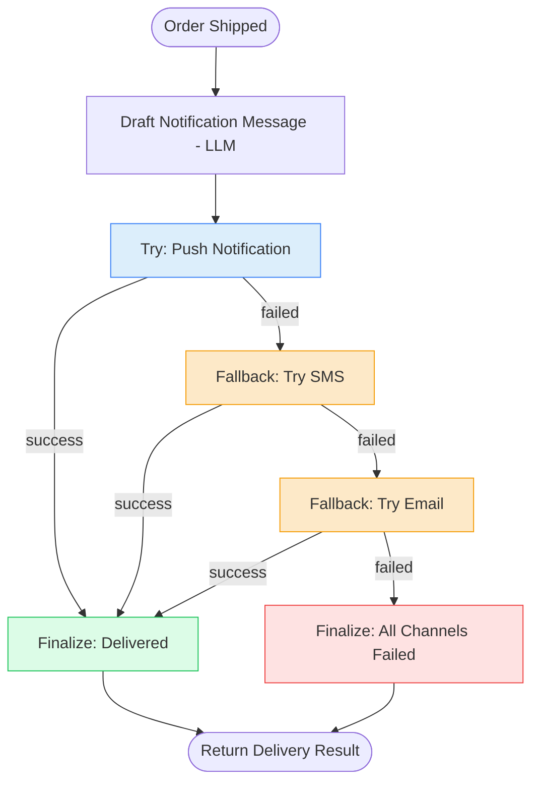

# 11. Fallback Pattern

## 11.1 What is it?

The **Fallback Pattern** switches to a **completely different approach or
provider** when the primary one is unavailable — not by trying the same
thing again (that's Pattern 10, Retry), but by having one or more **backup
options ready**, each attempted in order until one succeeds.

Think of it like calling a friend: if their cell phone doesn't pick up, you
don't just call the same number five more times (that's retry) — you try
their home phone, then maybe send a text instead (that's fallback). Each
option is a genuinely different way of reaching the same goal.

## 11.2 What problem does it solve?

Retrying only helps when the *same* operation might succeed on a second try
— that assumes the problem is temporary and specific to that one call. But
sometimes an entire provider or channel is down for an extended period, or
just isn't the right fit for a particular customer (e.g., they don't have
push notifications enabled). In those cases, retrying the same thing
repeatedly wastes time and still doesn't solve the underlying problem.

The Fallback Pattern solves this by:

- Providing **genuinely different paths to the same goal**, so if one is
  unavailable, another can still get the job done.
- **Ordering the options by preference** — try the best/cheapest/fastest
  option first, and only fall back to less ideal options when necessary.
- Making outages in **any single dependency non-fatal** to the overall
  outcome — the system keeps working, just via a different route.
- Keeping a clear **record of which option actually succeeded**, which is
  valuable for monitoring how often you're relying on backups (a sign a
  "primary" dependency needs attention).

## 11.3 Realistic production example: Multi-Channel Order Notification

An online retailer (`SwiftCart`, continuing from Pattern 10) needs to make
sure every customer is notified when their order ships — reliably, through
*some* channel, even if their preferred channel is having problems:

1. **Try Push Notification** (preferred: instant, free) — if the push
   service is down or the customer has no registered device, this fails.
2. **Fall back to SMS** (fast, small cost per message) — if the SMS provider
   is unavailable or the customer has no phone number on file, this fails
   too.
3. **Fall back to Email** (slower, but essentially always available) — used
   as the last resort, since virtually every customer has an email on file.

The message content itself is generated once by an LLM; the fallback chain
is purely about **how** that message actually reaches the customer.

## 11.4 Architecture / Flow Diagram



Notice this is **not a loop** — each box is a genuinely different node with
different logic, tried once each, in a fixed preference order. That's what
separates Fallback from Retry.

## 11.5 Request-to-response flow, step by step

1. A client sends order and customer details to `run_order_notification()`.
2. LangGraph builds the initial `NotificationState` and enters at
   `draft_message`.
3. **`draft_message`** makes one LLM call to write the shipping notification
   text — this happens exactly once, regardless of which channel eventually
   delivers it.
4. Execution moves to `try_push`. It attempts delivery via the (simulated)
   push notification service, wrapped in `try/except`. On success, it
   records `delivered_via = "push"` and the loop of fallbacks stops there.
5. A **conditional edge** checks the result: success → `finalize_delivered`;
   failure → `try_sms` (the next option in the chain).
6. **`try_sms`** attempts delivery via SMS, completely independent logic
   from the push attempt. Success → `finalize_delivered`; failure →
   `try_email`.
7. **`try_email`** is the last resort. Success → `finalize_delivered`;
   failure → `finalize_failed` (every channel has now been exhausted).
8. Whichever finalize node runs records the outcome — including *which*
   channel actually worked, if any — and the graph reaches `END`.

## 11.6 Why this pattern fits this problem

- **Different customers have different available channels** — some have no
  registered device for push, some have no phone number, but nearly
  everyone has an email. A fallback chain ensures the system adapts instead
  of failing outright for customers missing one channel.
- **Provider outages happen** — if the push notification service has an
  extended outage, retrying push notifications wouldn't help, but SMS or
  email likely still work fine, because they're independent systems.
- **Ordering the fallbacks by cost/speed** (push → SMS → email) means the
  system only pays for or waits on a slower/costlier channel when it
  genuinely has to.
- **Tracking `delivered_via`** turns this into useful operational data — if
  "email fallback" starts showing up constantly, that's a strong signal the
  push service needs investigating, even though customers are still getting
  notified either way.

## 11.7 Production-quality implementation

```python
"""
Fallback Pattern — Multi-Channel Order Notification
Pattern: try a preferred option; if it fails, try the next-best option;
continue down an ordered list of genuinely different approaches

Run:
    pip install "langgraph==1.2.10" "langchain==1.3.14" "langchain-ollama==1.1.0" "pydantic==2.9.2"
    ollama pull llama3.1:8b     # make sure Ollama is running locally
    python order_notification.py
"""

from __future__ import annotations

import logging
from typing import Optional

from langchain_ollama import ChatOllama
from langgraph.graph import StateGraph, START, END
from pydantic import BaseModel

# --------------------------------------------------------------------------
# 1. Logging
# --------------------------------------------------------------------------
logging.basicConfig(
    level=logging.INFO,
    format="%(asctime)s | %(levelname)s | %(name)s | %(message)s",
)
logger = logging.getLogger("order_notification")


# --------------------------------------------------------------------------
# 2. Shared state
# --------------------------------------------------------------------------
class NotificationState(BaseModel):
    order_id: str = ""
    customer_name: str = ""
    tracking_number: str = ""

    has_push_device: bool = True
    has_phone_number: bool = True
    has_email: bool = True

    message_text: Optional[str] = None
    delivered_via: Optional[str] = None
    final_status: Optional[str] = None  # "delivered" | "all_channels_failed"


_llm = ChatOllama(model="llama3.1:8b", temperature=0.3)


# --------------------------------------------------------------------------
# 3. Node — Draft Message (runs once, before any delivery attempt)
# --------------------------------------------------------------------------
_DRAFT_PROMPT = """Write a short, friendly order shipped notification, 1-2
sentences.

Customer name: {name}
Order ID: {order_id}
Tracking number: {tracking}
"""


def draft_message(state: NotificationState) -> dict:
    logger.info("DRAFT — writing notification for order %s", state.order_id)
    try:
        response = _llm.invoke(
            _DRAFT_PROMPT.format(
                name=state.customer_name, order_id=state.order_id, tracking=state.tracking_number
            )
        )
        text = response.content.strip()
    except Exception as exc:  # noqa: BLE001
        logger.error("draft_message LLM call failed, using plain template: %s", exc)
        text = (
            f"Hi {state.customer_name}, your order {state.order_id} has shipped! "
            f"Tracking: {state.tracking_number}."
        )
    return {"message_text": text}


# --------------------------------------------------------------------------
# 4. Simulated delivery channels.
#    Each is independent logic representing a different real integration
#    (a push notification SDK, an SMS provider's API, an email service).
# --------------------------------------------------------------------------
def _send_push(customer_has_device: bool) -> bool:
    if not customer_has_device:
        raise RuntimeError("No registered device for push notifications")
    # Simulated: push service is having an outage in this demo run.
    raise RuntimeError("Push notification service unavailable (simulated outage)")


def _send_sms(customer_has_phone: bool) -> bool:
    if not customer_has_phone:
        raise RuntimeError("No phone number on file")
    # Simulated: SMS provider is also unavailable in this demo run,
    # to show the chain falling all the way through to email.
    raise RuntimeError("SMS provider timeout (simulated outage)")


def _send_email(customer_has_email: bool) -> bool:
    if not customer_has_email:
        raise RuntimeError("No email on file")
    return True  # simulated: email always succeeds as the final fallback


# --------------------------------------------------------------------------
# 5. Node — Try Push (preferred, tried first)
# --------------------------------------------------------------------------
def try_push(state: NotificationState) -> dict:
    logger.info("ATTEMPT — push notification for order %s", state.order_id)
    try:
        _send_push(state.has_push_device)
        return {"delivered_via": "push"}
    except Exception as exc:  # noqa: BLE001
        logger.warning("Push failed, falling back to SMS: %s", exc)
        return {"delivered_via": None}


# --------------------------------------------------------------------------
# 6. Node — Try SMS (first fallback)
# --------------------------------------------------------------------------
def try_sms(state: NotificationState) -> dict:
    logger.info("ATTEMPT — SMS for order %s", state.order_id)
    try:
        _send_sms(state.has_phone_number)
        return {"delivered_via": "sms"}
    except Exception as exc:  # noqa: BLE001
        logger.warning("SMS failed, falling back to email: %s", exc)
        return {"delivered_via": None}


# --------------------------------------------------------------------------
# 7. Node — Try Email (last resort)
# --------------------------------------------------------------------------
def try_email(state: NotificationState) -> dict:
    logger.info("ATTEMPT — email for order %s", state.order_id)
    try:
        _send_email(state.has_email)
        return {"delivered_via": "email"}
    except Exception as exc:  # noqa: BLE001
        logger.error("Email failed too, all channels exhausted: %s", exc)
        return {"delivered_via": None}


# --------------------------------------------------------------------------
# 8. Routing helper — reused after each attempt to decide: are we done,
#    or do we move to the next fallback in the chain?
# --------------------------------------------------------------------------
def route_after_push(state: NotificationState) -> str:
    return "finalize_delivered" if state.delivered_via else "try_sms"


def route_after_sms(state: NotificationState) -> str:
    return "finalize_delivered" if state.delivered_via else "try_email"


def route_after_email(state: NotificationState) -> str:
    return "finalize_delivered" if state.delivered_via else "finalize_failed"


# --------------------------------------------------------------------------
# 9. Finalize nodes
# --------------------------------------------------------------------------
def finalize_delivered(state: NotificationState) -> dict:
    logger.info("FINALIZE — delivered via %s", state.delivered_via)
    return {"final_status": "delivered"}


def finalize_failed(state: NotificationState) -> dict:
    logger.error("FINALIZE — all channels failed for order %s", state.order_id)
    return {"final_status": "all_channels_failed"}


# --------------------------------------------------------------------------
# 10. Build the graph — a fixed CHAIN of distinct fallback options,
#     not a loop back onto the same node.
# --------------------------------------------------------------------------
def build_graph():
    graph = StateGraph(NotificationState)

    graph.add_node("draft_message", draft_message)
    graph.add_node("try_push", try_push)
    graph.add_node("try_sms", try_sms)
    graph.add_node("try_email", try_email)
    graph.add_node("finalize_delivered", finalize_delivered)
    graph.add_node("finalize_failed", finalize_failed)

    graph.add_edge(START, "draft_message")
    graph.add_edge("draft_message", "try_push")

    graph.add_conditional_edges(
        "try_push",
        route_after_push,
        {"finalize_delivered": "finalize_delivered", "try_sms": "try_sms"},
    )
    graph.add_conditional_edges(
        "try_sms",
        route_after_sms,
        {"finalize_delivered": "finalize_delivered", "try_email": "try_email"},
    )
    graph.add_conditional_edges(
        "try_email",
        route_after_email,
        {"finalize_delivered": "finalize_delivered", "finalize_failed": "finalize_failed"},
    )

    graph.add_edge("finalize_delivered", END)
    graph.add_edge("finalize_failed", END)

    return graph.compile()


# --------------------------------------------------------------------------
# 11. Public entry point
# --------------------------------------------------------------------------
def run_order_notification(order_id: str, customer_name: str, tracking_number: str) -> dict:
    app = build_graph()
    initial_state = NotificationState(
        order_id=order_id, customer_name=customer_name, tracking_number=tracking_number
    )
    final_state = app.invoke(initial_state)
    return final_state


# --------------------------------------------------------------------------
# 12. Demo
# --------------------------------------------------------------------------
if __name__ == "__main__":
    result = run_order_notification("ORD-9931", "Priya Nair", "1Z999AA10123456784")
    print(f"Status: {result['final_status']}")
    print(f"Delivered via: {result['delivered_via']}")
    print(f"Message: {result['message_text']}")
```

**Notes on production-readiness choices made above:**

- **Each channel is its own node with its own independent logic** — this is
  the structural difference from Retry: three genuinely different
  integrations, tried once each in order, rather than one integration tried
  repeatedly.
- **The chain is a fixed sequence, not a loop back to an earlier node** —
  `try_push → try_sms → try_email` only ever moves forward, which guarantees
  it terminates after at most 3 attempts without needing a separate cap like
  the Retry and Loop patterns did.
- **Ordering matters and is deliberate** — cheapest/fastest option first
  (push), progressively falling back to slower or costlier options (SMS,
  then email), so the system never pays more than it has to.
- **`delivered_via` is preserved in the final result** — this is valuable
  operational signal: monitoring how often orders fall through to email
  reveals whether the "primary" push channel is healthy, even though
  customers themselves are never left without a notification.

---

⬅ [10. Retry Pattern](10-retry-pattern.md) | [Back to index](README.md) | Next: [12. Human Approval Workflow](12-human-approval-workflow.md) ➡
