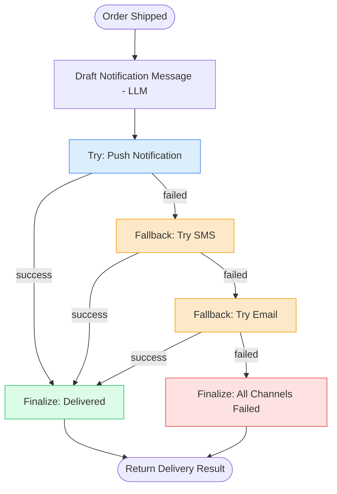

# 11. Fallback Pattern

## 11.1 What is it?

The **Fallback Pattern** switches to a **completely different approach or
provider** when the primary one is unavailable — not by trying the same
thing again (that's Pattern 10, Retry), but by having one or more **backup
options ready**, each attempted in order until one succeeds.

Think of it like calling a friend: if their cell phone doesn't pick up, you
don't just call the same number five more times (that's retry) — you try
their home phone, then maybe send a text instead (that's fallback). Each
option is a genuinely different way of reaching the same goal.

## 11.2 What problem does it solve?

Retrying only helps when the *same* operation might succeed on a second try
— that assumes the problem is temporary and specific to that one call. But
sometimes an entire provider or channel is down for an extended period, or
just isn't the right fit for a particular customer (e.g., they don't have
push notifications enabled). In those cases, retrying the same thing
repeatedly wastes time and still doesn't solve the underlying problem.

The Fallback Pattern solves this by:

- Providing **genuinely different paths to the same goal**, so if one is
  unavailable, another can still get the job done.
- **Ordering the options by preference** — try the best/cheapest/fastest
  option first, and only fall back to less ideal options when necessary.
- Making outages in **any single dependency non-fatal** to the overall
  outcome — the system keeps working, just via a different route.
- Keeping a clear **record of which option actually succeeded**, which is
  valuable for monitoring how often you're relying on backups (a sign a
  "primary" dependency needs attention).

## 11.3 Realistic production example: Multi-Channel Order Notification

An online retailer (`SwiftCart`, continuing from Pattern 10) needs to make
sure every customer is notified when their order ships — reliably, through
*some* channel, even if their preferred channel is having problems:

1. **Try Push Notification** (preferred: instant, free) — if the push
   service is down or the customer has no registered device, this fails.
2. **Fall back to SMS** (fast, small cost per message) — if the SMS provider
   is unavailable or the customer has no phone number on file, this fails
   too.
3. **Fall back to Email** (slower, but essentially always available) — used
   as the last resort, since virtually every customer has an email on file.

The message content itself is generated once by an LLM; the fallback chain
is purely about **how** that message actually reaches the customer.

## 11.4 Architecture / Flow Diagram


```mermaid
flowchart TD
    Start([Order Shipped]) --> Draft[Draft Notification Message - LLM]
    Draft --> Push[Try: Push Notification]
    Push -->|success| Done[Finalize: Delivered]
    Push -->|failed| SMS[Fallback: Try SMS]
    SMS -->|success| Done
    SMS -->|failed| Email[Fallback: Try Email]
    Email -->|success| Done
    Email -->|failed| Failed[Finalize: All Channels Failed]
    Done --> End([Return Delivery Result])
    Failed --> End

    style Push fill:#DCEEFB,stroke:#3B82F6
    style SMS fill:#FDE9C8,stroke:#F59E0B
    style Email fill:#FDE9C8,stroke:#F59E0B
    style Done fill:#DCFCE7,stroke:#22C55E
    style Failed fill:#FEE2E2,stroke:#EF4444
```

Notice this is **not a loop** — each box is a genuinely different node with
different logic, tried once each, in a fixed preference order. That's what
separates Fallback from Retry.

## 11.5 Request-to-response flow, step by step

1. A client sends order and customer details to `run_order_notification()`.
2. LangGraph builds the initial `NotificationState` and enters at
   `draft_message`.
3. **`draft_message`** makes one LLM call to write the shipping notification
   text — this happens exactly once, regardless of which channel eventually
   delivers it.
4. Execution moves to `try_push`. It attempts delivery via the (simulated)
   push notification service, wrapped in `try/except`. On success, it
   records `delivered_via = "push"` and the loop of fallbacks stops there.
5. A **conditional edge** checks the result: success → `finalize_delivered`;
   failure → `try_sms` (the next option in the chain).
6. **`try_sms`** attempts delivery via SMS, completely independent logic
   from the push attempt. Success → `finalize_delivered`; failure →
   `try_email`.
7. **`try_email`** is the last resort. Success → `finalize_delivered`;
   failure → `finalize_failed` (every channel has now been exhausted).
8. Whichever finalize node runs records the outcome — including *which*
   channel actually worked, if any — and the graph reaches `END`.

## 11.6 Why this pattern fits this problem

- **Different customers have different available channels** — some have no
  registered device for push, some have no phone number, but nearly
  everyone has an email. A fallback chain ensures the system adapts instead
  of failing outright for customers missing one channel.
- **Provider outages happen** — if the push notification service has an
  extended outage, retrying push notifications wouldn't help, but SMS or
  email likely still work fine, because they're independent systems.
- **Ordering the fallbacks by cost/speed** (push → SMS → email) means the
  system only pays for or waits on a slower/costlier channel when it
  genuinely has to.
- **Tracking `delivered_via`** turns this into useful operational data — if
  "email fallback" starts showing up constantly, that's a strong signal the
  push service needs investigating, even though customers are still getting
  notified either way.

## 11.7 Production-quality implementation

```python
"""
Fallback Pattern — Multi-Channel Order Notification
Pattern: try a preferred option; if it fails, try the next-best option;
continue down an ordered list of genuinely different approaches

Run:
    pip install "langgraph==1.2.10" "langchain==1.3.14" "langchain-ollama==1.1.0" "pydantic==2.9.2"
    ollama pull llama3.1:8b     # make sure Ollama is running locally
    python order_notification.py
"""

from __future__ import annotations

import logging
from typing import Optional

from langchain_ollama import ChatOllama
from langgraph.graph import StateGraph, START, END
from pydantic import BaseModel

# --------------------------------------------------------------------------
# 1. Logging
# --------------------------------------------------------------------------
logging.basicConfig(
    level=logging.INFO,
    format="%(asctime)s | %(levelname)s | %(name)s | %(message)s",
)
logger = logging.getLogger("order_notification")


# --------------------------------------------------------------------------
# 2. Shared state
# --------------------------------------------------------------------------
class NotificationState(BaseModel):
    order_id: str = ""
    customer_name: str = ""
    tracking_number: str = ""

    has_push_device: bool = True
    has_phone_number: bool = True
    has_email: bool = True

    message_text: Optional[str] = None
    delivered_via: Optional[str] = None
    final_status: Optional[str] = None  # "delivered" | "all_channels_failed"


_llm = ChatOllama(model="llama3.1:8b", temperature=0.3)


# --------------------------------------------------------------------------
# 3. Node — Draft Message (runs once, before any delivery attempt)
# --------------------------------------------------------------------------
_DRAFT_PROMPT = """Write a short, friendly order shipped notification, 1-2
sentences.

Customer name: {name}
Order ID: {order_id}
Tracking number: {tracking}
"""


def draft_message(state: NotificationState) -> dict:
    logger.info("DRAFT — writing notification for order %s", state.order_id)
    try:
        response = _llm.invoke(
            _DRAFT_PROMPT.format(
                name=state.customer_name, order_id=state.order_id, tracking=state.tracking_number
            )
        )
        text = response.content.strip()
    except Exception as exc:  # noqa: BLE001
        logger.error("draft_message LLM call failed, using plain template: %s", exc)
        text = (
            f"Hi {state.customer_name}, your order {state.order_id} has shipped! "
            f"Tracking: {state.tracking_number}."
        )
    return {"message_text": text}


# --------------------------------------------------------------------------
# 4. Simulated delivery channels.
#    Each is independent logic representing a different real integration
#    (a push notification SDK, an SMS provider's API, an email service).
# --------------------------------------------------------------------------
def _send_push(customer_has_device: bool) -> bool:
    if not customer_has_device:
        raise RuntimeError("No registered device for push notifications")
    # Simulated: push service is having an outage in this demo run.
    raise RuntimeError("Push notification service unavailable (simulated outage)")


def _send_sms(customer_has_phone: bool) -> bool:
    if not customer_has_phone:
        raise RuntimeError("No phone number on file")
    # Simulated: SMS provider is also unavailable in this demo run,
    # to show the chain falling all the way through to email.
    raise RuntimeError("SMS provider timeout (simulated outage)")


def _send_email(customer_has_email: bool) -> bool:
    if not customer_has_email:
        raise RuntimeError("No email on file")
    return True  # simulated: email always succeeds as the final fallback


# --------------------------------------------------------------------------
# 5. Node — Try Push (preferred, tried first)
# --------------------------------------------------------------------------
def try_push(state: NotificationState) -> dict:
    logger.info("ATTEMPT — push notification for order %s", state.order_id)
    try:
        _send_push(state.has_push_device)
        return {"delivered_via": "push"}
    except Exception as exc:  # noqa: BLE001
        logger.warning("Push failed, falling back to SMS: %s", exc)
        return {"delivered_via": None}


# --------------------------------------------------------------------------
# 6. Node — Try SMS (first fallback)
# --------------------------------------------------------------------------
def try_sms(state: NotificationState) -> dict:
    logger.info("ATTEMPT — SMS for order %s", state.order_id)
    try:
        _send_sms(state.has_phone_number)
        return {"delivered_via": "sms"}
    except Exception as exc:  # noqa: BLE001
        logger.warning("SMS failed, falling back to email: %s", exc)
        return {"delivered_via": None}


# --------------------------------------------------------------------------
# 7. Node — Try Email (last resort)
# --------------------------------------------------------------------------
def try_email(state: NotificationState) -> dict:
    logger.info("ATTEMPT — email for order %s", state.order_id)
    try:
        _send_email(state.has_email)
        return {"delivered_via": "email"}
    except Exception as exc:  # noqa: BLE001
        logger.error("Email failed too, all channels exhausted: %s", exc)
        return {"delivered_via": None}


# --------------------------------------------------------------------------
# 8. Routing helper — reused after each attempt to decide: are we done,
#    or do we move to the next fallback in the chain?
# --------------------------------------------------------------------------
def route_after_push(state: NotificationState) -> str:
    return "finalize_delivered" if state.delivered_via else "try_sms"


def route_after_sms(state: NotificationState) -> str:
    return "finalize_delivered" if state.delivered_via else "try_email"


def route_after_email(state: NotificationState) -> str:
    return "finalize_delivered" if state.delivered_via else "finalize_failed"


# --------------------------------------------------------------------------
# 9. Finalize nodes
# --------------------------------------------------------------------------
def finalize_delivered(state: NotificationState) -> dict:
    logger.info("FINALIZE — delivered via %s", state.delivered_via)
    return {"final_status": "delivered"}


def finalize_failed(state: NotificationState) -> dict:
    logger.error("FINALIZE — all channels failed for order %s", state.order_id)
    return {"final_status": "all_channels_failed"}


# --------------------------------------------------------------------------
# 10. Build the graph — a fixed CHAIN of distinct fallback options,
#     not a loop back onto the same node.
# --------------------------------------------------------------------------
def build_graph():
    graph = StateGraph(NotificationState)

    graph.add_node("draft_message", draft_message)
    graph.add_node("try_push", try_push)
    graph.add_node("try_sms", try_sms)
    graph.add_node("try_email", try_email)
    graph.add_node("finalize_delivered", finalize_delivered)
    graph.add_node("finalize_failed", finalize_failed)

    graph.add_edge(START, "draft_message")
    graph.add_edge("draft_message", "try_push")

    graph.add_conditional_edges(
        "try_push",
        route_after_push,
        {"finalize_delivered": "finalize_delivered", "try_sms": "try_sms"},
    )
    graph.add_conditional_edges(
        "try_sms",
        route_after_sms,
        {"finalize_delivered": "finalize_delivered", "try_email": "try_email"},
    )
    graph.add_conditional_edges(
        "try_email",
        route_after_email,
        {"finalize_delivered": "finalize_delivered", "finalize_failed": "finalize_failed"},
    )

    graph.add_edge("finalize_delivered", END)
    graph.add_edge("finalize_failed", END)

    return graph.compile()


# --------------------------------------------------------------------------
# 11. Public entry point
# --------------------------------------------------------------------------
def run_order_notification(order_id: str, customer_name: str, tracking_number: str) -> dict:
    app = build_graph()
    initial_state = NotificationState(
        order_id=order_id, customer_name=customer_name, tracking_number=tracking_number
    )
    final_state = app.invoke(initial_state)
    return final_state


# --------------------------------------------------------------------------
# 12. Demo
# --------------------------------------------------------------------------
if __name__ == "__main__":
    result = run_order_notification("ORD-9931", "Priya Nair", "1Z999AA10123456784")
    print(f"Status: {result['final_status']}")
    print(f"Delivered via: {result['delivered_via']}")
    print(f"Message: {result['message_text']}")
```

**Notes on production-readiness choices made above:**

- **Each channel is its own node with its own independent logic** — this is
  the structural difference from Retry: three genuinely different
  integrations, tried once each in order, rather than one integration tried
  repeatedly.
- **The chain is a fixed sequence, not a loop back to an earlier node** —
  `try_push → try_sms → try_email` only ever moves forward, which guarantees
  it terminates after at most 3 attempts without needing a separate cap like
  the Retry and Loop patterns did.
- **Ordering matters and is deliberate** — cheapest/fastest option first
  (push), progressively falling back to slower or costlier options (SMS,
  then email), so the system never pays more than it has to.
- **`delivered_via` is preserved in the final result** — this is valuable
  operational signal: monitoring how often orders fall through to email
  reveals whether the "primary" push channel is healthy, even though
  customers themselves are never left without a notification.

---

⬅ [10. Retry Pattern](10-retry-pattern.md) | [Back to index](README.md) | Next: [12. Human Approval Workflow](12-human-approval-workflow.md) ➡

# Multi-Channel Order Notification — Fallback Pattern (Java + Spring AI)

A Java port of the LangGraph fallback workflow — try the preferred channel (push); if it fails,
try the next-best (SMS); if that fails too, try the last resort (email). A **fixed chain of
genuinely different approaches**, not a loop retrying the same thing. Built on:

- **Java 25** (current LTS)
- **Spring Boot 4.1.0**
- **Spring AI 2.0.0** (GA) with the **Ollama** starter, mirroring `llama3.1:8b`

## Mapping the shape

This is worth distinguishing carefully from the Retry Pattern port: retry repeats the *same*
operation against transient failure; fallback moves to a *different* operation each time,
regardless of why the previous one failed. Java has a well-known idiom for exactly this shape —
Chain of Responsibility — which maps almost one-to-one onto `try_push -> try_sms -> try_email`.

| LangGraph concept | Spring / Java equivalent |
|---|---|
| `draft_message` (runs once, before any delivery attempt) | `NotificationDraftStep.draft(...)`, called once before the chain |
| `try_push` / `try_sms` / `try_email` (three distinct channel attempts) | `PushChannel` / `SmsChannel` / `EmailChannel`, each implementing `NotificationChannel` |
| `route_after_push` / `route_after_sms` / `route_after_email` (delivered? move to next) | An ordered `List<NotificationChannel>` walked by a `for` loop until one succeeds |
| `finalize_delivered` / `finalize_failed` | Two `NotificationResult` construction sites after the chain ends |
| Each channel's own precondition check + simulated failure | Each `NotificationChannel` implementation's own `attempt(...)` method |

The ordered `List<NotificationChannel>` is the direct equivalent of the three chained
`add_conditional_edges` calls — each one saying "if this failed, go to the next specific node" —
collapsed into one loop, since in Java the "next node" is just the next list element rather than
a named graph node that has to be wired up separately.

---

## Project structure

```
order-notification/
├── pom.xml
└── src/main/java/com/example/ordernotification/
    ├── OrderNotificationApplication.java
    ├── model/
    │   ├── NotificationRequest.java
    │   └── NotificationResult.java
    ├── channel/
    │   ├── NotificationChannel.java
    │   ├── PushChannel.java
    │   ├── SmsChannel.java
    │   └── EmailChannel.java
    ├── pipeline/
    │   ├── NotificationDraftStep.java
    │   └── OrderNotificationService.java
    ├── web/
    │   └── OrderNotificationController.java
    └── OrderNotificationRunner.java   (CLI demo, mirrors the Python __main__ block)
└── src/main/resources/
    └── application.yml
```

---

## `pom.xml`

```xml
<?xml version="1.0" encoding="UTF-8"?>
<project xmlns="http://maven.apache.org/POM/4.0.0"
         xmlns:xsi="http://www.w3.org/2001/XMLSchema-instance"
         xsi:schemaLocation="http://maven.apache.org/POM/4.0.0 https://maven.apache.org/xsd/maven-4.0.0.xsd">
    <modelVersion>4.0.0</modelVersion>

    <groupId>com.example</groupId>
    <artifactId>order-notification</artifactId>
    <version>1.0.0</version>
    <packaging>jar</packaging>

    <properties>
        <java.version>25</java.version>
        <spring-ai.version>2.0.0</spring-ai.version>
    </properties>

    <parent>
        <groupId>org.springframework.boot</groupId>
        <artifactId>spring-boot-starter-parent</artifactId>
        <version>4.1.0</version>
        <relativePath/>
    </parent>

    <dependencyManagement>
        <dependencies>
            <dependency>
                <groupId>org.springframework.ai</groupId>
                <artifactId>spring-ai-bom</artifactId>
                <version>${spring-ai.version}</version>
                <type>pom</type>
                <scope>import</scope>
            </dependency>
        </dependencies>
    </dependencyManagement>

    <dependencies>
        <dependency>
            <groupId>org.springframework.boot</groupId>
            <artifactId>spring-boot-starter-web</artifactId>
        </dependency>
        <!-- Ollama model starter — local llama3.1:8b, same as langchain-ollama -->
        <dependency>
            <groupId>org.springframework.ai</groupId>
            <artifactId>spring-ai-starter-model-ollama</artifactId>
        </dependency>
        <dependency>
            <groupId>org.springframework.boot</groupId>
            <artifactId>spring-boot-starter-test</artifactId>
            <scope>test</scope>
        </dependency>
    </dependencies>

    <build>
        <plugins>
            <plugin>
                <groupId>org.springframework.boot</groupId>
                <artifactId>spring-boot-maven-plugin</artifactId>
            </plugin>
        </plugins>
    </build>
</project>
```

## `src/main/resources/application.yml`

```yaml
spring:
  application:
    name: order-notification
  ai:
    ollama:
      base-url: http://localhost:11434
      chat:
        options:
          model: llama3.1:8b
          temperature: 0.3

logging:
  level:
    com.example.ordernotification: INFO
```

---

## Domain model

### `model/NotificationRequest.java`

```java
package com.example.ordernotification.model;

public record NotificationRequest(
        String orderId,
        String customerName,
        String trackingNumber,
        boolean hasPushDevice,
        boolean hasPhoneNumber,
        boolean hasEmail
) {

    public NotificationRequest(String orderId, String customerName, String trackingNumber) {
        this(orderId, customerName, trackingNumber, true, true, true);
    }
}
```

### `model/NotificationResult.java`

```java
package com.example.ordernotification.model;

public record NotificationResult(
        String finalStatus,      // "delivered" | "all_channels_failed"
        String deliveredVia,     // "push" | "sms" | "email" | null
        String messageText
) {}
```

---

## The chain

### `channel/NotificationChannel.java`

```java
package com.example.ordernotification.channel;

public sealed interface NotificationChannel
        permits PushChannel, SmsChannel, EmailChannel {

    /** Channel identifier used in logs and the final result, e.g. "push", "sms", "email". */
    String channelName();

    /**
     * Attempts delivery. Returns {@code true} on success, {@code false} on any failure —
     * mirroring each Python {@code try_*} node's own try/except that swallows the exception
     * and returns {@code delivered_via: None} rather than propagating.
     */
    boolean attempt(NotificationRequest request, String messageText);
}
```

Each implementation below mirrors one of the Python `_send_*` + `try_*` node pairs — its own
precondition check, its own simulated outcome, and its own log line on failure explaining what
the chain falls back to next.

### `channel/PushChannel.java`

Preferred, tried first.

```java
package com.example.ordernotification.channel;

import com.example.ordernotification.model.NotificationRequest;
import org.slf4j.Logger;
import org.slf4j.LoggerFactory;
import org.springframework.stereotype.Component;

@Component
public final class PushChannel implements NotificationChannel {

    private static final Logger log = LoggerFactory.getLogger(PushChannel.class);

    @Override
    public String channelName() {
        return "push";
    }

    @Override
    public boolean attempt(NotificationRequest request, String messageText) {
        log.info("ATTEMPT - push notification for order {}", request.orderId());
        try {
            sendPush(request.hasPushDevice());
            return true;
        } catch (Exception e) {
            log.warn("Push failed, falling back to SMS: {}", e.getMessage());
            return false;
        }
    }

    private void sendPush(boolean customerHasDevice) {
        if (!customerHasDevice) {
            throw new IllegalStateException("No registered device for push notifications");
        }
        // Simulated: push service is having an outage in this demo run.
        throw new IllegalStateException("Push notification service unavailable (simulated outage)");
    }
}
```

### `channel/SmsChannel.java`

First fallback.

```java
package com.example.ordernotification.channel;

import com.example.ordernotification.model.NotificationRequest;
import org.slf4j.Logger;
import org.slf4j.LoggerFactory;
import org.springframework.stereotype.Component;

@Component
public final class SmsChannel implements NotificationChannel {

    private static final Logger log = LoggerFactory.getLogger(SmsChannel.class);

    @Override
    public String channelName() {
        return "sms";
    }

    @Override
    public boolean attempt(NotificationRequest request, String messageText) {
        log.info("ATTEMPT - SMS for order {}", request.orderId());
        try {
            sendSms(request.hasPhoneNumber());
            return true;
        } catch (Exception e) {
            log.warn("SMS failed, falling back to email: {}", e.getMessage());
            return false;
        }
    }

    private void sendSms(boolean customerHasPhone) {
        if (!customerHasPhone) {
            throw new IllegalStateException("No phone number on file");
        }
        // Simulated: SMS provider is also unavailable in this demo run,
        // to show the chain falling all the way through to email.
        throw new IllegalStateException("SMS provider timeout (simulated outage)");
    }
}
```

### `channel/EmailChannel.java`

Last resort.

```java
package com.example.ordernotification.channel;

import com.example.ordernotification.model.NotificationRequest;
import org.slf4j.Logger;
import org.slf4j.LoggerFactory;
import org.springframework.stereotype.Component;

@Component
public final class EmailChannel implements NotificationChannel {

    private static final Logger log = LoggerFactory.getLogger(EmailChannel.class);

    @Override
    public String channelName() {
        return "email";
    }

    @Override
    public boolean attempt(NotificationRequest request, String messageText) {
        log.info("ATTEMPT - email for order {}", request.orderId());
        try {
            return sendEmail(request.hasEmail());
        } catch (Exception e) {
            log.error("Email failed too, all channels exhausted: {}", e.getMessage());
            return false;
        }
    }

    private boolean sendEmail(boolean customerHasEmail) {
        if (!customerHasEmail) {
            throw new IllegalStateException("No email on file");
        }
        return true; // simulated: email always succeeds as the final fallback
    }
}
```

---

## Drafting the message

### `pipeline/NotificationDraftStep.java`

Runs once, before any delivery attempt — the direct analogue of `draft_message`.

```java
package com.example.ordernotification.pipeline;

import com.example.ordernotification.model.NotificationRequest;
import org.slf4j.Logger;
import org.slf4j.LoggerFactory;
import org.springframework.ai.chat.client.ChatClient;
import org.springframework.stereotype.Component;

@Component
public class NotificationDraftStep {

    private static final Logger log = LoggerFactory.getLogger(NotificationDraftStep.class);

    private static final String DRAFT_PROMPT = """
            Write a short, friendly order shipped notification, 1-2 sentences.

            Customer name: {name}
            Order ID: {orderId}
            Tracking number: {tracking}
            """;

    private final ChatClient chatClient;

    public NotificationDraftStep(ChatClient.Builder chatClientBuilder) {
        this.chatClient = chatClientBuilder.build();
    }

    public String draft(NotificationRequest request) {
        log.info("DRAFT - writing notification for order {}", request.orderId());
        try {
            return chatClient.prompt()
                    .user(u -> u.text(DRAFT_PROMPT)
                            .param("name", request.customerName())
                            .param("orderId", request.orderId())
                            .param("tracking", request.trackingNumber()))
                    .call()
                    .content()
                    .strip();
        } catch (Exception e) {
            log.error("draft_message LLM call failed, using plain template: {}", e.getMessage());
            return "Hi %s, your order %s has shipped! Tracking: %s."
                    .formatted(request.customerName(), request.orderId(), request.trackingNumber());
        }
    }
}
```

---

## Walking the chain

### `pipeline/OrderNotificationService.java`

Spring injects the three channels in whatever order they're declared as beans, so they're passed
explicitly, in the intended fallback order, as constructor arguments — this is the one place
where relying on Spring's `List<NotificationChannel>` auto-collection (as earlier ports did for
unordered fan-out) would be the wrong choice, since *order is the entire point* of a fallback
chain.

```java
package com.example.ordernotification.pipeline;

import com.example.ordernotification.channel.EmailChannel;
import com.example.ordernotification.channel.NotificationChannel;
import com.example.ordernotification.channel.PushChannel;
import com.example.ordernotification.channel.SmsChannel;
import com.example.ordernotification.model.NotificationRequest;
import com.example.ordernotification.model.NotificationResult;
import org.slf4j.Logger;
import org.slf4j.LoggerFactory;
import org.springframework.stereotype.Service;

import java.util.List;

@Service
public class OrderNotificationService {

    private static final Logger log = LoggerFactory.getLogger(OrderNotificationService.class);

    private final NotificationDraftStep notificationDraftStep;
    private final List<NotificationChannel> channelsInFallbackOrder;

    public OrderNotificationService(NotificationDraftStep notificationDraftStep,
                                     PushChannel pushChannel,
                                     SmsChannel smsChannel,
                                     EmailChannel emailChannel) {
        this.notificationDraftStep = notificationDraftStep;
        // Explicit order, matching try_push -> try_sms -> try_email exactly.
        this.channelsInFallbackOrder = List.of(pushChannel, smsChannel, emailChannel);
    }

    public NotificationResult notify(NotificationRequest request) {
        String messageText = notificationDraftStep.draft(request);

        for (NotificationChannel channel : channelsInFallbackOrder) {
            if (channel.attempt(request, messageText)) {
                log.info("FINALIZE - delivered via {}", channel.channelName());
                return new NotificationResult("delivered", channel.channelName(), messageText);
            }
        }

        log.error("FINALIZE - all channels failed for order {}", request.orderId());
        return new NotificationResult("all_channels_failed", null, messageText);
    }
}
```

---

## Entry points

### `web/OrderNotificationController.java`

```java
package com.example.ordernotification.web;

import com.example.ordernotification.model.NotificationRequest;
import com.example.ordernotification.model.NotificationResult;
import com.example.ordernotification.pipeline.OrderNotificationService;
import org.springframework.web.bind.annotation.PostMapping;
import org.springframework.web.bind.annotation.RequestBody;
import org.springframework.web.bind.annotation.RestController;

@RestController
public class OrderNotificationController {

    private final OrderNotificationService orderNotificationService;

    public OrderNotificationController(OrderNotificationService orderNotificationService) {
        this.orderNotificationService = orderNotificationService;
    }

    @PostMapping("/api/orders/notify")
    public NotificationResult notify(@RequestBody NotificationRequest request) {
        return orderNotificationService.notify(request);
    }
}
```

### `OrderNotificationRunner.java` (CLI demo, mirrors the Python `if __name__ == "__main__"` block)

```java
package com.example.ordernotification;

import com.example.ordernotification.model.NotificationRequest;
import com.example.ordernotification.pipeline.OrderNotificationService;
import org.springframework.boot.CommandLineRunner;
import org.springframework.context.annotation.Profile;
import org.springframework.stereotype.Component;

@Component
@Profile("demo")
public class OrderNotificationRunner implements CommandLineRunner {

    private final OrderNotificationService orderNotificationService;

    public OrderNotificationRunner(OrderNotificationService orderNotificationService) {
        this.orderNotificationService = orderNotificationService;
    }

    @Override
    public void run(String... args) {
        var result = orderNotificationService.notify(
                new NotificationRequest("ORD-9931", "Priya Nair", "1Z999AA10123456784"));

        System.out.println("Status: " + result.finalStatus());
        System.out.println("Delivered via: " + result.deliveredVia());
        System.out.println("Message: " + result.messageText());
    }
}
```

### `OrderNotificationApplication.java`

```java
package com.example.ordernotification;

import org.springframework.boot.SpringApplication;
import org.springframework.boot.autoconfigure.SpringBootApplication;

@SpringBootApplication
public class OrderNotificationApplication {
    public static void main(String[] args) {
        SpringApplication.run(OrderNotificationApplication.class, args);
    }
}
```

---

## Running it

```bash
ollama pull llama3.1:8b
ollama serve   # if not already running

# CLI demo (the demo data makes push and SMS both fail, falls through to email)
mvn spring-boot:run -Dspring-boot.run.profiles=demo

# Or as a service
mvn spring-boot:run
curl -X POST localhost:8080/api/orders/notify \
  -H "Content-Type: application/json" \
  -d '{"orderId":"ORD-9931","customerName":"Priya Nair","trackingNumber":"1Z999AA10123456784","hasPushDevice":true,"hasPhoneNumber":true,"hasEmail":true}'
```

## Notes on the port

- **Fallback, not retry — kept structurally distinct**: this port and the payment-retry port look
  superficially similar (both loop and both handle failure), but they represent genuinely
  different patterns and are kept that way here: `PaymentRetryService` retries the *same*
  operation with backoff; `OrderNotificationService` walks a `List<NotificationChannel>` trying
  *different* operations, no backoff, no shared retry budget. Collapsing them into one
  "resilience" abstraction would blur a distinction worth keeping visible in the code.
- **Order is explicit, not incidental**: the three channels are wired as named constructor
  parameters into an explicit `List.of(pushChannel, smsChannel, emailChannel)` rather than
  Spring auto-injecting `List<NotificationChannel>` (which several earlier ports used for
  order-independent fan-out) — here the order *is* the business logic, so it's spelled out rather
  than left to bean-declaration order.
- **Each channel keeps its own failure narration**: `PushChannel` logs "falling back to SMS",
  `SmsChannel` logs "falling back to email", `EmailChannel` logs "all channels exhausted" — same
  as the three distinct log messages in the Python `try_*` nodes, rather than being collapsed into
  one generic "channel failed" message that would lose the operator-facing narrative of the chain.
- **Draft step's fallback preserved**: `NotificationDraftStep.draft` still falls back to a plain
  template string if the LLM call itself fails, so a failed *draft* never blocks delivery — matching
  `draft_message`'s own try/except.
- **Versions**: same Ollama-backed `spring-ai-starter-model-ollama` / `llama3.1:8b` setup as the
  other ports in this series.
