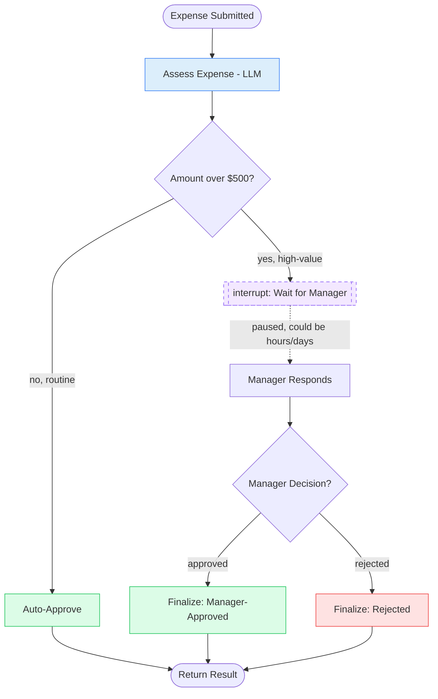

# 12. Human Approval Workflow

## 12.1 What is it?

A **Human Approval Workflow** pauses the graph at a specific point, waits —
for as long as it takes, even hours or days — for a **person** to review
something and respond, and then **resumes exactly where it left off** using
that person's answer. This is different from every pattern so far: it's the
first one where the "next step" isn't code running automatically, but a
human being.

LangGraph has built-in support for this via its **`interrupt()`** function
and **checkpointer** system: calling `interrupt()` inside a node pauses the
whole graph and saves its state; later, invoking the graph again with a
`Command(resume=...)` picks that exact node back up with the human's answer.

## 12.2 What problem does it solve?

Some actions are risky, expensive, or irreversible enough that a fully
automated decision isn't appropriate, no matter how good the AI reasoning
behind it is. But building "wait for a human" *yourself* is surprisingly
hard: you'd need to persist the entire in-progress state somewhere, stop
your program without losing it, and later reconstruct everything correctly
to continue — potentially hours or days after the pause started.

The Human Approval Workflow pattern solves this by:

- Making the **pause and resume mechanics automatic** — LangGraph's
  checkpointer handles saving and restoring the exact in-progress state, so
  developers don't hand-roll that persistence logic.
- Letting execution be **paused indefinitely** — a human might respond in 10
  seconds or 2 days; the graph just waits, using no compute in between.
- Keeping the **decision point explicit in the graph** — it's obvious from
  reading the graph exactly which step requires a human, rather than that
  logic being buried in application code outside the workflow.
- Cleanly **combining automated and manual decisions** in one workflow — the
  easy, low-risk cases can still be fully automatic, while only the risky
  ones stop for a person.

## 12.3 Realistic production example: High-Value Expense Approval

A company's internal tool (`ExpenseFlow`) processes employee expense
reports:

1. **Assess Expense** — an LLM checks the expense against policy (amount,
   category, description) and classifies it as **routine** (auto-approvable)
   or **high-value** (needs a manager's sign-off) — here, anything over
   $500.
2. **Routine expenses** are approved automatically and immediately.
3. **High-value expenses** trigger `interrupt()` — the graph **pauses**,
   surfacing the expense details to a manager's approval queue. The
   workflow does nothing further until that manager actually responds.
4. When the manager approves or rejects (through whatever UI or API calls
   back into the graph with a `Command(resume=...)`), the graph **resumes
   from exactly that point**, using their decision to finalize the expense.

## 12.4 Architecture / Flow Diagram



The dashed box represents the graph being **completely paused** — no compute
running, state safely persisted — until the manager's response arrives,
however long that takes.

## 12.5 Request-to-response flow, step by step

1. A client sends expense details to `submit_expense()`, which invokes the
   graph with a specific `thread_id` in its config — this ID is what lets us
   find and resume this exact paused run later.
2. **`assess_expense`** makes an LLM call to check the expense against
   policy and writes `state.needs_approval` (`True` if amount > $500).
3. A **conditional edge** checks `needs_approval`: `False` → `auto_approve`
   (the graph finishes immediately, no pause); `True` →
   `request_human_approval`.
4. **`request_human_approval`** calls **`interrupt(payload)`**, where
   `payload` is a JSON-serializable summary of the expense. This call
   **raises a special exception that LangGraph catches**, saving the
   complete graph state via the checkpointer and returning control to the
   caller — the graph is now paused, and `submit_expense()` returns with the
   interrupt payload instead of a final result.
5. **Time passes** — this could be seconds or days. A manager, somewhere
   else entirely (a web dashboard, a Slack approval button), eventually
   makes a decision.
6. That decision is sent back via `resume_expense_approval()`, which invokes
   the **same graph, same `thread_id`**, with
   `Command(resume={"decision": "approved", "comment": "..."})`.
7. LangGraph restores the exact saved state and **resumes inside
   `request_human_approval`**, where the `interrupt()` call now *returns*
   the resume value instead of pausing again. The node writes that decision
   into state.
8. A conditional edge routes to `finalize_manager_approved` or
   `finalize_rejected` based on the decision, and the graph reaches `END`.

## 12.6 Why this pattern fits this problem

- **High-value expenses genuinely warrant a person's judgment** — policy
  rules can't capture every context a manager might have about a specific
  expense, and the financial stakes justify the wait.
- **The pause has to survive arbitrary real-world delays** — a manager on
  vacation might not respond for days; hand-rolling "keep this Python
  process alive and waiting" for that long isn't realistic, which is exactly
  why LangGraph's checkpointer-backed `interrupt()` exists.
- **Routine expenses stay fast** — the conditional check before the
  interrupt means most expenses (the ones under $500) never pause at all,
  so the human-in-the-loop mechanism only adds friction where it's actually
  needed.
- **The resume happens from a completely separate process invocation** —
  the checkpointer means the manager's response can arrive through an
  entirely different part of the system (a web server handling their
  approval-button click) days after the original request, and the graph
  picks up exactly where it left off.

## 12.7 Production-quality implementation

```python
"""
Human Approval Workflow — High-Value Expense Approval
Pattern: pause the graph with interrupt(), wait indefinitely for a human
decision, resume exactly where it left off with Command(resume=...)

Run:
    pip install "langgraph==1.2.10" "langchain==1.3.14" "langchain-ollama==1.1.0" "pydantic==2.9.2"
    ollama pull llama3.1:8b     # make sure Ollama is running locally
    python expense_approval.py
"""

from __future__ import annotations

import logging
from typing import Optional

from langchain_ollama import ChatOllama
from langgraph.checkpoint.memory import InMemorySaver
from langgraph.graph import StateGraph, START, END
from langgraph.types import Command, interrupt
from pydantic import BaseModel

# --------------------------------------------------------------------------
# 1. Logging
# --------------------------------------------------------------------------
logging.basicConfig(
    level=logging.INFO,
    format="%(asctime)s | %(levelname)s | %(name)s | %(message)s",
)
logger = logging.getLogger("expense_approval")


# --------------------------------------------------------------------------
# 2. Shared state
# --------------------------------------------------------------------------
class ExpenseState(BaseModel):
    expense_id: str = ""
    employee_name: str = ""
    amount: float = 0.0
    category: str = ""
    description: str = ""

    needs_approval: Optional[bool] = None
    ai_note: Optional[str] = None

    manager_decision: Optional[str] = None  # "approved" | "rejected"
    manager_comment: Optional[str] = None

    final_status: Optional[str] = None


_llm = ChatOllama(model="llama3.1:8b", temperature=0)
_APPROVAL_THRESHOLD = 500.0


# --------------------------------------------------------------------------
# 3. Node — Assess Expense (LLM checks policy, decides if approval is needed)
# --------------------------------------------------------------------------
_ASSESS_PROMPT = """Briefly note anything unusual about this expense in ONE
short sentence (or say "Nothing unusual." if it looks routine).

Amount: ${amount:,.2f}
Category: {category}
Description: {description}
"""


def assess_expense(state: ExpenseState) -> dict:
    logger.info("ASSESS — expense %s, amount $%.2f", state.expense_id, state.amount)

    try:
        response = _llm.invoke(
            _ASSESS_PROMPT.format(
                amount=state.amount, category=state.category, description=state.description
            )
        )
        note = response.content.strip()
    except Exception as exc:  # noqa: BLE001
        logger.error("assess_expense LLM call failed: %s", exc)
        note = "Automated review unavailable."

    return {"needs_approval": state.amount > _APPROVAL_THRESHOLD, "ai_note": note}


def route_by_amount(state: ExpenseState) -> str:
    return "request_human_approval" if state.needs_approval else "auto_approve"


# --------------------------------------------------------------------------
# 4. Node — Auto-Approve (routine expenses, no pause)
# --------------------------------------------------------------------------
def auto_approve(state: ExpenseState) -> dict:
    logger.info("AUTO-APPROVE — expense %s under threshold", state.expense_id)
    return {"final_status": "auto_approved"}


# --------------------------------------------------------------------------
# 5. Node — Request Human Approval (THIS is where the graph pauses).
#    interrupt(payload) raises a special exception on first call, which
#    LangGraph catches to save state and return payload to the caller.
#    On RESUME, this same line instead returns the value passed via
#    Command(resume=...) -- execution continues from right here.
# --------------------------------------------------------------------------
def request_human_approval(state: ExpenseState) -> dict:
    logger.info("PAUSE — expense %s needs manager approval", state.expense_id)

    decision = interrupt(
        {
            "expense_id": state.expense_id,
            "employee_name": state.employee_name,
            "amount": state.amount,
            "category": state.category,
            "description": state.description,
            "ai_note": state.ai_note,
            "question": "Approve or reject this expense?",
        }
    )
    # Execution only reaches here AFTER a resume -- `decision` is exactly
    # whatever was passed to Command(resume=...).
    logger.info("RESUME — manager responded: %s", decision)

    return {
        "manager_decision": decision.get("decision"),
        "manager_comment": decision.get("comment", ""),
    }


def route_by_decision(state: ExpenseState) -> str:
    return "finalize_manager_approved" if state.manager_decision == "approved" else "finalize_rejected"


# --------------------------------------------------------------------------
# 6. Finalize nodes
# --------------------------------------------------------------------------
def finalize_manager_approved(state: ExpenseState) -> dict:
    logger.info("FINALIZE — manager approved expense %s", state.expense_id)
    return {"final_status": "manager_approved"}


def finalize_rejected(state: ExpenseState) -> dict:
    logger.info("FINALIZE — manager rejected expense %s", state.expense_id)
    return {"final_status": "rejected"}


# --------------------------------------------------------------------------
# 7. Build the graph.
#    A checkpointer is REQUIRED for interrupt()/resume to work -- it's what
#    persists the paused state between the initial call and the resume call
#    (which, in production, are typically two completely separate requests).
# --------------------------------------------------------------------------
def build_graph():
    graph = StateGraph(ExpenseState)

    graph.add_node("assess_expense", assess_expense)
    graph.add_node("auto_approve", auto_approve)
    graph.add_node("request_human_approval", request_human_approval)
    graph.add_node("finalize_manager_approved", finalize_manager_approved)
    graph.add_node("finalize_rejected", finalize_rejected)

    graph.add_edge(START, "assess_expense")

    graph.add_conditional_edges(
        "assess_expense",
        route_by_amount,
        {"auto_approve": "auto_approve", "request_human_approval": "request_human_approval"},
    )

    graph.add_conditional_edges(
        "request_human_approval",
        route_by_decision,
        {
            "finalize_manager_approved": "finalize_manager_approved",
            "finalize_rejected": "finalize_rejected",
        },
    )

    graph.add_edge("auto_approve", END)
    graph.add_edge("finalize_manager_approved", END)
    graph.add_edge("finalize_rejected", END)

    # InMemorySaver is fine for a demo; production systems use a durable
    # checkpointer (e.g. PostgresSaver) so a paused thread survives a
    # server restart while waiting on a human for hours or days.
    checkpointer = InMemorySaver()
    return graph.compile(checkpointer=checkpointer)


_app = build_graph()


# --------------------------------------------------------------------------
# 8. Public entry points — submitting is one call; approving is a SEPARATE
#    call, potentially made much later by a completely different part of
#    the system (e.g. a manager clicking "Approve" in a web dashboard).
# --------------------------------------------------------------------------
def submit_expense(expense: dict) -> dict:
    thread_config = {"configurable": {"thread_id": expense["expense_id"]}}
    initial_state = ExpenseState(**expense)
    result = _app.invoke(initial_state, config=thread_config)

    if "__interrupt__" in result:
        # The graph is paused -- surface the interrupt payload to whatever
        # system routes this to a manager (dashboard, Slack, email, etc.).
        return {"status": "pending_approval", "interrupt": result["__interrupt__"][0].value}
    return result


def resume_expense_approval(expense_id: str, decision: str, comment: str = "") -> dict:
    thread_config = {"configurable": {"thread_id": expense_id}}
    result = _app.invoke(
        Command(resume={"decision": decision, "comment": comment}),
        config=thread_config,
    )
    return result


# --------------------------------------------------------------------------
# 9. Demo — simulates a full submit -> pause -> (time passes) -> resume cycle
# --------------------------------------------------------------------------
if __name__ == "__main__":
    expense = {
        "expense_id": "EXP-3301",
        "employee_name": "Sam Okafor",
        "amount": 1450.00,
        "category": "Travel",
        "description": "Flight + hotel for client site visit.",
    }

    pending = submit_expense(expense)
    print("After submission:", pending["status"])
    print("Manager sees:", pending["interrupt"]["question"], f"(${pending['interrupt']['amount']:,.2f})")

    # ... time passes; a manager reviews it in a dashboard and approves ...

    final = resume_expense_approval("EXP-3301", decision="approved", comment="Looks reasonable.")
    print("Final status:", final["final_status"])
```

**Notes on production-readiness choices made above:**

- **A checkpointer is mandatory, not optional**, for `interrupt()` to work —
  it's the mechanism that lets `submit_expense()` and
  `resume_expense_approval()` be two **completely separate function calls**
  (in production, two separate HTTP requests, possibly days apart) that
  still operate on the same in-progress graph run.
- **The `thread_id` is the link between the pause and the resume** — it must
  be the same value both times (here, the expense ID itself, since it's
  already a natural unique identifier).
- **Routine expenses skip the interrupt entirely** — the conditional edge
  before `request_human_approval` means the pause-and-wait machinery is only
  invoked for the cases that actually need it, keeping the common case fast.
- **The code before `interrupt()` re-runs on resume** — this is a real
  LangGraph behavior worth knowing: when the graph resumes, `assess_expense`
  is *not* re-run (it already completed), but any code *inside*
  `request_human_approval` before the `interrupt()` call would re-run. Here
  that's just logging, but in general, side effects placed before an
  `interrupt()` call in the same node should be safe to repeat (e.g., an
  "upsert" instead of an "insert").

---

⬅ [11. Fallback Pattern](11-fallback-pattern.md) | [Back to index](README.md) | Next: [13. Event-Driven Workflow](13-event-driven-workflow.md) ➡
