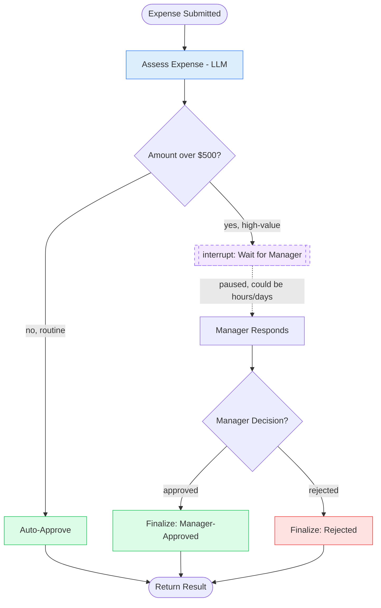

# 12. Human Approval Workflow

## 12.1 What is it?

A **Human Approval Workflow** pauses the graph at a specific point, waits —
for as long as it takes, even hours or days — for a **person** to review
something and respond, and then **resumes exactly where it left off** using
that person's answer. This is different from every pattern so far: it's the
first one where the "next step" isn't code running automatically, but a
human being.

LangGraph has built-in support for this via its **`interrupt()`** function
and **checkpointer** system: calling `interrupt()` inside a node pauses the
whole graph and saves its state; later, invoking the graph again with a
`Command(resume=...)` picks that exact node back up with the human's answer.

## 12.2 What problem does it solve?

Some actions are risky, expensive, or irreversible enough that a fully
automated decision isn't appropriate, no matter how good the AI reasoning
behind it is. But building "wait for a human" *yourself* is surprisingly
hard: you'd need to persist the entire in-progress state somewhere, stop
your program without losing it, and later reconstruct everything correctly
to continue — potentially hours or days after the pause started.

The Human Approval Workflow pattern solves this by:

- Making the **pause and resume mechanics automatic** — LangGraph's
  checkpointer handles saving and restoring the exact in-progress state, so
  developers don't hand-roll that persistence logic.
- Letting execution be **paused indefinitely** — a human might respond in 10
  seconds or 2 days; the graph just waits, using no compute in between.
- Keeping the **decision point explicit in the graph** — it's obvious from
  reading the graph exactly which step requires a human, rather than that
  logic being buried in application code outside the workflow.
- Cleanly **combining automated and manual decisions** in one workflow — the
  easy, low-risk cases can still be fully automatic, while only the risky
  ones stop for a person.

## 12.3 Realistic production example: High-Value Expense Approval

A company's internal tool (`ExpenseFlow`) processes employee expense
reports:

1. **Assess Expense** — an LLM checks the expense against policy (amount,
   category, description) and classifies it as **routine** (auto-approvable)
   or **high-value** (needs a manager's sign-off) — here, anything over
   $500.
2. **Routine expenses** are approved automatically and immediately.
3. **High-value expenses** trigger `interrupt()` — the graph **pauses**,
   surfacing the expense details to a manager's approval queue. The
   workflow does nothing further until that manager actually responds.
4. When the manager approves or rejects (through whatever UI or API calls
   back into the graph with a `Command(resume=...)`), the graph **resumes
   from exactly that point**, using their decision to finalize the expense.

## 12.4 Architecture / Flow Diagram


```mermaid
flowchart TD
    Start([Expense Submitted]) --> Assess[Assess Expense - LLM]
    Assess --> Check{Amount over $500?}
    Check -->|no, routine| Auto[Auto-Approve]
    Check -->|yes, high-value| Pause[[interrupt: Wait for Manager]]
    Pause -.->|paused, could be hours/days| Resume[Manager Responds]
    Resume --> Decision{Manager Decision?}
    Decision -->|approved| ManApproved[Finalize: Manager-Approved]
    Decision -->|rejected| Rejected[Finalize: Rejected]
    Auto --> End([Return Result])
    ManApproved --> End
    Rejected --> End

    style Assess fill:#DCEEFB,stroke:#3B82F6
    style Pause fill:#F3E8FF,stroke:#8B5CF6,stroke-dasharray: 5 5
    style Auto fill:#DCFCE7,stroke:#22C55E
    style ManApproved fill:#DCFCE7,stroke:#22C55E
    style Rejected fill:#FEE2E2,stroke:#EF4444
```

The dashed box represents the graph being **completely paused** — no compute
running, state safely persisted — until the manager's response arrives,
however long that takes.

## 12.5 Request-to-response flow, step by step

1. A client sends expense details to `submit_expense()`, which invokes the
   graph with a specific `thread_id` in its config — this ID is what lets us
   find and resume this exact paused run later.
2. **`assess_expense`** makes an LLM call to check the expense against
   policy and writes `state.needs_approval` (`True` if amount > $500).
3. A **conditional edge** checks `needs_approval`: `False` → `auto_approve`
   (the graph finishes immediately, no pause); `True` →
   `request_human_approval`.
4. **`request_human_approval`** calls **`interrupt(payload)`**, where
   `payload` is a JSON-serializable summary of the expense. This call
   **raises a special exception that LangGraph catches**, saving the
   complete graph state via the checkpointer and returning control to the
   caller — the graph is now paused, and `submit_expense()` returns with the
   interrupt payload instead of a final result.
5. **Time passes** — this could be seconds or days. A manager, somewhere
   else entirely (a web dashboard, a Slack approval button), eventually
   makes a decision.
6. That decision is sent back via `resume_expense_approval()`, which invokes
   the **same graph, same `thread_id`**, with
   `Command(resume={"decision": "approved", "comment": "..."})`.
7. LangGraph restores the exact saved state and **resumes inside
   `request_human_approval`**, where the `interrupt()` call now *returns*
   the resume value instead of pausing again. The node writes that decision
   into state.
8. A conditional edge routes to `finalize_manager_approved` or
   `finalize_rejected` based on the decision, and the graph reaches `END`.

## 12.6 Why this pattern fits this problem

- **High-value expenses genuinely warrant a person's judgment** — policy
  rules can't capture every context a manager might have about a specific
  expense, and the financial stakes justify the wait.
- **The pause has to survive arbitrary real-world delays** — a manager on
  vacation might not respond for days; hand-rolling "keep this Python
  process alive and waiting" for that long isn't realistic, which is exactly
  why LangGraph's checkpointer-backed `interrupt()` exists.
- **Routine expenses stay fast** — the conditional check before the
  interrupt means most expenses (the ones under $500) never pause at all,
  so the human-in-the-loop mechanism only adds friction where it's actually
  needed.
- **The resume happens from a completely separate process invocation** —
  the checkpointer means the manager's response can arrive through an
  entirely different part of the system (a web server handling their
  approval-button click) days after the original request, and the graph
  picks up exactly where it left off.

## 12.7 Production-quality implementation

```python
"""
Human Approval Workflow — High-Value Expense Approval
Pattern: pause the graph with interrupt(), wait indefinitely for a human
decision, resume exactly where it left off with Command(resume=...)

Run:
    pip install "langgraph==1.2.10" "langchain==1.3.14" "langchain-ollama==1.1.0" "pydantic==2.9.2"
    ollama pull llama3.1:8b     # make sure Ollama is running locally
    python expense_approval.py
"""

from __future__ import annotations

import logging
from typing import Optional

from langchain_ollama import ChatOllama
from langgraph.checkpoint.memory import InMemorySaver
from langgraph.graph import StateGraph, START, END
from langgraph.types import Command, interrupt
from pydantic import BaseModel

# --------------------------------------------------------------------------
# 1. Logging
# --------------------------------------------------------------------------
logging.basicConfig(
    level=logging.INFO,
    format="%(asctime)s | %(levelname)s | %(name)s | %(message)s",
)
logger = logging.getLogger("expense_approval")


# --------------------------------------------------------------------------
# 2. Shared state
# --------------------------------------------------------------------------
class ExpenseState(BaseModel):
    expense_id: str = ""
    employee_name: str = ""
    amount: float = 0.0
    category: str = ""
    description: str = ""

    needs_approval: Optional[bool] = None
    ai_note: Optional[str] = None

    manager_decision: Optional[str] = None  # "approved" | "rejected"
    manager_comment: Optional[str] = None

    final_status: Optional[str] = None


_llm = ChatOllama(model="llama3.1:8b", temperature=0)
_APPROVAL_THRESHOLD = 500.0


# --------------------------------------------------------------------------
# 3. Node — Assess Expense (LLM checks policy, decides if approval is needed)
# --------------------------------------------------------------------------
_ASSESS_PROMPT = """Briefly note anything unusual about this expense in ONE
short sentence (or say "Nothing unusual." if it looks routine).

Amount: ${amount:,.2f}
Category: {category}
Description: {description}
"""


def assess_expense(state: ExpenseState) -> dict:
    logger.info("ASSESS — expense %s, amount $%.2f", state.expense_id, state.amount)

    try:
        response = _llm.invoke(
            _ASSESS_PROMPT.format(
                amount=state.amount, category=state.category, description=state.description
            )
        )
        note = response.content.strip()
    except Exception as exc:  # noqa: BLE001
        logger.error("assess_expense LLM call failed: %s", exc)
        note = "Automated review unavailable."

    return {"needs_approval": state.amount > _APPROVAL_THRESHOLD, "ai_note": note}


def route_by_amount(state: ExpenseState) -> str:
    return "request_human_approval" if state.needs_approval else "auto_approve"


# --------------------------------------------------------------------------
# 4. Node — Auto-Approve (routine expenses, no pause)
# --------------------------------------------------------------------------
def auto_approve(state: ExpenseState) -> dict:
    logger.info("AUTO-APPROVE — expense %s under threshold", state.expense_id)
    return {"final_status": "auto_approved"}


# --------------------------------------------------------------------------
# 5. Node — Request Human Approval (THIS is where the graph pauses).
#    interrupt(payload) raises a special exception on first call, which
#    LangGraph catches to save state and return payload to the caller.
#    On RESUME, this same line instead returns the value passed via
#    Command(resume=...) -- execution continues from right here.
# --------------------------------------------------------------------------
def request_human_approval(state: ExpenseState) -> dict:
    logger.info("PAUSE — expense %s needs manager approval", state.expense_id)

    decision = interrupt(
        {
            "expense_id": state.expense_id,
            "employee_name": state.employee_name,
            "amount": state.amount,
            "category": state.category,
            "description": state.description,
            "ai_note": state.ai_note,
            "question": "Approve or reject this expense?",
        }
    )
    # Execution only reaches here AFTER a resume -- `decision` is exactly
    # whatever was passed to Command(resume=...).
    logger.info("RESUME — manager responded: %s", decision)

    return {
        "manager_decision": decision.get("decision"),
        "manager_comment": decision.get("comment", ""),
    }


def route_by_decision(state: ExpenseState) -> str:
    return "finalize_manager_approved" if state.manager_decision == "approved" else "finalize_rejected"


# --------------------------------------------------------------------------
# 6. Finalize nodes
# --------------------------------------------------------------------------
def finalize_manager_approved(state: ExpenseState) -> dict:
    logger.info("FINALIZE — manager approved expense %s", state.expense_id)
    return {"final_status": "manager_approved"}


def finalize_rejected(state: ExpenseState) -> dict:
    logger.info("FINALIZE — manager rejected expense %s", state.expense_id)
    return {"final_status": "rejected"}


# --------------------------------------------------------------------------
# 7. Build the graph.
#    A checkpointer is REQUIRED for interrupt()/resume to work -- it's what
#    persists the paused state between the initial call and the resume call
#    (which, in production, are typically two completely separate requests).
# --------------------------------------------------------------------------
def build_graph():
    graph = StateGraph(ExpenseState)

    graph.add_node("assess_expense", assess_expense)
    graph.add_node("auto_approve", auto_approve)
    graph.add_node("request_human_approval", request_human_approval)
    graph.add_node("finalize_manager_approved", finalize_manager_approved)
    graph.add_node("finalize_rejected", finalize_rejected)

    graph.add_edge(START, "assess_expense")

    graph.add_conditional_edges(
        "assess_expense",
        route_by_amount,
        {"auto_approve": "auto_approve", "request_human_approval": "request_human_approval"},
    )

    graph.add_conditional_edges(
        "request_human_approval",
        route_by_decision,
        {
            "finalize_manager_approved": "finalize_manager_approved",
            "finalize_rejected": "finalize_rejected",
        },
    )

    graph.add_edge("auto_approve", END)
    graph.add_edge("finalize_manager_approved", END)
    graph.add_edge("finalize_rejected", END)

    # InMemorySaver is fine for a demo; production systems use a durable
    # checkpointer (e.g. PostgresSaver) so a paused thread survives a
    # server restart while waiting on a human for hours or days.
    checkpointer = InMemorySaver()
    return graph.compile(checkpointer=checkpointer)


_app = build_graph()


# --------------------------------------------------------------------------
# 8. Public entry points — submitting is one call; approving is a SEPARATE
#    call, potentially made much later by a completely different part of
#    the system (e.g. a manager clicking "Approve" in a web dashboard).
# --------------------------------------------------------------------------
def submit_expense(expense: dict) -> dict:
    thread_config = {"configurable": {"thread_id": expense["expense_id"]}}
    initial_state = ExpenseState(**expense)
    result = _app.invoke(initial_state, config=thread_config)

    if "__interrupt__" in result:
        # The graph is paused -- surface the interrupt payload to whatever
        # system routes this to a manager (dashboard, Slack, email, etc.).
        return {"status": "pending_approval", "interrupt": result["__interrupt__"][0].value}
    return result


def resume_expense_approval(expense_id: str, decision: str, comment: str = "") -> dict:
    thread_config = {"configurable": {"thread_id": expense_id}}
    result = _app.invoke(
        Command(resume={"decision": decision, "comment": comment}),
        config=thread_config,
    )
    return result


# --------------------------------------------------------------------------
# 9. Demo — simulates a full submit -> pause -> (time passes) -> resume cycle
# --------------------------------------------------------------------------
if __name__ == "__main__":
    expense = {
        "expense_id": "EXP-3301",
        "employee_name": "Sam Okafor",
        "amount": 1450.00,
        "category": "Travel",
        "description": "Flight + hotel for client site visit.",
    }

    pending = submit_expense(expense)
    print("After submission:", pending["status"])
    print("Manager sees:", pending["interrupt"]["question"], f"(${pending['interrupt']['amount']:,.2f})")

    # ... time passes; a manager reviews it in a dashboard and approves ...

    final = resume_expense_approval("EXP-3301", decision="approved", comment="Looks reasonable.")
    print("Final status:", final["final_status"])
```

**Notes on production-readiness choices made above:**

- **A checkpointer is mandatory, not optional**, for `interrupt()` to work —
  it's the mechanism that lets `submit_expense()` and
  `resume_expense_approval()` be two **completely separate function calls**
  (in production, two separate HTTP requests, possibly days apart) that
  still operate on the same in-progress graph run.
- **The `thread_id` is the link between the pause and the resume** — it must
  be the same value both times (here, the expense ID itself, since it's
  already a natural unique identifier).
- **Routine expenses skip the interrupt entirely** — the conditional edge
  before `request_human_approval` means the pause-and-wait machinery is only
  invoked for the cases that actually need it, keeping the common case fast.
- **The code before `interrupt()` re-runs on resume** — this is a real
  LangGraph behavior worth knowing: when the graph resumes, `assess_expense`
  is *not* re-run (it already completed), but any code *inside*
  `request_human_approval` before the `interrupt()` call would re-run. Here
  that's just logging, but in general, side effects placed before an
  `interrupt()` call in the same node should be safe to repeat (e.g., an
  "upsert" instead of an "insert").

---

⬅ [11. Fallback Pattern](11-fallback-pattern.md) | [Back to index](README.md) | Next: [13. Event-Driven Workflow](13-event-driven-workflow.md) ➡

# High-Value Expense Approval — Human-in-the-Loop (Java + Spring AI)

A Java port of the LangGraph human-approval workflow — pause execution indefinitely waiting for a
human decision, then resume exactly where it left off, potentially hours or days later and via a
completely different request. Built on:

- **Java 25** (current LTS)
- **Spring Boot 4.1.0** with **Spring Data JPA** (the checkpointer's job becomes a real database row)
- **Spring AI 2.0.0** (GA) with the **Ollama** starter, mirroring `llama3.1:8b`

## Mapping the shape — this one needs real persistence, not just a different control-flow idiom

Every other pattern in this series translated a LangGraph *control-flow* idea (a loop, a branch, a
fan-out) into a Java control-flow idea. This one is different: `interrupt()` and
`Command(resume=...)` aren't control flow, they're **durable pause/resume across two unrelated
HTTP requests**, backed by LangGraph's checkpointer. Java has no equivalent language or framework
primitive for "suspend this method call and resume it later, possibly on a different server" —
what Spring gives you instead is the normal, idiomatic way this is actually built in production
systems: **persist the paused state as a row in a database**, return an identifier, and let a
second, independent request load that row and continue.

This is worth calling out explicitly: the Python demo's own comment says `InMemorySaver` is
"fine for a demo" and production systems use a durable checkpointer like `PostgresSaver` — the
Java port below *is* that durable version, using Spring Data JPA instead of an in-memory map.

| LangGraph concept | Spring / Java equivalent |
|---|---|
| `ExpenseState` (Pydantic model) | `ExpenseApproval` JPA `@Entity` — the persisted row *is* the paused state |
| `interrupt(payload)` pausing the graph | Returning an `ExpenseApprovalResponse` with `status = PENDING_APPROVAL` and **saving** the entity, instead of continuing execution |
| `InMemorySaver` / `PostgresSaver` checkpointer | The `ExpenseApprovalRepository` (Spring Data JPA) — literally a durable checkpoint store |
| `thread_id` (keys a paused run) | `expenseId`, the entity's `@Id` |
| `Command(resume={...})` on a later call | A separate `POST /api/expenses/{id}/decision` endpoint that loads the row and finishes the workflow |
| `"__interrupt__"` sentinel in the result dict | An explicit `ApprovalStatus.PENDING_APPROVAL` enum value on the response |
| Everything after `assess_expense` running in one process | Split across two HTTP requests, exactly as the Python version's own `submit_expense` / `resume_expense_approval` split already implies in production |

---

## Project structure

```
expense-approval/
├── pom.xml
└── src/main/java/com/example/expenseapproval/
    ├── ExpenseApprovalApplication.java
    ├── domain/
    │   ├── ExpenseApproval.java        (JPA entity — the durable "paused state")
    │   ├── ApprovalStatus.java
    │   └── ExpenseApprovalRepository.java
    ├── model/
    │   ├── ExpenseSubmission.java
    │   ├── ExpenseApprovalResponse.java
    │   └── ManagerDecisionRequest.java
    ├── pipeline/
    │   ├── ExpenseAssessmentStep.java
    │   ├── ExpenseSubmissionService.java
    │   └── ExpenseDecisionService.java
    └── web/
        └── ExpenseApprovalController.java
└── src/main/resources/
    └── application.yml
```

There's deliberately no `ExpenseApprovalRunner` CLI demo here (unlike every other port in this
series) — a same-process, single-run demo would misrepresent the whole point of the pattern,
which is that submission and approval happen in **separate** requests, possibly from separate
systems. The "Running it" section below shows the equivalent two-`curl`-calls demo instead.

---

## `pom.xml`

```xml
<?xml version="1.0" encoding="UTF-8"?>
<project xmlns="http://maven.apache.org/POM/4.0.0"
         xmlns:xsi="http://www.w3.org/2001/XMLSchema-instance"
         xsi:schemaLocation="http://maven.apache.org/POM/4.0.0 https://maven.apache.org/xsd/maven-4.0.0.xsd">
    <modelVersion>4.0.0</modelVersion>

    <groupId>com.example</groupId>
    <artifactId>expense-approval</artifactId>
    <version>1.0.0</version>
    <packaging>jar</packaging>

    <properties>
        <java.version>25</java.version>
        <spring-ai.version>2.0.0</spring-ai.version>
    </properties>

    <parent>
        <groupId>org.springframework.boot</groupId>
        <artifactId>spring-boot-starter-parent</artifactId>
        <version>4.1.0</version>
        <relativePath/>
    </parent>

    <dependencyManagement>
        <dependencies>
            <dependency>
                <groupId>org.springframework.ai</groupId>
                <artifactId>spring-ai-bom</artifactId>
                <version>${spring-ai.version}</version>
                <type>pom</type>
                <scope>import</scope>
            </dependency>
        </dependencies>
    </dependencyManagement>

    <dependencies>
        <dependency>
            <groupId>org.springframework.boot</groupId>
            <artifactId>spring-boot-starter-web</artifactId>
        </dependency>
        <!-- This is the "durable checkpointer" — swap the H2 runtime dependency below
             for a PostgreSQL driver in production, exactly as the Python demo's own
             comment suggests swapping InMemorySaver for PostgresSaver. -->
        <dependency>
            <groupId>org.springframework.boot</groupId>
            <artifactId>spring-boot-starter-data-jpa</artifactId>
        </dependency>
        <dependency>
            <groupId>com.h2database</groupId>
            <artifactId>h2</artifactId>
            <scope>runtime</scope>
        </dependency>
        <!-- Ollama model starter — local llama3.1:8b, same as langchain-ollama -->
        <dependency>
            <groupId>org.springframework.ai</groupId>
            <artifactId>spring-ai-starter-model-ollama</artifactId>
        </dependency>
        <dependency>
            <groupId>org.springframework.boot</groupId>
            <artifactId>spring-boot-starter-test</artifactId>
            <scope>test</scope>
        </dependency>
    </dependencies>

    <build>
        <plugins>
            <plugin>
                <groupId>org.springframework.boot</groupId>
                <artifactId>spring-boot-maven-plugin</artifactId>
            </plugin>
        </plugins>
    </build>
</project>
```

## `src/main/resources/application.yml`

```yaml
spring:
  application:
    name: expense-approval
  datasource:
    url: jdbc:h2:mem:expense-approval;DB_CLOSE_DELAY=-1
    driver-class-name: org.h2.Driver
  jpa:
    hibernate:
      ddl-auto: update
    open-in-view: false
  ai:
    ollama:
      base-url: http://localhost:11434
      chat:
        options:
          model: llama3.1:8b
          temperature: 0.0

logging:
  level:
    com.example.expenseapproval: INFO
```

> Swap the H2 `datasource`/dependency for PostgreSQL (or whatever durable store you already run)
> to move this from demo to production — the application code above the `datasource:` line
> doesn't change, which is exactly the point of persisting the paused state through a repository
> abstraction rather than an in-memory structure.

---

## Persisted state — the durable checkpoint

### `domain/ApprovalStatus.java`

```java
package com.example.expenseapproval.domain;

public enum ApprovalStatus {
    PENDING_APPROVAL,
    AUTO_APPROVED,
    MANAGER_APPROVED,
    REJECTED
}
```

### `domain/ExpenseApproval.java`

This entity *is* the paused workflow state — where the Python version relies on the checkpointer
to serialize `ExpenseState` under a `thread_id`, here the row itself, keyed by `expenseId`, plays
that role explicitly.

```java
package com.example.expenseapproval.domain;

import jakarta.persistence.Entity;
import jakarta.persistence.EnumType;
import jakarta.persistence.Enumerated;
import jakarta.persistence.Id;

@Entity
public class ExpenseApproval {

    @Id
    private String expenseId;

    private String employeeName;
    private double amount;
    private String category;
    private String description;

    private boolean needsApproval;
    private String aiNote;

    @Enumerated(EnumType.STRING)
    private ApprovalStatus status;

    private String managerDecision; // "approved" | "rejected", set only after resume
    private String managerComment;

    protected ExpenseApproval() {
        // required by JPA
    }

    public ExpenseApproval(String expenseId, String employeeName, double amount,
                            String category, String description) {
        this.expenseId = expenseId;
        this.employeeName = employeeName;
        this.amount = amount;
        this.category = category;
        this.description = description;
    }

    // -- getters/setters --

    public String getExpenseId() {
        return expenseId;
    }

    public String getEmployeeName() {
        return employeeName;
    }

    public double getAmount() {
        return amount;
    }

    public String getCategory() {
        return category;
    }

    public String getDescription() {
        return description;
    }

    public boolean isNeedsApproval() {
        return needsApproval;
    }

    public void setNeedsApproval(boolean needsApproval) {
        this.needsApproval = needsApproval;
    }

    public String getAiNote() {
        return aiNote;
    }

    public void setAiNote(String aiNote) {
        this.aiNote = aiNote;
    }

    public ApprovalStatus getStatus() {
        return status;
    }

    public void setStatus(ApprovalStatus status) {
        this.status = status;
    }

    public String getManagerDecision() {
        return managerDecision;
    }

    public void setManagerDecision(String managerDecision) {
        this.managerDecision = managerDecision;
    }

    public String getManagerComment() {
        return managerComment;
    }

    public void setManagerComment(String managerComment) {
        this.managerComment = managerComment;
    }
}
```

### `domain/ExpenseApprovalRepository.java`

```java
package com.example.expenseapproval.domain;

import org.springframework.data.jpa.repository.JpaRepository;

public interface ExpenseApprovalRepository extends JpaRepository<ExpenseApproval, String> {
}
```

---

## API models

### `model/ExpenseSubmission.java`

```java
package com.example.expenseapproval.model;

public record ExpenseSubmission(
        String expenseId,
        String employeeName,
        double amount,
        String category,
        String description
) {}
```

### `model/ExpenseApprovalResponse.java`

```java
package com.example.expenseapproval.model;

import com.example.expenseapproval.domain.ApprovalStatus;

public record ExpenseApprovalResponse(
        String expenseId,
        ApprovalStatus status,
        String question,       // populated only when status == PENDING_APPROVAL
        Double amount,
        String aiNote,
        String finalStatus     // populated once resolved: "auto_approved" | "manager_approved" | "rejected"
) {}
```

### `model/ManagerDecisionRequest.java`

```java
package com.example.expenseapproval.model;

public record ManagerDecisionRequest(String decision, String comment) {}
```

---

## Assessment step (runs before the pause point)

### `pipeline/ExpenseAssessmentStep.java`

The direct analogue of `assess_expense` — an LLM call that notes anything unusual, plus the
threshold check that decides whether a pause is needed at all.

```java
package com.example.expenseapproval.pipeline;

import org.slf4j.Logger;
import org.slf4j.LoggerFactory;
import org.springframework.ai.chat.client.ChatClient;
import org.springframework.stereotype.Component;

@Component
public class ExpenseAssessmentStep {

    private static final Logger log = LoggerFactory.getLogger(ExpenseAssessmentStep.class);
    public static final double APPROVAL_THRESHOLD = 500.0;

    private static final String ASSESS_PROMPT = """
            Briefly note anything unusual about this expense in ONE short sentence \
            (or say "Nothing unusual." if it looks routine).

            Amount: ${amount}
            Category: {category}
            Description: {description}
            """;

    public record Assessment(boolean needsApproval, String aiNote) {}

    private final ChatClient chatClient;

    public ExpenseAssessmentStep(ChatClient.Builder chatClientBuilder) {
        this.chatClient = chatClientBuilder.build();
    }

    public Assessment assess(double amount, String category, String description) {
        log.info("ASSESS - amount ${}", amount);
        String note;
        try {
            note = chatClient.prompt()
                    .user(u -> u.text(ASSESS_PROMPT)
                            .param("amount", String.valueOf(amount))
                            .param("category", category)
                            .param("description", description))
                    .call()
                    .content()
                    .strip();
        } catch (Exception e) {
            log.error("assess_expense LLM call failed: {}", e.getMessage());
            note = "Automated review unavailable.";
        }

        return new Assessment(amount > APPROVAL_THRESHOLD, note);
    }
}
```

---

## Submission — the "interrupt" side

### `pipeline/ExpenseSubmissionService.java`

The direct analogue of `submit_expense`. Where the Python version's `interrupt(payload)` call
suspends the running graph in place, this method simply **returns** after saving — the "pause" is
just the fact that no further code runs until a second, separate request arrives.

```java
package com.example.expenseapproval.pipeline;

import com.example.expenseapproval.domain.ApprovalStatus;
import com.example.expenseapproval.domain.ExpenseApproval;
import com.example.expenseapproval.domain.ExpenseApprovalRepository;
import com.example.expenseapproval.model.ExpenseApprovalResponse;
import com.example.expenseapproval.model.ExpenseSubmission;
import org.slf4j.Logger;
import org.slf4j.LoggerFactory;
import org.springframework.stereotype.Service;
import org.springframework.transaction.annotation.Transactional;

@Service
public class ExpenseSubmissionService {

    private static final Logger log = LoggerFactory.getLogger(ExpenseSubmissionService.class);

    private final ExpenseAssessmentStep expenseAssessmentStep;
    private final ExpenseApprovalRepository repository;

    public ExpenseSubmissionService(ExpenseAssessmentStep expenseAssessmentStep,
                                     ExpenseApprovalRepository repository) {
        this.expenseAssessmentStep = expenseAssessmentStep;
        this.repository = repository;
    }

    @Transactional
    public ExpenseApprovalResponse submit(ExpenseSubmission submission) {
        var assessment = expenseAssessmentStep.assess(
                submission.amount(), submission.category(), submission.description());

        var expense = new ExpenseApproval(
                submission.expenseId(), submission.employeeName(), submission.amount(),
                submission.category(), submission.description());
        expense.setNeedsApproval(assessment.needsApproval());
        expense.setAiNote(assessment.aiNote());

        if (!assessment.needsApproval()) {
            log.info("AUTO-APPROVE - expense {} under threshold", submission.expenseId());
            expense.setStatus(ApprovalStatus.AUTO_APPROVED);
            repository.save(expense);
            return new ExpenseApprovalResponse(
                    submission.expenseId(), ApprovalStatus.AUTO_APPROVED, null,
                    submission.amount(), assessment.aiNote(), "auto_approved");
        }

        // This save is the "pause": the workflow's state is now durable, and execution
        // simply ends here until a separate request calls ExpenseDecisionService.decide(...).
        log.info("PAUSE - expense {} needs manager approval", submission.expenseId());
        expense.setStatus(ApprovalStatus.PENDING_APPROVAL);
        repository.save(expense);

        return new ExpenseApprovalResponse(
                submission.expenseId(), ApprovalStatus.PENDING_APPROVAL,
                "Approve or reject this expense?", submission.amount(), assessment.aiNote(), null);
    }
}
```

---

## Decision — the "resume" side

### `pipeline/ExpenseDecisionService.java`

The direct analogue of `resume_expense_approval` — a **separate** call, typically made much
later, by a manager clicking "Approve" in a dashboard. It loads the persisted row exactly where
`submit` left it and finishes the workflow.

```java
package com.example.expenseapproval.pipeline;

import com.example.expenseapproval.domain.ApprovalStatus;
import com.example.expenseapproval.domain.ExpenseApproval;
import com.example.expenseapproval.domain.ExpenseApprovalRepository;
import com.example.expenseapproval.model.ExpenseApprovalResponse;
import com.example.expenseapproval.model.ManagerDecisionRequest;
import org.slf4j.Logger;
import org.slf4j.LoggerFactory;
import org.springframework.stereotype.Service;
import org.springframework.transaction.annotation.Transactional;

import java.util.NoSuchElementException;

@Service
public class ExpenseDecisionService {

    private static final Logger log = LoggerFactory.getLogger(ExpenseDecisionService.class);

    private final ExpenseApprovalRepository repository;

    public ExpenseDecisionService(ExpenseApprovalRepository repository) {
        this.repository = repository;
    }

    @Transactional
    public ExpenseApprovalResponse decide(String expenseId, ManagerDecisionRequest decisionRequest) {
        ExpenseApproval expense = repository.findById(expenseId)
                .orElseThrow(() -> new NoSuchElementException("No pending expense: " + expenseId));

        if (expense.getStatus() != ApprovalStatus.PENDING_APPROVAL) {
            throw new IllegalStateException(
                    "Expense %s is not awaiting approval (status=%s)"
                            .formatted(expenseId, expense.getStatus()));
        }

        // Execution "resumes" here — decisionRequest is exactly what a Command(resume=...)
        // call would have carried in the Python version.
        log.info("RESUME - manager responded: {}", decisionRequest.decision());

        expense.setManagerDecision(decisionRequest.decision());
        expense.setManagerComment(decisionRequest.comment());

        String finalStatus;
        if ("approved".equals(decisionRequest.decision())) {
            log.info("FINALIZE - manager approved expense {}", expenseId);
            expense.setStatus(ApprovalStatus.MANAGER_APPROVED);
            finalStatus = "manager_approved";
        } else {
            log.info("FINALIZE - manager rejected expense {}", expenseId);
            expense.setStatus(ApprovalStatus.REJECTED);
            finalStatus = "rejected";
        }

        repository.save(expense);

        return new ExpenseApprovalResponse(
                expenseId, expense.getStatus(), null, expense.getAmount(),
                expense.getAiNote(), finalStatus);
    }
}
```

---

## Entry point

### `web/ExpenseApprovalController.java`

Two genuinely separate endpoints, matching the Python version's two genuinely separate public
functions.

```java
package com.example.expenseapproval.web;

import com.example.expenseapproval.model.ExpenseApprovalResponse;
import com.example.expenseapproval.model.ExpenseSubmission;
import com.example.expenseapproval.model.ManagerDecisionRequest;
import com.example.expenseapproval.pipeline.ExpenseDecisionService;
import com.example.expenseapproval.pipeline.ExpenseSubmissionService;
import org.springframework.web.bind.annotation.*;

@RestController
@RequestMapping("/api/expenses")
public class ExpenseApprovalController {

    private final ExpenseSubmissionService expenseSubmissionService;
    private final ExpenseDecisionService expenseDecisionService;

    public ExpenseApprovalController(ExpenseSubmissionService expenseSubmissionService,
                                      ExpenseDecisionService expenseDecisionService) {
        this.expenseSubmissionService = expenseSubmissionService;
        this.expenseDecisionService = expenseDecisionService;
    }

    @PostMapping
    public ExpenseApprovalResponse submit(@RequestBody ExpenseSubmission submission) {
        return expenseSubmissionService.submit(submission);
    }

    @PostMapping("/{expenseId}/decision")
    public ExpenseApprovalResponse decide(@PathVariable String expenseId,
                                           @RequestBody ManagerDecisionRequest decision) {
        return expenseDecisionService.decide(expenseId, decision);
    }
}
```

### `ExpenseApprovalApplication.java`

```java
package com.example.expenseapproval;

import org.springframework.boot.SpringApplication;
import org.springframework.boot.autoconfigure.SpringBootApplication;

@SpringBootApplication
public class ExpenseApprovalApplication {
    public static void main(String[] args) {
        SpringApplication.run(ExpenseApprovalApplication.class, args);
    }
}
```

---

## Running it

This is genuinely two separate calls — that gap between them is the entire point of the pattern,
whether it's ten seconds or ten days in a real system:

```bash
ollama pull llama3.1:8b
ollama serve   # if not already running
mvn spring-boot:run

# 1. Submit — this is the "interrupt". The response tells the caller (a dashboard,
#    a Slack bot, whatever) that a human needs to weigh in, and includes everything
#    they need to render that decision UI.
curl -X POST localhost:8080/api/expenses \
  -H "Content-Type: application/json" \
  -d '{"expenseId":"EXP-3301","employeeName":"Sam Okafor","amount":1450.00,"category":"Travel","description":"Flight + hotel for client site visit."}'

# ... time passes; a manager reviews it in a dashboard ...

# 2. Decide — this is the "resume". A completely independent request, made whenever
#    the manager gets around to it, that finishes the workflow exactly where it paused.
curl -X POST localhost:8080/api/expenses/EXP-3301/decision \
  -H "Content-Type: application/json" \
  -d '{"decision":"approved","comment":"Looks reasonable."}'
```

## Notes on the port

- **This is the pattern where "translate the control flow" breaks down**: every earlier port in
  this series (loops, branches, fan-out) had a direct Java control-flow analogue. Pause-and-resume
  across arbitrary wall-clock time doesn't — no JVM thread can practically sit suspended for hours
  or days waiting on a manager. The honest translation isn't a language feature, it's an
  architecture: persist state, return, and let a second request pick it back up. This is exactly
  what LangGraph's checkpointer does *for* you in Python; in Spring, Spring Data JPA plus an
  explicit status field does the same job in plain sight.
- **No in-memory demo runner, on purpose**: every other port in this series has an
  `@Profile("demo")` `CommandLineRunner` that runs the whole thing in one process for convenience.
  Including one here would misrepresent the pattern — there is no single-process version of "wait
  for a human" worth demonstrating; the two-`curl`-call sequence above *is* the demo.
- **`PENDING_APPROVAL` guard on decide()**: `ExpenseDecisionService.decide` explicitly checks the
  expense is still `PENDING_APPROVAL` before applying a decision, preventing a duplicate or
  late-arriving decision request from re-finalizing an expense that's already been resolved —
  a concern the single-process Python demo doesn't have to handle, but any real deployment of
  this pattern (two independent requests, no shared process) does.
- **Threshold and prompt kept identical**: `APPROVAL_THRESHOLD = 500.0` and the assessment prompt
  text are unchanged from `_APPROVAL_THRESHOLD` / `_ASSESS_PROMPT`.
- **Swap H2 for your real durable store to go to production**: only `application.yml`'s
  `datasource` block (and the H2 dependency in `pom.xml`) needs to change — the same shape of
  change the Python demo's own comment describes for swapping `InMemorySaver` → `PostgresSaver`.
