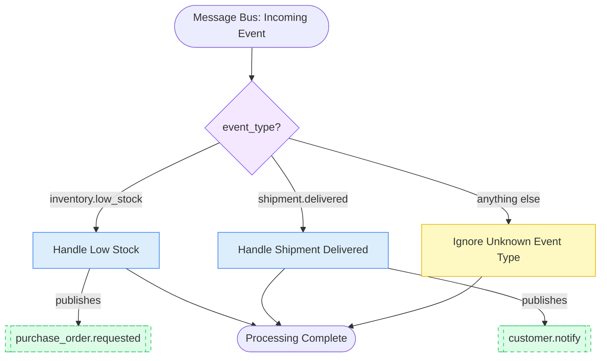

# 13. Event-Driven Workflow

## 13.1 What is it?

An **Event-Driven Workflow** doesn't wait for a direct client request the way
every previous pattern in this series has — instead, it's **triggered by an
event arriving from elsewhere** (a message queue, a webhook, another
system's "something happened" notification), and its job is often to react
by **publishing new events** of its own, rather than calling other systems
directly.

This is a different *triggering and integration style*, not just a different
graph shape. Earlier patterns assumed "a client calls this function and
waits for a result." An Event-Driven Workflow assumes "something happened
somewhere else, a message queue delivered it to us, and other systems are
waiting on messages *we* publish in response" — a decoupled, asynchronous
relationship between systems (often called **choreography**, since no single
system directs the whole process).

## 13.2 What problem does it solve?

In a system made of many independent services (inventory, orders, shipping,
notifications), having every service call every other service directly
creates a tangled web of dependencies — the inventory service would need to
know about, and call, every single system that might care about a stock
change. If a new team adds a new system that also needs to react to
"stock low" moments, every existing publisher would need to be updated to
call it too.

The Event-Driven Workflow pattern solves this by:

- **Decoupling producers from consumers** — a system that experiences
  something (like low stock) just publishes an event; it doesn't need to
  know or care who's listening.
- Letting a workflow **react to real-world happenings** it doesn't control
  the timing of, instead of being invoked on a fixed schedule or a direct
  request.
- Making it easy to **add new event types over time** without breaking
  existing processing — an unrecognized event type should be safely ignored,
  not crash the system.
- Allowing one triggering event to **fan out into further events**, letting
  other independent systems pick up the next step whenever they're ready.

## 13.3 Realistic production example: Warehouse Event Processor

A logistics platform (`WarehouseIQ`) has many independent systems
communicating purely through events on a shared message bus. This workflow
is one **consumer** on that bus, reacting to two event types (with graceful
handling for any others):

1. **`inventory.low_stock`** — published by the warehouse system whenever an
   item's count drops below its reorder point. The workflow checks reorder
   policy and, if a reorder is warranted, **publishes a new event**,
   `purchase_order.requested`, for the (completely separate) procurement
   system to pick up whenever it's ready — this workflow never calls that
   system directly.
2. **`shipment.delivered`** — published by the shipping carrier's webhook
   integration. The workflow drafts a friendly delivery confirmation message
   and **publishes** `customer.notify`, for the (again, separate)
   notification system to actually send.
3. **Any other event type** — safely logged and ignored. New event types get
   added to the platform regularly as other teams build new features; this
   workflow only needs to handle the ones it actually cares about, not
   crash on the rest.

## 13.4 Architecture / Flow Diagram



The dashed boxes represent events **published outward** to the message bus —
this workflow doesn't know or care which system(s) eventually consume them,
which is the essence of the decoupled, event-driven style.

## 13.5 Request-to-response flow, step by step

1. A message-queue consumer (outside this workflow entirely — e.g., an SQS
   or Kafka listener) receives a raw event and calls `process_event(event)`.
2. LangGraph builds the initial `EventState` from the event's `event_type`
   and `payload`, and enters at the dispatch point.
3. A **conditional edge from `START`** reads `event_type` and routes to
   `handle_low_stock`, `handle_shipment_delivered`, or
   `handle_unknown_event` — this is structurally similar to Pattern 5
   (Routing), but the thing being routed is an **external event**, not a
   customer's free-text message.
4. **`handle_low_stock`** applies reorder policy (quantity on hand vs.
   reorder point) and, if warranted, appends a
   `purchase_order.requested` event — with the relevant details — onto
   `state.outbound_events`.
5. **`handle_shipment_delivered`** makes an LLM call to draft a short
   delivery confirmation message, then appends a `customer.notify` event
   (containing that message) onto `state.outbound_events`.
6. **`handle_unknown_event`** simply logs that an unrecognized event type
   arrived and does nothing else — this workflow doesn't own every event
   type on the bus, and that's expected and fine.
7. After the handler node runs, `finalize_and_publish` reads
   `state.outbound_events` and (in this demo) prints each one — in
   production, this would be where each event is actually published to the
   real message bus (Kafka, SQS, etc.) for other systems to consume
   independently.
8. The graph reaches `END`. The caller (the message-queue consumer) simply
   acknowledges the original event as processed.

## 13.6 Why this pattern fits this problem

- **No direct coupling to procurement or notification systems** — this
  workflow publishes events and moves on; it never needs to know how
  procurement processes a purchase order request or how notifications
  actually get sent, and those systems can change independently.
- **New consumers can subscribe to `purchase_order.requested` or
  `customer.notify` later without this workflow changing at all** — that's
  the core benefit of choreography over direct service-to-service calls.
- **Gracefully ignoring unknown event types is essential on a shared bus** —
  a production event bus typically carries many event types from many teams;
  a consumer that crashes on an event type it doesn't recognize would be a
  serious reliability problem.
- **The workflow reacts on its own schedule**, driven entirely by when
  events actually arrive — there's no "polling" or fixed schedule involved,
  which keeps the system responsive without wasted work.

## 13.7 Production-quality implementation

```python
"""
Event-Driven Workflow — Warehouse Event Processor
Pattern: triggered by an external event, dispatches by event type, and
reacts by PUBLISHING new events rather than calling other systems directly

Run:
    pip install "langgraph==1.2.10" "langchain==1.3.14" "langchain-ollama==1.1.0" "pydantic==2.9.2"
    ollama pull llama3.1:8b     # make sure Ollama is running locally
    python warehouse_event_processor.py
"""

from __future__ import annotations

import logging
from typing import Optional

from langchain_ollama import ChatOllama
from langgraph.graph import StateGraph, START, END
from pydantic import BaseModel

# --------------------------------------------------------------------------
# 1. Logging
# --------------------------------------------------------------------------
logging.basicConfig(
    level=logging.INFO,
    format="%(asctime)s | %(levelname)s | %(name)s | %(message)s",
)
logger = logging.getLogger("warehouse_event_processor")


# --------------------------------------------------------------------------
# 2. Shared state
# --------------------------------------------------------------------------
class EventState(BaseModel):
    event_type: str = ""
    payload: dict = {}

    outbound_events: list[dict] = []
    processing_status: Optional[str] = None


_llm = ChatOllama(model="llama3.1:8b", temperature=0.3)

_REORDER_POINT = 20  # units


# --------------------------------------------------------------------------
# 3. Dispatch function — routes purely by event_type.
#    An unrecognized event type routes to a safe no-op handler instead of
#    erroring, since this consumer doesn't own every event type on the bus.
# --------------------------------------------------------------------------
def dispatch_event(state: EventState) -> str:
    return {
        "inventory.low_stock": "handle_low_stock",
        "shipment.delivered": "handle_shipment_delivered",
    }.get(state.event_type, "handle_unknown_event")


# --------------------------------------------------------------------------
# 4. Handler — inventory.low_stock
#    Applies deterministic reorder policy, and PUBLISHES a new event rather
#    than calling the procurement system directly.
# --------------------------------------------------------------------------
def handle_low_stock(state: EventState) -> dict:
    sku = state.payload.get("sku", "unknown")
    quantity_on_hand = state.payload.get("quantity_on_hand", 0)
    logger.info("EVENT — inventory.low_stock for %s (qty=%d)", sku, quantity_on_hand)

    if quantity_on_hand < _REORDER_POINT:
        outbound_event = {
            "event_type": "purchase_order.requested",
            "payload": {
                "sku": sku,
                "requested_quantity": 100,  # simplified: fixed reorder quantity
                "reason": f"Stock ({quantity_on_hand}) below reorder point ({_REORDER_POINT}).",
            },
        }
        return {
            "outbound_events": state.outbound_events + [outbound_event],
            "processing_status": "reorder_requested",
        }

    return {"processing_status": "no_action_needed"}


# --------------------------------------------------------------------------
# 5. Handler — shipment.delivered
#    Drafts a message (LLM) and PUBLISHES a customer.notify event rather
#    than sending the notification itself.
# --------------------------------------------------------------------------
_DELIVERY_MESSAGE_PROMPT = """Write a short, friendly one-sentence delivery
confirmation message for a customer.

Order ID: {order_id}
Delivered at: {delivered_at}
"""


def handle_shipment_delivered(state: EventState) -> dict:
    order_id = state.payload.get("order_id", "unknown")
    delivered_at = state.payload.get("delivered_at", "just now")
    logger.info("EVENT — shipment.delivered for order %s", order_id)

    try:
        response = _llm.invoke(
            _DELIVERY_MESSAGE_PROMPT.format(order_id=order_id, delivered_at=delivered_at)
        )
        message = response.content.strip()
    except Exception as exc:  # noqa: BLE001
        logger.error("handle_shipment_delivered LLM call failed: %s", exc)
        message = f"Your order {order_id} has been delivered!"

    outbound_event = {
        "event_type": "customer.notify",
        "payload": {"order_id": order_id, "message": message},
    }
    return {
        "outbound_events": state.outbound_events + [outbound_event],
        "processing_status": "notification_queued",
    }


# --------------------------------------------------------------------------
# 6. Handler — anything else. Log and move on; do NOT raise.
# --------------------------------------------------------------------------
def handle_unknown_event(state: EventState) -> dict:
    logger.warning("EVENT — unrecognized event_type '%s', ignoring", state.event_type)
    return {"processing_status": "ignored_unknown_event"}


# --------------------------------------------------------------------------
# 7. Finalize — this is where outbound_events would actually be published
#    to the real message bus (Kafka, SQS, etc.). Simulated here as a print.
# --------------------------------------------------------------------------
def finalize_and_publish(state: EventState) -> dict:
    for event in state.outbound_events:
        # In production: message_bus.publish(event["event_type"], event["payload"])
        logger.info("PUBLISH — %s: %s", event["event_type"], event["payload"])
    return {}


# --------------------------------------------------------------------------
# 8. Build the graph — dispatch by event type, each handler may publish,
#    all paths converge to finalize_and_publish.
# --------------------------------------------------------------------------
def build_graph():
    graph = StateGraph(EventState)

    graph.add_node("handle_low_stock", handle_low_stock)
    graph.add_node("handle_shipment_delivered", handle_shipment_delivered)
    graph.add_node("handle_unknown_event", handle_unknown_event)
    graph.add_node("finalize_and_publish", finalize_and_publish)

    graph.add_conditional_edges(
        START,
        dispatch_event,
        {
            "handle_low_stock": "handle_low_stock",
            "handle_shipment_delivered": "handle_shipment_delivered",
            "handle_unknown_event": "handle_unknown_event",
        },
    )

    for handler in ("handle_low_stock", "handle_shipment_delivered", "handle_unknown_event"):
        graph.add_edge(handler, "finalize_and_publish")

    graph.add_edge("finalize_and_publish", END)

    return graph.compile()


# --------------------------------------------------------------------------
# 9. Public entry point — this is what a message-queue consumer loop calls
#    for every event it receives off the bus.
# --------------------------------------------------------------------------
def process_event(event_type: str, payload: dict) -> dict:
    app = build_graph()
    initial_state = EventState(event_type=event_type, payload=payload)
    final_state = app.invoke(initial_state)
    return final_state


# --------------------------------------------------------------------------
# 10. Demo — simulates a few events arriving off a message bus
# --------------------------------------------------------------------------
if __name__ == "__main__":
    events = [
        ("inventory.low_stock", {"sku": "SKU-4471", "quantity_on_hand": 12}),
        ("shipment.delivered", {"order_id": "ORD-8820", "delivered_at": "2026-08-14 14:32"}),
        ("warehouse.temperature_alert", {"zone": "B4", "temp_c": 31}),  # unrecognized type
    ]

    for event_type, payload in events:
        result = process_event(event_type, payload)
        print(f"[{event_type}] status={result['processing_status']}, "
              f"published={len(result['outbound_events'])} event(s)\n")
```

**Notes on production-readiness choices made above:**

- **Handlers publish events, they don't call other systems** — the
  distinction is deliberate: `handle_low_stock` never imports or calls
  procurement code directly, keeping this workflow's only real dependency on
  the message bus itself.
- **`handle_unknown_event` never raises** — this is essential for any
  consumer on a shared event bus, since other teams will add new event types
  over time that this workflow was never designed to handle, and a crash on
  an unrecognized type would be a serious production incident.
- **`finalize_and_publish` is the single place outbound events actually
  leave the system** — centralizing this (rather than publishing directly
  from inside each handler) makes it easy to add cross-cutting concerns
  later (e.g., event schema validation, adding a trace ID to every outbound
  event) in one place.
- **Each handler is independently testable** with a fixed `payload`, without
  needing a real message bus running — you can assert
  `handle_low_stock(state)` produces the right `outbound_events` entry
  completely offline.

---

⬅ [12. Human Approval Workflow](12-human-approval-workflow.md) | [Back to index](README.md) | Next: [14. Async Workflow](14-async-workflow.md) ➡
