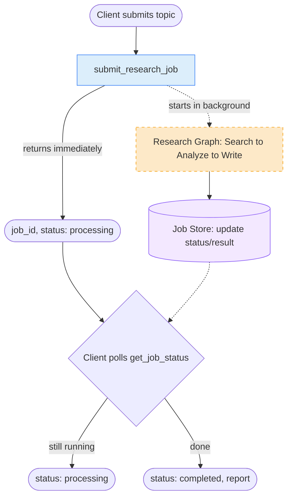

# 14. Async Workflow

## 14.1 What is it?

An **Async Workflow** immediately hands the caller back a **job ID** instead
of making them wait for the full result — the actual (potentially
long-running) graph execution happens **in the background**, and the caller
checks back later (by polling a status endpoint, or via a webhook callback)
to get the result once it's ready.

This is a different concern from every earlier pattern in this series: it's
not about the *shape* of the graph's internal logic (sequential, parallel,
looping, etc.) — it's about the **relationship between the caller and the
graph run**. Compare it to the patterns already covered:

- **Human Approval Workflow** paused *inside* a graph run, waiting on one
  specific person's decision, using `interrupt()`.
- **Event-Driven Workflow** is *triggered* by an external event instead of a
  direct call.
- **Async Workflow** is triggered by a **direct call**, same as most earlier
  patterns — but that call **returns immediately**, and the graph keeps
  running after the caller has already moved on.

## 14.2 What problem does it solve?

Some AI workflows genuinely take a while — multiple LLM calls, web searches,
document processing — easily a minute or more. If a client (say, a web
frontend) has to keep an HTTP request open and blocked the entire time, that
creates real problems: request timeouts, a frozen UI, and a server thread
tied up doing nothing but waiting.

The Async Workflow pattern solves this by:

- **Returning control to the caller immediately** with a job ID, so the
  client (or the HTTP request) is never blocked for the full duration.
- Letting **the actual work happen on its own time**, in the background,
  without needing the original caller to still be connected.
- Giving the caller a **simple way to check progress** — poll a status
  endpoint whenever they want, rather than needing to guess how long to
  wait.
- Supporting workflows that take **seconds, minutes, or longer**, without
  changing the client-facing contract at all — submit, then check back.

## 14.3 Realistic production example: Deep Research Report Generator

An analytics company (`InsightForge`) offers a "deep research" feature: a
client submits a topic, and the system produces a multi-paragraph research
report — a process involving several sequential LLM calls (search, analyze,
write) that realistically takes a minute or two, too long for a client to
sit and wait on a single HTTP request.

1. **Submit** — the client calls `submit_research_job(topic)`. The system
   immediately creates a `job_id`, stores a `"processing"` status, and
   **starts the actual graph running in the background** — then returns the
   `job_id` right away, without waiting for the graph to finish.
2. **Background execution** — the graph itself runs through its normal
   steps (search → analyze → write) exactly like any other LangGraph graph;
   it just happens to be running detached from the original request.
3. **Poll** — the client calls `get_job_status(job_id)` whenever it wants to
   check in. While the graph is still running, this returns
   `"processing"`. Once the graph finishes, it returns `"completed"` along
   with the finished report (or `"failed"` with an error message, if
   something went wrong).

## 14.4 Architecture / Flow Diagram



The dashed box shows the graph running **detached** from the original
`submit_research_job` call, which has already returned — that gap in time is
the whole point of this pattern.

## 14.5 Request-to-response flow, step by step

1. A client calls `submit_research_job("impact of AI on logistics")`.
2. A `job_id` is generated, and a job record is written to the (in this
   demo, in-memory) job store with `status = "processing"`.
3. An `asyncio` background task is created to actually run the graph — using
   `asyncio.create_task()`, which schedules the graph's `ainvoke()` call to
   run **without** the caller awaiting it.
4. `submit_research_job` **returns the `job_id` immediately** — well before
   the graph has produced any result. The caller is now free to do anything
   else (return an HTTP response to its own client, log the submission,
   etc.).
5. In the background, the graph runs its normal steps —
   `search_topic → analyze_findings → write_report` — exactly like a
   sequential workflow (Pattern 1), just running detached.
6. When the background task **completes** (successfully or with an error), a
   completion callback updates the job store: `status = "completed"` with
   the report, or `status = "failed"` with an error message.
7. At any point, the client calls `get_job_status(job_id)`, which simply
   **reads the current state from the job store** — no waiting, no
   blocking — and returns whatever status is there right now.
8. The client typically polls every few seconds until it sees
   `"completed"` (or `"failed"`), then reads the final report.

## 14.6 Why this pattern fits this problem

- **Deep research genuinely takes too long for a single blocking call** —
  forcing a client to hold an HTTP connection open for two minutes is
  fragile (proxies and browsers often time out well before that) and wastes
  a server thread the whole time.
- **Polling gives the client control over its own experience** — a web UI
  can show a progress spinner and poll every few seconds; a batch script can
  poll once a minute; both are well served by the same underlying job store.
- **The background graph itself doesn't need to know anything about being
  async** — `search_topic`, `analyze_findings`, and `write_report` are
  ordinary graph nodes; the "submit and poll" behavior lives entirely in how
  the graph is *invoked*, not in the graph's internal design.
- **Job status is a simple, durable record** — in production, backing the
  job store with a real database (instead of the in-memory dict used here)
  means job status survives a server restart, and multiple server instances
  can all check the same job's progress.

## 14.7 Production-quality implementation

```python
"""
Async Workflow — Deep Research Report Generator
Pattern: submit returns a job_id IMMEDIATELY; the actual graph runs in the
background; the caller polls a job store for status/result

Run:
    pip install "langgraph==1.2.10" "langchain==1.3.14" "langchain-ollama==1.1.0" "pydantic==2.9.2"
    ollama pull llama3.1:8b     # make sure Ollama is running locally
    python research_job.py
"""

from __future__ import annotations

import asyncio
import logging
import uuid
from datetime import datetime, timezone
from typing import Optional

from langchain_ollama import ChatOllama
from langgraph.graph import StateGraph, START, END
from pydantic import BaseModel

# --------------------------------------------------------------------------
# 1. Logging
# --------------------------------------------------------------------------
logging.basicConfig(
    level=logging.INFO,
    format="%(asctime)s | %(levelname)s | %(name)s | %(message)s",
)
logger = logging.getLogger("research_job")


# --------------------------------------------------------------------------
# 2. Graph state — the graph itself is an ordinary sequential workflow.
#    It has NO awareness that it's being run in the background.
# --------------------------------------------------------------------------
class ResearchState(BaseModel):
    topic: str = ""
    search_notes: Optional[str] = None
    analysis: Optional[str] = None
    report: Optional[str] = None


_llm = ChatOllama(model="llama3.1:8b", temperature=0.3)


async def search_topic(state: ResearchState) -> dict:
    logger.info("STEP 1/3 — search_topic: %s", state.topic)
    await asyncio.sleep(1)  # simulated search latency
    # In production: call a real search API/tool here.
    return {"search_notes": f"Key points gathered about: {state.topic}."}


async def analyze_findings(state: ResearchState) -> dict:
    logger.info("STEP 2/3 — analyze_findings")
    response = await _llm.ainvoke(
        f"Given these notes, list 2-3 key insights in bullet points:\n{state.search_notes}"
    )
    return {"analysis": response.content.strip()}


async def write_report(state: ResearchState) -> dict:
    logger.info("STEP 3/3 — write_report")
    response = await _llm.ainvoke(
        f"Write a short research summary (2-3 sentences) on '{state.topic}' "
        f"based on this analysis:\n{state.analysis}"
    )
    return {"report": response.content.strip()}


def build_graph():
    graph = StateGraph(ResearchState)
    graph.add_node("search_topic", search_topic)
    graph.add_node("analyze_findings", analyze_findings)
    graph.add_node("write_report", write_report)
    graph.add_edge(START, "search_topic")
    graph.add_edge("search_topic", "analyze_findings")
    graph.add_edge("analyze_findings", "write_report")
    graph.add_edge("write_report", END)
    return graph.compile()


_research_graph = build_graph()


# --------------------------------------------------------------------------
# 3. Job store.
#    In-memory dict for this demo; in production this would be a real
#    database (Postgres, Redis, etc.) so job status survives a server
#    restart and is visible across multiple server instances.
# --------------------------------------------------------------------------
_job_store: dict[str, dict] = {}


def _now() -> str:
    return datetime.now(timezone.utc).isoformat()


# --------------------------------------------------------------------------
# 4. Background runner — invokes the graph and writes the result back to
#    the job store when done. This function is what runs "detached."
# --------------------------------------------------------------------------
async def _run_research_job(job_id: str, topic: str) -> None:
    try:
        final_state = await _research_graph.ainvoke(ResearchState(topic=topic))
        _job_store[job_id].update(
            status="completed",
            report=final_state["report"],
            completed_at=_now(),
        )
        logger.info("JOB %s — completed", job_id)
    except Exception as exc:  # noqa: BLE001
        logger.error("JOB %s — failed: %s", job_id, exc)
        _job_store[job_id].update(status="failed", error=str(exc), completed_at=_now())


# --------------------------------------------------------------------------
# 5. Public entry point — SUBMIT. Returns immediately with a job_id;
#    does NOT await the graph's completion.
# --------------------------------------------------------------------------
def submit_research_job(topic: str) -> str:
    job_id = str(uuid.uuid4())
    _job_store[job_id] = {
        "status": "processing",
        "topic": topic,
        "submitted_at": _now(),
        "report": None,
        "error": None,
    }

    # Schedules the graph to run in the background; does NOT block here.
    asyncio.create_task(_run_research_job(job_id, topic))

    logger.info("JOB %s — submitted for topic '%s'", job_id, topic)
    return job_id


# --------------------------------------------------------------------------
# 6. Public entry point — POLL. Just reads current status; never blocks.
# --------------------------------------------------------------------------
def get_job_status(job_id: str) -> dict:
    job = _job_store.get(job_id)
    if job is None:
        return {"status": "not_found"}
    return job


# --------------------------------------------------------------------------
# 7. Demo — simulates a client submitting, then polling every second
#    until the job completes.
# --------------------------------------------------------------------------
async def _demo():
    job_id = submit_research_job("impact of AI on logistics")
    print(f"Submitted job {job_id} — client is free to do other work now.")

    while True:
        status = get_job_status(job_id)
        print(f"Poll -> status: {status['status']}")
        if status["status"] in ("completed", "failed"):
            break
        await asyncio.sleep(1)

    if status["status"] == "completed":
        print(f"\nReport: {status['report']}")
    else:
        print(f"\nJob failed: {status['error']}")


if __name__ == "__main__":
    asyncio.run(_demo())
```

**Notes on production-readiness choices made above:**

- **`submit_research_job` never `await`s the graph** — it uses
  `asyncio.create_task()` to schedule the work and returns right away. This
  is the entire mechanism that makes the call "async" from the caller's
  point of view. In a real web service, this task might instead be handed
  off to a proper background job queue (Celery, RQ, a cloud task queue) so
  it survives even if the web server process restarts.
- **The graph itself is ordinary** — `search_topic`, `analyze_findings`, and
  `write_report` don't know or care that they're running in the background;
  this pattern is entirely about *how the graph is invoked*, which keeps the
  graph's own design simple and reusable in other contexts (e.g., a
  synchronous CLI tool could call the exact same graph directly).
- **The job store separates "submit" from "check status"** completely —
  `get_job_status` is a pure read with no side effects, safe to call as
  often as the client wants (every second, once a minute, whatever fits the
  use case).
- **Failures are captured in the job store, not raised to a caller who's
  already gone** — since nobody is "waiting" on the original call by the
  time an error might happen, the error has to be recorded somewhere the
  client can find it later via polling.

---

⬅ [13. Event-Driven Workflow](13-event-driven-workflow.md) | [Back to index](README.md) | Next: [15. Long-Running Workflow](15-long-running-workflow.md) ➡
