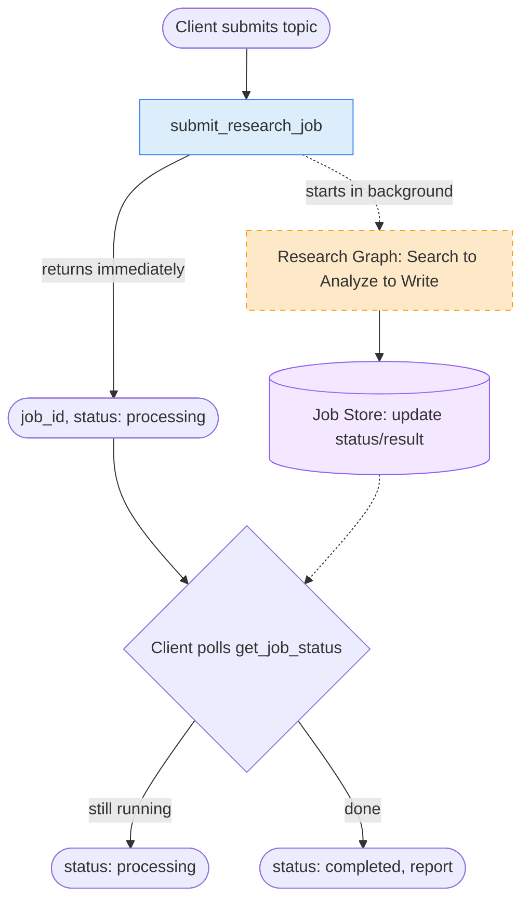

# 14. Async Workflow

## 14.1 What is it?

An **Async Workflow** immediately hands the caller back a **job ID** instead
of making them wait for the full result — the actual (potentially
long-running) graph execution happens **in the background**, and the caller
checks back later (by polling a status endpoint, or via a webhook callback)
to get the result once it's ready.

This is a different concern from every earlier pattern in this series: it's
not about the *shape* of the graph's internal logic (sequential, parallel,
looping, etc.) — it's about the **relationship between the caller and the
graph run**. Compare it to the patterns already covered:

- **Human Approval Workflow** paused *inside* a graph run, waiting on one
  specific person's decision, using `interrupt()`.
- **Event-Driven Workflow** is *triggered* by an external event instead of a
  direct call.
- **Async Workflow** is triggered by a **direct call**, same as most earlier
  patterns — but that call **returns immediately**, and the graph keeps
  running after the caller has already moved on.

## 14.2 What problem does it solve?

Some AI workflows genuinely take a while — multiple LLM calls, web searches,
document processing — easily a minute or more. If a client (say, a web
frontend) has to keep an HTTP request open and blocked the entire time, that
creates real problems: request timeouts, a frozen UI, and a server thread
tied up doing nothing but waiting.

The Async Workflow pattern solves this by:

- **Returning control to the caller immediately** with a job ID, so the
  client (or the HTTP request) is never blocked for the full duration.
- Letting **the actual work happen on its own time**, in the background,
  without needing the original caller to still be connected.
- Giving the caller a **simple way to check progress** — poll a status
  endpoint whenever they want, rather than needing to guess how long to
  wait.
- Supporting workflows that take **seconds, minutes, or longer**, without
  changing the client-facing contract at all — submit, then check back.

## 14.3 Realistic production example: Deep Research Report Generator

An analytics company (`InsightForge`) offers a "deep research" feature: a
client submits a topic, and the system produces a multi-paragraph research
report — a process involving several sequential LLM calls (search, analyze,
write) that realistically takes a minute or two, too long for a client to
sit and wait on a single HTTP request.

1. **Submit** — the client calls `submit_research_job(topic)`. The system
   immediately creates a `job_id`, stores a `"processing"` status, and
   **starts the actual graph running in the background** — then returns the
   `job_id` right away, without waiting for the graph to finish.
2. **Background execution** — the graph itself runs through its normal
   steps (search → analyze → write) exactly like any other LangGraph graph;
   it just happens to be running detached from the original request.
3. **Poll** — the client calls `get_job_status(job_id)` whenever it wants to
   check in. While the graph is still running, this returns
   `"processing"`. Once the graph finishes, it returns `"completed"` along
   with the finished report (or `"failed"` with an error message, if
   something went wrong).

## 14.4 Architecture / Flow Diagram


```mermaid
flowchart TD
    Client([Client submits topic]) --> Submit[submit_research_job]
    Submit -->|returns immediately| JobID([job_id, status: processing])
    Submit -.->|starts in background| Graph[Research Graph: Search to Analyze to Write]

    Graph --> Store[(Job Store: update status/result)]

    JobID --> Poll{Client polls get_job_status}
    Poll -->|still running| Processing([status: processing])
    Poll -->|done| Result([status: completed, report])
    Store -.-> Poll

    style Submit fill:#DCEEFB,stroke:#3B82F6
    style Graph fill:#FDE9C8,stroke:#F59E0B,stroke-dasharray: 5 5
    style Store fill:#F3E8FF,stroke:#8B5CF6
```

The dashed box shows the graph running **detached** from the original
`submit_research_job` call, which has already returned — that gap in time is
the whole point of this pattern.

## 14.5 Request-to-response flow, step by step

1. A client calls `submit_research_job("impact of AI on logistics")`.
2. A `job_id` is generated, and a job record is written to the (in this
   demo, in-memory) job store with `status = "processing"`.
3. An `asyncio` background task is created to actually run the graph — using
   `asyncio.create_task()`, which schedules the graph's `ainvoke()` call to
   run **without** the caller awaiting it.
4. `submit_research_job` **returns the `job_id` immediately** — well before
   the graph has produced any result. The caller is now free to do anything
   else (return an HTTP response to its own client, log the submission,
   etc.).
5. In the background, the graph runs its normal steps —
   `search_topic → analyze_findings → write_report` — exactly like a
   sequential workflow (Pattern 1), just running detached.
6. When the background task **completes** (successfully or with an error), a
   completion callback updates the job store: `status = "completed"` with
   the report, or `status = "failed"` with an error message.
7. At any point, the client calls `get_job_status(job_id)`, which simply
   **reads the current state from the job store** — no waiting, no
   blocking — and returns whatever status is there right now.
8. The client typically polls every few seconds until it sees
   `"completed"` (or `"failed"`), then reads the final report.

## 14.6 Why this pattern fits this problem

- **Deep research genuinely takes too long for a single blocking call** —
  forcing a client to hold an HTTP connection open for two minutes is
  fragile (proxies and browsers often time out well before that) and wastes
  a server thread the whole time.
- **Polling gives the client control over its own experience** — a web UI
  can show a progress spinner and poll every few seconds; a batch script can
  poll once a minute; both are well served by the same underlying job store.
- **The background graph itself doesn't need to know anything about being
  async** — `search_topic`, `analyze_findings`, and `write_report` are
  ordinary graph nodes; the "submit and poll" behavior lives entirely in how
  the graph is *invoked*, not in the graph's internal design.
- **Job status is a simple, durable record** — in production, backing the
  job store with a real database (instead of the in-memory dict used here)
  means job status survives a server restart, and multiple server instances
  can all check the same job's progress.

## 14.7 Production-quality implementation

```python
"""
Async Workflow — Deep Research Report Generator
Pattern: submit returns a job_id IMMEDIATELY; the actual graph runs in the
background; the caller polls a job store for status/result

Run:
    pip install "langgraph==1.2.10" "langchain==1.3.14" "langchain-ollama==1.1.0" "pydantic==2.9.2"
    ollama pull llama3.1:8b     # make sure Ollama is running locally
    python research_job.py
"""

from __future__ import annotations

import asyncio
import logging
import uuid
from datetime import datetime, timezone
from typing import Optional

from langchain_ollama import ChatOllama
from langgraph.graph import StateGraph, START, END
from pydantic import BaseModel

# --------------------------------------------------------------------------
# 1. Logging
# --------------------------------------------------------------------------
logging.basicConfig(
    level=logging.INFO,
    format="%(asctime)s | %(levelname)s | %(name)s | %(message)s",
)
logger = logging.getLogger("research_job")


# --------------------------------------------------------------------------
# 2. Graph state — the graph itself is an ordinary sequential workflow.
#    It has NO awareness that it's being run in the background.
# --------------------------------------------------------------------------
class ResearchState(BaseModel):
    topic: str = ""
    search_notes: Optional[str] = None
    analysis: Optional[str] = None
    report: Optional[str] = None


_llm = ChatOllama(model="llama3.1:8b", temperature=0.3)


async def search_topic(state: ResearchState) -> dict:
    logger.info("STEP 1/3 — search_topic: %s", state.topic)
    await asyncio.sleep(1)  # simulated search latency
    # In production: call a real search API/tool here.
    return {"search_notes": f"Key points gathered about: {state.topic}."}


async def analyze_findings(state: ResearchState) -> dict:
    logger.info("STEP 2/3 — analyze_findings")
    response = await _llm.ainvoke(
        f"Given these notes, list 2-3 key insights in bullet points:\n{state.search_notes}"
    )
    return {"analysis": response.content.strip()}


async def write_report(state: ResearchState) -> dict:
    logger.info("STEP 3/3 — write_report")
    response = await _llm.ainvoke(
        f"Write a short research summary (2-3 sentences) on '{state.topic}' "
        f"based on this analysis:\n{state.analysis}"
    )
    return {"report": response.content.strip()}


def build_graph():
    graph = StateGraph(ResearchState)
    graph.add_node("search_topic", search_topic)
    graph.add_node("analyze_findings", analyze_findings)
    graph.add_node("write_report", write_report)
    graph.add_edge(START, "search_topic")
    graph.add_edge("search_topic", "analyze_findings")
    graph.add_edge("analyze_findings", "write_report")
    graph.add_edge("write_report", END)
    return graph.compile()


_research_graph = build_graph()


# --------------------------------------------------------------------------
# 3. Job store.
#    In-memory dict for this demo; in production this would be a real
#    database (Postgres, Redis, etc.) so job status survives a server
#    restart and is visible across multiple server instances.
# --------------------------------------------------------------------------
_job_store: dict[str, dict] = {}


def _now() -> str:
    return datetime.now(timezone.utc).isoformat()


# --------------------------------------------------------------------------
# 4. Background runner — invokes the graph and writes the result back to
#    the job store when done. This function is what runs "detached."
# --------------------------------------------------------------------------
async def _run_research_job(job_id: str, topic: str) -> None:
    try:
        final_state = await _research_graph.ainvoke(ResearchState(topic=topic))
        _job_store[job_id].update(
            status="completed",
            report=final_state["report"],
            completed_at=_now(),
        )
        logger.info("JOB %s — completed", job_id)
    except Exception as exc:  # noqa: BLE001
        logger.error("JOB %s — failed: %s", job_id, exc)
        _job_store[job_id].update(status="failed", error=str(exc), completed_at=_now())


# --------------------------------------------------------------------------
# 5. Public entry point — SUBMIT. Returns immediately with a job_id;
#    does NOT await the graph's completion.
# --------------------------------------------------------------------------
def submit_research_job(topic: str) -> str:
    job_id = str(uuid.uuid4())
    _job_store[job_id] = {
        "status": "processing",
        "topic": topic,
        "submitted_at": _now(),
        "report": None,
        "error": None,
    }

    # Schedules the graph to run in the background; does NOT block here.
    asyncio.create_task(_run_research_job(job_id, topic))

    logger.info("JOB %s — submitted for topic '%s'", job_id, topic)
    return job_id


# --------------------------------------------------------------------------
# 6. Public entry point — POLL. Just reads current status; never blocks.
# --------------------------------------------------------------------------
def get_job_status(job_id: str) -> dict:
    job = _job_store.get(job_id)
    if job is None:
        return {"status": "not_found"}
    return job


# --------------------------------------------------------------------------
# 7. Demo — simulates a client submitting, then polling every second
#    until the job completes.
# --------------------------------------------------------------------------
async def _demo():
    job_id = submit_research_job("impact of AI on logistics")
    print(f"Submitted job {job_id} — client is free to do other work now.")

    while True:
        status = get_job_status(job_id)
        print(f"Poll -> status: {status['status']}")
        if status["status"] in ("completed", "failed"):
            break
        await asyncio.sleep(1)

    if status["status"] == "completed":
        print(f"\nReport: {status['report']}")
    else:
        print(f"\nJob failed: {status['error']}")


if __name__ == "__main__":
    asyncio.run(_demo())
```

**Notes on production-readiness choices made above:**

- **`submit_research_job` never `await`s the graph** — it uses
  `asyncio.create_task()` to schedule the work and returns right away. This
  is the entire mechanism that makes the call "async" from the caller's
  point of view. In a real web service, this task might instead be handed
  off to a proper background job queue (Celery, RQ, a cloud task queue) so
  it survives even if the web server process restarts.
- **The graph itself is ordinary** — `search_topic`, `analyze_findings`, and
  `write_report` don't know or care that they're running in the background;
  this pattern is entirely about *how the graph is invoked*, which keeps the
  graph's own design simple and reusable in other contexts (e.g., a
  synchronous CLI tool could call the exact same graph directly).
- **The job store separates "submit" from "check status"** completely —
  `get_job_status` is a pure read with no side effects, safe to call as
  often as the client wants (every second, once a minute, whatever fits the
  use case).
- **Failures are captured in the job store, not raised to a caller who's
  already gone** — since nobody is "waiting" on the original call by the
  time an error might happen, the error has to be recorded somewhere the
  client can find it later via polling.

---

⬅ [13. Event-Driven Workflow](13-event-driven-workflow.md) | [Back to index](README.md) | Next: [15. Long-Running Workflow](15-long-running-workflow.md) ➡

# Deep Research Report Generator — Async Submit/Poll Workflow (Java + Spring AI)

A Java port of the LangGraph async job workflow — `submit` returns a job ID **immediately**; the
actual multi-step workflow runs in the background; the caller polls a job store for status/result.
Built on:

- **Java 25** (current LTS) — a virtual-thread executor runs the graph detached from the request
- **Spring Boot 4.1.0**
- **Spring AI 2.0.0** (GA) with the **Ollama** starter, mirroring `llama3.1:8b`

## Mapping the shape

The Python version makes a point worth preserving structurally: **the graph itself has no
awareness that it's being run in the background** — `build_graph()` is an ordinary 3-step
sequential workflow (like the very first port in this series), and it's only `submit_research_job`
wrapping it in `asyncio.create_task(...)` that makes it async. The Java port keeps that same
separation — `ResearchGraphService` is a plain sequential pipeline that knows nothing about jobs,
and `ResearchJobService` is the only place that knows about background execution and polling.

| LangGraph concept | Spring / Java equivalent |
|---|---|
| `build_graph()` (plain 3-step sequential graph) | `ResearchGraphService.run(topic)` — same three steps, still knows nothing about jobs |
| `asyncio.create_task(_run_research_job(...))` | `executorService.submit(...)` on a virtual-thread executor — fire-and-forget, not awaited |
| `_job_store: dict[str, dict]` | `ConcurrentHashMap<String, ResearchJob>` — see note below on why this needs to be concurrency-safe in a way the Python demo's single-event-loop dict doesn't |
| `submit_research_job(topic) -> str` | `ResearchJobService.submit(topic)` — returns the job ID immediately, doesn't block on the graph |
| `get_job_status(job_id) -> dict` | `ResearchJobService.getStatus(jobId)` — a plain map read, never blocks |
| Demo's polling loop with `asyncio.sleep(1)` | `WHILE`-loop poller in the CLI runner using `Thread.sleep` |

**Why the job store needs real concurrency control here, even though the Python version's is a
plain dict**: Python's single-threaded asyncio event loop means `_job_store[job_id] = ...` and
`_job_store.get(job_id)` never truly run at the same instant — cooperative scheduling serializes
them. The Java version genuinely runs the background task on a separate (virtual) thread
concurrently with the HTTP request thread that might poll it, so `ConcurrentHashMap` isn't an
upgrade for paranoia's sake — it's required for correctness the moment the single-threaded
assumption goes away.

---

## Project structure

```
research-job/
├── pom.xml
└── src/main/java/com/example/researchjob/
    ├── ResearchJobApplication.java
    ├── model/
    │   ├── JobStatus.java
    │   └── ResearchJob.java
    ├── pipeline/
    │   ├── SearchTopicStep.java
    │   ├── AnalyzeFindingsStep.java
    │   ├── WriteReportStep.java
    │   └── ResearchGraphService.java
    ├── job/
    │   ├── ResearchJobStore.java
    │   └── ResearchJobService.java
    ├── web/
    │   └── ResearchJobController.java
    └── ResearchJobRunner.java   (CLI demo, mirrors the Python __main__ / _demo block)
└── src/main/resources/
    └── application.yml
```

---

## `pom.xml`

```xml
<?xml version="1.0" encoding="UTF-8"?>
<project xmlns="http://maven.apache.org/POM/4.0.0"
         xmlns:xsi="http://www.w3.org/2001/XMLSchema-instance"
         xsi:schemaLocation="http://maven.apache.org/POM/4.0.0 https://maven.apache.org/xsd/maven-4.0.0.xsd">
    <modelVersion>4.0.0</modelVersion>

    <groupId>com.example</groupId>
    <artifactId>research-job</artifactId>
    <version>1.0.0</version>
    <packaging>jar</packaging>

    <properties>
        <java.version>25</java.version>
        <spring-ai.version>2.0.0</spring-ai.version>
    </properties>

    <parent>
        <groupId>org.springframework.boot</groupId>
        <artifactId>spring-boot-starter-parent</artifactId>
        <version>4.1.0</version>
        <relativePath/>
    </parent>

    <dependencyManagement>
        <dependencies>
            <dependency>
                <groupId>org.springframework.ai</groupId>
                <artifactId>spring-ai-bom</artifactId>
                <version>${spring-ai.version}</version>
                <type>pom</type>
                <scope>import</scope>
            </dependency>
        </dependencies>
    </dependencyManagement>

    <dependencies>
        <dependency>
            <groupId>org.springframework.boot</groupId>
            <artifactId>spring-boot-starter-web</artifactId>
        </dependency>
        <!-- Ollama model starter — local llama3.1:8b, same as langchain-ollama -->
        <dependency>
            <groupId>org.springframework.ai</groupId>
            <artifactId>spring-ai-starter-model-ollama</artifactId>
        </dependency>
        <dependency>
            <groupId>org.springframework.boot</groupId>
            <artifactId>spring-boot-starter-test</artifactId>
            <scope>test</scope>
        </dependency>
    </dependencies>

    <build>
        <plugins>
            <plugin>
                <groupId>org.springframework.boot</groupId>
                <artifactId>spring-boot-maven-plugin</artifactId>
            </plugin>
        </plugins>
    </build>
</project>
```

> **Production note, matching the Python demo's own comment**: `_job_store` is an in-memory dict
> "for this demo; in production this would be a real database (Postgres, Redis, etc.) so job
> status survives a server restart and is visible across multiple server instances." The same is
> true here — `ResearchJobStore` below is a thin interface specifically so an in-memory
> implementation can be swapped for a JPA-backed or Redis-backed one (the same idea as the
> `expense-approval` port's durable-checkpoint pattern) without touching `ResearchJobService`.

## `src/main/resources/application.yml`

```yaml
spring:
  application:
    name: research-job
  ai:
    ollama:
      base-url: http://localhost:11434
      chat:
        options:
          model: llama3.1:8b
          temperature: 0.3

logging:
  level:
    com.example.researchjob: INFO
```

---

## Domain model

### `model/JobStatus.java`

```java
package com.example.researchjob.model;

public enum JobStatus {
    PROCESSING,
    COMPLETED,
    FAILED,
    NOT_FOUND
}
```

### `model/ResearchJob.java`

An immutable snapshot of one job's state — each update produces a new instance rather than
mutating fields in place, which keeps the job store's `put`/`get` pairs safe under real
concurrency without needing per-field synchronization.

```java
package com.example.researchjob.model;

import java.time.Instant;

public record ResearchJob(
        String jobId,
        String topic,
        JobStatus status,
        Instant submittedAt,
        Instant completedAt,
        String report,
        String error
) {

    public static ResearchJob submitted(String jobId, String topic) {
        return new ResearchJob(jobId, topic, JobStatus.PROCESSING, Instant.now(), null, null, null);
    }

    public ResearchJob completed(String report) {
        return new ResearchJob(jobId, topic, JobStatus.COMPLETED, submittedAt, Instant.now(), report, null);
    }

    public ResearchJob failed(String errorMessage) {
        return new ResearchJob(jobId, topic, JobStatus.FAILED, submittedAt, Instant.now(), null, errorMessage);
    }
}
```

---

## The graph — knows nothing about jobs

### `pipeline/SearchTopicStep.java`

```java
package com.example.researchjob.pipeline;

import org.slf4j.Logger;
import org.slf4j.LoggerFactory;
import org.springframework.stereotype.Component;

@Component
public class SearchTopicStep {

    private static final Logger log = LoggerFactory.getLogger(SearchTopicStep.class);

    public String search(String topic) throws InterruptedException {
        log.info("STEP 1/3 - search_topic: {}", topic);
        Thread.sleep(1000); // simulated search latency, cheap on a virtual thread
        // In production: call a real search API/tool here.
        return "Key points gathered about: %s.".formatted(topic);
    }
}
```

### `pipeline/AnalyzeFindingsStep.java`

```java
package com.example.researchjob.pipeline;

import org.slf4j.Logger;
import org.slf4j.LoggerFactory;
import org.springframework.ai.chat.client.ChatClient;
import org.springframework.stereotype.Component;

@Component
public class AnalyzeFindingsStep {

    private static final Logger log = LoggerFactory.getLogger(AnalyzeFindingsStep.class);

    private final ChatClient chatClient;

    public AnalyzeFindingsStep(ChatClient.Builder chatClientBuilder) {
        this.chatClient = chatClientBuilder.build();
    }

    public String analyze(String searchNotes) {
        log.info("STEP 2/3 - analyze_findings");
        return chatClient.prompt()
                .user("Given these notes, list 2-3 key insights in bullet points:\n" + searchNotes)
                .call()
                .content()
                .strip();
    }
}
```

### `pipeline/WriteReportStep.java`

```java
package com.example.researchjob.pipeline;

import org.slf4j.Logger;
import org.slf4j.LoggerFactory;
import org.springframework.ai.chat.client.ChatClient;
import org.springframework.stereotype.Component;

@Component
public class WriteReportStep {

    private static final Logger log = LoggerFactory.getLogger(WriteReportStep.class);

    private final ChatClient chatClient;

    public WriteReportStep(ChatClient.Builder chatClientBuilder) {
        this.chatClient = chatClientBuilder.build();
    }

    public String write(String topic, String analysis) {
        log.info("STEP 3/3 - write_report");
        String prompt = "Write a short research summary (2-3 sentences) on '%s' based on this analysis:\n%s"
                .formatted(topic, analysis);
        return chatClient.prompt()
                .user(prompt)
                .call()
                .content()
                .strip();
    }
}
```

### `pipeline/ResearchGraphService.java`

The plain sequential pipeline — the direct analogue of `build_graph()`. This class has no idea
it might be run detached from a request; that's entirely `ResearchJobService`'s concern, exactly
mirroring how the Python graph object is built once at module scope with no job awareness at all.

```java
package com.example.researchjob.pipeline;

import org.springframework.stereotype.Service;

@Service
public class ResearchGraphService {

    private final SearchTopicStep searchTopicStep;
    private final AnalyzeFindingsStep analyzeFindingsStep;
    private final WriteReportStep writeReportStep;

    public ResearchGraphService(SearchTopicStep searchTopicStep,
                                 AnalyzeFindingsStep analyzeFindingsStep,
                                 WriteReportStep writeReportStep) {
        this.searchTopicStep = searchTopicStep;
        this.analyzeFindingsStep = analyzeFindingsStep;
        this.writeReportStep = writeReportStep;
    }

    public String run(String topic) throws InterruptedException {
        String searchNotes = searchTopicStep.search(topic);
        String analysis = analyzeFindingsStep.analyze(searchNotes);
        return writeReportStep.write(topic, analysis);
    }
}
```

---

## The job store

### `job/ResearchJobStore.java`

A thin interface so the in-memory implementation used here can later be swapped for a durable one
(JPA, Redis) without touching `ResearchJobService` — see the production note above `application.yml`.

```java
package com.example.researchjob.job;

import com.example.researchjob.model.ResearchJob;
import org.springframework.stereotype.Component;

import java.util.Map;
import java.util.Optional;
import java.util.concurrent.ConcurrentHashMap;

@Component
public class ResearchJobStore {

    // In-memory for this demo; in production this would be a real database (Postgres,
    // Redis, etc.) so job status survives a server restart and is visible across
    // multiple server instances — same caveat as the Python version's own comment.
    private final Map<String, ResearchJob> jobs = new ConcurrentHashMap<>();

    public void save(ResearchJob job) {
        jobs.put(job.jobId(), job);
    }

    public Optional<ResearchJob> find(String jobId) {
        return Optional.ofNullable(jobs.get(jobId));
    }
}
```

---

## Submit and poll

### `job/ResearchJobService.java`

The direct analogue of `submit_research_job` and `get_job_status` together — the only place in
this port that knows the graph is being run in the background.

```java
package com.example.researchjob.job;

import com.example.researchjob.model.JobStatus;
import com.example.researchjob.model.ResearchJob;
import com.example.researchjob.pipeline.ResearchGraphService;
import org.slf4j.Logger;
import org.slf4j.LoggerFactory;
import org.springframework.stereotype.Service;

import java.util.UUID;
import java.util.concurrent.ExecutorService;
import java.util.concurrent.Executors;

@Service
public class ResearchJobService {

    private static final Logger log = LoggerFactory.getLogger(ResearchJobService.class);

    private final ResearchGraphService researchGraphService;
    private final ResearchJobStore jobStore;
    private final ExecutorService virtualThreadExecutor = Executors.newVirtualThreadPerTaskExecutor();

    public ResearchJobService(ResearchGraphService researchGraphService, ResearchJobStore jobStore) {
        this.researchGraphService = researchGraphService;
        this.jobStore = jobStore;
    }

    /**
     * SUBMIT. Returns immediately with a job ID; does NOT wait for the graph to finish —
     * the direct analogue of {@code submit_research_job} not awaiting its background task.
     */
    public String submit(String topic) {
        String jobId = UUID.randomUUID().toString();
        jobStore.save(ResearchJob.submitted(jobId, topic));

        // Fire-and-forget: schedules the graph to run in the background on a virtual
        // thread, matching asyncio.create_task(...) not blocking the caller.
        virtualThreadExecutor.submit(() -> runResearchJob(jobId, topic));

        log.info("JOB {} - submitted for topic '{}'", jobId, topic);
        return jobId;
    }

    /**
     * POLL. Just reads current status; never blocks — the direct analogue of {@code get_job_status}.
     */
    public ResearchJob getStatus(String jobId) {
        return jobStore.find(jobId)
                .orElse(new ResearchJob(jobId, null, JobStatus.NOT_FOUND, null, null, null, null));
    }

    private void runResearchJob(String jobId, String topic) {
        try {
            String report = researchGraphService.run(topic);
            jobStore.save(jobStore.find(jobId).orElseThrow().completed(report));
            log.info("JOB {} - completed", jobId);
        } catch (Exception e) {
            jobStore.save(jobStore.find(jobId).orElseThrow().failed(e.getMessage()));
            log.error("JOB {} - failed: {}", jobId, e.getMessage());
        }
    }
}
```

---

## Entry points

### `web/ResearchJobController.java`

```java
package com.example.researchjob.web;

import com.example.researchjob.job.ResearchJobService;
import com.example.researchjob.model.ResearchJob;
import org.springframework.web.bind.annotation.GetMapping;
import org.springframework.web.bind.annotation.PathVariable;
import org.springframework.web.bind.annotation.PostMapping;
import org.springframework.web.bind.annotation.RequestParam;
import org.springframework.web.bind.annotation.RestController;

@RestController
public class ResearchJobController {

    private final ResearchJobService researchJobService;

    public ResearchJobController(ResearchJobService researchJobService) {
        this.researchJobService = researchJobService;
    }

    @PostMapping("/api/research-jobs")
    public SubmitResponse submit(@RequestParam String topic) {
        return new SubmitResponse(researchJobService.submit(topic));
    }

    @GetMapping("/api/research-jobs/{jobId}")
    public ResearchJob status(@PathVariable String jobId) {
        return researchJobService.getStatus(jobId);
    }

    public record SubmitResponse(String jobId) {}
}
```

### `ResearchJobRunner.java` (CLI demo, mirrors the Python `_demo()` polling loop)

```java
package com.example.researchjob;

import com.example.researchjob.job.ResearchJobService;
import com.example.researchjob.model.JobStatus;
import org.springframework.boot.CommandLineRunner;
import org.springframework.context.annotation.Profile;
import org.springframework.stereotype.Component;

@Component
@Profile("demo")
public class ResearchJobRunner implements CommandLineRunner {

    private final ResearchJobService researchJobService;

    public ResearchJobRunner(ResearchJobService researchJobService) {
        this.researchJobService = researchJobService;
    }

    @Override
    public void run(String... args) throws InterruptedException {
        String jobId = researchJobService.submit("impact of AI on logistics");
        System.out.println("Submitted job " + jobId + " - client is free to do other work now.");

        var status = researchJobService.getStatus(jobId);
        while (status.status() == JobStatus.PROCESSING) {
            System.out.println("Poll -> status: " + status.status());
            Thread.sleep(1000);
            status = researchJobService.getStatus(jobId);
        }
        System.out.println("Poll -> status: " + status.status());

        if (status.status() == JobStatus.COMPLETED) {
            System.out.println("\nReport: " + status.report());
        } else {
            System.out.println("\nJob failed: " + status.error());
        }
    }
}
```

### `ResearchJobApplication.java`

```java
package com.example.researchjob;

import org.springframework.boot.SpringApplication;
import org.springframework.boot.autoconfigure.SpringBootApplication;

@SpringBootApplication
public class ResearchJobApplication {
    public static void main(String[] args) {
        SpringApplication.run(ResearchJobApplication.class, args);
    }
}
```

---

## Running it

```bash
ollama pull llama3.1:8b
ollama serve   # if not already running

# CLI demo (submits, then polls every second until completion, like the Python _demo())
mvn spring-boot:run -Dspring-boot.run.profiles=demo

# Or as a service — submit returns instantly
mvn spring-boot:run
curl -X POST "localhost:8080/api/research-jobs?topic=impact%20of%20AI%20on%20logistics"
# -> {"jobId":"..."}

# Poll with the returned ID
curl localhost:8080/api/research-jobs/<jobId>
```

## Notes on the port

- **The graph stays job-unaware, deliberately**: `ResearchGraphService` is structurally identical
  to the first (sequential) workflow in this series — three steps, no job ID, no status field
  anywhere in sight. Keeping that separation is the whole architectural point of the Python
  version: any ordinary graph can be made async just by wrapping the submit call, without the
  graph itself changing at all. If this pipeline later needs to run synchronously somewhere else
  (a batch job, a test), `ResearchGraphService.run(topic)` is already reusable as-is.
- **Why `ConcurrentHashMap` matters here, unlike the Python dict**: called out in the mapping
  table above, but worth restating — this isn't a defensive upgrade, it's a correctness
  requirement, because Java's virtual-thread executor gives genuine concurrent execution between
  the background job and any request thread polling it, unlike Python's single-threaded event
  loop where the dict never sees two operations truly overlap.
- **Immutable job snapshots, not mutable field updates**: `ResearchJob.completed(...)` and
  `.failed(...)` each return a new record rather than mutating fields on a shared object — this
  avoids a poller ever observing a job record with some fields updated and others not, which a
  mutable class with multiple non-atomic field writes could allow under real concurrency (the
  Python version's `.update(...)` on a dict inside a single-threaded loop doesn't have this
  hazard, but the Java version's concurrent writer does).
- **Job store as a swappable seam**: `ResearchJobStore` is deliberately a thin, separately
  injectable component (not folded into `ResearchJobService`) so it can become a
  `JpaRepository`-backed or Redis-backed implementation later — the same durable-seam idea used
  for the paused state in the `expense-approval` port, applied here to job status instead of a
  human-approval pause.
- **Versions**: same Ollama-backed `spring-ai-starter-model-ollama` / `llama3.1:8b` setup as the
  other ports in this series.
