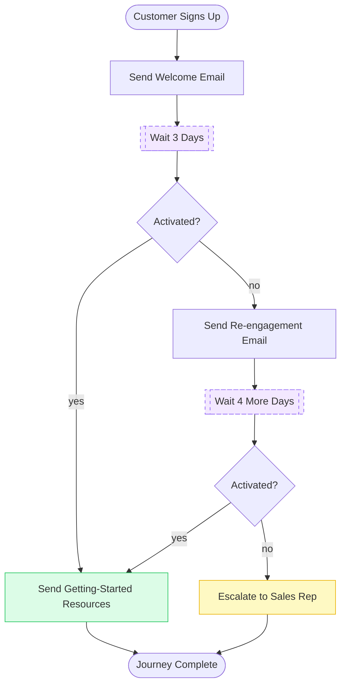

# 15. Long-Running Workflow

## 15.1 What is it?

A **Long-Running Workflow** is a single logical process that plays out over
**days or weeks**, pausing and resuming **multiple times** along the way —
not because it's waiting on one person's decision (Human Approval), and not
because it's a single background task that finishes in minutes (Async
Workflow), but because the process itself has **naturally spaced-out
stages**: "do something, then wait several days, then check in, then maybe
wait again."

Compare it to the two closest patterns already covered:

- **Human Approval Workflow** pauses **once**, waiting on **one specific
  person's decision**, and typically resolves within hours.
- **Async Workflow** runs continuously in the background and finishes on its
  own, usually within seconds or minutes — the "waiting" is just the client
  polling, not the graph itself pausing.
- **Long-Running Workflow** pauses **multiple times**, each pause driven by
  the **passage of time** (or an external system checking in periodically),
  and the whole process can span **days to weeks** from start to finish.

## 15.2 What problem does it solve?

Some real business processes simply aren't fast. A customer onboarding
journey, a multi-week procurement approval chain, a subscription renewal
cycle — these have natural checkpoints that are days apart by design, not by
accident. Trying to model this as one function call that "just waits" isn't
realistic (a process can't block for a week), and treating each stage as a
completely separate, disconnected job loses the shared context accumulated
along the way (what emails were already sent, what the customer has done so
far).

The Long-Running Workflow pattern solves this by:

- Letting **one workflow definition represent the entire journey**, even
  though it plays out over weeks, instead of splitting it into disconnected
  jobs that each have to be manually wired together.
- **Persisting state durably** across every pause, so the workflow survives
  server restarts, deployments, and long idle periods without losing track
  of where it is.
- Making each stage's logic **only reachable in the right order** — you
  can't accidentally send the "week 2 nudge" before the "week 1 welcome," in
  the same way you couldn't reorder unrelated jobs by mistake.
- Keeping **all the accumulated context in one place** — by the last stage,
  the workflow still remembers everything that happened at every earlier
  stage.

## 15.3 Realistic production example: SaaS Onboarding Journey

A SaaS company (`OnboardFlow`) runs a multi-week onboarding journey for every
new signup, designed to nudge inactive users toward activating the product:

1. **Send Welcome Email** — immediately after signup.
2. **Wait 3 days.**
3. **Check Activation** — has the customer used the core product feature
   yet?
   - **Yes** → send a "getting started" resources email and finish.
   - **No** → send a re-engagement email, then...
4. **Wait 4 more days.**
5. **Check Activation again.**
   - **Yes** → send the resources email and finish.
   - **No** → escalate to a sales rep for personal outreach, then finish.

Start to finish, this can span **a full week or more**, with the workflow
completely paused (using no compute) for most of that time, and it needs to
survive the server being redeployed multiple times along the way.

## 15.4 Architecture / Flow Diagram



Two separate dashed "wait" boxes, days apart, both part of the **same**
customer's single workflow run — that's the defining shape of a Long-Running
Workflow.

## 15.5 Request-to-response flow, step by step

1. A signup event triggers `start_onboarding_journey(customer_id)`, which
   invokes the graph using `customer_id` as the `thread_id` — this is what
   ties every future stage back to this one customer's journey.
2. **`send_welcome_email`** runs immediately.
3. **`wait_for_check_1`** calls `interrupt()`, pausing the graph. Unlike
   Human Approval, nobody is expected to respond right away — this pause is
   meant to last **days**, and it's a **scheduler** (a daily cron job, not a
   person) that will eventually resume it.
4. **Three days later**, a scheduled job calls
   `resume_onboarding_check(customer_id)`, which invokes the graph with
   `Command(resume=None)` on that same `thread_id`. The graph picks up
   exactly at `wait_for_check_1` and continues.
5. **`check_activation`** looks up whether the customer has activated (a
   real system would query a product-usage database here). A conditional
   edge routes to `send_success_resources` (done) or `send_reengagement`
   (continue the journey).
6. If continuing, **`wait_for_check_2`** pauses again with a second
   `interrupt()` call — the **same mechanism**, used a **second time** in
   the same workflow run.
7. **Four days later**, the scheduler resumes again. `check_activation`
   (the *same* node, reused) runs a second time, and the final conditional
   edge routes to either `send_success_resources` or `escalate_to_sales`.
8. Whichever finishing node runs, the graph reaches `END` — potentially a
   full week or more after it started, having paused and resumed **twice**
   along the way.

## 15.6 Why this pattern fits this problem

- **The stages are genuinely days apart by design** — nudging a customer 3
  days after signup is a deliberate product decision, not something to rush;
  a Long-Running Workflow lets that pacing be a first-class part of the
  workflow definition instead of external glue code.
- **Reusing `interrupt()` for time-based pauses, not just human decisions**,
  shows that the same pause/resume mechanism from Pattern 12 generalizes
  well beyond "wait for a person" — here it's "wait for a scheduler," and
  the checkpointer doesn't care which one resumes it.
- **One workflow run, not several disconnected jobs**, means the state
  accumulated at every stage (which emails were sent, when) is automatically
  available at every later stage without extra plumbing.
- **Durability across the whole span matters** — this journey needs to
  survive deployments, server restarts, and idle weekends without losing
  track of a single customer's progress, which is exactly what a
  checkpointer-backed graph provides.

## 15.7 Production-quality implementation

```python
"""
Long-Running Workflow — SaaS Onboarding Journey
Pattern: one workflow run spans days/weeks, pausing MULTIPLE times via
interrupt(), resumed by a SCHEDULER rather than a single human decision

Run:
    pip install "langgraph==1.2.10" "langchain==1.3.14" "langchain-ollama==1.1.0" "pydantic==2.9.2"
    ollama pull llama3.1:8b     # make sure Ollama is running locally
    python onboarding_journey.py
"""

from __future__ import annotations

import logging
from typing import Optional

from langchain_ollama import ChatOllama
from langgraph.checkpoint.memory import InMemorySaver
from langgraph.graph import StateGraph, START, END
from langgraph.types import Command, interrupt
from pydantic import BaseModel

# --------------------------------------------------------------------------
# 1. Logging
# --------------------------------------------------------------------------
logging.basicConfig(
    level=logging.INFO,
    format="%(asctime)s | %(levelname)s | %(name)s | %(message)s",
)
logger = logging.getLogger("onboarding_journey")


# --------------------------------------------------------------------------
# 2. Shared state
# --------------------------------------------------------------------------
class OnboardingState(BaseModel):
    customer_id: str = ""
    customer_email: str = ""

    check_count: int = 0
    activated: Optional[bool] = None

    final_outcome: Optional[str] = None


_llm = ChatOllama(model="llama3.1:8b", temperature=0.3)


# --------------------------------------------------------------------------
# 3. Simulated product-usage check.
#    In production: query the real product database/analytics system.
#    For this demo: the customer activates on the SECOND check.
# --------------------------------------------------------------------------
def _has_customer_activated(customer_id: str, check_count: int) -> bool:
    return check_count >= 2


# --------------------------------------------------------------------------
# 4. Node — Send Welcome Email
# --------------------------------------------------------------------------
def send_welcome_email(state: OnboardingState) -> dict:
    logger.info("EMAIL — welcome email to %s", state.customer_email)
    # In production: call the real email service here.
    return {}


# --------------------------------------------------------------------------
# 5. Node — Wait for Check 1 (paused for ~3 days, resumed by a scheduler)
# --------------------------------------------------------------------------
def wait_for_check_1(state: OnboardingState) -> dict:
    logger.info("PAUSE — waiting 3 days before first activation check for %s", state.customer_id)
    interrupt({"wait_type": "scheduled_check", "resume_after_days": 3, "check_number": 1})
    # Execution reaches here only once a scheduler resumes this thread.
    logger.info("RESUME — scheduler resumed after wait 1 for %s", state.customer_id)
    return {}


# --------------------------------------------------------------------------
# 6. Node — Check Activation (reused for both check points)
# --------------------------------------------------------------------------
def check_activation(state: OnboardingState) -> dict:
    new_count = state.check_count + 1
    activated = _has_customer_activated(state.customer_id, new_count)
    logger.info("CHECK #%d — customer %s activated=%s", new_count, state.customer_id, activated)
    return {"check_count": new_count, "activated": activated}


def route_after_check(state: OnboardingState) -> str:
    if state.activated:
        return "send_success_resources"
    # First check failed -> continue the journey. Second check failed ->
    # this same function is used after check 2 too, where the graph edges
    # ensure "continue" means escalate instead (see build_graph()).
    return "continue_journey"


# --------------------------------------------------------------------------
# 7. Node — Send Re-engagement Email (only reached after check #1 fails)
# --------------------------------------------------------------------------
def send_reengagement_email(state: OnboardingState) -> dict:
    logger.info("EMAIL — re-engagement email to %s", state.customer_email)
    return {}


# --------------------------------------------------------------------------
# 8. Node — Wait for Check 2 (paused for ~4 more days)
# --------------------------------------------------------------------------
def wait_for_check_2(state: OnboardingState) -> dict:
    logger.info("PAUSE — waiting 4 more days before second activation check for %s", state.customer_id)
    interrupt({"wait_type": "scheduled_check", "resume_after_days": 4, "check_number": 2})
    logger.info("RESUME — scheduler resumed after wait 2 for %s", state.customer_id)
    return {}


# --------------------------------------------------------------------------
# 9. Finishing nodes
# --------------------------------------------------------------------------
def send_success_resources(state: OnboardingState) -> dict:
    logger.info("EMAIL — getting-started resources to %s (activated!)", state.customer_email)
    return {"final_outcome": "activated"}


def escalate_to_sales(state: OnboardingState) -> dict:
    logger.info("ESCALATE — routing %s to a sales rep for personal outreach", state.customer_id)
    return {"final_outcome": "escalated_to_sales"}


# --------------------------------------------------------------------------
# 10. Build the graph.
#     Two SEPARATE interrupt points, days apart, in the same workflow run.
#     A durable checkpointer is essential here -- InMemorySaver is used for
#     this demo, but a real deployment needs a persistent one (e.g.
#     PostgresSaver) since this workflow must survive restarts over a
#     span of a week or more.
# --------------------------------------------------------------------------
def build_graph():
    graph = StateGraph(OnboardingState)

    graph.add_node("send_welcome_email", send_welcome_email)
    graph.add_node("wait_for_check_1", wait_for_check_1)
    graph.add_node("check_activation_1", check_activation)
    graph.add_node("send_reengagement_email", send_reengagement_email)
    graph.add_node("wait_for_check_2", wait_for_check_2)
    graph.add_node("check_activation_2", check_activation)
    graph.add_node("send_success_resources", send_success_resources)
    graph.add_node("escalate_to_sales", escalate_to_sales)

    graph.add_edge(START, "send_welcome_email")
    graph.add_edge("send_welcome_email", "wait_for_check_1")
    graph.add_edge("wait_for_check_1", "check_activation_1")

    graph.add_conditional_edges(
        "check_activation_1",
        route_after_check,
        {
            "send_success_resources": "send_success_resources",
            "continue_journey": "send_reengagement_email",
        },
    )

    graph.add_edge("send_reengagement_email", "wait_for_check_2")
    graph.add_edge("wait_for_check_2", "check_activation_2")

    graph.add_conditional_edges(
        "check_activation_2",
        route_after_check,
        {
            "send_success_resources": "send_success_resources",
            "continue_journey": "escalate_to_sales",
        },
    )

    graph.add_edge("send_success_resources", END)
    graph.add_edge("escalate_to_sales", END)

    checkpointer = InMemorySaver()
    return graph.compile(checkpointer=checkpointer)


_app = build_graph()


# --------------------------------------------------------------------------
# 11. Public entry points
# --------------------------------------------------------------------------
def start_onboarding_journey(customer_id: str, customer_email: str) -> dict:
    thread_config = {"configurable": {"thread_id": customer_id}}
    initial_state = OnboardingState(customer_id=customer_id, customer_email=customer_email)
    result = _app.invoke(initial_state, config=thread_config)
    return result


def resume_onboarding_check(customer_id: str) -> dict:
    """Called by a scheduled job (e.g. a daily cron task), NOT by a person,
    once the appropriate number of days has passed for this customer."""
    thread_config = {"configurable": {"thread_id": customer_id}}
    result = _app.invoke(Command(resume=None), config=thread_config)
    return result


# --------------------------------------------------------------------------
# 12. Demo — simulates the full multi-week journey by manually calling
#     resume_onboarding_check() twice, standing in for a scheduler that
#     would normally do this automatically, days apart, in production.
# --------------------------------------------------------------------------
if __name__ == "__main__":
    customer_id = "CUST-5521"
    result = start_onboarding_journey(customer_id, "sam@example.com")
    print("After signup:", "__interrupt__" in result, "(paused, waiting ~3 days)")

    # ... 3 days pass in production; a scheduler calls this automatically ...
    result = resume_onboarding_check(customer_id)
    print("After check 1:", "__interrupt__" in result, "(paused again, waiting ~4 more days)")

    # ... 4 more days pass; the scheduler calls this automatically ...
    result = resume_onboarding_check(customer_id)
    print("Final outcome:", result["final_outcome"])
```

**Notes on production-readiness choices made above:**

- **`interrupt()` is reused for a *second*, unrelated pause in the same
  workflow run** — `wait_for_check_1` and `wait_for_check_2` are two
  different nodes, each calling `interrupt()` independently. This is what
  distinguishes a Long-Running Workflow from Human Approval's single pause:
  the same durable pause/resume mechanism, used multiple times across a much
  longer overall span.
- **A scheduler resumes the graph, not a person clicking a button** — the
  same `Command(resume=...)` API from Pattern 12 works identically here;
  what changes is *who* (or *what*) is on the other end deciding when to
  call it.
- **`check_activation` is a single node reused at two different points** in
  the graph — since the logic ("look up whether this customer is active")
  is identical both times, defining it once keeps the graph DRY even though
  it's wired into two different positions.
- **A durable checkpointer is non-negotiable for production** — `InMemorySaver`
  is used here purely for a runnable demo; a real deployment spanning a full
  week absolutely requires a persistent backing store (e.g. `PostgresSaver`),
  since the server process itself will likely restart at least once during
  that time.

---

⬅ [14. Async Workflow](14-async-workflow.md) | [Back to index](README.md) | Next: [16. Stateful Workflow](16-stateful-workflow.md) ➡
