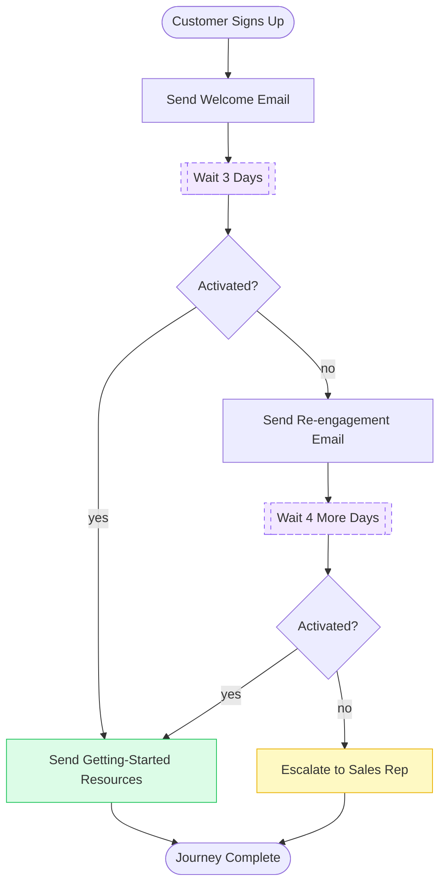

# 15. Long-Running Workflow

## 15.1 What is it?

A **Long-Running Workflow** is a single logical process that plays out over
**days or weeks**, pausing and resuming **multiple times** along the way —
not because it's waiting on one person's decision (Human Approval), and not
because it's a single background task that finishes in minutes (Async
Workflow), but because the process itself has **naturally spaced-out
stages**: "do something, then wait several days, then check in, then maybe
wait again."

Compare it to the two closest patterns already covered:

- **Human Approval Workflow** pauses **once**, waiting on **one specific
  person's decision**, and typically resolves within hours.
- **Async Workflow** runs continuously in the background and finishes on its
  own, usually within seconds or minutes — the "waiting" is just the client
  polling, not the graph itself pausing.
- **Long-Running Workflow** pauses **multiple times**, each pause driven by
  the **passage of time** (or an external system checking in periodically),
  and the whole process can span **days to weeks** from start to finish.

## 15.2 What problem does it solve?

Some real business processes simply aren't fast. A customer onboarding
journey, a multi-week procurement approval chain, a subscription renewal
cycle — these have natural checkpoints that are days apart by design, not by
accident. Trying to model this as one function call that "just waits" isn't
realistic (a process can't block for a week), and treating each stage as a
completely separate, disconnected job loses the shared context accumulated
along the way (what emails were already sent, what the customer has done so
far).

The Long-Running Workflow pattern solves this by:

- Letting **one workflow definition represent the entire journey**, even
  though it plays out over weeks, instead of splitting it into disconnected
  jobs that each have to be manually wired together.
- **Persisting state durably** across every pause, so the workflow survives
  server restarts, deployments, and long idle periods without losing track
  of where it is.
- Making each stage's logic **only reachable in the right order** — you
  can't accidentally send the "week 2 nudge" before the "week 1 welcome," in
  the same way you couldn't reorder unrelated jobs by mistake.
- Keeping **all the accumulated context in one place** — by the last stage,
  the workflow still remembers everything that happened at every earlier
  stage.

## 15.3 Realistic production example: SaaS Onboarding Journey

A SaaS company (`OnboardFlow`) runs a multi-week onboarding journey for every
new signup, designed to nudge inactive users toward activating the product:

1. **Send Welcome Email** — immediately after signup.
2. **Wait 3 days.**
3. **Check Activation** — has the customer used the core product feature
   yet?
   - **Yes** → send a "getting started" resources email and finish.
   - **No** → send a re-engagement email, then...
4. **Wait 4 more days.**
5. **Check Activation again.**
   - **Yes** → send the resources email and finish.
   - **No** → escalate to a sales rep for personal outreach, then finish.

Start to finish, this can span **a full week or more**, with the workflow
completely paused (using no compute) for most of that time, and it needs to
survive the server being redeployed multiple times along the way.

## 15.4 Architecture / Flow Diagram


```mermaid
flowchart TD
    Start([Customer Signs Up]) --> Welcome[Send Welcome Email]
    Welcome --> W1[[Wait 3 Days]]
    W1 --> C1{Activated?}
    C1 -->|yes| Success[Send Getting-Started Resources]
    C1 -->|no| Reengage[Send Re-engagement Email]
    Reengage --> W2[[Wait 4 More Days]]
    W2 --> C2{Activated?}
    C2 -->|yes| Success
    C2 -->|no| Escalate[Escalate to Sales Rep]
    Success --> End([Journey Complete])
    Escalate --> End

    style W1 fill:#F3E8FF,stroke:#8B5CF6,stroke-dasharray: 5 5
    style W2 fill:#F3E8FF,stroke:#8B5CF6,stroke-dasharray: 5 5
    style Success fill:#DCFCE7,stroke:#22C55E
    style Escalate fill:#FEF9C3,stroke:#EAB308
```

Two separate dashed "wait" boxes, days apart, both part of the **same**
customer's single workflow run — that's the defining shape of a Long-Running
Workflow.

## 15.5 Request-to-response flow, step by step

1. A signup event triggers `start_onboarding_journey(customer_id)`, which
   invokes the graph using `customer_id` as the `thread_id` — this is what
   ties every future stage back to this one customer's journey.
2. **`send_welcome_email`** runs immediately.
3. **`wait_for_check_1`** calls `interrupt()`, pausing the graph. Unlike
   Human Approval, nobody is expected to respond right away — this pause is
   meant to last **days**, and it's a **scheduler** (a daily cron job, not a
   person) that will eventually resume it.
4. **Three days later**, a scheduled job calls
   `resume_onboarding_check(customer_id)`, which invokes the graph with
   `Command(resume=None)` on that same `thread_id`. The graph picks up
   exactly at `wait_for_check_1` and continues.
5. **`check_activation`** looks up whether the customer has activated (a
   real system would query a product-usage database here). A conditional
   edge routes to `send_success_resources` (done) or `send_reengagement`
   (continue the journey).
6. If continuing, **`wait_for_check_2`** pauses again with a second
   `interrupt()` call — the **same mechanism**, used a **second time** in
   the same workflow run.
7. **Four days later**, the scheduler resumes again. `check_activation`
   (the *same* node, reused) runs a second time, and the final conditional
   edge routes to either `send_success_resources` or `escalate_to_sales`.
8. Whichever finishing node runs, the graph reaches `END` — potentially a
   full week or more after it started, having paused and resumed **twice**
   along the way.

## 15.6 Why this pattern fits this problem

- **The stages are genuinely days apart by design** — nudging a customer 3
  days after signup is a deliberate product decision, not something to rush;
  a Long-Running Workflow lets that pacing be a first-class part of the
  workflow definition instead of external glue code.
- **Reusing `interrupt()` for time-based pauses, not just human decisions**,
  shows that the same pause/resume mechanism from Pattern 12 generalizes
  well beyond "wait for a person" — here it's "wait for a scheduler," and
  the checkpointer doesn't care which one resumes it.
- **One workflow run, not several disconnected jobs**, means the state
  accumulated at every stage (which emails were sent, when) is automatically
  available at every later stage without extra plumbing.
- **Durability across the whole span matters** — this journey needs to
  survive deployments, server restarts, and idle weekends without losing
  track of a single customer's progress, which is exactly what a
  checkpointer-backed graph provides.

## 15.7 Production-quality implementation

```python
"""
Long-Running Workflow — SaaS Onboarding Journey
Pattern: one workflow run spans days/weeks, pausing MULTIPLE times via
interrupt(), resumed by a SCHEDULER rather than a single human decision

Run:
    pip install "langgraph==1.2.10" "langchain==1.3.14" "langchain-ollama==1.1.0" "pydantic==2.9.2"
    ollama pull llama3.1:8b     # make sure Ollama is running locally
    python onboarding_journey.py
"""

from __future__ import annotations

import logging
from typing import Optional

from langchain_ollama import ChatOllama
from langgraph.checkpoint.memory import InMemorySaver
from langgraph.graph import StateGraph, START, END
from langgraph.types import Command, interrupt
from pydantic import BaseModel

# --------------------------------------------------------------------------
# 1. Logging
# --------------------------------------------------------------------------
logging.basicConfig(
    level=logging.INFO,
    format="%(asctime)s | %(levelname)s | %(name)s | %(message)s",
)
logger = logging.getLogger("onboarding_journey")


# --------------------------------------------------------------------------
# 2. Shared state
# --------------------------------------------------------------------------
class OnboardingState(BaseModel):
    customer_id: str = ""
    customer_email: str = ""

    check_count: int = 0
    activated: Optional[bool] = None

    final_outcome: Optional[str] = None


_llm = ChatOllama(model="llama3.1:8b", temperature=0.3)


# --------------------------------------------------------------------------
# 3. Simulated product-usage check.
#    In production: query the real product database/analytics system.
#    For this demo: the customer activates on the SECOND check.
# --------------------------------------------------------------------------
def _has_customer_activated(customer_id: str, check_count: int) -> bool:
    return check_count >= 2


# --------------------------------------------------------------------------
# 4. Node — Send Welcome Email
# --------------------------------------------------------------------------
def send_welcome_email(state: OnboardingState) -> dict:
    logger.info("EMAIL — welcome email to %s", state.customer_email)
    # In production: call the real email service here.
    return {}


# --------------------------------------------------------------------------
# 5. Node — Wait for Check 1 (paused for ~3 days, resumed by a scheduler)
# --------------------------------------------------------------------------
def wait_for_check_1(state: OnboardingState) -> dict:
    logger.info("PAUSE — waiting 3 days before first activation check for %s", state.customer_id)
    interrupt({"wait_type": "scheduled_check", "resume_after_days": 3, "check_number": 1})
    # Execution reaches here only once a scheduler resumes this thread.
    logger.info("RESUME — scheduler resumed after wait 1 for %s", state.customer_id)
    return {}


# --------------------------------------------------------------------------
# 6. Node — Check Activation (reused for both check points)
# --------------------------------------------------------------------------
def check_activation(state: OnboardingState) -> dict:
    new_count = state.check_count + 1
    activated = _has_customer_activated(state.customer_id, new_count)
    logger.info("CHECK #%d — customer %s activated=%s", new_count, state.customer_id, activated)
    return {"check_count": new_count, "activated": activated}


def route_after_check(state: OnboardingState) -> str:
    if state.activated:
        return "send_success_resources"
    # First check failed -> continue the journey. Second check failed ->
    # this same function is used after check 2 too, where the graph edges
    # ensure "continue" means escalate instead (see build_graph()).
    return "continue_journey"


# --------------------------------------------------------------------------
# 7. Node — Send Re-engagement Email (only reached after check #1 fails)
# --------------------------------------------------------------------------
def send_reengagement_email(state: OnboardingState) -> dict:
    logger.info("EMAIL — re-engagement email to %s", state.customer_email)
    return {}


# --------------------------------------------------------------------------
# 8. Node — Wait for Check 2 (paused for ~4 more days)
# --------------------------------------------------------------------------
def wait_for_check_2(state: OnboardingState) -> dict:
    logger.info("PAUSE — waiting 4 more days before second activation check for %s", state.customer_id)
    interrupt({"wait_type": "scheduled_check", "resume_after_days": 4, "check_number": 2})
    logger.info("RESUME — scheduler resumed after wait 2 for %s", state.customer_id)
    return {}


# --------------------------------------------------------------------------
# 9. Finishing nodes
# --------------------------------------------------------------------------
def send_success_resources(state: OnboardingState) -> dict:
    logger.info("EMAIL — getting-started resources to %s (activated!)", state.customer_email)
    return {"final_outcome": "activated"}


def escalate_to_sales(state: OnboardingState) -> dict:
    logger.info("ESCALATE — routing %s to a sales rep for personal outreach", state.customer_id)
    return {"final_outcome": "escalated_to_sales"}


# --------------------------------------------------------------------------
# 10. Build the graph.
#     Two SEPARATE interrupt points, days apart, in the same workflow run.
#     A durable checkpointer is essential here -- InMemorySaver is used for
#     this demo, but a real deployment needs a persistent one (e.g.
#     PostgresSaver) since this workflow must survive restarts over a
#     span of a week or more.
# --------------------------------------------------------------------------
def build_graph():
    graph = StateGraph(OnboardingState)

    graph.add_node("send_welcome_email", send_welcome_email)
    graph.add_node("wait_for_check_1", wait_for_check_1)
    graph.add_node("check_activation_1", check_activation)
    graph.add_node("send_reengagement_email", send_reengagement_email)
    graph.add_node("wait_for_check_2", wait_for_check_2)
    graph.add_node("check_activation_2", check_activation)
    graph.add_node("send_success_resources", send_success_resources)
    graph.add_node("escalate_to_sales", escalate_to_sales)

    graph.add_edge(START, "send_welcome_email")
    graph.add_edge("send_welcome_email", "wait_for_check_1")
    graph.add_edge("wait_for_check_1", "check_activation_1")

    graph.add_conditional_edges(
        "check_activation_1",
        route_after_check,
        {
            "send_success_resources": "send_success_resources",
            "continue_journey": "send_reengagement_email",
        },
    )

    graph.add_edge("send_reengagement_email", "wait_for_check_2")
    graph.add_edge("wait_for_check_2", "check_activation_2")

    graph.add_conditional_edges(
        "check_activation_2",
        route_after_check,
        {
            "send_success_resources": "send_success_resources",
            "continue_journey": "escalate_to_sales",
        },
    )

    graph.add_edge("send_success_resources", END)
    graph.add_edge("escalate_to_sales", END)

    checkpointer = InMemorySaver()
    return graph.compile(checkpointer=checkpointer)


_app = build_graph()


# --------------------------------------------------------------------------
# 11. Public entry points
# --------------------------------------------------------------------------
def start_onboarding_journey(customer_id: str, customer_email: str) -> dict:
    thread_config = {"configurable": {"thread_id": customer_id}}
    initial_state = OnboardingState(customer_id=customer_id, customer_email=customer_email)
    result = _app.invoke(initial_state, config=thread_config)
    return result


def resume_onboarding_check(customer_id: str) -> dict:
    """Called by a scheduled job (e.g. a daily cron task), NOT by a person,
    once the appropriate number of days has passed for this customer."""
    thread_config = {"configurable": {"thread_id": customer_id}}
    result = _app.invoke(Command(resume=None), config=thread_config)
    return result


# --------------------------------------------------------------------------
# 12. Demo — simulates the full multi-week journey by manually calling
#     resume_onboarding_check() twice, standing in for a scheduler that
#     would normally do this automatically, days apart, in production.
# --------------------------------------------------------------------------
if __name__ == "__main__":
    customer_id = "CUST-5521"
    result = start_onboarding_journey(customer_id, "sam@example.com")
    print("After signup:", "__interrupt__" in result, "(paused, waiting ~3 days)")

    # ... 3 days pass in production; a scheduler calls this automatically ...
    result = resume_onboarding_check(customer_id)
    print("After check 1:", "__interrupt__" in result, "(paused again, waiting ~4 more days)")

    # ... 4 more days pass; the scheduler calls this automatically ...
    result = resume_onboarding_check(customer_id)
    print("Final outcome:", result["final_outcome"])
```

**Notes on production-readiness choices made above:**

- **`interrupt()` is reused for a *second*, unrelated pause in the same
  workflow run** — `wait_for_check_1` and `wait_for_check_2` are two
  different nodes, each calling `interrupt()` independently. This is what
  distinguishes a Long-Running Workflow from Human Approval's single pause:
  the same durable pause/resume mechanism, used multiple times across a much
  longer overall span.
- **A scheduler resumes the graph, not a person clicking a button** — the
  same `Command(resume=...)` API from Pattern 12 works identically here;
  what changes is *who* (or *what*) is on the other end deciding when to
  call it.
- **`check_activation` is a single node reused at two different points** in
  the graph — since the logic ("look up whether this customer is active")
  is identical both times, defining it once keeps the graph DRY even though
  it's wired into two different positions.
- **A durable checkpointer is non-negotiable for production** — `InMemorySaver`
  is used here purely for a runnable demo; a real deployment spanning a full
  week absolutely requires a persistent backing store (e.g. `PostgresSaver`),
  since the server process itself will likely restart at least once during
  that time.

---

⬅ [14. Async Workflow](14-async-workflow.md) | [Back to index](README.md) | Next: [16. Stateful Workflow](16-stateful-workflow.md) ➡

# SaaS Onboarding Journey — Long-Running, Scheduler-Resumed Workflow (Java + Spring AI)

A Java port of the LangGraph long-running workflow — one workflow run spans days or weeks,
pausing **multiple times** via `interrupt()`, and resumed each time by a **scheduler**, not a
single human decision. Built on:

- **Java 25** (current LTS)
- **Spring Boot 4.1.0** with **Spring Data JPA** (the durable checkpoint) and **`@Scheduled`** (the resumer)
- **Spring AI 2.0.0** (GA) with the **Ollama** starter, mirroring `llama3.1:8b`

## Mapping the shape — builds directly on the expense-approval port

This is the `expense-approval` pattern's sibling: same core idea (persist paused state, resume via
a separate call) but with two twists that change the design. First, there are **two separate
pause points** in the same journey, not one. Second, resume is driven by a **scheduler polling
for due work**, not a person clicking a button — so instead of a human-facing "decision" endpoint,
the equivalent Java piece is a `@Scheduled` task that finds journeys whose wait has elapsed and
resumes them itself.

The subtlest thing to carry over faithfully: the Python graph reuses the **same**
`check_activation` node function at both pause points, but wires its conditional edges
differently each time (`check_activation_1`'s "not activated" branch goes to re-engagement,
`check_activation_2`'s goes to escalation). A Java class can't be "the same function wired
differently" the way two `add_conditional_edges` calls can — so the port makes that context
explicit: the resume logic switches on the journey's *current stage* to decide what "not
activated" means at this point in the journey, which is exactly what the graph wiring was doing
implicitly.

| LangGraph concept | Spring / Java equivalent |
|---|---|
| `OnboardingState` + `InMemorySaver`/`PostgresSaver` | `OnboardingJourney` JPA `@Entity` — same durable-checkpoint idea as `expense-approval` |
| Two `interrupt()` calls in the same graph run | A `stage` field (`AWAITING_CHECK_1` / `AWAITING_CHECK_2`) on the persisted entity — each value *is* one of the two pause points |
| `resume_onboarding_check`, called by a cron job | `OnboardingSchedulerTask`, a real `@Scheduled` method that queries for due journeys and resumes each one |
| `check_activation` reused at two graph positions | `ActivationCheckStep.check(...)`, called from both resume paths — but the *routing after it* is decided by `OnboardingJourneyService` based on `stage`, not baked into the step itself |
| `route_after_check` (same function, different edge maps per call site) | An `if (stage == AWAITING_CHECK_1) ... else ...` branch in `OnboardingJourneyService.resumeCheck`, made explicit where the graph left it implicit in the edge wiring |
| `thread_config = {"configurable": {"thread_id": customer_id}}` | `customerId` as the entity's `@Id`, same role as the expense-approval port's `expenseId` |

---

## Project structure

```
onboarding-journey/
├── pom.xml
└── src/main/java/com/example/onboardingjourney/
    ├── OnboardingJourneyApplication.java
    ├── domain/
    │   ├── OnboardingStage.java
    │   ├── OnboardingJourney.java        (JPA entity — the durable "paused state")
    │   └── OnboardingJourneyRepository.java
    ├── model/
    │   ├── StartJourneyRequest.java
    │   └── JourneyStatusResponse.java
    ├── pipeline/
    │   ├── WelcomeEmailStep.java
    │   ├── ReengagementEmailStep.java
    │   ├── ActivationCheckStep.java
    │   ├── SuccessResourcesStep.java
    │   ├── SalesEscalationStep.java
    │   └── OnboardingJourneyService.java
    ├── scheduler/
    │   └── OnboardingSchedulerTask.java
    └── web/
        └── OnboardingJourneyController.java
└── src/main/resources/
    └── application.yml
```

---

## `pom.xml`

```xml
<?xml version="1.0" encoding="UTF-8"?>
<project xmlns="http://maven.apache.org/POM/4.0.0"
         xmlns:xsi="http://www.w3.org/2001/XMLSchema-instance"
         xsi:schemaLocation="http://maven.apache.org/POM/4.0.0 https://maven.apache.org/xsd/maven-4.0.0.xsd">
    <modelVersion>4.0.0</modelVersion>

    <groupId>com.example</groupId>
    <artifactId>onboarding-journey</artifactId>
    <version>1.0.0</version>
    <packaging>jar</packaging>

    <properties>
        <java.version>25</java.version>
        <spring-ai.version>2.0.0</spring-ai.version>
    </properties>

    <parent>
        <groupId>org.springframework.boot</groupId>
        <artifactId>spring-boot-starter-parent</artifactId>
        <version>4.1.0</version>
        <relativePath/>
    </parent>

    <dependencyManagement>
        <dependencies>
            <dependency>
                <groupId>org.springframework.ai</groupId>
                <artifactId>spring-ai-bom</artifactId>
                <version>${spring-ai.version}</version>
                <type>pom</type>
                <scope>import</scope>
            </dependency>
        </dependencies>
    </dependencyManagement>

    <dependencies>
        <dependency>
            <groupId>org.springframework.boot</groupId>
            <artifactId>spring-boot-starter-web</artifactId>
        </dependency>
        <!-- Durable checkpoint store — swap for a real PostgreSQL driver in production,
             exactly as the Python demo's own comment suggests swapping InMemorySaver
             for PostgresSaver, since this workflow must survive restarts over a week. -->
        <dependency>
            <groupId>org.springframework.boot</groupId>
            <artifactId>spring-boot-starter-data-jpa</artifactId>
        </dependency>
        <dependency>
            <groupId>com.h2database</groupId>
            <artifactId>h2</artifactId>
            <scope>runtime</scope>
        </dependency>
        <!-- Ollama model starter — kept for parity with the series; like payment-retry,
             this particular workflow's Python source constructs _llm but never calls
             it, so no ChatClient call appears in the pipeline below either. -->
        <dependency>
            <groupId>org.springframework.ai</groupId>
            <artifactId>spring-ai-starter-model-ollama</artifactId>
        </dependency>
        <dependency>
            <groupId>org.springframework.boot</groupId>
            <artifactId>spring-boot-starter-test</artifactId>
            <scope>test</scope>
        </dependency>
    </dependencies>

    <build>
        <plugins>
            <plugin>
                <groupId>org.springframework.boot</groupId>
                <artifactId>spring-boot-maven-plugin</artifactId>
            </plugin>
        </plugins>
    </build>
</project>
```

## `src/main/resources/application.yml`

```yaml
spring:
  application:
    name: onboarding-journey
  datasource:
    url: jdbc:h2:mem:onboarding-journey;DB_CLOSE_DELAY=-1
    driver-class-name: org.h2.Driver
  jpa:
    hibernate:
      ddl-auto: update
    open-in-view: false
  ai:
    ollama:
      base-url: http://localhost:11434
      chat:
        options:
          model: llama3.1:8b
          temperature: 0.3

# Real waits, in days, as the Python demo describes (3 days, then 4 more days).
# Shortened via profile-specific overrides below for a runnable demo.
onboarding:
  check1-wait: P3D
  check2-wait: P4D
  scheduler-fixed-delay-ms: 60000

logging:
  level:
    com.example.onboardingjourney: INFO

---
spring:
  config:
    activate:
      on-profile: demo

# Demo profile: seconds instead of days, and a fast scheduler poll interval,
# so the whole multi-week journey plays out in well under a minute — purely
# a demo convenience, the production values above are the real intent.
onboarding:
  check1-wait: PT3S
  check2-wait: PT4S
  scheduler-fixed-delay-ms: 1000
```

`@Scheduled`'s poll interval is unrelated to how long any individual journey waits — the
scheduler in production would run every few minutes and simply find nothing to do most of the
time, the same way a real cron job checking "who's due today" runs far more often than any given
customer's multi-day wait.

---

## Persisted state — the durable checkpoint, now with a `stage`

### `domain/OnboardingStage.java`

```java
package com.example.onboardingjourney.domain;

public enum OnboardingStage {
    AWAITING_CHECK_1,
    AWAITING_CHECK_2,
    COMPLETED
}
```

### `domain/OnboardingJourney.java`

Where `expense-approval`'s entity had one boolean-ish "are we paused" concept, this one needs
`stage` to distinguish *which* of the two pause points a journey is sitting at — the thing the
Python graph's edge wiring encoded implicitly by which node the checkpoint was captured in.

```java
package com.example.onboardingjourney.domain;

import jakarta.persistence.Entity;
import jakarta.persistence.EnumType;
import jakarta.persistence.Enumerated;
import jakarta.persistence.Id;

import java.time.Instant;

@Entity
public class OnboardingJourney {

    @Id
    private String customerId;

    private String customerEmail;
    private int checkCount;
    private Boolean activated;

    @Enumerated(EnumType.STRING)
    private OnboardingStage stage;

    /** When the scheduler is allowed to resume this journey — the durable analogue of the
     *  {@code resume_after_days} value carried in each Python {@code interrupt()} payload. */
    private Instant eligibleResumeAt;

    private String finalOutcome;

    protected OnboardingJourney() {
        // required by JPA
    }

    public OnboardingJourney(String customerId, String customerEmail) {
        this.customerId = customerId;
        this.customerEmail = customerEmail;
        this.checkCount = 0;
    }

    // -- getters/setters --

    public String getCustomerId() {
        return customerId;
    }

    public String getCustomerEmail() {
        return customerEmail;
    }

    public int getCheckCount() {
        return checkCount;
    }

    public void setCheckCount(int checkCount) {
        this.checkCount = checkCount;
    }

    public Boolean getActivated() {
        return activated;
    }

    public void setActivated(Boolean activated) {
        this.activated = activated;
    }

    public OnboardingStage getStage() {
        return stage;
    }

    public void setStage(OnboardingStage stage) {
        this.stage = stage;
    }

    public Instant getEligibleResumeAt() {
        return eligibleResumeAt;
    }

    public void setEligibleResumeAt(Instant eligibleResumeAt) {
        this.eligibleResumeAt = eligibleResumeAt;
    }

    public String getFinalOutcome() {
        return finalOutcome;
    }

    public void setFinalOutcome(String finalOutcome) {
        this.finalOutcome = finalOutcome;
    }
}
```

### `domain/OnboardingJourneyRepository.java`

```java
package com.example.onboardingjourney.domain;

import org.springframework.data.jpa.repository.JpaRepository;

import java.time.Instant;
import java.util.List;

public interface OnboardingJourneyRepository extends JpaRepository<OnboardingJourney, String> {

    // The scheduler's query: "which journeys are due for their next check right now?" —
    // the durable equivalent of a scheduler knowing which paused thread_ids to resume.
    List<OnboardingJourney> findByStageInAndEligibleResumeAtLessThanEqual(
            List<OnboardingStage> stages, Instant now);
}
```

---

## API models

### `model/StartJourneyRequest.java`

```java
package com.example.onboardingjourney.model;

public record StartJourneyRequest(String customerId, String customerEmail) {}
```

### `model/JourneyStatusResponse.java`

```java
package com.example.onboardingjourney.model;

import com.example.onboardingjourney.domain.OnboardingStage;

public record JourneyStatusResponse(
        String customerId,
        OnboardingStage stage,
        int checkCount,
        Boolean activated,
        String finalOutcome
) {}
```

---

## Steps

Each mirrors one Python node — `send_welcome_email`, `send_reengagement_email`,
`check_activation`, `send_success_resources`, `escalate_to_sales` — with the same simulated,
comment-documented production seam ("In production: call the real email service here").

### `pipeline/WelcomeEmailStep.java`

```java
package com.example.onboardingjourney.pipeline;

import org.slf4j.Logger;
import org.slf4j.LoggerFactory;
import org.springframework.stereotype.Component;

@Component
public class WelcomeEmailStep {

    private static final Logger log = LoggerFactory.getLogger(WelcomeEmailStep.class);

    public void send(String customerEmail) {
        log.info("EMAIL - welcome email to {}", customerEmail);
        // In production: call the real email service here.
    }
}
```

### `pipeline/ReengagementEmailStep.java`

```java
package com.example.onboardingjourney.pipeline;

import org.slf4j.Logger;
import org.slf4j.LoggerFactory;
import org.springframework.stereotype.Component;

@Component
public class ReengagementEmailStep {

    private static final Logger log = LoggerFactory.getLogger(ReengagementEmailStep.class);

    public void send(String customerEmail) {
        log.info("EMAIL - re-engagement email to {}", customerEmail);
        // In production: call the real email service here.
    }
}
```

### `pipeline/ActivationCheckStep.java`

The one step genuinely reused at both pause points — matching `check_activation` being the same
Python function wired into the graph twice.

```java
package com.example.onboardingjourney.pipeline;

import org.slf4j.Logger;
import org.slf4j.LoggerFactory;
import org.springframework.stereotype.Component;

@Component
public class ActivationCheckStep {

    private static final Logger log = LoggerFactory.getLogger(ActivationCheckStep.class);

    /** In production: query the real product database/analytics system.
     *  For this demo: the customer activates on the SECOND check. */
    public boolean check(String customerId, int newCheckCount) {
        boolean activated = newCheckCount >= 2;
        log.info("CHECK #{} - customer {} activated={}", newCheckCount, customerId, activated);
        return activated;
    }
}
```

### `pipeline/SuccessResourcesStep.java`

```java
package com.example.onboardingjourney.pipeline;

import org.slf4j.Logger;
import org.slf4j.LoggerFactory;
import org.springframework.stereotype.Component;

@Component
public class SuccessResourcesStep {

    private static final Logger log = LoggerFactory.getLogger(SuccessResourcesStep.class);

    public void send(String customerEmail) {
        log.info("EMAIL - getting-started resources to {} (activated!)", customerEmail);
    }
}
```

### `pipeline/SalesEscalationStep.java`

```java
package com.example.onboardingjourney.pipeline;

import org.slf4j.Logger;
import org.slf4j.LoggerFactory;
import org.springframework.stereotype.Component;

@Component
public class SalesEscalationStep {

    private static final Logger log = LoggerFactory.getLogger(SalesEscalationStep.class);

    public void escalate(String customerId) {
        log.info("ESCALATE - routing {} to a sales rep for personal outreach", customerId);
    }
}
```

---

## Orchestration — start and the two-pause resume logic

### `pipeline/OnboardingJourneyService.java`

`start(...)` is the direct analogue of `start_onboarding_journey` and `send_welcome_email` /
`wait_for_check_1` combined. `resumeCheck(...)` is the direct analogue of
`resume_onboarding_check` — and this is where the "same node, different edges per call site"
detail from the Python graph becomes an explicit `switch` on `stage`.

```java
package com.example.onboardingjourney.pipeline;

import com.example.onboardingjourney.domain.OnboardingJourney;
import com.example.onboardingjourney.domain.OnboardingJourneyRepository;
import com.example.onboardingjourney.domain.OnboardingStage;
import org.slf4j.Logger;
import org.slf4j.LoggerFactory;
import org.springframework.beans.factory.annotation.Value;
import org.springframework.stereotype.Service;
import org.springframework.transaction.annotation.Transactional;

import java.time.Duration;
import java.time.Instant;
import java.util.NoSuchElementException;

@Service
public class OnboardingJourneyService {

    private static final Logger log = LoggerFactory.getLogger(OnboardingJourneyService.class);

    private final WelcomeEmailStep welcomeEmailStep;
    private final ReengagementEmailStep reengagementEmailStep;
    private final ActivationCheckStep activationCheckStep;
    private final SuccessResourcesStep successResourcesStep;
    private final SalesEscalationStep salesEscalationStep;
    private final OnboardingJourneyRepository repository;
    private final Duration check1Wait;
    private final Duration check2Wait;

    public OnboardingJourneyService(WelcomeEmailStep welcomeEmailStep,
                                     ReengagementEmailStep reengagementEmailStep,
                                     ActivationCheckStep activationCheckStep,
                                     SuccessResourcesStep successResourcesStep,
                                     SalesEscalationStep salesEscalationStep,
                                     OnboardingJourneyRepository repository,
                                     @Value("${onboarding.check1-wait}") Duration check1Wait,
                                     @Value("${onboarding.check2-wait}") Duration check2Wait) {
        this.welcomeEmailStep = welcomeEmailStep;
        this.reengagementEmailStep = reengagementEmailStep;
        this.activationCheckStep = activationCheckStep;
        this.successResourcesStep = successResourcesStep;
        this.salesEscalationStep = salesEscalationStep;
        this.repository = repository;
        this.check1Wait = check1Wait;
        this.check2Wait = check2Wait;
    }

    /**
     * START. Sends the welcome email, then pauses at the first check point — the direct
     * analogue of send_welcome_email -> wait_for_check_1's interrupt().
     */
    @Transactional
    public OnboardingJourney start(String customerId, String customerEmail) {
        welcomeEmailStep.send(customerEmail);

        var journey = new OnboardingJourney(customerId, customerEmail);
        journey.setStage(OnboardingStage.AWAITING_CHECK_1);
        journey.setEligibleResumeAt(Instant.now().plus(check1Wait));

        log.info("PAUSE - waiting {} before first activation check for {}", check1Wait, customerId);
        return repository.save(journey);
    }

    /**
     * RESUME. Called by the scheduler (never a person) once a journey's wait has elapsed —
     * the direct analogue of resume_onboarding_check. Reuses ActivationCheckStep at both
     * pause points, but decides what happens next based on which stage this journey is at,
     * exactly matching how the Python graph wires check_activation_1's and
     * check_activation_2's conditional edges differently despite sharing one node function.
     */
    @Transactional
    public OnboardingJourney resumeCheck(String customerId) {
        OnboardingJourney journey = repository.findById(customerId)
                .orElseThrow(() -> new NoSuchElementException("No onboarding journey: " + customerId));

        OnboardingStage stageAtResume = journey.getStage();
        if (stageAtResume == OnboardingStage.COMPLETED) {
            return journey; // already finished; nothing to resume
        }

        log.info("RESUME - scheduler resumed after wait for {} (stage={})", customerId, stageAtResume);

        int newCheckCount = journey.getCheckCount() + 1;
        boolean activated = activationCheckStep.check(customerId, newCheckCount);
        journey.setCheckCount(newCheckCount);
        journey.setActivated(activated);

        if (activated) {
            successResourcesStep.send(journey.getCustomerEmail());
            journey.setStage(OnboardingStage.COMPLETED);
            journey.setFinalOutcome("activated");
        } else if (stageAtResume == OnboardingStage.AWAITING_CHECK_1) {
            // check_activation_1's "continue_journey" branch -> re-engagement, then wait 2.
            reengagementEmailStep.send(journey.getCustomerEmail());
            journey.setStage(OnboardingStage.AWAITING_CHECK_2);
            journey.setEligibleResumeAt(Instant.now().plus(check2Wait));
            log.info("PAUSE - waiting {} more before second activation check for {}", check2Wait, customerId);
        } else {
            // check_activation_2's "continue_journey" branch -> escalate, journey ends.
            salesEscalationStep.escalate(customerId);
            journey.setStage(OnboardingStage.COMPLETED);
            journey.setFinalOutcome("escalated_to_sales");
        }

        return repository.save(journey);
    }
}
```

---

## The scheduler — replaces the manual `resume_onboarding_check` calls

### `scheduler/OnboardingSchedulerTask.java`

The direct analogue of "a scheduled job (e.g. a daily cron task)" mentioned in the Python
docstring — here, actually implemented, rather than left as a comment for the reader to imagine.

```java
package com.example.onboardingjourney.scheduler;

import com.example.onboardingjourney.domain.OnboardingJourneyRepository;
import com.example.onboardingjourney.domain.OnboardingStage;
import com.example.onboardingjourney.pipeline.OnboardingJourneyService;
import org.slf4j.Logger;
import org.slf4j.LoggerFactory;
import org.springframework.scheduling.annotation.Scheduled;
import org.springframework.stereotype.Component;

import java.time.Instant;
import java.util.List;

@Component
public class OnboardingSchedulerTask {

    private static final Logger log = LoggerFactory.getLogger(OnboardingSchedulerTask.class);

    private final OnboardingJourneyRepository repository;
    private final OnboardingJourneyService onboardingJourneyService;

    public OnboardingSchedulerTask(OnboardingJourneyRepository repository,
                                    OnboardingJourneyService onboardingJourneyService) {
        this.repository = repository;
        this.onboardingJourneyService = onboardingJourneyService;
    }

    @Scheduled(fixedDelayString = "${onboarding.scheduler-fixed-delay-ms}")
    public void resumeDueJourneys() {
        var dueJourneys = repository.findByStageInAndEligibleResumeAtLessThanEqual(
                List.of(OnboardingStage.AWAITING_CHECK_1, OnboardingStage.AWAITING_CHECK_2),
                Instant.now());

        if (dueJourneys.isEmpty()) {
            return;
        }

        log.info("SCHEDULER - {} journey(s) due for their next check", dueJourneys.size());
        for (var journey : dueJourneys) {
            onboardingJourneyService.resumeCheck(journey.getCustomerId());
        }
    }
}
```

Remember to add `@EnableScheduling` — shown on `OnboardingJourneyApplication` below.

---

## Entry point

### `web/OnboardingJourneyController.java`

A manual resume endpoint is included alongside `start` so the workflow is directly testable
without waiting for the scheduler's real interval — useful for demos and tests, the same role
the Python demo's manual `resume_onboarding_check(customer_id)` calls play while standing in for
a scheduler that would call it automatically in production.

```java
package com.example.onboardingjourney.web;

import com.example.onboardingjourney.domain.OnboardingJourney;
import com.example.onboardingjourney.domain.OnboardingJourneyRepository;
import com.example.onboardingjourney.model.JourneyStatusResponse;
import com.example.onboardingjourney.model.StartJourneyRequest;
import com.example.onboardingjourney.pipeline.OnboardingJourneyService;
import org.springframework.web.bind.annotation.*;

import java.util.NoSuchElementException;

@RestController
@RequestMapping("/api/onboarding-journeys")
public class OnboardingJourneyController {

    private final OnboardingJourneyService onboardingJourneyService;
    private final OnboardingJourneyRepository onboardingJourneyRepository;

    public OnboardingJourneyController(OnboardingJourneyService onboardingJourneyService,
                                        OnboardingJourneyRepository onboardingJourneyRepository) {
        this.onboardingJourneyService = onboardingJourneyService;
        this.onboardingJourneyRepository = onboardingJourneyRepository;
    }

    @PostMapping
    public JourneyStatusResponse start(@RequestBody StartJourneyRequest request) {
        return toResponse(onboardingJourneyService.start(request.customerId(), request.customerEmail()));
    }

    @GetMapping("/{customerId}")
    public JourneyStatusResponse status(@PathVariable String customerId) {
        return toResponse(onboardingJourneyRepository.findById(customerId)
                .orElseThrow(() -> new NoSuchElementException("No onboarding journey: " + customerId)));
    }

    /** For demos/tests only — production resumption is driven entirely by OnboardingSchedulerTask. */
    @PostMapping("/{customerId}/force-check")
    public JourneyStatusResponse forceCheck(@PathVariable String customerId) {
        return toResponse(onboardingJourneyService.resumeCheck(customerId));
    }

    private JourneyStatusResponse toResponse(OnboardingJourney journey) {
        return new JourneyStatusResponse(
                journey.getCustomerId(), journey.getStage(), journey.getCheckCount(),
                journey.getActivated(), journey.getFinalOutcome());
    }
}
```

Note the deliberate separation: `status` is a **read-only** lookup straight from the repository,
while `force-check` is the only endpoint that calls `resumeCheck` and actually advances the
workflow. Keeping those two code paths distinct matters — if a status/polling endpoint ever
shared code with "advance the workflow," something as innocuous as a dashboard auto-refreshing on
a timer could silently drive a customer's journey forward.

### `OnboardingJourneyApplication.java`

```java
package com.example.onboardingjourney;

import org.springframework.boot.SpringApplication;
import org.springframework.boot.autoconfigure.SpringBootApplication;
import org.springframework.scheduling.annotation.EnableScheduling;

@SpringBootApplication
@EnableScheduling
public class OnboardingJourneyApplication {
    public static void main(String[] args) {
        SpringApplication.run(OnboardingJourneyApplication.class, args);
    }
}
```

---

## Running it

```bash
ollama pull llama3.1:8b
ollama serve   # if not already running

# demo profile: check1-wait=3s, check2-wait=4s, scheduler runs every second —
# the whole multi-week journey plays out in a few seconds.
mvn spring-boot:run -Dspring-boot.run.profiles=demo

# Start a journey
curl -X POST localhost:8080/api/onboarding-journeys \
  -H "Content-Type: application/json" \
  -d '{"customerId":"CUST-5521","customerEmail":"sam@example.com"}'

# Watch it advance on its own via the scheduler — poll a few times a few seconds apart
curl localhost:8080/api/onboarding-journeys/CUST-5521

# Or, to test without waiting on the scheduler/wait duration at all:
curl -X POST localhost:8080/api/onboarding-journeys/CUST-5521/force-check
curl -X POST localhost:8080/api/onboarding-journeys/CUST-5521/force-check
```

With the demo data (`ActivationCheckStep` activates on the *second* check), the first
`force-check` moves the journey from `AWAITING_CHECK_1` to `AWAITING_CHECK_2` (re-engagement
email sent), and the second `force-check` reaches `checkCount = 2`, activates, and completes with
`finalOutcome = "activated"`.

## Notes on the port

- **Builds on `expense-approval`'s durable-state idea, extended to two pause points**: same core
  technique (a JPA entity is the checkpoint), but this port adds a `stage` field specifically
  because there are two distinct places a journey can be paused, and later logic needs to know
  which one to behave correctly — a distinction the single-pause `expense-approval` port didn't
  need.
- **"Same node, different edges" made explicit**: `check_activation_1` and `check_activation_2`
  are the same Python function (`check_activation`) wired into two different conditional-edge
  maps. Java has no direct equivalent of "one function, two different graphs of what happens
  next" — so `OnboardingJourneyService.resumeCheck` makes that context explicit with an
  `if (stageAtResume == AWAITING_CHECK_1) ... else ...` branch, reading naturally as "what this
  particular check point does when activation hasn't happened yet."
- **The scheduler is real, not a comment**: the Python docstring for `resume_onboarding_check`
  says it's "called by a scheduled job (e.g. a daily cron task), NOT by a person" but the demo
  itself just calls it manually twice. `OnboardingSchedulerTask` in the Java port is an actual
  `@Scheduled` method querying for due journeys — this is what makes the pattern honestly
  reproducible rather than just described.
- **Status and resume are kept as separate code paths on purpose**: `status` reads straight from
  `OnboardingJourneyRepository`, while only `force-check` calls `resumeCheck`. This is worth
  calling out because "check status" and "advance the workflow" both naturally start from the
  same entity lookup, so it's an easy line to blur — and blurring it means a dashboard polling
  for status on a timer could end up silently driving a customer's journey forward.
- **No LLM call, matching the Python source**: same situation as `payment-retry` — `_llm` is
  constructed in the Python file but never invoked, so no `ChatClient` call appears in any step
  here either. The Ollama dependency stays in `pom.xml` for series consistency only.
- **Swap H2 for Postgres to go to production**: same seam as the `expense-approval` port — only
  the `datasource` block needs to change, matching the Python comment about swapping
  `InMemorySaver` for `PostgresSaver` since "this workflow must survive restarts over a span of a
  week or more."
