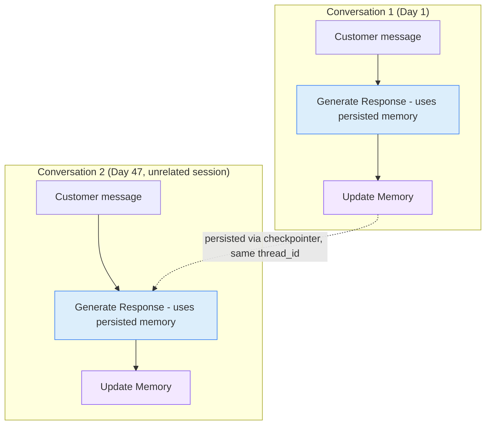

# 16. Stateful Workflow

## 16.1 What is it?

A **Stateful Workflow** maintains **persistent memory across many separate,
independent invocations** — not one workflow run progressing through stages
to a single finish line (that was Pattern 15), but an **ongoing relationship**
(a customer, a user, an account) whose accumulated context is loaded fresh
every time they interact again, however far apart those interactions are.

Every pattern in this series has used LangGraph *state* — but always
scoped to **one run**, from `START` to `END`. This final pattern is about
state that **outlives any single run**: a customer might message support
today, then again next month, then again six months later, and each time,
the workflow picks up with everything it has learned about them so far.

## 16.2 What problem does it solve?

Without persistent memory, every interaction with a customer starts from
zero — a support agent (human or AI) has to ask the same clarifying
questions every single time, and can't build on anything learned in a
previous conversation. That's frustrating for customers and wastes the value
of everything that was figured out before.

The Stateful Workflow pattern solves this by:

- **Remembering across sessions** — the workflow automatically has access to
  everything recorded in previous, completely separate interactions.
- Letting each new interaction **build on** accumulated context (known
  issues, stated preferences, prior history) instead of starting fresh.
- Keeping this **indefinitely ongoing** — there's no final "job complete"
  state the way a Sequential or Long-Running workflow has; the relationship
  just keeps accruing more context, interaction after interaction.
- Requiring **no special "load the history" code** — LangGraph's checkpointer
  handles this automatically for any thread ID that's been used before.

## 16.3 Realistic production example: Support Agent with Persistent Memory

A SaaS company (`HelpDeskAI`) runs an AI support agent for its customers.
Each customer has one ongoing thread of memory — spanning every support
conversation they've ever had, no matter how many days or months apart:

1. **Customer messages support** (this could be their very first message
   ever, or their tenth conversation over six months).
2. **`generate_response`** reads the customer's **entire accumulated
   context** — every prior known issue, every stated preference, a summary
   of past conversations — automatically restored by the checkpointer for
   that customer's thread, and generates a reply informed by all of it.
3. **`update_memory`** looks at this new exchange and appends anything worth
   remembering (a new preference mentioned, a new issue reported) onto the
   customer's persistent record.
4. The conversation turn ends — but the customer's memory **doesn't reset**.
   The next time they message support, even next month, `generate_response`
   will have everything from every previous conversation available again.

## 16.4 Architecture / Flow Diagram



Each conversation is its own complete, ordinary graph run (`START` to
`END`) — there's no pause in the middle like Patterns 12 or 15. What makes
this stateful is the dashed arrow: everything recorded in Conversation 1 is
silently available again in Conversation 2, automatically, because both runs
share the same `thread_id`.

## 16.5 Request-to-response flow, step by step

1. A customer sends a message. The application calls
   `handle_support_message(customer_id, message)`, which invokes the graph
   using `customer_id` as the `thread_id` — the same ID used for **every**
   conversation this customer will ever have.
2. Before running any node, LangGraph's checkpointer **automatically loads**
   whatever state already exists for that `thread_id` — if this is the
   customer's fifth conversation, all context from the previous four is
   already sitting in `state` before a single line of node code runs. If
   it's their first ever message, state starts empty, exactly like any
   normal first run.
3. **`generate_response`** builds a prompt that includes the customer's
   `known_issues` and `preferences` from state (which might be empty, or
   might reflect months of accumulated history), along with their new
   message, and produces a reply.
4. **`update_memory`** makes a small follow-up LLM call asking, essentially,
   "did anything in this exchange need to be remembered going forward?" — a
   new stated preference or a newly reported issue gets appended to the
   persistent lists in state.
5. The graph reaches `END`. This conversation is now over — but unlike every
   previous pattern's `END`, this one **doesn't mean the workflow is
   "done."** The customer's thread simply sits there, fully preserved,
   until they message again — in an hour, or in six months.
6. **Next time** they message, step 1 happens again with the same
   `customer_id`, and step 2 restores everything, seamlessly continuing the
   relationship.

## 16.6 Why this pattern fits this problem

- **Support conversations naturally span an unpredictable, unbounded number
  of separate sessions** — there's no way to know in advance how many times
  a customer will contact support, so a workflow with a single defined
  "completion" doesn't fit; each conversation is a complete run, but the
  *relationship* keeps going.
- **Context genuinely improves the response** — knowing a customer's
  previously reported issue or stated preference lets the agent respond
  more helpfully than if every conversation started from nothing.
- **The checkpointer does the hard part for free** — restoring "everything
  we know about this customer" doesn't require custom database queries
  wired into every node; it's the same `thread_id` mechanism used for pausing
  in Patterns 12 and 15, just applied across *separate* top-level
  invocations instead of pauses within one.
- **This closes out the series nicely**: every earlier pattern controlled
  *how a single run's state flows and combines*; this final pattern shows
  that the same state mechanics extend naturally to *relationships that
  outlive any single run* — the same tool, a genuinely different scale of
  time.

## 16.7 Production-quality implementation

```python
"""
Stateful Workflow — Support Agent with Persistent Memory
Pattern: state persists across MANY separate, independent invocations of
the same thread_id, not just within one run

Run:
    pip install "langgraph==1.2.10" "langchain==1.3.14" "langchain-ollama==1.1.0" "pydantic==2.9.2"
    ollama pull llama3.1:8b     # make sure Ollama is running locally
    python support_memory_agent.py
"""

from __future__ import annotations

import json
import logging
from typing import Optional

from langchain_ollama import ChatOllama
from langgraph.checkpoint.memory import InMemorySaver
from langgraph.graph import StateGraph, START, END
from pydantic import BaseModel

# --------------------------------------------------------------------------
# 1. Logging
# --------------------------------------------------------------------------
logging.basicConfig(
    level=logging.INFO,
    format="%(asctime)s | %(levelname)s | %(name)s | %(message)s",
)
logger = logging.getLogger("support_memory_agent")


# --------------------------------------------------------------------------
# 2. Shared state.
#    known_issues and preferences ACCUMULATE across every separate
#    conversation this customer ever has -- that's the whole pattern.
# --------------------------------------------------------------------------
class SupportState(BaseModel):
    customer_id: str = ""
    known_issues: list[str] = []
    preferences: list[str] = []

    current_message: str = ""
    response: Optional[str] = None


_llm = ChatOllama(model="llama3.1:8b", temperature=0.3)


# --------------------------------------------------------------------------
# 3. Node — Generate Response.
#    Uses whatever context the checkpointer already restored for this
#    customer's thread -- could be empty (first-ever message) or reflect
#    months of accumulated history.
# --------------------------------------------------------------------------
_RESPONSE_PROMPT = """You are a helpful support agent. Use what you already
know about this customer to give a more personal, informed reply.

Known issues from previous conversations: {issues}
Known preferences from previous conversations: {preferences}

Customer's new message: {message}

Reply helpfully in 1-3 sentences.
"""


def generate_response(state: SupportState) -> dict:
    logger.info(
        "RESPOND — customer %s (known_issues=%d, preferences=%d)",
        state.customer_id, len(state.known_issues), len(state.preferences),
    )

    response = _llm.invoke(
        _RESPONSE_PROMPT.format(
            issues=state.known_issues or "None recorded yet.",
            preferences=state.preferences or "None recorded yet.",
            message=state.current_message,
        )
    )
    return {"response": response.content.strip()}


# --------------------------------------------------------------------------
# 4. Node — Update Memory.
#    Extracts anything worth remembering long-term and APPENDS it onto the
#    persistent lists -- this is what makes future conversations smarter.
# --------------------------------------------------------------------------
_MEMORY_PROMPT = """Based on this exchange, extract anything worth
remembering for FUTURE conversations with this customer. Respond with ONLY
a JSON object, no other text:
{{"new_issue": "<a newly reported issue, or empty string>", "new_preference": "<a newly stated preference, or empty string>"}}

Customer message: {message}
Agent response: {response}
"""


def update_memory(state: SupportState) -> dict:
    try:
        result = _llm.invoke(
            _MEMORY_PROMPT.format(message=state.current_message, response=state.response)
        )
        parsed = json.loads(result.content.strip())
    except Exception as exc:  # noqa: BLE001
        logger.error("update_memory failed to parse, skipping this turn's memory update: %s", exc)
        return {}

    updates: dict = {}
    if parsed.get("new_issue"):
        logger.info("MEMORY — recording new issue: %s", parsed["new_issue"])
        updates["known_issues"] = state.known_issues + [parsed["new_issue"]]
    if parsed.get("new_preference"):
        logger.info("MEMORY — recording new preference: %s", parsed["new_preference"])
        updates["preferences"] = state.preferences + [parsed["new_preference"]]

    return updates


# --------------------------------------------------------------------------
# 5. Build the graph.
#    A completely ordinary, short graph -- START to END, no pauses. The
#    "stateful" part comes entirely from reusing the same thread_id across
#    many separate top-level invocations, not from anything inside the
#    graph itself.
# --------------------------------------------------------------------------
def build_graph():
    graph = StateGraph(SupportState)
    graph.add_node("generate_response", generate_response)
    graph.add_node("update_memory", update_memory)
    graph.add_edge(START, "generate_response")
    graph.add_edge("generate_response", "update_memory")
    graph.add_edge("update_memory", END)

    # A durable checkpointer (e.g. PostgresSaver) in production, since this
    # customer's memory needs to survive indefinitely -- potentially years,
    # across many server restarts and deployments, not just one run.
    checkpointer = InMemorySaver()
    return graph.compile(checkpointer=checkpointer)


_app = build_graph()


# --------------------------------------------------------------------------
# 6. Public entry point — called every time this customer sends a new
#    support message, whenever that happens to be.
# --------------------------------------------------------------------------
def handle_support_message(customer_id: str, message: str) -> str:
    thread_config = {"configurable": {"thread_id": customer_id}}
    # LangGraph automatically restores this thread's prior state (if any)
    # before running -- no manual "load history" step needed here.
    result = _app.invoke(SupportState(customer_id=customer_id, current_message=message), config=thread_config)
    return result["response"]


# --------------------------------------------------------------------------
# 7. Demo — simulates the SAME customer messaging support on three
#    separate, unrelated occasions, showing memory carry over each time.
# --------------------------------------------------------------------------
if __name__ == "__main__":
    customer_id = "CUST-7734"

    print("--- Conversation 1 (first ever message) ---")
    reply = handle_support_message(customer_id, "My export button keeps freezing the page.")
    print("Agent:", reply)

    print("\n--- Conversation 2 (weeks later, unrelated session) ---")
    reply = handle_support_message(customer_id, "I prefer email over phone calls for follow-ups, by the way.")
    print("Agent:", reply)

    print("\n--- Conversation 3 (months later, unrelated session) ---")
    reply = handle_support_message(customer_id, "Is there any update on that freezing issue I reported before?")
    print("Agent:", reply)
```

**Notes on production-readiness choices made above:**

- **No `interrupt()` anywhere in this pattern** — worth noting explicitly,
  since Patterns 12 and 15 both used it. Each conversation here is a
  complete, un-paused run; the persistence comes purely from reusing the
  same `thread_id` across separate top-level `invoke()` calls, not from
  pausing mid-run.
- **`known_issues` and `preferences` only ever grow (append), never reset**
  — across the whole customer relationship, this list is the durable memory
  that makes conversation 3 noticeably better-informed than conversation 1,
  which is the entire value proposition of this pattern.
- **The checkpointer restore is completely automatic** — nothing in
  `generate_response` explicitly fetches "conversation history from a
  database"; by the time the node runs, `state.known_issues` and
  `state.preferences` already reflect everything recorded in every prior,
  separate conversation for that `thread_id`.
- **A durable checkpointer is essential here too**, arguably even more than
  in Pattern 15 — this memory needs to survive not just a week, but
  potentially the customer's entire relationship with the company, which
  could be years.

---

⬅ [15. Long-Running Workflow](15-long-running-workflow.md) | [Back to index](README.md)

---

## 🎉 Series complete

That's all 16 patterns — from a straight-line Sequential pipeline all the
way to a Stateful Workflow whose memory can outlive the process that started
it. Each pattern file is self-contained with a full explanation and
production-quality code, and together they form a practical reference for
building real AI workflow systems with LangChain and LangGraph.
