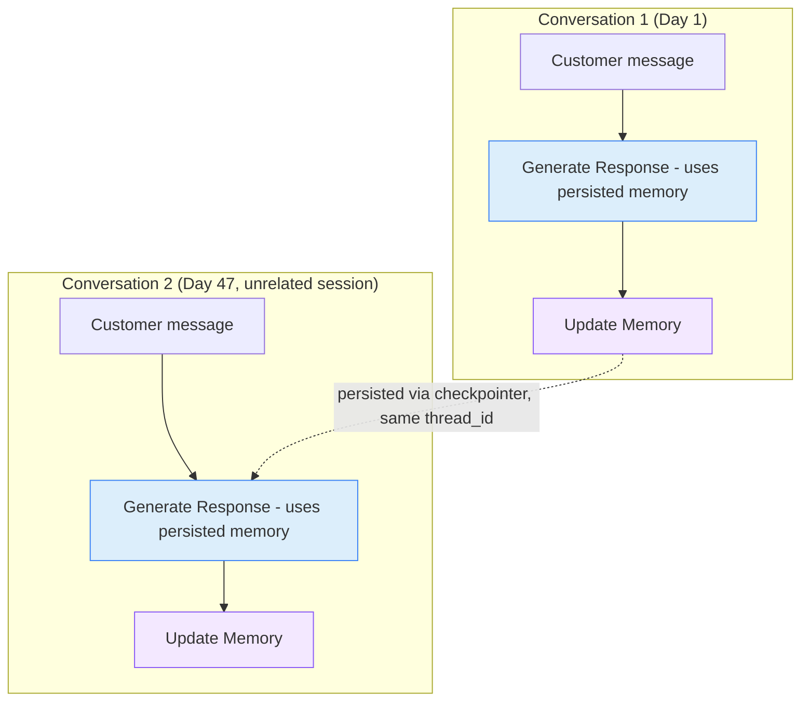

# 16. Stateful Workflow

## 16.1 What is it?

A **Stateful Workflow** maintains **persistent memory across many separate,
independent invocations** — not one workflow run progressing through stages
to a single finish line (that was Pattern 15), but an **ongoing relationship**
(a customer, a user, an account) whose accumulated context is loaded fresh
every time they interact again, however far apart those interactions are.

Every pattern in this series has used LangGraph *state* — but always
scoped to **one run**, from `START` to `END`. This final pattern is about
state that **outlives any single run**: a customer might message support
today, then again next month, then again six months later, and each time,
the workflow picks up with everything it has learned about them so far.

## 16.2 What problem does it solve?

Without persistent memory, every interaction with a customer starts from
zero — a support agent (human or AI) has to ask the same clarifying
questions every single time, and can't build on anything learned in a
previous conversation. That's frustrating for customers and wastes the value
of everything that was figured out before.

The Stateful Workflow pattern solves this by:

- **Remembering across sessions** — the workflow automatically has access to
  everything recorded in previous, completely separate interactions.
- Letting each new interaction **build on** accumulated context (known
  issues, stated preferences, prior history) instead of starting fresh.
- Keeping this **indefinitely ongoing** — there's no final "job complete"
  state the way a Sequential or Long-Running workflow has; the relationship
  just keeps accruing more context, interaction after interaction.
- Requiring **no special "load the history" code** — LangGraph's checkpointer
  handles this automatically for any thread ID that's been used before.

## 16.3 Realistic production example: Support Agent with Persistent Memory

A SaaS company (`HelpDeskAI`) runs an AI support agent for its customers.
Each customer has one ongoing thread of memory — spanning every support
conversation they've ever had, no matter how many days or months apart:

1. **Customer messages support** (this could be their very first message
   ever, or their tenth conversation over six months).
2. **`generate_response`** reads the customer's **entire accumulated
   context** — every prior known issue, every stated preference, a summary
   of past conversations — automatically restored by the checkpointer for
   that customer's thread, and generates a reply informed by all of it.
3. **`update_memory`** looks at this new exchange and appends anything worth
   remembering (a new preference mentioned, a new issue reported) onto the
   customer's persistent record.
4. The conversation turn ends — but the customer's memory **doesn't reset**.
   The next time they message support, even next month, `generate_response`
   will have everything from every previous conversation available again.

## 16.4 Architecture / Flow Diagram


```mermaid
flowchart TD
    subgraph Session1["Conversation 1 (Day 1)"]
        A1[Customer message] --> B1[Generate Response - uses persisted memory]
        B1 --> C1[Update Memory]
    end

    subgraph Session2["Conversation 2 (Day 47, unrelated session)"]
        A2[Customer message] --> B2[Generate Response - uses persisted memory]
        B2 --> C2[Update Memory]
    end

    C1 -.->|persisted via checkpointer, same thread_id| B2

    style B1 fill:#DCEEFB,stroke:#3B82F6
    style B2 fill:#DCEEFB,stroke:#3B82F6
    style C1 fill:#F3E8FF,stroke:#8B5CF6
    style C2 fill:#F3E8FF,stroke:#8B5CF6
```

Each conversation is its own complete, ordinary graph run (`START` to
`END`) — there's no pause in the middle like Patterns 12 or 15. What makes
this stateful is the dashed arrow: everything recorded in Conversation 1 is
silently available again in Conversation 2, automatically, because both runs
share the same `thread_id`.

## 16.5 Request-to-response flow, step by step

1. A customer sends a message. The application calls
   `handle_support_message(customer_id, message)`, which invokes the graph
   using `customer_id` as the `thread_id` — the same ID used for **every**
   conversation this customer will ever have.
2. Before running any node, LangGraph's checkpointer **automatically loads**
   whatever state already exists for that `thread_id` — if this is the
   customer's fifth conversation, all context from the previous four is
   already sitting in `state` before a single line of node code runs. If
   it's their first ever message, state starts empty, exactly like any
   normal first run.
3. **`generate_response`** builds a prompt that includes the customer's
   `known_issues` and `preferences` from state (which might be empty, or
   might reflect months of accumulated history), along with their new
   message, and produces a reply.
4. **`update_memory`** makes a small follow-up LLM call asking, essentially,
   "did anything in this exchange need to be remembered going forward?" — a
   new stated preference or a newly reported issue gets appended to the
   persistent lists in state.
5. The graph reaches `END`. This conversation is now over — but unlike every
   previous pattern's `END`, this one **doesn't mean the workflow is
   "done."** The customer's thread simply sits there, fully preserved,
   until they message again — in an hour, or in six months.
6. **Next time** they message, step 1 happens again with the same
   `customer_id`, and step 2 restores everything, seamlessly continuing the
   relationship.

## 16.6 Why this pattern fits this problem

- **Support conversations naturally span an unpredictable, unbounded number
  of separate sessions** — there's no way to know in advance how many times
  a customer will contact support, so a workflow with a single defined
  "completion" doesn't fit; each conversation is a complete run, but the
  *relationship* keeps going.
- **Context genuinely improves the response** — knowing a customer's
  previously reported issue or stated preference lets the agent respond
  more helpfully than if every conversation started from nothing.
- **The checkpointer does the hard part for free** — restoring "everything
  we know about this customer" doesn't require custom database queries
  wired into every node; it's the same `thread_id` mechanism used for pausing
  in Patterns 12 and 15, just applied across *separate* top-level
  invocations instead of pauses within one.
- **This closes out the series nicely**: every earlier pattern controlled
  *how a single run's state flows and combines*; this final pattern shows
  that the same state mechanics extend naturally to *relationships that
  outlive any single run* — the same tool, a genuinely different scale of
  time.

## 16.7 Production-quality implementation

```python
"""
Stateful Workflow — Support Agent with Persistent Memory
Pattern: state persists across MANY separate, independent invocations of
the same thread_id, not just within one run

Run:
    pip install "langgraph==1.2.10" "langchain==1.3.14" "langchain-ollama==1.1.0" "pydantic==2.9.2"
    ollama pull llama3.1:8b     # make sure Ollama is running locally
    python support_memory_agent.py
"""

from __future__ import annotations

import json
import logging
from typing import Optional

from langchain_ollama import ChatOllama
from langgraph.checkpoint.memory import InMemorySaver
from langgraph.graph import StateGraph, START, END
from pydantic import BaseModel

# --------------------------------------------------------------------------
# 1. Logging
# --------------------------------------------------------------------------
logging.basicConfig(
    level=logging.INFO,
    format="%(asctime)s | %(levelname)s | %(name)s | %(message)s",
)
logger = logging.getLogger("support_memory_agent")


# --------------------------------------------------------------------------
# 2. Shared state.
#    known_issues and preferences ACCUMULATE across every separate
#    conversation this customer ever has -- that's the whole pattern.
# --------------------------------------------------------------------------
class SupportState(BaseModel):
    customer_id: str = ""
    known_issues: list[str] = []
    preferences: list[str] = []

    current_message: str = ""
    response: Optional[str] = None


_llm = ChatOllama(model="llama3.1:8b", temperature=0.3)


# --------------------------------------------------------------------------
# 3. Node — Generate Response.
#    Uses whatever context the checkpointer already restored for this
#    customer's thread -- could be empty (first-ever message) or reflect
#    months of accumulated history.
# --------------------------------------------------------------------------
_RESPONSE_PROMPT = """You are a helpful support agent. Use what you already
know about this customer to give a more personal, informed reply.

Known issues from previous conversations: {issues}
Known preferences from previous conversations: {preferences}

Customer's new message: {message}

Reply helpfully in 1-3 sentences.
"""


def generate_response(state: SupportState) -> dict:
    logger.info(
        "RESPOND — customer %s (known_issues=%d, preferences=%d)",
        state.customer_id, len(state.known_issues), len(state.preferences),
    )

    response = _llm.invoke(
        _RESPONSE_PROMPT.format(
            issues=state.known_issues or "None recorded yet.",
            preferences=state.preferences or "None recorded yet.",
            message=state.current_message,
        )
    )
    return {"response": response.content.strip()}


# --------------------------------------------------------------------------
# 4. Node — Update Memory.
#    Extracts anything worth remembering long-term and APPENDS it onto the
#    persistent lists -- this is what makes future conversations smarter.
# --------------------------------------------------------------------------
_MEMORY_PROMPT = """Based on this exchange, extract anything worth
remembering for FUTURE conversations with this customer. Respond with ONLY
a JSON object, no other text:
{{"new_issue": "<a newly reported issue, or empty string>", "new_preference": "<a newly stated preference, or empty string>"}}

Customer message: {message}
Agent response: {response}
"""


def update_memory(state: SupportState) -> dict:
    try:
        result = _llm.invoke(
            _MEMORY_PROMPT.format(message=state.current_message, response=state.response)
        )
        parsed = json.loads(result.content.strip())
    except Exception as exc:  # noqa: BLE001
        logger.error("update_memory failed to parse, skipping this turn's memory update: %s", exc)
        return {}

    updates: dict = {}
    if parsed.get("new_issue"):
        logger.info("MEMORY — recording new issue: %s", parsed["new_issue"])
        updates["known_issues"] = state.known_issues + [parsed["new_issue"]]
    if parsed.get("new_preference"):
        logger.info("MEMORY — recording new preference: %s", parsed["new_preference"])
        updates["preferences"] = state.preferences + [parsed["new_preference"]]

    return updates


# --------------------------------------------------------------------------
# 5. Build the graph.
#    A completely ordinary, short graph -- START to END, no pauses. The
#    "stateful" part comes entirely from reusing the same thread_id across
#    many separate top-level invocations, not from anything inside the
#    graph itself.
# --------------------------------------------------------------------------
def build_graph():
    graph = StateGraph(SupportState)
    graph.add_node("generate_response", generate_response)
    graph.add_node("update_memory", update_memory)
    graph.add_edge(START, "generate_response")
    graph.add_edge("generate_response", "update_memory")
    graph.add_edge("update_memory", END)

    # A durable checkpointer (e.g. PostgresSaver) in production, since this
    # customer's memory needs to survive indefinitely -- potentially years,
    # across many server restarts and deployments, not just one run.
    checkpointer = InMemorySaver()
    return graph.compile(checkpointer=checkpointer)


_app = build_graph()


# --------------------------------------------------------------------------
# 6. Public entry point — called every time this customer sends a new
#    support message, whenever that happens to be.
# --------------------------------------------------------------------------
def handle_support_message(customer_id: str, message: str) -> str:
    thread_config = {"configurable": {"thread_id": customer_id}}
    # LangGraph automatically restores this thread's prior state (if any)
    # before running -- no manual "load history" step needed here.
    result = _app.invoke(SupportState(customer_id=customer_id, current_message=message), config=thread_config)
    return result["response"]


# --------------------------------------------------------------------------
# 7. Demo — simulates the SAME customer messaging support on three
#    separate, unrelated occasions, showing memory carry over each time.
# --------------------------------------------------------------------------
if __name__ == "__main__":
    customer_id = "CUST-7734"

    print("--- Conversation 1 (first ever message) ---")
    reply = handle_support_message(customer_id, "My export button keeps freezing the page.")
    print("Agent:", reply)

    print("\n--- Conversation 2 (weeks later, unrelated session) ---")
    reply = handle_support_message(customer_id, "I prefer email over phone calls for follow-ups, by the way.")
    print("Agent:", reply)

    print("\n--- Conversation 3 (months later, unrelated session) ---")
    reply = handle_support_message(customer_id, "Is there any update on that freezing issue I reported before?")
    print("Agent:", reply)
```

**Notes on production-readiness choices made above:**

- **No `interrupt()` anywhere in this pattern** — worth noting explicitly,
  since Patterns 12 and 15 both used it. Each conversation here is a
  complete, un-paused run; the persistence comes purely from reusing the
  same `thread_id` across separate top-level `invoke()` calls, not from
  pausing mid-run.
- **`known_issues` and `preferences` only ever grow (append), never reset**
  — across the whole customer relationship, this list is the durable memory
  that makes conversation 3 noticeably better-informed than conversation 1,
  which is the entire value proposition of this pattern.
- **The checkpointer restore is completely automatic** — nothing in
  `generate_response` explicitly fetches "conversation history from a
  database"; by the time the node runs, `state.known_issues` and
  `state.preferences` already reflect everything recorded in every prior,
  separate conversation for that `thread_id`.
- **A durable checkpointer is essential here too**, arguably even more than
  in Pattern 15 — this memory needs to survive not just a week, but
  potentially the customer's entire relationship with the company, which
  could be years.

---

⬅ [15. Long-Running Workflow](15-long-running-workflow.md) | [Back to index](README.md)

---

# Support Agent with Persistent Memory — Stateful Workflow (Java + Spring AI)

A Java port of the LangGraph stateful workflow — state persists across **many separate,
independent invocations** of the same customer, not just within one run. The graph itself is
completely ordinary and short; the "stateful" part comes entirely from reusing the same
`thread_id` (here, `customerId`) across calls that might be weeks or months apart. Built on:

- **Java 25** (current LTS)
- **Spring Boot 4.1.0** with **Spring Data JPA** (the durable, ever-growing memory)
- **Spring AI 2.0.0** (GA) with the **Ollama** starter, mirroring `llama3.1:8b`

## Mapping the shape

This is the simplest of the three "durable state across separate requests" ports in this series
(`expense-approval`, `onboarding-journey`, and this one) — there's no pause/resume, no scheduler,
just plain accumulation. Every invocation reads whatever's there, uses it, and appends to it. The
Python source's own comment captures the point precisely: *"A completely ordinary, short graph —
START to END, no pauses."*

| LangGraph concept | Spring / Java equivalent |
|---|---|
| `SupportState.known_issues` / `.preferences` (accumulate across invocations) | `@ElementCollection List<String>` fields on a `CustomerMemory` JPA entity |
| `InMemorySaver` / `PostgresSaver` checkpointer, keyed by `thread_id` | `CustomerMemoryRepository`, keyed by `customerId` — same durable-store role as the checkpoint entities in `expense-approval` and `onboarding-journey` |
| "LangGraph automatically restores this thread's prior state... no manual load step" | `repository.findById(customerId).orElseGet(() -> new CustomerMemory(customerId))` — one line, same effect |
| `generate_response` (uses restored context) | `ResponseGenerationStep.generate(...)` |
| `update_memory` (extracts + appends) | `MemoryExtractionStep.extract(...)`, with structured output instead of manual JSON parsing |
| `state.known_issues + [new_issue]` (list append per turn) | `memory.getKnownIssues().add(newIssue)` on the loaded entity, saved once at the end |

Unlike `expense-approval` and `onboarding-journey`, there's no "pending" state to sit in between
calls here — each invocation runs start-to-finish immediately and just leaves behind a slightly
richer memory row for next time. That's simple enough that a normal request/response cycle
suffices; no background execution or scheduler is needed anywhere in this port.

---

## Project structure

```
support-memory-agent/
├── pom.xml
└── src/main/java/com/example/supportmemoryagent/
    ├── SupportMemoryAgentApplication.java
    ├── domain/
    │   ├── CustomerMemory.java        (JPA entity — the durable, accumulating memory)
    │   └── CustomerMemoryRepository.java
    ├── model/
    │   ├── SupportMessageRequest.java
    │   ├── SupportMessageResponse.java
    │   └── MemoryUpdate.java
    ├── pipeline/
    │   ├── ResponseGenerationStep.java
    │   ├── MemoryExtractionStep.java
    │   └── SupportAgentService.java
    ├── web/
    │   └── SupportAgentController.java
    └── SupportMemoryAgentRunner.java   (CLI demo, mirrors the Python __main__ block)
└── src/main/resources/
    └── application.yml
```

---

## `pom.xml`

```xml
<?xml version="1.0" encoding="UTF-8"?>
<project xmlns="http://maven.apache.org/POM/4.0.0"
         xmlns:xsi="http://www.w3.org/2001/XMLSchema-instance"
         xsi:schemaLocation="http://maven.apache.org/POM/4.0.0 https://maven.apache.org/xsd/maven-4.0.0.xsd">
    <modelVersion>4.0.0</modelVersion>

    <groupId>com.example</groupId>
    <artifactId>support-memory-agent</artifactId>
    <version>1.0.0</version>
    <packaging>jar</packaging>

    <properties>
        <java.version>25</java.version>
        <spring-ai.version>2.0.0</spring-ai.version>
    </properties>

    <parent>
        <groupId>org.springframework.boot</groupId>
        <artifactId>spring-boot-starter-parent</artifactId>
        <version>4.1.0</version>
        <relativePath/>
    </parent>

    <dependencyManagement>
        <dependencies>
            <dependency>
                <groupId>org.springframework.ai</groupId>
                <artifactId>spring-ai-bom</artifactId>
                <version>${spring-ai.version}</version>
                <type>pom</type>
                <scope>import</scope>
            </dependency>
        </dependencies>
    </dependencyManagement>

    <dependencies>
        <dependency>
            <groupId>org.springframework.boot</groupId>
            <artifactId>spring-boot-starter-web</artifactId>
        </dependency>
        <!-- Durable memory store — swap for a real PostgreSQL driver in production,
             exactly as the Python comment suggests swapping InMemorySaver for
             PostgresSaver, since this memory needs to survive indefinitely. -->
        <dependency>
            <groupId>org.springframework.boot</groupId>
            <artifactId>spring-boot-starter-data-jpa</artifactId>
        </dependency>
        <dependency>
            <groupId>com.h2database</groupId>
            <artifactId>h2</artifactId>
            <scope>runtime</scope>
        </dependency>
        <!-- Ollama model starter — local llama3.1:8b, same as langchain-ollama -->
        <dependency>
            <groupId>org.springframework.ai</groupId>
            <artifactId>spring-ai-starter-model-ollama</artifactId>
        </dependency>
        <dependency>
            <groupId>org.springframework.boot</groupId>
            <artifactId>spring-boot-starter-test</artifactId>
            <scope>test</scope>
        </dependency>
    </dependencies>

    <build>
        <plugins>
            <plugin>
                <groupId>org.springframework.boot</groupId>
                <artifactId>spring-boot-maven-plugin</artifactId>
            </plugin>
        </plugins>
    </build>
</project>
```

## `src/main/resources/application.yml`

```yaml
spring:
  application:
    name: support-memory-agent
  datasource:
    url: jdbc:h2:mem:support-memory-agent;DB_CLOSE_DELAY=-1
    driver-class-name: org.h2.Driver
  jpa:
    hibernate:
      ddl-auto: update
    open-in-view: false
  ai:
    ollama:
      base-url: http://localhost:11434
      chat:
        options:
          model: llama3.1:8b
          temperature: 0.3

logging:
  level:
    com.example.supportmemoryagent: INFO
```

---

## Persisted state — the durable, ever-growing memory

### `domain/CustomerMemory.java`

Where `expense-approval` and `onboarding-journey` persist a paused *workflow run*, this entity
persists something that outlives any single run entirely — a customer's accumulated history,
added to a little more on every conversation, indefinitely.

```java
package com.example.supportmemoryagent.domain;

import jakarta.persistence.CollectionTable;
import jakarta.persistence.ElementCollection;
import jakarta.persistence.Entity;
import jakarta.persistence.Id;
import jakarta.persistence.JoinColumn;

import java.util.ArrayList;
import java.util.List;

@Entity
public class CustomerMemory {

    @Id
    private String customerId;

    @ElementCollection
    @CollectionTable(name = "customer_known_issues", joinColumns = @JoinColumn(name = "customer_id"))
    private List<String> knownIssues = new ArrayList<>();

    @ElementCollection
    @CollectionTable(name = "customer_preferences", joinColumns = @JoinColumn(name = "customer_id"))
    private List<String> preferences = new ArrayList<>();

    protected CustomerMemory() {
        // required by JPA
    }

    public CustomerMemory(String customerId) {
        this.customerId = customerId;
    }

    public String getCustomerId() {
        return customerId;
    }

    public List<String> getKnownIssues() {
        return knownIssues;
    }

    public List<String> getPreferences() {
        return preferences;
    }
}
```

### `domain/CustomerMemoryRepository.java`

```java
package com.example.supportmemoryagent.domain;

import org.springframework.data.jpa.repository.JpaRepository;

public interface CustomerMemoryRepository extends JpaRepository<CustomerMemory, String> {
}
```

---

## API models

### `model/SupportMessageRequest.java`

```java
package com.example.supportmemoryagent.model;

public record SupportMessageRequest(String customerId, String message) {}
```

### `model/SupportMessageResponse.java`

```java
package com.example.supportmemoryagent.model;

public record SupportMessageResponse(String response) {}
```

### `model/MemoryUpdate.java`

Structured output target for the memory-extraction call — replaces the manual `json.loads` +
`try/except` block.

```java
package com.example.supportmemoryagent.model;

import com.fasterxml.jackson.annotation.JsonClassDescription;
import com.fasterxml.jackson.annotation.JsonPropertyDescription;

@JsonClassDescription("Anything worth remembering from this support exchange for future conversations")
public record MemoryUpdate(
        @JsonPropertyDescription("A newly reported issue, or empty string if none")
        String newIssue,
        @JsonPropertyDescription("A newly stated preference, or empty string if none")
        String newPreference
) {}
```

---

## Steps

### `pipeline/ResponseGenerationStep.java`

Uses whatever context was already loaded for this customer — could be empty (first-ever message)
or reflect months of accumulated history — the direct analogue of `generate_response`.

```java
package com.example.supportmemoryagent.pipeline;

import org.slf4j.Logger;
import org.slf4j.LoggerFactory;
import org.springframework.ai.chat.client.ChatClient;
import org.springframework.stereotype.Component;

import java.util.List;

@Component
public class ResponseGenerationStep {

    private static final Logger log = LoggerFactory.getLogger(ResponseGenerationStep.class);

    private static final String RESPONSE_PROMPT = """
            You are a helpful support agent. Use what you already know about this \
            customer to give a more personal, informed reply.

            Known issues from previous conversations: {issues}
            Known preferences from previous conversations: {preferences}

            Customer's new message: {message}

            Reply helpfully in 1-3 sentences.
            """;

    private final ChatClient chatClient;

    public ResponseGenerationStep(ChatClient.Builder chatClientBuilder) {
        this.chatClient = chatClientBuilder.build();
    }

    public String generate(String customerId, List<String> knownIssues, List<String> preferences,
                            String message) {
        log.info("RESPOND - customer {} (known_issues={}, preferences={})",
                customerId, knownIssues.size(), preferences.size());

        return chatClient.prompt()
                .user(u -> u.text(RESPONSE_PROMPT)
                        .param("issues", knownIssues.isEmpty() ? "None recorded yet." : knownIssues.toString())
                        .param("preferences", preferences.isEmpty() ? "None recorded yet." : preferences.toString())
                        .param("message", message))
                .call()
                .content()
                .strip();
    }
}
```

### `pipeline/MemoryExtractionStep.java`

Extracts anything worth remembering long-term — the direct analogue of `update_memory`, but with
structured output instead of manual JSON parsing. On failure, this turn's memory update is simply
skipped, matching the Python version's `return {}` fallback exactly.

```java
package com.example.supportmemoryagent.pipeline;

import com.example.supportmemoryagent.model.MemoryUpdate;
import org.slf4j.Logger;
import org.slf4j.LoggerFactory;
import org.springframework.ai.chat.client.ChatClient;
import org.springframework.stereotype.Component;

import java.util.Optional;

@Component
public class MemoryExtractionStep {

    private static final Logger log = LoggerFactory.getLogger(MemoryExtractionStep.class);

    private static final String MEMORY_PROMPT = """
            Based on this exchange, extract anything worth remembering for FUTURE \
            conversations with this customer.

            Customer message: {message}
            Agent response: {response}
            """;

    private final ChatClient chatClient;

    public MemoryExtractionStep(ChatClient.Builder chatClientBuilder) {
        this.chatClient = chatClientBuilder.build();
    }

    public Optional<MemoryUpdate> extract(String customerMessage, String agentResponse) {
        try {
            MemoryUpdate update = chatClient.prompt()
                    .user(u -> u.text(MEMORY_PROMPT)
                            .param("message", customerMessage)
                            .param("response", agentResponse))
                    .call()
                    .entity(MemoryUpdate.class);
            return Optional.of(update);
        } catch (Exception e) {
            log.error("update_memory failed to parse, skipping this turn's memory update: {}", e.getMessage());
            return Optional.empty();
        }
    }
}
```

---

## Orchestration

### `pipeline/SupportAgentService.java`

The direct analogue of `handle_support_message` plus the graph's two edges (`generate_response ->
update_memory`). Loading prior state is one repository call instead of LangGraph's automatic
restore, and both happen inside one transaction so a customer's memory update is never left
half-applied.

```java
package com.example.supportmemoryagent.pipeline;

import com.example.supportmemoryagent.domain.CustomerMemory;
import com.example.supportmemoryagent.domain.CustomerMemoryRepository;
import org.slf4j.Logger;
import org.slf4j.LoggerFactory;
import org.springframework.stereotype.Service;
import org.springframework.transaction.annotation.Transactional;

@Service
public class SupportAgentService {

    private static final Logger log = LoggerFactory.getLogger(SupportAgentService.class);

    private final ResponseGenerationStep responseGenerationStep;
    private final MemoryExtractionStep memoryExtractionStep;
    private final CustomerMemoryRepository customerMemoryRepository;

    public SupportAgentService(ResponseGenerationStep responseGenerationStep,
                                MemoryExtractionStep memoryExtractionStep,
                                CustomerMemoryRepository customerMemoryRepository) {
        this.responseGenerationStep = responseGenerationStep;
        this.memoryExtractionStep = memoryExtractionStep;
        this.customerMemoryRepository = customerMemoryRepository;
    }

    /**
     * Called every time this customer sends a new support message, whenever that happens
     * to be — the direct analogue of handle_support_message.
     */
    @Transactional
    public String handleMessage(String customerId, String message) {
        // "LangGraph automatically restores this thread's prior state (if any) before
        // running" becomes: load the row, or start a fresh one if this is the first
        // message this customer has ever sent.
        CustomerMemory memory = customerMemoryRepository.findById(customerId)
                .orElseGet(() -> new CustomerMemory(customerId));

        String response = responseGenerationStep.generate(
                customerId, memory.getKnownIssues(), memory.getPreferences(), message);

        memoryExtractionStep.extract(message, response).ifPresent(update -> {
            if (update.newIssue() != null && !update.newIssue().isBlank()) {
                log.info("MEMORY - recording new issue: {}", update.newIssue());
                memory.getKnownIssues().add(update.newIssue());
            }
            if (update.newPreference() != null && !update.newPreference().isBlank()) {
                log.info("MEMORY - recording new preference: {}", update.newPreference());
                memory.getPreferences().add(update.newPreference());
            }
        });

        customerMemoryRepository.save(memory);
        return response;
    }
}
```

---

## Entry points

### `web/SupportAgentController.java`

```java
package com.example.supportmemoryagent.web;

import com.example.supportmemoryagent.model.SupportMessageRequest;
import com.example.supportmemoryagent.model.SupportMessageResponse;
import com.example.supportmemoryagent.pipeline.SupportAgentService;
import org.springframework.web.bind.annotation.PostMapping;
import org.springframework.web.bind.annotation.RequestBody;
import org.springframework.web.bind.annotation.RestController;

@RestController
public class SupportAgentController {

    private final SupportAgentService supportAgentService;

    public SupportAgentController(SupportAgentService supportAgentService) {
        this.supportAgentService = supportAgentService;
    }

    @PostMapping("/api/support-messages")
    public SupportMessageResponse handle(@RequestBody SupportMessageRequest request) {
        String response = supportAgentService.handleMessage(request.customerId(), request.message());
        return new SupportMessageResponse(response);
    }
}
```

### `SupportMemoryAgentRunner.java` (CLI demo, mirrors the Python `if __name__ == "__main__"` block)

Unlike `expense-approval` and `onboarding-journey`, a single-process demo is honest here — there's
no real-world wait baked into the pattern itself, just three calls that happen to be conceptually
far apart in time.

```java
package com.example.supportmemoryagent;

import com.example.supportmemoryagent.pipeline.SupportAgentService;
import org.springframework.boot.CommandLineRunner;
import org.springframework.context.annotation.Profile;
import org.springframework.stereotype.Component;

@Component
@Profile("demo")
public class SupportMemoryAgentRunner implements CommandLineRunner {

    private final SupportAgentService supportAgentService;

    public SupportMemoryAgentRunner(SupportAgentService supportAgentService) {
        this.supportAgentService = supportAgentService;
    }

    @Override
    public void run(String... args) {
        String customerId = "CUST-7734";

        System.out.println("--- Conversation 1 (first ever message) ---");
        String reply1 = supportAgentService.handleMessage(
                customerId, "My export button keeps freezing the page.");
        System.out.println("Agent: " + reply1);

        System.out.println("\n--- Conversation 2 (weeks later, unrelated session) ---");
        String reply2 = supportAgentService.handleMessage(
                customerId, "I prefer email over phone calls for follow-ups, by the way.");
        System.out.println("Agent: " + reply2);

        System.out.println("\n--- Conversation 3 (months later, unrelated session) ---");
        String reply3 = supportAgentService.handleMessage(
                customerId, "Is there any update on that freezing issue I reported before?");
        System.out.println("Agent: " + reply3);
    }
}
```

### `SupportMemoryAgentApplication.java`

```java
package com.example.supportmemoryagent;

import org.springframework.boot.SpringApplication;
import org.springframework.boot.autoconfigure.SpringBootApplication;

@SpringBootApplication
public class SupportMemoryAgentApplication {
    public static void main(String[] args) {
        SpringApplication.run(SupportMemoryAgentApplication.class, args);
    }
}
```

---

## Running it

```bash
ollama pull llama3.1:8b
ollama serve   # if not already running

# CLI demo (three conversations for the same customer, memory carries over each time)
mvn spring-boot:run -Dspring-boot.run.profiles=demo

# Or as a service — same customerId across calls accumulates memory
mvn spring-boot:run
curl -X POST localhost:8080/api/support-messages \
  -H "Content-Type: application/json" \
  -d '{"customerId":"CUST-7734","message":"My export button keeps freezing the page."}'

curl -X POST localhost:8080/api/support-messages \
  -H "Content-Type: application/json" \
  -d '{"customerId":"CUST-7734","message":"Is there any update on that freezing issue I reported before?"}'
```

## Notes on the port

- **The graph inside each call is genuinely ordinary**: there's no branch, no loop, no pause
  anywhere in `SupportAgentService.handleMessage` — same as the Python version's own point that
  the "stateful" part comes entirely from *what's loaded before* and *what's saved after*, not
  from anything happening in between. This is the simplest of the three durable-state ports in
  the series precisely because of that.
- **Structured extraction, same fallback behavior**: `.call().entity(MemoryUpdate.class)` replaces
  the manual `json.loads(result.content.strip())` + `try/except`, and on failure the Java version
  does exactly what the Python one does — skip this turn's memory update entirely (`return {}` →
  `Optional.empty()`), rather than guessing or partially applying anything.
- **One transaction covers load, generate, extract, and save**: `@Transactional` on
  `handleMessage` ensures a customer's memory update is atomic — either the whole turn's new
  issue/preference (if any) gets persisted, or none of it does, never a partial append.
- **A single-process CLI demo is the right call here, unlike the other two durable-state ports**:
  `expense-approval` and `onboarding-journey` both involve real-world waiting (a manager's
  decision, multi-day scheduler delays) that a same-process demo would misrepresent. This
  pattern's "separate invocations" are only conceptually separate — nothing about the pattern
  itself requires wall-clock time to pass between them — so a `CommandLineRunner` calling
  `handleMessage` three times in a row is an honest demonstration, not a simplification that
  hides anything.
- **Versions**: same Ollama-backed `spring-ai-starter-model-ollama` / `llama3.1:8b` setup as the
  other ports in this series, plus the same H2-for-demo/Postgres-for-production seam used in
  `expense-approval` and `onboarding-journey`.
