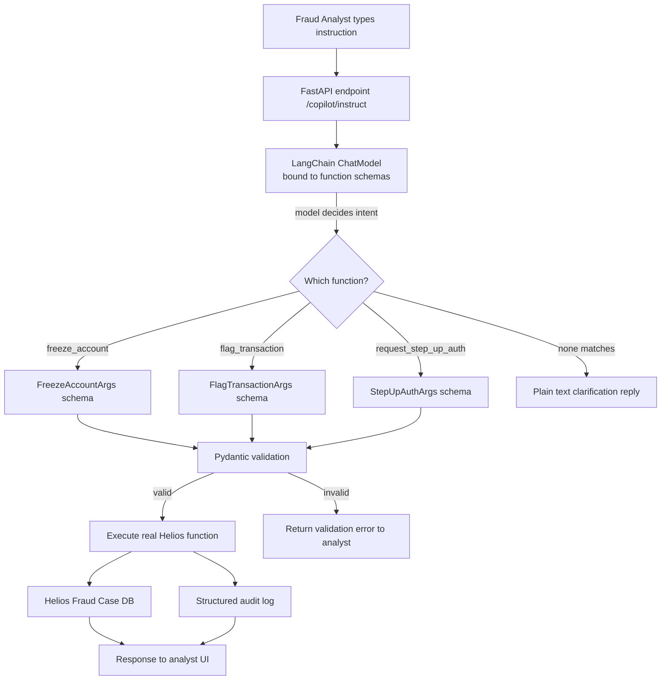

# Pattern 01 — Function Calling

> **Series:** Tool-Use Patterns (18 total) — Helios Fraud Platform Edition
> **Stack:** Python 3.12, LangChain 1.3.x, LangGraph 1.2.x, Pydantic v2
> **Status:** ✅ Complete

---

## 1. What is Function Calling?

Function Calling is the ability of an LLM to **look at a natural-language message, decide that a specific predefined function needs to run, and output a structured (JSON) payload that matches that function's signature** — instead of replying with free text.

The model itself never executes code. It only produces the *intent* + *arguments*. Your application reads that structured output and actually calls the real Python function.

Think of it as the LLM filling out a form on your behalf:

```
User: "Flag transaction TXN-88213 as suspicious, risk score 87"
Model: NOT a sentence.
Model:  { "function": "flag_transaction",
          "arguments": { "transaction_id": "TXN-88213", "risk_score": 87 } }
```

This is the **foundational** pattern in this series — every other tool-use pattern (Tool Calling, Tool Routing, MCP, etc.) is built on top of this one basic capability: *turning language into a structured, executable call.*

**How it's different from "Tool Calling" (Pattern 02):**
- **Function Calling** = a single, deterministic mapping from an utterance to one structured call. It is a *data-extraction and invocation* primitive.
- **Tool Calling** (next pattern) = the *loop* — the model calling one or more tools repeatedly, observing results, and deciding what to do next (ReAct-style). Function Calling is the mechanism; Tool Calling is the orchestration built on that mechanism.

You should master Function Calling first because it is the atomic unit everything else composes.

---

## 2. What Problem Does It Solve?

Before function calling existed, developers extracted structured data from LLM text output using regex, string parsing, or asking the model to "reply only in JSON" and hoping the format was respected. This was fragile:

| Problem with plain text prompting | How Function Calling fixes it |
|---|---|
| Model sometimes adds explanations before/after the JSON, breaking `json.loads()` | Model output is constrained at decoding time to match a schema |
| No way to tell the model "this argument must be an integer 0-100" | Pydantic/JSON-Schema types are enforced |
| Ambiguous which of several possible actions the user meant | Model explicitly names the function it intends to call |
| Impossible to validate before executing something risky (e.g., freezing a bank account) | Structured arguments can be validated with a schema *before* execution |
| Hard to compose multiple possible actions | Model can choose from a list of registered function signatures |

In short: Function Calling turns an LLM from a "text generator" into a **reliable intent + parameter extractor** that a backend system can safely act on.

---

## 3. Realistic Production Problem — Helios Fraud Operations

**Platform context:** Helios is a banking fraud-operations platform. Fraud analysts investigate flagged transactions all day. Currently they manually:

1. Read a transaction description or alert note (often free text from a case log, an email, or a chat message from another analyst).
2. Manually decide which backend action applies (freeze account, request extra verification, mark as false positive, escalate to Level-2).
3. Manually fill a form in the case-management UI with the right IDs and parameters.

**The ask:** Build a "Fraud Copilot" — analysts type a plain-English instruction into a chat box (e.g. *"Freeze account ACC-44932, this looks like a card-testing attack, confidence is high"*), and the system converts that into a **validated, structured function call** against the real Helios fraud API — `freeze_account(account_id, reason, confidence)` — instead of the analyst clicking through five UI screens.

This is a textbook Function Calling problem because:
- There is a **fixed, known set of backend operations** (freeze account, flag transaction, request step-up auth, close case).
- Each operation has a **strict parameter contract** (account IDs must match `ACC-\d{5}`, confidence must be `low|medium|high`, risk score 0–100).
- We need to **extract structured data reliably** from unstructured analyst input, and **never silently guess** an account ID.
- A wrong call is costly (freezing the wrong customer's account), so validation before execution is mandatory.

---

## 4. Architecture / Flow Diagram



**Component roles:**

| Component | Responsibility |
|---|---|
| `ChatModel.bind_tools()` | Tells the LLM the exact JSON schema of every callable function |
| Model's tool-call output | Structured `{name, arguments}` — never executed blindly |
| Pydantic schema | Second line of defense — re-validates types/ranges/regex before touching real systems |
| Executor layer | The actual Python functions that mutate Helios state |
| Audit log | Every function call (who asked, what model chose, what ran) is recorded — mandatory in banking |

---

## 5. Complete Request → Response Flow

1. **Analyst input** — A raw string arrives at `POST /copilot/instruct`, e.g. `"Freeze ACC-44932, card testing attack, high confidence"`.
2. **Schema binding** — At startup, we register 3 Pydantic models (`FreezeAccountArgs`, `FlagTransactionArgs`, `StepUpAuthArgs`) as LangChain tool schemas and bind them to the chat model with `llm.bind_tools([...])`.
3. **Single model call** — We send the analyst's message plus a system prompt describing Helios domain rules. We do **not** loop — this is a single decision, not an agentic loop (that's Pattern 02).
4. **Model response** — The model returns an `AIMessage` whose `.tool_calls` list contains **zero or one** structured call (we constrain to `tool_choice="auto"` but instruct the model to pick at most one action per turn).
5. **Schema re-validation** — Even though the model schema *should* guarantee correct types, we re-validate with Pydantic (`model_validate`) because LLM output is never 100% guaranteed to satisfy constraints like regex patterns — some providers only enforce JSON *shape*, not business rules.
6. **Execution guard** — High-impact functions (`freeze_account`) require `confidence` to be `medium` or `high`; otherwise, we reject and ask the analyst to clarify — a business rule the schema can't fully express.
7. **Execution** — The matching real Python function runs against a (simulated) Helios database.
8. **Audit + response** — Every call, whether executed or rejected, is written to a structured audit log (required for SOC2 / banking compliance) and a JSON response goes back to the analyst UI.

---

## 6. Why Function Calling Is the Right Pattern Here

- **Single-turn, deterministic mapping** — each analyst instruction maps to *at most one* backend action. We don't need a multi-step reasoning loop (Tool Calling/ReAct) — that would be over-engineering here and add latency/cost for no benefit.
- **Safety-critical parameter validation** — banking operations must never run on loosely-parsed text. A typed schema is the contract between "what the model understood" and "what code is allowed to execute."
- **Auditability** — regulators want to see exactly which function was invoked with which arguments and why. Structured output makes this trivial; free-text parsing does not.
- **Extensibility** — adding a new backend capability (e.g., `unfreeze_account`) is just registering one more schema, no prompt-engineering gymnastics required.

---

## 7. Production-Quality Implementation (Python)

### 7.1 Requirements

```bash
python -m venv .venv && source .venv/bin/activate
pip install "langchain==1.3.15" "langgraph==1.2.10" "langchain-anthropic==0.5.*" \
            "pydantic==2.*" "fastapi==0.115.*" "uvicorn==0.34.*"
```

> We use `langchain-anthropic` as the model provider in examples (Claude), but `bind_tools()` works identically with `langchain-openai`, `langchain-google-genai`, etc. Swap the import if you use a different provider.

### 7.2 Full Code

```python
"""
Helios Fraud Copilot — Function Calling Pattern
=================================================
Single-turn structured function extraction & execution for fraud analyst
instructions. Production-quality reference implementation.

Run:
    export ANTHROPIC_API_KEY=sk-...
    uvicorn fraud_copilot:app --reload
"""

from __future__ import annotations

import logging
import re
import uuid
from datetime import datetime, timezone
from enum import Enum
from typing import Literal, Optional, Union

from fastapi import FastAPI, HTTPException
from langchain_anthropic import ChatAnthropic
from langchain_core.messages import HumanMessage, SystemMessage
from pydantic import BaseModel, Field, field_validator

# --------------------------------------------------------------------------
# 1. Structured logging / audit trail (mandatory in banking systems)
# --------------------------------------------------------------------------

logger = logging.getLogger("helios.fraud_copilot")
logging.basicConfig(level=logging.INFO)


def audit_log(event: str, **fields) -> None:
    """Emit a structured audit record. In real Helios this ships to an
    append-only audit store (e.g. Kafka -> S3 + OpenTelemetry span events)."""
    logger.info("AUDIT | event=%s | %s", event, fields)


# --------------------------------------------------------------------------
# 2. Function argument schemas (the "contract" the LLM must fill in)
# --------------------------------------------------------------------------

ACCOUNT_ID_PATTERN = re.compile(r"^ACC-\d{5}$")
TRANSACTION_ID_PATTERN = re.compile(r"^TXN-\d{5}$")


class ConfidenceLevel(str, Enum):
    low = "low"
    medium = "medium"
    high = "high"


class FreezeAccountArgs(BaseModel):
    """Freeze a customer account to stop further transactions immediately."""

    account_id: str = Field(..., description="Helios account ID, format ACC-#####")
    reason: str = Field(..., min_length=5, max_length=280,
                         description="Short human-readable justification")
    confidence: ConfidenceLevel = Field(
        ..., description="Analyst / model confidence this is genuine fraud"
    )

    @field_validator("account_id")
    @classmethod
    def validate_account_id(cls, v: str) -> str:
        if not ACCOUNT_ID_PATTERN.match(v):
            raise ValueError(f"account_id '{v}' does not match ACC-##### format")
        return v


class FlagTransactionArgs(BaseModel):
    """Flag a single transaction as suspicious for later review (non-destructive)."""

    transaction_id: str = Field(..., description="Helios transaction ID, TXN-#####")
    risk_score: int = Field(..., ge=0, le=100, description="0=benign, 100=certain fraud")
    note: Optional[str] = Field(None, max_length=280)

    @field_validator("transaction_id")
    @classmethod
    def validate_txn_id(cls, v: str) -> str:
        if not TRANSACTION_ID_PATTERN.match(v):
            raise ValueError(f"transaction_id '{v}' does not match TXN-##### format")
        return v


class StepUpAuthArgs(BaseModel):
    """Request additional customer verification (OTP / biometric) before allowing
    the next transaction — a softer action than freezing the account."""

    account_id: str = Field(..., description="Helios account ID, format ACC-#####")
    method: Literal["otp_sms", "otp_email", "biometric"] = "otp_sms"

    @field_validator("account_id")
    @classmethod
    def validate_account_id(cls, v: str) -> str:
        if not ACCOUNT_ID_PATTERN.match(v):
            raise ValueError(f"account_id '{v}' does not match ACC-##### format")
        return v


# Registry mapping a tool name -> (schema, real executor)
ToolSchema = Union[FreezeAccountArgs, FlagTransactionArgs, StepUpAuthArgs]


# --------------------------------------------------------------------------
# 3. Real backend executors (would call the actual Helios services / DB)
# --------------------------------------------------------------------------

def exec_freeze_account(args: FreezeAccountArgs) -> dict:
    # Business rule the JSON schema alone can't express: never auto-freeze
    # on low confidence — require a human to confirm explicitly.
    if args.confidence == ConfidenceLevel.low:
        raise ValueError(
            "Refusing to freeze account on 'low' confidence. "
            "Escalate to a Level-2 analyst instead."
        )
    # ... real implementation would call helios_client.freeze(account_id=...)
    return {
        "action": "freeze_account",
        "account_id": args.account_id,
        "status": "FROZEN",
        "reason": args.reason,
    }


def exec_flag_transaction(args: FlagTransactionArgs) -> dict:
    return {
        "action": "flag_transaction",
        "transaction_id": args.transaction_id,
        "risk_score": args.risk_score,
        "status": "FLAGGED_FOR_REVIEW",
    }


def exec_step_up_auth(args: StepUpAuthArgs) -> dict:
    return {
        "action": "request_step_up_auth",
        "account_id": args.account_id,
        "method": args.method,
        "status": "CHALLENGE_SENT",
    }


EXECUTORS = {
    "freeze_account": (FreezeAccountArgs, exec_freeze_account),
    "flag_transaction": (FlagTransactionArgs, exec_flag_transaction),
    "request_step_up_auth": (StepUpAuthArgs, exec_step_up_auth),
}


# --------------------------------------------------------------------------
# 4. Bind schemas to the model as callable "functions" / tools
# --------------------------------------------------------------------------

SYSTEM_PROMPT = """You are the Helios Fraud Copilot function router.

Your ONLY job is to read a fraud analyst's instruction and, if it clearly maps
to one of your available functions, call that function with correctly typed
arguments extracted from the instruction.

Rules:
- Call AT MOST ONE function per message.
- Never invent an account_id or transaction_id that was not explicitly stated
  by the analyst. If an ID is missing or ambiguous, do not call a function —
  reply in plain text asking for clarification instead.
- Infer 'confidence' conservatively: only use 'high' if the analyst uses
  strong language ("definitely", "clearly", "high confidence"); default to
  'medium' for normal suspicion; use 'low' if they express doubt.
- If nothing matches, just reply normally in plain text.
"""

_llm = ChatAnthropic(model="claude-sonnet-4-6", temperature=0)
_llm_with_tools = _llm.bind_tools(
    [FreezeAccountArgs, FlagTransactionArgs, StepUpAuthArgs]
)


# --------------------------------------------------------------------------
# 5. Orchestration: one model call -> validate -> execute -> audit
# --------------------------------------------------------------------------

class CopilotResponse(BaseModel):
    request_id: str
    function_called: Optional[str] = None
    result: Optional[dict] = None
    clarification: Optional[str] = None
    error: Optional[str] = None


def run_copilot_instruction(analyst_message: str, analyst_id: str) -> CopilotResponse:
    request_id = str(uuid.uuid4())
    audit_log("instruction_received", request_id=request_id,
              analyst_id=analyst_id, message=analyst_message)

    ai_message = _llm_with_tools.invoke(
        [SystemMessage(content=SYSTEM_PROMPT), HumanMessage(content=analyst_message)]
    )

    # No function call -> model chose to reply in plain text (needs clarification)
    if not ai_message.tool_calls:
        audit_log("no_function_matched", request_id=request_id)
        return CopilotResponse(
            request_id=request_id,
            clarification=ai_message.content or "Could you clarify the instruction?",
        )

    # We only allow a single function call in this pattern (Function Calling,
    # not a multi-step Tool Calling loop)
    call = ai_message.tool_calls[0]
    fn_name = call["name"]
    raw_args = call["args"]

    audit_log("function_selected", request_id=request_id,
              function=fn_name, raw_args=raw_args)

    if fn_name not in EXECUTORS:
        audit_log("unknown_function", request_id=request_id, function=fn_name)
        return CopilotResponse(request_id=request_id,
                                error=f"Model selected unknown function '{fn_name}'")

    schema_cls, executor = EXECUTORS[fn_name]

    # ---- Defense-in-depth: re-validate with Pydantic before executing ----
    try:
        validated_args = schema_cls.model_validate(raw_args)
    except Exception as exc:  # pydantic.ValidationError
        audit_log("validation_failed", request_id=request_id,
                  function=fn_name, error=str(exc))
        return CopilotResponse(request_id=request_id, function_called=fn_name,
                                error=f"Validation failed: {exc}")

    # ---- Execute the real backend action ----
    try:
        result = executor(validated_args)
    except ValueError as exc:
        audit_log("execution_blocked", request_id=request_id,
                  function=fn_name, reason=str(exc))
        return CopilotResponse(request_id=request_id, function_called=fn_name,
                                error=str(exc))

    audit_log("function_executed", request_id=request_id,
              function=fn_name, result=result,
              timestamp=datetime.now(timezone.utc).isoformat())

    return CopilotResponse(request_id=request_id, function_called=fn_name, result=result)


# --------------------------------------------------------------------------
# 6. FastAPI surface
# --------------------------------------------------------------------------

app = FastAPI(title="Helios Fraud Copilot — Function Calling Pattern")


class InstructRequest(BaseModel):
    analyst_id: str
    message: str = Field(..., min_length=3, max_length=1000)


@app.post("/copilot/instruct", response_model=CopilotResponse)
def copilot_instruct(req: InstructRequest) -> CopilotResponse:
    try:
        return run_copilot_instruction(req.message, req.analyst_id)
    except Exception as exc:  # never leak raw internals to the analyst UI
        logger.exception("copilot_instruct failed")
        raise HTTPException(status_code=500, detail="Copilot processing failed") from exc
```

### 7.3 Example Interaction

```text
POST /copilot/instruct
{
  "analyst_id": "analyst-jsingh",
  "message": "Freeze ACC-44932 now, this is clearly a card-testing attack, high confidence"
}
```

Response:

```json
{
  "request_id": "b19e...",
  "function_called": "freeze_account",
  "result": {
    "action": "freeze_account",
    "account_id": "ACC-44932",
    "status": "FROZEN",
    "reason": "clearly a card-testing attack"
  },
  "clarification": null,
  "error": null
}
```

If the analyst forgets the account ID (`"Freeze that account, looks like fraud"`), the model has no ID to extract, so it must reply with plain-text clarification rather than hallucinate an `account_id` — this is enforced by the system prompt and is exactly why we never trust model output blindly.

### 7.4 Testing the Safety Guardrail

```python
# tests/test_fraud_copilot.py
from fraud_copilot import FreezeAccountArgs, exec_freeze_account, ConfidenceLevel
import pytest


def test_low_confidence_freeze_is_blocked():
    args = FreezeAccountArgs(
        account_id="ACC-44932", reason="minor anomaly", confidence=ConfidenceLevel.low
    )
    with pytest.raises(ValueError, match="Refusing to freeze"):
        exec_freeze_account(args)


def test_invalid_account_id_rejected_by_schema():
    with pytest.raises(ValueError):
        FreezeAccountArgs(account_id="12345", reason="bad id format",
                           confidence=ConfidenceLevel.high)
```

---

## Key Takeaways

- Function Calling = **one** structured decision per turn, not a loop.
- Always **re-validate** model-produced arguments server-side — schema binding reduces but does not eliminate malformed output.
- Encode **business rules that a type schema can't express** (e.g. "never freeze on low confidence") in the executor layer, not the prompt.
- **Audit everything** — in regulated domains like fraud/banking, the audit trail of "what the model decided and why" is as important as the action itself.

---

**Next up → Pattern 02: Tool Calling** (multi-step ReAct-style loops where the model can call several tools in sequence, observe results, and decide the next action — built with LangGraph's `create_agent`).
