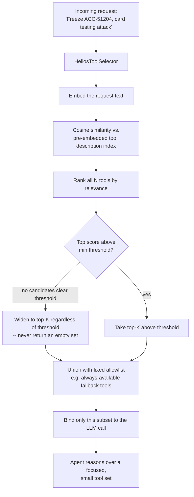

# Pattern 11 — Tool Selection

> **Series:** Tool-Use Patterns (18 total) — Helios Fraud Platform Edition
> **Stack:** Python 3.12, LangChain 1.3.x, LangGraph 1.2.x, Pydantic v2, pgvector
> **Status:** ✅ Complete

---

## 1. What is Tool Selection?

Tool Selection is the practice of **narrowing down which tools are even shown to the model** for a given request, *before* the model has to reason over them — rather than binding every tool the organization owns to every LLM call.

This becomes essential once an agent's tool library grows past a certain size. Helios, across Patterns 01–10, has already accumulated: `freeze_account`, `flag_transaction`, `request_step_up_auth`, `get_account_details`, `get_transaction_history`, `get_device_risk`, `check_watchlist`, `check_sanctions_screening`, `get_case_summary`, `get_recent_transactions_for_case`, `search_similar_cases`, `compute_composite_risk_score`, `convert_currency`, `compute_transaction_velocity`, `run_python_analysis`, `fetch_and_summarize_page`, `retrieve_context` — **17 tools already**, and a real production system easily has 50–200+ across all its agents and MCP servers (Pattern 10).

| Binding all tools always | Tool Selection (dynamic subsetting) |
|---|---|
| Every LLM call includes full schemas for all N tools, however many | Only the ~5–10 most relevant tools for *this specific request* are bound |
| Model must "read" and reason over irrelevant tool descriptions every turn — wastes tokens, and past a certain count, actively **degrades tool-choice accuracy** | Smaller, focused candidate set improves both cost and correctness |
| Two similarly-named tools (e.g., `freeze_account` vs. a hypothetical `freeze_card`) can get confused when both are always present | Irrelevant near-duplicates are filtered out before the model ever sees them |
| Doesn't scale past a few dozen tools | Scales to hundreds of tools by treating "which tools are candidates" as its own retrieval problem |

**Important distinction from Pattern 12 (Tool Routing):** Tool Selection narrows the *candidate set of tools offered to a single agent* before it reasons. Tool Routing (next pattern) is about directing a *request* to the right *agent or sub-system* entirely. They're often used together — route to the right agent, then select the right tool subset for that agent — but they solve different problems, and conflating them is a common design mistake.

---

## 2. What Problem Does It Solve?

| Problem | How Tool Selection fixes it |
|---|---|
| Binding 50+ tools to every call bloats the prompt and slows/costs more per turn | Only a relevant subset (e.g., top 8) is bound per request |
| Empirically, model tool-choice accuracy degrades as the number of simultaneously-offered tools grows large | Keeping the candidate set small and relevant keeps accuracy high |
| A generic "investigate this case" request doesn't need currency-conversion or code-execution tools at all | Semantic relevance filtering excludes tools unrelated to the request's apparent intent |
| Static, hand-coded "if request contains X, include tool Y" rules don't scale or generalize | Embedding-based tool retrieval (treating tool descriptions like a searchable corpus, exactly as in Pattern 05) scales to hundreds of tools without hand-written rules |
| Some tools should always be available regardless of relevance scoring (e.g., a "clarify with the user" fallback) | Selection logic supports a small "always include" allowlist alongside the dynamically retrieved set |

---

## 3. Realistic Production Problem — Helios Unified Agent Tool Selector

**Context:** Helios is consolidating its fraud-related agents into one **Unified Fraud Agent** that has access to the full 17+ tool library built across Patterns 01–10 (via a mix of local tools and MCP servers). Binding all 17+ every turn is wasteful and, per Helios's own internal evaluation, was found to reduce correct-tool-selection accuracy on ambiguous requests. Helios needs the agent to **dynamically select the right ~6–8 tool candidates** per incoming request before the main reasoning loop even starts.

**The ask:** Build a `HeliosToolSelector` that:

1. Maintains an **embedding index of tool descriptions** (each tool's name + docstring, embedded once at startup — this is structurally identical to Pattern 05's search-tool mechanics, just applied to *tool metadata* instead of policy documents).
2. Given an incoming request, embeds the request and retrieves the **top-K most semantically relevant tools**.
3. Always includes a small **fixed allowlist** of tools that should never be excluded (e.g., a "ask analyst for clarification" fallback tool) regardless of semantic score.
4. Falls back sensibly — if very few tools score above a relevance threshold, widens the pool rather than starving the agent of options.
5. Logs which tools were offered for each request, for later analysis of whether the selector is excluding tools it shouldn't.

---

## 4. Architecture / Flow Diagram



---

## 5. Complete Request → Response Flow

1. **Request arrives** at the Unified Fraud Agent: *"Freeze ACC-51204, this looks like a card-testing attack, high confidence."*
2. **Tool selector embeds the request** using the same embedding model used to index tool descriptions (Voyage, consistent with Patterns 05/09 — using a different embedding model between indexing and query time silently breaks relevance quality, a subtle but common bug worth flagging explicitly).
3. **Cosine similarity computed** against the pre-embedded index of all 17+ tool descriptions (each tool's description was embedded once, at server startup, not per request — this indexing step is cheap and cached, unlike the per-request query embedding).
4. **Ranking** — tools like `freeze_account`, `get_account_details`, `get_device_risk`, and `compute_composite_risk_score` naturally score highest for this request's semantic content; tools like `convert_currency` and `run_python_analysis` score low.
5. **Threshold + top-K selection** — take tools scoring above a minimum relevance bar, capped at `K=8`; if fewer than 3 tools clear the threshold (a genuinely ambiguous or novel request), widen to the top 8 regardless of threshold rather than starving the agent.
6. **Allowlist union** — a small fixed set of tools (e.g., a `request_analyst_clarification` fallback) is always unioned into the final candidate set, since these should be available even when semantically "unrelated" to the literal request text.
7. **Bind only the selected subset** to the LLM call — the agent's system prompt and reasoning loop (Pattern 02) proceed exactly as before, just with a smaller, more focused tool list.
8. **Logging** — every request logs which tools were offered (and their scores), which lets Helios's ML team periodically audit whether the selector is systematically excluding a tool that should have been included for some request pattern — a real production concern that needs ongoing monitoring, not a one-time setup.

---

## 6. Why Tool Selection Is the Right Pattern Here

- **Directly addresses a measured accuracy problem** — Helios's own evaluation showed tool-choice accuracy degrading as the bound tool count grew; this isn't a theoretical concern but the actual motivating trigger for building this pattern.
- **Reuses proven retrieval mechanics** — this is structurally the same embedding-similarity approach as Pattern 05's search tool, just pointed at tool descriptions instead of documents; no new retrieval technology needed, just applying an existing pattern to a new kind of "document."
- **Threshold-with-fallback avoids the two failure modes of naive top-K** — a fixed top-K alone can force in irrelevant tools when few are actually relevant; a fixed threshold alone can return zero tools on a slightly-unusual phrasing. Combining both handles the full range of real request patterns.
- **Allowlisting protects against over-optimization** — pure semantic relevance could exclude a genuinely necessary fallback/escape-hatch tool just because its description doesn't textually resemble the request; a fixed allowlist is a deliberate, simple guardrail against that failure mode.

---

## 7. Production-Quality Implementation (Python)

### 7.1 Requirements

```bash
pip install "langchain==1.3.15" "langgraph==1.2.10" "langchain-anthropic==0.5.*" \
            "pydantic==2.*" "voyageai==0.4.*" "numpy==2.*" "fastapi==0.115.*" "uvicorn==0.34.*"
```

### 7.2 Full Code

```python
"""
Helios Tool Selector — Tool Selection Pattern
==================================================
Dynamically narrows a large tool library down to the most relevant
candidates for a given request, before binding to the LLM call. Uses
embedding-based relevance ranking (same mechanics as Pattern 05's search
tool, applied to tool descriptions) with threshold-with-fallback selection
and a fixed always-include allowlist.

Run:
    export ANTHROPIC_API_KEY=sk-...
    export VOYAGE_API_KEY=...
    uvicorn tool_selector:app --reload
"""

from __future__ import annotations

import logging
from dataclasses import dataclass

import numpy as np
import voyageai
from fastapi import FastAPI
from langchain_core.tools import BaseTool, tool
from pydantic import BaseModel

logger = logging.getLogger("helios.tool_selector")
logging.basicConfig(level=logging.INFO)


def audit_log(event: str, **fields) -> None:
    logger.info("AUDIT | event=%s | %s", event, fields)


# --------------------------------------------------------------------------
# 1. Selection configuration
# --------------------------------------------------------------------------

TOP_K = 8
MIN_RELEVANCE_SCORE = 0.30
MIN_CANDIDATES_BEFORE_WIDENING = 3

# Tools that should ALWAYS be offered, regardless of semantic relevance to
# the literal request text (escape hatches / fallbacks).
ALWAYS_INCLUDE_TOOL_NAMES = {"request_analyst_clarification"}


# --------------------------------------------------------------------------
# 2. Example tool library (representing the 17+ tools accumulated across
#    Patterns 01-10; shown here in abbreviated form for illustration)
# --------------------------------------------------------------------------

@tool
def freeze_account(account_id: str, reason: str, confidence: str) -> dict:
    """Freeze a customer account to stop further transactions immediately,
    for suspected fraud such as card-testing or account takeover."""
    return {"status": "FROZEN", "account_id": account_id}


@tool
def get_account_details(account_id: str) -> dict:
    """Fetch core account profile: customer tier, prior fraud flags,
    account age."""
    return {"account_id": account_id}


@tool
def get_device_risk(transaction_id: str) -> dict:
    """Fetch device/session fingerprint risk for a specific transaction."""
    return {"transaction_id": transaction_id}


@tool
def compute_composite_risk_score(
    device_risk: int, amount_anomaly_score: int, account_tenure_days: int,
    watchlist_hit: bool, is_first_of_type: bool,
) -> dict:
    """Compute Helios's official composite fraud risk score (0-100) from
    individual risk signals, using the fixed, versioned scoring formula."""
    return {"composite_score": 0}


@tool
def convert_currency(amount: float, from_currency: str, to_currency: str) -> dict:
    """Convert a monetary amount between currencies using current exchange
    rates."""
    return {"converted_amount": 0.0}


@tool
def run_python_analysis(code: str, data: dict) -> dict:
    """Run custom Python code for ad hoc data analysis over already-fetched
    data, in an isolated sandbox."""
    return {"result_value": None}


@tool
def search_fraud_knowledge_base(query: str) -> dict:
    """Search Helios's internal fraud policy documents and playbooks using
    hybrid semantic + keyword search."""
    return {"results": []}


@tool
def request_analyst_clarification(question: str) -> dict:
    """Ask the requesting analyst a clarifying question when the
    instruction is ambiguous or missing required information. Always
    available regardless of the topic of the request."""
    return {"clarification_requested": question}


FULL_TOOL_LIBRARY: list[BaseTool] = [
    freeze_account, get_account_details, get_device_risk,
    compute_composite_risk_score, convert_currency, run_python_analysis,
    search_fraud_knowledge_base, request_analyst_clarification,
]


# --------------------------------------------------------------------------
# 3. The selector itself
# --------------------------------------------------------------------------

@dataclass
class ScoredTool:
    tool: BaseTool
    score: float


class HeliosToolSelector:
    """Embeds every tool's name+description once at construction time, then
    ranks the full library against each incoming request's embedded text."""

    def __init__(self, tools: list[BaseTool], voyage_client: voyageai.Client):
        self._tools = tools
        self._voyage = voyage_client
        self._tool_embeddings = self._embed_tool_library(tools)

    def _embed_tool_library(self, tools: list[BaseTool]) -> np.ndarray:
        descriptions = [f"{t.name}: {t.description}" for t in tools]
        response = self._voyage.embed(
            descriptions, model="voyage-3-large", input_type="document"
        )
        audit_log("tool_library_indexed", tool_count=len(tools))
        return np.array(response.embeddings)

    def select(self, request_text: str) -> list[BaseTool]:
        query_embedding = np.array(
            self._voyage.embed([request_text], model="voyage-3-large", input_type="query")
            .embeddings[0]
        )

        # Cosine similarity between the request and every indexed tool
        similarities = self._cosine_similarity(query_embedding, self._tool_embeddings)

        scored = sorted(
            (ScoredTool(tool=t, score=float(s)) for t, s in zip(self._tools, similarities)),
            key=lambda st: st.score, reverse=True,
        )

        above_threshold = [st for st in scored if st.score >= MIN_RELEVANCE_SCORE]

        if len(above_threshold) < MIN_CANDIDATES_BEFORE_WIDENING:
            # Ambiguous/novel request: widen to top-K regardless of threshold
            # rather than risking an under-equipped agent.
            selected = scored[:TOP_K]
            audit_log("tool_selection_widened", request_preview=request_text[:80],
                      reason="too_few_above_threshold", candidates_found=len(above_threshold))
        else:
            selected = above_threshold[:TOP_K]

        selected_tools = {st.tool.name: st.tool for st in selected}

        # Union in the fixed allowlist regardless of semantic score
        for t in self._tools:
            if t.name in ALWAYS_INCLUDE_TOOL_NAMES:
                selected_tools[t.name] = t

        final_tools = list(selected_tools.values())

        audit_log("tool_selection", request_preview=request_text[:80],
                  selected_tools=[t.name for t in final_tools],
                  scores={st.tool.name: round(st.score, 3) for st in scored[:TOP_K]})

        return final_tools

    @staticmethod
    def _cosine_similarity(query_vec: np.ndarray, matrix: np.ndarray) -> np.ndarray:
        query_norm = query_vec / np.linalg.norm(query_vec)
        matrix_norms = matrix / np.linalg.norm(matrix, axis=1, keepdims=True)
        return matrix_norms @ query_norm


# --------------------------------------------------------------------------
# 4. Wiring: build the selector, use it before every agent invocation
# --------------------------------------------------------------------------

import os  # noqa: E402

_voyage_client = voyageai.Client(api_key=os.environ.get("VOYAGE_API_KEY", "test-key"))
_selector = HeliosToolSelector(FULL_TOOL_LIBRARY, _voyage_client)


def select_tools_for_request(request_text: str) -> list[BaseTool]:
    """Call this BEFORE building/invoking the agent for a given request --
    the returned subset is what gets bound via create_agent(tools=...),
    not the full FULL_TOOL_LIBRARY."""
    return _selector.select(request_text)


# --------------------------------------------------------------------------
# 5. FastAPI surface — inspect what would be selected, for debugging/audit
# --------------------------------------------------------------------------

app = FastAPI(title="Helios Tool Selector — Tool Selection Pattern")


class SelectionRequest(BaseModel):
    request_text: str


class SelectionResponse(BaseModel):
    request_text: str
    selected_tool_names: list[str]


@app.post("/tools/select", response_model=SelectionResponse)
def select_tools_endpoint(req: SelectionRequest) -> SelectionResponse:
    selected = select_tools_for_request(req.request_text)
    return SelectionResponse(
        request_text=req.request_text,
        selected_tool_names=[t.name for t in selected],
    )
```

### 7.3 Example: Focused Selection for a Freeze Request

```text
POST /tools/select
{"request_text": "Freeze ACC-51204, this looks like a card-testing attack, high confidence"}
```

```json
{
  "request_text": "Freeze ACC-51204, this looks like a card-testing attack, high confidence",
  "selected_tool_names": [
    "freeze_account",
    "get_account_details",
    "get_device_risk",
    "compute_composite_risk_score",
    "search_fraud_knowledge_base",
    "request_analyst_clarification"
  ]
}
```

Notice `convert_currency` and `run_python_analysis` were excluded — irrelevant to this request — while `request_analyst_clarification` is present via the allowlist even though it wasn't a top semantic match.

### 7.4 Example: Ambiguous Request Triggers Widening

```text
POST /tools/select
{"request_text": "check on this"}
```

Because "check on this" is extremely vague, few tools clear `MIN_RELEVANCE_SCORE`, triggering the widening fallback — the selector returns its top-K best guesses rather than an under-populated, possibly-empty tool set that would leave the agent unable to act at all.

### 7.5 Testing Threshold Widening and Allowlist Guarantee

```python
# tests/test_tool_selector.py
from tool_selector import HeliosToolSelector, ALWAYS_INCLUDE_TOOL_NAMES, FULL_TOOL_LIBRARY


def test_allowlisted_tool_always_present(selector):
    for query in ["freeze this account", "convert 500 EUR to USD", "asdkjhasd"]:
        selected = selector.select(query)
        selected_names = {t.name for t in selected}
        assert ALWAYS_INCLUDE_TOOL_NAMES.issubset(selected_names)


def test_selection_never_returns_empty_set(selector):
    selected = selector.select("completely nonsensical unrelated gibberish query xzy123")
    assert len(selected) > 0  # widening fallback guarantees this


def test_relevant_request_excludes_clearly_unrelated_tools(selector):
    selected = selector.select("freeze account for card testing fraud, high confidence")
    selected_names = {t.name for t in selected}
    assert "convert_currency" not in selected_names
    assert "freeze_account" in selected_names
```

---

## Key Takeaways

- Tool Selection narrows the **candidate tool set offered per request**, distinct from Tool Routing (Pattern 12), which directs a request to the right *agent* — they compose but solve different problems.
- **Embedding-based relevance ranking over tool descriptions reuses Pattern 05's search mechanics** — there's no need for a fundamentally different technology, just pointing retrieval at a new kind of indexed content.
- **Threshold-with-fallback (widen if too few candidates clear the bar) avoids both failure modes** of naive fixed top-K or naive fixed-threshold-only selection.
- **A small, fixed allowlist protects essential fallback tools** from being excluded purely on semantic-similarity grounds.
- **This pattern exists to solve a measured problem, not a hypothetical one** — introduce it once your tool library has actually grown large enough that unfiltered binding is degrading accuracy or cost, not preemptively for a five-tool agent.

---

**Next up → Pattern 12: Tool Routing** (directing an incoming request to the right specialized agent/sub-system in a multi-agent Helios architecture, before any tool selection or execution happens).
