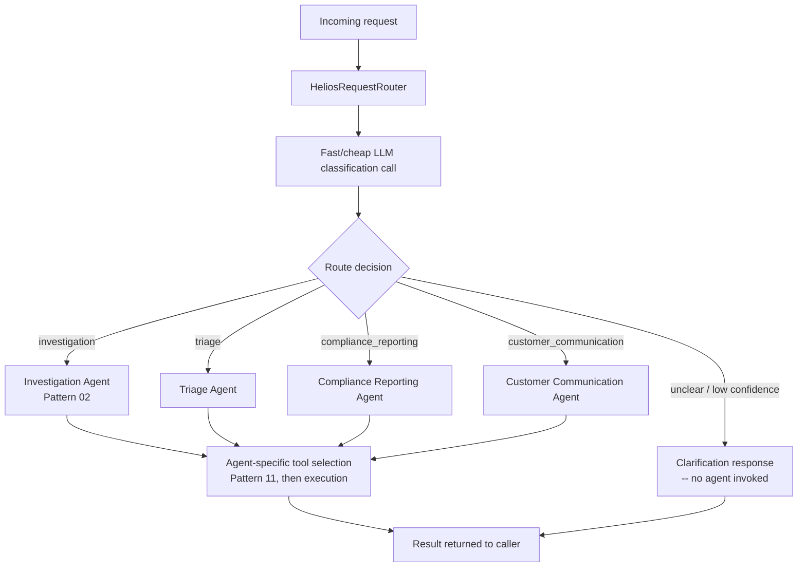

# Pattern 12 — Tool Routing

> **Series:** Tool-Use Patterns (18 total) — Helios Fraud Platform Edition
> **Stack:** Python 3.12, LangChain 1.3.x, LangGraph 1.2.x, Pydantic v2
> **Status:** ✅ Complete

---

## 1. What is Tool Routing?

Tool Routing is the pattern of directing an **incoming request to the right specialized agent or sub-system** — *before* any tool selection (Pattern 11) or tool execution happens. Where Tool Selection narrows *which tools one agent sees*, Tool Routing decides *which agent handles the request at all*.

This distinction matters once an organization has multiple specialized agents rather than one monolithic agent trying to do everything:

| Tool Selection (Pattern 11) | Tool Routing (Pattern 12) |
|---|---|
| Operates *within* a single agent's tool-binding step | Operates *before* any agent is even chosen |
| Narrows N tools down to a relevant K for one agent | Chooses which of M specialized agents (each with its own tool set, system prompt, and behavior) should handle the request |
| Answers: "which tools does this agent need for this request?" | Answers: "which agent should even see this request?" |
| A single agent can still handle wildly different request types, just with a smaller tool list each time | Different request types are handled by entirely different agents, each purpose-built and independently tunable |

**Why split into multiple agents at all, instead of one agent with great tool selection?** Beyond a certain point, cramming every capability (fraud investigation, case triage, compliance reporting, customer communication drafting) into one agent's system prompt makes that prompt unwieldy, makes behavior harder to tune per use case, and makes evaluation harder (you can't cleanly test "the triage agent's accuracy" if it's entangled with investigation logic in one giant prompt). Routing lets each specialized agent stay focused, testable, and independently improvable.

---

## 2. What Problem Does It Solve?

| Problem | How Tool Routing fixes it |
|---|---|
| Helios has grown from one Fraud Investigation Agent into several purpose-built agents (Investigation, Triage, Compliance Reporting, Customer Communication) | A router decides up front which agent actually handles a given incoming request |
| A single monolithic system prompt trying to cover every use case becomes unwieldy and hard to tune | Each specialized agent keeps a focused, well-tuned system prompt for its specific job |
| Different request types genuinely need different tool sets, different guardrails, and sometimes different underlying models (a fast/cheap model for simple triage, a stronger model for deep investigation) | Routing lets each destination agent be independently configured — model choice, tools, guardrails — for its specific job |
| Misrouting a request to the wrong agent produces poor or unsafe results | A well-designed router with a fallback/clarification path catches ambiguous cases instead of guessing wrong |
| Hard to reason about system behavior when everything is one giant prompt | Routing creates clear architectural boundaries — you can test, monitor, and improve each destination agent independently |

---

## 3. Realistic Production Problem — Helios Front-Door Router

**Context:** Helios now operates four specialized agents:
1. **Investigation Agent** (Pattern 02) — deep multi-step fraud case investigation.
2. **Triage Agent** — quickly assigns a priority level to new incoming alerts.
3. **Compliance Reporting Agent** — drafts SAR (Suspicious Activity Report) filings from investigated cases.
4. **Customer Communication Agent** — drafts customer-facing notifications (e.g., "your account was frozen, here's why and what to do").

Analysts and internal systems submit requests to a single front door, and Helios needs a **router** that classifies each incoming request and dispatches it to the correct specialized agent — with a **clarification fallback** for genuinely ambiguous requests, rather than guessing.

**The ask:** Build a `HeliosRequestRouter` that:
1. Classifies an incoming request into one of the four agent categories using a **fast, cheap LLM call** (routing itself shouldn't require the most expensive model — this is a classification task, not deep reasoning).
2. Returns a **structured routing decision** with a confidence-like rationale, not just a bare label — so misrouting can be debugged.
3. Falls back to a **clarification response** when the request doesn't clearly match any category, rather than forcing a low-confidence guess into one of the four agents.
4. Dispatches to the chosen agent and returns its result, logging the full routing decision for later analysis.

---

## 4. Architecture / Flow Diagram



**Key structural point:** the router itself is deliberately "dumb and fast" — it does **one classification call**, not a multi-step investigation. All the deep reasoning happens *after* routing, inside whichever specialized agent was selected. Conflating routing with the destination agent's own reasoning would slow down every request with unnecessary complexity at the routing step.

---

## 5. Complete Request → Response Flow

1. **Request arrives** at the front door: *"Draft a notification to the customer explaining why their account ACC-51204 was frozen."*
2. **Router performs one classification call** using a smaller/faster model (e.g., a lighter Claude model tier) with a system prompt that lists the four categories and their defining characteristics — this call is intentionally lightweight since routing is classification, not deep reasoning.
3. **Structured routing decision returned** — the model outputs a structured object: `{category: "customer_communication", rationale: "Request explicitly asks to draft a customer-facing notification, not to investigate or report."}`.
4. **Confidence check** — if the model's classification is clear and matches one of the four known categories, proceed to dispatch. If the model indicates genuine ambiguity (it's instructed to output `category: "unclear"` when uncertain, rather than forcing a guess), the router returns a clarification message instead of guessing.
5. **Dispatch** — the request is forwarded to the Customer Communication Agent, which has its own focused system prompt, its own tool selection (Pattern 11, scoped to just the 3–4 tools relevant to drafting customer communications), and its own reasoning loop.
6. **Destination agent executes** and returns its result through the normal agent flow (Pattern 02-style loop if the destination agent needs tools, or a simpler single-turn response if not).
7. **Result returns** to the original caller, and the full routing decision (category, rationale, and which agent ultimately handled it) is logged — critical for later auditing "was this request routed correctly," especially for building a labeled dataset to evaluate and improve the router over time.
8. **Ambiguous case handling** — if the router had instead classified the request as `unclear` (e.g., a genuinely mixed request like "investigate this and also draft a customer notice"), it returns a clarification asking the analyst to split the request or confirm which comes first, rather than silently picking one agent and dropping the other half of the intent.

---

## 6. Why Tool Routing Is the Right Pattern Here

- **Keeps each destination agent focused and independently tunable** — the Investigation Agent's system prompt doesn't need to think about SAR-filing tone, and the Compliance Reporting Agent doesn't need fraud-investigation tool access; routing enforces this separation architecturally rather than relying on prompt discipline within one giant agent.
- **Cheap classification, expensive reasoning only where needed** — using a fast/cheap model for the routing decision itself, reserving the more capable (and expensive) model calls for the actual destination agent's deep reasoning, is a meaningful cost optimization at scale.
- **Explicit "unclear" fallback prevents silent misrouting** — a router forced to always pick one of N categories will eventually force-fit an ambiguous request into the wrong bucket; allowing (and acting on) an explicit "I'm not confident" output is what makes routing safe to rely on.
- **Creates testable, auditable architectural boundaries** — because routing decisions are logged as structured data, Helios can build a proper evaluation set over time ("of the last 10,000 requests, how many were routed correctly?") in a way that's much harder to measure inside one undifferentiated agent.

---

## 7. Production-Quality Implementation (Python)

### 7.1 Requirements

```bash
pip install "langchain==1.3.15" "langgraph==1.2.10" "langchain-anthropic==0.5.*" \
            "pydantic==2.*" "fastapi==0.115.*" "uvicorn==0.34.*"
```

### 7.2 Full Code

```python
"""
Helios Request Router — Tool Routing Pattern
=================================================
Classifies incoming requests and dispatches to one of four specialized
agents, with an explicit "unclear" fallback rather than forcing a
low-confidence guess. Uses a fast/cheap model for the routing decision
itself, reserving deeper reasoning for the destination agent.

Run:
    export ANTHROPIC_API_KEY=sk-...
    uvicorn request_router:app --reload
"""

from __future__ import annotations

import logging
import uuid
from datetime import datetime, timezone
from enum import Enum
from typing import Optional

from fastapi import FastAPI
from langchain_anthropic import ChatAnthropic
from langchain_core.messages import HumanMessage, SystemMessage
from pydantic import BaseModel, Field

logger = logging.getLogger("helios.request_router")
logging.basicConfig(level=logging.INFO)


def audit_log(event: str, **fields) -> None:
    logger.info("AUDIT | event=%s | %s", event, fields)


# --------------------------------------------------------------------------
# 1. Route categories and structured decision schema
# --------------------------------------------------------------------------

class RouteCategory(str, Enum):
    investigation = "investigation"
    triage = "triage"
    compliance_reporting = "compliance_reporting"
    customer_communication = "customer_communication"
    unclear = "unclear"


class RoutingDecision(BaseModel):
    category: RouteCategory
    rationale: str = Field(..., description="Brief reason for this classification")
    clarifying_question: Optional[str] = Field(
        None, description="Only set when category is 'unclear'"
    )


# --------------------------------------------------------------------------
# 2. Router — uses a fast/cheap model for classification only
# --------------------------------------------------------------------------

ROUTER_SYSTEM_PROMPT = """You are Helios's front-door request router. Classify
each incoming request into EXACTLY ONE of these categories:

- investigation: Deep multi-step fraud case investigation ("investigate this
  account", "should we freeze this", "look into this alert").
- triage: Quickly assessing/prioritizing a NEW incoming alert, no deep
  investigation requested ("prioritize this alert", "how urgent is this").
- compliance_reporting: Drafting formal regulatory filings from an already
  investigated case (SAR filings, regulatory reports).
- customer_communication: Drafting customer-facing messages or notifications
  ("write a notice to the customer", "draft an email explaining...").
- unclear: The request doesn't clearly fit ONE category (e.g. it mixes
  multiple intents, or lacks enough information to classify confidently).
  When you choose 'unclear', you MUST also provide a clarifying_question
  that would resolve the ambiguity.

Always call the classify_request function with your decision. Do not guess
if you are not reasonably confident -- use 'unclear' instead."""

# A lighter/faster model tier is appropriate here since this is a
# single-shot classification task, not multi-step reasoning.
_router_llm = ChatAnthropic(model="claude-haiku-4-6", temperature=0)
_router_llm_structured = _router_llm.bind_tools([RoutingDecision], tool_choice="RoutingDecision")


class HeliosRequestRouter:
    def classify(self, request_text: str) -> RoutingDecision:
        ai_message = _router_llm_structured.invoke([
            SystemMessage(content=ROUTER_SYSTEM_PROMPT),
            HumanMessage(content=request_text),
        ])

        if not ai_message.tool_calls:
            # Defensive fallback: if the model somehow didn't call the
            # structured tool, treat as unclear rather than crashing.
            return RoutingDecision(
                category=RouteCategory.unclear,
                rationale="Router model did not return a structured classification.",
                clarifying_question="Could you clarify what you'd like help with?",
            )

        decision = RoutingDecision.model_validate(ai_message.tool_calls[0]["args"])

        if decision.category == RouteCategory.unclear and not decision.clarifying_question:
            decision.clarifying_question = "Could you clarify what you'd like help with?"

        return decision


# --------------------------------------------------------------------------
# 3. Destination agent stubs (each would be a full agent as in Pattern 02,
#    with its own tools scoped via Pattern 11's selector; abbreviated here
#    to keep this pattern's example focused on the routing mechanics)
# --------------------------------------------------------------------------

class AgentResult(BaseModel):
    handled_by: str
    output: str


async def dispatch_to_investigation_agent(request_text: str) -> AgentResult:
    # In production: build via create_agent(...) as shown in Pattern 02,
    # with tools narrowed via Pattern 11's HeliosToolSelector.
    return AgentResult(handled_by="investigation_agent",
                        output=f"[Investigation Agent would process]: {request_text}")


async def dispatch_to_triage_agent(request_text: str) -> AgentResult:
    return AgentResult(handled_by="triage_agent",
                        output=f"[Triage Agent would process]: {request_text}")


async def dispatch_to_compliance_agent(request_text: str) -> AgentResult:
    return AgentResult(handled_by="compliance_reporting_agent",
                        output=f"[Compliance Reporting Agent would process]: {request_text}")


async def dispatch_to_customer_comm_agent(request_text: str) -> AgentResult:
    return AgentResult(handled_by="customer_communication_agent",
                        output=f"[Customer Communication Agent would process]: {request_text}")


DISPATCH_TABLE = {
    RouteCategory.investigation: dispatch_to_investigation_agent,
    RouteCategory.triage: dispatch_to_triage_agent,
    RouteCategory.compliance_reporting: dispatch_to_compliance_agent,
    RouteCategory.customer_communication: dispatch_to_customer_comm_agent,
}


# --------------------------------------------------------------------------
# 4. Orchestration: route, then dispatch (or return a clarification)
# --------------------------------------------------------------------------

class RouterResponse(BaseModel):
    request_id: str
    routing_decision: RoutingDecision
    result: Optional[AgentResult] = None
    clarification_needed: bool = False


_router = HeliosRequestRouter()


async def handle_incoming_request(request_text: str) -> RouterResponse:
    request_id = str(uuid.uuid4())
    audit_log("routing_started", request_id=request_id, request_preview=request_text[:80])

    decision = _router.classify(request_text)

    audit_log("routing_decided", request_id=request_id, category=decision.category.value,
              rationale=decision.rationale, timestamp=datetime.now(timezone.utc).isoformat())

    if decision.category == RouteCategory.unclear:
        return RouterResponse(
            request_id=request_id, routing_decision=decision, clarification_needed=True
        )

    dispatch_fn = DISPATCH_TABLE[decision.category]
    result = await dispatch_fn(request_text)

    audit_log("routing_dispatched", request_id=request_id,
              handled_by=result.handled_by)

    return RouterResponse(request_id=request_id, routing_decision=decision, result=result)


# --------------------------------------------------------------------------
# 5. FastAPI surface
# --------------------------------------------------------------------------

app = FastAPI(title="Helios Request Router — Tool Routing Pattern")


class RouteRequest(BaseModel):
    request_text: str = Field(..., min_length=3, max_length=2000)


@app.post("/router/handle", response_model=RouterResponse)
async def route_endpoint(req: RouteRequest) -> RouterResponse:
    return await handle_incoming_request(req.request_text)
```

### 7.3 Example: Clean Routing

```text
POST /router/handle
{"request_text": "Draft a notification to the customer explaining why ACC-51204 was frozen"}
```

```json
{
  "request_id": "a1b2...",
  "routing_decision": {
    "category": "customer_communication",
    "rationale": "Request explicitly asks to draft a customer-facing notification.",
    "clarifying_question": null
  },
  "result": {
    "handled_by": "customer_communication_agent",
    "output": "[Customer Communication Agent would process]: Draft a notification..."
  },
  "clarification_needed": false
}
```

### 7.4 Example: Ambiguous Request → Clarification, Not a Guess

```text
POST /router/handle
{"request_text": "Handle CASE-3321"}
```

```json
{
  "request_id": "c3d4...",
  "routing_decision": {
    "category": "unclear",
    "rationale": "The request doesn't specify whether to investigate, triage, report, or communicate about the case.",
    "clarifying_question": "Would you like me to investigate this case, prioritize it, draft a compliance report, or draft customer communication about it?"
  },
  "result": null,
  "clarification_needed": true
}
```

### 7.5 Testing Routing Accuracy and the Unclear Fallback

```python
# tests/test_request_router.py
import pytest
from request_router import HeliosRequestRouter, RouteCategory


@pytest.mark.asyncio
async def test_clear_investigation_request_routes_correctly(router):
    decision = router.classify("Investigate ACC-51204 for the alert that just fired")
    assert decision.category == RouteCategory.investigation


@pytest.mark.asyncio
async def test_clear_customer_comm_request_routes_correctly(router):
    decision = router.classify("Write an email telling the customer their card was declined")
    assert decision.category == RouteCategory.customer_communication


@pytest.mark.asyncio
async def test_ambiguous_request_returns_unclear_with_question(router):
    decision = router.classify("Handle CASE-3321")
    assert decision.category == RouteCategory.unclear
    assert decision.clarifying_question is not None


@pytest.mark.asyncio
async def test_unclear_request_never_dispatched_to_an_agent(router):
    from request_router import handle_incoming_request
    response = await handle_incoming_request("Handle CASE-3321")
    assert response.clarification_needed is True
    assert response.result is None  # no agent was invoked
```

---

## Key Takeaways

- Tool Routing decides **which agent** handles a request; Tool Selection (Pattern 11) decides **which tools** that chosen agent sees — they operate at different layers and typically compose (route first, select within the destination agent second).
- **Use a fast/cheap model for the routing classification itself** — routing is a single-shot classification task, not deep reasoning, so reserving expensive model calls for the destination agent's actual work is a meaningful cost optimization.
- **An explicit "unclear" category with a clarifying question is what makes routing trustworthy** — a router forced to always guess one of N categories will eventually misroute ambiguous requests silently.
- **Log every routing decision** — building a labeled dataset of (request, chosen category, was-it-correct) is how you actually improve routing accuracy over time, not guesswork.
- Splitting into multiple specialized agents (each independently tunable, testable, and scoped) is the payoff that makes the routing layer worth building in the first place.

---

**Next up → Pattern 13: Tool Validation** (validating tool call arguments and results with rigor beyond basic type-checking — semantic/business-rule validation, cross-field consistency, and safe handling of malformed model output).
