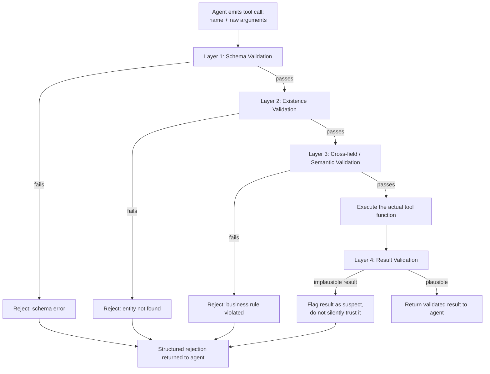

# Pattern 13 — Tool Validation

> **Series:** Tool-Use Patterns (18 total) — Helios Fraud Platform Edition
> **Stack:** Python 3.12, LangChain 1.3.x, LangGraph 1.2.x, Pydantic v2
> **Status:** ✅ Complete

---

## 1. What is Tool Validation?

Tool Validation is the discipline of rigorously checking **both the arguments going into a tool call and the results coming out of it**, beyond what basic JSON-Schema/Pydantic type-checking already gives you for free. It's the pattern that formalizes something this series has been doing informally since Pattern 01 — re-validating model output before trusting it — and extends it to cover the classes of problems basic type validation *cannot* catch.

Basic type validation (which every pattern so far already uses via Pydantic) catches: wrong type, missing required field, out-of-range number, malformed string pattern. It does **not** catch:

| What basic type validation misses | What Tool Validation adds |
|---|---|
| `account_id` is a valid `ACC-#####` string, but that account doesn't actually exist | **Existence validation** — check against the actual system of record |
| `start_date` and `end_date` are both valid dates, but `end_date` is before `start_date` | **Cross-field consistency validation** |
| `confidence="high"` is a valid enum value, but the reasoning text the model provided elsewhere in the same turn contradicts "high confidence" | **Semantic/business-rule validation** — does this argument combination make sense given context? |
| A tool's result is well-typed JSON, but the numbers inside are implausible (a "risk score" of 100000) | **Result validation** — the tool's own return value can be wrong too, not just the model's input |
| The model calls a tool with technically-valid arguments that would nonetheless violate a business policy (e.g., freezing an account below a minimum evidence bar) | **Policy validation** — a business rule check that's independent of both type-correctness and the tool's internal logic |

This pattern is best understood as a **layered validation pipeline** applied around every tool call — not a single check, but several distinct, composable layers, each catching a different class of problem.

---

## 2. What Problem Does It Solve?

| Problem | How Tool Validation fixes it |
|---|---|
| Type-valid arguments can still be nonsensical or wrong (e.g. a syntactically valid but non-existent account ID) | Existence/reference validation confirms the referenced entity actually exists before the tool acts on it |
| Multiple individually-valid fields can be jointly inconsistent | Cross-field validators check relationships between fields, not just each field in isolation |
| A tool's own output can be wrong due to bugs, stale data, or unexpected edge cases — trusting tool results blindly is as risky as trusting model output blindly | Result validation applies sanity checks to what tools return, not just what they're called with |
| Model output that looks superficially fine can still violate business policy | A dedicated policy-validation layer, independent of type validation, enforces business rules explicitly |
| Ad hoc validation scattered across every individual tool function is inconsistent and easy to forget | A reusable, layered validation pipeline applied uniformly across all tool calls catches an entire class of bugs in one place |

---

## 3. Realistic Production Problem — Helios Layered Tool Validation Pipeline

**Context:** Across Patterns 01–12, Helios's tools have each done their own ad hoc validation (Pattern 01's `FreezeAccountArgs` regex check, Pattern 04's row-level authorization, Pattern 06's range clamping). This has worked, but it's inconsistent — some tools check existence, some don't; some validate results, most don't. Helios wants to **formalize** this into a single, reusable, layered validation pipeline that wraps *any* tool call.

**The ask:** Build a `HeliosToolValidationPipeline` with four distinct, composable layers, applied in order to every tool invocation:

1. **Schema validation** (baseline, already covered by Pydantic in every prior pattern) — type, range, pattern correctness.
2. **Existence validation** — does the referenced entity (account, case, transaction) actually exist and is it in a state where this action is even applicable?
3. **Cross-field/semantic validation** — do the argument values make sense *together* (e.g., a `freeze_account` call with `confidence="low"` should never reach execution, matching Pattern 01's original guardrail, but now expressed as a reusable, declared rule rather than inline logic)?
4. **Result validation** — after the tool executes, is the *result itself* plausible (e.g., a returned risk score is within [0,100], a returned transaction list isn't suspiciously larger than the requested limit)?

Each layer can independently **reject** the call (before layer 2+ even for existence failures) with a structured, model-readable reason — so the agent can adjust its next action rather than receiving an opaque failure.

---

## 4. Architecture / Flow Diagram



**Why layers, and why in this order:** each layer is cheaper and more general than the next, so failing fast on a cheap check (schema) avoids wasting a database round-trip (existence) on a call that was never going to be valid anyway. Cross-field/semantic checks run after existence checks because some semantic rules genuinely need to know the entity's *current state* (e.g., "you can't request step-up-auth on an already-frozen account" needs to know the account is frozen, which existence validation just fetched).

---

## 5. Complete Request → Response Flow

1. **Agent emits a tool call** — e.g., `freeze_account(account_id="ACC-51204", reason="card testing", confidence="medium")`.
2. **Layer 1 — Schema validation**: Pydantic confirms `account_id` matches `ACC-#####`, `reason` is a non-empty string within length bounds, `confidence` is a valid enum value. This is the same mechanism used since Pattern 01 — nothing new here, just the first stage of the pipeline.
3. **Layer 2 — Existence validation**: query whether `ACC-51204` actually exists in Helios's account system and fetch its **current state** (e.g., `status="active"`) — this both confirms existence and supplies context the next layer needs.
4. **Layer 3 — Cross-field/semantic validation**: a declared rule set checks, e.g., `confidence != "low"` (matching Pattern 01's original inline guardrail, now expressed as a reusable rule), and a new rule enabled by Layer 2's fetched state: `account.status != "already_frozen"` (no point re-freezing an already-frozen account — flag this as likely a mistaken duplicate call).
5. **Execution** — only after all three input-side layers pass does the actual `freeze_account` business logic run (the real state-mutating action).
6. **Layer 4 — Result validation**: after execution, verify the tool's own returned result is plausible — e.g., the response's `status` field should now read `"FROZEN"`; if it doesn't (a possible sign of a race condition or downstream bug), flag the result as suspect rather than returning it to the agent as if everything succeeded normally.
7. **Return to agent** — either the validated result, or a structured rejection at whichever layer failed, with a reason specific enough for the agent to decide what to do next (e.g., "account ACC-51204 not found — did you mean a different account?" vs. "confidence must be medium or high to freeze an account — please gather more evidence first").
8. **Audit log** — every layer's outcome (pass/fail and why) is logged, distinct from just logging the final pass/fail, since knowing *which layer* rejected a call is valuable for diagnosing whether the model is frequently hitting a particular class of validation failure (a signal that a tool's docstring or the agent's system prompt may need improvement).

---

## 6. Why Tool Validation (as a Layered Pipeline) Is the Right Pattern Here

- **Formalizes and generalizes what earlier patterns did ad hoc** — Pattern 01's inline `if confidence == low: raise` guardrail and Pattern 04's inline authorization check are both instances of Layers 3 and 2 respectively; making this a declared, reusable pipeline means every *new* tool gets these protections consistently, instead of depending on each tool author remembering to add them.
- **Catches failure classes that type-checking alone cannot** — a syntactically perfect argument set can still reference a non-existent entity, be internally inconsistent, or (after execution) produce an implausible result; each of these needs its own dedicated check.
- **Fail-fast ordering saves cost** — rejecting on cheap schema checks before spending a database round-trip on existence checks, and rejecting on existence/semantic checks before ever executing a state-mutating action, minimizes wasted work and, more importantly, minimizes the chance of a partially-invalid action actually running.
- **Result validation closes a real gap** — most systems validate inputs rigorously but implicitly trust whatever a tool returns; Layer 4 explicitly acknowledges that tools themselves can misbehave (bugs, race conditions, stale caches) and shouldn't be blindly trusted either.

---

## 7. Production-Quality Implementation (Python)

### 7.1 Requirements

```bash
pip install "langchain==1.3.15" "langgraph==1.2.10" "langchain-anthropic==0.5.*" \
            "pydantic==2.*" "fastapi==0.115.*" "uvicorn==0.34.*"
```

### 7.2 Full Code

```python
"""
Helios Tool Validation Pipeline — Tool Validation Pattern
==============================================================
A reusable, layered validation pipeline (schema -> existence -> semantic/
cross-field -> result) applied uniformly around tool execution, generalizing
the ad hoc validation done inline in earlier patterns into declared,
composable rules.

Run:
    export ANTHROPIC_API_KEY=sk-...
    uvicorn tool_validation_pipeline:app --reload
"""

from __future__ import annotations

import logging
from dataclasses import dataclass, field
from enum import Enum
from typing import Any, Callable, Optional

from fastapi import FastAPI
from pydantic import BaseModel, ValidationError

logger = logging.getLogger("helios.tool_validation_pipeline")
logging.basicConfig(level=logging.INFO)


def audit_log(event: str, **fields) -> None:
    logger.info("AUDIT | event=%s | %s", event, fields)


# --------------------------------------------------------------------------
# 1. Validation outcome types
# --------------------------------------------------------------------------

class ValidationLayer(str, Enum):
    schema = "schema"
    existence = "existence"
    semantic = "semantic"
    result = "result"


class ValidationFailure(BaseModel):
    layer: ValidationLayer
    reason: str


class ToolCallOutcome(BaseModel):
    success: bool
    result: Optional[dict] = None
    failure: Optional[ValidationFailure] = None
    result_flagged_suspect: bool = False
    suspect_reason: Optional[str] = None


# --------------------------------------------------------------------------
# 2. Simulated system-of-record lookups (Layer 2 depends on these)
# --------------------------------------------------------------------------

_ACCOUNTS_DB = {
    "ACC-51204": {"status": "active", "customer_tier": "high-value"},
    "ACC-99999": {"status": "already_frozen", "customer_tier": "standard"},
}


def fetch_account_state(account_id: str) -> Optional[dict]:
    return _ACCOUNTS_DB.get(account_id)


# --------------------------------------------------------------------------
# 3. Declared rule types for Layer 3 (semantic / cross-field)
# --------------------------------------------------------------------------

@dataclass
class SemanticRule:
    name: str
    check: Callable[[dict, dict], bool]  # (args, fetched_entity_state) -> is_valid
    failure_message: Callable[[dict, dict], str]


FREEZE_ACCOUNT_RULES: list[SemanticRule] = [
    SemanticRule(
        name="min_confidence_for_freeze",
        check=lambda args, state: args.get("confidence") != "low",
        failure_message=lambda args, state: (
            "Refusing to freeze on 'low' confidence -- gather more evidence "
            "or escalate to a Level-2 analyst instead."
        ),
    ),
    SemanticRule(
        name="not_already_frozen",
        check=lambda args, state: state.get("status") != "already_frozen",
        failure_message=lambda args, state: (
            f"Account {args.get('account_id')} is already frozen -- this call "
            "looks like a duplicate action, not a new freeze."
        ),
    ),
]


# --------------------------------------------------------------------------
# 4. Declared rule types for Layer 4 (result plausibility)
# --------------------------------------------------------------------------

@dataclass
class ResultRule:
    name: str
    check: Callable[[dict], bool]
    failure_message: Callable[[dict], str]


FREEZE_ACCOUNT_RESULT_RULES: list[ResultRule] = [
    ResultRule(
        name="status_actually_frozen",
        check=lambda result: result.get("status") == "FROZEN",
        failure_message=lambda result: (
            f"Tool reported success but returned status='{result.get('status')}', "
            "not 'FROZEN' as expected -- possible race condition or downstream bug."
        ),
    ),
]


# --------------------------------------------------------------------------
# 5. The layered pipeline
# --------------------------------------------------------------------------

class FreezeAccountArgsSchema(BaseModel):
    account_id: str
    reason: str
    confidence: str


def _actual_freeze_account_tool(args: dict) -> dict:
    """Stand-in for the real Pattern 01-style executor -- performs the
    actual state mutation once all validation layers have passed."""
    return {"account_id": args["account_id"], "status": "FROZEN", "reason": args["reason"]}


class HeliosToolValidationPipeline:
    def run(
        self,
        raw_args: dict,
        schema_cls: type[BaseModel],
        entity_id_field: str,
        fetch_entity_fn: Callable[[str], Optional[dict]],
        semantic_rules: list[SemanticRule],
        result_rules: list[ResultRule],
        tool_fn: Callable[[dict], dict],
    ) -> ToolCallOutcome:
        # ---- Layer 1: Schema validation ----
        try:
            validated_args = schema_cls.model_validate(raw_args)
        except ValidationError as exc:
            audit_log("validation_failed", layer="schema", error=str(exc))
            return ToolCallOutcome(
                success=False,
                failure=ValidationFailure(layer=ValidationLayer.schema, reason=str(exc)),
            )
        args_dict = validated_args.model_dump()

        # ---- Layer 2: Existence validation ----
        entity_id = args_dict.get(entity_id_field)
        entity_state = fetch_entity_fn(entity_id) if entity_id else None
        if entity_state is None:
            audit_log("validation_failed", layer="existence", entity_id=entity_id)
            return ToolCallOutcome(
                success=False,
                failure=ValidationFailure(
                    layer=ValidationLayer.existence,
                    reason=f"No entity found for '{entity_id}'. Double-check the ID.",
                ),
            )

        # ---- Layer 3: Semantic / cross-field validation ----
        for rule in semantic_rules:
            if not rule.check(args_dict, entity_state):
                reason = rule.failure_message(args_dict, entity_state)
                audit_log("validation_failed", layer="semantic", rule=rule.name, reason=reason)
                return ToolCallOutcome(
                    success=False,
                    failure=ValidationFailure(layer=ValidationLayer.semantic, reason=reason),
                )

        # ---- Execute the real tool ----
        result = tool_fn(args_dict)

        # ---- Layer 4: Result validation ----
        suspect = False
        suspect_reason = None
        for rule in result_rules:
            if not rule.check(result):
                suspect = True
                suspect_reason = rule.failure_message(result)
                audit_log("result_validation_flagged", rule=rule.name, reason=suspect_reason)
                break  # first failing rule is reported; result still returned, flagged

        audit_log("tool_call_validated_and_executed", entity_id=entity_id,
                  layers_passed=["schema", "existence", "semantic"],
                  result_flagged_suspect=suspect)

        return ToolCallOutcome(
            success=True, result=result,
            result_flagged_suspect=suspect, suspect_reason=suspect_reason,
        )


# --------------------------------------------------------------------------
# 6. Wiring: a ready-to-use pipeline instance for freeze_account specifically
# --------------------------------------------------------------------------

_pipeline = HeliosToolValidationPipeline()


def validated_freeze_account(raw_args: dict) -> ToolCallOutcome:
    return _pipeline.run(
        raw_args=raw_args,
        schema_cls=FreezeAccountArgsSchema,
        entity_id_field="account_id",
        fetch_entity_fn=fetch_account_state,
        semantic_rules=FREEZE_ACCOUNT_RULES,
        result_rules=FREEZE_ACCOUNT_RESULT_RULES,
        tool_fn=_actual_freeze_account_tool,
    )


# --------------------------------------------------------------------------
# 7. FastAPI surface
# --------------------------------------------------------------------------

app = FastAPI(title="Helios Tool Validation Pipeline — Tool Validation Pattern")


class FreezeAccountRequest(BaseModel):
    account_id: str
    reason: str
    confidence: str


@app.post("/validated-tools/freeze-account", response_model=ToolCallOutcome)
def freeze_account_endpoint(req: FreezeAccountRequest) -> ToolCallOutcome:
    return validated_freeze_account(req.model_dump())
```

### 7.3 Example: Each Layer Rejecting in Turn

```text
# Layer 1 (schema) rejects -- confidence isn't even a recognized value type would need enum, illustrated via missing field:
POST /validated-tools/freeze-account {"account_id": "ACC-51204", "confidence": "high"}
→ {"success": false, "failure": {"layer": "schema", "reason": "...Field required: reason..."}}

# Layer 2 (existence) rejects:
POST /validated-tools/freeze-account {"account_id": "ACC-00000", "reason": "test", "confidence": "high"}
→ {"success": false, "failure": {"layer": "existence", "reason": "No entity found for 'ACC-00000'. Double-check the ID."}}

# Layer 3 (semantic) rejects -- low confidence:
POST /validated-tools/freeze-account {"account_id": "ACC-51204", "reason": "minor anomaly", "confidence": "low"}
→ {"success": false, "failure": {"layer": "semantic", "reason": "Refusing to freeze on 'low' confidence -- gather more evidence or escalate to a Level-2 analyst instead."}}

# Layer 3 (semantic) rejects -- already frozen:
POST /validated-tools/freeze-account {"account_id": "ACC-99999", "reason": "card testing", "confidence": "high"}
→ {"success": false, "failure": {"layer": "semantic", "reason": "Account ACC-99999 is already frozen -- this call looks like a duplicate action, not a new freeze."}}

# All layers pass:
POST /validated-tools/freeze-account {"account_id": "ACC-51204", "reason": "card testing", "confidence": "high"}
→ {"success": true, "result": {"account_id": "ACC-51204", "status": "FROZEN", "reason": "card testing"}, "result_flagged_suspect": false}
```

### 7.4 Testing Each Layer Independently

```python
# tests/test_tool_validation_pipeline.py
from tool_validation_pipeline import validated_freeze_account


def test_layer1_schema_rejects_missing_field():
    outcome = validated_freeze_account({"account_id": "ACC-51204", "confidence": "high"})
    assert outcome.success is False
    assert outcome.failure.layer == "schema"


def test_layer2_existence_rejects_unknown_account():
    outcome = validated_freeze_account(
        {"account_id": "ACC-00000", "reason": "test", "confidence": "high"}
    )
    assert outcome.success is False
    assert outcome.failure.layer == "existence"


def test_layer3_semantic_rejects_low_confidence():
    outcome = validated_freeze_account(
        {"account_id": "ACC-51204", "reason": "minor anomaly", "confidence": "low"}
    )
    assert outcome.success is False
    assert outcome.failure.layer == "semantic"
    assert "low" in outcome.failure.reason.lower()


def test_layer3_semantic_rejects_duplicate_freeze():
    outcome = validated_freeze_account(
        {"account_id": "ACC-99999", "reason": "card testing", "confidence": "high"}
    )
    assert outcome.success is False
    assert "already frozen" in outcome.failure.reason


def test_all_layers_pass_and_execute():
    outcome = validated_freeze_account(
        {"account_id": "ACC-51204", "reason": "card testing", "confidence": "high"}
    )
    assert outcome.success is True
    assert outcome.result["status"] == "FROZEN"
    assert outcome.result_flagged_suspect is False


def test_result_validation_flags_implausible_result(monkeypatch):
    import tool_validation_pipeline as tvp
    # Simulate a buggy tool that reports success but returns the wrong status
    monkeypatch.setattr(tvp, "_actual_freeze_account_tool", lambda args: {**args, "status": "PENDING"})
    outcome = tvp.validated_freeze_account(
        {"account_id": "ACC-51204", "reason": "card testing", "confidence": "high"}
    )
    assert outcome.success is True  # still returns the result...
    assert outcome.result_flagged_suspect is True  # ...but flags it as suspect
```

---

## Key Takeaways

- Tool Validation formalizes what earlier patterns did inline (Pattern 01's confidence guardrail, Pattern 04's authorization check) into a **reusable, declared, layered pipeline** applied consistently across every tool.
- **Four distinct layers catch four distinct failure classes**: schema (type/format), existence (does the entity really exist and what state is it in), semantic/cross-field (do the arguments make sense together, given that state), and result (is what the tool returned actually plausible).
- **Order layers cheap-to-expensive and non-destructive-to-destructive** — schema before existence before semantic before actual execution, so a call that was never going to succeed is rejected before any state-mutating action runs.
- **Don't blindly trust tool results either** — Layer 4 exists because tools themselves can have bugs, race conditions, or stale data; result validation is just as important as input validation.
- **Log which layer rejected each call, not just pass/fail** — this is what lets you diagnose systemic issues (e.g., the model frequently tripping the same semantic rule may mean a tool's docstring needs to be clearer).

---

**Next up → Pattern 14: Tool Authorization** (a dedicated deep-dive on authorization and permission models for tool access — RBAC/ABAC for agents, human-in-the-loop approval gateways for high-risk actions, and scoped credentials).
