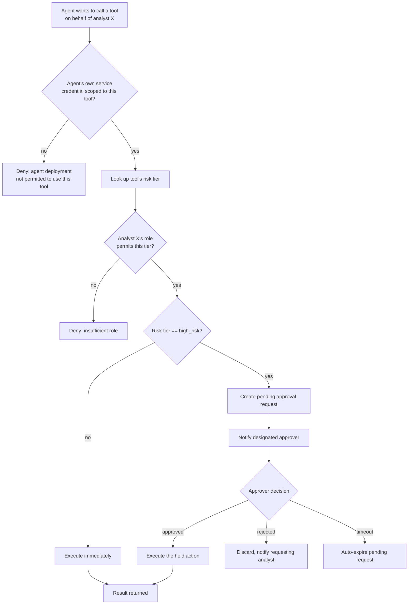

# Pattern 14 — Tool Authorization

> **Series:** Tool-Use Patterns (18 total) — Helios Fraud Platform Edition
> **Stack:** Python 3.12, LangChain 1.3.x, LangGraph 1.2.x, Pydantic v2
> **Status:** ✅ Complete

---

## 1. What is Tool Authorization?

Tool Authorization answers a question none of the previous 13 patterns fully address: **is this specific caller allowed to invoke this specific tool, with these specific arguments, right now?** It's distinct from every validation pattern so far:

| Pattern 13 (Tool Validation) | Pattern 14 (Tool Authorization) |
|---|---|
| "Are these arguments well-formed, do they reference a real entity, are they internally consistent?" | "Is *this caller* (this analyst, this agent, this service) *permitted* to do this action *at all*?" |
| Same for every caller — the rules don't depend on who's asking | Fundamentally about *identity and permission* — the same tool call can be authorized for one caller and denied for another |
| A `freeze_account` call with `confidence="low"` is invalid for anyone | A `freeze_account` call with valid, high-confidence arguments might still be denied because *this particular analyst* isn't authorized to freeze accounts above a certain risk tier, or because the action needs a **second human's sign-off** first |

Tool Authorization in a production agentic system has two major components:

1. **Permission model** — RBAC (Role-Based Access Control) or ABAC (Attribute-Based Access Control) determining which roles/attributes can invoke which tools, often with **risk-tiering** (a low-risk tool like `search_fraud_knowledge_base` needs no special permission; a high-risk tool like `freeze_account` needs elevated permission).
2. **Human-in-the-loop approval gateway** — for the highest-risk actions, even a fully-authorized agent shouldn't execute autonomously; the action is proposed, held, and requires an explicit human approval before it actually runs.

This is the pattern that turns "an agent that *can* call powerful tools" into "an agent that operates within a properly governed permission boundary" — essential in any regulated domain, and the direct enforcement mechanism for policies referenced informally in earlier patterns (e.g., Pattern 01's audit-logging comment about regulatory requirements finally gets its authorization counterpart here).

---

## 2. What Problem Does It Solve?

| Problem | How Tool Authorization fixes it |
|---|---|
| Every tool call executes with the same blanket permission, regardless of who or what triggered it | RBAC/ABAC checks caller identity + role against a declared permission model per tool |
| A junior analyst's agent session could freeze a high-value account without any additional scrutiny | Risk-tiered tools require elevated roles, and the highest tier requires human approval regardless of role |
| No way to pause a high-risk autonomous action for human review before it takes effect | An approval-gateway pattern holds the action in a pending state, notifies a human approver, and only executes on explicit approval |
| An agent's own credentials, if compromised or over-scoped, could be used for actions well beyond its intended purpose | Scoped credentials — the agent's own service identity carries only the minimum permissions its role needs (least privilege), separate from the requesting analyst's permissions |
| Hard to audit "who approved this high-risk action and when" after the fact | Approval decisions are logged as first-class structured events distinct from the underlying tool call |

---

## 3. Realistic Production Problem — Helios Risk-Tiered Authorization + Approval Gateway

**Context:** Helios's tools span a wide risk spectrum — `search_fraud_knowledge_base` (read-only, no risk) up through `freeze_account` (irreversible-without-manual-review, high risk). Helios needs a formal authorization layer that:

1. Classifies every tool into a **risk tier** (`read_only`, `elevated`, `high_risk`).
2. Enforces **RBAC**: an analyst's role (`junior_analyst`, `senior_analyst`, `team_lead`) determines which risk tiers they can trigger *at all*.
3. For `high_risk` tier tools specifically, requires **human-in-the-loop approval** from a second, more senior person before the action executes — even if the requesting analyst's role would otherwise permit it solo.
4. Separately, enforces that the **agent's own service credentials** are scoped to only the tools its specific deployment context needs (e.g., the Customer Communication Agent's service identity should not even be *capable* of calling `freeze_account`, regardless of which analyst is using it) — defense in depth beyond just per-analyst RBAC.

---

## 4. Architecture / Flow Diagram



**Two independent gates, not one:** the agent's own scoped service credential (Step B) and the requesting analyst's role-based permission (Step E) are checked **separately**. This matters because an agent deployment context (e.g., "Customer Communication Agent service") should be structurally incapable of calling `freeze_account` even if somehow a highly-privileged analyst's identity got attached to that session — a defense-in-depth principle, not redundancy.

---

## 5. Complete Request → Response Flow

1. **Agent (acting on behalf of analyst `analyst-jsingh`, role `senior_analyst`) wants to call** `freeze_account(account_id="ACC-51204", reason="card testing", confidence="high")`.
2. **Gate 1 — Agent service-credential scope check**: the calling agent's own deployment identity (e.g., `service=investigation-agent-prod`) is checked against a declared allowlist of tools that deployment is even capable of invoking. The Investigation Agent's service identity *is* scoped to include `freeze_account`; a hypothetical Customer Communication Agent's service identity would not be, and would be denied here regardless of the analyst's role.
3. **Gate 2 — Risk tier lookup**: `freeze_account` is declared as `high_risk` in the tool risk registry.
4. **Gate 3 — RBAC check**: `senior_analyst` role is checked against the permission table for `high_risk` tier — senior analysts are permitted to *initiate* high-risk actions (but, per the next step, not to single-handedly *complete* them).
5. **Gate 4 — Approval gateway trigger**: because the tier is `high_risk`, the action is **not executed immediately** even though gates 1–3 all passed. Instead, a `PendingApproval` record is created (action name, arguments, requesting analyst, timestamp) and a notification is sent to a designated approver (e.g., anyone with role `team_lead` on the same team).
6. **Human approval step**: a team lead reviews the pending action (in a real system, via a UI showing the full investigation context that led to this request) and either approves or rejects it — this is a genuine out-of-band human decision, not something the agent or original analyst can bypass.
7. **Execution on approval**: only once approved does the actual `freeze_account` business logic run (which itself still passes through Pattern 13's validation pipeline as an independent layer).
8. **Rejection or timeout handling**: if rejected, the requesting analyst is notified with the approver's reason; if no decision is made within a configured window (e.g., 4 hours), the pending request auto-expires and must be re-initiated — stale unapproved high-risk actions should never silently execute later.
9. **Audit trail**: every gate's pass/fail, plus the eventual approval/rejection decision and approver identity, are logged as distinct structured events — critical for reconstructing "who authorized this account freeze and on what basis" during a compliance audit.

---

## 6. Why Tool Authorization Is the Right Pattern Here

- **Separates "is this technically valid" (Pattern 13) from "is this permitted"** — a perfectly valid, well-evidenced freeze request can still require a second person's sign-off; conflating validation and authorization would either over-restrict routine safe actions or under-restrict risky ones.
- **Two independent gates (service scope + role) provide real defense in depth** — a compromised or misconfigured analyst session alone can't cause a high-risk action if the agent's own service identity isn't scoped for it, and vice versa.
- **Human-in-the-loop approval is the correct control for irreversible, high-impact actions** — no purely automated check, however sophisticated, substitutes for requiring a second accountable human decision on the highest-risk category of action; this is standard practice in banking operational risk management, not an AI-specific innovation.
- **Explicit expiry prevents stale approvals from executing unexpectedly** — a high-risk action approved hours ago against since-changed circumstances (e.g., the account was already resolved through another channel) should not silently fire; forcing re-initiation after expiry keeps the approval meaningfully tied to current context.

---

## 7. Production-Quality Implementation (Python)

### 7.1 Requirements

```bash
pip install "langchain==1.3.15" "langgraph==1.2.10" "langchain-anthropic==0.5.*" \
            "pydantic==2.*" "fastapi==0.115.*" "uvicorn==0.34.*"
```

### 7.2 Full Code

```python
"""
Helios Tool Authorization Gateway — Tool Authorization Pattern
====================================================================
Risk-tiered RBAC with a human-in-the-loop approval gateway for high-risk
actions, plus a separate agent-service-credential scoping gate for
defense in depth.

Run:
    export ANTHROPIC_API_KEY=sk-...
    uvicorn tool_authorization:app --reload
"""

from __future__ import annotations

import logging
import uuid
from datetime import datetime, timedelta, timezone
from enum import Enum
from typing import Optional

from fastapi import FastAPI, HTTPException
from pydantic import BaseModel, Field

logger = logging.getLogger("helios.tool_authorization")
logging.basicConfig(level=logging.INFO)


def audit_log(event: str, **fields) -> None:
    logger.info("AUDIT | event=%s | %s", event, fields)


# --------------------------------------------------------------------------
# 1. Risk tiers and the tool risk registry
# --------------------------------------------------------------------------

class RiskTier(str, Enum):
    read_only = "read_only"      # e.g. search_fraud_knowledge_base
    elevated = "elevated"         # e.g. request_step_up_auth, flag_transaction
    high_risk = "high_risk"       # e.g. freeze_account


TOOL_RISK_REGISTRY: dict[str, RiskTier] = {
    "search_fraud_knowledge_base": RiskTier.read_only,
    "get_account_details": RiskTier.read_only,
    "get_transaction_history": RiskTier.read_only,
    "flag_transaction": RiskTier.elevated,
    "request_step_up_auth": RiskTier.elevated,
    "freeze_account": RiskTier.high_risk,
}


# --------------------------------------------------------------------------
# 2. RBAC — role -> tiers permitted to INITIATE (not necessarily complete
#    solo; high_risk still always requires approval regardless of role)
# --------------------------------------------------------------------------

class AnalystRole(str, Enum):
    junior_analyst = "junior_analyst"
    senior_analyst = "senior_analyst"
    team_lead = "team_lead"


ROLE_PERMITTED_TIERS: dict[AnalystRole, set[RiskTier]] = {
    AnalystRole.junior_analyst: {RiskTier.read_only},
    AnalystRole.senior_analyst: {RiskTier.read_only, RiskTier.elevated, RiskTier.high_risk},
    AnalystRole.team_lead: {RiskTier.read_only, RiskTier.elevated, RiskTier.high_risk},
}

# Who can APPROVE a pending high_risk action -- deliberately a stricter set
# than who can INITIATE one, and separate from initiation permission.
APPROVER_ROLES: set[AnalystRole] = {AnalystRole.team_lead}


# --------------------------------------------------------------------------
# 3. Agent service-credential scoping (Gate 1 -- independent of analyst RBAC)
# --------------------------------------------------------------------------

AGENT_SERVICE_TOOL_SCOPES: dict[str, set[str]] = {
    "investigation-agent-prod": {
        "search_fraud_knowledge_base", "get_account_details", "get_transaction_history",
        "flag_transaction", "request_step_up_auth", "freeze_account",
    },
    "customer-communication-agent-prod": {
        "search_fraud_knowledge_base", "get_account_details",
        # Deliberately NOT scoped to freeze_account, flag_transaction, etc. --
        # this agent deployment is structurally incapable of these regardless
        # of which analyst's session it's serving.
    },
}


class AuthorizationDeniedError(Exception):
    def __init__(self, gate: str, reason: str):
        self.gate = gate
        self.reason = reason
        super().__init__(f"[{gate}] {reason}")


# --------------------------------------------------------------------------
# 4. Pending approval store (in production: a real DB table, not in-memory)
# --------------------------------------------------------------------------

class ApprovalStatus(str, Enum):
    pending = "pending"
    approved = "approved"
    rejected = "rejected"
    expired = "expired"


class PendingApproval(BaseModel):
    approval_id: str
    tool_name: str
    arguments: dict
    requesting_analyst_id: str
    requesting_analyst_role: AnalystRole
    agent_service_id: str
    status: ApprovalStatus = ApprovalStatus.pending
    created_at: datetime
    expires_at: datetime
    decided_by: Optional[str] = None
    decision_reason: Optional[str] = None


APPROVAL_TTL = timedelta(hours=4)
_pending_approvals: dict[str, PendingApproval] = {}  # in-memory demo store


# --------------------------------------------------------------------------
# 5. The authorization gateway itself
# --------------------------------------------------------------------------

class ToolAuthorizationGateway:
    def authorize_and_maybe_execute(
        self,
        tool_name: str,
        arguments: dict,
        agent_service_id: str,
        requesting_analyst_id: str,
        requesting_analyst_role: AnalystRole,
        execute_fn,
    ) -> dict:
        # ---- Gate 1: agent service-credential scope ----
        scoped_tools = AGENT_SERVICE_TOOL_SCOPES.get(agent_service_id, set())
        if tool_name not in scoped_tools:
            audit_log("authorization_denied", gate="service_scope",
                      agent_service_id=agent_service_id, tool=tool_name)
            raise AuthorizationDeniedError(
                gate="service_scope",
                reason=f"Agent deployment '{agent_service_id}' is not permitted to call '{tool_name}'.",
            )

        # ---- Gate 2: risk tier lookup ----
        tier = TOOL_RISK_REGISTRY.get(tool_name)
        if tier is None:
            audit_log("authorization_denied", gate="unknown_tool", tool=tool_name)
            raise AuthorizationDeniedError(
                gate="unknown_tool", reason=f"Tool '{tool_name}' has no declared risk tier."
            )

        # ---- Gate 3: RBAC check ----
        permitted_tiers = ROLE_PERMITTED_TIERS.get(requesting_analyst_role, set())
        if tier not in permitted_tiers:
            audit_log("authorization_denied", gate="rbac",
                      analyst_id=requesting_analyst_id, role=requesting_analyst_role.value, tier=tier.value)
            raise AuthorizationDeniedError(
                gate="rbac",
                reason=f"Role '{requesting_analyst_role.value}' is not permitted to initiate '{tier.value}' tier actions.",
            )

        # ---- Gate 4: approval requirement ----
        if tier == RiskTier.high_risk:
            approval = self._create_pending_approval(
                tool_name, arguments, requesting_analyst_id, requesting_analyst_role, agent_service_id
            )
            audit_log("approval_required", approval_id=approval.approval_id, tool=tool_name)
            return {
                "status": "pending_approval",
                "approval_id": approval.approval_id,
                "message": f"'{tool_name}' requires approval from a team lead before it executes.",
            }

        # ---- Non-high-risk: execute immediately ----
        audit_log("authorization_granted_immediate_execution", tool=tool_name,
                  analyst_id=requesting_analyst_id)
        return execute_fn(arguments)

    def _create_pending_approval(
        self, tool_name: str, arguments: dict, analyst_id: str,
        analyst_role: AnalystRole, agent_service_id: str,
    ) -> PendingApproval:
        now = datetime.now(timezone.utc)
        approval = PendingApproval(
            approval_id=str(uuid.uuid4()),
            tool_name=tool_name, arguments=arguments,
            requesting_analyst_id=analyst_id, requesting_analyst_role=analyst_role,
            agent_service_id=agent_service_id,
            created_at=now, expires_at=now + APPROVAL_TTL,
        )
        _pending_approvals[approval.approval_id] = approval
        # In production: notify designated approvers (Slack/email/UI badge),
        # not shown here to keep the example focused on the gateway logic.
        return approval

    def decide_approval(
        self, approval_id: str, approver_id: str, approver_role: AnalystRole,
        approve: bool, reason: str, execute_fn,
    ) -> dict:
        approval = _pending_approvals.get(approval_id)
        if approval is None:
            raise HTTPException(status_code=404, detail="Approval request not found")

        if approver_role not in APPROVER_ROLES:
            audit_log("approval_decision_denied", approval_id=approval_id, approver_id=approver_id)
            raise AuthorizationDeniedError(
                gate="approver_rbac", reason="Only team leads may approve high-risk actions."
            )

        now = datetime.now(timezone.utc)
        if now > approval.expires_at:
            approval.status = ApprovalStatus.expired
            audit_log("approval_expired", approval_id=approval_id)
            return {"status": "expired", "message": "This approval request has expired; re-initiate the action."}

        if approval.status != ApprovalStatus.pending:
            return {"status": approval.status.value, "message": "This request was already decided."}

        approval.decided_by = approver_id
        approval.decision_reason = reason

        if approve:
            approval.status = ApprovalStatus.approved
            audit_log("approval_granted", approval_id=approval_id, approver_id=approver_id)
            result = execute_fn(approval.arguments)
            return {"status": "approved_and_executed", "result": result}
        else:
            approval.status = ApprovalStatus.rejected
            audit_log("approval_rejected", approval_id=approval_id,
                      approver_id=approver_id, reason=reason)
            return {"status": "rejected", "message": reason}


# --------------------------------------------------------------------------
# 6. Example tool executor + wiring
# --------------------------------------------------------------------------

def _execute_freeze_account(arguments: dict) -> dict:
    return {"account_id": arguments["account_id"], "status": "FROZEN"}


_gateway = ToolAuthorizationGateway()


# --------------------------------------------------------------------------
# 7. FastAPI surface
# --------------------------------------------------------------------------

app = FastAPI(title="Helios Tool Authorization Gateway — Tool Authorization Pattern")


class ToolCallRequest(BaseModel):
    tool_name: str
    arguments: dict
    agent_service_id: str
    requesting_analyst_id: str
    requesting_analyst_role: AnalystRole


@app.post("/authz/tool-call")
def tool_call_endpoint(req: ToolCallRequest):
    try:
        return _gateway.authorize_and_maybe_execute(
            req.tool_name, req.arguments, req.agent_service_id,
            req.requesting_analyst_id, req.requesting_analyst_role,
            execute_fn=_execute_freeze_account,
        )
    except AuthorizationDeniedError as exc:
        raise HTTPException(status_code=403, detail={"gate": exc.gate, "reason": exc.reason}) from exc


class ApprovalDecisionRequest(BaseModel):
    approver_id: str
    approver_role: AnalystRole
    approve: bool
    reason: str = Field(..., min_length=3)


@app.post("/authz/approvals/{approval_id}/decide")
def decide_approval_endpoint(approval_id: str, req: ApprovalDecisionRequest):
    try:
        return _gateway.decide_approval(
            approval_id, req.approver_id, req.approver_role, req.approve, req.reason,
            execute_fn=_execute_freeze_account,
        )
    except AuthorizationDeniedError as exc:
        raise HTTPException(status_code=403, detail={"gate": exc.gate, "reason": exc.reason}) from exc
```

### 7.3 Example: Full High-Risk Flow

```text
# Step 1: senior analyst's agent requests a freeze
POST /authz/tool-call
{"tool_name": "freeze_account", "arguments": {"account_id": "ACC-51204", "reason": "card testing", "confidence": "high"},
 "agent_service_id": "investigation-agent-prod",
 "requesting_analyst_id": "analyst-jsingh", "requesting_analyst_role": "senior_analyst"}

→ {"status": "pending_approval", "approval_id": "ap-001", "message": "'freeze_account' requires approval from a team lead before it executes."}

# Step 2: team lead approves
POST /authz/approvals/ap-001/decide
{"approver_id": "lead-arao", "approver_role": "team_lead", "approve": true, "reason": "Evidence is solid, approved."}

→ {"status": "approved_and_executed", "result": {"account_id": "ACC-51204", "status": "FROZEN"}}
```

### 7.4 Example: Gate 1 Denies a Wrong-Scoped Agent Deployment

```text
POST /authz/tool-call
{"tool_name": "freeze_account", "arguments": {"account_id": "ACC-51204", "reason": "x", "confidence": "high"},
 "agent_service_id": "customer-communication-agent-prod",
 "requesting_analyst_id": "analyst-jsingh", "requesting_analyst_role": "senior_analyst"}

→ 403 {"detail": {"gate": "service_scope",
        "reason": "Agent deployment 'customer-communication-agent-prod' is not permitted to call 'freeze_account'."}}
```

Note this is denied **even though the analyst's own role would have permitted it** — the agent's service scope gate is independent and denies first.

### 7.5 Testing Both Gates Independently

```python
# tests/test_tool_authorization.py
import pytest
from tool_authorization import (
    ToolAuthorizationGateway, AuthorizationDeniedError, AnalystRole,
)


def test_wrong_service_scope_denied_even_for_senior_analyst():
    gateway = ToolAuthorizationGateway()
    with pytest.raises(AuthorizationDeniedError, match="service_scope"):
        gateway.authorize_and_maybe_execute(
            "freeze_account", {"account_id": "ACC-1"}, "customer-communication-agent-prod",
            "analyst-x", AnalystRole.senior_analyst, execute_fn=lambda a: {},
        )


def test_junior_analyst_denied_elevated_tier():
    gateway = ToolAuthorizationGateway()
    with pytest.raises(AuthorizationDeniedError, match="rbac"):
        gateway.authorize_and_maybe_execute(
            "flag_transaction", {}, "investigation-agent-prod",
            "analyst-x", AnalystRole.junior_analyst, execute_fn=lambda a: {},
        )


def test_high_risk_always_requires_approval_even_for_team_lead():
    gateway = ToolAuthorizationGateway()
    result = gateway.authorize_and_maybe_execute(
        "freeze_account", {"account_id": "ACC-1"}, "investigation-agent-prod",
        "lead-x", AnalystRole.team_lead, execute_fn=lambda a: {"status": "FROZEN"},
    )
    assert result["status"] == "pending_approval"  # team_lead can INITIATE but not skip approval


def test_only_team_lead_role_can_approve():
    gateway = ToolAuthorizationGateway()
    result = gateway.authorize_and_maybe_execute(
        "freeze_account", {"account_id": "ACC-1"}, "investigation-agent-prod",
        "analyst-x", AnalystRole.senior_analyst, execute_fn=lambda a: {"status": "FROZEN"},
    )
    approval_id = result["approval_id"]
    with pytest.raises(AuthorizationDeniedError, match="approver_rbac"):
        gateway.decide_approval(
            approval_id, "analyst-y", AnalystRole.senior_analyst, True, "ok",
            execute_fn=lambda a: {"status": "FROZEN"},
        )
```

---

## Key Takeaways

- Tool Authorization asks **"is this caller permitted"**, a fundamentally different question from Tool Validation's (Pattern 13) **"is this call well-formed and consistent"** — both are needed, in that order.
- **Two independent gates provide real defense in depth**: the agent's own service-credential scope (what this deployment can even do, regardless of who's using it) and the requesting analyst's role-based permission (RBAC) — never conflate these into one check.
- **Human-in-the-loop approval is the appropriate control for the highest-risk tier** — no role, however senior, should be able to single-handedly both initiate and complete an irreversible high-impact action without a second accountable person.
- **Approval requests must expire** — a stale, long-forgotten approval executing against changed circumstances is a real operational risk; force re-initiation after a TTL.
- **Log authorization decisions as distinct structured events from the underlying tool call** — "who approved this and why" needs to be independently queryable for compliance audits.

---

**Next up → Pattern 15: Tool Retry** (a dedicated deep-dive on retry strategies — idempotency keys, exponential backoff with jitter, retry budgets, and distinguishing safe-to-retry from unsafe-to-retry actions).
