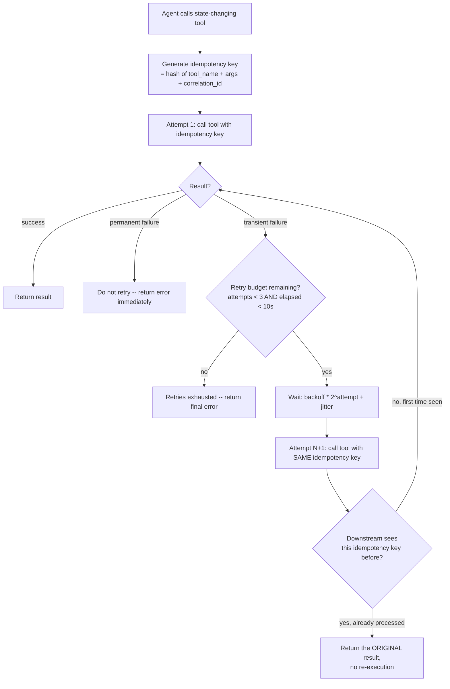

# Pattern 15 — Tool Retry

> **Series:** Tool-Use Patterns (18 total) — Helios Fraud Platform Edition
> **Stack:** Python 3.12, LangChain 1.3.x, LangGraph 1.2.x, Pydantic v2, tenacity
> **Status:** ✅ Complete

---

## 1. What is Tool Retry?

Tool Retry is the disciplined practice of **automatically re-attempting a failed tool call under controlled conditions** — but only when it is actually safe and useful to do so. Pattern 03 (API Calling) already introduced basic retry-with-backoff for the GlobalWatch sanctions API. This pattern generalizes that into a **reusable, cross-cutting retry policy** that can wrap *any* tool, and — critically — adds the piece Pattern 03 only touched lightly: **idempotency**, which is what makes retrying a state-changing action (not just a read-only API call) actually safe.

The central question this pattern answers: **"If a tool call fails or times out, is it safe to just try it again?"** The answer is not always yes.

| Retrying a read-only call | Retrying a state-changing call |
|---|---|
| `get_account_details` failed with a timeout — retrying is trivially safe, it just re-reads the same data | `freeze_account` failed with a timeout — did it actually freeze the account before the timeout, or not? Retrying blindly could **double-execute** the action |
| No side effects to worry about | Side effects mean a naive retry can cause duplicate freezes, duplicate SAR filings, duplicate notifications sent to a customer, etc. |
| Retry policy only needs to worry about backoff timing | Retry policy needs **idempotency keys** so the receiving system can recognize "this is the same logical request being retried" and safely no-op instead of re-executing |

---

## 2. What Problem Does It Solve?

| Problem | How Tool Retry (done properly) fixes it |
|---|---|
| Transient failures (network blips, momentary service unavailability) shouldn't fail an entire investigation | Automatic retry with exponential backoff + jitter recovers from transient issues without agent or human intervention |
| Retrying a state-changing action naively can cause duplicate side effects (double freeze, double SAR filing) | Every state-changing tool call carries an **idempotency key**; the receiving system deduplicates using that key, so retries are provably safe |
| Retrying forever on a call that will never succeed wastes time and masks a real problem | A bounded **retry budget** (max attempts, max total time) ensures retries eventually give up and surface the failure |
| Retrying immediately after every failure can overwhelm an already-struggling downstream service ("retry storm") | Exponential backoff with jitter spreads out retry attempts, and per-tool budgets prevent pile-on |
| Not every failure should be retried — a `400 Bad Request` will fail identically every time | Failure classification (same as Pattern 03: transient vs. permanent) decides whether a retry is even attempted |

---

## 3. Realistic Production Problem — Helios Idempotent Retry Policy

**Context:** Helios's `freeze_account` tool call sometimes experiences network timeouts against the downstream Account Service — the request may or may not have actually reached and been processed by the server before the client-side timeout fired. Without idempotency, a naive "just retry on timeout" policy risks **freezing an account twice, or worse, if the underlying business logic isn't itself idempotent, producing two audit log entries for what should be one action** — a real compliance problem.

**The ask:** Build a `HeliosRetryPolicy` that:

1. Generates a **stable idempotency key** for every state-changing tool call — derived deterministically from the call's semantic content (tool name + arguments + a request-scoped correlation ID), not a fresh random value per attempt, so that **retries of the same logical request reuse the same key**.
2. Passes that idempotency key to the downstream service (simulated Account Service), which is responsible for deduplicating — if it sees a key it's already processed, it returns the **original result** instead of re-executing.
3. Applies **exponential backoff with jitter** between retry attempts, distinct from Pattern 03's per-API-call backoff — this version is generalized as a decorator/wrapper usable across any tool.
4. Enforces a **retry budget**: max 3 attempts, max 10 seconds total elapsed time across all attempts combined — whichever limit is hit first stops further retries.
5. Classifies failures (transient vs. permanent) before deciding to retry at all, exactly as Pattern 03 established, but now as a shared, reusable classifier rather than one-off logic per tool.

---

## 4. Architecture / Flow Diagram



**The critical design point:** the idempotency key is generated **once**, before attempt 1, and reused identically across every retry attempt of that same logical request. If a fresh key were generated per attempt, the downstream service would have no way to recognize retries as "the same request" and idempotent deduplication would be impossible.

---

## 5. Complete Request → Response Flow

1. **Agent decides** to call `freeze_account(account_id="ACC-51204", reason="card testing", confidence="high")` — having already passed Pattern 14's authorization gates.
2. **Idempotency key generation** — before the first attempt, compute `idempotency_key = sha256(tool_name + sorted(arguments) + correlation_id)`. The `correlation_id` is scoped to this *specific logical action request* (e.g., tied to the approval_id from Pattern 14, or a fresh UUID generated once at the start of this particular freeze decision) — not regenerated per retry attempt.
3. **Attempt 1** — the tool call is made, passing `idempotency_key` as part of the request to the downstream Account Service.
4. **Network timeout occurs** — the client doesn't know if the server processed the freeze before the timeout or not.
5. **Failure classification** — a timeout is classified as transient (same logic as Pattern 03), so a retry is appropriate.
6. **Backoff wait** — exponential backoff (`0.5s * 2^attempt`) plus random jitter, capped at a max wait per attempt, before trying again.
7. **Attempt 2 — same idempotency key** — the downstream Account Service checks: "have I already processed a request with this exact idempotency key?" If attempt 1's request *did* actually reach and complete on the server before the client-side timeout, the server recognizes the key and returns the **original, already-computed result** (`status: FROZEN`) without re-running the freeze logic a second time. If attempt 1 never reached the server at all, this is genuinely the first execution, and it proceeds normally.
8. **Either way, exactly one freeze happens** — this is the entire point of idempotency: the client-side uncertainty about "did attempt 1 actually complete" is resolved safely by the server-side deduplication, regardless of which case actually occurred.
9. **Retry budget enforcement** — if transient failures continue past 3 attempts or past 10 seconds total elapsed, retries stop and a final structured error is returned to the agent rather than continuing indefinitely.
10. **Audit logging** — every attempt (including the idempotency key, attempt number, and outcome) is logged, so a compliance review can see exactly how many attempts occurred and confirm only one actual freeze took effect.

---

## 6. Why Tool Retry (with Idempotency) Is the Right Pattern Here

- **Naive retry is actively dangerous for state-changing actions** — without idempotency, "just retry on timeout" is a plausible-sounding policy that can cause real double-execution bugs in exactly the highest-stakes actions (freezes, filings, notifications) where duplication is least acceptable.
- **Idempotency keys shift the safety burden to where it belongs** — the downstream service, which actually knows whether it already processed a request, is in the only position to correctly deduplicate; the retrying client cannot know this on its own.
- **Bounded retry budgets prevent both wasted time and retry storms** — an unbounded retry loop against a genuinely down dependency wastes the agent's time budget and can pile additional load onto an already-struggling service; a hard budget (attempts and elapsed time) fails fast once retries are clearly not helping.
- **Reusing Pattern 03's failure classification, generalized** — rather than reimplementing transient-vs-permanent logic per tool, a shared retry policy wrapper applies it consistently to every state-changing tool across the system.

---

## 7. Production-Quality Implementation (Python)

### 7.1 Requirements

```bash
pip install "langchain==1.3.15" "langgraph==1.2.10" "langchain-anthropic==0.5.*" \
            "pydantic==2.*" "tenacity==9.*" "fastapi==0.115.*" "uvicorn==0.34.*"
```

### 7.2 Full Code

```python
"""
Helios Retry Policy — Tool Retry Pattern
=============================================
A reusable, idempotency-aware retry wrapper for state-changing tools:
stable idempotency keys, exponential backoff with jitter, bounded retry
budgets, and transient/permanent failure classification generalized from
Pattern 03's API Calling into a cross-cutting policy.

Run:
    export ANTHROPIC_API_KEY=sk-...
    uvicorn tool_retry_policy:app --reload
"""

from __future__ import annotations

import hashlib
import json
import logging
import random
import time
from dataclasses import dataclass
from typing import Any, Callable

from fastapi import FastAPI
from pydantic import BaseModel

logger = logging.getLogger("helios.tool_retry_policy")
logging.basicConfig(level=logging.INFO)


def audit_log(event: str, **fields) -> None:
    logger.info("AUDIT | event=%s | %s", event, fields)


# --------------------------------------------------------------------------
# 1. Idempotency key generation -- STABLE across retries of the same request
# --------------------------------------------------------------------------

def generate_idempotency_key(tool_name: str, arguments: dict, correlation_id: str) -> str:
    """Deterministic key derived from the logical request's content, so
    every retry attempt of the SAME logical call produces the SAME key.
    correlation_id must be generated ONCE per logical request (e.g. tied to
    an approval_id or a UUID minted at the start of the action), never
    regenerated per attempt."""
    canonical_args = json.dumps(arguments, sort_keys=True)
    raw = f"{tool_name}:{canonical_args}:{correlation_id}"
    return hashlib.sha256(raw.encode("utf-8")).hexdigest()[:32]


# --------------------------------------------------------------------------
# 2. Failure classification (same principle as Pattern 03, generalized)
# --------------------------------------------------------------------------

class TransientToolError(Exception):
    """Safe to retry: timeouts, 5xx-equivalent downstream errors, connection
    resets."""


class PermanentToolError(Exception):
    """NOT safe to retry: validation errors, authorization denials, 4xx-
    equivalent errors that will fail identically on every attempt."""


# --------------------------------------------------------------------------
# 3. Retry budget and backoff configuration
# --------------------------------------------------------------------------

@dataclass
class RetryBudget:
    max_attempts: int = 3
    max_total_elapsed_seconds: float = 10.0
    base_backoff_seconds: float = 0.5
    max_backoff_seconds: float = 4.0


def compute_backoff_delay(attempt: int, budget: RetryBudget) -> float:
    exponential = min(budget.base_backoff_seconds * (2 ** attempt), budget.max_backoff_seconds)
    jitter = random.uniform(0, exponential * 0.3)
    return exponential + jitter


# --------------------------------------------------------------------------
# 4. Simulated downstream Account Service with idempotency deduplication
#    (in production this logic lives in the RECEIVING service, not the
#    caller -- shown here in-process only to make the pattern self-contained
#    and demonstrable in one file)
# --------------------------------------------------------------------------

class SimulatedAccountService:
    """Simulates a downstream service that deduplicates by idempotency key.
    Also simulates occasional transient timeouts to exercise the retry path."""

    def __init__(self, fail_first_n_attempts: int = 0):
        self._processed_keys: dict[str, dict] = {}
        self._call_count = 0
        self._fail_first_n_attempts = fail_first_n_attempts

    def freeze_account(self, account_id: str, reason: str, idempotency_key: str) -> dict:
        self._call_count += 1

        # Idempotency check FIRST -- if we've already processed this exact
        # logical request, return the original result without re-executing
        # the freeze logic a second time.
        if idempotency_key in self._processed_keys:
            audit_log("idempotent_replay_detected", idempotency_key=idempotency_key)
            return self._processed_keys[idempotency_key]

        # Simulate transient failures for the first N calls (to exercise
        # the retry path in the example/tests below).
        if self._call_count <= self._fail_first_n_attempts:
            raise TransientToolError("Simulated downstream timeout")

        result = {"account_id": account_id, "status": "FROZEN", "reason": reason}
        self._processed_keys[idempotency_key] = result
        return result


# --------------------------------------------------------------------------
# 5. The retry wrapper
# --------------------------------------------------------------------------

class ToolRetryPolicy:
    def __init__(self, budget: RetryBudget = RetryBudget()):
        self._budget = budget

    def call_with_retry(
        self, tool_name: str, arguments: dict, correlation_id: str,
        tool_fn: Callable[..., dict],
    ) -> dict:
        idempotency_key = generate_idempotency_key(tool_name, arguments, correlation_id)
        start_time = time.monotonic()
        last_error: Exception | None = None

        for attempt in range(self._budget.max_attempts):
            elapsed = time.monotonic() - start_time
            if elapsed >= self._budget.max_total_elapsed_seconds:
                audit_log("retry_budget_exhausted_time", tool=tool_name,
                          idempotency_key=idempotency_key, elapsed=round(elapsed, 2))
                break

            try:
                result = tool_fn(**arguments, idempotency_key=idempotency_key)
                audit_log("tool_call_succeeded", tool=tool_name,
                          idempotency_key=idempotency_key, attempt=attempt + 1)
                return {"success": True, "result": result, "attempts": attempt + 1}

            except PermanentToolError as exc:
                # Never retry -- this will fail identically every time.
                audit_log("tool_call_permanent_failure", tool=tool_name,
                          idempotency_key=idempotency_key, error=str(exc))
                return {"success": False, "error": str(exc), "retried": False, "attempts": attempt + 1}

            except TransientToolError as exc:
                last_error = exc
                audit_log("tool_call_transient_failure", tool=tool_name,
                          idempotency_key=idempotency_key, attempt=attempt + 1, error=str(exc))

                if attempt + 1 >= self._budget.max_attempts:
                    break  # budget exhausted, fall through to final failure

                delay = compute_backoff_delay(attempt, self._budget)
                time.sleep(delay)

        audit_log("retry_budget_exhausted", tool=tool_name, idempotency_key=idempotency_key,
                  total_attempts=self._budget.max_attempts)
        return {
            "success": False,
            "error": f"Exhausted retries: {last_error}",
            "retried": True,
            "attempts": self._budget.max_attempts,
        }


# --------------------------------------------------------------------------
# 6. Wiring: a tool_fn adapter matching the retry policy's expected signature
# --------------------------------------------------------------------------

_account_service = SimulatedAccountService(fail_first_n_attempts=1)  # 1st call times out, 2nd succeeds
_retry_policy = ToolRetryPolicy()


def _freeze_account_tool_fn(account_id: str, reason: str, confidence: str, idempotency_key: str) -> dict:
    return _account_service.freeze_account(account_id, reason, idempotency_key)


def freeze_account_with_retry(account_id: str, reason: str, confidence: str, correlation_id: str) -> dict:
    return _retry_policy.call_with_retry(
        tool_name="freeze_account",
        arguments={"account_id": account_id, "reason": reason, "confidence": confidence},
        correlation_id=correlation_id,
        tool_fn=_freeze_account_tool_fn,
    )


# --------------------------------------------------------------------------
# 7. FastAPI surface
# --------------------------------------------------------------------------

app = FastAPI(title="Helios Tool Retry Policy — Tool Retry Pattern")


class FreezeAccountRetryRequest(BaseModel):
    account_id: str
    reason: str
    confidence: str
    correlation_id: str  # e.g. tied to an approval_id from Pattern 14


@app.post("/retry/freeze-account")
def freeze_account_retry_endpoint(req: FreezeAccountRetryRequest):
    return freeze_account_with_retry(
        req.account_id, req.reason, req.confidence, req.correlation_id
    )
```

### 7.3 Example: Transient Failure Recovered Transparently via Idempotency

```text
POST /retry/freeze-account
{"account_id": "ACC-51204", "reason": "card testing", "confidence": "high", "correlation_id": "approval-ap-001"}
```

Internal log sequence:
```
AUDIT | tool_call_transient_failure | tool=freeze_account attempt=1 error=Simulated downstream timeout
AUDIT | tool_call_succeeded | tool=freeze_account attempt=2
```

```json
{"success": true, "result": {"account_id": "ACC-51204", "status": "FROZEN", "reason": "card testing"}, "attempts": 2}
```

Exactly **one** freeze occurred in the downstream service's `_processed_keys` store, despite two client-side attempts — this is what idempotency guarantees.

### 7.4 Example: Same Correlation ID Re-submitted Later Also Deduplicates

```text
# Even calling the endpoint again with the SAME correlation_id (e.g. a
# genuinely duplicate client-side retry from an entirely separate process)
# returns the ORIGINAL result without re-freezing:
POST /retry/freeze-account
{"account_id": "ACC-51204", "reason": "card testing", "confidence": "high", "correlation_id": "approval-ap-001"}
```

```json
{"success": true, "result": {"account_id": "ACC-51204", "status": "FROZEN", "reason": "card testing"}, "attempts": 1}
```

### 7.5 Testing Idempotency and Budget Exhaustion

```python
# tests/test_tool_retry_policy.py
from tool_retry_policy import (
    ToolRetryPolicy, SimulatedAccountService, RetryBudget,
    generate_idempotency_key, TransientToolError,
)


def test_idempotency_key_is_stable_across_retries():
    key1 = generate_idempotency_key("freeze_account", {"account_id": "ACC-1"}, "corr-1")
    key2 = generate_idempotency_key("freeze_account", {"account_id": "ACC-1"}, "corr-1")
    assert key1 == key2  # same logical request -> same key


def test_different_correlation_id_produces_different_key():
    key1 = generate_idempotency_key("freeze_account", {"account_id": "ACC-1"}, "corr-1")
    key2 = generate_idempotency_key("freeze_account", {"account_id": "ACC-1"}, "corr-2")
    assert key1 != key2  # genuinely different requests must not collide


def test_retry_recovers_from_one_transient_failure_with_exactly_one_execution():
    service = SimulatedAccountService(fail_first_n_attempts=1)
    policy = ToolRetryPolicy(RetryBudget(base_backoff_seconds=0.01, max_backoff_seconds=0.05))

    def tool_fn(account_id, reason, confidence, idempotency_key):
        return service.freeze_account(account_id, reason, idempotency_key)

    result = policy.call_with_retry(
        "freeze_account", {"account_id": "ACC-1", "reason": "test", "confidence": "high"},
        "corr-99", tool_fn,
    )
    assert result["success"] is True
    assert result["attempts"] == 2
    assert len(service._processed_keys) == 1  # exactly one execution recorded


def test_retry_budget_exhausted_returns_failure():
    service = SimulatedAccountService(fail_first_n_attempts=99)  # always fails
    policy = ToolRetryPolicy(RetryBudget(max_attempts=3, base_backoff_seconds=0.01, max_backoff_seconds=0.02))

    def tool_fn(account_id, reason, confidence, idempotency_key):
        return service.freeze_account(account_id, reason, idempotency_key)

    result = policy.call_with_retry(
        "freeze_account", {"account_id": "ACC-1", "reason": "test", "confidence": "high"},
        "corr-100", tool_fn,
    )
    assert result["success"] is False
    assert result["attempts"] == 3
```

---

## Key Takeaways

- **Idempotency is what makes retrying state-changing actions safe** — without a stable idempotency key reused across attempts, retrying a timed-out `freeze_account` call risks double-execution; this is the piece most naive retry implementations get wrong.
- **Generate the idempotency key once per logical request, never per attempt** — deriving it from the request's content plus a request-scoped correlation ID (not a fresh random value) is what allows the downstream service to recognize retries as "the same request."
- **Deduplication logic belongs in the receiving service**, not the caller — only the service that actually executed (or didn't execute) the action can correctly answer "have I seen this key before."
- **Bound every retry policy with both an attempt count and a total elapsed time limit** — either alone can allow pathological cases (many fast failures, or few very slow ones) to consume unbounded time.
- **Classify before retrying** — this pattern reuses Pattern 03's transient-vs-permanent distinction as a shared, generalized policy rather than reimplementing it ad hoc per tool.

---

**Next up → Pattern 16: Tool Timeout** (a focused deep-dive on timeout strategy across a multi-step agent — per-call timeouts, cumulative step budgets, and graceful partial-result handling when a timeout fires mid-investigation).
