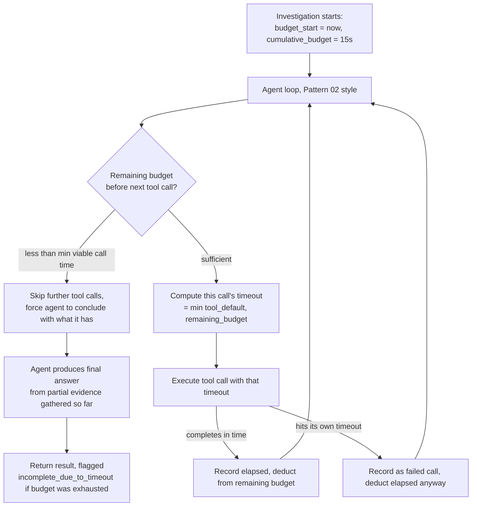

# Pattern 16 — Tool Timeout

> **Series:** Tool-Use Patterns (18 total) — Helios Fraud Platform Edition
> **Stack:** Python 3.12, LangChain 1.3.x, LangGraph 1.2.x, Pydantic v2
> **Status:** ✅ Complete

---

## 1. What is Tool Timeout?

Tool Timeout is the discipline of bounding **how long a tool call, and the overall multi-step agent investigation using it, is allowed to run** — at multiple nested levels — and handling the case where time runs out **gracefully**, returning useful partial results instead of either hanging forever or discarding everything.

Individual timeouts have appeared throughout this series (Pattern 03's `REQUEST_TIMEOUT_SECONDS = 3.0`, Pattern 07's `EXECUTION_TIMEOUT_SECONDS = 5`, Pattern 02's `MAX_STEPS = 8`). This pattern generalizes and formalizes timeout strategy across **three distinct levels** that must all be reasoned about together, not just one:

| Level | What it bounds | Example from earlier patterns |
|---|---|---|
| **Per-call timeout** | A single tool invocation (one HTTP request, one DB query, one sandboxed execution) | Pattern 03's 3-second GlobalWatch timeout; Pattern 07's 5-second sandbox timeout |
| **Per-step budget** | How many tool calls a multi-step agent loop may make before forcibly stopping | Pattern 02's `MAX_STEPS = 8` |
| **Cumulative wall-clock budget** | The *total* elapsed time for an entire agent turn/investigation, across all steps and calls combined | Not yet formalized in this series — this is what Pattern 16 adds |

A system can get the first two right and still fail badly without the third: 8 steps at "only" 3 seconds each is still potentially 24+ seconds, which might be unacceptable for an interactive analyst-facing tool, even though no single call or step limit was individually violated. **Cumulative wall-clock budgeting is the missing piece that ties per-call and per-step limits together into an actual end-to-end latency guarantee.**

---

## 2. What Problem Does It Solve?

| Problem | How Tool Timeout (properly layered) fixes it |
|---|---|
| A single slow tool call can hang an entire agent turn indefinitely | Per-call timeouts (already used since Pattern 03/07) bound each individual call |
| Many individually-fast calls can still sum to an unacceptably slow overall investigation | A cumulative wall-clock budget tracks total elapsed time across *all* calls in the turn, not just each one individually |
| When time runs out mid-investigation, discarding all partial progress wastes real work and gives the analyst nothing | Graceful degradation: return whatever partial findings were gathered before the timeout, clearly labeled as incomplete, rather than an empty error |
| Different tools genuinely need different per-call timeout budgets (a DB query should be fast; a browser fetch is inherently slower) | Per-tool timeout configuration, not one blanket value for every tool |
| Hard to reason about "why did this investigation take so long" after the fact | Structured timing telemetry (per-call duration, cumulative elapsed at each step) logged for later analysis |

---

## 3. Realistic Production Problem — Helios Layered Timeout Budget

**Context:** The Fraud Investigation Agent (Pattern 02) is used interactively by analysts who expect a response within a reasonable window — Helios has set a **hard 15-second cumulative budget** for any single investigation turn, regardless of how many tool calls it takes internally. Individual tools already have their own per-call timeouts (3s for API calls, 5s for sandboxed code, 8s for browser fetches), but nothing currently tracks whether those calls, summed together, are blowing past the overall 15-second experience budget.

**The ask:** Build a `HeliosTimeoutBudgetManager` that:

1. Tracks a **cumulative wall-clock budget** (15 seconds) for an entire investigation turn, started once at the beginning of the agent loop.
2. Before each tool call, checks **remaining budget** — if there isn't enough time left for even a minimal call, skip that call and let the agent proceed to a conclusion with what it already has, rather than attempting a call doomed to be cut off mid-way.
3. Passes a **dynamically shrinking per-call timeout** to each tool call — the timeout for call N is `min(tool's own default timeout, remaining cumulative budget)`, so a call late in the investigation gets less time than one early on.
4. On cumulative budget exhaustion, **stops the agent loop gracefully** and returns a partial-results summary clearly flagged as `incomplete_due_to_timeout=True`, rather than either hanging or returning nothing.
5. Logs per-call and cumulative timing telemetry for post-hoc latency analysis.

---

## 4. Architecture / Flow Diagram



---

## 5. Complete Request → Response Flow

1. **Investigation starts** — `HeliosTimeoutBudgetManager` is instantiated with `cumulative_budget_seconds=15.0` and records `start_time = time.monotonic()`.
2. **Agent loop begins** (Pattern 02-style reason→act→observe), but now every tool call is routed through the budget manager rather than called directly.
3. **Before each call**, the manager computes `remaining = cumulative_budget_seconds - (now - start_time)`. If `remaining < MIN_VIABLE_CALL_SECONDS` (e.g., 0.5s — not enough time for even a fast DB query to plausibly complete), the manager signals the agent loop to **stop attempting further tool calls** and move directly to producing a final answer.
4. **Otherwise**, the manager computes this specific call's timeout as `min(tool's own configured default timeout, remaining)` — e.g., if only 2 seconds remain and the browser tool's default is 8 seconds, this particular call gets capped at 2 seconds, not the full 8.
5. **Call executes** with that dynamically-computed timeout. Whether it completes successfully or itself times out, the **actual elapsed time is recorded and deducted from the remaining budget** — a failed/timed-out call still consumed real wall-clock time and must count against the budget.
6. **Loop continues** — steps 3–5 repeat for each subsequent tool call the agent decides to make, with the remaining budget shrinking each time.
7. **Budget exhaustion** — once remaining budget drops below the minimum viable threshold, the agent is forced to stop calling tools and must synthesize a final answer from whatever evidence it has already gathered.
8. **Graceful partial result** — the final response includes an explicit `incomplete_due_to_timeout: true` flag and a note about which planned steps (if knowable) were skipped, so the analyst understands the summary may be based on partial evidence rather than silently presenting it as a complete investigation.
9. **Telemetry** — every call's individual duration and the cumulative elapsed time at each step are logged, letting Helios's engineering team later analyze "which tool is most often the one that eats the budget" and optimize accordingly.

---

## 6. Why Tool Timeout (Layered, with Graceful Degradation) Is the Right Pattern Here

- **Per-call timeouts alone are necessary but not sufficient** — Patterns 03 and 07 already show good per-call discipline, but without a cumulative budget, a "well-behaved" agent making 8 calls at 3 seconds each could still take 24 seconds, violating a real interactive-latency expectation nobody was tracking.
- **Dynamically shrinking per-call timeouts make the cumulative budget actually enforceable** — simply *tracking* cumulative time without feeding it back into each call's own timeout would let one late, slow call blow through the remaining budget on its own; capping each call's timeout at whatever budget remains is what makes the 15-second ceiling a real guarantee, not just a monitoring number.
- **Graceful degradation preserves real value from partial work** — a multi-step investigation that gathered 3 out of a planned 5 pieces of evidence before running out of time still has something useful to say; discarding all of it because the *last* step didn't finish would waste real, already-completed work.
- **Explicit incompleteness flagging protects trust** — silently returning a partial-evidence summary as if it were a complete investigation risks an analyst making a decision on less information than they think they have; the `incomplete_due_to_timeout` flag makes the limitation visible rather than hidden.

---

## 7. Production-Quality Implementation (Python)

### 7.1 Requirements

```bash
pip install "langchain==1.3.15" "langgraph==1.2.10" "langchain-anthropic==0.5.*" \
            "pydantic==2.*" "fastapi==0.115.*" "uvicorn==0.34.*"
```

### 7.2 Full Code

```python
"""
Helios Timeout Budget Manager — Tool Timeout Pattern
=========================================================
Layered timeout strategy for a multi-step agent investigation: per-call
timeouts (per-tool defaults), a cumulative wall-clock budget across the
whole turn, dynamically shrinking per-call timeouts as budget depletes,
and graceful partial-result handling on exhaustion.

Run:
    export ANTHROPIC_API_KEY=sk-...
    uvicorn timeout_budget_manager:app --reload
"""

from __future__ import annotations

import logging
import time
from dataclasses import dataclass, field
from typing import Callable, Optional

from fastapi import FastAPI
from pydantic import BaseModel

logger = logging.getLogger("helios.timeout_budget_manager")
logging.basicConfig(level=logging.INFO)


def audit_log(event: str, **fields) -> None:
    logger.info("AUDIT | event=%s | %s", event, fields)


# --------------------------------------------------------------------------
# 1. Per-tool default timeouts (mirrors what Patterns 03/07/08 each set
#    individually -- now declared centrally so the budget manager can
#    reason about them uniformly)
# --------------------------------------------------------------------------

TOOL_DEFAULT_TIMEOUTS_SECONDS: dict[str, float] = {
    "get_account_details": 1.0,
    "get_transaction_history": 1.5,
    "check_sanctions_screening": 3.0,   # matches Pattern 03
    "get_device_risk": 1.0,
    "run_python_analysis": 5.0,          # matches Pattern 07
    "fetch_and_summarize_page": 8.0,     # matches Pattern 08
    "search_fraud_knowledge_base": 2.0,
}

DEFAULT_FALLBACK_TIMEOUT_SECONDS = 3.0
MIN_VIABLE_CALL_SECONDS = 0.5


class ToolCallTimedOut(Exception):
    pass


class BudgetExhaustedError(Exception):
    """Raised internally to signal the agent loop should stop calling tools
    and move to producing a final answer from what it has."""


# --------------------------------------------------------------------------
# 2. Per-call timing record, for telemetry
# --------------------------------------------------------------------------

class CallTiming(BaseModel):
    tool_name: str
    allotted_timeout_seconds: float
    actual_elapsed_seconds: float
    succeeded: bool
    timed_out: bool


# --------------------------------------------------------------------------
# 3. The layered budget manager
# --------------------------------------------------------------------------

@dataclass
class HeliosTimeoutBudgetManager:
    cumulative_budget_seconds: float = 15.0
    _start_time: float = field(default_factory=time.monotonic)
    _call_history: list[CallTiming] = field(default_factory=list)

    def remaining_budget(self) -> float:
        elapsed = time.monotonic() - self._start_time
        return max(0.0, self.cumulative_budget_seconds - elapsed)

    def has_viable_budget_remaining(self) -> bool:
        return self.remaining_budget() >= MIN_VIABLE_CALL_SECONDS

    def compute_call_timeout(self, tool_name: str) -> float:
        tool_default = TOOL_DEFAULT_TIMEOUTS_SECONDS.get(
            tool_name, DEFAULT_FALLBACK_TIMEOUT_SECONDS
        )
        remaining = self.remaining_budget()
        return max(0.0, min(tool_default, remaining))

    def execute_with_budget(
        self, tool_name: str, tool_fn: Callable[[float], dict]
    ) -> dict:
        """tool_fn must accept a single `timeout_seconds` argument and raise
        ToolCallTimedOut if it exceeds that timeout. Returns the tool's
        result, or raises BudgetExhaustedError if there's no viable budget
        left to even attempt the call."""
        if not self.has_viable_budget_remaining():
            audit_log("budget_exhausted_before_call", tool=tool_name,
                      remaining=round(self.remaining_budget(), 3))
            raise BudgetExhaustedError(
                f"Insufficient remaining budget ({self.remaining_budget():.2f}s) "
                f"to attempt '{tool_name}'."
            )

        allotted = self.compute_call_timeout(tool_name)
        call_start = time.monotonic()

        try:
            result = tool_fn(allotted)
            elapsed = time.monotonic() - call_start
            self._call_history.append(CallTiming(
                tool_name=tool_name, allotted_timeout_seconds=allotted,
                actual_elapsed_seconds=round(elapsed, 3), succeeded=True, timed_out=False,
            ))
            audit_log("tool_call_completed", tool=tool_name, elapsed=round(elapsed, 3),
                      remaining_after=round(self.remaining_budget(), 3))
            return result

        except ToolCallTimedOut:
            elapsed = time.monotonic() - call_start
            self._call_history.append(CallTiming(
                tool_name=tool_name, allotted_timeout_seconds=allotted,
                actual_elapsed_seconds=round(elapsed, 3), succeeded=False, timed_out=True,
            ))
            audit_log("tool_call_timed_out", tool=tool_name, elapsed=round(elapsed, 3),
                      remaining_after=round(self.remaining_budget(), 3))
            raise

    def summary(self) -> dict:
        return {
            "total_elapsed_seconds": round(time.monotonic() - self._start_time, 3),
            "cumulative_budget_seconds": self.cumulative_budget_seconds,
            "calls_made": len(self._call_history),
            "calls": [c.model_dump() for c in self._call_history],
        }


# --------------------------------------------------------------------------
# 4. Example: a bounded investigation loop using the budget manager
# --------------------------------------------------------------------------

def _simulate_tool_call(tool_name: str, simulated_duration: float, timeout_seconds: float) -> dict:
    """Stand-in for a real tool call -- simulates work taking
    `simulated_duration`, raising ToolCallTimedOut if that exceeds
    the allotted timeout_seconds."""
    if simulated_duration > timeout_seconds:
        time.sleep(timeout_seconds)  # simulate hitting the timeout wall
        raise ToolCallTimedOut(f"{tool_name} exceeded {timeout_seconds:.2f}s timeout")
    time.sleep(simulated_duration)
    return {"tool": tool_name, "status": "ok"}


class InvestigationResult(BaseModel):
    findings: list[dict]
    incomplete_due_to_timeout: bool
    timing_summary: dict


def run_bounded_investigation(
    account_id: str, simulated_call_durations: dict[str, float]
) -> InvestigationResult:
    """simulated_call_durations lets the example/tests control how long each
    step "takes" without real network calls, to deterministically exercise
    both the happy path and the budget-exhaustion path."""
    budget_manager = HeliosTimeoutBudgetManager(cumulative_budget_seconds=15.0)
    findings: list[dict] = []
    incomplete = False

    planned_steps = [
        "get_account_details", "get_transaction_history",
        "get_device_risk", "check_sanctions_screening", "search_fraud_knowledge_base",
    ]

    for tool_name in planned_steps:
        duration = simulated_call_durations.get(tool_name, 0.5)
        try:
            result = budget_manager.execute_with_budget(
                tool_name,
                lambda timeout, tn=tool_name, d=duration: _simulate_tool_call(tn, d, timeout),
            )
            findings.append(result)
        except BudgetExhaustedError:
            incomplete = True
            audit_log("investigation_stopped_early", account_id=account_id,
                      steps_completed=len(findings), steps_planned=len(planned_steps))
            break
        except ToolCallTimedOut:
            # Individual call timeout doesn't necessarily end the whole
            # investigation -- record it as a gap and continue if budget allows.
            findings.append({"tool": tool_name, "status": "timed_out"})
            continue

    return InvestigationResult(
        findings=findings,
        incomplete_due_to_timeout=incomplete,
        timing_summary=budget_manager.summary(),
    )


# --------------------------------------------------------------------------
# 5. FastAPI surface
# --------------------------------------------------------------------------

app = FastAPI(title="Helios Timeout Budget Manager — Tool Timeout Pattern")


class RunInvestigationRequest(BaseModel):
    account_id: str
    simulated_call_durations: dict[str, float] = {}


@app.post("/timeout-budget/investigate", response_model=InvestigationResult)
def run_investigation_endpoint(req: RunInvestigationRequest) -> InvestigationResult:
    return run_bounded_investigation(req.account_id, req.simulated_call_durations)
```

### 7.3 Example: Happy Path — All Steps Complete Within Budget

```text
POST /timeout-budget/investigate
{"account_id": "ACC-51204", "simulated_call_durations": {}}
```

```json
{
  "findings": [
    {"tool": "get_account_details", "status": "ok"},
    {"tool": "get_transaction_history", "status": "ok"},
    {"tool": "get_device_risk", "status": "ok"},
    {"tool": "check_sanctions_screening", "status": "ok"},
    {"tool": "search_fraud_knowledge_base", "status": "ok"}
  ],
  "incomplete_due_to_timeout": false,
  "timing_summary": {"total_elapsed_seconds": 2.512, "cumulative_budget_seconds": 15.0, "calls_made": 5, "calls": ["..."]}
}
```

### 7.4 Example: Budget Exhaustion Mid-Investigation — Graceful Partial Result

```text
POST /timeout-budget/investigate
{"account_id": "ACC-51204",
 "simulated_call_durations": {"fetch_and_summarize_page": 20.0, "check_sanctions_screening": 20.0}}
```

With artificially long simulated durations consuming the budget early, later planned steps are skipped once remaining budget drops below `MIN_VIABLE_CALL_SECONDS`:

```json
{
  "findings": [
    {"tool": "get_account_details", "status": "ok"},
    {"tool": "get_transaction_history", "status": "ok"},
    {"tool": "get_device_risk", "status": "ok"}
  ],
  "incomplete_due_to_timeout": true,
  "timing_summary": {"total_elapsed_seconds": 14.87, "cumulative_budget_seconds": 15.0, "calls_made": 3, "calls": ["..."]}
}
```

The analyst-facing response clearly indicates only 3 of the 5 planned steps completed, rather than silently presenting a 3-step conclusion as if it were the full investigation.

### 7.5 Testing Budget Enforcement and Dynamic Timeout Shrinking

```python
# tests/test_timeout_budget_manager.py
from timeout_budget_manager import HeliosTimeoutBudgetManager, BudgetExhaustedError


def test_per_call_timeout_shrinks_as_budget_depletes():
    manager = HeliosTimeoutBudgetManager(cumulative_budget_seconds=2.0)
    first_call_timeout = manager.compute_call_timeout("check_sanctions_screening")  # default 3.0
    assert first_call_timeout <= 2.0  # capped by remaining budget, not the tool's own default


def test_budget_exhausted_raises_before_attempting_call():
    manager = HeliosTimeoutBudgetManager(cumulative_budget_seconds=0.1)
    import time
    time.sleep(0.15)  # deplete budget below MIN_VIABLE_CALL_SECONDS
    try:
        manager.execute_with_budget("get_account_details", lambda t: {"ok": True})
        assert False, "should have raised BudgetExhaustedError"
    except BudgetExhaustedError:
        pass


def test_investigation_reports_incomplete_flag_on_exhaustion():
    from timeout_budget_manager import run_bounded_investigation
    result = run_bounded_investigation(
        "ACC-1",
        {"get_account_details": 20.0},  # first step alone eats the whole budget
    )
    assert result.incomplete_due_to_timeout is True
    assert len(result.findings) < 5  # not all planned steps completed


def test_investigation_completes_normally_within_budget():
    from timeout_budget_manager import run_bounded_investigation
    result = run_bounded_investigation("ACC-1", {})
    assert result.incomplete_due_to_timeout is False
    assert len(result.findings) == 5
```

---

## Key Takeaways

- **Three distinct timeout levels must be reasoned about together**: per-call, per-step-count, and cumulative wall-clock — getting only one or two right still permits an unacceptably slow end-to-end experience.
- **A cumulative budget is only meaningful if it feeds back into per-call timeouts** — tracking elapsed time without shrinking subsequent calls' own timeouts allows one late call to blow through the remaining budget on its own.
- **Graceful degradation beats both hanging and discarding** — when budget runs out mid-investigation, returning the partial findings already gathered (clearly flagged as incomplete) preserves real value that a hard failure would waste.
- **A failed or timed-out call still consumes real wall-clock time** — deduct its actual elapsed time from the remaining budget even on failure; don't treat timeouts as "free" just because they didn't return a result.
- **Centralize per-tool timeout defaults** rather than scattering `timeout=X` literals across each tool's own implementation — this is what lets a budget manager reason about them uniformly, and it makes future tuning a one-place change.

---

**Next up → Pattern 17: Tool Fallback** (what to do when a tool is unavailable or has exhausted its retries/timeout — fallback tool chains, degraded-mode responses, and circuit breakers).
