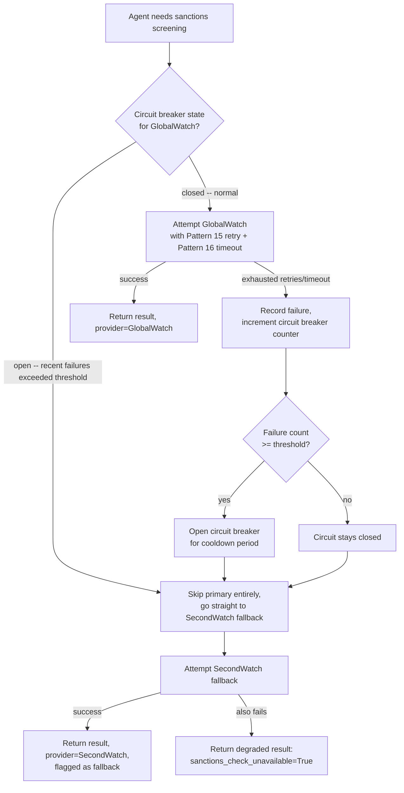
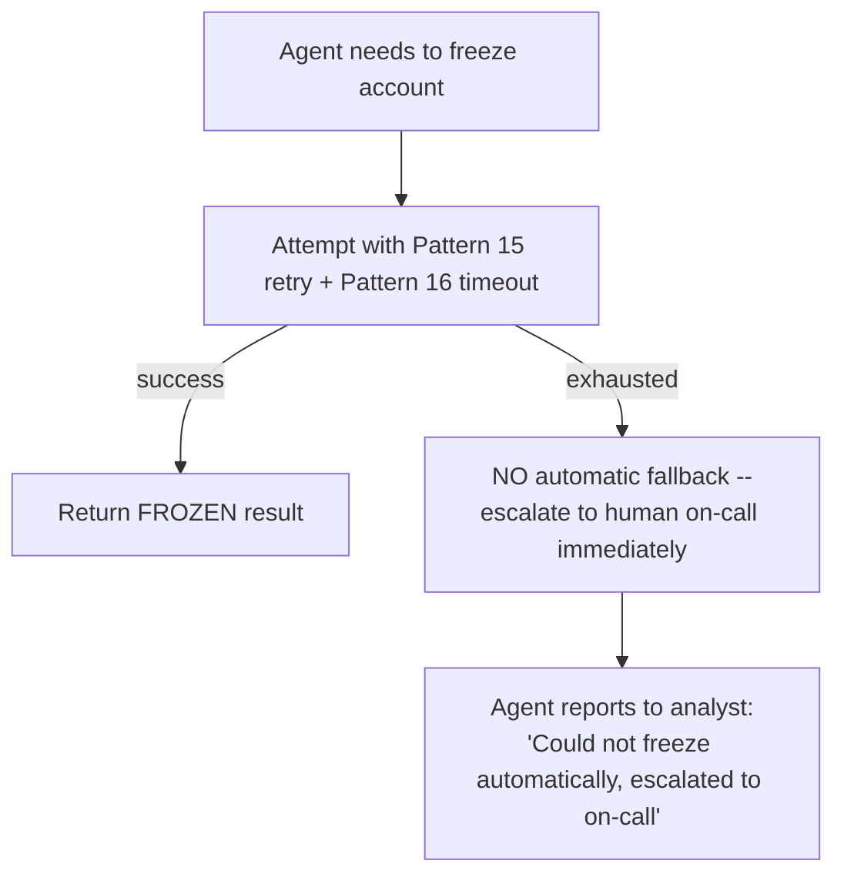

# Pattern 17 — Tool Fallback

> **Series:** Tool-Use Patterns (18 total) — Helios Fraud Platform Edition
> **Stack:** Python 3.12, LangChain 1.3.x, LangGraph 1.2.x, Pydantic v2
> **Status:** ✅ Complete

---

## 1. What is Tool Fallback?

Tool Fallback is what happens **after retries (Pattern 15) are exhausted and a timeout (Pattern 16) has fired** — the tool is genuinely unavailable, at least for now, and the system needs a deliberate, pre-planned answer to "what do we do instead?" rather than simply failing the whole operation.

This completes the reliability trilogy this series has been building toward:

| Pattern 15 (Retry) | Pattern 16 (Timeout) | Pattern 17 (Fallback) |
|---|---|---|
| "Try again, this might just be transient" | "Don't wait forever for any single attempt" | "We've now established this isn't working right now — what's our backup plan?" |
| Assumes the tool will likely succeed on a subsequent attempt | Bounds how long we wait to find out | Assumes it might genuinely **not** succeed within the time we have, and plans for that |

Fallback strategies form a spectrum, from cheapest/most-preserving-of-functionality to most-degraded:

1. **Alternate tool/provider** — if GlobalWatch (Pattern 03) is down, try a secondary sanctions-screening vendor.
2. **Cached/stale data** — return the last known-good result with an explicit staleness warning, better than nothing for some purposes.
3. **Degraded-capability response** — proceed without that piece of evidence, clearly noting the gap, rather than blocking entirely.
4. **Circuit breaker + fail fast** — after repeated failures, stop even attempting the call for a cooldown period, to avoid hammering an already-struggling dependency and to fail fast for subsequent requests instead of each one separately waiting through a full retry+timeout cycle.
5. **Escalate to human** — for genuinely critical, non-substitutable capabilities, surface the outage to a human rather than guessing.

---

## 2. What Problem Does It Solve?

| Problem | How Tool Fallback fixes it |
|---|---|
| A single unavailable dependency (e.g., the sanctions-screening vendor is down) blocks an entire investigation that could otherwise proceed | Fallback lets the investigation continue in a degraded but still useful mode, rather than hard-failing |
| Every request during an outage independently retries and times out, multiplying load on an already-struggling dependency and multiplying user-facing latency | A circuit breaker detects sustained failure and fails fast for subsequent requests during a cooldown, instead of each one paying the full retry+timeout cost |
| Silently proceeding without a piece of evidence (because the tool that would have provided it failed) risks the agent presenting an incomplete picture as if it were complete | Fallback responses are explicitly flagged, so downstream consumers (and the analyst) know evidence is missing, not just silently absent |
| Not every capability has a meaningful fallback — pretending otherwise can be worse than admitting failure | Some tools should have **no automatic fallback** and instead escalate directly to a human when unavailable — this pattern includes deciding when *not* to auto-degrade |

---

## 3. Realistic Production Problem — Helios Layered Fallback Strategy

**Context:** The Fraud Investigation Agent depends on several external/internal services with different criticality profiles:

- `check_sanctions_screening` (Pattern 03, GlobalWatch) — important but **substitutable**: Helios has a secondary vendor, "SecondWatch," that can serve as a fallback (slightly lower data quality, but usable).
- `get_device_risk` — **not substitutable** (it's Helios's own proprietary device-fingerprinting data; no vendor equivalent exists), but the investigation can meaningfully proceed without it, clearly flagged as a gap.
- `freeze_account` — **not substitutable and not gracefully degradable**: there is no fallback for actually freezing an account; if this fails after retries, it must escalate directly to a human (a page/alert to the on-call team), never silently "proceed without freezing."

**The ask:** Build a `HeliosFallbackChain` that:

1. Wraps `check_sanctions_screening` with a **fallback to SecondWatch** on primary failure, explicitly labeling which provider actually served the result.
2. Wraps `get_device_risk` with a **degraded-mode fallback**: if it fails, the investigation proceeds with `device_risk_available=False` clearly flagged, rather than blocking.
3. Wraps `freeze_account` with **no automatic fallback** — on failure after retries/timeout, escalate directly to a human on-call alert; the agent must never proceed as if the freeze happened when it didn't.
4. Implements a simple **circuit breaker** around the primary sanctions-screening call: after 5 consecutive failures, stop attempting the primary provider for a 60-second cooldown and route straight to the fallback, rather than each subsequent request re-discovering the outage the slow way.

---

## 4. Architecture / Flow Diagram



**Separate, non-degradable path for `freeze_account`:**



---

## 5. Complete Request → Response Flow

1. **Agent needs sanctions screening** for a transaction counterparty, and calls the fallback-wrapped `screen_with_fallback(name, country)`.
2. **Circuit breaker check** — before attempting anything, check whether the breaker for `GlobalWatch` is currently `open` (meaning 5+ consecutive failures were recorded within the last cooldown window). If open, skip the primary provider entirely and go straight to the fallback — this avoids wasting a full retry+timeout cycle (Patterns 15/16) on a dependency already known to be down.
3. **If circuit is closed**, attempt the primary provider (`GlobalWatch`) using the full Pattern 15 retry policy and Pattern 16 timeout budget.
4. **On primary success** — return the result, explicitly tagged `provider="GlobalWatch"`, and reset the circuit breaker's failure counter to zero.
5. **On primary exhaustion** — record a failure against the circuit breaker; if this pushes the consecutive-failure count to the threshold (5), flip the breaker to `open` with a 60-second cooldown timestamp.
6. **Attempt the fallback provider** (`SecondWatch`), also under its own (typically shorter, since it's already a fallback path) retry/timeout policy.
7. **On fallback success** — return the result tagged `provider="SecondWatch"` and `is_fallback=True`, so any downstream consumer (including the agent's own reasoning and the eventual analyst-facing summary) knows this came from the secondary, lower-confidence source.
8. **On fallback also failing** — return a structured degraded result: `sanctions_check_unavailable=True`, with no fabricated data — the investigation must proceed knowing this evidence gap exists, never silently treating "unavailable" as "clear."
9. **Contrast: `freeze_account` failure** — because this tool has **no viable fallback** (there's no secondary system that can freeze an account), exhausting its retry/timeout budget triggers immediate escalation — a paging alert to the on-call fraud-ops team — and the agent's response to the analyst explicitly states the automated freeze failed and has been escalated, never implying success.

---

## 6. Why Tool Fallback (with a Circuit Breaker and Explicit Non-Degradable Paths) Is the Right Pattern Here

- **Not every tool deserves the same fallback treatment** — the deliberate design choice to give `freeze_account` *no* automatic fallback (only escalation) is as important as designing good fallbacks for substitutable capabilities; treating every failure the same way would be a mistake in either direction.
- **Circuit breakers protect both the failing dependency and the calling system's latency** — without one, every request during a real outage independently pays the full retry+timeout cost before falling back, multiplying both load on the struggling service and user-facing delay; a circuit breaker short-circuits this once the outage is established.
- **Explicit fallback/degradation flagging preserves trustworthiness** — an agent that silently used a lower-confidence secondary data source, or silently proceeded without a risk signal, could mislead an analyst into more confidence than the underlying evidence actually supports; surfacing `is_fallback` and `unavailable` flags keeps the human appropriately informed.
- **This pattern is the natural completion of Patterns 15–16** — retry handles "try again," timeout handles "don't wait forever," and fallback handles "now that we know it's not working, here's the deliberate plan," closing the full reliability loop for tool-use in this series.

---

## 7. Production-Quality Implementation (Python)

### 7.1 Requirements

```bash
pip install "langchain==1.3.15" "langgraph==1.2.10" "langchain-anthropic==0.5.*" \
            "pydantic==2.*" "fastapi==0.115.*" "uvicorn==0.34.*"
```

### 7.2 Full Code

```python
"""
Helios Fallback Chain — Tool Fallback Pattern
==================================================
Circuit-breaker-protected fallback chains for substitutable tools
(sanctions screening: GlobalWatch -> SecondWatch), degraded-mode
continuation for non-substitutable-but-non-critical tools (device risk),
and explicit no-fallback human escalation for critical, non-degradable
actions (freeze_account).

Run:
    export ANTHROPIC_API_KEY=sk-...
    uvicorn tool_fallback_chain:app --reload
"""

from __future__ import annotations

import logging
import time
from dataclasses import dataclass, field
from enum import Enum
from typing import Callable, Optional

from fastapi import FastAPI
from pydantic import BaseModel

logger = logging.getLogger("helios.tool_fallback_chain")
logging.basicConfig(level=logging.INFO)


def audit_log(event: str, **fields) -> None:
    logger.info("AUDIT | event=%s | %s", event, fields)


def page_on_call_team(reason: str, context: dict) -> None:
    """Stand-in for a real paging integration (PagerDuty/Opsgenie).
    A freeze_account failure with no fallback available is exactly the
    class of event that must reach a human immediately."""
    audit_log("ON_CALL_PAGED", reason=reason, context=context)


# --------------------------------------------------------------------------
# 1. Circuit breaker
# --------------------------------------------------------------------------

class CircuitState(str, Enum):
    closed = "closed"   # normal operation
    open = "open"       # failing -- skip primary, go straight to fallback


@dataclass
class CircuitBreaker:
    failure_threshold: int = 5
    cooldown_seconds: float = 60.0
    _consecutive_failures: int = 0
    _opened_at: Optional[float] = None

    @property
    def state(self) -> CircuitState:
        if self._opened_at is None:
            return CircuitState.closed
        if time.monotonic() - self._opened_at >= self.cooldown_seconds:
            # Cooldown elapsed -- allow a fresh attempt (half-open in spirit,
            # simplified here to reset-and-retry on the next call).
            self._opened_at = None
            self._consecutive_failures = 0
            return CircuitState.closed
        return CircuitState.open

    def record_success(self) -> None:
        self._consecutive_failures = 0
        self._opened_at = None

    def record_failure(self) -> None:
        self._consecutive_failures += 1
        if self._consecutive_failures >= self.failure_threshold and self._opened_at is None:
            self._opened_at = time.monotonic()
            audit_log("circuit_breaker_opened", failures=self._consecutive_failures,
                      cooldown_seconds=self.cooldown_seconds)


# --------------------------------------------------------------------------
# 2. Simulated primary and fallback sanctions-screening providers
#    (in production these would each be full Pattern 03 API-Calling clients
#    with their own retry/timeout policies from Patterns 15/16)
# --------------------------------------------------------------------------

class ScreeningResult(BaseModel):
    is_match: bool
    confidence: float
    provider: str
    is_fallback: bool = False


class ScreeningUnavailable(BaseModel):
    sanctions_check_unavailable: bool = True
    reason: str


def _call_globalwatch(name: str, country: str, should_fail: bool) -> ScreeningResult:
    if should_fail:
        raise TimeoutError("GlobalWatch exhausted retries/timeout (Patterns 15/16)")
    return ScreeningResult(is_match=False, confidence=0.0, provider="GlobalWatch")


def _call_secondwatch(name: str, country: str, should_fail: bool) -> ScreeningResult:
    if should_fail:
        raise TimeoutError("SecondWatch also exhausted retries/timeout")
    return ScreeningResult(is_match=False, confidence=0.0, provider="SecondWatch", is_fallback=True)


# --------------------------------------------------------------------------
# 3. The fallback chain for a substitutable capability
# --------------------------------------------------------------------------

_globalwatch_breaker = CircuitBreaker(failure_threshold=5, cooldown_seconds=60.0)


def screen_with_fallback(
    name: str, country: str,
    primary_should_fail: bool = False, fallback_should_fail: bool = False,
) -> ScreeningResult | ScreeningUnavailable:
    if _globalwatch_breaker.state == CircuitState.open:
        audit_log("circuit_open_skipping_primary", provider="GlobalWatch")
    else:
        try:
            result = _call_globalwatch(name, country, primary_should_fail)
            _globalwatch_breaker.record_success()
            audit_log("screening_succeeded", provider="GlobalWatch", is_fallback=False)
            return result
        except TimeoutError as exc:
            _globalwatch_breaker.record_failure()
            audit_log("screening_primary_failed", provider="GlobalWatch", error=str(exc))

    # Primary unavailable (circuit open OR just failed) -- attempt fallback
    try:
        result = _call_secondwatch(name, country, fallback_should_fail)
        audit_log("screening_succeeded", provider="SecondWatch", is_fallback=True)
        return result
    except TimeoutError as exc:
        audit_log("screening_fully_unavailable", error=str(exc))
        return ScreeningUnavailable(
            reason="Both GlobalWatch and SecondWatch are currently unavailable."
        )


# --------------------------------------------------------------------------
# 4. Degraded-mode fallback for a non-substitutable-but-non-critical tool
# --------------------------------------------------------------------------

class DeviceRiskResult(BaseModel):
    device_risk_available: bool
    risk_score: Optional[int] = None
    note: Optional[str] = None


def get_device_risk_with_degradation(transaction_id: str, should_fail: bool = False) -> DeviceRiskResult:
    if should_fail:
        audit_log("device_risk_unavailable_degrading", transaction_id=transaction_id)
        return DeviceRiskResult(
            device_risk_available=False,
            note="Device risk data unavailable; investigation proceeding without this signal.",
        )
    return DeviceRiskResult(device_risk_available=True, risk_score=88)


# --------------------------------------------------------------------------
# 5. NO-fallback path for a critical, non-degradable action
# --------------------------------------------------------------------------

class FreezeResult(BaseModel):
    success: bool
    status: Optional[str] = None
    escalated_to_on_call: bool = False
    message: str


def freeze_account_no_fallback(
    account_id: str, reason: str, should_fail: bool = False
) -> FreezeResult:
    if should_fail:
        # Exhausted Pattern 15 retries and Pattern 16 timeout budget --
        # there is NO automatic fallback for actually freezing an account.
        # This MUST escalate to a human, never silently "proceed anyway."
        page_on_call_team(
            reason="freeze_account failed after exhausting retry/timeout budget",
            context={"account_id": account_id, "requested_reason": reason},
        )
        return FreezeResult(
            success=False, escalated_to_on_call=True,
            message=(
                f"Automated freeze of {account_id} failed after retries. "
                "This has been escalated to the on-call fraud-ops team for "
                "manual action -- do NOT assume the account is protected."
            ),
        )
    return FreezeResult(success=True, status="FROZEN", message=f"{account_id} frozen successfully.")


# --------------------------------------------------------------------------
# 6. FastAPI surface
# --------------------------------------------------------------------------

app = FastAPI(title="Helios Fallback Chain — Tool Fallback Pattern")


class ScreenRequest(BaseModel):
    name: str
    country: str
    primary_should_fail: bool = False
    fallback_should_fail: bool = False


@app.post("/fallback/screen")
def screen_endpoint(req: ScreenRequest):
    result = screen_with_fallback(
        req.name, req.country, req.primary_should_fail, req.fallback_should_fail
    )
    return result.model_dump()


class DeviceRiskRequest(BaseModel):
    transaction_id: str
    should_fail: bool = False


@app.post("/fallback/device-risk", response_model=DeviceRiskResult)
def device_risk_endpoint(req: DeviceRiskRequest) -> DeviceRiskResult:
    return get_device_risk_with_degradation(req.transaction_id, req.should_fail)


class FreezeRequest(BaseModel):
    account_id: str
    reason: str
    should_fail: bool = False


@app.post("/fallback/freeze-account", response_model=FreezeResult)
def freeze_endpoint(req: FreezeRequest) -> FreezeResult:
    return freeze_account_no_fallback(req.account_id, req.reason, req.should_fail)
```

### 7.3 Example: Primary Fails, Fallback Succeeds

```text
POST /fallback/screen
{"name": "Aleksei Petrov", "country": "RU", "primary_should_fail": true, "fallback_should_fail": false}
```

```json
{"is_match": false, "confidence": 0.0, "provider": "SecondWatch", "is_fallback": true}
```

### 7.4 Example: Both Fail — Explicit Unavailability, No Fabrication

```text
POST /fallback/screen
{"name": "Aleksei Petrov", "country": "RU", "primary_should_fail": true, "fallback_should_fail": true}
```

```json
{"sanctions_check_unavailable": true, "reason": "Both GlobalWatch and SecondWatch are currently unavailable."}
```

### 7.5 Example: Freeze Failure — Escalation, Not Silent Failure

```text
POST /fallback/freeze-account
{"account_id": "ACC-51204", "reason": "card testing", "should_fail": true}
```

```json
{
  "success": false,
  "status": null,
  "escalated_to_on_call": true,
  "message": "Automated freeze of ACC-51204 failed after retries. This has been escalated to the on-call fraud-ops team for manual action -- do NOT assume the account is protected."
}
```

### 7.6 Testing Circuit Breaker Transitions and No-Fallback Escalation

```python
# tests/test_tool_fallback_chain.py
from tool_fallback_chain import CircuitBreaker, CircuitState, freeze_account_no_fallback


def test_circuit_opens_after_threshold_failures():
    breaker = CircuitBreaker(failure_threshold=3, cooldown_seconds=60.0)
    for _ in range(2):
        breaker.record_failure()
    assert breaker.state == CircuitState.closed  # not yet at threshold
    breaker.record_failure()
    assert breaker.state == CircuitState.open


def test_circuit_closes_after_cooldown():
    breaker = CircuitBreaker(failure_threshold=1, cooldown_seconds=0.05)
    breaker.record_failure()
    assert breaker.state == CircuitState.open
    import time
    time.sleep(0.06)
    assert breaker.state == CircuitState.closed  # cooldown elapsed


def test_freeze_failure_always_escalates_never_silently_succeeds():
    result = freeze_account_no_fallback("ACC-1", "test", should_fail=True)
    assert result.success is False
    assert result.escalated_to_on_call is True
    assert "escalated" in result.message.lower()


def test_freeze_success_does_not_escalate():
    result = freeze_account_no_fallback("ACC-1", "test", should_fail=False)
    assert result.success is True
    assert result.escalated_to_on_call is False
```

---

## Key Takeaways

- Tool Fallback completes the reliability trilogy: **Retry (try again) → Timeout (don't wait forever) → Fallback (deliberate plan once we know it's genuinely not working)**.
- **Not every tool should have an automatic fallback** — deliberately choosing "no fallback, escalate to a human" for critical, non-substitutable, non-degradable actions like `freeze_account` is as much a design decision as building a graceful fallback chain for substitutable ones.
- **Circuit breakers prevent every request from independently rediscovering an outage** — once failures cross a threshold, fail fast to the fallback (or to escalation) rather than making each subsequent request pay the full retry+timeout cost.
- **Always flag degraded results explicitly** (`is_fallback`, `device_risk_available=False`, `sanctions_check_unavailable=True`) — silently substituting lower-confidence data or silently omitting a signal risks misleading whoever consumes the result, human or agent.
- **Escalation is a legitimate fallback strategy, not a failure of the pattern** — for the highest-stakes actions, routing to a human when automation can't complete the job safely is exactly the correct behavior, not something to be engineered away.

---

**Next up → Pattern 18: Tool Result Validation** (the final pattern in this series — a focused deep-dive on validating and sanity-checking everything a tool returns before it's trusted by the agent's downstream reasoning, closing the loop on data integrity across the whole tool-use pipeline).
