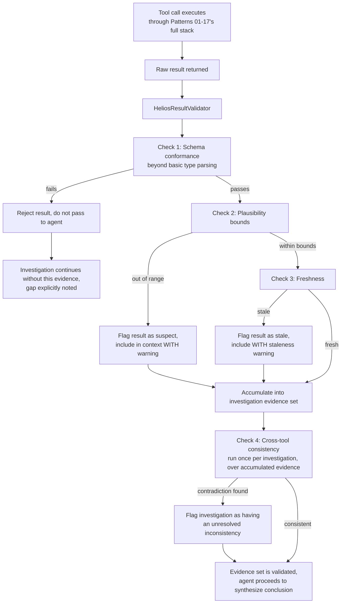

# Pattern 18 — Tool Result Validation

> **Series:** Tool-Use Patterns (18 total) — Helios Fraud Platform Edition
> **Stack:** Python 3.12, LangChain 1.3.x, LangGraph 1.2.x, Pydantic v2
> **Status:** ✅ Complete — Final pattern in this series

---

## 1. What is Tool Result Validation?

Tool Result Validation is the discipline of treating **everything a tool returns as untrusted until checked** — a full, dedicated validation layer for outputs, symmetric to how Pattern 13 (Tool Validation) treated inputs, but deep enough to stand as its own pattern. Pattern 13's Layer 4 touched result plausibility briefly; this final pattern generalizes it into a complete framework covering the distinct ways tool *results* — not arguments — can be wrong, and closes the loop across everything this 18-pattern series has built.

The core insight this pattern formalizes: **a tool succeeding (no exception, HTTP 200, no error field) is not the same as a tool's result being correct or safe to reason over.** Results can be wrong in ways that have nothing to do with whether the call "succeeded":

| Failure class | Example | Why a "successful" call doesn't catch it |
|---|---|---|
| **Schema drift** | A vendor API (Pattern 03) silently adds/renames a field; the client's parsing logic misreads it | The HTTP call still returns 200 — the *shape* silently changed underneath |
| **Implausible values** | A risk score (Pattern 06) comes back as 340 instead of 0–100 due to a formula bug | The function returned without raising — the *value* is simply wrong |
| **Stale/cached data** | A database query (Pattern 04) returns a cached account status from before a very recent freeze | The query succeeded — it just answered a question that's now outdated |
| **Silent partial failure** | A batch tool call (Pattern 07's code execution) "succeeds" but only processed 3 of 10 requested items due to an internal early-exit bug | No exception was raised — the *completeness* of the result is what's wrong |
| **Poisoned/adversarial content** | A browser tool (Pattern 08) result contains text engineered to manipulate downstream reasoning | The fetch succeeded — the *content*, not the mechanics, is the problem |
| **Cross-tool inconsistency** | `get_account_details` reports `status="frozen"` while `get_transaction_history` (fetched moments earlier) shows a transaction that just posted | Each individual call succeeded — only checking them *together* reveals the inconsistency |

---

## 2. What Problem Does It Solve?

| Problem | How Tool Result Validation fixes it |
|---|---|
| Agents that trust every non-error tool result blindly can build an entire multi-step conclusion (Pattern 02) on top of one silently-wrong data point | Every result passes through validation before being folded into the agent's reasoning context |
| Schema drift in external APIs (Pattern 03) or search indices (Pattern 05/09) can silently corrupt downstream logic | Schema-conformance checks on results, not just on the request that produced them |
| Numeric results (Pattern 06's risk scores, Pattern 09's relevance scores) can be out-of-range due to a bug, without the function itself detecting it | Explicit plausibility/range checks applied uniformly to every numeric tool result |
| Different tools' results about the same entity can silently disagree, and nothing currently cross-checks them | Cross-tool consistency validation flags contradictions for human or agent attention instead of picking one silently |
| Untrusted content from browser tools (Pattern 08) needs more than just the untrusted-content framing — it needs active scanning for suspicious embedded directives | Content-level scanning as part of result validation, complementing (not replacing) Pattern 08's framing defense |

---

## 3. Realistic Production Problem — Helios End-to-End Result Validation Layer

**Context:** Helios's Fraud Investigation Agent, across every pattern in this series, accumulates evidence from many tool calls — account details, transaction history, device risk, sanctions screening, policy search, risk score computation — and synthesizes them into a freeze/no-freeze recommendation (Pattern 14's gated action). Helios's compliance team has flagged that **nothing currently checks whether the individual pieces of evidence are internally consistent or individually plausible** before the agent reasons over them — several near-miss incidents involved the agent using a stale account status.

**The ask:** Build a `HeliosResultValidator` applied as the last step of **every** tool call in the investigation pipeline, with four checks:

1. **Schema conformance** — does the result actually match the tool's declared output schema, beyond what the initial Pydantic parse alone verified (catching cases where a field is present but semantically wrong, e.g., a `risk_score` field that parsed as an int but is outside [0,100]).
2. **Plausibility bounds** — numeric and categorical results checked against declared valid ranges/sets, tool by tool.
3. **Freshness check** — for any result carrying a timestamp (e.g., `get_account_details`'s data), flag results older than a configured staleness threshold.
4. **Cross-tool consistency** — after a batch of related calls within one investigation, run a final consistency pass checking for direct contradictions between what different tools reported about the same entity.

---

## 4. Architecture / Flow Diagram



**Key structural point:** Checks 1–3 run **per tool call**, immediately after each result returns. Check 4 runs **once per investigation**, over the accumulated set of validated evidence, because consistency is inherently a property of *multiple* results considered together, not any single one.

---

## 5. Complete Request → Response Flow

1. **A tool call completes** somewhere in the investigation (say, `get_account_details` returns `{"account_id": "ACC-51204", "status": "active", "risk_score": 12, "as_of": "2026-08-15T09:00:00Z"}`) — having already passed through Patterns 13–17's input validation, authorization, retry, timeout, and fallback machinery.
2. **Check 1 — schema conformance**: beyond the basic Pydantic parse that already happened when the result was received, re-verify semantic conformance — e.g., `status` must be one of a declared enum set (`active`, `frozen`, `closed`, `pending_review`), not just "any string."
3. **Check 2 — plausibility bounds**: `risk_score=12` is checked against its declared valid range `[0, 100]` — passes. (Contrast with the earlier example of `risk_score=340` — that would fail here and be flagged as suspect rather than silently trusted.)
4. **Check 3 — freshness**: `as_of="2026-08-15T09:00:00Z"` is compared against the current time and the tool's declared staleness threshold (e.g., account status data older than 5 minutes is flagged) — if the investigation is happening at `09:01:00Z`, this passes; if it's happening at `09:20:00Z`, the result is flagged stale and included with an explicit warning rather than silently trusted as current.
5. **Result accumulates** into the investigation's evidence set, tagged with its validation outcome (clean / suspect / stale) rather than discarding the flags once the result enters the agent's context.
6. **Steps 1–5 repeat** for each subsequent tool call in the investigation (transaction history, device risk, sanctions screening, etc.).
7. **Check 4 — cross-tool consistency** runs once, after the evidence-gathering phase, over the full accumulated set: e.g., checking whether `get_account_details`'s `status="active"` is consistent with `get_transaction_history` showing no transactions in the last 24 hours despite an alert claiming "transaction just occurred" — a genuine contradiction here would be flagged as `unresolved_inconsistency`, prompting either an additional targeted tool call to resolve it or explicit escalation rather than silent resolution in favor of one source.
8. **Final synthesis** — the agent's concluding reasoning step receives not just the raw evidence, but each piece's validation status (clean/suspect/stale) and any flagged cross-tool inconsistencies, so its final freeze/no-freeze recommendation is built on **known-quality** evidence, with gaps and uncertainties explicit rather than hidden.
9. **Audit log** — every validation check's outcome, across all four checks and all tool calls in the investigation, is logged — providing the complete evidentiary trail a compliance review would need to answer "was this conclusion based on sound, current, mutually consistent data."

---

## 6. Why Tool Result Validation Is the Right Pattern Here

- **Completes the trust boundary this series has built incrementally** — Pattern 01 validated Function Calling arguments; Pattern 13 formalized input validation as a layered pipeline; this final pattern applies the same rigor to the *other side* of every tool call — the results — closing a gap that's easy to overlook once inputs are well-handled.
- **A successful call is not the same as a correct result** — this is the single most important idea in this pattern, and it's what motivates checking schema conformance, plausibility, and freshness even when nothing "went wrong" mechanically.
- **Cross-tool consistency catches an entire class of bug that no single-tool validation can** — Patterns 01–17 all validate one tool's call in isolation; only by explicitly comparing results *across* tools does a genuine real-world contradiction (stale cache vs. fresh data, two systems disagreeing) become visible.
- **Explicit flagging (suspect/stale/inconsistent) beats both blind trust and blind rejection** — silently trusting a stale or implausible result risks a wrong conclusion; silently discarding it risks losing real evidence unnecessarily. Flagging it and passing the flag through to final synthesis lets the agent (and ultimately the human analyst) make an informed judgment call.

---

## 7. Production-Quality Implementation (Python)

### 7.1 Requirements

```bash
pip install "langchain==1.3.15" "langgraph==1.2.10" "langchain-anthropic==0.5.*" \
            "pydantic==2.*" "fastapi==0.115.*" "uvicorn==0.34.*"
```

### 7.2 Full Code

```python
"""
Helios Result Validator — Tool Result Validation Pattern
==============================================================
Final pattern in the Tool-Use Patterns series: a dedicated result-side
validation layer covering schema conformance, plausibility bounds,
freshness, and cross-tool consistency -- completing the input/output
trust boundary established across all 18 patterns.

Run:
    export ANTHROPIC_API_KEY=sk-...
    uvicorn result_validator:app --reload
"""

from __future__ import annotations

import logging
from dataclasses import dataclass, field
from datetime import datetime, timedelta, timezone
from enum import Enum
from typing import Any, Callable, Optional

from fastapi import FastAPI
from pydantic import BaseModel

logger = logging.getLogger("helios.result_validator")
logging.basicConfig(level=logging.INFO)


def audit_log(event: str, **fields) -> None:
    logger.info("AUDIT | event=%s | %s", event, fields)


# --------------------------------------------------------------------------
# 1. Validation outcome types
# --------------------------------------------------------------------------

class ResultStatus(str, Enum):
    clean = "clean"
    suspect = "suspect"       # failed plausibility check
    stale = "stale"           # failed freshness check
    rejected = "rejected"     # failed schema conformance -- excluded entirely


class ValidatedResult(BaseModel):
    tool_name: str
    status: ResultStatus
    data: Optional[dict] = None
    warnings: list[str] = []


# --------------------------------------------------------------------------
# 2. Per-tool declared validation rules
#    (schema conformance sets, plausibility bounds, freshness thresholds)
# --------------------------------------------------------------------------

@dataclass
class ToolResultSpec:
    tool_name: str
    enum_fields: dict[str, set[str]] = field(default_factory=dict)       # field -> valid values
    numeric_bounds: dict[str, tuple[float, float]] = field(default_factory=dict)  # field -> (min, max)
    timestamp_field: Optional[str] = None
    max_staleness: Optional[timedelta] = None


RESULT_SPECS: dict[str, ToolResultSpec] = {
    "get_account_details": ToolResultSpec(
        tool_name="get_account_details",
        enum_fields={"status": {"active", "frozen", "closed", "pending_review"}},
        numeric_bounds={"risk_score": (0, 100)},
        timestamp_field="as_of",
        max_staleness=timedelta(minutes=5),
    ),
    "compute_composite_risk_score": ToolResultSpec(
        tool_name="compute_composite_risk_score",
        numeric_bounds={"composite_score": (0, 100)},
    ),
    "get_transaction_history": ToolResultSpec(
        tool_name="get_transaction_history",
        timestamp_field="as_of",
        max_staleness=timedelta(minutes=2),
    ),
}


# --------------------------------------------------------------------------
# 3. Per-call validation: checks 1-3 (schema, plausibility, freshness)
# --------------------------------------------------------------------------

class HeliosResultValidator:
    def validate_single_result(
        self, tool_name: str, raw_result: dict, now: Optional[datetime] = None
    ) -> ValidatedResult:
        now = now or datetime.now(timezone.utc)
        spec = RESULT_SPECS.get(tool_name)

        if spec is None:
            # No declared spec -- pass through as clean but note the gap,
            # since an unvalidated tool is itself worth flagging in audits.
            audit_log("result_validation_no_spec", tool=tool_name)
            return ValidatedResult(tool_name=tool_name, status=ResultStatus.clean, data=raw_result)

        warnings: list[str] = []

        # ---- Check 1: schema conformance (enum fields) ----
        for field_name, valid_values in spec.enum_fields.items():
            value = raw_result.get(field_name)
            if value is not None and value not in valid_values:
                audit_log("result_rejected_schema", tool=tool_name, field=field_name, value=value)
                return ValidatedResult(
                    tool_name=tool_name, status=ResultStatus.rejected,
                    warnings=[f"Field '{field_name}' has invalid value '{value}'; expected one of {valid_values}."],
                )

        # ---- Check 2: plausibility bounds ----
        status = ResultStatus.clean
        for field_name, (lo, hi) in spec.numeric_bounds.items():
            value = raw_result.get(field_name)
            if value is not None and not (lo <= value <= hi):
                status = ResultStatus.suspect
                warning = f"Field '{field_name}'={value} is outside plausible range [{lo}, {hi}]."
                warnings.append(warning)
                audit_log("result_flagged_suspect", tool=tool_name, field=field_name, value=value)

        # ---- Check 3: freshness ----
        if spec.timestamp_field and spec.max_staleness:
            ts_raw = raw_result.get(spec.timestamp_field)
            if ts_raw:
                try:
                    ts = datetime.fromisoformat(ts_raw.replace("Z", "+00:00"))
                    age = now - ts
                    if age > spec.max_staleness:
                        status = ResultStatus.stale if status == ResultStatus.clean else status
                        warning = f"Result is {age} old, exceeding max staleness of {spec.max_staleness}."
                        warnings.append(warning)
                        audit_log("result_flagged_stale", tool=tool_name, age_seconds=age.total_seconds())
                except ValueError:
                    warnings.append(f"Could not parse timestamp field '{spec.timestamp_field}'.")

        return ValidatedResult(tool_name=tool_name, status=status, data=raw_result, warnings=warnings)


# --------------------------------------------------------------------------
# 4. Check 4: cross-tool consistency (run once per investigation, over the
#    accumulated set of validated results)
# --------------------------------------------------------------------------

@dataclass
class ConsistencyRule:
    name: str
    check: Callable[[dict[str, ValidatedResult]], bool]  # tool_name -> result map -> is_consistent
    message: str


def _account_status_matches_recent_activity(results: dict[str, ValidatedResult]) -> bool:
    account = results.get("get_account_details")
    txns = results.get("get_transaction_history")
    if not account or not txns or not account.data or not txns.data:
        return True  # can't check without both -- not itself an inconsistency
    if account.data.get("status") == "closed" and txns.data.get("transactions"):
        return False  # a closed account shouldn't show recent transactions
    return True


CONSISTENCY_RULES: list[ConsistencyRule] = [
    ConsistencyRule(
        name="closed_account_no_recent_transactions",
        check=_account_status_matches_recent_activity,
        message="Account is reported 'closed' but transaction history shows recent activity -- data sources disagree.",
    ),
]


class InvestigationEvidenceValidation(BaseModel):
    results: dict[str, ValidatedResult]
    consistency_issues: list[str]
    has_unresolved_inconsistency: bool


def validate_investigation_evidence(
    results: dict[str, ValidatedResult]
) -> InvestigationEvidenceValidation:
    issues: list[str] = []
    for rule in CONSISTENCY_RULES:
        if not rule.check(results):
            issues.append(rule.message)
            audit_log("cross_tool_inconsistency_found", rule=rule.name)

    return InvestigationEvidenceValidation(
        results=results, consistency_issues=issues,
        has_unresolved_inconsistency=len(issues) > 0,
    )


# --------------------------------------------------------------------------
# 5. Wiring / example end-to-end usage
# --------------------------------------------------------------------------

_validator = HeliosResultValidator()


def validate_and_accumulate(
    evidence_set: dict[str, ValidatedResult], tool_name: str, raw_result: dict
) -> dict[str, ValidatedResult]:
    validated = _validator.validate_single_result(tool_name, raw_result)
    if validated.status != ResultStatus.rejected:
        evidence_set[tool_name] = validated
    else:
        audit_log("evidence_excluded", tool=tool_name, reason=validated.warnings)
    return evidence_set


# --------------------------------------------------------------------------
# 6. FastAPI surface
# --------------------------------------------------------------------------

app = FastAPI(title="Helios Result Validator — Tool Result Validation Pattern (Final Pattern)")


class SingleResultRequest(BaseModel):
    tool_name: str
    raw_result: dict


@app.post("/result-validation/single", response_model=ValidatedResult)
def validate_single_endpoint(req: SingleResultRequest) -> ValidatedResult:
    return _validator.validate_single_result(req.tool_name, req.raw_result)


class EvidenceSetRequest(BaseModel):
    results: dict[str, dict]  # tool_name -> raw_result


@app.post("/result-validation/evidence-set", response_model=InvestigationEvidenceValidation)
def validate_evidence_set_endpoint(req: EvidenceSetRequest) -> InvestigationEvidenceValidation:
    evidence_set: dict[str, ValidatedResult] = {}
    for tool_name, raw_result in req.results.items():
        evidence_set = validate_and_accumulate(evidence_set, tool_name, raw_result)
    return validate_investigation_evidence(evidence_set)
```

### 7.3 Example: Suspect Result Flagged, Not Silently Trusted

```text
POST /result-validation/single
{"tool_name": "compute_composite_risk_score", "raw_result": {"composite_score": 340}}
```

```json
{
  "tool_name": "compute_composite_risk_score",
  "status": "suspect",
  "data": {"composite_score": 340},
  "warnings": ["Field 'composite_score'=340 is outside plausible range [0, 100]."]
}
```

### 7.4 Example: Stale Result Flagged

```text
POST /result-validation/single
{"tool_name": "get_account_details",
 "raw_result": {"account_id": "ACC-51204", "status": "active", "risk_score": 12, "as_of": "2026-08-15T08:00:00+00:00"}}
```

Assuming "now" is `2026-08-15T09:00:00+00:00` (60 minutes later, exceeding the 5-minute threshold):

```json
{
  "tool_name": "get_account_details",
  "status": "stale",
  "data": {"account_id": "ACC-51204", "status": "active", "risk_score": 12, "as_of": "2026-08-15T08:00:00+00:00"},
  "warnings": ["Result is 1:00:00 old, exceeding max staleness of 0:05:00."]
}
```

### 7.5 Example: Cross-Tool Inconsistency Detected

```text
POST /result-validation/evidence-set
{"results": {
  "get_account_details": {"account_id": "ACC-51204", "status": "closed"},
  "get_transaction_history": {"transactions": [{"transaction_id": "TXN-1", "amount_usd": 500}]}
}}
```

```json
{
  "results": {"...": "..."},
  "consistency_issues": [
    "Account is reported 'closed' but transaction history shows recent activity -- data sources disagree."
  ],
  "has_unresolved_inconsistency": true
}
```

### 7.6 Testing All Four Checks

```python
# tests/test_result_validator.py
from datetime import datetime, timedelta, timezone
from result_validator import (
    HeliosResultValidator, ResultStatus, validate_investigation_evidence,
    ValidatedResult,
)


def test_check1_schema_rejects_invalid_enum_value():
    validator = HeliosResultValidator()
    result = validator.validate_single_result(
        "get_account_details", {"account_id": "ACC-1", "status": "not_a_real_status"}
    )
    assert result.status == ResultStatus.rejected


def test_check2_plausibility_flags_out_of_range_score():
    validator = HeliosResultValidator()
    result = validator.validate_single_result(
        "compute_composite_risk_score", {"composite_score": 999}
    )
    assert result.status == ResultStatus.suspect


def test_check3_freshness_flags_stale_result():
    validator = HeliosResultValidator()
    old_ts = (datetime.now(timezone.utc) - timedelta(hours=1)).isoformat()
    result = validator.validate_single_result(
        "get_account_details",
        {"account_id": "ACC-1", "status": "active", "risk_score": 10, "as_of": old_ts},
    )
    assert result.status == ResultStatus.stale


def test_check3_freshness_passes_recent_result():
    validator = HeliosResultValidator()
    recent_ts = datetime.now(timezone.utc).isoformat()
    result = validator.validate_single_result(
        "get_account_details",
        {"account_id": "ACC-1", "status": "active", "risk_score": 10, "as_of": recent_ts},
    )
    assert result.status == ResultStatus.clean


def test_check4_cross_tool_consistency_detects_contradiction():
    evidence = {
        "get_account_details": ValidatedResult(
            tool_name="get_account_details", status=ResultStatus.clean,
            data={"status": "closed"},
        ),
        "get_transaction_history": ValidatedResult(
            tool_name="get_transaction_history", status=ResultStatus.clean,
            data={"transactions": [{"transaction_id": "TXN-1"}]},
        ),
    }
    validation = validate_investigation_evidence(evidence)
    assert validation.has_unresolved_inconsistency is True


def test_check4_cross_tool_consistency_passes_when_consistent():
    evidence = {
        "get_account_details": ValidatedResult(
            tool_name="get_account_details", status=ResultStatus.clean,
            data={"status": "active"},
        ),
        "get_transaction_history": ValidatedResult(
            tool_name="get_transaction_history", status=ResultStatus.clean,
            data={"transactions": [{"transaction_id": "TXN-1"}]},
        ),
    }
    validation = validate_investigation_evidence(evidence)
    assert validation.has_unresolved_inconsistency is False
```

---

## Key Takeaways

- **A tool call "succeeding" is not the same as its result being correct** — this is the organizing idea of the entire pattern, and the reason a dedicated result-side validation layer is needed even when every input-side pattern (13, 14, 15, 16, 17) has already done its job well.
- **Four distinct checks catch four distinct failure classes**: schema conformance (shape), plausibility bounds (value sanity), freshness (temporal validity), and cross-tool consistency (agreement across independently-fetched evidence).
- **Per-call checks and cross-call checks are structurally different** — the first three run immediately on each result; consistency checking necessarily runs later, once multiple results about the same entity have accumulated.
- **Flag, don't silently discard or silently trust** — a suspect, stale, or inconsistent result usually still carries real information; passing the flag through to final synthesis (rather than hiding it either by blind trust or blind exclusion) is what keeps the agent's ultimate conclusion honest about its own evidence quality.
- **This pattern closes the loop the series opened in Pattern 01** — Function Calling established "never trust model-produced arguments blindly"; Tool Result Validation applies the same discipline to the other half of every tool interaction, the results themselves.

---

## Series Complete — Tool-Use Patterns (18/18)

This concludes the Tool-Use Patterns series. Across 18 patterns, grounded throughout in the Helios fraud-operations platform, this series covered:

**Foundations (01–02):** Function Calling → Tool Calling (the ReAct loop)
**Tool Categories (03–09):** API Calling, Database Tool, Search Tool, Calculator Tool, Code Execution Tool, Browser Tool, Retrieval Tool
**Scaling & Architecture (10–12):** MCP-Based Tools, Tool Selection, Tool Routing
**Trust & Governance (13–14):** Tool Validation, Tool Authorization
**Reliability (15–17):** Tool Retry, Tool Timeout, Tool Fallback
**Closing the Loop (18):** Tool Result Validation

Together, these patterns form a complete reference architecture for building production-grade, agentic tool-use systems — from a single structured function call all the way to a fully governed, reliable, multi-agent platform with defense-in-depth validation on both sides of every tool interaction.
