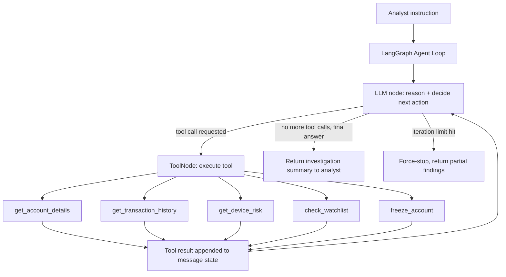

# Pattern 02 — Tool Calling

> **Series:** Tool-Use Patterns (18 total) — Helios Fraud Platform Edition
> **Stack:** Python 3.12, LangChain 1.3.x, LangGraph 1.2.x, Pydantic v2
> **Status:** ✅ Complete

---

## 1. What is Tool Calling?

Tool Calling is the **loop** built on top of Function Calling (Pattern 01). Instead of the model making one structured decision and stopping, the model can:

1. Call a tool.
2. Observe the tool's result.
3. Decide, based on that result, whether to call another tool, call the same tool again with different arguments, or stop and answer.
4. Repeat until it has enough information to give a final answer.

This is often called the **ReAct pattern** (Reason → Act → Observe, repeated). The key difference from Pattern 01:

| Function Calling (Pattern 01) | Tool Calling (Pattern 02) |
|---|---|
| One decision, one call, done | Many decisions across multiple turns |
| Model doesn't see the result of its own call before answering | Model sees each tool's result and reasons about what to do next |
| Good for "turn this sentence into one action" | Good for "investigate this problem, using whatever tools you need, until you can answer" |
| No internal loop / state machine | Requires an explicit loop (graph, while-loop, or agent executor) |

Think of Function Calling as **filling out one form**. Tool Calling is **an investigator who pulls one file, reads it, decides they need another file, pulls that, and so on** until they can write a conclusion.

---

## 2. What Problem Does It Solve?

Real investigative or multi-step tasks can't be solved by extracting one structured call. The next action genuinely **depends on the result of the previous one** — you can't know it up front.

| Problem with single-call Function Calling | How Tool Calling fixes it |
|---|---|
| Can't decide the 2nd step before seeing the 1st step's result | Model observes each tool result before choosing the next action |
| Rigid one-shot instructions can't handle "investigate until you're confident" | The loop continues until the model decides it has enough evidence |
| No way to combine data from multiple systems dynamically | Model can call transaction history, device fingerprinting, and account-status tools in whatever order the situation demands |
| Hard to bound runaway loops | Explicit step/iteration limits in the orchestration layer |

---

## 3. Realistic Production Problem — Helios Fraud Investigation Agent

**Context:** A Helios fraud analyst opens a case for account `ACC-51204` after an automated rule fired ("unusual login location + high-value transfer"). Instead of manually clicking through five different microservice dashboards (account service, transaction service, device-risk service, sanctions-screening service), the analyst asks the **Fraud Investigation Agent**:

> "Investigate ACC-51204 for the transfer that just triggered the alert and tell me if we should freeze the account."

The agent must, **on its own, in however many steps it needs**:

1. Look up account details (`get_account_details`).
2. Pull recent transaction history (`get_transaction_history`).
3. Check the device/session fingerprint risk score for the triggering transaction (`get_device_risk`).
4. Optionally check sanctions/watchlist status (`check_watchlist`) if the transfer is international.
5. Only **after** gathering enough evidence, decide whether to call `freeze_account` (a Pattern-01-style function call it can invoke as its final action) — or conclude no action is needed.

This can't be solved with a single Function Call because **which tools are needed, and in what order, depends on what earlier tools return** (e.g., we only check the watchlist if the transaction turns out to be international).

---

## 4. Architecture / Flow Diagram



**The loop, precisely:**

```
state = [SystemMessage, HumanMessage(instruction)]
while True:
    ai_message = llm_with_tools.invoke(state)
    state.append(ai_message)
    if not ai_message.tool_calls:
        break                      # model is done, has a final answer
    for call in ai_message.tool_calls:
        result = execute(call)
        state.append(ToolMessage(result, tool_call_id=call["id"]))
    if steps >= MAX_STEPS:
        break                      # safety valve
```

LangGraph's `create_agent` (formerly `create_react_agent`) implements exactly this loop for you, with proper state management, streaming, and interruption support — which is why we use it in production instead of hand-rolling the while-loop.

---

## 5. Complete Request → Response Flow

1. **Analyst sends instruction** → `POST /agent/investigate {"account_id": "ACC-51204", "instruction": "..."}`.
2. **Graph invoked** with a `SystemMessage` (investigation policy) + `HumanMessage` (the instruction).
3. **LLM node — turn 1**: model reasons "I need account details first" → emits a tool call `get_account_details(account_id="ACC-51204")`.
4. **ToolNode executes** the real function, appends a `ToolMessage` with the result to the conversation state.
5. **LLM node — turn 2**: model sees account details (e.g., "high-value customer, no prior flags"), decides it needs transaction history → calls `get_transaction_history`.
6. **ToolNode executes**, appends result (e.g., "$45,000 international wire, first of its kind for this account").
7. **LLM node — turn 3**: because the transfer is international, model now decides to call `check_watchlist` AND `get_device_risk` (LangGraph supports **parallel tool calls** in a single turn — both execute, both results come back before turn 4).
8. **LLM node — turn 4**: with device risk = "high" (new device, new country, no 2FA), model decides to call `freeze_account` as a final protective action.
9. **ToolNode executes** the freeze, appends result.
10. **LLM node — turn 5**: model has no more tool calls; it produces a final natural-language investigation summary.
11. **Loop terminates** (no tool calls in latest AI message) and the full trace + summary returns to the analyst UI.
12. **Safety valve**: if the model doesn't converge within `MAX_STEPS` (we use 8), the graph force-stops and returns partial findings rather than looping forever — this bounds cost and latency.

---

## 6. Why Tool Calling Is the Right Pattern Here

- **Sequential dependency** — you truly cannot decide step 3 before seeing the result of step 2 (e.g., whether to check the watchlist depends on whether the transfer is international, which we only learn from transaction history).
- **Variable-length investigation** — some cases resolve in 2 tool calls (clean account, no watchlist hit), others need 5+. A single Function Call can't flex like this; a loop can.
- **Parallel tool calls where independent** — checking the watchlist and checking device risk don't depend on each other, so LangGraph lets the model request both in one turn, cutting latency versus a strictly sequential agent.
- **Bounded and auditable** — unlike an open-ended agent, we cap iterations and log every tool call + result, so it's safe for a regulated environment. This is Tool Calling *with production guardrails*, not an unconstrained autonomous agent (that nuance matters — see Pattern 11 "Tool Selection" and Pattern 14 "Tool Authorization" later in this series for how we further restrict what the model is allowed to do).

---

## 7. Production-Quality Implementation (Python)

### 7.1 Requirements

```bash
pip install "langchain==1.3.15" "langgraph==1.2.10" "langchain-anthropic==0.5.*" \
            "pydantic==2.*" "fastapi==0.115.*" "uvicorn==0.34.*"
```

### 7.2 Full Code

```python
"""
Helios Fraud Investigation Agent — Tool Calling Pattern
=========================================================
Multi-step ReAct-style investigation loop built with LangGraph's create_agent.
The model calls tools, observes results, and decides its own next step until
it reaches a conclusion or hits the iteration safety valve.

Run:
    export ANTHROPIC_API_KEY=sk-...
    uvicorn investigation_agent:app --reload
"""

from __future__ import annotations

import logging
import uuid
from datetime import datetime, timezone
from typing import Literal, Optional

from fastapi import FastAPI, HTTPException
from langchain.agents import create_agent
from langchain_anthropic import ChatAnthropic
from langchain_core.messages import AIMessage, HumanMessage, SystemMessage, ToolMessage
from langchain_core.tools import tool
from pydantic import BaseModel, Field

logger = logging.getLogger("helios.investigation_agent")
logging.basicConfig(level=logging.INFO)


def audit_log(event: str, **fields) -> None:
    logger.info("AUDIT | event=%s | %s", event, fields)


# --------------------------------------------------------------------------
# 1. Simulated Helios backend data (in production these hit real microservices)
# --------------------------------------------------------------------------

_ACCOUNTS_DB = {
    "ACC-51204": {
        "account_id": "ACC-51204",
        "customer_tier": "high-value",
        "prior_fraud_flags": 0,
        "account_age_days": 1460,
    }
}

_TRANSACTIONS_DB = {
    "ACC-51204": [
        {
            "transaction_id": "TXN-90911",
            "amount_usd": 45000,
            "type": "international_wire",
            "destination_country": "PT",
            "is_first_of_type": True,
        },
        {"transaction_id": "TXN-90880", "amount_usd": 120, "type": "domestic_pos",
         "destination_country": "US", "is_first_of_type": False},
    ]
}

_DEVICE_RISK_DB = {
    "TXN-90911": {"device_known": False, "new_country_login": True,
                  "mfa_completed": False, "risk_score": 88},
}

_WATCHLIST_DB = {"PT": "clear", "IR": "sanctioned", "KP": "sanctioned"}


# --------------------------------------------------------------------------
# 2. Tools — each is a self-contained, independently callable capability.
#    Docstrings matter: they become the tool description the model reasons over.
# --------------------------------------------------------------------------

@tool
def get_account_details(account_id: str) -> dict:
    """Fetch core account profile: customer tier, prior fraud flags, account age.
    Use this FIRST when investigating any account."""
    audit_log("tool_call", tool="get_account_details", account_id=account_id)
    data = _ACCOUNTS_DB.get(account_id)
    if not data:
        return {"error": f"No account found for {account_id}"}
    return data


@tool
def get_transaction_history(account_id: str, limit: int = 5) -> dict:
    """Fetch the most recent transactions for an account, most recent first.
    Use this to understand what triggered the alert and whether behavior is
    unusual for this account (e.g. first international wire)."""
    audit_log("tool_call", tool="get_transaction_history",
              account_id=account_id, limit=limit)
    txns = _TRANSACTIONS_DB.get(account_id, [])[:limit]
    return {"account_id": account_id, "transactions": txns}


@tool
def get_device_risk(transaction_id: str) -> dict:
    """Fetch device/session fingerprint risk for a specific transaction:
    whether the device is known, whether MFA was completed, and a 0-100
    risk score. Use this for any transaction that looks unusual."""
    audit_log("tool_call", tool="get_device_risk", transaction_id=transaction_id)
    data = _DEVICE_RISK_DB.get(transaction_id)
    if not data:
        return {"error": f"No device risk data for {transaction_id}"}
    return data


@tool
def check_watchlist(country_code: str) -> dict:
    """Check whether a destination country is on the sanctions/watchlist.
    ONLY call this for international transactions."""
    audit_log("tool_call", tool="check_watchlist", country_code=country_code)
    status = _WATCHLIST_DB.get(country_code, "unknown")
    return {"country_code": country_code, "status": status}


@tool
def freeze_account(account_id: str, reason: str) -> dict:
    """Freeze an account to stop further transactions immediately. This is a
    HIGH-IMPACT, IRREVERSIBLE-WITHOUT-MANUAL-REVIEW action. Only call this
    after gathering sufficient evidence (account details, transaction
    history, and device risk at minimum) that clearly supports fraud."""
    audit_log("tool_call", tool="freeze_account", account_id=account_id, reason=reason)
    return {"account_id": account_id, "status": "FROZEN", "reason": reason}


TOOLS = [get_account_details, get_transaction_history, get_device_risk,
         check_watchlist, freeze_account]


# --------------------------------------------------------------------------
# 3. Build the agent loop with LangGraph's create_agent
#    (this wraps the reason -> act -> observe loop shown in section 4)
# --------------------------------------------------------------------------

SYSTEM_PROMPT = """You are the Helios Fraud Investigation Agent.

Investigate the account thoroughly using the tools available before drawing
a conclusion. Follow this general policy:
1. Always start with get_account_details.
2. Then check get_transaction_history to see what triggered the alert.
3. For any international transaction, call check_watchlist on the
   destination country.
4. For any unusual or high-value transaction, call get_device_risk.
5. Only call freeze_account if you have gathered account details AND
   transaction history AND device risk, and the evidence clearly points to
   fraud (e.g. unknown device + no MFA + high risk score + unusual
   transaction). Do not freeze on weak or partial evidence.
6. When you have enough information, stop calling tools and give a clear,
   concise final summary: what you found, what action you took (if any),
   and your confidence level.

Never call the same tool with the same arguments twice.
"""

MAX_STEPS = 8

_llm = ChatAnthropic(model="claude-sonnet-4-6", temperature=0)

# create_agent wires up the LLM + tools + loop + termination condition for us.
_agent = create_agent(
    model=_llm,
    tools=TOOLS,
    system_prompt=SYSTEM_PROMPT,
)


# --------------------------------------------------------------------------
# 4. Orchestration wrapper: invoke the agent, cap steps, extract a clean trace
# --------------------------------------------------------------------------

class ToolCallTrace(BaseModel):
    tool: str
    args: dict
    result: dict


class InvestigationResponse(BaseModel):
    request_id: str
    account_id: str
    trace: list[ToolCallTrace]
    final_summary: str
    steps_used: int
    hit_step_limit: bool


def run_investigation(account_id: str, instruction: str) -> InvestigationResponse:
    request_id = str(uuid.uuid4())
    audit_log("investigation_started", request_id=request_id, account_id=account_id)

    result = _agent.invoke(
        {"messages": [
            HumanMessage(content=f"Account: {account_id}\nInstruction: {instruction}")
        ]},
        config={"recursion_limit": MAX_STEPS * 2},  # each tool round = 2 graph steps
    )

    messages = result["messages"]

    # Rebuild a clean tool-call trace for the audit log / UI from the message list
    trace: list[ToolCallTrace] = []
    tool_calls_by_id: dict[str, dict] = {}

    for msg in messages:
        if isinstance(msg, AIMessage) and msg.tool_calls:
            for call in msg.tool_calls:
                tool_calls_by_id[call["id"]] = {"tool": call["name"], "args": call["args"]}
        elif isinstance(msg, ToolMessage):
            call_info = tool_calls_by_id.get(msg.tool_call_id, {})
            trace.append(ToolCallTrace(
                tool=call_info.get("tool", "unknown"),
                args=call_info.get("args", {}),
                result=msg.content if isinstance(msg.content, dict) else {"raw": msg.content},
            ))

    final_ai_message = next(
        (m for m in reversed(messages) if isinstance(m, AIMessage) and m.content), None
    )
    final_summary = final_ai_message.content if final_ai_message else "No conclusion reached."

    steps_used = len(trace)
    hit_limit = steps_used >= MAX_STEPS

    audit_log("investigation_completed", request_id=request_id,
              account_id=account_id, steps_used=steps_used,
              hit_step_limit=hit_limit,
              timestamp=datetime.now(timezone.utc).isoformat())

    return InvestigationResponse(
        request_id=request_id,
        account_id=account_id,
        trace=trace,
        final_summary=final_summary,
        steps_used=steps_used,
        hit_step_limit=hit_limit,
    )


# --------------------------------------------------------------------------
# 5. FastAPI surface
# --------------------------------------------------------------------------

app = FastAPI(title="Helios Fraud Investigation Agent — Tool Calling Pattern")


class InvestigateRequest(BaseModel):
    account_id: str = Field(..., pattern=r"^ACC-\d{5}$")
    instruction: str = Field(..., min_length=5, max_length=1000)


@app.post("/agent/investigate", response_model=InvestigationResponse)
def agent_investigate(req: InvestigateRequest) -> InvestigationResponse:
    try:
        return run_investigation(req.account_id, req.instruction)
    except Exception as exc:
        logger.exception("agent_investigate failed")
        raise HTTPException(status_code=500, detail="Investigation failed") from exc
```

### 7.3 Example Trace

```text
POST /agent/investigate
{
  "account_id": "ACC-51204",
  "instruction": "Investigate the alert that just fired and tell me if we should freeze the account."
}
```

Resulting `trace` (abbreviated):

```json
[
  {"tool": "get_account_details", "args": {"account_id": "ACC-51204"},
   "result": {"customer_tier": "high-value", "prior_fraud_flags": 0, "account_age_days": 1460}},
  {"tool": "get_transaction_history", "args": {"account_id": "ACC-51204"},
   "result": {"transactions": [{"transaction_id": "TXN-90911", "amount_usd": 45000,
              "type": "international_wire", "destination_country": "PT", "is_first_of_type": true}]}},
  {"tool": "check_watchlist", "args": {"country_code": "PT"},
   "result": {"status": "clear"}},
  {"tool": "get_device_risk", "args": {"transaction_id": "TXN-90911"},
   "result": {"device_known": false, "new_country_login": true, "mfa_completed": false, "risk_score": 88}},
  {"tool": "freeze_account", "args": {"account_id": "ACC-51204", "reason": "First-ever international wire, $45,000, unknown device, no MFA, risk score 88."},
   "result": {"status": "FROZEN"}}
]
```

`final_summary` (model-generated): *"Investigated ACC-51204: a first-time $45,000 international wire to Portugal (not on watchlist) was made from an unrecognized device with no MFA and a device risk score of 88/100. Given the account's otherwise clean history but the combination of high value + new device + no MFA on a first-of-type transaction, I froze the account pending manual review. Confidence: high."*

### 7.4 Testing the Step-Limit Safety Valve

```python
# tests/test_investigation_agent.py
from investigation_agent import run_investigation

def test_investigation_completes_within_step_limit():
    resp = run_investigation("ACC-51204", "Investigate and decide if we should freeze.")
    assert resp.steps_used <= 8
    assert resp.final_summary  # never empty

def test_unknown_account_does_not_crash_agent():
    resp = run_investigation("ACC-99999", "Investigate this account.")
    assert resp.final_summary  # should explain no account found, not raise
```

---

## Key Takeaways

- Tool Calling = **Function Calling wrapped in a loop**: reason → act → observe → repeat.
- The model decides **how many steps** and **which tools**, based on what it learns along the way — this is what makes it suited to investigation-style tasks that Pattern 01 cannot handle.
- Always set a **hard iteration/step limit** (`recursion_limit` in LangGraph) — an unbounded loop is a cost and latency risk in production.
- Keep **tool docstrings precise** — they are effectively part of the prompt; the model relies on them to decide when a tool is appropriate (e.g., "ONLY call this for international transactions").
- Reconstruct a **clean audit trace** from the raw message list — don't ship the raw LangChain messages to your UI/analysts as-is.

---

**Next up → Pattern 03: API Calling** (wrapping real external/internal REST & RPC APIs as tools, with schema translation, auth, and error normalization).
