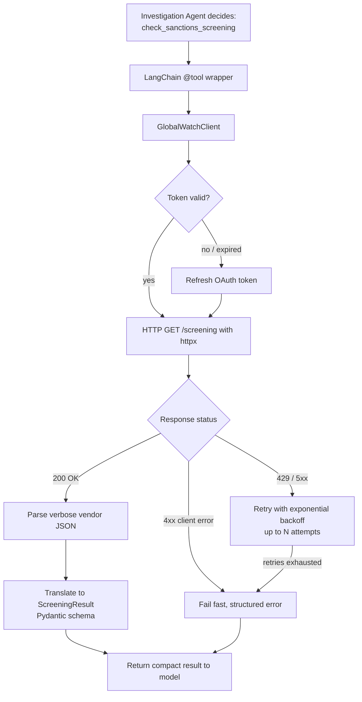

# Pattern 03 — API Calling

> **Series:** Tool-Use Patterns (18 total) — Helios Fraud Platform Edition
> **Stack:** Python 3.12, LangChain 1.3.x, LangGraph 1.2.x, Pydantic v2, httpx
> **Status:** ✅ Complete

---

## 1. What is API Calling?

API Calling is the pattern of wrapping a **real external or internal HTTP/REST (or RPC) API** as a tool the model can call — with all the messy realities of production APIs handled *outside* the model's view: authentication, timeouts, retries, rate limits, pagination, and translating between "the API's actual response shape" and "a clean shape the model can reason about."

In Patterns 01 and 02, our "tools" were simple in-memory Python functions (`get_account_details`, `freeze_account`) backed by fake dictionaries. In the real world, those functions are thin wrappers around **network calls to other services** — Helios's Account Service, Transaction Service, and a third-party sanctions-screening vendor, each with its own auth scheme, latency profile, and failure modes.

**Function/Tool Calling** answers *"what should be called and with what arguments?"*
**API Calling** answers *"given that decision, how do we safely and reliably talk to the real network service that performs it?"*

This is a distinct pattern because a naive tool wrapper (`requests.get(url)` inside a `@tool` function) breaks down fast in production:

| Naive approach | What breaks |
|---|---|
| Call `requests.get()` directly inside the tool function | No timeout → one slow API call can hang the whole agent turn |
| Return raw API JSON straight to the model | Model gets flooded with irrelevant fields, sees inconsistent shapes across services, wastes tokens |
| No retry logic | A single transient 503 kills the whole investigation |
| Secrets/keys hardcoded or passed around loosely | Security/compliance failure in a banking context |
| Errors bubble up as raw stack traces | Model can't reason about "an error" the same way it reasons about tool descriptions |

---

## 2. What Problem Does It Solve?

API Calling formalizes the **boundary layer** between "an LLM tool" and "a real network service," so that:

1. **Auth is centralized** — API keys/tokens are injected by the client layer, never exposed to or handled by the model.
2. **Failures are normalized** — a timeout, a 500, and a malformed response all become a consistent, model-readable error shape instead of an unhandled exception.
3. **Responses are translated** — the API's actual response schema (which you don't control, especially for third-party vendors) is mapped into a clean, minimal Pydantic model tailored to what the model actually needs.
4. **Reliability is engineered in** — timeouts, retries with backoff, and circuit-breaking (we build a lightweight version here; full external-call resilience patterns like Retry/Timeout/Fallback get their own dedicated deep-dive in Patterns 15–17 later in this series) are applied at the API-client layer, not left to chance.
5. **Latency and cost are controlled** — the model never accidentally re-requests a huge, un-pageable payload that blows the context window.

---

## 3. Realistic Production Problem — Helios Sanctions Screening Integration

**Context:** Helios's fraud investigation agent (from Pattern 02) currently checks a hardcoded in-memory watchlist. In production, Helios integrates with a real **third-party sanctions-screening API** ("GlobalWatch API") to check whether a transaction counterparty or destination country is sanctioned. This is a genuine external HTTP API with:

- **Bearer token authentication** that must be refreshed periodically.
- **Rate limits** (429 responses under load).
- **Occasional 5xx errors** and slow responses (P99 latency ~2.5s).
- **A verbose response schema** (dozens of fields: match confidence, list source, aliases, government reference IDs...) — the model only needs a handful of them.

**The ask:** Wrap GlobalWatch as a production-grade tool (`check_sanctions_screening`) that:
- Authenticates correctly and refreshes tokens transparently.
- Has a strict timeout so a slow vendor never stalls the whole fraud investigation.
- Retries transient failures (429/5xx) with exponential backoff, but fails fast and clearly on genuine errors (404, bad request).
- Translates GlobalWatch's verbose JSON into a compact, model-friendly Pydantic schema.
- Never leaks the API key or raw vendor payload into the model's context.

---

## 4. Architecture / Flow Diagram



**Layering:**

```
LLM (Pattern 02 agent)
   ↓ decides to call
@tool check_sanctions_screening(...)          <- thin, LangChain-facing wrapper
   ↓ delegates to
GlobalWatchClient                             <- owns auth, retries, timeouts, translation
   ↓ makes real network call via
httpx.AsyncClient                             <- transport layer
   ↓ hits
GlobalWatch REST API (external vendor)
```

---

## 5. Complete Request → Response Flow

1. **Agent decides** (as in Pattern 02) that a counterparty needs sanctions screening and emits a tool call `check_sanctions_screening(name="Aleksei Petrov", country="RU")`.
2. **Tool wrapper** receives the call, delegates to `GlobalWatchClient.screen(...)` — the tool function itself contains **zero HTTP logic**, only orchestration.
3. **Auth check** — the client checks if its cached OAuth bearer token is still valid (expiry buffer of 60s); if not, it calls the token endpoint first.
4. **HTTP call** — `httpx.AsyncClient` issues the GET/POST with a strict `timeout=3.0` (well below our agent's overall step budget).
5. **Transient failure handling** — if the response is `429` or `5xx`, the client retries up to 3 times with exponential backoff (`0.5s, 1s, 2s`) plus jitter, respecting a `Retry-After` header if present.
6. **Terminal failure handling** — a `4xx` (other than 429) is **not** retried; it's translated immediately into a structured error (e.g., "invalid request — missing required field") so the model can adjust its next call rather than loop uselessly.
7. **Response translation** — a successful vendor payload (which might have 40+ fields) is parsed and mapped into our own compact `ScreeningResult` Pydantic model — only `is_match`, `confidence`, `list_source`, and `matched_name` survive; everything else is dropped before it reaches the model's context window.
8. **Tool returns** the compact, typed result (or a structured error object) back to the LLM, which continues its investigation loop from Pattern 02.
9. **Observability** — every outbound API call is wrapped in an OpenTelemetry span (`globalwatch.screen`) recording latency, retry count, and outcome — critical for diagnosing "why did the investigation take 8 seconds" in production.

---

## 6. Why API Calling Is the Right Pattern Here

- **Separation of concerns** — the LLM should reason about "do I need to check sanctions," not about OAuth token refresh or HTTP retry semantics. Putting that logic in a dedicated client keeps the tool function simple and the model's job simple.
- **Reliability under real-world network conditions** — vendor APIs *will* have transient failures; without engineered retries/timeouts, a single flaky call can derail an entire multi-step agent investigation (Pattern 02) that otherwise cost several LLM turns to build up.
- **Context-window and cost discipline** — sending a bloated 40-field vendor payload to the model on every call wastes tokens and can actively confuse reasoning (irrelevant fields look like signal). Translating to a minimal schema is both a cost and a quality optimization.
- **Security boundary** — the API key/token must never be something the model can see, request, or leak in a response. Keeping HTTP/auth entirely inside the client (never in the tool's arguments or return value) enforces this by construction.

---

## 7. Production-Quality Implementation (Python)

### 7.1 Requirements

```bash
pip install "langchain==1.3.15" "langgraph==1.2.10" "langchain-anthropic==0.5.*" \
            "pydantic==2.*" "httpx==0.28.*" "tenacity==9.*" "fastapi==0.115.*" "uvicorn==0.34.*"
```

### 7.2 Full Code

```python
"""
Helios Sanctions Screening Integration — API Calling Pattern
================================================================
Production-grade wrapper around a third-party "GlobalWatch" sanctions
screening REST API: OAuth token management, timeouts, retry with backoff,
and translation to a compact model-friendly schema.

Run:
    export ANTHROPIC_API_KEY=sk-...
    export GLOBALWATCH_CLIENT_ID=...
    export GLOBALWATCH_CLIENT_SECRET=...
    uvicorn sanctions_screening:app --reload
"""

from __future__ import annotations

import logging
import os
import time
from typing import Optional

import httpx
from langchain_core.tools import tool
from pydantic import BaseModel, Field
from tenacity import (
    retry,
    retry_if_exception,
    stop_after_attempt,
    wait_exponential_jitter,
)

logger = logging.getLogger("helios.sanctions_screening")
logging.basicConfig(level=logging.INFO)


def audit_log(event: str, **fields) -> None:
    logger.info("AUDIT | event=%s | %s", event, fields)


# --------------------------------------------------------------------------
# 1. Compact, model-facing response schema
#    (the vendor's real payload has 40+ fields; the model only needs these)
# --------------------------------------------------------------------------

class ScreeningResult(BaseModel):
    is_match: bool
    confidence: float = Field(..., ge=0.0, le=1.0)
    list_source: Optional[str] = None
    matched_name: Optional[str] = None


class ScreeningError(BaseModel):
    error: str
    retryable: bool
    detail: Optional[str] = None


# --------------------------------------------------------------------------
# 2. Retryability classifier — decides which HTTP failures deserve a retry
# --------------------------------------------------------------------------

class TransientAPIError(Exception):
    """Raised for 429 / 5xx responses — safe to retry."""
    def __init__(self, status_code: int, retry_after: Optional[float] = None):
        self.status_code = status_code
        self.retry_after = retry_after
        super().__init__(f"Transient GlobalWatch error: HTTP {status_code}")


class PermanentAPIError(Exception):
    """Raised for 4xx (other than 429) — do NOT retry, surface immediately."""
    def __init__(self, status_code: int, detail: str):
        self.status_code = status_code
        self.detail = detail
        super().__init__(f"Permanent GlobalWatch error: HTTP {status_code} - {detail}")


def _is_transient(exc: BaseException) -> bool:
    return isinstance(exc, (TransientAPIError, httpx.TimeoutException, httpx.ConnectError))


# --------------------------------------------------------------------------
# 3. OAuth-aware, retrying, timeout-bounded API client
# --------------------------------------------------------------------------

class GlobalWatchClient:
    """Owns everything about talking to the GlobalWatch vendor API:
    auth, timeouts, retries, and translation to our internal schema.
    The LLM/tool layer never sees any of this."""

    TOKEN_URL = "https://auth.globalwatch.example.com/oauth/token"
    SCREEN_URL = "https://api.globalwatch.example.com/v2/screening"
    REQUEST_TIMEOUT_SECONDS = 3.0
    TOKEN_EXPIRY_BUFFER_SECONDS = 60

    def __init__(self, client_id: str, client_secret: str):
        self._client_id = client_id
        self._client_secret = client_secret
        self._access_token: Optional[str] = None
        self._token_expires_at: float = 0.0
        self._http = httpx.AsyncClient(timeout=self.REQUEST_TIMEOUT_SECONDS)

    async def _ensure_token(self) -> str:
        now = time.monotonic()
        if self._access_token and now < self._token_expires_at - self.TOKEN_EXPIRY_BUFFER_SECONDS:
            return self._access_token

        audit_log("globalwatch_token_refresh")
        resp = await self._http.post(
            self.TOKEN_URL,
            data={
                "grant_type": "client_credentials",
                "client_id": self._client_id,
                "client_secret": self._client_secret,
            },
        )
        resp.raise_for_status()
        payload = resp.json()
        self._access_token = payload["access_token"]
        self._token_expires_at = now + payload.get("expires_in", 900)
        return self._access_token

    @retry(
        retry=retry_if_exception(_is_transient),
        stop=stop_after_attempt(3),
        wait=wait_exponential_jitter(initial=0.5, max=4.0),
        reraise=True,
    )
    async def _call_screening_endpoint(self, token: str, name: str, country: str) -> dict:
        response = await self._http.get(
            self.SCREEN_URL,
            headers={"Authorization": f"Bearer {token}"},
            params={"full_name": name, "country_code": country},
        )

        if response.status_code == 429:
            retry_after = float(response.headers.get("Retry-After", 1.0))
            raise TransientAPIError(429, retry_after=retry_after)
        if 500 <= response.status_code < 600:
            raise TransientAPIError(response.status_code)
        if 400 <= response.status_code < 500:
            raise PermanentAPIError(response.status_code, response.text[:200])

        response.raise_for_status()
        return response.json()

    async def screen(self, name: str, country: str) -> ScreeningResult | ScreeningError:
        start = time.monotonic()
        try:
            token = await self._ensure_token()
            raw = await self._call_screening_endpoint(token, name, country)
            result = self._translate(raw)
            audit_log("globalwatch_screen_success", name=name, country=country,
                      is_match=result.is_match, latency_ms=round((time.monotonic() - start) * 1000))
            return result

        except PermanentAPIError as exc:
            audit_log("globalwatch_screen_permanent_error", name=name,
                      status=exc.status_code, detail=exc.detail)
            return ScreeningError(error="invalid_request", retryable=False, detail=exc.detail)

        except (TransientAPIError, httpx.TimeoutException, httpx.ConnectError) as exc:
            audit_log("globalwatch_screen_exhausted_retries", name=name, error=str(exc))
            return ScreeningError(
                error="service_unavailable", retryable=True,
                detail="GlobalWatch did not respond after retries; try again shortly.",
            )

        except Exception as exc:  # unexpected shape / parsing error
            logger.exception("Unexpected GlobalWatch client error")
            return ScreeningError(error="internal_client_error", retryable=False, detail=str(exc))

    @staticmethod
    def _translate(raw: dict) -> ScreeningResult:
        """Map GlobalWatch's verbose real-world payload down to what the
        model actually needs. This is the single place that absorbs vendor
        schema changes so the rest of the system doesn't have to."""
        matches = raw.get("matches", [])
        if not matches:
            return ScreeningResult(is_match=False, confidence=0.0)

        best = max(matches, key=lambda m: m.get("confidence_score", 0))
        return ScreeningResult(
            is_match=True,
            confidence=round(best.get("confidence_score", 0) / 100, 2),
            list_source=best.get("list_name"),
            matched_name=best.get("matched_full_name"),
        )

    async def aclose(self) -> None:
        await self._http.aclose()


# --------------------------------------------------------------------------
# 4. Thin LangChain tool wrapper — NO http/auth logic here, just orchestration
# --------------------------------------------------------------------------

_client = GlobalWatchClient(
    client_id=os.environ.get("GLOBALWATCH_CLIENT_ID", "test-client-id"),
    client_secret=os.environ.get("GLOBALWATCH_CLIENT_SECRET", "test-secret"),
)


@tool
async def check_sanctions_screening(full_name: str, country_code: str) -> dict:
    """Screen a person's name and country against global sanctions/watchlists
    via the GlobalWatch vendor API. Use this for international transaction
    counterparties. Returns is_match, confidence (0-1), and list_source if
    matched. If the service is temporarily unavailable, the result will say
    so — you may retry once by calling this tool again, but do not loop
    more than twice on the same query."""
    result = await _client.screen(full_name, country_code)
    return result.model_dump()


# --------------------------------------------------------------------------
# 5. FastAPI surface — direct screening endpoint (also usable outside the agent)
# --------------------------------------------------------------------------

from fastapi import FastAPI, HTTPException  # noqa: E402


app = FastAPI(title="Helios Sanctions Screening — API Calling Pattern")


class ScreenRequest(BaseModel):
    full_name: str = Field(..., min_length=2, max_length=200)
    country_code: str = Field(..., min_length=2, max_length=2)


@app.post("/screening/check")
async def screening_check(req: ScreenRequest):
    result = await _client.screen(req.full_name, req.country_code)
    if isinstance(result, ScreeningError) and not result.retryable:
        raise HTTPException(status_code=422, detail=result.model_dump())
    return result.model_dump()


@app.on_event("shutdown")
async def shutdown_event():
    await _client.aclose()
```

### 7.3 Example: Transient Failure → Retry → Success

```text
[19:02:11] AUDIT | event=globalwatch_token_refresh
[19:02:11] AUDIT | event=globalwatch_screen_success name=Aleksei Petrov ... (attempt 1: 503)
```

Internally: attempt 1 gets a `503`, tenacity waits ~0.5s (+ jitter), attempt 2 succeeds — all transparent to the calling agent, which simply sees a normal `ScreeningResult` come back a little slower than usual.

### 7.4 Example: Permanent Failure — Fails Fast, No Wasted Retries

```json
POST /screening/check
{"full_name": "", "country_code": "ZZ"}
```

```json
// HTTP 422
{
  "detail": {
    "error": "invalid_request",
    "retryable": false,
    "detail": "400 Bad Request: full_name must not be empty"
  }
}
```

No retries were attempted — this is a client-side mistake, not a transient network issue, so retrying would only waste latency and API quota.

### 7.5 Testing Retry & Failure Classification

```python
# tests/test_sanctions_screening.py
import httpx
import pytest
from sanctions_screening import GlobalWatchClient, ScreeningError, TransientAPIError


@pytest.mark.asyncio
async def test_permanent_error_is_not_retried(monkeypatch):
    client = GlobalWatchClient("id", "secret")
    call_count = {"n": 0}

    async def fake_call(*args, **kwargs):
        call_count["n"] += 1
        raise __import__("sanctions_screening").PermanentAPIError(400, "bad request")

    monkeypatch.setattr(client, "_ensure_token", lambda: "fake-token")
    monkeypatch.setattr(client, "_call_screening_endpoint", fake_call)

    result = await client.screen("John Doe", "US")
    assert isinstance(result, ScreeningError)
    assert result.retryable is False
    assert call_count["n"] == 1  # no retry attempted


@pytest.mark.asyncio
async def test_transient_error_is_retried_then_fails_gracefully(monkeypatch):
    client = GlobalWatchClient("id", "secret")

    async def always_transient(*args, **kwargs):
        raise TransientAPIError(503)

    monkeypatch.setattr(client, "_ensure_token", lambda: "fake-token")
    monkeypatch.setattr(client, "_call_screening_endpoint", always_transient)

    result = await client.screen("Jane Doe", "US")
    assert isinstance(result, ScreeningError)
    assert result.retryable is True
```

---

## Key Takeaways

- API Calling is the **network boundary layer** beneath a tool — it must never leak auth, retries, or vendor-specific payload shape into the model's context.
- **Classify failures**: transient (retry with backoff) vs. permanent (fail fast, don't waste calls). Treating every failure the same is a common production bug.
- **Translate, don't forward** — always map a real API's response into a compact schema built for what the model needs, not what the vendor happened to return.
- Bound every outbound call with a **strict timeout** well below your agent's overall step budget, so one slow dependency can't stall an entire multi-step investigation.
- This pattern is the foundation that Patterns 15 (Tool Retry), 16 (Tool Timeout), and 17 (Tool Fallback) will generalize into reusable, cross-cutting resilience primitives later in the series.

---

**Next up → Pattern 04: Database Tool** (giving the agent safe, scoped, injection-proof access to query Helios's PostgreSQL case-management database).
