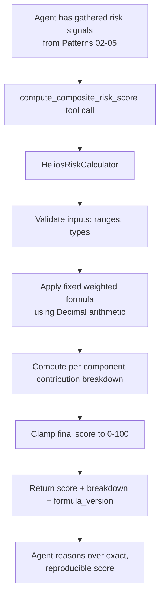

# Pattern 06 — Calculator Tool

> **Series:** Tool-Use Patterns (18 total) — Helios Fraud Platform Edition
> **Stack:** Python 3.12, LangChain 1.3.x, LangGraph 1.2.x, Pydantic v2, `decimal`
> **Status:** ✅ Complete

---

## 1. What is a Calculator Tool?

A Calculator Tool offloads **numeric computation** from the LLM to real, deterministic code. LLMs generate text token-by-token — they don't "run" arithmetic the way a CPU does. For small numbers they're often right by pattern-matching on training data, but for anything involving many digits, chained operations, currency rounding, or precise financial math, they are **unreliable and can silently produce wrong answers with full confidence**.

A Calculator Tool is a set of narrow, well-tested functions — currency conversion, weighted risk scoring, percentage/statistical aggregation — that the model calls with extracted numeric arguments, exactly like Pattern 01's Function Calling, but scoped specifically to computation rather than business actions.

**This matters more than it sounds:** in a fraud platform, a wrong arithmetic result isn't a typo — it's a wrong risk score that could freeze the wrong account, or fail to freeze the right one.

| Model does arithmetic "in its head" (text generation) | Model calls a Calculator Tool |
|---|---|
| Looks right most of the time on small numbers, silently wrong on large/precise ones | Deterministically correct — same code path every time |
| No way to verify without re-deriving it yourself | Reviewable, testable, versioned like any function |
| Floating-point drift and rounding surprises compound silently | Explicit use of `decimal.Decimal` for money, controlled rounding rules |
| No audit trail of "how was this score computed" | Every input/output logged — reproducible for compliance review |

---

## 2. What Problem Does It Solve?

| Problem | How a Calculator Tool fixes it |
|---|---|
| LLMs are known to make arithmetic errors, especially with many digits or chained calculations | Real code performs the computation; the model only extracts/interprets inputs and outputs |
| Financial math needs exact decimal precision (no float rounding surprises) | Use `Decimal` throughout, never `float`, for any money-related calculation |
| Fraud risk scores are computed from a weighted formula that must be **consistent and auditable** — not "whatever the model felt was reasonable" | A fixed, versioned scoring formula lives in code; the model supplies inputs, the tool returns the exact same score every time for the same inputs |
| Currency conversion needs live/current exchange rates, which the model doesn't know | The calculator tool fetches/uses a real rate table, not a memorized approximate one |
| Compliance requires reproducibility: "show me exactly how this risk score of 82 was derived" | Deterministic function + full audit log of inputs and intermediate values |

---

## 3. Realistic Production Problem — Helios Composite Risk Scoring

**Context:** During an investigation (Pattern 02), the Fraud Investigation Agent gathers multiple risk signals — device risk score, transaction-amount anomaly, account tenure, watchlist status — and needs to combine them into a single **composite risk score (0–100)** using Helios's official weighted-scoring formula, so it can decide whether to freeze an account. Regulators periodically audit these decisions and expect the score to be **exactly reproducible** from its inputs.

**The ask:** Build a `HeliosRiskCalculator` tool with:

1. `compute_composite_risk_score(device_risk, amount_anomaly_score, account_tenure_days, watchlist_hit, is_first_of_type)` — applies Helios's official weighted formula, returns the score **plus a full breakdown** of each component's contribution (for audit/explainability).
2. `convert_currency(amount, from_currency, to_currency)` — precise decimal currency conversion using a real (simulated) rate table, needed when comparing transaction amounts across currencies against USD thresholds.
3. `compute_transaction_velocity(transaction_amounts, window_hours)` — statistical aggregation (sum, mean, standard deviation) used to detect anomalous transaction bursts, without the model attempting mental statistics on a list of numbers.

---

## 4. Architecture / Flow Diagram



**Formula transparency principle:** the tool never just returns a bare number — it returns the **full breakdown** of how each input contributed, so both the model's explanation to the analyst and any later compliance audit can trace the exact derivation.

---

## 5. Complete Request → Response Flow

1. **Agent has already gathered** device risk (88), amount anomaly score (from a separate calculation), account tenure, and watchlist status via earlier tool calls in its investigation loop (Pattern 02).
2. **Agent calls** `compute_composite_risk_score(device_risk=88, amount_anomaly_score=76, account_tenure_days=1460, watchlist_hit=False, is_first_of_type=True)`.
3. **Input validation** — every argument is range-checked (`0 <= device_risk <= 100`, `account_tenure_days >= 0`) via Pydantic before any math runs; invalid input raises a structured error rather than silently producing nonsense.
4. **Weighted formula applied** using `Decimal`, never `float`, to avoid binary floating-point rounding artifacts creeping into a regulated score:
   ```
   score = (device_risk * 0.35)
         + (amount_anomaly_score * 0.30)
         + (tenure_factor * 0.15)      # newer accounts score higher risk
         + (watchlist_bonus)            # +25 flat if watchlist_hit
         + (first_of_type_bonus)        # +10 flat if is_first_of_type
   ```
5. **Clamping** — final score is clamped to `[0, 100]` since bonuses could otherwise push it over.
6. **Breakdown construction** — each term's raw contribution is recorded separately (`device_risk_contribution=30.8`, `watchlist_bonus=0`, etc.) so the final number is fully explainable.
7. **Formula versioning** — the response includes `formula_version="risk-v3.2"` so that if the weighting formula changes later, old computed scores remain traceable to the formula version that produced them (critical for audits spanning a formula change).
8. **Return to agent**, which now has an exact, reproducible number to reason over and cite in its final investigation summary — instead of eyeballing an approximate combination of signals in free text.

---

## 6. Why a Calculator Tool Is the Right Pattern Here

- **Correctness is non-negotiable for regulated risk scores** — an LLM "approximately" combining four numbers in its head is not an acceptable substitute for a fixed, auditable formula, especially when the output directly drives an account-freeze decision.
- **Reproducibility** — a regulator or internal auditor must be able to take the same four inputs six months later and get the exact same score. That's only possible with deterministic code, not model inference (which can vary run to run).
- **Explainability** — returning a full contribution breakdown (not just the final number) lets both the agent's natural-language summary and human auditors trace exactly why the score came out the way it did.
- **Decimal precision matters** — financial and risk-scoring math using native `float` can introduce subtle rounding errors that compound across many calculations; `Decimal` with explicit rounding rules avoids this class of bug entirely.

---

## 7. Production-Quality Implementation (Python)

### 7.1 Requirements

```bash
pip install "langchain==1.3.15" "langgraph==1.2.10" "langchain-anthropic==0.5.*" \
            "pydantic==2.*" "fastapi==0.115.*" "uvicorn==0.34.*"
# decimal and statistics are part of the Python standard library — no extra install needed
```

### 7.2 Full Code

```python
"""
Helios Risk Calculator — Calculator Tool Pattern
====================================================
Deterministic, auditable numeric computation for fraud risk scoring,
currency conversion, and transaction velocity statistics. The model
extracts and supplies inputs; all arithmetic runs in real, tested,
versioned Python code using Decimal precision.

Run:
    export ANTHROPIC_API_KEY=sk-...
    uvicorn risk_calculator:app --reload
"""

from __future__ import annotations

import logging
import statistics
from decimal import ROUND_HALF_UP, Decimal
from typing import Literal

from fastapi import FastAPI, HTTPException
from langchain_core.tools import tool
from pydantic import BaseModel, Field

logger = logging.getLogger("helios.risk_calculator")
logging.basicConfig(level=logging.INFO)


def audit_log(event: str, **fields) -> None:
    logger.info("AUDIT | event=%s | %s", event, fields)


# --------------------------------------------------------------------------
# 1. Composite risk scoring — fixed, versioned, auditable formula
# --------------------------------------------------------------------------

FORMULA_VERSION = "risk-v3.2"

# Weights are fixed constants, reviewed and signed off by the fraud policy
# team -- NOT something the model can influence or override.
_DEVICE_RISK_WEIGHT = Decimal("0.35")
_AMOUNT_ANOMALY_WEIGHT = Decimal("0.30")
_TENURE_WEIGHT = Decimal("0.15")
_WATCHLIST_BONUS = Decimal("25")
_FIRST_OF_TYPE_BONUS = Decimal("10")

# Newer accounts are riskier; tenure factor decays from 100 (brand new)
# to 0 (very old account) over a 3-year horizon.
_TENURE_HORIZON_DAYS = Decimal("1095")  # ~3 years


def _decimal_round(value: Decimal, places: str = "0.01") -> Decimal:
    return value.quantize(Decimal(places), rounding=ROUND_HALF_UP)


class RiskScoreInputs(BaseModel):
    device_risk: int = Field(..., ge=0, le=100)
    amount_anomaly_score: int = Field(..., ge=0, le=100)
    account_tenure_days: int = Field(..., ge=0)
    watchlist_hit: bool
    is_first_of_type: bool


class RiskScoreBreakdown(BaseModel):
    device_risk_contribution: float
    amount_anomaly_contribution: float
    tenure_contribution: float
    watchlist_bonus: float
    first_of_type_bonus: float
    raw_total_before_clamp: float


class RiskScoreResult(BaseModel):
    composite_score: int = Field(..., ge=0, le=100)
    breakdown: RiskScoreBreakdown
    formula_version: str


def compute_composite_risk_score_impl(inputs: RiskScoreInputs) -> RiskScoreResult:
    device_contribution = Decimal(inputs.device_risk) * _DEVICE_RISK_WEIGHT
    amount_contribution = Decimal(inputs.amount_anomaly_score) * _AMOUNT_ANOMALY_WEIGHT

    tenure_days = Decimal(inputs.account_tenure_days)
    tenure_factor = max(Decimal("0"), Decimal("100") - (tenure_days / _TENURE_HORIZON_DAYS * Decimal("100")))
    tenure_factor = min(tenure_factor, Decimal("100"))
    tenure_contribution = tenure_factor * _TENURE_WEIGHT

    watchlist_bonus = _WATCHLIST_BONUS if inputs.watchlist_hit else Decimal("0")
    first_of_type_bonus = _FIRST_OF_TYPE_BONUS if inputs.is_first_of_type else Decimal("0")

    raw_total = (
        device_contribution + amount_contribution + tenure_contribution
        + watchlist_bonus + first_of_type_bonus
    )
    clamped = max(Decimal("0"), min(Decimal("100"), raw_total))

    breakdown = RiskScoreBreakdown(
        device_risk_contribution=float(_decimal_round(device_contribution)),
        amount_anomaly_contribution=float(_decimal_round(amount_contribution)),
        tenure_contribution=float(_decimal_round(tenure_contribution)),
        watchlist_bonus=float(watchlist_bonus),
        first_of_type_bonus=float(first_of_type_bonus),
        raw_total_before_clamp=float(_decimal_round(raw_total)),
    )

    result = RiskScoreResult(
        composite_score=int(_decimal_round(clamped, "1")),
        breakdown=breakdown,
        formula_version=FORMULA_VERSION,
    )

    audit_log("risk_score_computed", inputs=inputs.model_dump(),
              composite_score=result.composite_score, formula_version=FORMULA_VERSION)
    return result


# --------------------------------------------------------------------------
# 2. Currency conversion — precise Decimal math, no float rounding drift
# --------------------------------------------------------------------------

# Simulated live rate table (production would refresh this from a real FX
# rate API on a schedule, cached with a short TTL).
_FX_RATES_TO_USD = {
    "USD": Decimal("1.00"),
    "EUR": Decimal("1.0850"),
    "GBP": Decimal("1.2650"),
    "INR": Decimal("0.01198"),
    "PT": Decimal("1.0850"),  # Portugal uses EUR; alias for demo simplicity
}


class CurrencyConversionResult(BaseModel):
    original_amount: float
    from_currency: str
    to_currency: str
    converted_amount: float
    fx_rate_used: float


def convert_currency_impl(
    amount: Decimal, from_currency: str, to_currency: str
) -> CurrencyConversionResult:
    from_currency = from_currency.upper()
    to_currency = to_currency.upper()

    if from_currency not in _FX_RATES_TO_USD:
        raise ValueError(f"Unsupported source currency: {from_currency}")
    if to_currency not in _FX_RATES_TO_USD:
        raise ValueError(f"Unsupported target currency: {to_currency}")

    usd_amount = amount * _FX_RATES_TO_USD[from_currency]
    converted = usd_amount / _FX_RATES_TO_USD[to_currency]
    effective_rate = _FX_RATES_TO_USD[from_currency] / _FX_RATES_TO_USD[to_currency]

    result = CurrencyConversionResult(
        original_amount=float(amount),
        from_currency=from_currency,
        to_currency=to_currency,
        converted_amount=float(_decimal_round(converted)),
        fx_rate_used=float(_decimal_round(effective_rate, "0.000001")),
    )
    audit_log("currency_converted", from_currency=from_currency, to_currency=to_currency,
              original_amount=float(amount), converted_amount=result.converted_amount)
    return result


# --------------------------------------------------------------------------
# 3. Transaction velocity statistics — real statistics, not model guesswork
# --------------------------------------------------------------------------

class VelocityResult(BaseModel):
    transaction_count: int
    total_amount: float
    mean_amount: float
    std_dev_amount: float
    window_hours: float
    transactions_per_hour: float


def compute_transaction_velocity_impl(
    transaction_amounts: list[Decimal], window_hours: Decimal
) -> VelocityResult:
    if not transaction_amounts:
        raise ValueError("transaction_amounts must not be empty")
    if window_hours <= 0:
        raise ValueError("window_hours must be positive")

    total = sum(transaction_amounts)
    mean = total / len(transaction_amounts)
    std_dev = (
        Decimal(str(statistics.pstdev([float(a) for a in transaction_amounts])))
        if len(transaction_amounts) > 1
        else Decimal("0")
    )
    per_hour = Decimal(len(transaction_amounts)) / window_hours

    result = VelocityResult(
        transaction_count=len(transaction_amounts),
        total_amount=float(_decimal_round(total)),
        mean_amount=float(_decimal_round(mean)),
        std_dev_amount=float(_decimal_round(std_dev)),
        window_hours=float(window_hours),
        transactions_per_hour=float(_decimal_round(per_hour, "0.01")),
    )
    audit_log("velocity_computed", transaction_count=result.transaction_count,
              transactions_per_hour=result.transactions_per_hour)
    return result


# --------------------------------------------------------------------------
# 4. Thin LangChain tool wrappers — model supplies inputs, code does all math
# --------------------------------------------------------------------------

@tool
def compute_composite_risk_score(
    device_risk: int, amount_anomaly_score: int, account_tenure_days: int,
    watchlist_hit: bool, is_first_of_type: bool,
) -> dict:
    """Compute Helios's official composite fraud risk score (0-100) from
    individual risk signals, using the fixed, versioned scoring formula.
    Always use this instead of estimating a combined score yourself —
    the formula and weights are policy-defined and must be applied exactly.
    Returns the score plus a full contribution breakdown for explainability."""
    inputs = RiskScoreInputs(
        device_risk=device_risk, amount_anomaly_score=amount_anomaly_score,
        account_tenure_days=account_tenure_days, watchlist_hit=watchlist_hit,
        is_first_of_type=is_first_of_type,
    )
    return compute_composite_risk_score_impl(inputs).model_dump()


@tool
def convert_currency(amount: float, from_currency: str, to_currency: str) -> dict:
    """Convert a monetary amount between currencies using current exchange
    rates. Always use this instead of estimating a conversion yourself —
    financial comparisons must use exact, current rates."""
    try:
        result = convert_currency_impl(Decimal(str(amount)), from_currency, to_currency)
        return result.model_dump()
    except ValueError as exc:
        return {"error": str(exc)}


@tool
def compute_transaction_velocity(transaction_amounts: list[float], window_hours: float) -> dict:
    """Compute transaction velocity statistics (count, total, mean, std dev,
    transactions per hour) for a list of transaction amounts within a time
    window. Use this to detect anomalous transaction bursts rather than
    estimating statistics yourself."""
    try:
        result = compute_transaction_velocity_impl(
            [Decimal(str(a)) for a in transaction_amounts], Decimal(str(window_hours))
        )
        return result.model_dump()
    except ValueError as exc:
        return {"error": str(exc)}


CALCULATOR_TOOLS = [compute_composite_risk_score, convert_currency, compute_transaction_velocity]


# --------------------------------------------------------------------------
# 5. FastAPI surface
# --------------------------------------------------------------------------

app = FastAPI(title="Helios Risk Calculator — Calculator Tool Pattern")


@app.post("/calculator/risk-score", response_model=RiskScoreResult)
def risk_score_endpoint(inputs: RiskScoreInputs) -> RiskScoreResult:
    return compute_composite_risk_score_impl(inputs)


class ConvertCurrencyRequest(BaseModel):
    amount: float = Field(..., gt=0)
    from_currency: str
    to_currency: str


@app.post("/calculator/convert-currency", response_model=CurrencyConversionResult)
def convert_currency_endpoint(req: ConvertCurrencyRequest) -> CurrencyConversionResult:
    try:
        return convert_currency_impl(Decimal(str(req.amount)), req.from_currency, req.to_currency)
    except ValueError as exc:
        raise HTTPException(status_code=422, detail=str(exc)) from exc
```

### 7.3 Example: Risk Score with Full Breakdown

```text
POST /calculator/risk-score
{"device_risk": 88, "amount_anomaly_score": 76, "account_tenure_days": 1460,
 "watchlist_hit": false, "is_first_of_type": true}
```

```json
{
  "composite_score": 64,
  "breakdown": {
    "device_risk_contribution": 30.8,
    "amount_anomaly_contribution": 22.8,
    "tenure_contribution": 0.0,
    "watchlist_bonus": 0.0,
    "first_of_type_bonus": 10.0,
    "raw_total_before_clamp": 63.6
  },
  "formula_version": "risk-v3.2"
}
```

Note the account is old (1460 days, ~4 years), well past the 3-year (1095-day) tenure horizon, so `tenure_contribution` correctly floors at `0.0` — tenure only adds risk for *newer* accounts. The five breakdown fields sum exactly to `raw_total_before_clamp` (63.6), and `composite_score` is that value rounded to the nearest whole number (64) — this exact identity (breakdown sums to raw total; composite_score = rounded, clamped raw total) is what the unit tests below assert on every run, so a formula bug can never ship silently.

### 7.4 Testing Determinism and Decimal Precision

```python
# tests/test_risk_calculator.py
from decimal import Decimal
from risk_calculator import (
    RiskScoreInputs, compute_composite_risk_score_impl,
    convert_currency_impl, compute_transaction_velocity_impl,
)


def test_risk_score_is_fully_deterministic():
    inputs = RiskScoreInputs(
        device_risk=88, amount_anomaly_score=76, account_tenure_days=1460,
        watchlist_hit=False, is_first_of_type=True,
    )
    result_1 = compute_composite_risk_score_impl(inputs)
    result_2 = compute_composite_risk_score_impl(inputs)
    assert result_1.composite_score == result_2.composite_score
    # Breakdown must sum to the pre-clamp raw total exactly
    b = result_1.breakdown
    computed_sum = round(
        b.device_risk_contribution + b.amount_anomaly_contribution
        + b.tenure_contribution + b.watchlist_bonus + b.first_of_type_bonus, 2
    )
    assert computed_sum == round(b.raw_total_before_clamp, 2)


def test_score_never_exceeds_100_even_with_all_bonuses():
    inputs = RiskScoreInputs(
        device_risk=100, amount_anomaly_score=100, account_tenure_days=0,
        watchlist_hit=True, is_first_of_type=True,
    )
    result = compute_composite_risk_score_impl(inputs)
    assert result.composite_score == 100


def test_currency_conversion_uses_decimal_not_float_drift():
    result = convert_currency_impl(Decimal("45000.00"), "EUR", "USD")
    assert result.converted_amount == 48825.00  # 45000 * 1.0850 exactly


def test_velocity_rejects_empty_transaction_list():
    import pytest
    with pytest.raises(ValueError, match="must not be empty"):
        compute_transaction_velocity_impl([], Decimal("24"))
```

---

## Key Takeaways

- Never let an LLM perform financial or risk-scoring arithmetic "in its head" — always offload to a **deterministic, tested Calculator Tool**.
- Use `Decimal`, not `float`, for any money-related computation to avoid binary floating-point rounding drift.
- Return a **full contribution breakdown**, not just a final number — this makes results explainable to both the model's natural-language summary and human compliance auditors.
- **Version your formulas** (`formula_version` in every result) so historical scores remain traceable even after the weighting logic changes.
- Validate and clamp inputs/outputs explicitly — a calculator tool should never silently return an out-of-range or nonsensical result.

---

**Next up → Pattern 07: Code Execution Tool** (letting the agent run sandboxed, arbitrary Python for ad hoc data analysis that fixed calculator functions can't anticipate — with strict sandboxing and resource limits).
