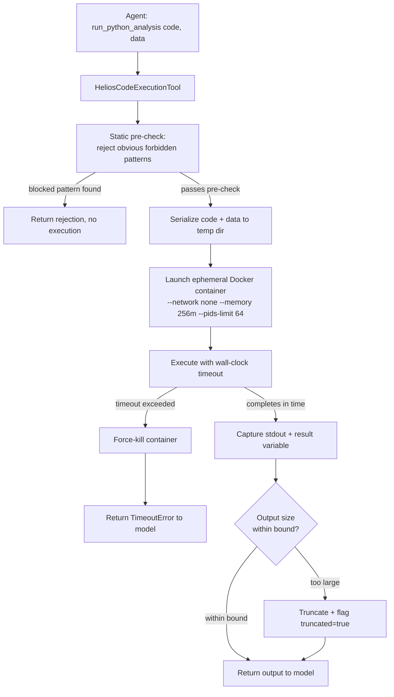

# Pattern 07 — Code Execution Tool

> **Series:** Tool-Use Patterns (18 total) — Helios Fraud Platform Edition
> **Stack:** Python 3.12, LangChain 1.3.x, LangGraph 1.2.x, Pydantic v2, Docker (gVisor/runsc-backed sandbox)
> **Status:** ✅ Complete

---

## 1. What is a Code Execution Tool?

A Code Execution Tool lets the model write and run **arbitrary code on the fly** — not a pre-defined function (Pattern 01/06), but genuinely novel code the model composes to solve a problem no fixed function anticipated. The tool executes that code in a **tightly sandboxed environment** and returns the output (stdout, return value, or an error) back to the model.

This is the pattern to reach for when the *shape* of the computation can't be known ahead of time — e.g., "given this ad hoc CSV of flagged transactions, compute the 95th percentile transaction amount grouped by merchant category" is a one-off analysis, not something you'd build a permanent `compute_composite_risk_score`-style function for.

| Calculator Tool (Pattern 06) | Code Execution Tool (Pattern 07) |
|---|---|
| Fixed, pre-defined, reviewed functions | Model writes genuinely new code per request |
| No sandbox needed — it's just calling your own trusted Python | **Mandatory sandboxing** — the code is model-generated and must be treated as untrusted |
| Can't handle a shape of problem nobody anticipated | Handles ad hoc, one-off, exploratory computation |
| Zero execution risk | Real security surface: must isolate filesystem, network, memory, CPU, and time |

**The core principle:** any tool that executes model-generated code is fundamentally different from every other pattern in this series, because the *input itself* (the code) is attacker-controllable in the sense that a cleverly-crafted prompt could induce the model to generate malicious code. Sandboxing here is not optional hardening — it is the pattern's entire reason for existing safely.

---

## 2. What Problem Does It Solve?

| Problem | How a Code Execution Tool fixes it |
|---|---|
| Analysts need ad hoc data analysis (custom aggregations, one-off transformations) that no fixed function was built for | Model writes exactly the code needed for that specific question |
| Building a new reviewed Calculator function for every possible analytical question doesn't scale | Code execution handles the long tail of "one-off" requests without engineering overhead |
| Model-generated code could theoretically read secrets, access the network, or consume unbounded resources | Sandbox enforces filesystem isolation, no network access, CPU/memory/time limits |
| A crashing or infinite-looping script could hang the whole agent turn | Hard wall-clock timeout + forced kill enforced by the sandbox runtime, not the Python code itself |
| Output could be huge (e.g., printing an entire dataframe) and blow the model's context window | stdout/stderr/return value are truncated to a bounded size before returning to the model |

---

## 3. Realistic Production Problem — Helios Ad Hoc Transaction Analysis

**Context:** During a fraud investigation (Pattern 02), an analyst sometimes asks a question that doesn't map to any fixed tool: *"Among this batch of 40 flagged transactions from the CSV export, what's the average time gap between transactions for the accounts with more than 3 flagged transactions?"* This is a one-off, exploratory computation over data already fetched by earlier tool calls (Pattern 04) — exactly the kind of thing you'd normally open a Jupyter notebook for.

**The ask:** Build a `HeliosCodeExecutionTool` that:
1. Accepts a **code string** (Python) written by the model, plus a **fixed set of pre-loaded, read-only data variables** (e.g. the transaction list already fetched — never arbitrary file/network access).
2. Executes it inside a **rootless, network-disabled, resource-limited Docker sandbox container**, one fresh container per execution (no state persists between calls).
3. Enforces a hard **wall-clock timeout** (5 seconds) and **memory limit** (256MB).
4. Captures **stdout and the value of a designated `result` variable**, truncates if oversized, and returns both — never lets a raw unbounded print flood the model's context.
5. Never allows outbound network access, filesystem access outside a scratch directory, or subprocess spawning from within the sandboxed code.

---

## 4. Architecture / Flow Diagram



**Defense in depth — multiple independent layers, not just one:**
1. **Static pre-check** (fast, cheap): reject code containing obviously forbidden patterns (`import os`, `import subprocess`, `open(`, `socket`, `__import__`) before even spinning up a container — belt-and-suspenders, not a substitute for sandboxing.
2. **Container isolation**: `--network none` (no network at all), read-only root filesystem except a scratch `/tmp`, non-root user, dropped Linux capabilities.
3. **Resource limits**: CPU shares capped, memory hard-limited (OOM-killed if exceeded), process count limited (`--pids-limit`) to prevent fork bombs.
4. **Wall-clock timeout**: enforced from *outside* the container (by the orchestrating Python process), so even a container that ignores internal signals gets force-killed.
5. **Output bounding**: stdout/result truncated server-side before ever reaching the model's context.

---

## 5. Complete Request → Response Flow

1. **Agent decides** it needs custom analysis and calls `run_python_analysis(code="...", data={"transactions": [...]})`.
2. **Static pre-check** scans the code string for a blocklist of dangerous patterns (imports of `os`, `sys`, `subprocess`, `socket`, `shutil`; calls to `open`, `eval`, `exec`, `__import__`). Any match → immediate rejection, no container ever starts.
3. **Data serialization** — the `data` dict (already-fetched, already-authorized data from earlier tool calls, e.g. Pattern 04's transaction results) is JSON-serialized to a file that gets mounted read-only into the container; the model's code loads it via a fixed `load_data()` helper, never arbitrary file I/O.
4. **Container launch** — a fresh, ephemeral container starts with `--network none`, `--memory=256m`, `--cpus=0.5`, `--pids-limit=64`, `--read-only`, running as a non-root user, with the code mounted read-only.
5. **Execution with external timeout** — the orchestrating process starts the container and waits up to 5 seconds; if it doesn't finish, the process force-kills the container (`docker kill`), guaranteeing the agent turn is never stalled indefinitely by runaway code.
6. **Output capture** — stdout, stderr, and the serialized value of a `result` variable the code is instructed to set, are read back from the container's output.
7. **Truncation** — if stdout or `result` exceeds a size threshold (e.g. 4KB), it's truncated with `truncated=true` flagged, so the model knows its output was cut and can adjust (e.g., "print only the summary, not every row").
8. **Container teardown** — the container is destroyed immediately after (never reused across calls — no state leaks between investigations).
9. **Result returns** to the agent loop, which continues reasoning with the (possibly truncated) computed result.

---

## 6. Why a Code Execution Tool Is the Right Pattern Here

- **Genuinely unpredictable analytical shape** — you cannot pre-build a fixed function for every possible ad hoc aggregation an analyst might ask about; code execution is the only pattern that scales to "the long tail of one-off questions."
- **Sandboxing is what makes this safe to expose at all** — without it, this pattern would be a direct remote-code-execution vector; the entire design is built around treating model-generated code as fully untrusted input.
- **Bounded blast radius** — even in the worst case (the model is somehow induced to generate malicious code), `--network none` + no filesystem access + resource limits mean the damage is contained to a disposable container that self-destructs.
- **This is fundamentally different from Pattern 06** — Calculator Tool functions are *trusted code the model merely invokes*; Code Execution Tool code is *untrusted code the model itself writes*, which is why the security model is completely different between the two patterns.

---

## 7. Production-Quality Implementation (Python)

### 7.1 Requirements

```bash
pip install "langchain==1.3.15" "langgraph==1.2.10" "langchain-anthropic==0.5.*" \
            "pydantic==2.*" "docker==7.*" "fastapi==0.115.*" "uvicorn==0.34.*"
# Requires a Docker daemon available on the host (or a gVisor/runsc runtime for
# stronger kernel-level isolation in production — recommended over default runc).
```

### 7.2 Full Code

```python
"""
Helios Code Execution Tool — Code Execution Tool Pattern
============================================================
Sandboxed, ephemeral execution of model-generated Python for ad hoc
transaction analysis. Defense in depth: static pre-check, network-disabled
container, resource limits, externally-enforced timeout, output truncation.

Run:
    export ANTHROPIC_API_KEY=sk-...
    # Requires Docker daemon running locally
    uvicorn code_execution_tool:app --reload
"""

from __future__ import annotations

import json
import logging
import re
import tempfile
import uuid
from pathlib import Path
from typing import Any

import docker
from docker.errors import ContainerError, NotFound
from fastapi import FastAPI
from langchain_core.tools import tool
from pydantic import BaseModel, Field

logger = logging.getLogger("helios.code_execution_tool")
logging.basicConfig(level=logging.INFO)


def audit_log(event: str, **fields) -> None:
    logger.info("AUDIT | event=%s | %s", event, fields)


# --------------------------------------------------------------------------
# 1. Static pre-check — fast, cheap first line of defense (NOT a substitute
#    for sandboxing; this only catches the obvious/lazy attempts).
# --------------------------------------------------------------------------

_FORBIDDEN_PATTERNS = [
    r"\bimport\s+os\b", r"\bimport\s+sys\b", r"\bimport\s+subprocess\b",
    r"\bimport\s+socket\b", r"\bimport\s+shutil\b", r"\bimport\s+ctypes\b",
    r"\b__import__\s*\(", r"\bopen\s*\(", r"\beval\s*\(", r"\bexec\s*\(",
    r"\bcompile\s*\(", r"\bglobals\s*\(", r"\bgetattr\s*\(.*__",
]
_FORBIDDEN_RE = re.compile("|".join(_FORBIDDEN_PATTERNS))

MAX_CODE_LENGTH = 4000
MAX_OUTPUT_BYTES = 4096
EXECUTION_TIMEOUT_SECONDS = 5
CONTAINER_MEMORY_LIMIT = "256m"
CONTAINER_CPU_QUOTA = 0.5


class CodeRejectedError(Exception):
    pass


def static_precheck(code: str) -> None:
    if len(code) > MAX_CODE_LENGTH:
        raise CodeRejectedError(f"Code exceeds max length of {MAX_CODE_LENGTH} chars")
    match = _FORBIDDEN_RE.search(code)
    if match:
        raise CodeRejectedError(f"Code contains forbidden pattern: '{match.group(0)}'")


# --------------------------------------------------------------------------
# 2. Result schema
# --------------------------------------------------------------------------

class CodeExecutionResult(BaseModel):
    success: bool
    stdout: str = ""
    result_value: Any = None
    error: str | None = None
    truncated: bool = False
    execution_time_ms: int = 0


# --------------------------------------------------------------------------
# 3. Sandbox runner
# --------------------------------------------------------------------------

# The harness wraps model code so it can only interact with pre-loaded data
# via load_data(), and must set a `result` variable rather than doing
# arbitrary file/network I/O.
_EXECUTION_HARNESS = """
import json
import sys

def load_data():
    with open("/sandbox/data.json") as f:
        return json.load(f)

result = None

{user_code}

print("___RESULT_START___")
print(json.dumps(result, default=str))
print("___RESULT_END___")
"""


class HeliosCodeExecutionTool:
    def __init__(self):
        self._docker = docker.from_env()

    def run(self, code: str, data: dict) -> CodeExecutionResult:
        import time
        start = time.monotonic()

        try:
            static_precheck(code)
        except CodeRejectedError as exc:
            audit_log("code_rejected_static_precheck", reason=str(exc))
            return CodeExecutionResult(success=False, error=f"Rejected: {exc}")

        run_id = str(uuid.uuid4())[:8]
        with tempfile.TemporaryDirectory(prefix=f"helios-sandbox-{run_id}-") as tmp_dir:
            tmp_path = Path(tmp_dir)
            (tmp_path / "data.json").write_text(json.dumps(data, default=str))
            (tmp_path / "script.py").write_text(
                _EXECUTION_HARNESS.format(user_code=code)
            )

            container = None
            try:
                container = self._docker.containers.run(
                    image="python:3.12-slim",
                    command=["python", "/sandbox/script.py"],
                    volumes={str(tmp_path): {"bind": "/sandbox", "mode": "ro"}},
                    working_dir="/sandbox",
                    network_disabled=True,          # no network access at all
                    mem_limit=CONTAINER_MEMORY_LIMIT,
                    nano_cpus=int(CONTAINER_CPU_QUOTA * 1e9),
                    pids_limit=64,                   # prevent fork bombs
                    read_only=True,                  # immutable root filesystem
                    user="nobody",                    # non-root execution
                    detach=True,
                    security_opt=["no-new-privileges"],
                    cap_drop=["ALL"],
                )
                exit_status = container.wait(timeout=EXECUTION_TIMEOUT_SECONDS)
                raw_output = container.logs(stdout=True, stderr=True).decode(
                    "utf-8", errors="replace"
                )

                elapsed_ms = int((time.monotonic() - start) * 1000)

                if exit_status.get("StatusCode", 1) != 0:
                    audit_log("code_execution_failed", run_id=run_id,
                              exit_code=exit_status.get("StatusCode"))
                    return CodeExecutionResult(
                        success=False,
                        stdout=raw_output[:MAX_OUTPUT_BYTES],
                        error="Script exited with a non-zero status (see stdout for traceback)",
                        execution_time_ms=elapsed_ms,
                    )

                return self._parse_output(raw_output, elapsed_ms, run_id)

            except docker.errors.APIError as exc:
                # Covers timeout-related and daemon-level errors
                audit_log("code_execution_timeout_or_error", run_id=run_id, error=str(exc))
                return CodeExecutionResult(
                    success=False,
                    error="Execution timed out or the sandbox failed to run.",
                    execution_time_ms=int((time.monotonic() - start) * 1000),
                )
            finally:
                if container is not None:
                    try:
                        container.remove(force=True)  # always destroy, never reuse
                    except NotFound:
                        pass

    @staticmethod
    def _parse_output(raw_output: str, elapsed_ms: int, run_id: str) -> CodeExecutionResult:
        stdout_part = raw_output
        result_value = None

        if "___RESULT_START___" in raw_output and "___RESULT_END___" in raw_output:
            pre, rest = raw_output.split("___RESULT_START___", 1)
            result_json, post = rest.split("___RESULT_END___", 1)
            stdout_part = pre + post
            try:
                result_value = json.loads(result_json.strip())
            except json.JSONDecodeError:
                result_value = None

        truncated = False
        if len(stdout_part) > MAX_OUTPUT_BYTES:
            stdout_part = stdout_part[:MAX_OUTPUT_BYTES]
            truncated = True

        audit_log("code_execution_success", run_id=run_id,
                  execution_time_ms=elapsed_ms, truncated=truncated)

        return CodeExecutionResult(
            success=True,
            stdout=stdout_part.strip(),
            result_value=result_value,
            truncated=truncated,
            execution_time_ms=elapsed_ms,
        )


# --------------------------------------------------------------------------
# 4. Thin LangChain tool wrapper
# --------------------------------------------------------------------------

_executor = HeliosCodeExecutionTool()


@tool
def run_python_analysis(code: str, data: dict) -> dict:
    """Run custom Python code for ad hoc data analysis over already-fetched
    data (e.g. a list of transactions from an earlier tool call). Your code
    runs in an isolated sandbox with NO network access and NO file access
    besides the provided data. Access the data via load_data(). Set a
    variable named `result` to whatever you want returned (must be
    JSON-serializable). Use print() sparingly -- only print what's needed,
    since output is truncated at 4KB. Do not import os, sys, subprocess,
    socket, or use open()/eval()/exec() -- these are blocked and your call
    will be rejected before it even runs."""
    result = _executor.run(code, data)
    return result.model_dump()


# --------------------------------------------------------------------------
# 5. FastAPI surface
# --------------------------------------------------------------------------

app = FastAPI(title="Helios Code Execution Tool — Code Execution Tool Pattern")


class RunCodeRequest(BaseModel):
    code: str = Field(..., max_length=MAX_CODE_LENGTH)
    data: dict = Field(default_factory=dict)


@app.post("/code/run", response_model=CodeExecutionResult)
def run_code_endpoint(req: RunCodeRequest) -> CodeExecutionResult:
    return _executor.run(req.code, req.data)
```

### 7.3 Example: Ad Hoc Analysis

```text
POST /code/run
{
  "code": "txns = load_data()['transactions']\nfrom collections import Counter\naccount_counts = Counter(t['account_id'] for t in txns)\nrepeat_accounts = [a for a, c in account_counts.items() if c > 3]\nresult = {'repeat_offender_accounts': repeat_accounts, 'count': len(repeat_accounts)}",
  "data": {"transactions": [{"account_id": "ACC-1", "amount": 500}, {"account_id": "ACC-1", "amount": 20}, {"account_id": "ACC-1", "amount": 15}, {"account_id": "ACC-1", "amount": 8}, {"account_id": "ACC-2", "amount": 1000}]}
}
```

```json
{
  "success": true,
  "stdout": "",
  "result_value": {"repeat_offender_accounts": ["ACC-1"], "count": 1},
  "error": null,
  "truncated": false,
  "execution_time_ms": 412
}
```

### 7.4 Example: Rejected Malicious Attempt

```text
POST /code/run
{"code": "import os\nos.system('cat /etc/passwd')", "data": {}}
```

```json
{
  "success": false,
  "stdout": "",
  "result_value": null,
  "error": "Rejected: Code contains forbidden pattern: 'import os'",
  "truncated": false,
  "execution_time_ms": 0
}
```

Note: `execution_time_ms: 0` confirms the container was **never even started** — the static pre-check caught this before any sandbox resources were spent.

### 7.5 Testing Sandbox Guarantees

```python
# tests/test_code_execution_tool.py
from code_execution_tool import HeliosCodeExecutionTool, static_precheck, CodeRejectedError
import pytest


def test_forbidden_import_rejected_before_execution():
    with pytest.raises(CodeRejectedError):
        static_precheck("import subprocess\nsubprocess.run(['ls'])")


def test_network_access_impossible_even_if_precheck_bypassed():
    tool = HeliosCodeExecutionTool()
    # Even code that tries to use urllib (not on our forbidden-pattern list,
    # deliberately, to prove the CONTAINER isolation is the real defense,
    # not just the regex) must fail because network_disabled=True at the
    # container level.
    result = tool.run(
        code="import urllib.request\nresult = urllib.request.urlopen('http://example.com', timeout=2).status",
        data={},
    )
    assert result.success is False


def test_infinite_loop_is_force_killed_by_timeout():
    tool = HeliosCodeExecutionTool()
    result = tool.run(code="while True:\n    pass", data={})
    assert result.success is False
    assert result.execution_time_ms < 10000  # killed well before hanging forever


def test_large_output_is_truncated():
    tool = HeliosCodeExecutionTool()
    result = tool.run(code="print('x' * 100000)\nresult = 'done'", data={})
    assert result.truncated is True
    assert len(result.stdout) <= 4096
```

---

## Key Takeaways

- Code Execution Tools handle the **long tail of ad hoc, unpredictable analysis** that fixed Calculator functions (Pattern 06) can't anticipate — but they carry a fundamentally different security profile, because the code itself is model-generated and must be treated as untrusted.
- **Defense in depth, always**: static pre-check + network-disabled container + resource limits + externally-enforced timeout + output truncation. No single layer is sufficient alone — the static pre-check especially is *not* a real security boundary by itself, only a cheap first filter.
- **Externally-enforced timeouts matter** — a timeout implemented only inside the executed code can't be trusted, since that's exactly the code you don't trust; the kill signal must come from the orchestrating process outside the sandbox.
- **Ephemeral, single-use containers** — never reuse a sandbox container across calls; this prevents any state or side effect from leaking between investigations.
- **Bound all output** — an unbounded `print()` from model-generated code is a context-window and cost risk just as much as a security one.

---

**Next up → Pattern 08: Browser Tool** (giving the agent controlled, auditable access to browse and extract information from external web pages — e.g. verifying a merchant's public reputation during an investigation).
