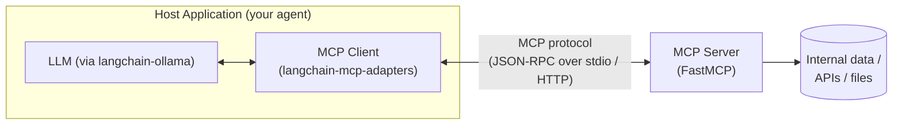
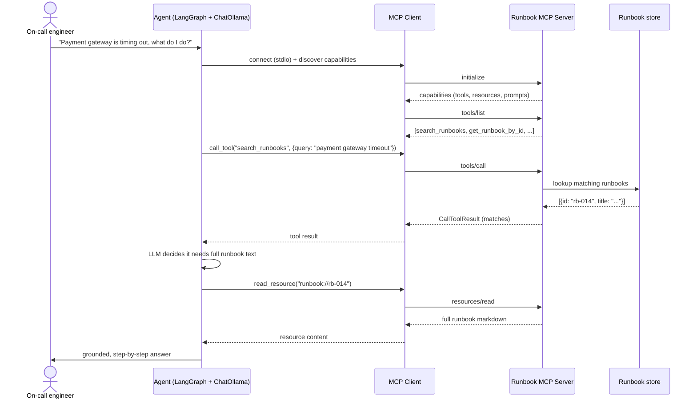

# Pattern 1: MCP Fundamentals

[← Back to index](./README.md)

## 1. Introduce the pattern

The **Model Context Protocol (MCP)** is an open, standardized protocol that lets an LLM
application (the **host**) talk to external systems — databases, internal APIs, file stores,
SaaS tools — through a common interface, instead of a custom one-off integration for each system.

Think of it as **"USB-C for AI applications"**: any MCP-compatible host can plug into any
MCP-compatible server, and the server doesn't need to know or care which LLM, framework, or
vendor is on the other end.

MCP defines three roles that always show up in every pattern in this series:

- **Host** — the application the user actually talks to (your agent, your chat app). It owns the
  LLM and decides when to use external context.
- **Client** — lives inside the host, and speaks the MCP protocol to exactly one server. A host
  can run many clients (one per server) at once.
- **Server** — a lightweight process that exposes capabilities: **Resources** (data), **Tools**
  (actions), and **Prompts** (reusable templates). A server knows nothing about the LLM — it just
  answers protocol requests.



## 2. The problem it solves

Before MCP, every team that wanted an LLM to use internal data built its own bespoke glue code:
a custom function for "search the wiki," another for "query the ticket system," another for
"read this database." None of it was reusable — the fintech's support bot and its DevOps bot each
re-implemented their own wiki search, slightly differently, with different auth handling and
different bugs.

MCP solves this by standardizing the **contract**, not the implementation:

- A team that owns the internal wiki builds **one** MCP server for it, once.
- Every agent in the company — support bot, DevOps bot, onboarding assistant — can now connect to
  that same server and get the same reliable, tested access.
- The server can be swapped, load-balanced, or reused by tools written in a different language or
  framework, because MCP itself is transport- and vendor-neutral.

In short: MCP turns "N agents × M data sources" custom integrations into "N + M" — you write one
server per data source and one client per agent framework, and they all interoperate.

## 3. A realistic production scenario

**Scenario: Incident Runbook Assistant for a platform engineering team.**

A mid-size fintech has dozens of internal "runbooks" — short documents describing how to respond
to specific production incidents (e.g. "Payment gateway timeout," "Database replica lag"). During
an incident, an on-call engineer wastes precious minutes searching an internal wiki for the right
runbook.

The platform team wants an LLM assistant that can:

1. Search runbooks by keyword or symptom description (a **tool**).
2. Pull the full text of a specific runbook once found (a **resource**).
3. Kick off a structured triage conversation using a standard template (a **prompt**).

Rather than hard-coding "runbook search" into every future agent (the incident bot today, a
Slack bot tomorrow, a CLI tool next quarter), the platform team exposes runbooks through **one MCP
server**. Any current or future host can connect to it.

## 4. Architecture / flow diagram



## 5. The complete request-to-response flow

1. **Startup & discovery.** The host launches (or connects to) the MCP server and performs the
   `initialize` handshake. The server responds with its declared **capabilities** — which of
   tools, resources, prompts it supports.
2. **Capability listing.** The client asks `tools/list`, `resources/list`, and `prompts/list`.
   These are converted into LangChain-compatible objects by `langchain-mcp-adapters`, so the LLM
   sees them exactly like any other LangChain tool.
3. **User turn.** The engineer's message enters the LangGraph agent as normal.
4. **Model decides to act.** `ChatOllama` (with tool-calling enabled) sees `search_runbooks` in
   its available tools and decides to call it based on the user's symptom description.
5. **Tool execution over MCP.** The LangGraph agent invokes the LangChain tool wrapper, which
   sends a `tools/call` JSON-RPC request through the MCP client to the server. The server runs the
   actual Python function and returns a `CallToolResult`.
6. **Resource fetch (if needed).** If the model needs the full runbook body rather than just the
   search hit, it (or the host logic) issues a `resources/read` request for
   `runbook://{id}`, which the server resolves against its data store.
7. **Response synthesis.** The tool/resource results are appended to the conversation as tool
   messages. The LLM reads them and produces a final, grounded natural-language answer.
8. **Shutdown.** When the host is done, the client closes the session (and, for stdio, the child
   process is terminated).

Nothing in steps 4–7 is aware of *how* the runbook data is stored — that's the server's job. This
separation is the entire point of the pattern.

## 6. Why this pattern is appropriate

- **Decoupling**: the runbook storage (today: an in-memory dict; tomorrow: Postgres or
  Confluence) can change without touching a single agent.
- **Reuse**: the same server powers the incident bot, a future Slack integration, and a CLI tool,
  with zero duplicated integration code.
- **Least privilege**: the server only exposes the specific tools/resources it chooses to — it's a
  natural boundary for access control (see Pattern 10, MCP Security).
- **Model-agnostic**: because `ChatOllama` is swapped in here, but the same MCP server would work
  unchanged with any other LangChain chat model.

The trade-off: MCP adds a process boundary and a protocol hop compared to calling a Python
function directly. For a single, throwaway script this is overkill — the pattern earns its keep
once more than one host or more than one data source is involved.

## 7. Production-quality implementation

### 7.1 Install dependencies

```bash
pip install "mcp[cli]>=1.28,<2" "langchain-mcp-adapters>=0.2" \
            "langgraph>=1.2" "langchain-ollama>=0.3"
ollama pull llama3.1
```

### 7.2 The MCP server — `runbook_server.py`

This process knows nothing about LLMs. It just exposes runbook data over the MCP protocol.

```python
"""
runbook_server.py

A production-style MCP server exposing an internal "incident runbook" store as:
  - a Tool:      search_runbooks(query)      -> model-controlled action
  - a Resource:  runbook://{runbook_id}       -> application-controlled data
  - a Prompt:    incident_triage(service)     -> user-controlled template

Run directly for local development (stdio transport):
    python runbook_server.py
"""

from __future__ import annotations

import logging
from dataclasses import dataclass, field

from mcp.server.fastmcp import FastMCP

logging.basicConfig(level=logging.INFO)
logger = logging.getLogger("runbook_server")


@dataclass(frozen=True)
class Runbook:
    """A single incident runbook."""

    id: str
    title: str
    symptoms: tuple[str, ...]
    body: str


# --------------------------------------------------------------------------
# In-memory "data source". In production this would be a database call,
# an internal wiki API, or a document store — the tool/resource functions
# below are the ONLY thing that would need to change.
# --------------------------------------------------------------------------
_RUNBOOKS: dict[str, Runbook] = {
    "rb-014": Runbook(
        id="rb-014",
        title="Payment Gateway Timeout",
        symptoms=("payment gateway timeout", "checkout hanging", "504 on /pay"),
        body=(
            "## Payment Gateway Timeout\n\n"
            "1. Check gateway provider status page first.\n"
            "2. Inspect `payments-svc` p99 latency in the dashboard.\n"
            "3. If provider is healthy, roll back the last `payments-svc` deploy.\n"
            "4. Page the payments on-call if unresolved after 15 minutes.\n"
        ),
    ),
    "rb-021": Runbook(
        id="rb-021",
        title="Database Replica Lag",
        symptoms=("replica lag", "stale reads", "read replica behind"),
        body=(
            "## Database Replica Lag\n\n"
            "1. Check replication lag metric in the DB dashboard.\n"
            "2. Identify long-running write transactions on the primary.\n"
            "3. If lag exceeds 60s, temporarily route reads to the primary.\n"
            "4. Escalate to the DBA on-call if lag doesn't recover in 10 minutes.\n"
        ),
    ),
}


def _find_matches(query: str) -> list[Runbook]:
    """Naive keyword search over titles and symptoms (swap for real search in prod)."""
    q = query.lower()
    return [
        rb
        for rb in _RUNBOOKS.values()
        if q in rb.title.lower() or any(q in s for s in rb.symptoms)
    ]


mcp = FastMCP(
    name="runbook-server",
    instructions=(
        "Provides search over internal incident runbooks and the full text of a "
        "runbook once its ID is known. Use search_runbooks first, then read the "
        "runbook:// resource for the matching ID."
    ),
)


@mcp.tool()
def search_runbooks(query: str) -> list[dict[str, str]]:
    """Search internal incident runbooks by symptom or keyword.

    Args:
        query: A short description of the symptom or incident, e.g.
            "payment gateway timeout" or "replica lag".

    Returns:
        A list of matching runbooks with their id and title. Use the id to
        fetch the full runbook via the runbook://{id} resource.
    """
    matches = _find_matches(query)
    logger.info("search_runbooks(%r) -> %d matches", query, len(matches))
    return [{"id": rb.id, "title": rb.title} for rb in matches]


@mcp.resource("runbook://{runbook_id}")
def get_runbook(runbook_id: str) -> str:
    """Fetch the full markdown body of a runbook by its id."""
    runbook = _RUNBOOKS.get(runbook_id)
    if runbook is None:
        return f"No runbook found with id '{runbook_id}'."
    return runbook.body


@mcp.prompt(title="Incident Triage")
def incident_triage(service: str) -> str:
    """Generate a structured triage prompt for a given service."""
    return (
        f"An incident has been reported for the '{service}' service. "
        "Search the runbooks for relevant guidance, summarize the top matching "
        "runbook's steps, and ask the engineer which step they've already tried."
    )


if __name__ == "__main__":
    # stdio is the right transport for a server launched as a local subprocess
    # by the host (see Pattern 2: MCP Client). For a shared, always-on server,
    # use transport="streamable-http" instead (covered in Pattern 3).
    mcp.run(transport="stdio")
```

### 7.3 The host / client — `incident_agent.py`

This is the process the engineer actually talks to. It launches the server as a subprocess,
discovers its capabilities, and wires them into a LangGraph agent backed by a local Ollama model.

```python
"""
incident_agent.py

Host application: connects to the runbook MCP server, exposes its tools to a
LangGraph ReAct agent powered by a local Ollama model, and answers an
engineer's incident question end to end.

Run:
    python incident_agent.py
"""

from __future__ import annotations

import asyncio
import logging

from langchain_mcp_adapters.client import MultiServerMCPClient
from langchain_ollama import ChatOllama
from langgraph.prebuilt import create_react_agent

logging.basicConfig(level=logging.INFO)
logger = logging.getLogger("incident_agent")


async def build_agent(mcp_client: MultiServerMCPClient):
    """Discover MCP tools and wire them into a LangGraph agent."""
    tools = await mcp_client.get_tools()
    logger.info("Discovered %d MCP tool(s): %s", len(tools), [t.name for t in tools])

    model = ChatOllama(model="llama3.1", temperature=0)

    system_prompt = (
        "You are an on-call incident assistant. When an engineer describes a "
        "symptom, use search_runbooks to find relevant runbooks, then read the "
        "matching runbook resource for the full steps before answering. Always "
        "ground your answer in the runbook content — never invent steps."
    )

    return create_react_agent(model, tools, prompt=system_prompt)


async def main() -> None:
    # MultiServerMCPClient manages one or more MCP server connections and
    # exposes their tools as plain LangChain tools. Here we launch the
    # runbook server as a local subprocess over stdio.
    mcp_client = MultiServerMCPClient(
        {
            "runbooks": {
                "command": "python",
                "args": ["runbook_server.py"],
                "transport": "stdio",
            }
        }
    )

    agent = await build_agent(mcp_client)

    question = "The payment gateway is timing out during checkout, what should I do?"
    logger.info("Engineer: %s", question)

    result = await agent.ainvoke({"messages": [{"role": "user", "content": question}]})

    final_message = result["messages"][-1]
    print("\n--- Assistant response ---")
    print(final_message.content)


if __name__ == "__main__":
    asyncio.run(main())
```

### 7.4 What happens when you run it

1. `incident_agent.py` starts `runbook_server.py` as a subprocess and speaks MCP over its
   stdin/stdout.
2. `mcp_client.get_tools()` performs the `initialize` handshake and `tools/list`, returning a
   LangChain `StructuredTool` for `search_runbooks`.
3. The LangGraph ReAct agent (`create_react_agent`) receives the engineer's question, and
   `llama3.1` — seeing `search_runbooks` in its tool list — emits a tool call with
   `{"query": "payment gateway timeout"}`.
4. LangGraph executes the tool, which round-trips through the MCP client to the server and back
   with the matching runbook's `id` and `title`.
5. The agent loop continues; the model produces a grounded final answer citing the runbook steps
   (in this minimal example the model summarizes from the tool result — Pattern 4, MCP Resources,
   shows how to have it explicitly pull the full resource body first).

That's the complete fundamentals loop: **discover → decide → call → respond**, with the data
source fully decoupled from the agent. The next pattern (**MCP Client**) digs into everything the
client is doing under the hood — connection lifecycle, multiple servers, and error handling.

---

[← Back to index](./README.md)
