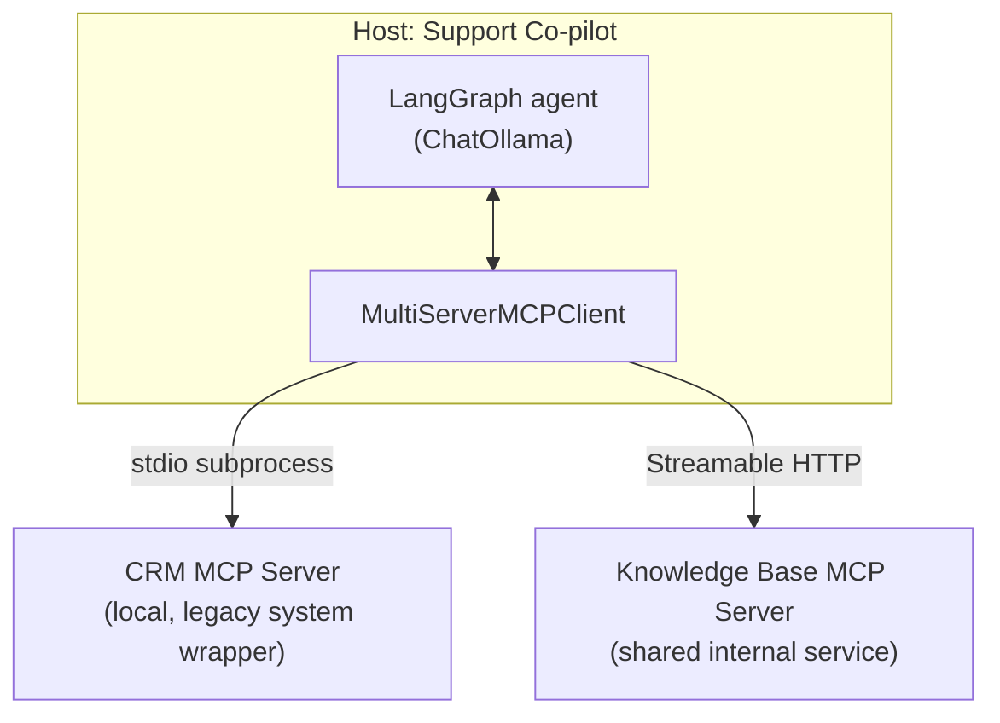
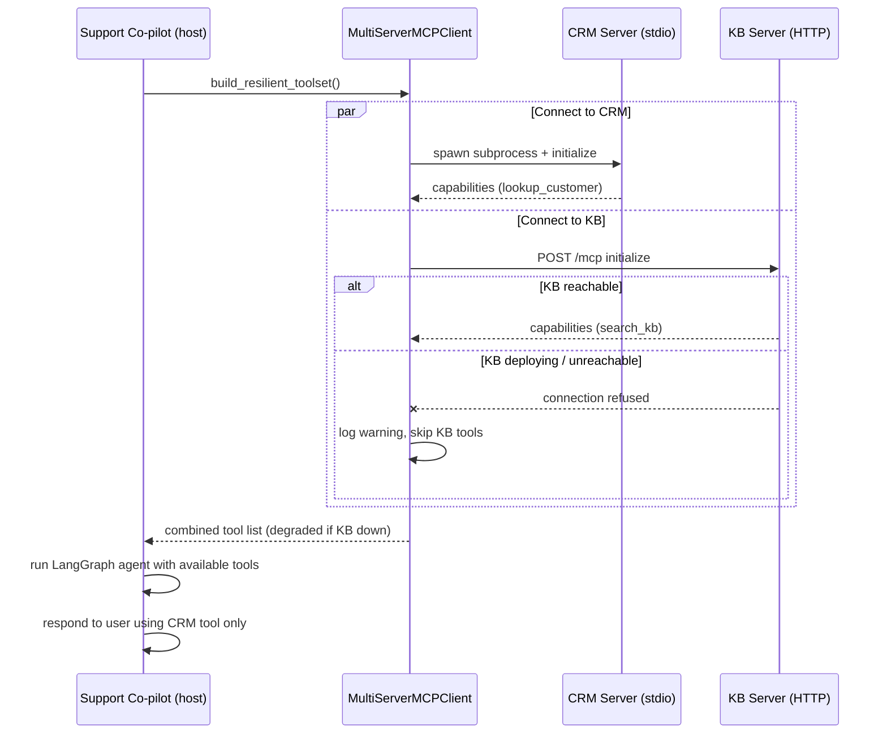

# Pattern 2: MCP Client

[← Back to index](./README.md)

## 1. Introduce the pattern

The **MCP Client** is the piece that lives inside your host application and does the actual
protocol work: opening a connection to a server, performing the `initialize` handshake, listing
capabilities, translating them into objects your framework understands (LangChain tools, in this
series), and sending `tools/call` / `resources/read` requests as the LLM decides to use them.

A host almost never talks to just one server. A real assistant might need a CRM, a knowledge
base, a ticketing system, and an internal search index — each is a **separate MCP server**, each
possibly on a **different transport** (a local subprocess over stdio, or a shared service over
Streamable HTTP). The client layer's job is to manage all of these connections uniformly, and —
critically for production — to keep the host usable even when one of them is unavailable.



## 2. The problem it solves

Without a proper client abstraction, every host that wants to use more than one MCP server ends
up re-solving the same hard problems, badly and inconsistently:

- **Transport differences** — stdio needs to spawn and manage a subprocess; Streamable HTTP needs
  connection pooling, headers, and possibly auth tokens. Code that hard-codes one transport can't
  reuse a server built for the other.
- **Partial failure** — if the KB server's host is being redeployed, should the entire support
  co-pilot go down? Almost never — it should keep working with whatever servers *are* reachable.
- **Capability translation** — an MCP `Tool` isn't a LangChain `BaseTool`; something has to
  convert schemas, argument validation, and result parsing consistently, every time.
- **Lifecycle management** — sessions need to be opened once (not per call, where avoidable),
  and cleanly torn down on shutdown so subprocesses don't leak.

`langchain-mcp-adapters`' `MultiServerMCPClient` exists specifically to solve these four problems
so your agent code never touches raw JSON-RPC.

## 3. A realistic production scenario

**Scenario: Customer Support Co-pilot** at the same fintech, this time built by the support
tooling team. The co-pilot needs two independent capabilities:

1. **CRM lookup** — a small, legacy internal tool. It's wrapped as a local MCP server launched as
   a subprocess (**stdio transport**) because it isn't network-exposed yet.
2. **Knowledge base search** — a shared, always-on internal service that multiple teams' agents
   use. It's exposed over **Streamable HTTP** at `http://kb-internal:8000/mcp`.

Requirement from the support team: **if the knowledge base service is being deployed and is
briefly unreachable, the co-pilot should still answer CRM questions** — it should degrade
gracefully rather than fail the whole conversation.

## 4. Architecture / flow diagram



## 5. The complete request-to-response flow

1. **Configuration.** The host declares its servers once, as data — a dict mapping a logical
   server name to its connection details (command + args for stdio, or a URL for HTTP).
2. **Independent connection attempts.** For each server, the client opens a session and performs
   `initialize`. This happens concurrently (`asyncio.gather`), not one-by-one, so one slow server
   doesn't delay the others.
3. **Per-server timeout and fallback.** Each connection attempt is wrapped in
   `asyncio.wait_for(...)`. If a server doesn't respond within the timeout, or raises a connection
   error, the client logs a warning and returns an **empty tool list for that server only** —
   it never raises out of the whole startup.
4. **Capability translation.** For every server that *did* respond, `get_tools()` converts each
   MCP `Tool` (JSON Schema input, description) into a LangChain `StructuredTool` whose `.ainvoke`
   transparently issues a `tools/call` over that server's session.
5. **Tool aggregation.** The host merges tool lists from all reachable servers into one flat list
   handed to the LangGraph agent — the agent doesn't know or care which tool came from which
   server or transport.
6. **Normal agent turn.** The user's message is processed as usual; the model picks whichever
   tools are available (in our scenario: only `lookup_customer`, since `search_kb` didn't load).
7. **Session cleanup.** On shutdown, sessions are closed (subprocess terminated for stdio,
   connection released for HTTP) via the client's async context management.

## 6. Why this pattern is appropriate

- **Resilience**: a support agent that answers *some* questions beats one that answers *none*
  because an unrelated backend was mid-deploy.
- **Transport transparency**: the CRM server can move from stdio to HTTP later (e.g. once it's
  containerized) by changing one config entry — no agent code changes.
- **Operational clarity**: per-server timeouts and structured warnings make it obvious in logs
  *which* integration is degraded, instead of one opaque agent-wide failure.

Trade-off: swallowing per-server connection errors means the agent can silently run with fewer
capabilities than expected. Production systems should surface degraded state (e.g. a health
metric or a note to the user: *"knowledge base search is temporarily unavailable"*) rather than
failing completely silently — the implementation below logs this clearly for that reason.

## 7. Production-quality implementation

### 7.1 Install dependencies

```bash
pip install "mcp[cli]>=1.28,<2" "langchain-mcp-adapters>=0.2" \
            "langgraph>=1.2" "langchain-ollama>=0.3" uvicorn
ollama pull llama3.1
```

### 7.2 The CRM server — `crm_server.py` (stdio)

```python
"""
crm_server.py

Small internal CRM lookup, exposed as a stdio MCP server (legacy system,
not network-exposed yet).
"""

from __future__ import annotations

from mcp.server.fastmcp import FastMCP

mcp = FastMCP(name="crm-server")

_CUSTOMERS: dict[str, dict[str, str]] = {
    "cus_1001": {"name": "Amara Okafor", "plan": "Business", "status": "active"},
    "cus_1002": {"name": "Liam Chen", "plan": "Starter", "status": "past_due"},
}


@mcp.tool()
def lookup_customer(customer_id: str) -> dict[str, str]:
    """Look up a customer's account details by their customer ID (e.g. cus_1001)."""
    return _CUSTOMERS.get(
        customer_id,
        {"error": f"No customer found with id '{customer_id}'"},
    )


if __name__ == "__main__":
    mcp.run(transport="stdio")
```

### 7.3 The knowledge base server — `kb_server.py` (Streamable HTTP)

```python
"""
kb_server.py

Shared internal knowledge base, exposed as an always-on Streamable HTTP MCP
server so multiple teams' agents can reuse it.

Run:
    python kb_server.py
Serves on http://localhost:8000/mcp
"""

from __future__ import annotations

from mcp.server.fastmcp import FastMCP

# stateless_http + json_response is the recommended config for production
# multi-node deployments (see Pattern 3: MCP Server for why).
mcp = FastMCP(name="kb-server", stateless_http=True, json_response=True)

_ARTICLES: list[dict[str, str]] = [
    {"id": "kb-201", "title": "How to update a card on file",
     "snippet": "Customers can update their card under Billing > Payment Methods."},
    {"id": "kb-207", "title": "Refund policy for annual plans",
     "snippet": "Annual plans are refundable within 14 days of purchase or renewal."},
]


@mcp.tool()
def search_kb(query: str) -> list[dict[str, str]]:
    """Search the internal knowledge base by keyword."""
    q = query.lower()
    return [a for a in _ARTICLES if q in a["title"].lower() or q in a["snippet"].lower()]


if __name__ == "__main__":
    mcp.run(transport="streamable-http")
```

### 7.4 The resilient client — `support_client.py`

```python
"""
support_client.py

Production-quality MCP client layer: connects to multiple servers on mixed
transports, isolates failures per server, and hands a combined, degraded-
if-necessary toolset to a LangGraph agent.

Run (with kb_server.py already running in another terminal):
    python support_client.py
"""

from __future__ import annotations

import asyncio
import logging

from langchain_core.tools import BaseTool
from langchain_mcp_adapters.client import MultiServerMCPClient
from langchain_ollama import ChatOllama
from langgraph.prebuilt import create_react_agent

logging.basicConfig(level=logging.INFO)
logger = logging.getLogger("support_client")

SERVER_CONFIG: dict[str, dict] = {
    "crm": {
        "command": "python",
        "args": ["crm_server.py"],
        "transport": "stdio",
    },
    "kb": {
        "url": "http://localhost:8000/mcp",
        "transport": "streamable_http",
    },
}

CONNECT_TIMEOUT_SECONDS = 5.0


async def _get_tools_with_fallback(
    client: MultiServerMCPClient, server_name: str, timeout: float = CONNECT_TIMEOUT_SECONDS
) -> list[BaseTool]:
    """Fetch tools for one server; never let one server's failure sink the rest."""
    try:
        tools = await asyncio.wait_for(
            client.get_tools(server_name=server_name), timeout=timeout
        )
        logger.info("Server '%s' ready: %s", server_name, [t.name for t in tools])
        return tools
    except TimeoutError:
        logger.warning(
            "Server '%s' did not respond within %.1fs; continuing without it",
            server_name, timeout,
        )
    except Exception as exc:  # connection refused, process failed to start, etc.
        logger.warning("Server '%s' unavailable (%s); continuing without it", server_name, exc)
    return []


async def build_resilient_toolset(client: MultiServerMCPClient) -> list[BaseTool]:
    """Connect to every configured server concurrently and merge whatever succeeds."""
    per_server_results = await asyncio.gather(
        *(_get_tools_with_fallback(client, name) for name in SERVER_CONFIG)
    )
    tools = [tool for server_tools in per_server_results for tool in server_tools]

    unavailable = [
        name
        for name, server_tools in zip(SERVER_CONFIG, per_server_results)
        if not server_tools
    ]
    if unavailable:
        logger.warning("Degraded mode: no tools loaded from %s", unavailable)

    return tools


async def main() -> None:
    client = MultiServerMCPClient(SERVER_CONFIG)
    tools = await build_resilient_toolset(client)

    if not tools:
        raise RuntimeError("No MCP servers reachable; cannot start co-pilot")

    model = ChatOllama(model="llama3.1", temperature=0)
    system_prompt = (
        "You are a customer support co-pilot. Use the available tools to answer "
        "questions about customer accounts and help-center content. If a tool "
        "you'd need isn't available, say so plainly instead of guessing."
    )
    agent = create_react_agent(model, tools, prompt=system_prompt)

    question = "What plan is customer cus_1002 on, and are they past due?"
    logger.info("Support agent: %s", question)

    result = await agent.ainvoke({"messages": [{"role": "user", "content": question}]})
    print("\n--- Assistant response ---")
    print(result["messages"][-1].content)


if __name__ == "__main__":
    asyncio.run(main())
```

### 7.5 What happens when you run it

- **Both servers up**: `build_resilient_toolset` returns four tools (`lookup_customer`,
  `search_kb`), the agent can answer both CRM and knowledge-base questions.
- **KB server not started** (try it: don't run `kb_server.py`): the `kb` connection attempt hits a
  connection error well inside the 5-second timeout, gets logged as a warning, and the agent
  starts anyway with only `lookup_customer` available — the CRM question in `main()` is answered
  normally, proving the degradation is graceful rather than fatal.
- **Clean shutdown**: `MultiServerMCPClient` manages the underlying sessions as async context
  managers internally, so the `crm_server.py` subprocess is terminated automatically when the
  process exits — no orphaned processes.

This client layer is what every later pattern in this series builds on top of. Next up:
**MCP Server** — the other side of the connection, in depth: lifespan management, structured
output, and choosing between stdio, SSE, and Streamable HTTP for real deployments.

---

[← Back to index](./README.md)
